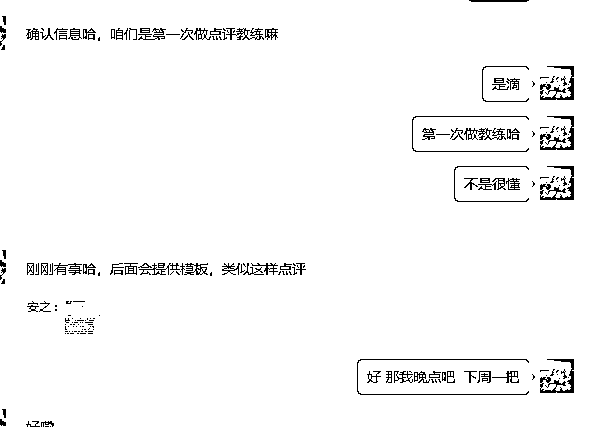
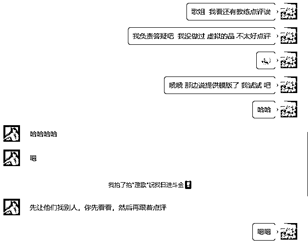
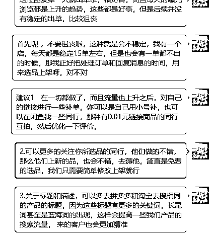
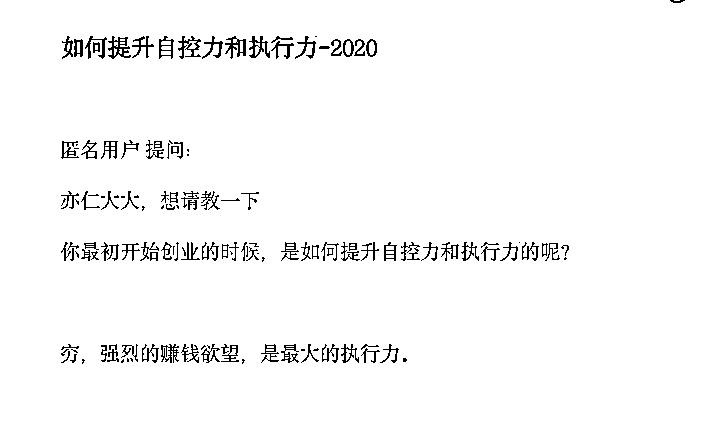
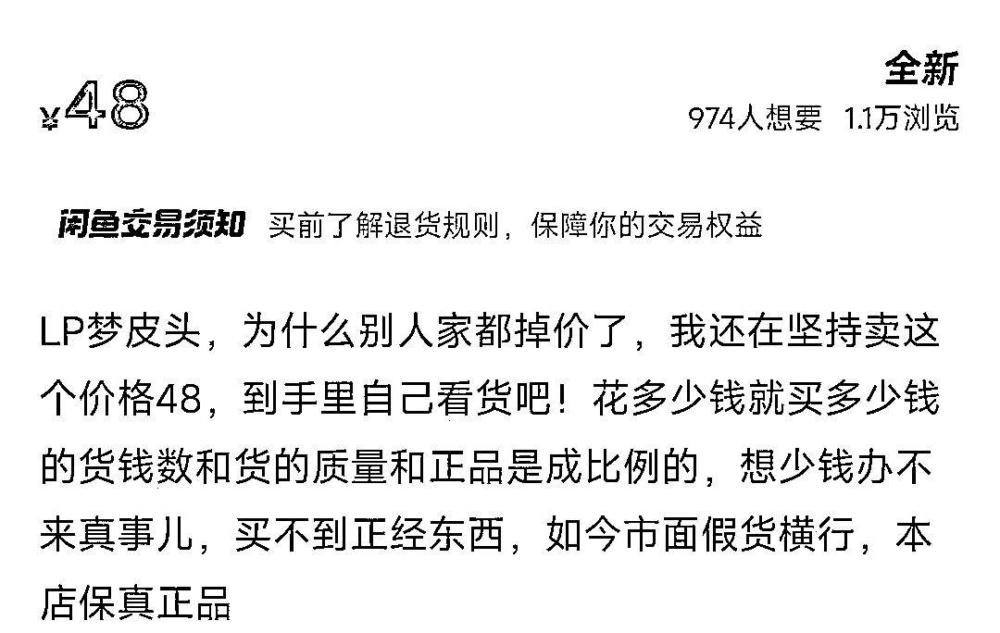
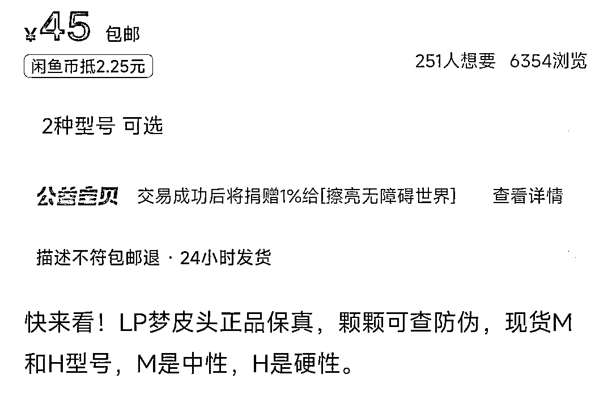

# 为什么别人行你不行？

> 来源：[https://majl4i7pcp.feishu.cn/docx/FJhsdlSJwoD2kjxSAjFcNycMnLb](https://majl4i7pcp.feishu.cn/docx/FJhsdlSJwoD2kjxSAjFcNycMnLb)

参加过很多期的航海，从船员的角度，一直看的都是如何做，第一次担教练，说实话，我很紧张，我怕我不能帮上船员，我怕我的理论错误，怕我的一个点评影响到更多的圈友……但是我想去做这件事，于是我问我自个，为啥别人行你不行呢？

（如果你行，看看第四点，就可以点个赞退出去继续干活了，）

# 一.没有勇气，你害怕，还不听话

## 1.新手常见害怕

我看了很多人的日志，和各个群的消息，发现很多重复问题（大致举例）

1.我这个链接8点上新，行么，我看谁谁谁说，怎么怎么

2.我这个被差评了，怎么办，会不会我流量掉了，我看谁谁谁说，怎么怎么

3.这个品别人都卖1元，我卖0.7，现在又有0.5了，咋整

4.昨天曝光5000，今天曝光4000，是不是我违规了，怎么越来越少

…………

问的基本都是想的比做的多，不知道几点上新好的就挨个点试，差评就回复你自己的产品有多好，别人比你贵能卖，更贵也能卖，也许你今天1W明天就2000曝光还可能2W曝光……

别怕，别担心，多去操作，把没做之前的各种联想都停一停，

没被油烫过，你好意思说你会做饭么？

没变黄过，你好意思说你酷爱砂糖橘么？

没封店过，你好意思说你干过电商么？

记得《知否》里面顾廷烨说小公爷，你往前怕三步，往后怕五步，那你什么事也别合计了！明兰都要和顾廷烨结婚了，他还在那合计呢

有的呢，告诉他怎么做了，还要问好几个自己想出来的问题，结果回头还是没做，你问问题是来解决的，不是要验证是不是和你想的一样，也不是为了在这做可能性大问答，

怕违规，怕没流量，怕同行举报……一天一个链接没上，吓得直哆嗦，为啥这么说，因为我也这个熊样

## 2.个人感受

对，我们大家都一样，我怕当不好教练，大家怕做不好店铺，第一次点评之前，我是这样的

对的，我心里害怕，但是我想做，我去读虚拟相关的规则，找虚拟相关的产品，上架虚拟产品，搜虚拟同行的课程挨个阅读，然后到了我第一次点评，我把要点评的学员的每一篇日志都看了，从操作到心理都认真研究了一下

——简单方法

我把圈友的心理和操作方法都做了点评，也分享了我自己最常用最简单实用的选品方法，没有什么奇技淫巧，只是去把我能想到的事情都去尽力做好，结果

对，一些圈友特意加过来只为说句感谢，这一刻开始，我不害怕了，恐惧全无，甚至有些得意。

害，多少有点王婆卖瓜了，但我想说的是——做好该做的，结果不会太差的

大家是副业做闲鱼，那最差最差的结果就是做不起来，你还是之前的你，并没有什么损失，所以大胆点，放心干

# 二，根深蒂固的学习模式

基于我们从小的教育问题，大家的很多问题都是想要确定性的答案

上学时候，老师这个写几页？老师这个考试会出么？老师这个解题有简便算法么？……

做闲鱼了，一天可以上几个链接？这个链接上了会出单么？能不能快速上架产品呢？……

这些问题根本不是问题，时间多了就多上几个品，出单了就多做一些相关的，不出单就换，这个链接上完就上下一个链接，做完基本的事情之后再去学习和思考，

我想下回要是航海，人少点，就50-100人一个航海，一个老师几个学习委员，每天布置任务，学习委员检查，完成不了的就点名拉出来问问咋回事，能不能完成，3次完成不了就直接下船，卖什么货，怎么卖都给安排好，上船要做的就是听话，完成任务，出单挣钱。还原上学模式，更快形成0-1闭环

# 三，不够信，不缺钱，执行力拉胯

华严经里面有话：信为道源功德母，长养一切诸善根。意思是你要修行首先要深信不疑呀。挣钱亦如此我发现那些

0-1闭环快的人，看完手册就已经上手实操了，直接开干，遇到问题解决问题，不行的呢，看完了一堆问题，这里能么？那里会不会违规？

又因为是副业，可有可无，所以很多人根本没有当回事！有的说没时间选品，有的说没时间上架，想想你热恋初恋那会，只要有时间就要发个消息，从来没有想着有没有时间这回事，打开你的手机屏幕时间管理，刷短视频的时间，完全够你做闲鱼了！

心在哪里时间就在哪里！

# 四，没有好的分析习惯（重点看看）

选品的时候，一定要看其他同行都卖的怎么样，同行才是最好的老师，发现了好的同行，就发现了上新的秘密，一顿抄就可以了，

如果你再心细，你看下同行的爆品是什么时候开始爆的，对应的时间是怎么样的，是否到来年的那个时候，这个品还会爆发？他上的品之间有没有什么逻辑，你在他这个买东西他有没有什么话术，他的标题，主图为什么带来的曝光要高一些？……这些才是你要看的东西，而不是看一下，哇，曝光真高，哇，想要真多，这些没有任何意义，

举个栗子

因为我个人喜欢打台球，而台球有很多消耗器材，比如皮头，巧克粉，官网都贵，我就去闲鱼捡漏，我搜了一下梦皮头，这个皮头是100元一个哦

通过想要和评价的对比，我发现转化不错，好评也不错，于是我一样买了一个发现居然是一模一样的，我都换上了，打球体验也没问题，45元包邮，那么这个品最起码利润有25元左右，我搜了很多人，加了微信，最开始给我批发是35元，我拿回来卖60，卖的挺快，然后又进货，砍到30，不行，我感觉还是价格高，30他们肯定还是要挣我的钱，舍不着孩子套不到狼啊，我问了他还有多少货，他说还有30个，这种情况一般都是少说，实际我估计有60左右，我的目的是要的比他多，让他直接从源头给我发货，我要了100个，运气不错，结果和我想的一样，源头发的，为啥我要让源头发，这种源头一般都会在胶带上面留他们的联系方式，运气不错，我加上了源头微信，

这时候你可能想了，要是没有联系方式怎么办，那不是血亏，我也遇到过，但我也能根据快递单号，找到发货的人，（起因是当年在闲鱼买东西被AB单骗了，我通过单号查到了揽收员，根据揽收员，联系到了发货人，发货人说他是给我别人代发，我说你们这涉及诈骗，几十人联合报警了，到时候警察找不到那人，抓你咋办？他赶忙联系那个骗子团伙，把钱退我了，可是还有大几十人被骗，那会我贼生气，我找闲鱼，找jingcha，诉说骗子的行径和能找到骗子的方法，结果就是呵呵，没人会管的！害，满腔热血的我又一次被社会泼了一盆凉水，扯多了）

对，就这样，我现在有全网最低价的供货商，我也可以卖和他们一样的价格，甚至更低，

然后再谈快递，对，我没量，但是我敢谈，除了量以外，还要了解快递便宜的另一个因素，均重，这点我占优势，包裹极轻，所以我谈到了4元一单，全国包邮（除新疆，西藏），以后等咱量大了再砍价咯，要是谈不下来，我还有自己对接的快递平台，一单也就5元多，这样你的一起问题就解决了

所以卖货逻辑很简单

发现需求——找产品——看同行在哪如何获取流量——找货源——对标抄同行——售卖，仅此而已

把好的品和对应爆的时间做好记录，下次你也有很大机会爆，技术都是扯淡，唯有数据才会让你起飞

# 五，没有耐心

很多人上架了几个商品，一天能打开几十次发布商品那里，就想看看曝光多少，咱先不说曝光高不一定出单多，救你上了3-5个产品，再高能高到哪里去呢？然后想了为啥不出单呢？别人这个商品几百个想要，我怎么一个没有，看来这个品的大环境不行……

别到哪都大环境不行，你是改变大环境的人啊，那上架就得出单，闲鱼平台盯着你的账号，看见你上架，咔咔给你推流，不出单给目标买家都踢出闲鱼……

有点耐心（平时少刷短视频，真影响耐心），让子弹飞一会，而且闲鱼平台会有挖坟现象，比如你2月爆的链接，4月开始平淡，没有单了，突然10月又爆了，一天给你个几十单，谁也不知道为啥，我们能做的就是多上链接，多选品，多用心看同行，剩下就是等待爆单咯

因上努力，果上随缘嘛

# 六.文章最后

都已经出来混了，咋也奔着当大哥使劲，可以虚心求教，但别点头哈腰，平常心面对发生的一切事，遇到的一切人，请相信我们也是未来的大佬，如果你真有点自卑，那么请你努力变得哪怕自负，也别自卑，真的，勇敢的人才会先享受这个世界！

之前我总感觉普通人和大佬之间差点什么，最近我感受到了，差了血性和那股狠劲

我们大家都是普通人，从小接受的教育都是书本上或者在父母那学来的，而父母大部分也是普通人，教导我们总是与人为善，差不多就行。让我们受了很多不该受的苦，在社会上，在生意场上，请你降低你的道德标准和情感标准，遵守属于你自己的原则，只要不违法，不害人，用合理的方法去挣钱没有任何问题，别总感觉这不太好，那不太好的，不要玻璃心！！

一定一定要付出不亚于任何人的努力，把你的时间和体力都用到你要搞的项目上去，不会不赚钱的，买个计时器算一算咱这可怜的工作时长，然后改变它，突破它

嗯，今天你认真工作时长突破5小时了么？？