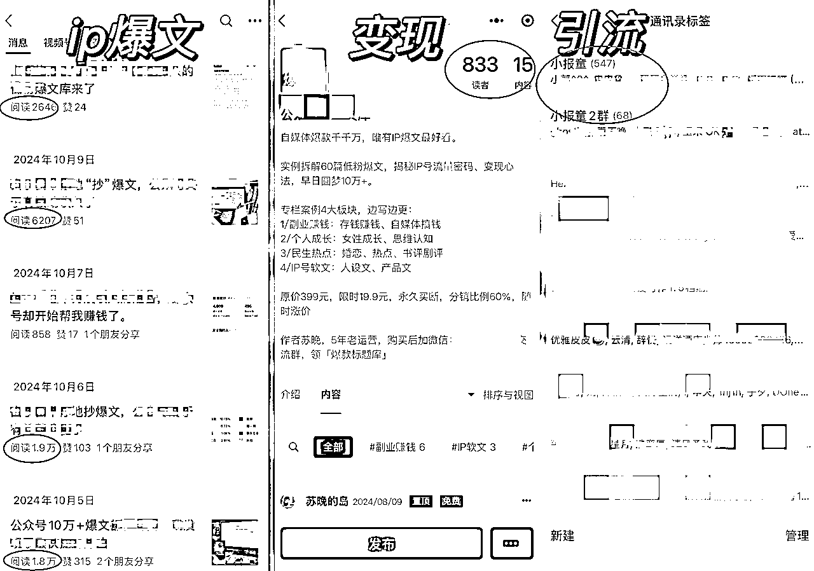
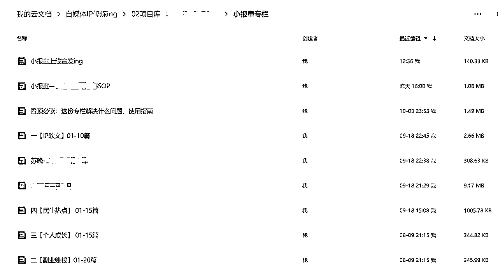

# 公众号小IP如何通过爆文冷启动，卖出千单小报童，变现5位数

> 来源：[https://l762hez4ol.feishu.cn/docx/FemodH9yQoCl2txvAvuc4cJHn0g](https://l762hez4ol.feishu.cn/docx/FemodH9yQoCl2txvAvuc4cJHn0g)

大家好，我是苏晚，5年广漂运营，专注IP爆文引流。在小报童“烂大街”的行情下，我靠几篇公众号小爆文卖出1千多份，头条阅读从200提升过千，涨粉2千+，引流1千+，我的分享主题是《公众号小IP如何通过爆文冷启动，卖出千单小报童，变现5位数》。

先来讲下背景：我是一个9千粉的公众号小IP，之前都没什么变现产品，直到去年10月尝试推了一个爆文拆解专栏，出了两篇阅读过万和多篇千阅的文章，在没有发售情况下，顺利通过爆文流量卖出了1100多份小报童，让我同时实现了爆文、流量、变现、引流。

虽然我的成绩不算很厉害，但对一个小IP来说，从没产品到拥有爆款小产品，也算是里程碑事件了，接下来我会分享这个小报童是如何2天冷启动成功，纯靠公众号爆文流量卖出1100份+的变现经验，还有我这一路做知识付费产品的经验，一定要认真看看，看懂了就是无价哈哈。这里要特别感谢梁靠谱老师帮我看帖指导~~

因为现在私域和产品都卷成麻花了，不如开拓公域流量，借助公众号爆文杀出一条新路。

# 内容大纲

1、分享我做知识付费的三个阶段

2、大胆去卖，提早规划产品线

3、做小报童，怎么更快冷启动成功

ps.全文五千字，阅读时间约6分钟

我们都知道，公众号IP赚钱最主要就是三种方式：商务广告、流量主、知识付费产品，每个方向都有人做到月入百万、年入百万的，比如：

1.某大V单条商务广告费30万，每月只要接4条广子就能月入百万

2.某博主做矩阵流量号，手上几十个流量账号，每月流量主收入10万+

3.某博主发公众号付费文章，每篇定价60元，每次能卖几千-1万份，4篇收入破百万

还有某博主开公众号训练营、做社群团购、直播带货，年入百万/千万…

听起来，公众号是挺赚钱的，但是跟我们普通人有啥关系？前段时间我还在想，像我这个千粉小号，赚钱还挺难的，商务来来去去都是那几个课程类的，一些大号都很难稳定接广，更别说我们这些还在温饱线挣扎的小号主了，我越来越发现，单靠接广赚钱的天花板是很低的。

在起号过程中，我也在不断思考怎么搭建自己的产品体系。小报童刚火时，我只会分销，错过了第一波红利期。直到24年8月我又萌生了做小报童的想法，当时最头疼的就是冷启动问题，看到有博主建议自己先卖出100份，搞定1000个常读用户，才算冷启动成功。

做了一年，我最大的感悟就是：自媒体赚钱的尽头还是两个字，卖货

现在做公众号，提前规划好变现模式很重要，如果你有实物货源：美食、水果、特产、日用品等货源，就围绕这块去输出做团购带货；如果没有，可以考虑知识付费，但现在赛道很饱和，所以一定要做有市场、有需求、又有差异化的产品

去年刚起号时我也是完全不懂，经历了“没产品-盲目跟风-打造差异化”这三个阶段，踩过不少的坑，全都是实打实的血泪教训，今天都分享出来，希望对大家有所帮助！

# 一、我做知识付费产品的三个阶段

## 第一阶段（2023.7-12）：没有产品，分销为主

我是从23年7月开始写公众号的，前五个月基本没赚钱，当时想的很简单，先写够100篇，完全没意识去打造自己的付费产品。

那会我刷到一个小报童爆款专栏，只要10元，购买后觉得非常有用，所以就经常在文章里推广，没想到还卖出了几十份，赚了三四百元，算是我公众号赚到的第一桶金。

我也开始写文章拆解这个号，一共写了六七篇拆解稿，后来各种原因，没有继续更新了。

## 第二阶段（2024.1-5）：尝试做产品，但市场反馈一般

后面我的号进了流量池，数据还不错，所以我出了一篇付费文章，也开始着手做“写作打卡营”，这个是押金制，打卡成功退押金，实际就是吃力还不挣钱的，我是靠情怀（我最开始也是加了打卡营才坚持写下来）+跟风做的（看到别人做我也做）。

果然，前2期只招了十几个人，到第3期改进了打卡机制，增加了“点评改稿”，这个是其他打卡营都没有的，所以那期大概招募了36人，我也很用心交付，但因为赚不到钱还要付出很多时间精力分享改稿等，就没有继续开下去。

和我同时期做的几个打卡营也慢慢都停招状态，除了有个号主我印象比较深刻，她写作营也提供1次改稿服务，但不是押金制，而是直接收费49元的，这个形式相对是可以长期下去的

这里也奉劝大家，做产品前一定要规划好变现路径，只有持续赚钱你才能持续输出好内容、提供好服务，否则都是不长久的。

结束第一个产品后，我又推出“年度陪伴群+知识星球”，其实也是有点跟风，因为看到所有号主都有自己的付费群，我感觉自己也能做

实际上，4月这个时间点招募已经很晚了，别人都是去年11月、12月就开始宣传了的，但好在当时攒的一些流量，最后也招到了70多位朋友。

这个社群产品宣传阶段基本分为：预热期（半个月）、正式宣发期（1个月）、交付期（1年），所有宣传海报、朋友圈宣传也都是自己做的，虽然不算完美，但也形成了一套SOP流程，留着后期再慢慢改进。

## 第三阶段（2024.8-至今）：做差异化产品，推小报童专栏

推了前两个产品后，我陷入了迷茫期，因为我发现做知识付费的博主真的太多了，很多还是做了好几年公众号的，已经有固定的粉丝群体，或者抱团互相推广的，学员成功案例也很多。

一对比像我这种新号根本竞争不过，而且我只是副业做自媒体，没有足够时间去做交付太重的课程比如训练营、1v1陪跑那些，目前的流量也不多，感觉进退两难，一度想要放弃。

中途还跑去做小红书家居号，上架虚拟产品也卖了1千单，但没有持续的模式，引流困难。

遇到瓶颈期，我付费请教后，明确了要做一个有市场需求+有差异化的产品，这时我想到了小报童专栏，在里面搜了一下公众号爆文，虽然有不少爆文相关的，但还没有专门做IP爆文这块的，而这部分正是我擅长的。

这次吸取了教训，我先做了市场调研和前期准备才开始宣传的，在自己的陪伴群做了调研，发现爆文需求这块几乎是100%刚需，我意识到这是个机会，于是马上做了一份产品SOP文档，申请了这个小报童专栏，开始整理自己的爆款选题库里的文章，准备来做拆解：

申请小报童专栏并不复杂，只要有三千粉丝，确定好名字/头像/专栏介绍就可以，建议选择“买断制”，是永久有效阅读期的，最难的地方还是解决冷启动问题，后边也会详细讲。

虽然说爆文是刚需，但我对自己还是不够信心，就是我不确定能不能卖出去，怕失败，不敢面对，不敢卖力宣传，这个不好，大家可别学我，我也花了好久才慢慢克服的。

做的过程也很漫长，从8月开始筹备，直到10月才正式上线，当时想的是豁出去算了，就算这个产品卖得不好，但我也可以作为公众号的选题来发，怎么说都不会亏 。

就这样，怀着紧张忐忑的心发了一篇公众号文章，转折点来了，这篇推文进了流量池，连着出了2篇1万+，这才带动了小报童的销量，2天时间突破100份，冷启动成功，这时我才重视起来认真推的，截止3.20总共卖了1132份。

我发现做公众号，有一个自己的产品，不用天天等着广告主翻牌子真的很幸福！！我出去玩那几天，就靠着卖小报童，每天都有几百块被动收入，而且它的上限比接广要高，先做起来的也会有产品壁垒，不容易被复制，但缺点就是没有低转高产品，还在完善后端产品。

接下来会跟大家具体分享做小报童怎么更快冷启动，还有要注意的一些问题：

# 二、大胆去卖，提早规划产品线

现在回过头看，我走了很多弯路，折腾了一年才勉强做出一个像样的产品，其实都是因为我认知不够：胆子太小，不敢去卖，也不知道卖什么，怎么卖

认真数了下，起码有6次错过：

①去年9月，我最早刷到胡慧的爆款案例，我就模仿她开始写IP爆款拆解，但也只是分销小报童，没想过做自己的产品，后面还停更了

②有次和七叔沟通，他说我写带“爆款”的文章阅读量高，我一想真是，但也没敢往产品上靠

③在做打卡营时，大家对“点评改稿”这个需求很高，当时我也没深入挖掘做个新产品

④付费加过一个小红书爆款拆解星球，学到很多，但没有延伸到自己可以做公众号类的

⑤做知识星球，拆解百万IP账号，发现拆解一个账号差不多要花一周时间，每次拆解都会掏空自己的感觉，这时候有点怀疑自己适不适合长期拆解，也没往拆解单篇文章去调整

⑥最后一次，正式推小报童前一个月，我发了三次朋友圈预告，但没啥人买，当时又开始自我怀疑，差点夭折了，磨蹭到10月才鼓起勇气重新发售

但是你看，哪怕我错过了六次机会，只要最后抓住了也能成，所以你一定也可以！！

这里我也总结了几点，做知识付费的血泪经验：

## 2.1你做什么事就会吸引什么样的人

别做太多免费的事，不然只会吸引到白嫖你的人，比如我做免费读者群、打卡营免费改稿，最后只是自我感动而已。

我现在就把这句话刻在脑门上：当我大胆谈钱时，财富便流向了我。

## 2.2关注异常值，才能更好找到你的产品。

暂时不知道做什么产品，那就整理下你公众号阅读最高的前十篇文章，都是关于什么的，选择一个你喜欢、擅长且有复利价值的方向去努力，多问问自己能“卖”什么，努力成为某个领域的专家，IP势能才能起来。

## 2.3卖产品是可以大大方方的

没必要畏首畏尾，你有好产品，而对方正好需要，那就是双向奔赴。

有人说 “不敢收费，本质上是一个IP不自信的表现”，我很认同，如果你做出一个有需求有流量的好产品，那一定要大胆自信地分享出来，就像今天也是我鼓起很大勇气来生财分享的。

## 2.4做IP、卖货，本质上还是在“卖”你自己

现在市场上产品同质化很严重，但IP不会，因为每个IP属性都是独一无二的。如果粉丝是先认可你的人，你是排在某个产品之前，那这个市场就没有同类竞品了，说到底卖货就是在“卖”你自己。

当你通过坚持一件事赚到了钱、收获了成长，自然会有人被你打动，进而支持你、跟随你，举个例子，我之前连载写广漂经历，有个读者连着给我赞赏了两次，每次都是188元，这件事也给我非常大的触动，也更坚定了终身热爱的写作事业。

还有最近很火的付航，有朋友看过他的经历，特别他在脱口秀夺冠的金句：只要你勇敢地做自己，总有人会爱你。我们做自媒体IP，也是一样的。

# 三、做小报童专栏，怎么更快冷启动成功？

做小报童专栏，冷启动最重要，前期至少自己卖出100份才算冷启动成功，也就是搞定1000个常读用户，再去扩大宣传规模。

就我实践来说，发朋友圈好像没啥吸引力（也可能是我的用户不精准），还是要发公众号长文，我当初分销专栏也都是放在公众号里卖出去的。

我这个小报童能这么快冷启动成功，就是因为10月5日发的推文进了流量池，连着出了2篇1万+小爆文，2天时间突破100份，这时我才开始重视起来认真推的。

后面写的文章，只要带上“爆文”“爆款”关键词的，数据也还行，所以截止12.13就是主要靠公众号的爆文流量，这还是在我中间出去玩了10天，没有日更的情况下实现的。

后面开始有朋友也模仿我的爆款选题，帮我推广分销了100份左右，截止25年3月，目前总共卖出了1100份，在我分销榜单前四名的，都是小ip模仿我爆文标题，发了自己的原创文章，进了流量池，成功带货出去的。

所以，哪怕很多人都说小报童烂大街了，但优质内容依然是存在需求的。

这个专栏能小爆的原因有四个：

一是因为爆文刚需，二是刚出来时定价低10元（用引流品价格来做高价值品），三是附赠资料包和交流群，第四就是最重要的公众号爆文推流。

流量好起来了，商务合作也就来了，而且都是很优质，我以前接不到的那种商务。此外还带动了我另一个产品【年度陪伴群】，基本都是阅读了小报童后，加我就直接转账的，大概增加100多人，后续还有20多个报名我的公众号陪跑课，也可以继续复制放大的。

总结了下，截止25.3月，这个小报童给我带来的效益：

1、小报童总订阅突破1132单，直接变现1.6万+，间接5万+，累计变现6万+

2、私域引流近1000人，其中付费购买后加爆文群的有800多人

3、转化其他两个产品：陪伴群和训练营，这部分变现5万多

4、提升ip账号权重势能，头条阅读量从一两百提升到五六百

所以从这个角度来说，一旦你打磨出一个好产品或者有好的变现模式，那公众号就能给你提供极大的助力，而且来的都是精准用户，丝滑转私域，变现是很变态的！

那些能做起来稳定收入的公众号，也都是通过公众号+视频号+私域来带货，不管是实物产品还是虚拟的知识付费产品，如此这样不断更迭，构建高壁垒的IP护城河

为什么开头会提到那几种大V的百万变现模式，就是因为你要先看到，看到别人怎么赚钱变现得，先看到光，才会相信光，才进一步有可能实现。成为一道光。

我也相信，踩过的坑都是聚宝的盆，做自媒体不要怕踩坑，相信所有经历都不会白费的，这也是我们成长的必经之路。

以上就是苏晚的变现经验分享，对你有用可以点个赞，有疑问欢迎随时评论交流呀！！