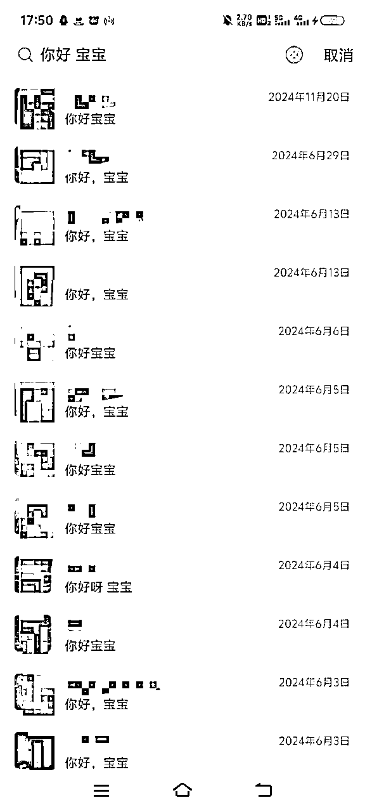
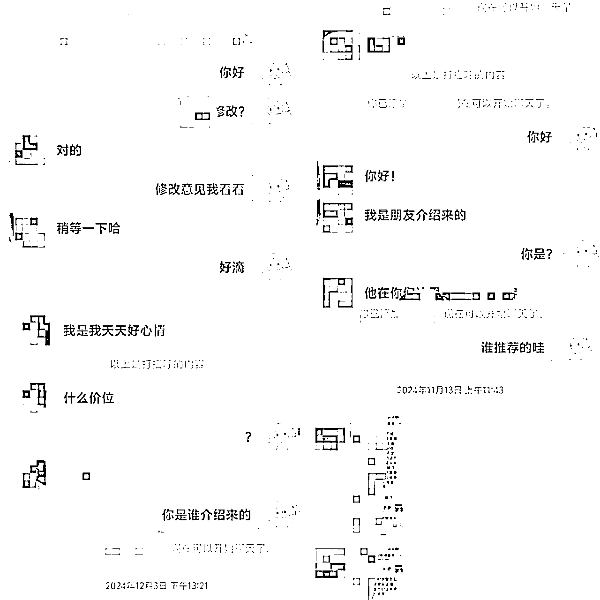
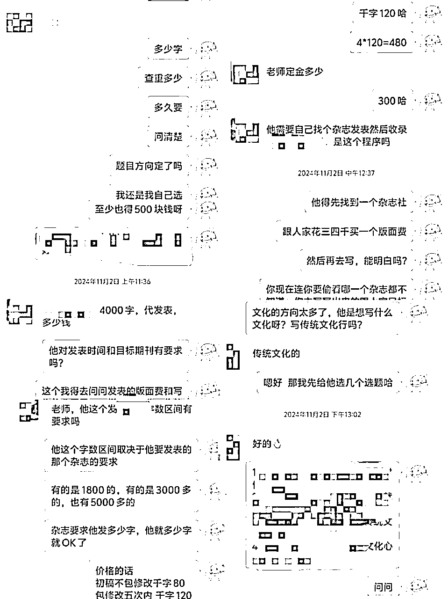
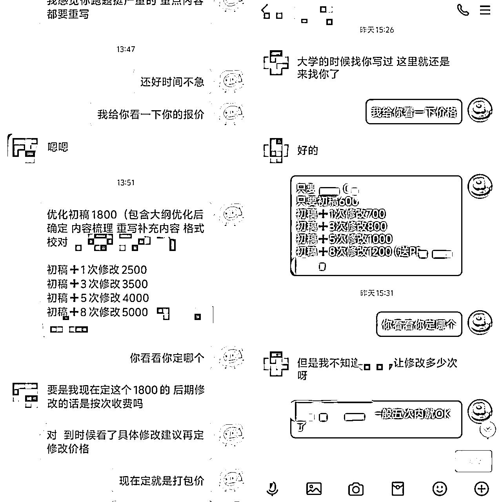
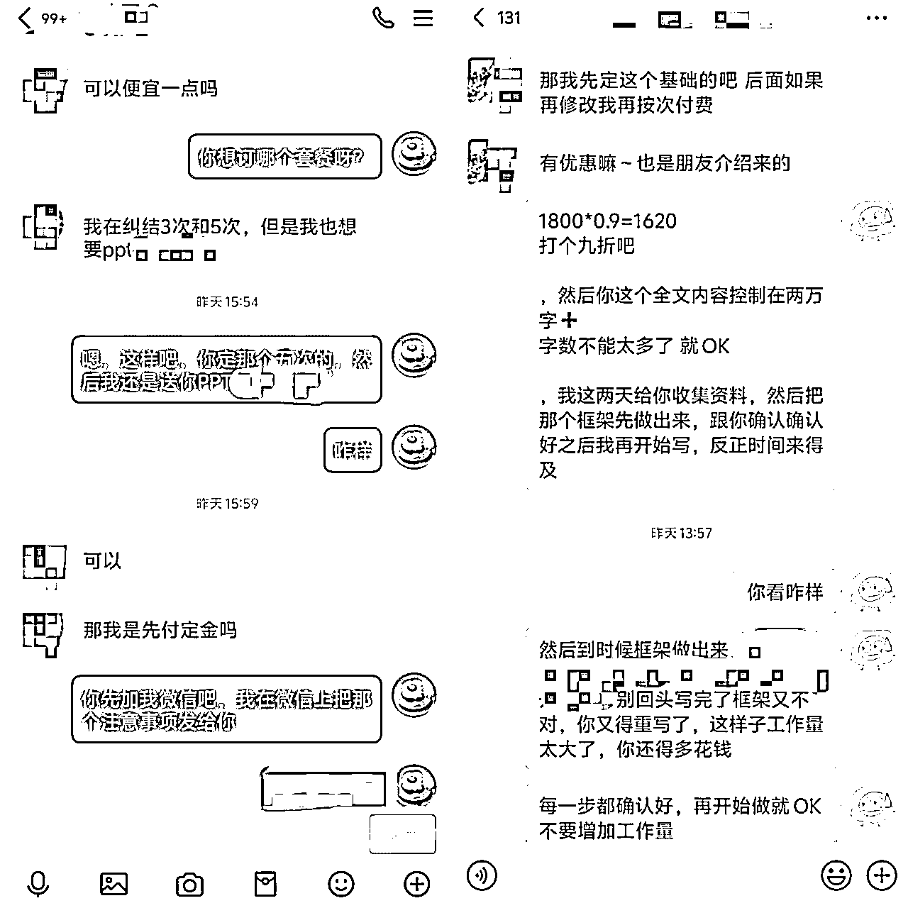
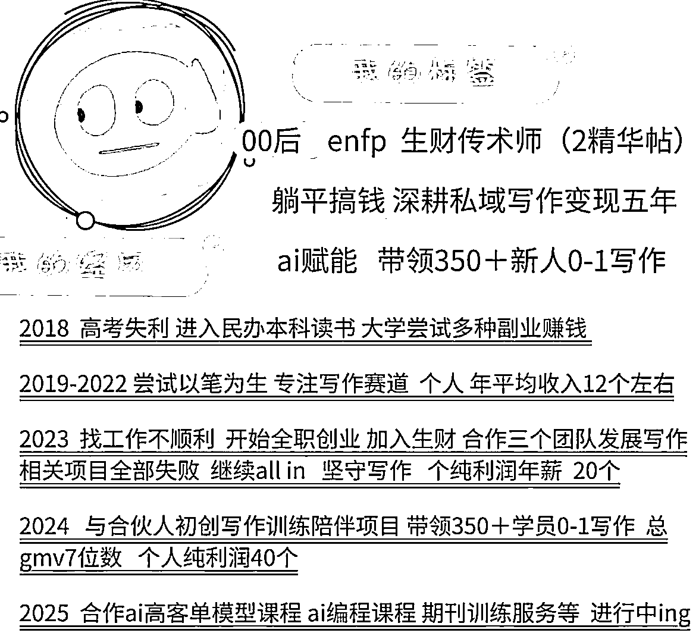

# 【AI写作】针对新手的私域谈单话术技巧与案例分享

> 来源：[https://lv9qj6hfr4z.feishu.cn/docx/G234dtEwwoIPmtxwkk6cTLiRnTl](https://lv9qj6hfr4z.feishu.cn/docx/G234dtEwwoIPmtxwkk6cTLiRnTl)

荷包蛋五年深耕私域写作行业的私域谈单技巧和一些实操案例 都在这里啦

分享给你们 希望有帮助

建议每个人都要做私域 私域做好了永远不用担心流量问题 我们要做有复利有复购的产品和模式

好的私域运营起来 每年都不用为没有新客源发愁 因此献上这份我的技巧与案例分析

# 一、基础概念与误区

## （一）ai写作服务流程介绍

找到接单渠道——确认客户需求——写作——变现

首先是要找寻渠道接单，然后与客户确认写作需求，利用AI完成稿件，提交给客户，从而达成变现。流程图如下，其中最重要的环节 就是谈单和成交 因此 本文后面将介绍私域谈单的相关技巧。

## （二）私域的在ai写作中的重要性

私域运营的核心是人与人的情感连接，

如果你没有建立私域流量，而是完全依赖平台截流或店铺流量，那么每年都需要不断寻找新的客源，而这些客源往往难以长期留存。

私域的价值就在于帮助你摆脱这种困境，通过病毒式营销、老带新、以及高频复购和复利带来的利润，建立一个可持续发展的客户生态。特别是在写作类服务产品中，私域的重要性尤为突出。

私域运营做好了，复购率提升，收入自然更稳定。

不再需要将精力全部放在追逐新流量上，而是优先维护好老客户，确保收入稳定后再拓展新的流量，实现更高的收入增长。

在私域运营中，谈单和转化是关键的第一步。

当新的客户进入时，我们的首要目标是留住他们，而谈单的话术正是影响留存和转化的核心环节，也是我们需要重点学习的地方，私域的重要性就不用我过多赘述了！

## （三）私域沟通话术中的常见误区

在沟通话术中，我发现最常见的问题就是缺乏情绪价值、不够专业以及随意报价，很容易让客户感到不信任，最终导致沟通失败。

解决这些问题并不复杂。

第一步，你必须清楚服务的难度和合理的价格范围，绝不能在完全不了解客户需求的情况下胡乱报价。否则，不仅会让客户反感，后续交付时也容易出现问题。

第二步，要学会用客户能接受的方式去沟通谈判，尤其是在传递情绪价值上，真诚和共情往往比强推更有效。

至于讨价还价阶段，适当的让步是可以的，但一定要守住自己的底线。

要向客户清晰地说明价格的合理性，比如为什么不能再降价，或者我们的服务为什么值这个价格，你能把这些理由说得通透，客户才会认可。

以下是一些错误示范：

#### 错误话术 1：强迫式推销

*   “现在赶紧订吧！再犹豫就没机会了！”

*   “你再不决定，优惠就没了，抓紧时间下单吧！”

问题：语气强硬，给客户施压，容易引起反感，无法建立信任感。

#### 错误话术 2：漠视客户需求

*   “我们的写作服务很全面，不管你需要什么类型的写作都能搞定。”

*   “你就直接买套餐吧，所有类型的文章都包含，特别划算。”

问题：一味强调服务的广泛性，却没有主动了解客户的具体需求，显得冷漠。

#### 错误话术 3：机械化回复

*   客户：“你们的服务适合企业宣传文案吗？” 销售：“可以的，我们什么类型的文案都能写，套餐详情请看链接。”

问题：回复生硬，只给出笼统答案，没有根据客户提问展开具体说明。

#### 错误话术 4：单纯强调价格

*   “我们的写作服务最低只要XX元，你买一个试试吧。”

*   “这么便宜的服务哪里找？直接下单就行！”

问题：过度强调价格优势，忽略了客户对服务质量和价值的关注。

#### 错误话术 5：忽略售后保障

*   “我们保证质量，但如果你觉得不满意也没办法退。”

*   “改稿需要加钱，如果你不能接受，那就不需要下单了。”

问题：未明确服务保障或退改政策，让客户对购买产生顾虑。

#### 错误话术 6：命令式沟通

*   “肯定适合你的需求，别再纠结了！”

*   “没必要再去考虑其他家了。”

问题：语气命令化，没有尊重客户的选择权和决策过程。

#### 错误话术 7：忽略客户心理

*   “你都问了这么多，买了再说。”

*   “我们的服务就是这样的，你要觉得合适就买，不合适也没办法。”

问题：显得不耐烦，忽略客户的疑虑和心理需求。

#### 错误话术 8：缺乏情绪价值

*   “这服务对你肯定有用，买了就知道好不好了。”

*   “我们只负责写作，你的其他需求我们不管。”

问题：缺乏热情和客户关怀，无法与客户建立情感连接，显得冷漠和僵硬。

接下来，我会分享一些我成交的真实案例，具体讲讲我是怎么运用这些方法一步步拿下客户的。

希望通过这些经验，能让大家更好地掌握沟通中的关键技巧。

# 二、高效私域谈单的核心技巧与案例

## （一）客户需求挖掘中的关键问题

#### 1\. 了解客户来源

在与客户沟通前，首先要弄清楚他们是如何找到你的：

*   是朋友介绍的：对你的信任度较高，可以直接探讨需求，稍作引导即可成交。

*   是通过其他平台主动联系的：更注重你的专业性和服务价值，需要花时间建立信任。

#### 2\. 明确客户需求

针对写作需求，以下问题一定要问清楚：

*   写作类型：客户需要哪种类型的稿子？是演讲稿、品牌宣传文案，还是其他类型？

*   稿件用途：用途决定服务的深度和报价范围。

*   如果是为了应付老板或领导，可能只需要基本达标的内容。

*   如果是用于商业宣传，则需要高质量、高创意的内容，价格也会相应提高。

*   修改需求：客户是否需要后期多次修改？这是影响报价的重要因素。

#### 3\. 询问客户的过往案例

如果客户之前有类似的写作需求，可以参考他们之前的稿件，了解对文风、逻辑和深度的要求，有助于精准判断难度和定价。

#### 4\. 分析客户画像

在初步沟通中，可以观察客户的背景和行为判断他们的需求层次和消费能力：

*   通过来源判断：如果是学生，通常预算较低，可以推荐基础服务；如果是职场人士或企业客户，建议推荐专业度更高的服务。

*   通过社交状态判断：加客户微信后，可以观察他们的朋友圈、头像和微信名，初步了解他们的消费能力和需求倾向。

#### 5\. 针对性推荐写作服务

*   学生客户：预算低、对稿件要求不高，可以推荐基础服务，比如快速交付、简单润色等。学生通常沟通直爽，成交效率较高。

*   职场客户：如白领或企业负责人，他们对稿件质量和专业度要求更高，可推荐高级服务，强调内容深度、结构优化和逻辑严谨性。

*   根据用途定价：明确告诉客户，商业用途的稿件和普通用途的稿件在报价上会有明显差异，帮助他们理解服务的价值。

#### 6\. 避免盲目报价

在未完全了解客户需求前，千万不要急于报价。

盲目报价容易损失利润，让客户对你的专业性产生质疑。

详细沟通，明确稿件类型、用途、修改需求后，再给出合理的报价范围。

## （二）私域沟通的关键点与案例

### 1、破冰开场：拉近距离（情绪价值体现）

关键点：在沟通的开始阶段，用温暖、真诚的态度拉近与客户的距离，让客户感到被重视和理解。避免一上来就“推销模式”，先从称呼或氛围建立情感连接，逐步深入需求探讨。

开场还不简单吗？一招教你拉进距离！(仅限年轻人）

，教你们一个通用办法 男生一律叫宝子，女生一律叫宝宝。配上一个可爱表情包 瞬间拉近距离 。

不好意思开口 那你就活该成交低嘎嘎嘎

用亲昵一点的称呼和客户拉进关系 然后询问需求 除了宝子 你也可以 哥哥 姐姐 美女 都可以 但是要自然 亲切 不要太客套 别再跟淘宝一样用 亲 了！！！

当然 也可以 正经一点 直接直入主题 再后续的磋商中来一点点拉进关系 建立信任

直入主题开场案例（真不建议你们这样 ，我感觉这个是错误案例展示，如果你们跟我一样特别有自信能谈下来 且十分专业 可以效仿，这四单 我都成交了 嘎嘎嘎嘎）

实用建议

去掉“刻意热情”：不要用太多修饰语和多余的称呼，直击客户心理，让对方感到你的真诚和干脆。

增加“调侃元素”：适当用一点幽默感，比如夸对方头像、微信名，甚至自嘲，可以迅速打破陌生感。

别绕圈子：避免过长的开场白，保持在一两句内直接引出需求或提问。

### 2、需求挖掘：找到痛点（了解用户需求）

关键点：通过提问和引导，明确客户真正的需求和难点，确保后续方案能够精准匹配。

直接和客户询问稿件相关要求 询问包含 用途 字数 交稿时间 语言风格 是否需要修改 等等

如果客户不清楚 要逐步引导客户说清楚需求 这很重要 了解清楚后 总结需求和客户确认

当然 在需求询问的询盘复盘中 也会体现出我们的专业性 让客户认可我们的专业性 从而促使后期成交转化

如以下案例：我逐步引导客户说清楚要求的字数 和方向 然后报价

提问核心要素

*   用途：稿件是用来做什么的？是个人学习、职场汇报，还是商业用途？

*   字数：客户希望的字数范围是多少？

*   交稿时间：客户的时间节点有多紧急？

*   语言风格：需要什么样的表达方式？是简洁明了，还是华丽生动？

*   修改需求：是否需要多次修改或定制调整？

逐步引导客户

如果客户不清楚具体需求，通过简单提问引导，让客户逐步理清思路：

“您这篇稿子是用于什么场合？我可以根据用途来推荐合适的方向。”

“大概需要多少字呢？我可以根据字数范围帮您规划写作结构。”

“您是更偏好通俗易懂的风格，还是更注重专业性？”

总结需求并确认

在客户表达完需求后，用简洁明了的语言总结，并让客户确认，以确保沟通无误：

“您的需求是写一篇用于商业汇报的文案，字数控制在1000字以内，注重逻辑性和说服力，并且在2天内完成。请问这样准确吗？”

沟通过程

初步提问

“您好，您需要的稿件是公司内部使用还是对外宣传？”

客户回答：“公司内部用。”

逐步引导

“好的，那是汇报类文稿吗？还是用来展示某个项目的总结或成果？”

客户回答：“应该是项目总结。”

“了解了，那字数大概有要求吗？比如是几页PPT的配套文稿，还是长篇报告？”

客户回答：“字数没定，尽量控制在2000字以内吧。”

“风格上是更偏向简洁明了，还是需要详细阐述数据和结论？”

客户回答：“详细一些，但语言上别太学术化，公司领导喜欢直观的数据和结论。”

总结需求并确认

“您的需求是撰写一篇公司内部的项目总结文稿，字数控制在2000字以内，风格简洁但不失逻辑性，重点突出数据分析和结论总结。这是您的最终需求吗？”

客户确认：“是的！”

报价及后续沟通

“根据您的需求，我们这篇文稿预计的费用是XX元，包括一次修改的服务。您看时间安排是否可以？

需求挖掘的价值

展示专业性：通过提问和总结需求的过程，体现出对客户问题的深入理解和把控，让客户对服务产生信任感。

减少后期修改成本：需求明确后，可以避免因为模糊沟通导致的返工或客户不满意。

提高转化率：精准挖掘客户需求，并给出专业方案，能更快促成成交。

### 3、专业输出：匹配方案（专业技能展示）

关键点：针对客户的需求和痛点，提供专业建议和具体解决方案，突出自身的能力和服务价值。

不同的稿子有不同的写法 可以给客户刨之前写过的同类型案例 也可以针对客户要求的稿子展开深度讨论 比如 具体什么框架 哪里需要加入什么内容 需要收集哪些数据 可以怎么改？之类的

可以参考以下案例：审阅客户稿子之后 我与客户展开了深度的探讨与沟通 这个是我专业度的展现 也拉进了彼此的信任感 后期可以增加复购概率

补充案例与相关话术模拟：

案例：深度探讨增强信任

客户背景

客户需要撰写一份商业计划书，但对内容框架和核心表达方式不明确，只提供了一些零散的信息和思路。

沟通过程

初步审阅客户提供的资料

客户提供了一些项目背景材料和市场调研数据，但未形成结构化内容。

沟通开始：“我看了您的资料，项目背景和数据都挺丰富，但文稿的逻辑性和结构还需要优化。我们可以这样调整：先用一个清晰的框架把重点梳理出来。”

提供专业建议并展开探讨

框架建议：

引言：用一段简洁有力的开场说明项目背景和目标。

市场分析：结合客户提供的数据，添加竞争优势和市场趋势的分析。

核心产品或服务：突出亮点，用数据支撑卖点。

财务预测：可补充对未来营收和成本的详细说明。

团队介绍：强化团队的专业性和可执行力。

深度讨论：

问题1：市场分析部分数据不完整，建议补充竞争对手的定价策略。

客户回应：“我们手头有一些数据，但还没整理好。”

我的建议：“可以把这些数据简单列出，我帮您整合进文稿，同时结合行业平均水平提升说服力。”

问题2：财务预测部分只提到了总预算，缺少细项拆解。

我的建议：“建议加入每阶段的资金分配计划，比如市场营销、研发投入等。这样投资人更容易理解项目的可行性。”

确认修改方向

“根据我们的讨论，我会在市场分析部分加入竞争对手数据，同时补充财务预测的细项拆解。这些调整会让计划书更有说服力，您看这样可以吗？”

客户反馈：“完全可以！我觉得这个思路非常清晰，接下来就交给您了。”

专业输出的核心价值

体现服务能力：对稿件的深入分析和优化建议，让客户感受到你的专业性。

解决客户痛点：满足客户需求，还能让客户学到更多实用的写作知识，增加认可度。

建立信任关系：深度探讨可以拉近客户关系，为长期合作和复购奠定基础。

### 4、多维报价：引导选择（多种方案匹配）

关键点：根据客户的预算和需求，设计多层次的服务方案，并通过对比引导客户选择最适合的选项。

1\. 分层次报价话术

“宝子，我们的服务分为四个档次，您可以根据需求选择：

初级：20元（原创走心，质量有保证）

中级：30元（老师从事教育、媒体行业，有丰富经验）

高级：50元（速度快，适合加急和要求高的稿件）

金牌：80元（专为领导、重量级稿件打造，专业性文章）

所有稿件都原创且包修改，主要区别在老师的资历和交付速度上。您觉得哪种更适合呢？”

* * *

2\. 套餐报价话术

“我们还有修改次数的打包套餐，适合需要多次调整的稿件：

初稿 600：适合简单需求，定稿即交付。

初稿+1次修改 700：可根据反馈调整一次。

初稿+3次修改 800：适合需要多次润色的客户。

初稿+5次修改 900：保证稿件精细调整到满意为止。

初稿+8次修改 1000：适合专业性要求极高的稿件。”

“您看，结合您的需求和预算，推荐‘初稿+3次修改’，这款性价比最高，您觉得呢？”

* * *

3\. 修改单独打包话术

“如果您已经有初稿，只需要修改服务，我们也有单独的修改报价：

1次修改 500：适合轻微调整。

2次修改 800：针对细节和逻辑调整。

3次修改 1200：适合整体优化。

5次修改 1500：全方位精细打磨。”

“如果您的稿件内容比较复杂，建议选择3次或5次修改服务，这样能确保最终质量达到您的要求。您觉得呢？

参考案例：先说明情况的严重性质 和工作量 然后阶梯报价 让客户选择 当然 也可以先询问客户预算 阶梯报价区间内一定要包含客户预算在内的价格 符合客户预期！

关键点详解

分层次报价

根据客户的预算、稿件复杂度、时间要求等设计多种服务档次，让客户感受到选择的灵活性和服务的公平性。

低价入门：适合预算有限但对质量要求不高的客户。

中档升级：为客户提供性价比高的选择，适合对质量有一定要求的客户。

高端定制：满足时间紧迫、要求高、专业性强的客户需求。

套餐报价

针对不同需求组合打包报价，比如初稿+修改服务，既提升客户体验，也能增加成交概率。

询问预算，匹配价格

如果客户预算明确，可以直接在阶梯报价中推荐符合预期的选项，并突出该价格的服务价值。

案例：阶梯报价引导成交

客户需求

客户需要撰写一篇商业计划书，对专业性要求较高，但预算不明晰。

沟通过程

说明工作量

“商业计划书的结构通常较复杂，需要涉及数据分析、竞争分析等内容。我看了您的需求，整体上会花费较多时间和精力。”

提供阶梯报价

“根据您的要求，我提供三个选择：

中档服务 3000元：包括初稿+1次调整，适合不需要过多修改的场景。

高档服务 4000元：包括初稿+3次调整，可以根据领导反馈优化内容。

顶级定制 5000元：包括初稿+无限次修改，直到完全满意为止。”

询问预算并调整

“您觉得哪个选项更符合您的预算和需求？如果预算有限，我可以为您调整部分内容，减少不必要的模块。”

客户反馈预算在3500左右。

调整报价：“那我们可以选择高档服务，并在优化范围内稍作调整，这样既符合您的预算，也能确保稿件质量。”

促成成交

客户确认选择高档服务，并表示满意。

总结

多维报价的关键在于灵活性和透明度，让客户感受到价格与服务价值的匹配。

阶梯报价满足不同客户的预算需求，专业性引导客户选择更高价位的服务。

沟通中突出价值：对工作量的说明和调整方案的建议，强化客户对服务的认可感，从而促成高效成交。

### 5、适当优惠：促使成交（符合客户预期）

关键点：在报价和谈判中，适当给予客户优惠，但必须保持底线。清晰说明服务价值，让客户明白价格的合理性。

经过前面的层层引导 与沟通 都到最后了 就是讨价还价环节 有销售经验或者购物经历的人都能理解 肯定会到讨价还价 环节 用贸易专业术语叫:询盘 回盘

适当的给出优惠 比如 9折 88折 比如送1-2次修改 后期送一些附加服务

如果客户是老客户介绍来的 可以说看在朋友介绍的份上给你优惠价 xx折扣 成交之后别忘了给推荐客户的朋友一个红包哦 鼓励他们继续复购 继续推荐 继续裂变

参考报价与优惠话术

优惠折扣话术

“宝子，看您这么信任我，这次给您个优惠价，原价XX元，现在给您9折，算下来只要XX元。”

“看在您是朋友介绍来的份上，这次就给您88折吧，，感谢他推荐了这么好的客户！”

“您这次是初次合作，给您一个新人专属价，成交之后可以赠送一次修改服务哦。”

增加附加值话术

“这次我帮您把初稿服务的修改次数从1次提升到3次，保证您满意为止！”

“原本服务只提供一个月支持，看您需求比较紧急，这次免费帮您延长到三个月服务时间。”

“稿件完成后，如果您有额外的小需求，比如格式调整，我也可以免费帮您处理一次。”

老客户或推荐客户优惠话术

“感谢您是老客户，这次直接给您88折，同时增加一次免费的修改服务。”

“这次是朋友介绍的客户，特别给您个友情价，送您两次修改服务，您也多帮我给朋友说声感谢！”

给推荐人反馈：

“您的朋友已经成交啦！感谢您推荐，给您一个小红包，期待下次继续合作！”

关键点详解

把握底线

在讨价还价的环节，适当给予优惠，但不能过度让步，要确保利润空间和服务价值。优惠的幅度要有说服力，同时凸显你的诚意和专业性。

增加附加值

如果直接降价会影响服务利润，可以通过增加修改次数、延长服务时间、送额外服务等方式增加客户感知价值，让客户感到“超值”。

注重客户关系

老客户或朋友介绍：给出“人情式优惠”，表达感谢，增加客户信任感和满意度。

鼓励推荐裂变：成交后，及时感谢推荐客户的朋友，赠送红包或额外奖励，鼓励他们继续带来更多客户。

参考案例：一个送了修改次数增加服务时间 一个打了折扣

案例：适当优惠促成成交

案例1：增加修改次数促成成交

场景：客户需要一篇商业文案，但希望能多次调整内容以符合领导要求。

原报价：3000元，含1次修改。

客户反馈：“这个价格有点超预算，还需要多改几次。”

我的回应：“这次看在您是第一次合作的份上，我帮您把修改次数提升到3次，价格不变，您看怎么样？”

结果：客户觉得服务增加了，性价比提升，顺利成交。

案例2：打折优惠加裂变奖励

场景：客户是朋友介绍，预算有限。

原报价：5000元。

客户反馈：“朋友推荐了您，但这个价格对我们公司来说有点高。”

我的回应：“朋友介绍的客户，我一定给最优惠的价格。这次给您88折，还送一次免费的后期优化服务。成交后，我也会感谢您的朋友！”

结果：客户认可优惠，同时朋友收到了红包反馈，对推荐服务更加积极。

一句话总结

适当让利是成交的润滑剂，但要学会把优惠做得有策略，既体现诚意，又能稳住服务价值，最终实现客户满意和复购裂变！

# 三、常见问题解答

## （一）针对客户的常见问题解答话术

#### Q1: 为什么你的服务比别家贵？

A: 我们的服务不仅注重结果，更注重过程。

*   每篇稿件都是100%原创，结合客户需求量身定制。

*   有经验丰富的专业写手团队负责，确保稿件逻辑严谨、内容优质。

*   服务中包含修改次数，直到您满意为止，同时还有后续支持。 相比便宜但可能需要返工的服务，我们更注重一次性解决问题，节约您的时间和精力。

* * *

#### Q2: 我不太清楚需要什么，你能帮我吗？

A: 当然可以！我们会通过几个简单的问题帮您梳理需求：

*   您的稿件是用于什么场合？（汇报、宣传、还是个人需求）

*   字数范围和交稿时间大概是多少？

*   您更偏向哪种表达风格？（严谨正式还是轻松生动） 只要您提供这些基础信息，我们就可以为您设计最合适的方案。

* * *

#### Q3: 如果稿件不满意怎么办？

A: 我们提供多次修改服务，直到您满意为止。

*   如果对内容有意见，可以随时提出，我们会根据您的反馈快速调整。

*   在修改服务用尽前，我们保证免费优化。

*   如果需求变更较大，可能需要补充少量费用，我们也会提前和您确认。

* * *

#### Q4: 有什么优惠吗？

A: 针对不同客户我们有专属优惠：

*   首次合作：新客户可享受9折优惠。

*   老客户：老客户可享额外的修改次数或更低折扣。

*   推荐客户：每推荐一位新客户，我们会赠送小红包或额外的优惠服务，感谢您的信任！

* * *

#### Q5: 什么时候可以交稿？

A: 根据稿件复杂程度和您的紧急程度，我们有多种交付周期：

*   标准服务：3-5天交付。

*   加急服务：24小时内完成（需额外收费）。

*   超紧急需求：我们会根据具体情况安排优先处理，您放心，一定能按时完成！

## （二）关于私域谈单话术存在的问题与补充建议

### 1、如何快速让客户成交？

快速成交的关键在于 建立信任 和 制造紧迫感。

问题1：信任不足，客户犹豫不决

原因：客户对服务价值存疑或对商家专业性不够信任。

解决方法：

展示成功案例：分享与客户需求类似的真实案例，让客户看到实际效果。

话术示例：

“我们之前服务过一位客户，和您情况类似，写了一篇演讲稿，最后获得了全场好评。这次我们也可以为您提供同样高质量的服务！”

强调服务保障：突出原创性、多次修改服务和长期支持，降低客户风险感。

问题2：未抓住客户需求痛点

原因：谈话过于笼统，没有针对客户的具体问题给出解决方案。

解决方法：通过提问明确需求，并提出针对性的解决方案。

话术示例：

“您刚提到稿件是用来汇报项目的，我建议结构上采用逻辑清晰、数据为主的形式，这样更容易打动领导。”

“如果这篇稿件时间紧，我可以提供加急服务，保证质量的同时按时交付，您放心！”

问题3：缺少成交驱动因素

原因：没有制造“现在下单”的理由，客户容易拖延决策。

解决方法：制造紧迫感或提供限时优惠。

话术示例：

“今天下单享受9折优惠，明天可能恢复原价哦！”

“这次订单我可以免费帮您加一次修改，但优惠只限今天。”

* * *

### 2、如何让观望的客户促单成交？

对观望的客户，需要更细致地分析他们犹豫的原因，并针对性引导。

问题1：客户对价格敏感

原因：预算有限，担心价格过高不值得。

解决方法：通过对比和增值服务突出性价比。

话术示例：

“虽然我们的价格略高，但包括了原创、定制和多次修改服务，这些在其他平台是没有的。”

“我们有基础套餐可选，价格更实惠，同时可以升级其他服务，完全根据您的预算来调整。”

问题2：客户对服务结果不确定

原因：客户不确定服务是否能达到预期效果。

解决方法：提供免费小样或详细的解决方案。

话术示例：

“我可以先为您提供一小段写作样例，您觉得合适的话再继续合作。”

“我们已经为很多客户提供类似服务，效果非常好，我可以先发一份案例供您参考。”

问题3：缺少足够的信任感

原因：对商家的承诺或服务流程存在疑虑。

解决方法：通过客户评价或流程透明化建立信任。

话术示例：

“我们每篇稿件都有专属团队负责，全程与您保持沟通，确保最终满意。”

“可以看看我们之前客户的评价，基本都是五星好评，大家对我们的服务都很认可。”

问题4：缺乏紧迫性或激励

原因：客户觉得随时都可以下单，没有紧迫感。

解决方法：通过限时优惠、赠品或稀缺性激发客户行动。

话术示例：

“我们现在正在做活动，下单即送两次修改服务，错过就没有啦！”

“这个档次的服务今天只剩两个名额，您决定的话我马上帮您锁定。”

* * *

话术补充

促单话术推荐：

限时优惠促单

“我们今天有专属优惠，9折+赠送修改服务，您看现在要不要抓住？”

稀缺性激发

“这次合作的高级服务名额已经快满了，如果您决定得晚了，可能要排到下周了。”

反向引导策略

“如果您现在还不确定，也没关系，可能后续安排会稍微紧一些，但我们会尽力安排到您这边。”

（缓和语气让客户有“失去机会”的心理压力，反向促成行动。）

* * *

总结

对快速成交的客户，核心是 信任感+紧迫感，用真实案例和限时优惠刺激客户行动。

对观望客户，重点在于 引导需求+解除顾虑，专业性和增值服务消除他们的犹豫。

私域谈单的话术需要灵活调整，核心是基于客户心理，逐步引导并促成成交，同时注重长期关系的维护和裂变扩展。

# 四、写在最后

目前就先总结这些啦 学会这些小技巧 对于新人来说 可以处理大部分常用场景 如果觉得有所帮助 可以点点赞 也可以链接我 找不到我可以联系鱼丸链接我哈

布道传术 成人达己 ！！布道传术 成人达己 ！！布道传术 成人达己 ！！布道传术 成人达己 ！！