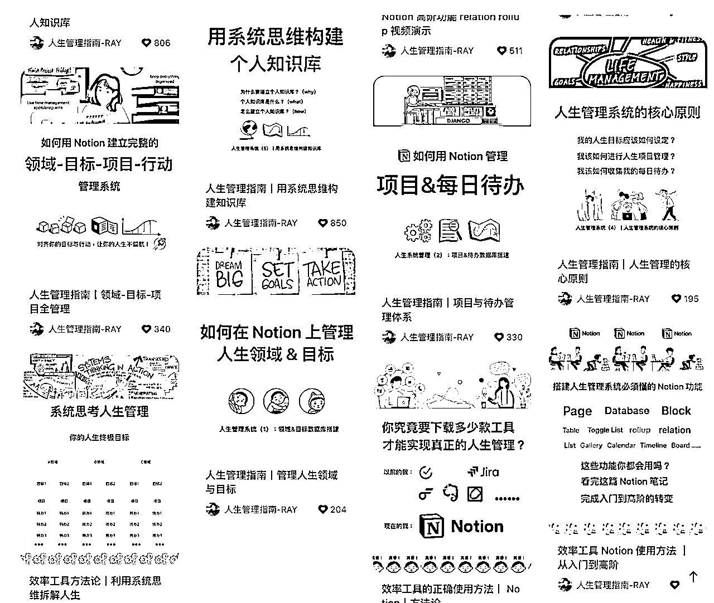
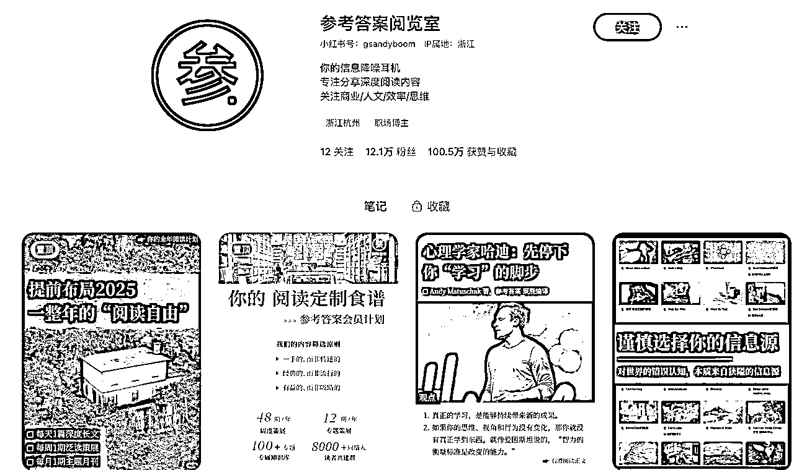
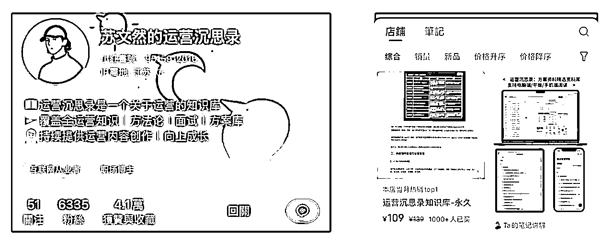
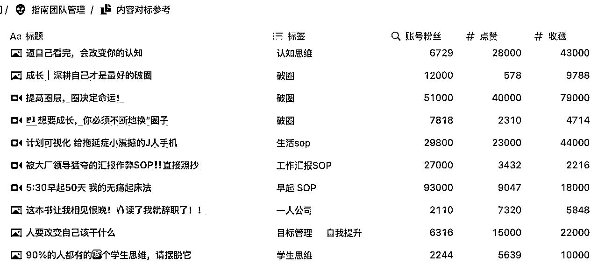

# 小红书卖知识库，如何成为超级个体

> 来源：[https://cqlcm05bxl.feishu.cn/docx/GgaNdgubyojAspxcENDcBtbQnae](https://cqlcm05bxl.feishu.cn/docx/GgaNdgubyojAspxcENDcBtbQnae)

# 我是谁

RAY，2020 年厦门大学软件工程毕业，互联网做了 3 年产品和运营，2023 年下半年被裁，通过 Notion ，1 年的时间，在 2024 年成为了一名 95 后超级个体，整体变现达 7 位数。

就业率如此低的大环境，我从被裁到创业，从做流量到实现商业化变现，再到今天重新考虑定位升级，我是这个时代下的典型画像。

如果你也是刚毕业，找不到工作；或者刚被裁，不知道自己的方向在哪；亦或是正在面临转型危机的 35+ 中产，我想我的经历，多多少少可能对你有些启发或帮助。

# 从被裁到用 Notion 变现 7 位数

2020 年毕业之后，我一直都在 SaaS 行业，第一份工作前半年的时间，做产品运营，后面转成增长产品经理，负责流量转化、数据埋点和分析、产品优化设计等事情；2022 年的时候，我裸辞了，现在回头来看，那是我成为超级个体最开始的起点，也是我的第一次醒悟。

因为在 SaaS 行业，其实我在 2020 年就接触到了 Notion，但是后续 2 年的时间，都没有任何使用上的提升，直到第一份工作裸辞之后。我决定开始重新规划我的职业发展与个人生活——Notion，就这么再次被我用起来了。

实话实话，Notion 的使用门槛确实很高，但因为我越发觉得做计划这件事，对当时的我来说，太为重要；所以，我花了当时快一半的月薪，去买了一套国外的课程，学习了别人如何构建自己的生活管理系统，从目标到日常待办，从读书、资料收集到灵感记录、文章输出，它覆盖生活的方方面面——而这个产品，也是我后来变现 7 位数的主力产品，个人 IP 就是这样，你会什么，你用什么成就了自己，那就尽管去分享，再用它去成就更多人。

学了那套课程之后，我就开始做小红书了，因为学习的过程中，我也在持续使用 Notion，它大幅度改善了我的生活状态——所有脑子里的信息，变得异常清晰，我的目标是什么，每周的计划是什么，今天有哪些待办，读了哪些书，写了哪些笔记…如果把生活看作一个产品，那 Notion 就是它的数据大屏，时时刻刻让你知道，自己在哪，应该去哪，哪里需要改善，哪里值得坚持。

2022 年 9 月，我发了第一篇小红书图文，每个月大概 4-5 篇的样子， 3 个月，就涨了 5k 粉丝——现在回头看，能涨这么快，就 2 个原因，一是内容稀缺度，当时小红书并没有太多人讲 Notion 人生管理系统的内容，很多都是泛泛而谈，但我是第一位，讲逻辑、讲系统的人；第二个原因是，我自己的审美还行，视觉设计有优势。

每个月 4-5 篇，做到 2023 年中的时候，小红书已经有 1 万多粉丝了，我就开始想着，到底要如何变现，卖 Notion 的产品，总感觉国内用户没多少，可能会没市场…但恰好是那个时候，少数派推了 Notion 的课程，纯功能教学，图文版，卖 199 元一份，1 个月的时间，卖了 60 万，所以，我也决定，开始尝试卖 Notion 课。

但是，录课其实是一件很耗费精力的事情，不知道做课方法，不懂得录课流程，对于当时还有主业工作的我来说，几乎是没办法推进的。

然后，就这么巧，我被裁了——这是现在回头看来，我在成为超级个体这条路上的第二个转折点。想创业，想当自由职业，想成为超级个体，一定需要从上班状态切换过来，但很多人会非常的纠结内耗，迟迟做不了决定，拖得越久，一开始的热血和期待，也会被消磨殆尽。

我很幸运，上天帮我做了选择，被裁一点也不要慌，很可能是上天在引导你去一个更好的人生方向。

所以，我开始专心录课，一边做图文笔记搞流量，一边录课准备产品，2023 年 11 月底，课程发布，599 元，1 年的时间，卖了小 2000 人。

这就是我用 Notion 变现 7 位数的故事。

# 小红书卖知识库，如何月入 5 位数

过去 1 年我自己的业务模式非常简单，低转高，通过低价训练营或直播，转化 599 的课程，以及一个 1999 元的 50 天的陪跑训练营（围绕录播课内容进行扩充），训练营每 3 个月开一次，每次招生 50-80 人。

但我的模式，其实有 2 个难点，可能不太适合个体户。

一是直播讲课能力，背后需要强大的知识储备，你需要对时间管理、知识管理、效率工具这些内容有自己的理解，并且还能随时答上用户的各种问题；如果你只是想做一个副业，其实根本没必要开直播，流量变现的方法太多了，不用选最难的这一种。

二是交付的能力，因为转化营的设置，陪跑营的社群运营，背后涉及到大量的动作，都不是一个人能完成的事情。所以我的模式，其实不太适合个体户，除非你有一个小团队，并且有很强的逻辑思维与直播能力。

但是，Notion 除了卖课程之外，还有好几种其他的变现模式，都是个体户可以尝试的路径。

## 2.1 小红书 Notion 变现模式

Notion 全球有 100 多万的创作者，变现模式大概分为 4 类：

1.  卖模板

1.  卖课程

1.  卖个性化订制与咨询

1.  卖知识库

现在来讲一下，这 4 种变现模式，他们的详细玩法、市场情况以及难点在哪。

*   卖模板

卖模板，边际成本为 0 的知识商品，面向所有 Notion 用户，模板的作用，其实主要是给 Notion 小白用户学习和参考。对于一个还对 Notion 使用不熟悉的人来说，模板是最快的学习方式，因为 Notion 注册后，就是一张白纸，什么都没有，它本身并不能帮助你解决具体的问题，只有通过熟悉 Notion，搭建出来具体的管理系统，才能帮助你解决各种问题，Notion 的价值才会开始释放。

但是，正因为 Notion 有较大的学习成本，所以，卖模板，是一个非常大的市场。可以说，只要 Notion 本身的用户数在增加，那卖模板这个市场，一定也会越来越大。

就像卖 PPT 模板，20 年前就有人卖，现在的淘宝、闲鱼，依然还有无数人在卖——为什么能持续这么多年，因为 PPT 的用户数量一直都在增加，当它当成为职场必备技能之后，全球范围内的每一届毕业生，都是它的新用户来源。

卖模板的模式非常简单，做自媒体账号，然后直接在店铺内挂商品，不需要任何私域上的操作，非常适合个体户每个月赚个零花钱。

国内卖模板的平台主要是小红书，当然 b 站也可以同步挂上；但据我观察，国内大多数只卖模板的 Notion 创作者，主要的销量还是在小红书。

卖模板这件事，甚至不需要做短视频，小红书图文就够了，非常轻的流量成本。

而卖模板的难点，在于如何做出差异化的模板，以及在内容上找到合适的人。

Notion 模板的市场已经经过了好几年的发展，个人场景下的各种模板，已经在海内外都卖烂掉了。所以，如果能结合一些专业知识，打垂直领域，并且设置更高的客单价，再通过内容找到目标人群，这可能比网上各种什么模板都卖的 Notion 创作者，会有更高的变现效率。

*   卖课程

卖课程的话，说起来就很泛了，这可能是天花板最高的变现方式，但同时也是最难的变现方式。

目前市面上的 Notion 课程，大概分为 2 类，一是纯功能教学，每个功能一节课，教你怎么一步步学会每个 Notion 的功能点，这种课一般卖不了高价，因为工具课，并不能帮助人直接解决问题，用户遇到一个问题，然后开始用 Notion，发现 Notion 成本高，然后还想到要主动学习，才会对这类课程有需求，和问题隔得太远，路径太长，所以这一类课程，卖不了高价，而且受众也不多。

当然，如果你已经有很大的流量，卖一卖也是可以的，比如少数派在 2023 年推出的 Notion 教程课，图文形式，主要讲功能，凭借少数派的官网置顶（官网每个月 UV 应该有大几十万），再加上几次公众号的宣发（平均阅读 1w+），一个月的时间，199 的课程，也卖了5、60万。

第二类课程的话，就是把 Notion 当成解决问题的工具，课程里面不仅教工具，更重要的还有教方法。

比如很多人有拖延症，行动力低下，你是一位时间管理的资深教练，开了一门课程，里面讲了非常多的管理方法，还提供时间管理的 Notion 系统，并且在社群内带着大家持续使用，最终帮助大家提高行动力，解决拖延症的问题。

这一类的课程，那就能够卖很高的价格了，因为别人遇到问题，就能找到它，并且用它解决问题，而 Notion，只是整个课程内的一小部份内容，只是一个方法落地的工具。

实际上，对于大多数人来说，完全没有必要去学习 Notion 的全部功能。如果你想用 Notion 做时间管理，那就掌握时间管理系统内相关的功能；如果你想用 Notion 做财务管理，那就掌握 Notion 财务系统相关的功能。需要什么，学习什么，这才是最高效的学习方式，也是对于用户来说，性价比最高的方式。

*   卖个性化订制与咨询

第三类，是卖个性化定制和咨询，这个业务模式，也可以直接参考 PPT 定制和咨询。

虽然很多人认为 Notion 是一款笔记软件，但实际上，全球范围内，为 Notion 贡献主要营收的群体，是各种中小团队，它们用 Notion 构建各种团队管理系统，比如 CRM 客户管理、财务管理、项目与任务推进、团队知识库等——这其实才是 Notion 真正的定位，无代码 SaaS 平台。

而个性化和咨询，主要是就是服务 B 端。因为这些 Tob 的系统还是比较复杂的，大多数人没有搭建的能力，你需要了解客户的需求，理清各种逻辑和流程，这其实做的是 SaaS 行业里面售前的工作，所以，对 Notion 的掌握程度，要求是最高的，甚至高于前面的卖课。卖课需要的是综合能力，但做定制化，需要的是你对于 Notion，对于各种业务场景的精通。

其实对于个人来说，咨询与定制是一条更好的路线。

它是一个更适合个人长期发展的方向，做 Notion 咨询，就是做 SaaS 咨询，背后对于业务场景的理解能力、逻辑能力、沟通能力都有很高的要求，一旦养成，就算没有 Notion 这款软件，你也可以继续从事相关的数字化咨询工作。

所以，如果你足够有耐心，相比于卖模板、卖课程这种更吃流量能力的变现模式，做个性化咨询与定制，会更加适合。

最后一个变现模式，就是卖知识库，这是一个我觉得，完全不需要懂 Notion，只要你有知识，你就能实现变现的模式，它是每个人自媒体小白都应该去尝试的模式，不仅仅是为了变现，而且对于自己知识内化能力的提升，也有很大的帮助。

## 2.2 人人都能卖的知识库

参考答案，一个在小红书卖 Notion 知识库卖出圈的帐号，100+ 的客单，通过图文+投流的方式，1年的时间，营收做了几百万。

它们是最早在小红书上卖 Notion 知识库的账号，这个知识库主要是一些国外文章的翻译，大多是偏科技类、个人成长类的文章，对于大多数不会英文、不知道如何科学上网的人来说，非常有吸引力。

这个帐号的内容生产成本非常低，把 Notion 内的文章截图，直接做成小红书图文，文案也复制本来就整理好的文章内容，然后取一个标题，一篇笔记就制作完成了。

现在这个帐号， 一共发文 799 篇，涨粉 12.1 万，变现超过 500 万，私域里面沉淀了几万名爱阅读的粉丝，数据都非常亮眼。

当然，这是 Top 级别的案例，并且也是做得最早的案例。

做业务，选赛道的时候，最重要的就一件事，这个赛道有没有跑出来的大案例，而参考答案，就是卖知识库这个赛道上的大案例。

所以，当参考答案越来越火之后，小红书类似的帐号越来越多，内容只要体现出差异化，变现就非常容易。

比如下面这个帐号，24 年做的号，笔记发了 213 篇，涨了 6k+ 粉丝，变现达到 13w+。而且笔记制作的模式，和参考答案一模一样，直接采用截图，或者拍照知识库的模式，只发运营类的内容，很明显针对的人群，就是刚做运营的小白，够垂直，且基数够大。

为什么说人人都可以卖知识库，因为它的变现，完全不需要任何核心能力，大家都是上过学的人，没有人不会整理信息，内容制作上也没有任何成本，找到好的知识库定位，坚持发内容，变现自然就能实现。

所以，我们接下来分 2 快去讲这个事情，一是知识库如何设计，二是小红书的流量方法。

## 2.3 如何设计知识库

知识库要想好卖，第一步就是确定好定位，抓住人群的核心需求。

比如上面卖运营知识库的案例，对于小白来说就很实用，既有各种知识，知识库内还有各种方案模板，社群运营方案、公众号运营方案等，记得我第一年刚上班的时候，我也会到处找这些资料，不过那个时候全是百度云打包，还没有知识库体验那么好。

如何确定定位，我分享 2 个思路。

一是从你最擅长的方向出发，这种比较适合于在一个领域内打拼多年的资深人士。整理一套关于你们这个行业内的各种信息，自己这么多年下来踩的各种坑，把它整理出来，然后用 Notion 或者飞书知识库来呈现。不会搭建知识库，也完全不要紧，因为你可以直接套用别人的模板，再把它改成自己的内容就行。

第二个思路，就是直接去找需求，找你觉得最好做的内容方向，这样变现来得会更快。

比如，你针对情感赛道，做一些类似的知识库，它的变现效率一定比个人成长类的更高，因为前者是刚需。

不过，在第二个定位是路上，你的内容就要花更多的心思去研究，因为也不是自己接触过的领域，所以无论是做知识库的内容，还是流量端的内容，都要不断学习这个赛道上的知识，再进行二次输出；不像第一种定位方式，基于自己的长处去做，所以本身就有非常多可以分享的内容。

两种定位方式，各有各的好，根据自己的目标与需求去选择就好。

确定了知识库的商业定位，接下来就是去整理内容。

整理的过程，其实也是自己学习的过程，所以在这个知识库设计的过程中，你不仅仅是在做变现产品的准备，同样也是在持续锻炼自己的学习能力——这是非常重要的，因为未来的超级个体时代，AI越来越强大，学习能力会变得越来越重要。

当知识库设计好之后，接下来，就是去搞定流量。

## 2.4 卖知识库的流量方法

如果要卖知识库，一定是做小红书，并且一开始，图文内容完全就足够了。

图文内容的形式，可以直接参照参考答案，截图 Notion 内的知识库，做成图片，文案内容也直接采用知识库内本身的文案。

唯一要注意的是，如何把自己的内容，结合好的选题，写出有流量的笔记。

如果你是小红书小白，可能看不懂我刚刚说的这句话，下面我解释一下。

一篇笔记，可以分为 2 的部份，选题 + 详细内容。

选题，就是封面+标题，传达出来的信息；而详细内容，就是短视频详细文案，或者图文内容中的文案和图片信息。

同一个详细内容，有非常多的选题可以去切入。

比如，你要告诉大家如何减肥，分享自己的一些减肥经验，选题的角度是非常多的：

*   情绪切入：“为什么减肥总是从明天开始？”（戳中拖延情绪）

*   对比切入：“3 个月减 10 斤和 20 斤，背后的差距在哪？”（好奇心驱动）

*   故事切入：“我用 5 块钱瘦了 20 斤”（低成本的吸引力）

*   数字切入：“减肥中 99% 的人都忽略了这个关键点”（数字强化专业感）

不同的选题，决定算法推荐给谁，有时候为什么同一篇内容，换一个封面+标题，流量就好了很多，这就是选题的魅力。

如何去找到小红书上的大选题，一是主动搜索，去看看类似的选题，其流量大概都是什么情况；二是多刷，刷到爆款的时候，可以记录下来，然后后续就能够直接参考，比如像我自己，就会用 Notion 搭建一个对标库，去给我整个 Notion 流量系统赋能：

但是，做小红书，最重要的，其实也不是技法，而是坚持，在对的方法基础上，坚持发，持续发，前 3 个月根本不要管什么数据，围绕知识库的主题，就是一顿发，熬过一开始的 3 个月，你就会发现，流量情况、变现效率…一切都在变得更好。

以上就是用小红书来卖 Notion 的所有操作方法。

# Notion：超级个体时代的必备工具

如果你经常在Youtube 上冲浪，你会发现 Notion 已经成为了各种博主 IP 必用的工具。只需要一款软件，你能构建出管理自己生活、工作方方面面的所有系统，信息统一存储，还能用数据库进行各种结构化分析，并且现在有了 AI 小助理，能够直接对你存储过的数据，进行分析，帮助你决策，同时，ChatGPT 目前已经打通了 Notion，在使用 Notion 的同时，可以直接调用 GPT 的回答。

超级个体时代，小团队协作，或者一个人的公司，如果掌握了 Notion，你的业务效率、变现效率，都会有非常大的提升。

很多朋友之前也问我，飞书和 Notion 的区别在哪，对于大多数基础需求，比如就简单写个文档，随便开一个数据表来管理，二者相差并不大；但是如果要构建各种管理系统，飞书的灵活性，远远弱于 Notion，在各种表的链接，工作流的构建上，一个做了 11 年的产品，其性能一定是远远超过飞书的。