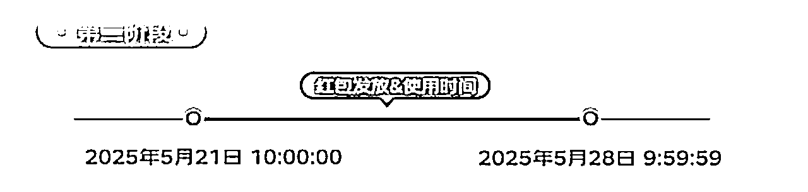
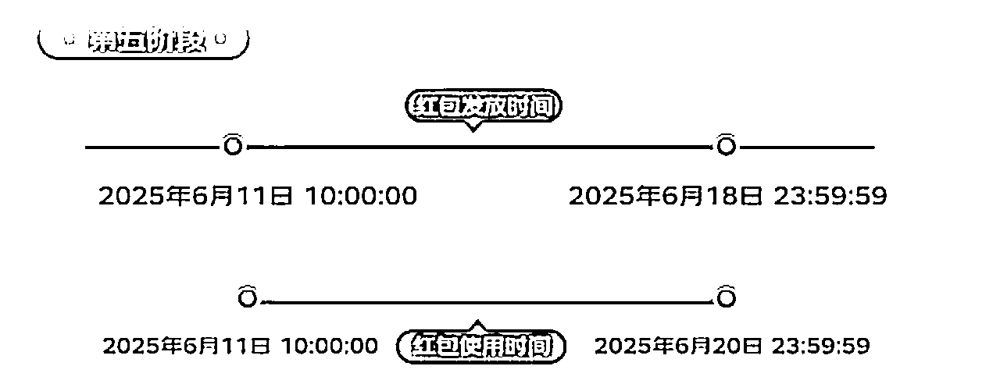

# 京享红包项目实战指南

> 来源：[https://il1a85pj6b.feishu.cn/docx/CfyOdwXXYoenHwxrH52c3W1lndb](https://il1a85pj6b.feishu.cn/docx/CfyOdwXXYoenHwxrH52c3W1lndb)

手册出品人：老秦

项目文档使用说明：本文旨在为你提供本项目 SOP 流程，帮助你更快更有效的去实操本项目， 助力大家快速上手。

# 写在前面

欢迎大家来参与「玩赚京享红包」小项目，先说明几点：

1.京享红包是京东平台发放的一种优惠券，不是其它三方平台的，大家放心。

2.下面涉及到的「京粉」和「京东联盟」都是京东旗下的数字营销平台，一个是面向APP端，一个是面向PC网站。 也是非三方平台。

3.我们不是为了单纯领取京享红包， 而是通过推广赚取佣金。

4.想直接实操直接看【实操过程】，快速上手

5.我们不是分享商品，不是带货， 是分享京东红包哈

## 一）介绍

「京享红包项目」就是推广者在「京粉」或「京东联盟」上生成自己的专属京享红包链接，分享给用户，当用户通过你的链接领取了红包并在规定的时间内使用它们购买商品时，推广者可以获得佣金。

非常轻量的项目，内容来自老秦的实战。

## 二）须知

1.  京享红包是京东平台发放的一种优惠券，不是其它三方平台的，大家放心。

1.  下面涉及到的「京粉」和「京东联盟」都是京东旗下的数字营销平台，一个是面向APP端，一个是面向PC网站。 也是非三方平台，推荐用「京粉」。

1.  我们不是为了单纯领取京享红包， 而是通过推广赚取佣金。

1.  想快速实操直接看【实操过程】，快速上手

1.  我们不是分享商品，不是带货，没有上下级， 是分享京东红包哈

1.  活动期间，每天都可以自领红包（每天三次）

1.  京享红包比推广商品要容易出单，因为它有锁单的机制。

# 二 个人成绩

老秦目前已经变现五位数了，部分收益如下图：

# 三、 核心逻辑

通过发放你的专属京享红包吸引用户领取，从而被锁定， 在规定时间内，用户使用红包购买商品， 你有佣金。

# 四、关于京享红包

## 一）什么是京享红包

京享红包是京东平台发放的一种优惠券，用户可以在购物时使用，以享受折扣或抵现的优惠。

## 二）特点

无门槛、全品类适用，可叠加使用，具有高优先级。

## 三）使用范围

京享红包可用于京东平台上的所有实物商品，且可以与任何其他优惠叠加使用。

## 四）京享红包的订单分佣是多少

京享红包的佣金情况会根据不同的订单类型和是否使用推广链接而有所不同。

有的订单佣金0.01 ，有的几十几百块，上限很高。

## 五）京享红包分佣收益在哪看

在「京粉app」中查看收益（下载方式在后面）

## 六）京享红包和普通红包/优惠券有什么不同?

京享红包是一种直接可以抵扣现金的红包，只在大促期发放，且可与任何优惠叠加(例如东券、京券、京豆等)。只有京东联盟的京享红包具备跟单能力，京东平台其他活动发放的普通红包不具备跟单能力。

## 七）京享红包是全年每天都有吗

京享红包并非全年每天都有，而是特定活动期间发放。包括：

*   京东618

*   京东双11

*   京东年货节

## 八）京享红包如何提现

### 1、步骤一：实名认证

#### 1）登录「京粉app」，底部菜单栏选择「佣金」

#### 2）选择「前往实名」

#### 3）填写实名信息

注意钱是提现到京东钱包里。如果你要提现到自己银行账号，在京东APP再去操作。

### 2、步骤二：提现到京东APP「我的钱包」

#### 1）登录「京粉app」，底部菜单栏选择「佣金」

#### 2）选择「提现」

#### 3）输入手机验证码， 成功后，会提现到京东钱包

#### 4）打开京东APP，找到「我的钱包」

### 3、步骤三：提现到银行卡

#### 1）打开京东APP，登录，注意：登录账号要和你登录京粉的账号（手机号）一致。

#### 2）底部菜单栏 选择「我的」

#### 3）选择「我的钱包」

#### 4）点击「余额」

#### 5）绑定银行卡，选择「提现」

# 五、生成你的专属红包链接

## 一）核心步骤

#### 1、下载京东官方的推广平台

#### 2、注册登录

#### 3、生成专属的京享红包链接

#### 

在APP端和PC端生成都可以， 老秦强烈建议在APP端生成， 操作简单便捷。

## 二）APP端生成链接实操（强烈建议）

### 1、下载「京粉」

### 2、注册登录

建议选择「京东登录」，如果你之前没有下载京东APP，提前下载一个并登录哈。当然选择「手机号注册」也可以。

### 3、点击「首页焦点图」，进入“京享红包”活动页，点击活动页右上角「分享赚」生成自己的专属红包链接和推广文案

### 4、推广，生成专属的链接和海报

生成之后我们直接去其它平台推广即可，包括不限于：

微信，微信群、朋友圈、公众号，QQ群、微博、论坛、贴吧，知乎等

## 三）PC电脑端实操过程

### 1、打开京东联盟网站： https://union.jd.com/index

### 2、扫码登录，京东APP扫一扫

### 3、选择--->我要推广--->京享红包

### 4、生成推广链接

不建议 通过PC电脑端生成推广，操作繁琐哈。APP端生成即可。

# 六、京享红包时间（有效期）

京东618京享红包活动时间是37天。

用户在某个阶段领取你的红包，就要在这个阶段把红包用掉， 否则没佣金。也就是说，过期无效哈。

## 一）第1阶段

## 二）第2阶段

## 三）第3阶段

## 四）第4阶段

## 五）第5阶段

# 七、推广方法与案例参考

## 一）朋友圈推广

在朋友圈发布推广文案，并附上京享红包的链接，鼓励朋友点击领取并使用。亲测，效果很好。

我自己推的文案比较简单：

再贴几个文案大家参考， 建议把「京享红包」改为「京东红包」。如下文案：

### 1、文案一

🎉【京东红包来袭】🎉

朋友们，京东又有好福利啦！速速点击链接领取你的专属京享红包，购物更省钱！👇

「京享红包海报」

评论区：「京享红包链接」

### 2、文案二

💰「省钱秘籍】💰

想在京东买买买却担心钱包空空？试试这个京享红包，大额抵扣，惊喜不断！快来领取吧！🛍️

「京享红包海报」

评论区：「京享红包链接」

### 3、文案三

✨【京东福利大放送】✨

京享红包限时发放，人人有份！赶紧点击领取，让你的购物车满载而归！🎁

「京享红包海报」

评论区：「京享红包链接」

### 4、文案四

🌟【京享红包，购物无忧】🌟

还在犹豫要不要下单？有了京享红包，再也不用担心价格问题！立即领取，畅享优惠！🚀

「京享红包海报」

评论区：「京享红包链接」

### 5、文案五

👀【别错过】👀

京享红包火热来袭，最高可抵扣XX元！赶快点击链接，一起开启省钱模式吧！💸

「京享红包海报」

评论区：「京享红包链接」

## 二）社群推广

在社群中以「送福利」的形式，分享链接出来。

## 三）公众号推广

### 1) 搜一搜关键词文案

可以在微信的搜一搜中搜索关键词，找合适的文案，贴身模仿，如下图：

### 2) 案例参考

#### 1、文案一

## 四）知乎好物推广

### 1、什么是知乎好物

知乎好物，简单来说，就是在知乎平台上通过插入商品卡片来推荐商品，从而获得佣金的一种方式。这种方式类似于淘宝客，但借助的是知乎这个内容平台

### 2.申请知乎好物权限的条件

开通权限：创作者等级≥5级，账号注册时间≥90天，过去90天没有违反《知乎社群管理规定》的行为，仅限个人账号申请。

### 3.知乎好物如何插入京享红包

开通知乎好物权限后：

1.  选择内容编辑：在知乎APP中，点击内容编辑框的“钱袋子”「收益」标志，进入好物推荐选品页面。

1.  选择红包：在好物推荐选品页面，选择「红包」选项，然后选择您想要添加的京享红包。

1.  插入红包卡片：点击“添加”按钮，将红包卡片插入到您的内容中。

## 五）QQ群推广

可以在自己的QQ群里发红包链接， 用户点击链接后登录是可以直接领取红包的。

虽然没有微信丝滑， 但还可以。

# 八、自领红包

活动期间，我们每天都可以自领红包（每天三次）

## 一）方式一

我们自己生成的专属京享红包链接和海报， 自己是可以扫码领取的。

我们自购也是有佣金的。

## 二）方式二

### 1）打开京东APP

### 2）搜索框输入「京享红包」，点击领取即可（领三次）

# 九、常见问题

### Q1：京享红包订单佣金是多少？

京享红包的佣金情况会根据不同的订单类型和是否使用推广链接而有所不同。

有的订单佣金0.01 ，有的几十几百块。

### Q2：这个有跟淘客那样分初中高级不

没有分佣等级哈

### Q3：京东商城和京粉一起绑定才可以使用对吗

对，下载京粉，选择京东登录；佣金的收益会提到京东钱包里所以要绑定京东账号

### Q4：怎样在app端生成推广？

看sop第五点

### Q5：为什么有的订单使用的京享红包，却没有跟到订单？？

使用京享红包的订单，商家设置推广计划期间产生的订单点击跟单有效期为30天，其他订单的点击跟单有效期为12小时。

如果用户在商家未设置推广计划期间产生的订单，并且领取红包的时间与下单时间间隔超过12小时，则不会跟单。红包有效期不受影响，故用户可以正常使用红包。

### Q6：通过常规推广链接入的消费者在购买时使用了其他推广者发放的京享红包，订单如何结算？

通过京享红包活动领取的红包、优惠券或京东超市卡（京东支付券除外），跟单优先级高于常规推广，京东支付券无跟单能力。

举例：消费者通过推广者甲的常规推广链接，进入京东购买了商品，在付款的时候使用了通过推广者乙发放的京享红包、优惠券或京东超市卡（京东支付券除外）。则该订单的佣金归属于推广者乙。

### Q7：为什么选择做京享红包而不是淘宝天猫红包？

京享红包用户操作更顺畅丝滑， 淘宝天猫需要复制口令， 多了一步， 再加上现在大家对淘客带货的反感， 大概率不会领。

### Q8：有没有佣金较高的单子？

咱们群里有很多朋友都出了高佣单子， 老秦22号出了一单，150+的佣金

### Q9：领取的无门槛红包可以叠加吗？

在红包有效期内， 是可以叠加的

### Q10：分佣提现必须绑定银行卡嘛

是的， 它会让你完善个人信息，绑定你的银行卡， 先提现到京东钱包， 然后再提现到你的银行卡

### Q11：预售商品的尾款用了京享红包是否会改变跟单结果?

不会，预售跟单以下定金时的跟单结果为准，定金支付时不可使用京享红包。

### Q12：京享红包裂变分享如何跟单跟单?

推广者甲推广京享红包，用户领取红包后可进行裂变分享，其他用户点击裂变链接领取红包后下单，亦可结算给推广者甲。