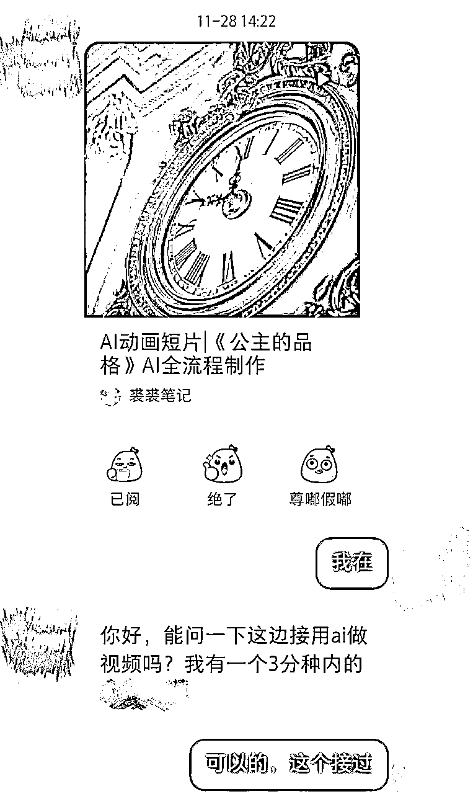

# 《两个月从短视频老师到 AIGC 设计师，我的保姆级经验复盘》

> 来源：[https://shengcaiyoushu01.feishu.cn/docx/HyD8dWRXqo4mRJxbt92cEZpinPf](https://shengcaiyoushu01.feishu.cn/docx/HyD8dWRXqo4mRJxbt92cEZpinPf)

在正式开始这篇保姆级经验分享前，我想和大家聊聊为什么一个短视频老师会毅然决定转型AIGC设计师。

首先必须要承认，学校因为教育规定和信息差的原因，总是会无可避免地慢市场一步。很幸运，这是我目前入职学校的第一年，在掌握视频设计技能的同时，我还没有失去对市场嗅觉，所以很顺利地发现了AI技术对传统设计行业的冲击正在悄然形成。

当然，这些预判并不是众人皆醉我独醒，周围的同事也并不是对AIGC一无所知，只是我更急于跟上这个时代。因为历史总是告诉我们，科技的进步是呈指数爆炸式发展的，从0到1也许需要发展一年，但是从1到100可能只需要一个月，如果我不能拿出所有的精力投入其中，这就是一趟赶不上的列车。

放弃学校的稳定工作其实是艰难的，进入一个刚刚出现不到半年的行业更需要勇气。但是会看十年之内，微信公众号的出现可以让一篇文章报价4、5位数、短视频的出现淹没了微信公众号之后创造了视频经济的时代，所以这一次这一次新技术的出现不妨停止在路边鼓掌，做一次选手。

想要真正进入一个行业，就不能再以老师的身份入局。开自媒体账号发视频其实算是给自己刷新了一份简历，没有经验的小白需要为自己提供机会。拥有流量、成为博主、完成商单，这些都是证明自己的过程中意外收获的财富。

就这样，两个月里，我经历了三个重要节点：

1.入门三周，接到人生第一单AIGC商单

2.潜心研究AI创作技巧，分享心得，一个月内从零积累到1000+粉丝

3.两个月后，收获某人工智能头部公司的AIGC设计师offer

这个过程中，我踩过的坑、总结的经验，都将在这篇文章中完整的分享给大家。无论你是和我一样想要转型的创作者，还是对AIGC感兴趣的新人，这篇经验复盘都值得一读。

## 一、意外又不意外的第一单

### 1.1 前期沟通

先带大家看看这单作品的内容，建议大家在人多的地方打开，会稍微有些惊悚。

我的第一个商单客户，是通过小红书作品吸引来的，对方刷到了作品并在我的后台留言合作需求。

我们沟通了几轮，确定了视频时长、题材、双方分工、制作周期、沉默成本，以及最终敲定报价——基础费用 2000 元，精修可追加 500 元。

下面我就带大家一起来看下，我是怎么完成这一单的。

首先需要和用户确定项目的细节：

对方的要求是：3min 内纪录片，主题是“用视频展现一个中学生的文字世界，并展示中学生的写作内容，以及他通过文字所构建的想象空间”，画面质量没有高要求，并且会出剧本和配音，并辅助分镜图创作，10 天之后 ddl，

我给大家翻译一下，这个要求，意味着什么样的具体工作：

3min 内纪录片，这意味着有大概 150 个镜头需要处理。一般 1 分钟有 40-50 个镜头左右，每个镜头可能会抽卡 2-5 次（抽卡是指在用 AI 视频软件进行图生视频时有一定的失败率，需要多试几次）

视频作用和题材，决定了作品制作难度和精力投入成本。企业宣传片和产品广告片对画面质量要求高，剧情片对分镜和人物动作要求高，以上决定了我们到底要用什么 AI 视频软件，以及分镜图的试错成本。客户不要求画面高质量，但是需要尽可能贴近剧本，这要求我们使用在人物动作方面更有优势的AI软件。

客户自带剧本，但是需要我们根据剧本出分镜图，客户对分镜图不协助只验收。这种情况属于带着镣铐跳舞，除非有视频经验并对分镜很熟悉，否则不建议独立创作分镜。

做出无聊的镜头客户不满意必然返工，同时客户自己创作剧本时可能已经有大概画面。这种情况可以在创作分镜时和用户多沟通细节，价格上可以让利。

客户有剧本同时愿意参与创作，给他创作机会！让他尽可能描述自己想象中的画面，你负责转达给出图软件，如果画面不理想客户自己会想办法改提示词的。

小 Tips：剧本和分镜是否需要创作者原创，也就是客户是否自带剧本，客户能否自己出分镜描述词。这个非常重要，直接决定了精力投入和制作周期。

如果客户没有剧本并希望我们可以原创剧本。我建议这种情况慎重接单，要么就报高价。原创是非常痛苦的过程，一个好的作品诞生前需要推翻很多个创意，同时也意味着要自己做分镜，如果作品时长要求的稍微长一点半个月都过去了，一定要报一个你觉得能牺牲掉半个月精力的价格！

以上是项目开始前需要确定的沟通内容，都没有问题项目才可以开始！

最后我们需要说清楚 AI 作品的缺陷——AI 出视频有一定概率失败，抽卡出目标视频的概率是 50%-20%，所以 AI 视频的成本大部分在 AI 视频软件抽卡。

AI 可以修改，但是追求完美的程度和视频制作成本成正比，所以在预算范围内我们可以通过剪辑手法尽可能达到想要的效果。

### 1.2 制作剧本和分镜

关于剧本：

客户的剧本可能是有 bug 的。剧本可能有剧情逻辑问题或者画面不衔接。剧本有问题一定要聊一次剧情，最好是电话沟通态度客气，让对方以编剧的身份讲戏，提出剧情 bug 的同时提供修改方案。

关于分镜：

确定剧本没有问题后，第一步就是先确定画风。AI 常见的画风包括：3D 动画风、电影风格、模拟真人、插画风

最后我们确定了整个视频前半段以中学生在公交车上目睹中式诡异为剧本，后半部分以创作采访为内容，分镜风格选用真人写实风格。

在确定已经理解剧本之后，我开始出分镜图，也就是我们前面有提到最费神的部分。

如果客户自带分镜描述词，我们只需要根据客户描述出图就好。最好的情况是每一个分镜都能让对方四选一，这样分镜图一稿发出去后回收的修改意见最少。

我根据剧本中主角出场的第一个镜头为案例，制作了主角形象图，三种画风一共 16 个形象，客户选择了其中一个形象并提出了修改意见。

但是如果对方没有准确的画面描述，那就需要发挥我们自己的语言描述能力，以及引导客户沟通画面，每个分镜图出图后都等待四选一，这个过程漫长且费神，（最后我针对这个作品，一共做了 80 个分镜头）敲定分镜图之后的流程就会快很多。

分镜图敲定之后就可以收定金了！这个项目在确定分镜图后，我收了 60%的全款作为定金。

### 1.3 制作 AI 视频

在分镜确定之后 ，我就开始用AI视频工具来创作视频了。

AI视频的制作流反而非常按部就班，空镜头一般使用runway、可灵，有人物出现的镜头会考虑可灵、pixverse、即梦，必要的时候用一些特效手段。

但是制作视频的可以先严格按照分镜脚本进行，因为AI出视频的随机性，偶尔会出一些惊喜，惊喜的出现往往伴随着脚本的微微修改，那么为了连戏，提前制作的画面就有可能会被放弃掉。

用户不会对第一稿满意的。以下是为了一个镜头，重跑了 N 遍后，沟通三次的过程。

当时第一稿视频出炉，客户对一个有棺材的镜头不满意且异常执着，强调这是整个剧情的核心，要求在这个镜头里，几乎一个字都不要改地呈现。

然后分镜图就卡住了，因为 AI 不认识棺材。

我给 Midjourney 喂了好几个图都没反应，然后换 Ideogram（一个AI绘画工具），付费开通了手绘功能，我画了一晚上的棺材。

在一晚上画出几十张出殡图后，终于达到客户想要的效果了。

但是 AI 视频软件不乐意了，客户要求的镜头是“出殡的队伍把棺材摔到地上，棺材里面的老太太还要甩出来”

这个要求明显就违背了 AI 社区的公序良俗，照着这个要求绝对做不出来。我就开始想办法骗 AI，比如告诉它“出殡队伍在行进中将棺材缓缓放下”，将这个“缓缓”的镜头提速制造一种快速掉落的错觉，然后用一个木盒子掉落并摔开的镜头放大成特写衔接在后方，做出了棺材掉落并摔开的错觉，紧接着是主角的惊恐反应镜头，加强这种错觉。

结尾制作一个“躺在棺材里的老人棺材板被盖上”镜头，倒放视频形成棺材板被掀开的效果。

最后是加强场景氛围，恐怖的音效加了 5 层，背景音乐用了 2 种。

（原视频）

（剪辑过程）

一套连招下来，成功骗过 AI 和观众，客户非常满意。

除非是以上这种一定要达到的效果，其他可以沟通的场景用户都愿意配合，并有一定的容错，总之大家都是希望能把项目进行下去。

### 1.4 设计超预期内容

客户前期表示愿意自己提供配音，但是实操下来难度确实很大，而且配得不够专业。努力了几天的声音素材不过关，我剪得痛苦，客户听得难受。

几次沟通下来，客户决定克隆自己的声音，一个小时解决了三天的工作量。客户感受到了“科技改变生活”，提高预算到 3K。工具用了Eleven Lab，除了克隆声音之外，还有专业配音音色以及自制音效功能（再也不满世界找音效了）。

以上就是我第一个 AI 视频商单的复盘，为了让大家更深刻的了解 AI 视频的制作流程，下面我用自己一个 1W 播放量的爆款视频，带大家讲解一遍。你如果感兴趣的话，可以找个相关的主题，跟着实操。

## 二、复刻我的爆款作品

先来看看最终的成品：

### 2.1 创意环节

这则动画广告的创意过程始于产品选择。在仔细斟酌后，我选定了肉味猫罐头作为主角。

食品广告最有说服力的表现方式，就是通过食用者的反应来衬托美味。因此，我通过展现不同猫咪对猫罐头的各种反应，来凸显产品的诱人程度。

在场景选择上，我没有用传统的餐桌，而是选了厨房的储物架。想想看，猫罐头不就是经常放在那里嘛。

为了吊足观众胃口，我把故事编排成了三个小章节：首先铺陈多个猫咪的反应画面,特别突出它们的可爱姿态；接着呈现罐头的新鲜原材料，带来视觉上的冲击感；最后才展示猫罐头的完整形象，既揭开悬念，又自然地完成了产品宣传。

虽然最终成片仅有20余秒，但前期的剧本和创意构思却需要两到三天的时间。说实话，创意这东西真的很奇妙，有时候完全想不出来。每当陷入瓶颈，我就会刷刷新闻、看看短视频，或者听听TED演讲，等待灵感的火花闪现。

确定创意方向后，最为关键的环节是设计结局。即便是20秒的短片，也必须有一个完整的收尾——可以是温情的、带有反转的、或是充满趣味的,但核心是要能准确传达作品的内在主题。

### 2.2 分镜环节

然后就是漫长的写分镜流程，我一般不会开一个正式的 Excel 表格，表格都是给客户看的。

真正搞创作的时候恨不得想到什么都记录下来，先在白纸上涂涂画画，然后在备忘录里随手写几个镜头号敷衍一下。总之就是，用你觉得最自由的方式，记录你脑子里的画面，直到最后它在你的脑海里像电影一样流畅。

最后，将你脑袋里的画面记录成分镜表。严谨地记录包括镜头号、景别、角度、结构、主体动作、背景、镜头时长。

| 镜头号 | 景别 | 角度 | 结构 | 主体动作 | 背景 | 镜头时长 |
| 镜头1 |  |  |  |  |  |  |
| 镜头2 |  |  |  |  |  |  |
| 镜头3 |  |  |  |  |  |  |
| …… |  |  |  |  |  |  |

这个过程就是为了帮我们记住画面，因为在后续的制作过程中，不看分镜是很难连贯想起最开始创作的内容的。前面创作得有多自由、后续记录就要多严谨。

作品的第一个镜头尽量说明地点，第一个镜头用来刻画厨房场景，交代事件发生的环境。然后对厨房中不同种类、不同位置的猫咪进行刻画，注意使用不同的景别、构图、角度，以保证观众不会连续看到相似画面。

此外，在猫咪的镜头中穿插收纳罐头的位置场景，比如在小猫对着某个方向叫的镜头之后，衔接一个柜子或者厨房岛的场景镜头，暗示观众小猫是在对这个场景中的某物感兴趣。

为了避免用户长期看同一个角色产生厌烦，我们尽量让同一只小猫出场不超过三次，保证画面的多样。

最后是根据已经确定的剧本制作并整理所有的分镜图。

### 2.3 视频制作环节：

到了视频制作环节，我们需要根据上一个环节的分镜表，制作每一个分镜画面，并利用分镜图制作动态镜头。

这个过程中最大的卡点就是人物一致性问题。这个情况在多次尝试之后终于总结出经验。

在创作人物形象时，必须一开始就要求 AI 图片软件生成同一个人物形象的白底三视图。

保留需要一个需要使用的角度，使用局部重绘功能擦掉白色背景和另外两个角度，添加背景提示词，最终生成想要的人物角度+背景。

使用 AI 视频软件不要在一棵树上吊死，也去其他的树上多试几次。目前 Veo2、Sora、Runway、Pixverse、可灵都可以试试，不同画面镜头可能需要不同软件支持。如果试不出来可以参考我前面欺骗 AI 的方法，或者修改剧情。

用已经生成的分镜图制作视频，一般是使用 AI 视频工具的图生视频功能。保证镜头动作完整准确的同时，需要注意每一个镜头不要超过 1.5s。

短视频镜头普遍的规律是一个镜头不超过 1.9s，用户给短视频作品的耐心上限不超过 2s，2s 内看不到想看的画面就会滑走。所以为了保证用户能在视频前 3s 看到第三个镜头，尽可能前三个镜头的时长控制在 1.2s-1.5s，这样能最大程度上降低用户划出率。

如果有些镜头本身静止，需要一些推拉摇移的画面增加视频的可看性，可以使用缩放、位移关键帧人为剪辑出运镜效果。

### 2.4 后期环节：

后期主要是添加转场、音效、背景音乐的环节。

当两个镜头之间的差异过大，拼接在一起相对突兀时，可以考虑直接添加一个转场效果，观众会更容易接受转场后前后画面的差异性，在转场处添加音效可以更好地达到效果。

以下镜头需要多个人物连续对话，如果直接切画面并安排角色开始说话，观众会反应不过来，视频节奏过快。所以需要在两个人物之间制造一个能被察觉的硬转场，在下一个角色开口前提示观众人物和场景已经改变了。同时这种转场能最大程度上降低人力！

另外添加丰富合适的音效，能使视频素材更有质感。

常用音效除了转场音效，还包括环境音、动作音、特效音。环境音包括：下午厨房听到的蝉鸣鸟叫的声音；动作音比如小猫的叫声、行走时的脚步声、开罐头的摩擦声；特效音是用来强调情绪的，比如激动时的心跳声。此外还有用来烘托气氛的氛围音效、用于操作界面场景的 UI 音效。

为作品添加音效后，最后一步是背景音乐的制作。目前 Suno 是最好用的 AI 音乐制作软件，在设置了多个音乐属性之后，抽卡可以得到视频的原创 BGM，建议大家可以试试。

## 三、新手建议

1.  做 AIGC 其实并不难，对 AI 工具的学习一个月就能上手。真正有挑战的其实依然是如何做一条有趣的短视频，AI 工具只是压缩了制作视频的流程。

1.  做有质感的短视频其实就是学怎么拍电影，所以在创作 AIGC 作品之前，需要先保证掌握拍摄角度、景别、构图、运镜等基本的视频拍摄技能，使用 AI 制作分镜图时就能知道，要用什么拍摄角度、景别、构图，以及使用什么运镜手法实现画面。

1.  如何掌握上面提到的两点建议？最快掌握的方式基本功的方式是看优质短视频的拉片，甚至可以根据拉片对分镜画面的描述直接原创 AI 作品。多次尝试用 AI 工具复刻实拍作品，之后以自身创意优化创作。

1.  最后希望大家都能下场实操一下，做出让自己有成就感的视频。