# 如何研究副业信息差？（分享两个过年可实操的信息差）

> 来源：[https://mmxdvhf07x.feishu.cn/docx/ILMtdS1VEoNz7vxYFYLcyUAknDe](https://mmxdvhf07x.feishu.cn/docx/ILMtdS1VEoNz7vxYFYLcyUAknDe)

大家好，我是Tilly。我先简单自我介绍一下，我之前的主业是互联网产品经理，做了9年。24年8月离职后，边带娃边搞副业。我陆续研究副业有8年，其中有一份副业做了2000多天，具体可见之前发在生财的帖子：https://scys.com/articleDetail/xq_topic/8855485185228142

前几天参与了拾一的红包封面的mini航海，参与的过程中研究到了几个信息差。所以今天想分享一下，我是如何研究这些信息差（副业项目）的思路想法，再顺便分享两个新年时候的副业项目信息差的拆解（会在文章中举例，在某些朋友那里这两个项目价值好几千）

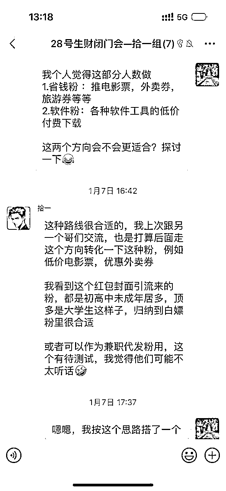

我是16年就开始研究副业（也就是在工作第2年的时候，发现产品经理的工作并不能改变世界，完成的只是领导的想法而已。我就摆正了工作的态度（仅仅是一份工作而已），就开始了副业的研究），期间研究过接码平台（利用这个平台薅了一些平台的优惠，然后转卖），录音转文字服务，淘宝盗版课程，17年时候的闲鱼蓝海等，赚了一些钱但因为有一定的风险和考虑到做不长久就不做了。下面是我自己总结的一些方法：

## 一、这个项目是什么？

当我们去看别人的项目时候，真是眼花缭乱。这个人说搞电影票自动化可以赚几万，那个人说搞外卖券可以赚几万，又有人说搞混剪视频号可以赚几万，先不考虑这些能不能赚到这些钱的情况下，先问一下自己这些项目到底是什么？

#### 案例1：电影票自动化

就拿闲鱼电影票自动化这个项目来说，我是上个月底才了解到（因为小孩太小了，已经2年没进电影院了，12月底结婚纪念日，趁着小孩睡着晚上偷偷溜出去看了个电影），在闲鱼买了两张优惠电影票才知道原来现在电影票可以自动化了。

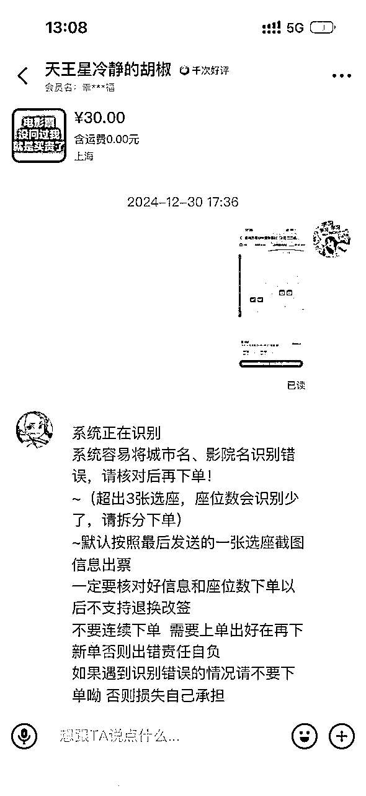

电影票可以用优惠券优惠，网上有一些卖电影票优惠信息差的，这个我之前就知道。但电影票自动化确实没见过，很方便。正好红包封面的mini航海开始了，就想着用承载的公众号也搭建一个。就想搞清楚电影票自动化是什么？

然后我就去网上开始搜索关键词，你如果想不到“电影票自动化”这几个关键词，你可以用“闲鱼电影票”“电影票项目”等相关关键词去搜，一般看前30个链接即可：

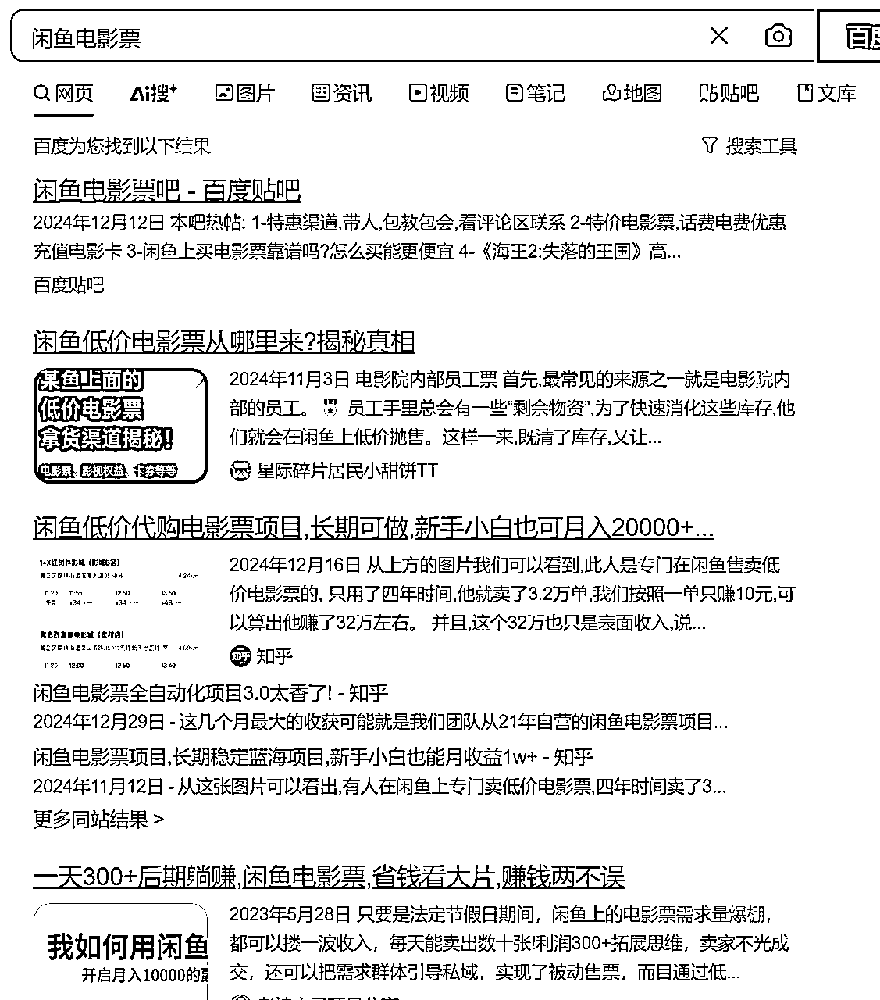

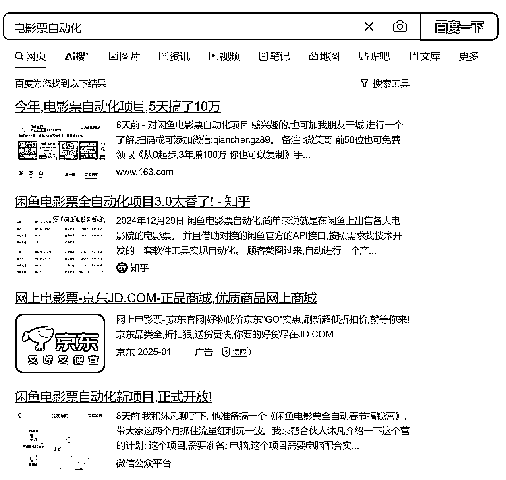

如果你只去百度搜索，那你看到的一定是这样的截图，基本上前排的都是推这种带做项目的，说明这个事情你想做是可以做的，但是要出几千学费。即使不想出这个学费，你也可以选择加他们聊一下，比如这个项目的学费是多少？具体是怎么实操的？来获取更多有用的信息，用来替换和升级你的搜索关键词，假设你一开始不知道这个项目叫做电影票自动化，你加了某个人后知道了这个项目名称，你后面就可以直接用这个更准确的关键词进行搜索。

但我想说的是，不仅要用百度搜索，也要擅于用闲鱼、淘宝、公众号搜索，甚至Kimi进行搜索。我们用同样的关键词去闲鱼、淘宝的搜索结果，你会发现，原来百度搜索导流的几千学费，你用闲鱼淘宝搜一下，10块钱的学费就能买到这个信息差是什么？

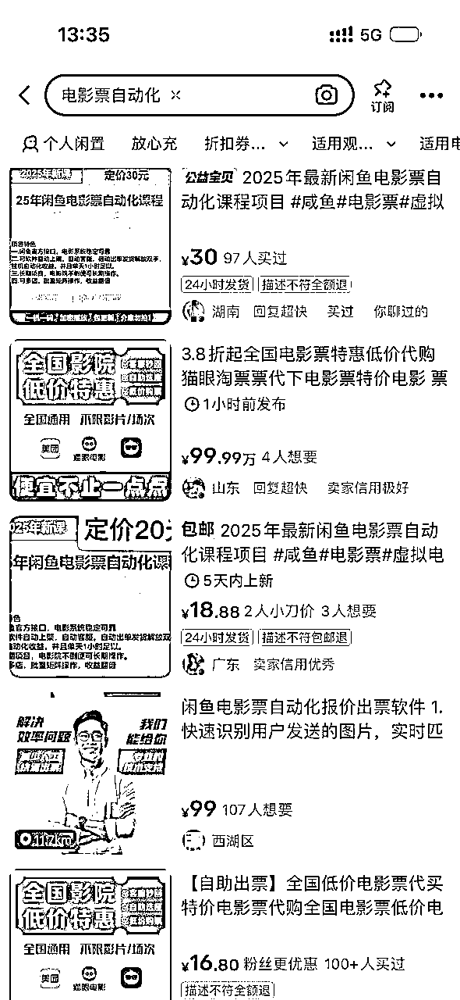

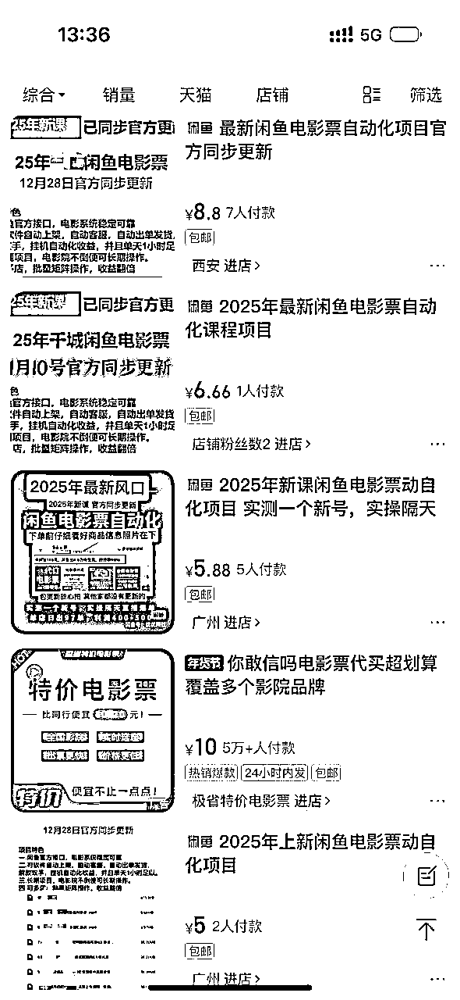

先不用着急下单，你可以再用公众号、小程序进行搜索一下（文章、公众号、小程序都看一下，大概看10-20个左右即可），你会发现一些公众号里，竟然就直接告诉你这个软件是什么了。你甚至可以问一下kimi，这个项目是什么？哪些软件可以实现这个功能，你也可以获得这些信息了。

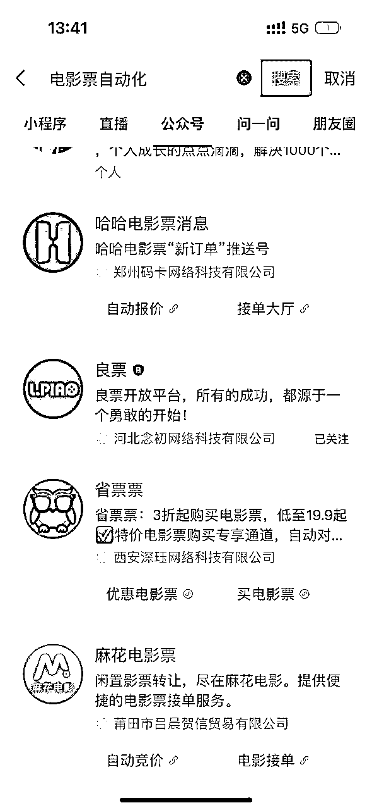

总结一下：

1、一定要有好奇心驱动

2、一定要去行动去搜索

3、不想付费，但可以咨询（通过咨询找到更准确的关键词）

4、一般的项目闲鱼淘宝都有，通过闲鱼淘宝获取到更优惠的方式来了解是什么

5、如果你想找的是某款软件，用微信搜索是个不错的方式（一般软件公司都有做公众号、小程序）

6、AI普及后，其实也可以帮助更快找到想要的信息

#### 案例2：外卖优惠券

这也是为了搭建红包封面公众号的自定义菜单栏，然后想搞清楚外卖优惠券是什么？我同样是用上面这些方法去搜索，知道了大概的结果，就是美团和饿了么的CPS渠道，可以直接通过它们的后台直接开通。但这貌似不是很方便，那有没有一个平台就能完全实现所有的汇集呢？当我执行到第5步，通过公众号搜索的时候，我发现有很多做外卖优惠券的公众号，有很多优惠券的方式，那它们是怎么做到的呢？

这里就有一个方法，如果你想看其它同行用的是什么软件实现的，特别是在公众号里。直接可以点开它们的主页，看授权的第三方服务是什么？（只有非常极少数的是自己开发，基本上用的第三方软件）然后找到这些服务的名称，继续在公众号里进行搜索，比如我调研了几个外卖平台觉得做的还不错，我就去搜了“西皮士助手”“美赚CPS”“聚推客联盟”等等。然后发现了聚推客联盟是免费CPS聚合平台，而美赚CPS是需要收年费的，西皮士助手只是一个运营平台而已，这样我就找到了【聚推客联盟】是可以用来做外卖等优惠券的；

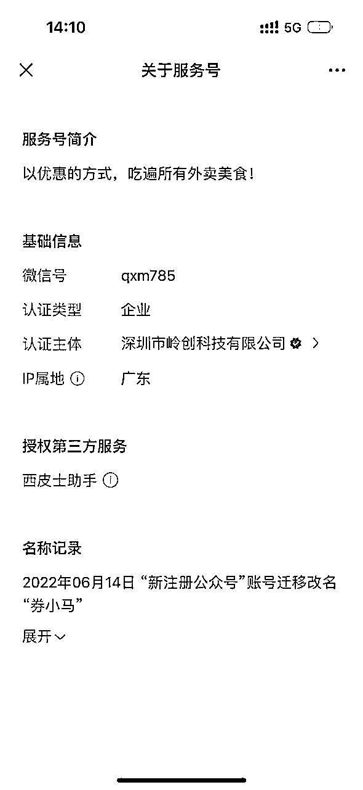

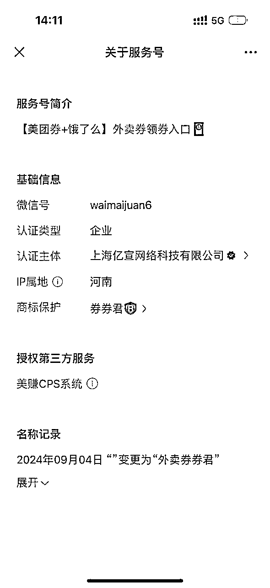

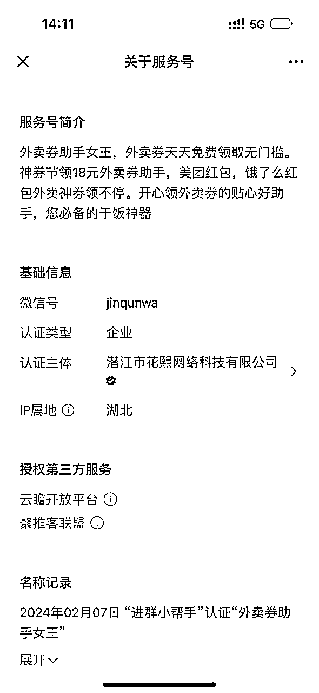

如果通过第三方服务找不到，很可能是内嵌的H5页面，可以在同行微信公众号里的网页打开的过程中，主要标题下方，可以看到对应的域名，然后进行搜索即可。比如下图的XXX.jutuike.cn，就知道是jutuike.cn的网址了，然后去百度等平台搜索一下就知道这个软件是什么了。

总结一下：

1、分析同行是怎么做的很重要，用的什么系统

2、一般微信公众号里面的项目，都可以通过第三方授权服务找到对应的软件名称

3、如果是微信公众号里面的网页，可以通过网页打开时，找到对应域名确定软件名称

## 二、这个项目能赚钱么？

每个项目都能赚到钱，但是不是你能赚到钱，是不是能赚到很多钱，这都是天时地利人和的结果。提前评估能不能赚钱的点很多，比如参考同行的数据、市场分析等，这些都太大了，我这里就不说了。我就举个最简单直白的方式：

就拿上面举的电影票自动化的项目，如何考量这个项目能不能赚到钱，需要辩证的看待搞培训的怎么说。如果真的百分百能赚钱，那就不用搞培训了，搞几十个号放大就行了。我们可以先进入到这些软件的官方社群里，基本上搞培训的都是靠着某个信息差（不会告诉你是什么在哪下载）的软件，再加一些自己的辅导陪跑。一般这样的软件都是有官方社群的，直接进入官方社群即可，看群里的人是怎么做的，能不能赚到钱。即使没有群，也有一定的售后，你可以和他们聊聊看。

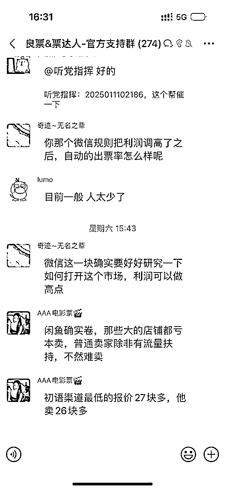

比如这个票达人的官方社群，我在这里面待了10天，200多人只有不到10个人说能赚到钱。除去没发言的，其实确实是这样，是符合金字塔效应的，能赚钱的就只有20%。因为闲鱼的推流确实是这样，那么多人在搞电影票自动化，为什么你的商品推给别人，是会有一些运气成分。但并不代表说，赚不到钱，我们就不去做。如果你感兴趣，可以坚持下去，那就去做吧。但做之前一定要控制成本，做好心理预期，如果你被割了几千学费，又没赚到钱，可能心理就更不好受了，所以请看下一章节：如果省钱去做项目。

总结一下：

1、如果是软件+陪跑项目，进软件官方群里去考察，可能是个简单直白的方式

2、辩证看待搞培训人员的话术，做好心理预期

## 三、如何省钱去做项目？

你的时间更值钱还是你的钱更值钱，在考虑省钱的时候，可以先问一下自己这个问题。如果你一个小时可以赚500，你就没必要花4个小时研究去省500。是的，如果你想省几千学费，但是可能需要花半个月自己研究，就看这样值不值了。拿我自己举个例子，我之前工作的时候，不忙划水的时候研究怎么做这些项目。但是我现在自己创业，我每天时间就很宝贵，如果我花1个小时研究不出来，我就会付费去买这个信息差。说完了“时间”= “钱”这个前提下，我们来看怎么省钱去做项目。

我们首先分析这个项目是个什么项目：

1、如果只是软件信息差的项目，这个钱能省就省，比如电影票自动化，外卖优惠券这种项目，在我看来就是纯信息差的项目，就是告诉你一个软件，然后录几门软件的操作课程（其实这些课程在软件操作指南和官方群里都会有很详细的解答）。如何辨析是不是软件信息差项目，可以问对方这个软件是什么怎么体验，如果不肯告诉你，大概率也不是他开发的，卖的就是一个信息差；

2、如果是纯经验陪跑的项目，比如告诉你应该怎么起号，怎么进入某个领域该怎么投流，靠自身经验来告诉你，这个就需要自我辨别，因为有的陪跑真的很水，就是60分的人教10分的人吧；

通过什么渠道来省钱做项目：

1、学会找到项目关键词，闲鱼淘宝拼多多搜索对应的关键词，可以找到对应的项目；

2、利用第一个步骤的方式，找到对应的软件名称；不用在软件里直接充值，可以闲鱼拼多多买各种软件的充值方式，基本上任何软件都提供分销！请记住这句话，也就意味着几乎每个软件都有比官方付款更优惠的方式。比如这个票达人软件官方500多1年，在闲鱼上200多就能买到1年；

3、学会在微信里去搜索，同样的陪跑项目，很多人都有在发，注意对比，可能价格低的陪跑效果更好；

4、利用信息差，你能找到的信息差别人不一定能找到；感兴趣的话，你也可以在闲鱼上挂一单说不定就能收获第一桶金；

5、时间就是金钱，省钱的同时，需要考虑花费的时间成本和精力；

总结一下：

1、省钱的同时需要考虑时间和精力的投入，看值不值

2、任何项目都需要辨析，判断项目值不值得花钱

3、软件信息差项目，除了可以省学费，软件充值费用也可以利用一些平台省去

4、多学习，该花钱还是要花钱

## 四、分享这两个案例的实操

以下是我自己操作过程的记录，快过年了，如果想做电影票自动化的项目，可以试试；导流来的人可以再转化到买外卖优惠券，如果可以配合红包封面一起做也很完美。

#### 实操1：电影票自动化

平台：票达人CRM、良票（直接在微信公众号搜索，这两个是一家）

在【良票】公众号的自定义菜单栏【解决方案】里面有票达人自动化的非常详细的操作说明以及视频演示，这里就不详细展开说了。

原理就是：用你的闲鱼账号模拟授权登录，然后通过它这个后台配置的一些话术和自动识别的功能，识别到电影票，然后通过它们系统底层的电影票报价系统给用户报价

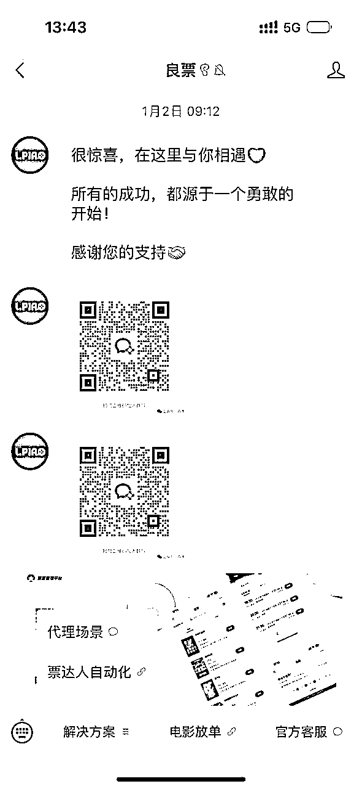

这里有几个注意点：

1、所谓的自动化其实不存在完全的自动化，一些异常情况还是需要人盯着看；

2、充值会员可以去闲鱼找一找，我找了一个260就能充值一年，比官方便宜200多（提供试用7天的机会）

3、关于闲鱼如何养号，可以参考生财航海里面的闲鱼蓝海，都是一样的；

4、【良票】这个平台还提供手动放单，点第二个菜单栏，担心出不了单，你也可以不用自动化，直接联系客服帮你开通这个手动放单的权限，客户来询价了，你手动去这里买了发给客户；

5、记得进他们的官方支持群，有任何操作不懂的，都可以问，都是免费给你解答的；甚至可以和其它同行探讨如何养号搞流量都可以；

6、如果你想要电影票卖的更便宜，你可以直接找源头，比如麻花电影票、芒果电影票、星驰电影票等源头，直接搜索即可；毕竟类似票达人这样的聚合平台肯定加了一点点价的

#### 实操2：外卖优惠券

平台：聚推客（建议使用网站端更清晰一些）

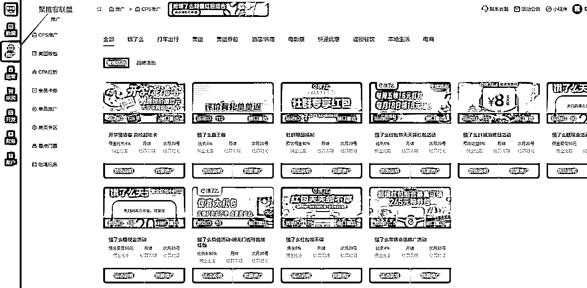

点这个推广就可以看到各种cps推广的渠道，这里面也是有电影票的cps（相当于用户自己去点击购买，不是用闲鱼承接的）

选择聚推客的原因是因为这个系统是免费的，免费的话，肯定是有一点加价，如果你直接在美团或者饿了么的商家联盟里开通可能是反10个点，到这里可能就是反9.5个点，大概是这样，不会加很多，但是更方便。

实操的时候，比如说饿了么天天领红包的优惠，你就点我要推广：

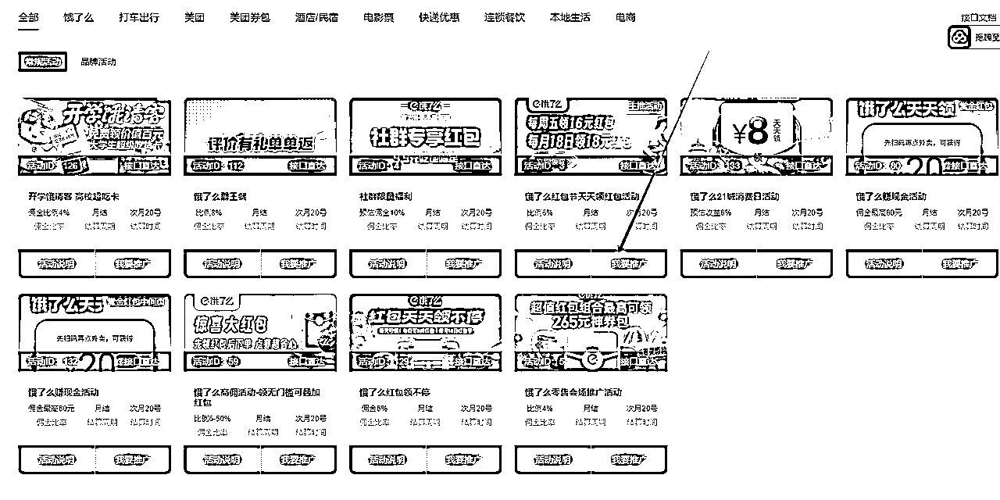

然后点开就给直接给到你的推广链接了：

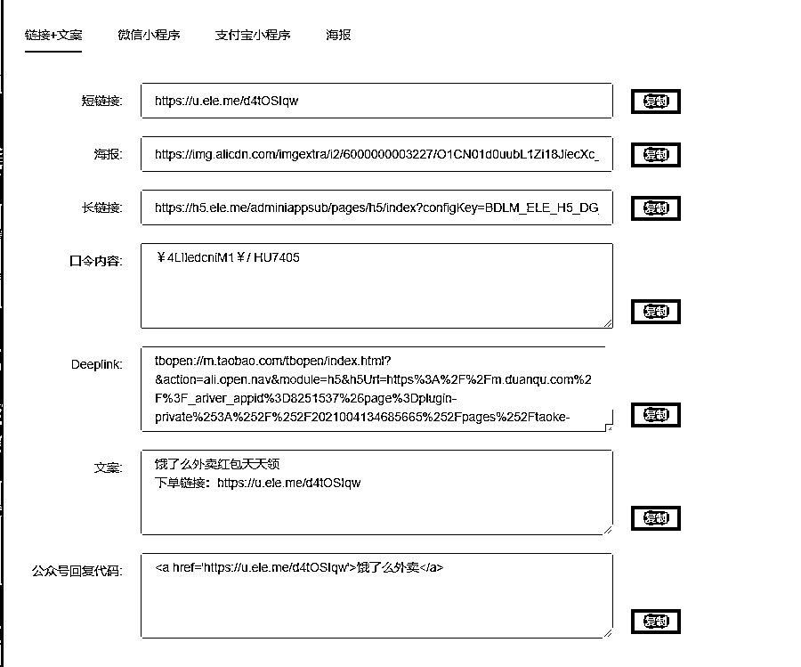

用户通过你这个链接下单你就有对应的返现，当然你自己平时点开后下单也是可以拿到这个返现的

目前外卖优惠券这个项目不太好做了，原因在于分佣提成在缩水，之前有10多个点，现在只有5个点左右，以前很多团队都还去抖音、B站投流搞这个，现在已经没怎么看到了，说明投产比根本根本不行了。

如果要做这两个项目，还是要搞定流量才是关键，虽然现在还是有很多团队收费几千培训这一块，但是流量是真的难突破。如果你要做这个，建议和其它项目一起搞，相当于这两个作为省钱的工具，比如你通过红包封面的项目（或者免费软件的项目）去引流，然后到你的公众号，然后公众号里放电影票优惠，外卖优惠券，用户群体基本上都是同一波，这样或许有赚到钱的可能。

我是Tilly，目前专注在考研培训领域第7年，对考研培训感兴趣和副业探索感兴趣的可以链接~