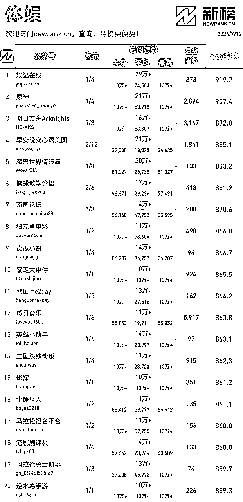
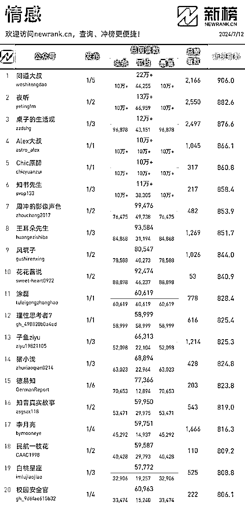
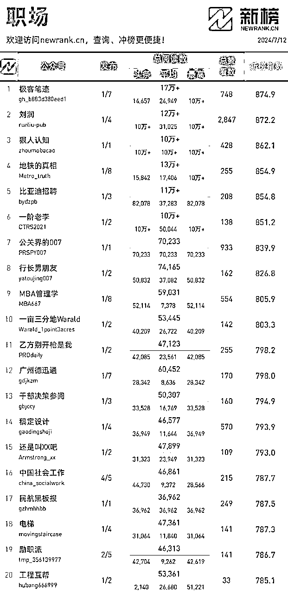
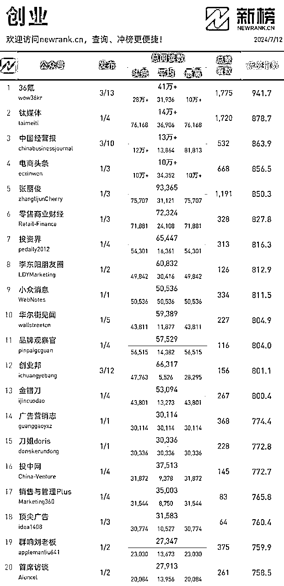
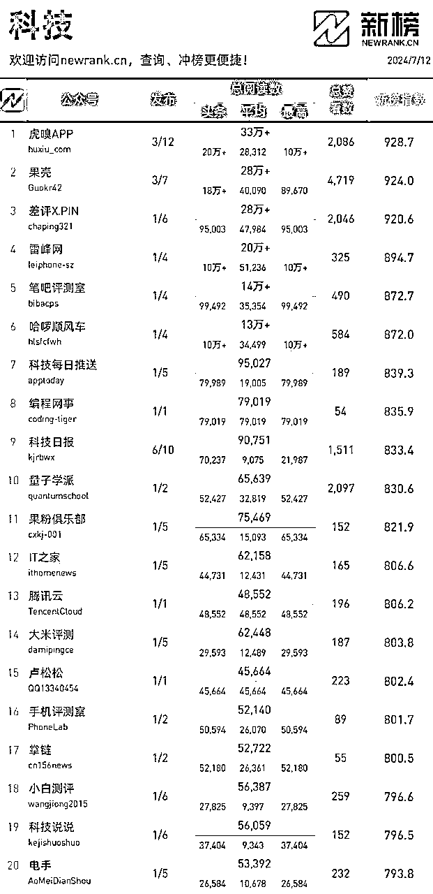
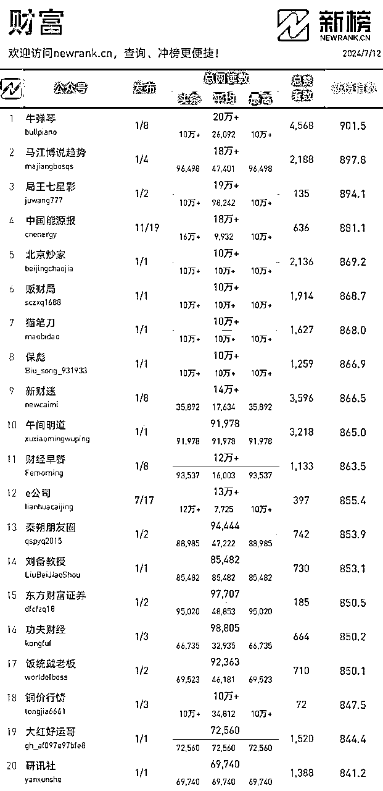
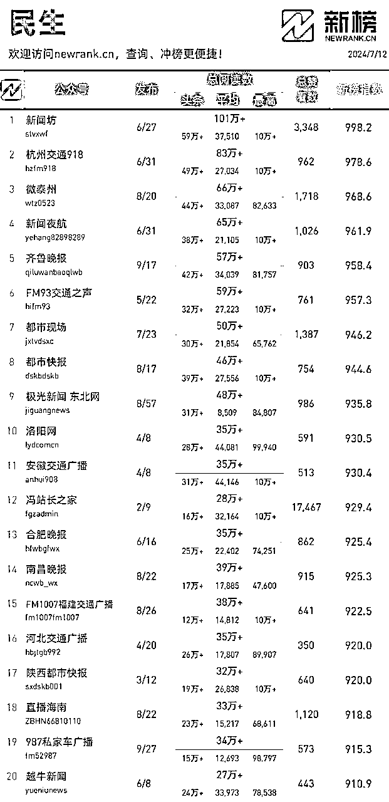
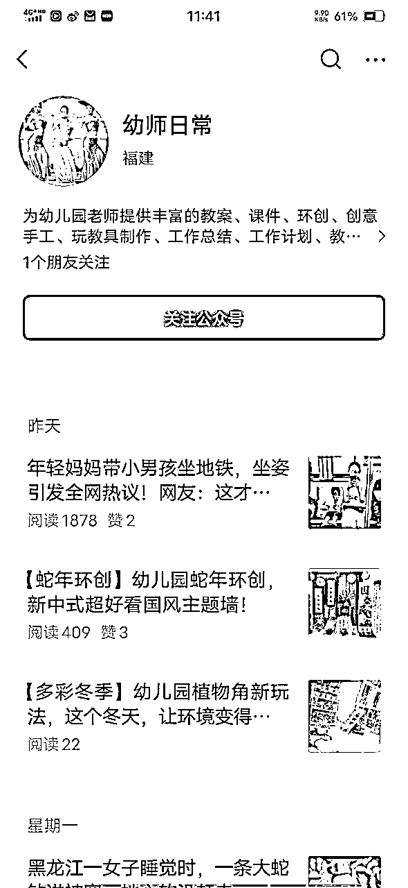
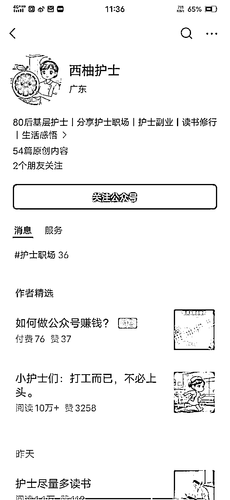

# 6000字帮你做好公众号IP选题问题

> 来源：[https://gd7vhxq16l.feishu.cn/docx/HD8ZdR1Qpovuqlx5YetcW7mlnD3](https://gd7vhxq16l.feishu.cn/docx/HD8ZdR1Qpovuqlx5YetcW7mlnD3)

虽然公众号航海已经航行了两年了，这也是存活最长的船只了，我在上面也待了七期，1期领队，6期教练，但是无论航海手册，高手领航，都没怎么详细去讲选题这个事情，这期航海的主题又是讲IP，这个问题就更重要了，因为IP爆文和普通爆文有一个本质区别，后者出池了，注销重来便是，毕竟账号是消耗品，出池了就换（注销）。

而IP爆文就不行，因为前面好不容易打造的一系列人设，故事，因为出池了，就要重来，真的是破碎。

所以，本文就想好好从9个层面来聊聊选题，做IP爆文，一旦选好，就要一条道走到底，为了避免做重复选题工作，不如一开始就重视起来，一次做好，当然你说，先完成在完美，我不反驳，只要你出池了，还能继续更，都行。

可以说，想做好公众号爆文IP项目，在启动项目时（发布文章），选题可以说时间花得越久，往后冤枉路就会走得越少。

对于如何选题，我们从以下9个方面来聊聊：

我在2023年12月份的时候更新过航海手册，里面简单提到过最前面的四点，但是没有讲透，希望这次对你们能有所帮助。

# 一、你感兴趣和擅长的

你想一下，如果你不感兴趣，这件事你怎么可能日复一日的做下去?

不一定非要擅长，就算不擅长，只要有兴趣，也能自学成才。

你感兴趣和擅长的，你就能有意愿日更，不管有没有收益，你都愿意更下去，毕竟坚持下去就能甩开一大部分人，做自己感兴趣和擅长的，本身都是从1开始，所以要比从0开始简单多了，日更就更容易了。

如何来确定喜欢和擅长的事情?

或者从喜欢擅长的事情里找到这么一件事情，可以从以下几个方面着手。

自 驱：在做什么事情的时候，你感觉自己很强大，不怕失败，也不怕别人评价，短期的失败，也不会影响，就是觉得这事我能成。

eg，每日日更500字，已经形成习惯，因为记录即疗愈。

想 要：有什么事情，是你非常想要!总也忍不住去做，不做就难受的?

比如对于我而言，文章排版这事儿，坚决不马虎，当然也不是追求完美，就是觉得读文章的时候，体验好这事儿必须安排给读者。

忘 我：什么事情是你沉醉其中，停不下来，忘记了时间的流逝，牺牲休息时间也要做完的?

比如，吐槽hcy/zdd的时候，总是不知疲倦，一敲就是一个小时，有时候晚上22点开始工作，很容易到23点半才上床睡觉。

很 爽：什么事情，在做完之后，让你有巨大的满足感和成就感，感觉很对，很爽。

一个人策划了一个项目，从拿到项目，策划、营销，每个细节都符合自己理想的模样。

还有就像写这类型的文章时，总有一种如释重负的感觉，文章虽然不一定能得到亦仁的那8个大字，但是这样的文章每完成一篇，感觉我攻克了一个课题，总是喜形于色。

当然，如果你看到这里，你真的还是不知道自己喜欢什么擅长什么，我挖掘了一些关于擅长的事情问题清单，你只管回答便是，扪心自问就好。

（1）在过去的人生中，你感到开心的时刻或者感到开心的经历是什么?

（2）郑重地问一下身边亲近的人：你认为我的长处是什么？

（3）如果打算明天就辞职，之前的工作中有没有你留恋的部分呢？或者如果你现在没有工作，请思考之前工作中的细节。

（4）你至今为止取得过什么样的成果，你是如何做到的呢？

（5）什么样的工作能让你沉迷其中？请具体描述。

（6）什么是你从小就擅长或者曾经擅长的？

（7）迄今为止，什么是你天生就会，能轻松搞定而完全不会感到累的？

（8）最近，感到幸福充实的一天是怎样的一天？

找到喜欢事情的问题清单：

（1）你现在有即使花钱也想学习的事情吗？

（2）在你的书架上摆放着什么类型的书？

（3）有没有遇到过让你产生“真是太好了！”它拯救了我！”这种感觉的领域或者事物？

（4）不需要考虑工作、金钱之类的条件时，你喜欢什么？

（5）如果不用担心金钱的问题，而且什么都能成为工作的话，你想做什么样的工作？（别担心有没有，能不能，请暂时认为有，能）。

（6）迄今为止，你在什么地方比其他人花费的时间更多？

（7）什么是你经常搜索的？（请按照高中，大学以及现在这3个阶段分别填写。）

（8）你喜欢或者曾经喜欢的电视节目是什么？

（9）你对什么会产生“为什么”“怎么做”之类的疑问？

以上问题，你试着找张纸，写出来，相信你一定可以找到你喜欢和擅长的事情（领域）。

# 二、你的技能和工作经历

关于喜欢的和擅长的，以上是情感因素，如果你是这个领域的专业或者佼佼者，其实，就不要浪费这样的资源，把号做起来，无论你是做IP号，还是爆文号，最终的结果，应该是把流量主收益作为副业的副业，而引流做课卖服务才是你的真正副业，这是持久之道。

你的技能和工作经历，熟悉的路，再走下去，就是深耕，深耕就可以从你专业角度去做素材库，乃至素材系统，体系，说白了，流量主项目就是素材搭积木的过程。

有时候因为流量主做成了IP号，也是因为这个层面。

其实，如果你有一技之长，完全可以一手爆文，一手IP，无论哪个号入池了，你都可以把这两个号，看成甲方与乙方的关系，尤其是，在爆文号里给IP号打广告。

而且两个号的内容素材是一个大领域，不同内容方向，建立素材库的时候，也是可以一鱼多吃的，在收集素材这个动作的时候，也会节省不少时间。

比如，你是一个护士，就可以搞一个这样的号，如果你是一个幼儿园老师，也可以搞一个这样的号。

# 三、市场所需要的

这里提到的市场，我们可以总结为，真正的市场和未来国家政策倾向的市场。

市场所需要的，你才会想着去模仿，如果这个没有市场，你模仿出来也无济于事。

我们可以先看看真正的市场：

至于如何去看市场是否需要，可以去新榜的每周排名，或者看看国家GDP各行业的分布情况。

我们现在来谈谈未来国家政策倾向的市场，看透表象，我们做起来就容易多了。

目前中国14亿人群，基本上包括了以下5个方面：

（1）银发经济：老年人市场

消费趋势:有钱有时间有保障，退休休闲放松，空巢无人陪伴。

延伸需求:老年医疗护理，老年社交养老机构，老年医陪，陪聊。

（2）单身经济：青年人和大龄人群

消费趋势:注重便捷，网购外卖为主，品质科技感智能化，宠物社交，精神寄托与陪伴，宅不喜欢线下社交。

延伸需求:迷你家电、一人食、轻食，宠物寄养、陪护、陪，知识付费提升技能，悦已消费付费提升。

（3）旅游经济：

国家每年这样调休，就是一方面刺激旅游市场，盘活旅游经济。还有外国人到中国旅游的优惠政策等等。

（4）宠物经济：独居老人和单身人群

消费趋势:忠实伙伴、陪伴，情感的寄托、宅系养宠。

延伸需求:宠物用品与美容服务，宠物寄养与托管、保险，宠物培训与行为矫正，宠物社交:电子养宠、自媒体养宠。

（5）个人成长经济：每个人成长是刚需，不同年龄、不同职业。

这5个市场，不管是未来还是现在既是刚需，也是趋势。同时，重视养生、老龄化、独居生活、生活压力、单身生活、背井离乡也是这个时代不可避免的现象。

一句话总结以上3点：

喜欢的事×擅长的事×市场需要的事=真正想做持久的事IP

# 四、输出习惯

你的输出习惯，决定了，你用哪种方式来啃这个项目，输出习惯本身没有优胜略汰，没有好坏，就像兵器一样，长短没有好坏之分，要看你怎么用？你用那种兵器趁手？你喜欢用那种兵器？

这里的输出习惯主要是指，手搓，AI写，口播，这里每种输出习惯都可以组合起来用。

当然，一定是你觉得最舒服的，当然你也可以去克服去学习其他输出习惯，一但拥有两种以上输出习惯，你的日更就简单起来了。

输出习惯，这个习惯很重要，没有的话，要去培养，就跟写作能力一样，这里多提一点，是否需要借助AI，AI是放大镜，不是本质东西，说白了就是一个工具，但是前提得懂项目逻辑，爆款逻辑，才能用好工具。

这四点，我在很多平台都提到过，尤其在公众号航海里讲到过，都是一再重复，希望大家能引起高度重视，因为如果不是基于上面四点，你选的领域空而大，后期，收益不好的情况下，很难坚持下去，当然，以我的经验来判断，所有人都是基于以上四点中的一点或者多点在选择领域。

只是排名顺序不一样罢了。

也恰恰是因为排名的不同，结果的差异也很大。

比如，你是基于首先选择市场所需要的，可是你的输出习惯跟不上，没有前面两点做支撑，你更新的不是日更，是在消耗你的意志力，我们日更要是花费我们绝大部分的精力的话，很难再有精力去考虑文章质量。

拿我选择剧评这个领域来说，我是通过打分来选择领域的，具体操作请看下面：

比如我选择娱乐领域里面的剧评，我感兴趣，15分，因为还不够狂热，当然也没有太多时间追剧的原因。

感兴趣或者擅长，15分，这个就要从知道、了解、熟练、精通四个阶段去评估，从一开始的10分过渡到15分，或者叫提升。我知道娱乐领域可以做，但是了解还需要深入了解，整个文章流程熟练了，完全精通。

市场需要的电视剧和电影的剧评，这个目前还是刚需，一定是20分以上。

这里给大家还是留一个作业，可以按照这个模板去写。

领域、细分方向、单项打分（兴趣、擅长、市场需求、竞争度、输出习惯）、总分。一般超过60分，都可以去选择，当然分数越高你成功的机会越大。

|  | 领域一（细分方向） | 领域二（细分方向） | 领域三（细分方向） | 领域四（细分方向） |  |
| 兴趣 | 国内武侠20 | 国外悬疑20 | 科幻 | 国内生活 |  |
| 擅长 | 10 | 5 |  |  |  |
| 市场需要 | 20 | 20 |  |  |  |
| 输出习惯 | 15 | 15 |  |  |  |
| 总分 | 65 | 60 |  |  |  |

# 五、按照市场广告、政策、内容需求

一方面AI环境决定了，比如最近AI商业广告很凶猛，你就可以去做一块关于AI普及、使用、运用三块来解读中国市场下的AI环境，相信账号做好了，商业广告接到手软。

一方面，这种最后就是走代运营模式，目前我知道的一块还是蓝海，就是幼儿园账号代运营，自己之前接过旅游代运营的单子。

其实意思就是你做一个关于幼儿园的账号，去吸引甲方找你合作，合作模式多样化。

# 六、关键词

### 1、按照领域关键词建立素材库

选择领域关键词前，一定要做好细分工作。

比如，咱们拿最常见，最容易出效果的情感领域来举例：

情感号从大方向可以分为：婚前内容和婚后内容。

婚前方向：可以围绕恋爱、相亲、单身、催婚、情侣生活记录等角度展开。

婚后方向：可以围绕夫妻关系、婆媳关系、亲子关系等围绕家庭生活记录展开。

离婚方向:可以围绕离婚后心理变化、单亲带娃辛酸史、二婚再婚、黄昏恋等展开。

是不是发现这样细分下来，内容是相当多，可选的赛道突然多起来了，别急，我们在继续细分。

比如婚前方向有单身、催婚、相亲、恋爱、情侣生活，每一个纬度可以继续细分，细分完以后，可以根据自己的优势和资源，选择一个方向，最后考虑用什么方式去做公众号？

总之，每一次细分都是在打开一种能量，越细分，平台机器筛选用户给你越精准，它就知道你越想要啥。

比如，咱们细分到赛道：

骗婚、婚闹、婚礼习俗、彩礼、相亲见面、大龄剩女与宠物的故事、1亿光棍的归宿、婚姻里的利Ta、女方回礼、捞女、情人节礼物

这些关键词，都可以融入到标题、内容、选题上的。

我们再拿鸡汤领域举例子：

（1）拿鸡汤号来说一说，从功能上可以细分三个方向：

一般鸡汤，就是咱们正常理解那样，好好努力，考个好大学，好好工作，赚钱买房，总之，就是好好学习，天天向上。

毒鸡汤，一些特别极端例子，打女权，就是把男女搞对立，相亲这个话题特别多，一边说女生太物质，一边说男生30岁存款得多少多少，没有就不行等等言论，其实就是搞对立。

虽然不耻这个话题，但是流量真的拉满。

反向鸡汤，共情，躺平，全职儿女，慢就业，不那么努力，丧一下，丧一会儿。

从不同领域的关键词，都有自己的一组关键词，我从网上搜了一些给大家看看：

-SNS投放：小红书、微博、平台规则

-短视频：抖音、B站、脚本

-出海电商：shopify、引流、脚本、政策

-微商：宝妈、自销、体系、朋友圈营销、易感人群

-学龄前教育：早教、不听话、吵闹、婆婆

-中小企业管理：小团队、小微企业招聘、顾问、倒闭、合伙人、流程

### 2、根据目标人群，列关键词，比如年轻人的躺平，失业人群等等。

再讲讲鸡汤，因为是我自己深耕的一个细分领域。

从确定领域，细分方向，到找对标，拟标题，写爆款文章，一系列动作讲起。

鸡中高考家长，起跑线、兴趣班

鸡年轻人，失业、恋爱、婚姻、房奴

鸡35+中年人，三座大山

鸡老年人，怕死、生病。

可以说，选什么领域，就是选什么人群，人群决定了你的内容、写作习惯、文章发布时间。

### 3、还有一些关键词类别

（1）阅读时间关键词

人群从阅读时间就可以划分，一般老人早上到中午看到多，晚上不如年轻人看的多。比如早晨6点起床养生、8点做操、14点打麻将、18点跳广场舞。

（2）女性比男性更加情绪化

这里标题带着情绪的话，更容易使女性点进来。焦虑、抑郁、治愈、嫉妒都是很关键的词汇。

（3）普通人追星，没有粉丝，亦或私生饭更加狂热

对于大热的明星来说，自带超大流量。明星名字关键词，比如王一博、肖战。

（4）行业特定身份关键词

一些相对比较专业的群体，比如法律、法官，银行、医生、教师、护士等等。

# 七、根据多巴胺选题

人类快乐因子：多巴胺，分泌数量前二十的行为排名:

1、男欢女爱

2、还清债务

3、吸烟

4、工资到账

5、涨薪

6、对方还钱

7、打游戏胜利

8、饮酒

9、健身

10、吃到美食：糖果、奶茶、炸鸡、烧烤等，高盐糖且容易“成瘾”之类的

11、朋友相聚

12、按摩

13、完成任务

14、看完一本书

15、追剧

16、听歌

17、洗热水澡

18、睡到自然醒

19、游泳

20、得到赞美

温馨贴士：加两条

长期慢性疾病被治愈了。

逐渐对异性失去兴趣的三大爱好：爬山、钓鱼、摄影。

# 八、常规热点

大热点追起来太累，不如去追常规热点追起来有准备，一年四季，每年都会出来的一些常规热点。

所谓常规热点，就是每年都会出来一次，大家可以把之前的爆过的文章，修改一下，再发一次。

### 我们按照时间顺序来捋一遍：

1月：元旦、微信红包封面、年终总结、年终奖、流感、咳嗽、肺炎

2月、春节、返乡、堵车、过年、元宵节、情人节、学生报名、景点人满为患，春晚

3月：开学、植树节、315、

4月：愚人节、张国荣哥哥

5月：劳动节、

6月：儿童节、高考、618、中考、考场结束的采访、放假

7月：填报志愿、暑假、夏令营、七夕、暑期培训班、写作业

8月：暑假档影院

9月：开学、教师节、中秋节、晒秋、

10月：国庆节、

11月：双11，光棍节，

12月：双12、圣诞节、跨年演唱会

这些只是冰山一角，大家可以自行比照自己账号领域里的常规热点，虽然这些常规热点不如大热点流量高，但是好在可以提前准备，提前文章布局起来。

### 我们按照事件发生的频率来捋一遍：

跳楼、跳河、交通事故、校园霸凌、失业、裸辞、35岁被辞退、公交车让座、娱乐圈的瓜田李下、结婚人数屡创新低、出生婴儿屡创新低、实体门店关闭潮、网红卖假货。

### 我们按照一年四季出现的网红：

每年的网红，其实，也是常规热点。

每个新网红的出现，总会勾起旧网红。

比如，高考唐尚珺，网红（三只羊）卖假货，见义勇为被曲解。

我们来举一个比较典型的常规热点：

春节快到了，很多人又要出门旅行，或回老家，那家里的宠物怎么办？

若送到寄养中心，比较贵，上门喂养小动物的需求就诞生了。

第一：怎么收费的

3公里内:30/次

4公里内:35/次

5公里内:40/次

6公里内: 45/次

10公里内:60/次(多一只多+5块)

那这种一天20单没问题，平均一天也要600～800块。

第二：服务的内容

除了喂养之外，为了增加你产品的竞争力，

你还可以提供：

1、更换饮用水

2、铲耙耙

3、及时反馈宠物的状态(拍照 视频反馈)

4、赠送浇花喂鱼服务5

5、上门会自我消毒，准备好一次性手套出门会检查门窗是否关紧

6、遛狗一次（5分钟）

第三：那怎么宣传呢？

很简单在春节前一周开始地推撒广告，比如，哪个小区附近宠物多就发哪里，以及通过线上宠物群获得潜在的用户

再比如在小红书上，做个账号，封面写上同城+服务 （比如重庆宠物上面喂养）

然后标题，封面，合集，都要打上关键词。

第四：你一定要写好注意事项，我帮你罗列出一些可能的问题

1、最好是接家里有24小时监控的，防止引起不必要的麻烦

2、最好是自己也全程录像

3、提前让对方准备好钥匙，以及门的临时密码

4、有攻击性的宠物最好不要接，避免被咬

5、怀孕的，有病的，也不要接

6、要记得让对方付定金，最好50%

看似是引流转化私单，但是流量主收益也会很高。我们两头都能吃。

# 九、人物领域

我看到很多专门写人物领域的，长尾效应都很高，选择一个细分领域，怒怼文章就行了。

1、虚拟的

2、动漫的

3、影视剧角色

4、真人真事

（1）科技、互联网

（2）体育

（3）网红

（4）腾讯九九公益被帮助的人

# 十、赛道列表：

我帮大家列出来目前市场下所有领域，大家可以看一下，每个领域还能继续细分下去：

历史

军事

民生

财经

科技

创业

汽车

楼市

职场

教育

学术

文化

健康

时尚

美食

乐活

旅行

摄影

幽默

情感

体育

娱乐

影视

美体

萌宠

鸡汤

游戏动漫

母婴育儿

爆款方法论

关于细分方向，大家可以先按照自己的认知去细分。

以上9种选题思路，给打算做公众号IP的圈友食用，当然这些方法不限公众号平台。

看完后，你可以思考：如何去选题？如何去选择长期可以经营下去的领域？如何去选择一个除了流量主变现以外，还能有其他手段变现的领域？

灵魂三连击直至你选中自己满意的领域，然后go all out for。