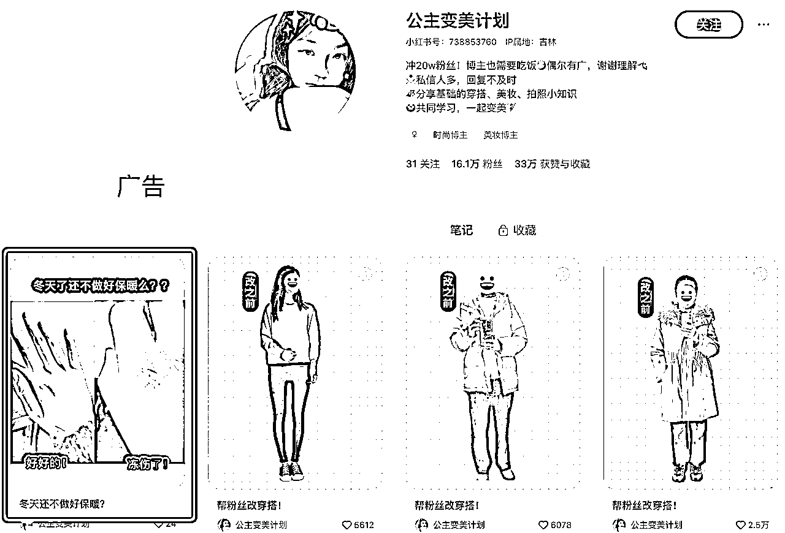
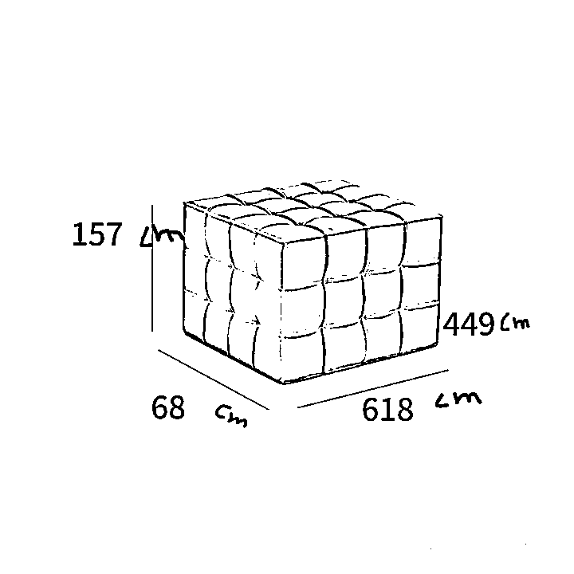

# 适合新手的10个自媒体副业项目测评 1～5

> 来源：[https://p03a4vs9s2.feishu.cn/docx/JBcpdV2RRoGcYzxF1A9coxVdnWf](https://p03a4vs9s2.feishu.cn/docx/JBcpdV2RRoGcYzxF1A9coxVdnWf)

halo，我是叁斤，公众号：叁斤。2025年我给自己定的目标是赚到100万，用主业+副业的方式

我的主业是小红书操盘手，做自己的项目。此外，我也喜欢探索副业项目，跑通之后交给团队去经营。主要集中在小红书、得物、公众号和闲鱼平台

对于刚准备做副业的人来说「一个项目是否适合自己」比「这个项目怎么做」更重要，不然项目做到一半，发现根本不适合自己，白白浪费了一些时间

我在探索适合自己的副业时，也会选择一些做过副业进行测评，感兴趣的圈友挑一个项目，搜一下教程就可以开干了！

原定是 10 个项目测评，但内容太长……我担心自己拖延，迟迟不能交稿，索性分了上下两期，这是第一期

我的项目主要集中在「小红书平台」，所以第一期有几个都是小红书项目

### 目录：（链接直达对应项目）

### 小红书千粉商单

### 小红书达人商单

### 小红书虚拟资料

### 小红书电商

### 得物好物种草变现

全文 1.2w 字，内容比较长，可以点击目录跳转到感兴趣的项目阅读

# 小红书千粉商单

小红书在收紧了品牌种草合作之后，所有商家想要通过小红书种草，就必须通过蒲公英合作

如果水下种草笔记数量太多，通过蒲公英种草的数量太少，就会导致品牌分下降，甚至封品牌词

因此，很多品牌方就会找一些低质量的博主，通过内容直发的方式降低蒲公英投放成本，这是项目的起源

对于个人博主来说，小红书千粉商单是最容易上手的小红书项目，注册一个小红书，发张粉笔记，涨到1000 粉丝以上就可以入驻蒲公英，然后接受品牌方和广告主的邀约，进行付费的广告笔记植入

一般这个合作是直发，就是品牌方把图片、文案都准备好，博主只需要上传发布就行了，平均费用最低是 100 元起，商单内容大概长这样：

这个项目我在去年测试过，运营逻辑跟得物相似，先张粉，再接单。但是只有得物做得好，小红书的千粉商单失败了，原因会在后面测评详情中写

## 千粉商单怎么做？

做小红书千粉商单号，大致分了一个步骤：起号准备、爆款内容制作、蒲公英开通与变现、mcn机构签约

### 起号前准备

小红书千粉号需要准备：2部手机、2张卡、2个实名认证

由于单个商单合作的费用不高，也不可能一个月全部内容都是商单，所以单账号的变现天花板很低

一般做这个项目的，都会做多个账号的矩阵，不管是从变现角度，还是从起号成功率角度看，至少都应该有2个账号以上

因为接的都是直发广告，是不被平台允许的，而且起号方式有点粗暴，所以会存在废号风险，也存在判定营销号的风险，所以在起号时，一定要一卡一机一号

在注册账号后，对应的头像、昵称、简介等修改一下就行，没有必然要求

### 爆款内容制作

准备好账号后就要开始做内容，小红书千粉商单号变现，内容就一个关键：张粉

什么内容火，什么内容可以涨粉，就做什么内容。如果吸引的用户是25～35岁之间的女性，能变现的概率会更大

我们这次测评不会详细到每个内容怎么做，但会推荐几个容易涨粉的选题类型：

1、影视综艺剪辑

在各平台找热门明星、娱乐综艺、影视剧的视频内容，就行混剪处理

2、电影/书单推荐

做大合集的电影、书单推荐，非常容易涨粉。书单和电影内容可以从别的博主的合集中筛选

3、宠物+语录

找一些清新语录，配上宠物的图片

涨粉内容非常多，咱不是教程，不在这一个个写，分享一下我用的方法：

在灰豚数据中（千瓜、灰豚都可以，我只有这个），找到涨粉榜和热门笔记榜，在这两个榜单中找适合自己的爆款内容方式

前面3种内容类型，有2个都是我在实时热门笔记榜中现找的

在看涨粉榜时还发现一个账号，做的是穿搭，也是通过直发商单变现

这种内容类型也适合新手模仿

### 蒲公英开通与变现

当粉丝涨到1000了，就要开通蒲公英，要求如下：

第一：完成实名认证，且年龄>18 岁

第二：粉丝数>1000

如果粉丝刚达到1000，不要马上认证，因为存在掉粉情况，尽量等到1100左右再认证。认证通过后，就可以坐等商单啦

### mcn机构签约

素人做小红书商单，被商家看到的概率太低了 ，如果没有很大的爆文，有可能很长时间都接不到商单

但是商家是有投放要求的，只是很难找到你。商家一般会和mcn机构合作，可以批量合作达人

所以外面很多知识付费的老师，都会要求绑定他们的MCN机构，这样能确保学员起号成功后能马上接到合作

这对学员来说即是好事，也是一个坑

## 测评详情

了解完整个项目，就来说下我对这个项目的看法

### 项目优势

毫无疑问，千粉商单确实是小白在小红书最容易变现的项目，不需要做电商那么全面的运营、也不像做IP一样那么长周期，新手起号快的话，半个月就能跑通变现

而且做这个项目也没什么风险，没有技巧，只要花点心思，谁都能入门变现，每天 1-2个小时在家就能做。商家需求还很多，新人也不用担心变现问题

### 风险点

为啥我会放弃做这个项目？展开说说我看到的风险点

1、平台不允许

我个人做项目比较倾向于与平台共同成长，不喜欢做违背平台规则的事情。商单项目合作的是直发，平台判定是虚假种草，一旦被发现，会降低蒲公英等级，甚至封号

2、项目不长久

这种直发内容，是一定会影响平台种草生态的，所以平台不允许。加上这个项目没难度，谁都可以做，当平台里面类似的违规内容多了，就会下重手打击

其实之前已经打击过一次了，但是力度没有很大，所以这个项目还活着

3、没有复利

我做项目另一个习惯，就是要做有复利的事情

就是一个项目前期赚钱少无所谓，但是一定要越赚越多，或者越来越有影响力

个人能力获得提升，也算是复利的一种，未来可以靠能力变现

但商单号做不到，能力提升不了很多，收益也基本固定这些，还有项目崩盘的风险

4、大坑：签约mcn

外面很多商单知识付费都是这样，先付学费，然后学习，涨粉接单达到多少钱了，可以退回学费。要求就是必须签约mcn机构，机构会持续提供商单，但会抽走50%收益

也就是说，不算合作返点的情况下，100块钱合作费，平台抽10%，mcn再抽50%，到手就只有45了

当然，以上是良心mcn的情况，因为他们确实会为你提供商单，提供后续指导，也提供学习课程，抽点很正常，是合理的商业行为。如果没有他们，你可能一分钱接不到

我说的大坑，是黑心mcn，前面流程是一样的，但是后面会变成，不提供商单合作给你

你学会了之后，自己做内容、自己涨粉、自己接单，然后接的商单会被mcn抽走50%，他给你提供的仅仅是起步的课程

有非常多的人遇到这种机构后找我问能不能解绑，这个是不能直接单方面解绑的，没办法

所以如果你报名知识付费去学习、实操这个项目，一定一定一定要看这个人靠不靠谱，多问几个人，确保这个老师是靠谱的，再去学习

### 适合谁

我没有给项目进行打分，会给一些建议

如果你完完全全是个0基础的小白，然后又能找到靠谱的老师（不是我，我没有！我没做！），那可以去操作一下

虽然前面说的是只需要1～2个小时，但如果你真的是小小白，想快点变现的，建议每天至少有4个小时时间投入进去

# 小红书达人商单

小红书千粉商单和达人商单？两者有什么区别？

其实没啥区别，达人商单和千粉商单，都是我自己加的名字，其他人的叫法可能是反过来，也有人叫“自媒体商单”……

从本质上说，都是在小红书上涨到1000粉丝以上，开通蒲公英，接广告合作，只是完成任务的路径不一样

千粉商单，是通过不择手段的涨粉，然后接直发广告。收益天花板低，没有复利，容易违规，好处是足够简单

达人商单，是正经运营，做IP、做人设，在内容中突出广告位，让品牌方来投广告合作，相比之下，比千粉商单的天花板更高、更持续，也更安全

分享几个达人商单变现能力超强的账号：

1、妈的欧洲账本

一条图文报价3.3万，10月份接单5条，11、12月更新少，各接了1条

内容特点是，随手拍图+大字报，文案风格幽默搞笑

2、贫民窟女孩

一条图文报价1.7万，12月份截止写文日期（20号），接了4条广告

内容特点是，用聊天记录的方式讲述一个故事，故事有笑点

3、团子的小鱼干

一条图文报价2500，12月份截止写文日期（20号），发了22条广告，接单能力超强

内容特点是常见的plog类型，内容人设、风格，都很统一

4、旺仔小哈哈（挖宝版）

一条图文报价7200，一个月接广告21条，也是超强接单能力

内容风格是随手拍的护肤品，标题会蹭大V流量

以上是最近看到接单能力超强，内容也极具个人特点的几个账号

我刚开始做小红书时，也是做的达人商单变现，现在把项目迁移到得物，也有不错的反馈

下面是详细测评：

## 达人商单怎么做？

之前分享过： ，就是做的达人商单变现，更详细的教程可以跳转阅读

### 起号前准备

小红书达人商单需要准备：1部手机、1张卡、1个实名认证

收益天花板比千粉号高，内容难度也更高，新手起步，能把一个账号做好就很不容易了

因为是正经运营，内容也合规，运营过程中不太注重账号切换、Wi-Fi隔离之类的，正常连Wi-Fi、正常切换账号登陆，都不违规，一部设备登陆3个账号，也是安全的

### 账号定位

账号定位 = 赛道 X 用户 X 价值 X 人设 X 视觉

一个账号，包含运营赛道、目标用户、账号价值、人设和视觉，其中最重要的是 目标用户和人设，其他都是在这两点的基础上补充

1.赛道定位

选自己感兴趣或者擅长的赛道，同时，这个赛道要容易变现的，前景比较好的，才算是好的赛道定位

具体个例子，有人擅长玄学类的赛道，很容易变现，但是前景不好，容易违规

2.用户&价值

在运营之前，一定要想明白你的目标用户具体是谁，你能给她们带来什么价值？

需要注意的是，目标用户不是“粉丝”，而是一个具体的人

比如：

要做一个减肥账号，目标用户可能有：“想通过吃来解决肥胖问题” 的人和 “想通过锻炼来解决肥胖问题” 的人

定位哪一个用户，取决于你能提供什么价值？第一种用户，需要各种减肥餐， “食养” 类产品，要提供的价值是 “不用运动减xx斤”

如果是第二种用户，就需要分享各种锻炼方法，分享很多减肥的运动动作，还可以推荐运动、健身工具或者相关产品

3.人设定位

做完前面的定位，人设就很清楚了

关键在于，人设要真实、简单，不要把人设定的太复杂，也不需要一开始就想好什么视觉锤、声音锤之类的

就好好的体现自己的性格、爱好等元素就行了

4.视觉定位

简单的视觉定位，就是区分图文和视频，实拍和非实拍

个人建议，小白先做图文，快速做控制变量法测试，确认自己的文案是没问题的，再拍摄视频

直接拍摄视频的话，在测试时，不好判断问题出在哪。可能表达不行，也可能拍摄不好，或者文案不行，很难判断

所以可以先做图文，把文案相关的问题排除了，再把内容拍成视频

### 爆款内容制作

更详细的内容制作，都在这里写过：

这篇就不再重复了，这里讲一个新手运营账号的误区

大部分新手做自媒体，很容易陷入⽆法变现或变现困难的结局，很多情况下都是遇到以下几个问题：

过于关注粉丝量和互动量

什么内容涨粉，就发什么，什么内容互动好，就发什么，比如这种语录类笔记：

这种内容比较容易出爆⽂，但是于达人商单的变现价值来说，很低。这种内容最终只能做成“千粉商单变现”，接直发广告变现，没什么钱

内容质量太低

这里放2张图片给大家感受下，什么叫内容质量差：

同样是家居博主，左边这个图片质量比右边的好很多，能接的广告也更多，价格更好

同样是翻包博主，左边的图片色调看着很舒适，内容有明确选题“春节出行”，而右边的拍摄很随意，东西看着很杂乱，还没有明确选题

作为用户，肯定更喜欢看第一种。作为品牌方，也更倾向于找第一种内容的博主去推广

### 广告能力提升

做好广告位，主要有以下几点：

1、粉丝忠诚度

2、账号商业属性

粉丝忠诚度

想要获得关注，首先自己要成为值得被关注的人

自媒体的本质就是做自己，发什么内容，就能吸引来什么样的人

越是发深度思考的内容，吸引来的用户质量越高，用户粘性也越高

这些内容通常不会过时，我现在还时常翻出“李叫兽”的文章来看，这些文章都快10年了

账号商业属性

好的内容，应该是用户和粉丝相互尊重的。一个笔记里过度尊重用户，会变成迎合，用户感受不到你是谁，也不会为你付费

在内容中既给出干货，又有产品种草推荐，才能更好变现。文案中植入种草内容，向用户推荐些产品

图片中，要有对应产品的展示空间。举个例子，要接扫地机器人的广告，图片中至少要有一个好看的地板

## 测评详情

从2020年做小红书，就是达人商单变现，到现在依然有空间

虽然很多人说品牌方投放预算减少、博主接单很难，但看了前面的案例就会发现，有很多博主依然每天一条商单

而且只要跟品牌方有深入沟通就会发现，他们很缺优质的博主

### 项目优势

小红书达人商单跟千粉商单最本质区别，一个能长期做，做的越久收益越大。一个只能短期做，随时有被平台管控的风险

达人商单就是平台允许的，而且变现天花板更高，除了体现在商单价格上，还体现在买手带货上

千粉商单是不太可能通过买手的方式放大收益的，但是达人商单可以通过直播带货，让收益突破商单天花板

举个例子，有个博主叫@几只灰，2000粉的时候开直播带货，3个月的时间成长到月销百万的买手

这种案例在千粉商单中是不可能出现的

这就是达人商单最大的优势：天花板更高，更持续，有复利

### 项目劣势

相对的，这个项目比千粉商单难度更大

正经做内容涨粉效果，远不如千粉商单的内容快

如果定位不好、网感不好，很可能做几个月都没有结果

小红书达人商单对个人的综合要求更高，如果不是下定决心长期经营小红书，可能还没跑通变现就会放弃

### 适合谁

有自媒体经验的，或者下定决心长期经营IP、做有复利项目，舍弃短期收益的，会更适合小红书达人商单

或者一些有很强特点的人，比如极具幽默细胞、极强的共情能力、有一技之长、很强的分享欲……

这类人做达人商单的成功率会更高

如果是纯小白，那没有捷径，每天至少要有3小时以上做这个项目，成功率才更高一些

# 小红书虚拟资料

虚拟资料是我比较早接触的项目之一，去年写副业测评的时候推荐过。简单说就是通过小红书虚拟资料的笔记，引导用户购买资料

后来我自己写了小红书运营手册，也当作虚拟资料在小红书开店卖。我把整个项目分了几个板块，资料、内容和交易路径

## 原创资料和搬运资料

“资料”是整个项目的核心，原创资料意思是整个资料都是自己做的，搬运资料意思是把别人的资料买过来再转手卖掉

### 原创资料

对文档处理能力较强的小伙伴比较适合原创资料，比如能做精美的ppt模板、简历模板、excel模板等等，这些都是很好的原创资料

还有如果资料收集能力强的，也可以当作汇总的资料包去卖，比如各行业报告资料、运营sop等等。诸如此类的产品太多了，有些你可能还没意识到这是虚拟资料

比如，飞书模板、notion模板、excel、ppt、租房合同等等，这个账号@揪只兔子，她一份notion模板就卖了 13 万，飞书版本也卖了 6 万+

原创资料的核心，是能发现什么资料是能卖的，并且把它做出来

有些产品可能在你看到有人卖之前，根本不会发现这是虚拟资料，比如：苹果手机的快捷指令

有开发能力的，可以自己做快捷指令，没有开发能力的，可以收集大量的快捷指令，汇总成一份资料卖

### 搬运资料

其实前面就已经讲了一些搬运资料的做法，比如汇总别人的快捷指令、汇总全网的某资料文档等等

但这些总归是在收集、归档后再卖的，还是要花一些心思

而真正的搬运资料，通常说的是学科类、资格考试、TED文档等，在小红书发笔记，有购买需求后，去同行处买一份转卖给客户

这是最低成本的虚拟资料项目参与方式，没有什么成本，不需要花时间整理资料，什么东西热门，就卖什么

比如，当教资考试前，卖考试资料或者题目。在国考之前，卖题目或者笔记资料。又或者学科类资料，从1年级到高3，每一个年级、每一个学科，都长期有需求

常见资料来源：对标账号、拼多多、闲鱼

## 原创内容和二创内容

资料有原创和搬运，内容也一样。但原创内容不是原创资料的专享，搬运资料也可以做原创内容

### 原创内容

最简单的原创内容，就是把资料下载并打印出来拍摄，或者直接用资料的截图，发布到小红书

原创资料可以直接用资料截图，搬运资料可以打印出来拍摄

要进阶一点，就口播介绍资料，比如前面提到的@揪只兔子，就是口播介绍自己的产品

打印出来拍摄的，适合笔记、题目之类的资料

比如ted资料：

### 二创内容

原创资料几乎都是原创内容，只有搬运资料才会用上二创内容

最常见的，就是学科资料，像这样：

眼熟吗？没错，这些都是虚拟资料最简单的内容展示方式

把别人的资料截图放到笔记中，或者套用别人的模板，放自己的资料

## 开店和私域引流

字面意思，开店就是在小红书开店，上架产品卖，引流私域就在微信成交

### 开店卖资料

大部分产品可以上架到“虚拟定制”类目，少部分产品需要有资质才能上架

k12教育类基本都要资质，个人很难解决。其他可以试试“虚拟定制”分类

上架产品后，有用户下单，可以在发货页面点击“无物流发货”，直接把资料以网盘的形式发过去就行了

如果是飞书文档，也可以直接填写链接，整体操作比较简单

我现在操作的虚拟资料，就是开店卖的，优势很明显 ，没有引流风险，还能投流放大

### 引流私域

现在做虚拟资料的，大部分都是引流私域，成本低、门槛低

一般操作流程是：

1、建立小红书群聊

2、在发布内容的时候，发不完整的资料

3、小号在评论区带节奏，“怎么获取资料”

4、回复小红书群链接或者让他进群获取

5、小号在群内发引流信息

小红书的免费引流招式分享过很多次了，平台会持续升级引流审核，没有100%安全有效的方法

这里分享 3 个目前我还有在用的方法：

有个关键点：

不管怎样的引流方式，一个引流图片都不能重复使用多次，平均一个引流方式发3～5次，就要更换一下

至少需要预留10个左右的引流方式，轮流替换使用

## 测评详情

从前面三个类型分析，从项目持续性和收益性来看：

原创资料大于搬运资料

原创内容大于二创内容

开店卖大于引流私域

从项目难易程度，新手入门门槛来说：

搬运资料大于原创资料

二创内容大于原创内容

开店卖大于引流私域

我一开始做的是k12的学习资料，但没有长期交付项目，做得累且没赚到什么大钱

后来自己写了小红书运营手册，做原创资料和原创内容，并且是在小红书开店上架卖的，效果比搬运资料好很多，所以我对虚拟资料是看好，可以持续做

唯一需要注意的，就是不要花一个月闭关把一个文档资料写的非常完美，再开始做账号卖

大概率你会被现实当头一棒槌

会卖虚拟资料的，都是先卖再找资料

就拿门槛最低的搬运资料来说，如果你卖小学学科资料，第一步不是先把资料准备好

而是先找对标，知道他在卖就行了，然后做笔记先卖

同行卖什么，你卖什么，有人下单了，就去同行那买一份发过去，慢慢的，资料库就会丰富起来

如果你卖自己的资料，也有几种方式推荐

第一，卖长期交付资料

可以把一个类型的资料，长期交付。比如行业报告，可以用知识星球、社群的方式，长期更新，让用户先付费加群，慢慢更新

第二，先卖再写

先把资料卖出去，再写资料发给他。比如，我的第一份小红书知识付费，就是有人先给我转账，我才写的，当时说的是一周内给他发过去

第三，先吸引人，再写

像@揪只兔子，就是先把人群吸引过来，确认大家都有这个需求后，再闭关把资料写出来卖

# 小红书电商

我在2023年初开了第一个小红书店铺，当时刚开店第二天就出单了，后来因为货源问题，断断续续开过几次店铺

小红书这两年对电商的重视程度非常高，从最开始的1000粉丝才能开店，到现在的0门槛开店

也从单纯的电商，发展到主理人、买手电商，还推了直播带货，电商生态越来越丰富了

今天分析下，小红书电商还能不能做？该怎么做？

## 有货源 vs 无货源

### 自有货源电商：

有货源电商的基本逻辑：在小红书开一个店铺，把自己的产品上架到小红书店铺，发布产品笔记，把产品卖出去

1.  优点：

质量、发货有保障：自己的产品，质量和发货时间都能由自己把控，不至于被动

利润空间相对可控：自己就是一手货源，卖多少价格，自己能做决定。利润相对于无货源来说，更加可观

可付费推广放大：全部环节由自己把控，不管是推蒲公英、店铺直播还是聚光广告，都很适合

1.  缺点：

产品单一：自己的产品，一般都比较受限。自己有什么就只能卖什么

压货风险大：无法评估能卖多少，所以在生产产品时，也不好定数量，多了卖不出，货压手里会亏损

### 无货源电商：

在小红书开一个店铺，从1688、一手app、线下货源等渠道找到货源供应商，通过代理、一件代发的方式，授权到小红书店铺。再发布产品笔记，把产品卖出去

1.  优点：

无需囤货：有订单后再去货源方下单发货，或者有订单后，货源方直发给用户。卖家无需囤产品在家发货

没有门槛：0粉可以开店，大部分类目只需要实名认证就可以卖

没有资金风险：无需囤货，就没有前期压货的资金风险。有订单后才需要花钱买产品，订单完成后平台也会自动结算，所以也不存在资金垫付风险

可售卖类目多：什么产品火、想卖什么产品，就可以去找相关货源，不受自己资源限制，灵活性较大

1.  缺点：

以下缺点，均在货源方不可控的情况下有效。

售后麻烦：无货源售后非常麻烦，大部分货源方是不支持退换货，所以有退货产生，需要卖家退回自己家

另外，对于用户问的问题，如果自己不清楚的话，需要找上家问，包括发货时间、产品问题等，自己只充当传话角色

质量不可控：当销量大的时候，作为卖家无法保证商品质量，全由货源方决定。当销量高、质量差的时候，会产生较多售后

利润空间受限：新电商玩家一般比较难对接到一手货源，即使是一手货源，在没销量的时候，货源方也不会给你最低价格，所以前期利润会有些低

不适合投流：因为质量不稳定、售后麻烦，导致无货源往往不能通过投流放大，否则容易出现很多售后

1.  如何规避无货源

现在大部分平台都不允许做无货源，直接做无货源店铺，可能会被平台处罚

但也有规避手段：

*   跟供应商关联电子面单

*   固定发货、退货地址

*   固定选品分类

……

这些手段都能在一定程度上规避无货源处罚，关联电子面单是最安全的

## 2 大经营模式

### 原创内容 vs 二创内容

从内容原创性区分，小红书电商有原创内容和二创内容

1.  原创内容：

自己拿产品拍摄，可以固定角度、固定模板批量拍摄剪辑

优点：安全性高，违规概率低

缺点：内容成本稍高，爆款概率取决于内容拍摄情况

1.  二创内容：

全网搜集同款产品的视频、图片素材，用修图、剪辑工具进行混剪去重

优点：内容成本低，复制爆款容易

缺点：非常容易违规，考验去重水平

如果没有专业去重工具的情况下，建议老老实实做原创内容

### 摆地摊类型：

简单说，就是把地摊搬到线上，把产品摆在台面上叫卖，你可以卖自己的，也可以帮别人卖

主要体现为：大量发布笔记

1.  优缺点

优点：

见效快：特别是开薯店，大量发布产品笔记，是见效最快的方式，实现短期开单变现

内容成本低：每一篇内容不需要精细打磨，可以固定模板批量制作，内容成本极低，而且可复制

缺点：

体力活：每天都要大量制作内容，出多少单、有多少流量，完全取决于你制作多少笔记

无积累：没有流量、势能的积累，干多久，都跟刚开始差不多，运营1年的老号跟刚开始的新号区别不大

流量波动大：一旦不更新，或者流量下滑的时候，直接断了销量，但如果爆了一个笔记，则会带来大量销售

1.  运营策略

放大优势，弱化缺陷

既然没有积累，那每一条笔记不要冲着点赞、涨粉去，直接做销量转化，做产品种草笔记，力求转化最大

另外，因为流量不稳定，在出现爆文后，要及时复制，直到爆文没有流量

同时，通过多账号矩阵来对抗流量不稳定，多账号发布笔记，适当可以做一下付费流量

### 买手IP类型：

买手店是可持续，也是小红书在重点推流的方向

常见类型： 个人IP、主理人和买手

1.  优缺点

优点：

选题相对自由，不限制某一个产品或赛道，变现方式也自由

粉丝粘度足够高，流量相对稳定，而且想转型也很容易

缺点：

见效特别慢，有可能大半年都见不到钱，而且对个人的综合要求很高（文案、图片、视频等）

1.  运营策略

在决定做买手时，不要冲着自己产品去种草，要忽略产品，把小红书当社交平台，给用户提供价值

有专业知识可以分享专业知识，没有也可以分享自己的进步，展示自己的人品、想法等等

## 矩阵带货思路

咱测评项目，就不写具体的选品了，讲下矩阵带货思路吧

### 企业号1拖6

小红书企业号可以关联3个企业号、3个企业主理人，一共6个

加上原本的账号，可以实现7个号给一个店铺引流、带货

现在我们经营的店铺，都会采用1拖6的关联方式，节省店铺成本

### 伪素人矩阵

小红书是不允许做伪素人内容矩阵的，但我们测试了很多店铺，发现伪素人矩阵的转化率和roi都是最高的

伪素人矩阵说白了，就是找人代发内容，假装是素人购买的真实分享

配合着晒单笔记做，效果会更好

## 测评详情

最开始，我做的是无货源电商，开过几次店铺，每次卖爆，都会遇到供应商出问题，导致关店

后来转成半无货源，不做泛选品，找一些有实力的供应商长期合作，效果还好一点

是否无货源并不重要，现在新手要做小红书电商，也可以做无货源，但不能做泛选品，最好是固定某个类目，固定一部分选品，不要啥都卖

关于内容，能做原创就做原创，原创的违规概率低

做内容我有2个小心得：

1\. 固定模板批量拍摄，原创素材混剪

2\. 找兼职拍摄，参考爆文1:1拍

两个方式我们都试过，自己批量拍摄的，可以混剪自己的素材，违规概率很低

找兼职拍就更安全，20/组图，一组图片可以发2～3条原创笔记，成本可控。按照爆文1:1拍摄，数据也比较理想

### 项目优势

1.  小红书电商优势明显，0粉开店，发内容可以隔天甚至当天出单

1.  收益天花板高，爆单可以做到月10w甚至百万以上的gmv

1.  运营方式丰富，免费流、投流、伪素人等等都能出成绩

### 项目劣势

1.  对运营的综合能力要求高，需要会做内容，且会选品

1.  很累……，做内容、发货等等，如果没有团队的话，真的会很累

### 适合谁

比较适合有一定运营水平，或者自家有货源的人做。如果有小团队，运营电商也更轻松一些

# 得物好物种草变现

得物是我2022年开始做的项目，之前也分享过帖子：

今天重新梳理下项目变现模式和运营方法、测评详情

## 得物怎么做

对于得物变现，大概有这 3 种人：

1.  不知道得物是什么

1.  了解得物是潮鞋电商平台

1.  知道得物潮鞋搬砖项目

这几年得物开始打造站内社区生态，也是模仿小红书的风格，但平台底层基因是电商，所以很少有人知道得物分享好物还能变现

潮鞋搬砖项目我没做过，不太了解，这次测评主要是得物社区的好物种草项目

### 种草赏金　

在上传内容时，可以添加产品链接，只要 有人点击链接或者购买，就能产生佣金

像这两个内容，就是带上了产品标签的

种草赏金没有门槛，0粉、不需要实名认证也可以挂链接，是新手最容易变现的方式之一

这个种草赏金的佣金比例跟产品售价无关，不管多少钱，能到手的佣金可能只有几毛、几块钱一单

整体金额通常不会很多，一个月只有个小几百块，作为前期过渡一下还可以，不能成为核心收入来源

### 得物免单　

得物有一个「免单」功能，按要求报名，就能参与抽奖，每个产品的客单价都挺高的

得物免单也是人人都可以参与的方式，按照这几个步骤报名就好了

1.  主页“我的”、“免单”，开启免单任务　

1.  发布动态　

1.  动态满足条件，即可获得免单机会　

1.  消耗免单机会报名　

1.  每周五开奖，中奖后获得免单产品　

1.  领取产品并体验，发布体验动态　

1.  结束　

整个流程至少需要发布 2 条内容，第一条用于获取报名机会，第二条用于完成免单任务

得物的产品大部分客单价都不低，随便一个产品都是小几百块的，即使自己用不上产品，转手卖掉也是不错的收益

但是这个方式属于产品置换，没有实际金额收入，所以只能当前期过渡

我会选择大牌产品报名，因为大牌自带流量，发出来数据好。能中就中，不能中就去接商单，但只要中一个，就是大牌的鞋子，在得物自带流量，发出来数据不会差

### 视频激励

得物发视频也能获得收益，跟抖音的中视频计划类似

第一次运营得物时，有个视频，只拿到52个点赞，但获得了72元的收益

视频激励的获取方式在“我”、“创作中心”、“玩转收益”、“视频激励”、“立即参与”

按要求发布视频，满足条件就能开通视频号　，报名条件偶尔会有变动，以下是最新规则：

得物对视频的包容度很高，影视、娱乐、综艺、游戏、好物分享、穿搭、vlog等等，很多种类型都支持视频激励

可以说，只要发布视频，就不用担心没有收益

得物视频激励的算法没有固定，跟内容质量、视频类型、曝光和互动数据等都有关系

但是，现在不建议通过搬运视频的方式拿收益，非常容易违规

### 商单变现　

得物好物变现的核心，就是接广告变现。门槛比小红书低了10倍，甚至100倍

小红书接商单要求1000粉丝以上，得物只需要100就能开通商单合作，有些账号不需要100粉丝也能开通商单合作

在开通商单后，平台会开放合作中心，里面有很多商单，每一个的费用、要求都写的很详细，博主可以选择喜欢的报名

得物对商家也是有要求的，里面的现金奖励最低是20元，高的有100多

如果接单等级达到LV3以上，主页数据还不错，就能设置定向合作，合作费用由自己出价

## 高变现运营

### 高频率更新

新手运营得物，如果要拿到比较可观的收益，建议高频率更新

第一，得物对内容质量要求没那么高。不需要做特别深入的干货，简单介绍产品就可以

第二，得物商单的客单价不高，如果日更 1 条，即使每条都是广告，天花板也只有几千块钱

得物要突破变现天花板，最好的方式就是高频更新

### 背景干净　

得物上所有做的好一些的账号，都是背景比较干净

新手做自媒体，如果审美不是特别好，背景布置不是特别好看，就用纯色背景板就好了

一块白色或者灰/黑色的布，突出产品，也显得图片更干净

新手千万不要买一堆假花、杂志、摆件回来，老老实实用一个纯色背景布足够了

### 多做合集

合集有2个作用：

1\. 能多更新一个素材

得物商单等级有一个要求，考核「非商单活跃度」，也就是说不能所有笔记都是商单

这时可以把商单的产品收集起来做个大合集，就能完成任务，而且合集数据通常还不错

2\. 品牌方有需求

有些品牌方会要求给自己产品做个合集，如果自己平时合集做的多，更容易接到这种合作

合集意思是多个产品的集合，可以是一个品牌的多个产品，也可以是不同品牌的不同产品，都能做合集

这也是起号很快的方式之一

## 测评详情

得物是个很小的项目，这两天统计了得物每个粉丝量区间的收益范围，正常运营的情况下（不含涨粉内容起号、互粉等情况）

0～100粉左右：

刚启动运营，没开通商单合作前，只能做种草赏金和视频号收益，大约每个月有几百块钱，优秀一些的，能做到单账号2～3000/月

100～2000粉：

这个阶段通常已经开通了商单，但粉丝量不够高，数据不够稳定，这个阶段比较多商单广场的投稿任务，每个月大约有1000～3000左右，账号优质的会突破上限，也能达到单账号 1w+

2000粉+：

垂直赛道更新，这时比较多定向合作，加上投稿，每个月至少有3000+，更新勤快些的话，单账号过万也比较轻松

### 项目优势

1.  小白跑通正反馈非常快，通过种草赏金，最快可以做到第二天见收益

1.  没那么卷，创作者不多，用户对内容没那么严格（拍的比小红书丑，也有人看）

1.  变现方式丰富，可以带货、可以发视频，也可以接广告

### 项目劣势

1.  得物只要金额提现就需要实名认证，每个人只能实名一个账号，且金额提现只能到实名认证本人的支付宝

1.  单账号的收益天花板不高，优秀的账号也就是月入过万的程度

1.  保持高频率更新，才能拿到高收益

所以这只能是个小项目，适合个人做一下，不能团队化运营，项目很难放大

### 适合谁

很适合没什么项目，也没怎么运营过自媒体平台的小白，在副业里没怎么拿到过正反馈的，做得物很容易获得正反馈

时间要求也没那么严格，上班族、宝妈，每天有2～3小时拍摄时间的都适合

如果个人网感较强，拍的出好看图片的，会更容易跑通商单变现

/

# 结论

从项目收益天花板排名：

小红书电商 > 小红书虚拟资料 > 小红书达人商单 > 得物好物种草 > 小红书千粉商单

从项目难易程度排名：

得物好物种草 > 小红书千粉商单 > 小红书虚拟资料 > 小红书达人商单 > 小红书电商