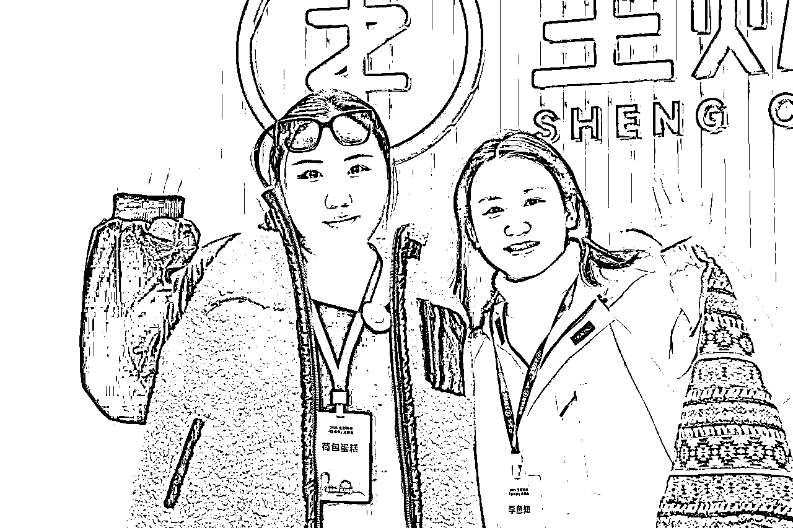

# 【传术师大会荷包蛋组夜话复盘分享】---聊聊“副业焦虑”：如何放平心态，找到乐趣？

> 来源：[https://lv9qj6hfr4z.feishu.cn/docx/JoF8dZ7yHoo7ikxxcZ7cBCV0nMb](https://lv9qj6hfr4z.feishu.cn/docx/JoF8dZ7yHoo7ikxxcZ7cBCV0nMb)

布道传术 成人达己

上周六传术师见面会在生财新办公室召开，有幸参加并且成为组长 第一次成为夜话话题分享组局官带领我的组员一起展开关于【聊聊“副业焦虑”：如何放平心态，找到乐趣？】的讨论

我的组员每个人都从事不同的副业领域 也都在彼此的业务中取得了一定的成绩 但是他们都面临了“焦虑”这个问题，我在他们身上找到了很多共性与共鸣，情绪问题和心态问题是目前阻碍事业进步和个人成长必须解决的第一顺位卡点，我将把周六晚上我听到的案例 故事 和问题做一个简单的复盘分享 与我自己的感受提出针对性解决方案 希望对大家有一定的帮助。

# 一、概况介绍

经过一整天的紧张刺激的与大佬们的学习后，我们开始了夜话讨论环节，此次夜话我担任组局官小组组长（e人）带领五个i人 讨论副业焦虑问题

我的五个组员包括我自己在内六个人真的是完全各不相同 跨度很大

来自不同的行业，不同的业务（公众号 咸鱼 油管 ai）等等赛道，年龄从80后到00后都有 跨度也很大

但是通过 两三个小时的深度沟通 我发现我们的焦虑问题，却有折太多的共鸣与相似之处

我们6个人中至少4-5个都看过心理医生 接受过专业的心理咨询服务 得知这一情况我还是挺震惊的，

我意识到，创业和副业带来的焦虑与内耗并不是孤立的个例，而是普遍存在的问题，这次夜话为我们提供了一个窗口，可以相互倾诉、理解，并尝试找到化解焦虑的突破口。

# 二、案例剖析

## （一）“好学生思维”固化 阻碍了前进的路子

组内的好学生特别多，基本上都是重本一本居多，甚至211985毕业的 （除了我）

受从小到大的教育体系的影响，他们的思维十分的固化，加入生财之前从来没想过人生会有第二种可能 都是想着好好学习，毕业之后找一份好工作，好好给老板打工，我没想过自己也可以去做副业赚钱，没有想过自己可以创业，成为一个老板或者创始人。

我们首先来聊一聊什么是好学生思维？

“好学生思维”是指在传统教育环境下形成的一种惯性思维模式，通常表现为过度依赖规则、追求稳定和安全，缺乏探索未知的勇气和打破常规的意识，深受从小到大的教育体系影响，尤其在精英教育背景下，更容易形成对“单一成功路径”的执念。

#### 核心特点

1.  目标明确但单一 好学生思维通常将“好成绩”“好学校”“好工作”视为人生的唯一成功路径，难以接受其他选择或可能性。例如，他们会认为按部就班地完成学业、进入体制或大型企业是唯一的出路，而忽视了其他职业或副业可能带来的多样性和成就感。

1.  高度依赖权威和规则 好学生倾向于遵循外界设定的规则和目标，习惯于由老师、家长或社会定义“应该做什么”，而缺乏独立思考和自主选择的能力。比如，他们很少会质疑“好好工作”之外的其他可能性，甚至认为打破规则是不负责任的表现。

1.  对风险的强烈恐惧 由于长期生活在相对安全的环境中，好学生思维的人通常对不确定性和失败充满恐惧。他们更愿意选择看似稳定的工作，而不敢尝试风险更大的创业或创新行为。

1.  缺乏探索精神 好学生思维往往注重按照“标准答案”行动，而非主动探索新的可能性。例如，他们在加入副业圈或创业之前，可能从未想过自己能成为一个创始人或经营者，甚至认为这是“不切实际”的选择。

我来说几个 我周六晚上听到的让我不可置信的组员案例，因为我毕业后一直没有怎么上过班 都是自己赚钱 自己给自己打工 具有一定的副业思维 但是组员大部分都是有主业 目前在副业探索阶段 和 即将扩大阶段 甚至很多都是大厂出来的一直按部就班好好工作的好员工 所以身为组长的我完全不能感同身受 但是组员彼此很有共鸣hhhh

#### 案例一：组员A的“画饼困境”

*   背景： A帮公司打造了一套产品，GMV成功突破百万。为此，他辛苦付出了大半年的时间和精力，但却未能获得任何产品利润分红，甚至没有提出任何分配方案。老板不断“画饼”，而A始终选择默默接受，觉得这是自己“应该做的”。

*   问题核心： 好学生思维的“责任感”束缚：A将“忠于公司”视为理所当然，没有意识到自己对这套产品的贡献值得更高的回报。 缺乏谈判和争取意识：认为职场中接受安排、服从规则是正确的，未尝试为自己的利益争取发言权。

#### 案例二：组员B的“职场枯竭”

*   背景： B在公司兢兢业业工作了20年，从普通员工做到管理层，却始终拿着“死工资”。因不满公司内部的权力斗争，最终选择离职，开始探索副业领域。

*   问题核心： 好学生思维的“稳定执念”：认为“死工资”是安全的保障，没有意识到长期职业发展应寻求更多的可能性。 缺乏对事业第二曲线的前瞻性规划：20年间始终埋头工作，直到离职后才意识到自己还有其他选择。

在分享过程中，组员A和组员B频频点头，表示对彼此的感受深有体会。

他们的经历虽然不同，却都揭示了“好学生思维”在现实中的局限性

传统的思维模式让他们在很长一段时间里忽视了人生的更多可能性，直到后知后觉才开始探索事业的第二曲线。

如何打破“传统的好学生思维”？

重塑认知与解构惯性思维

以案例中的组员A为例，他在为公司打造了一款年GMV破百万的产品后，却因为过度依赖“公司至上”的规则和对权威的盲目信任，没有主动争取合理的分红。

反映了“好学生思维”的典型问题：认为付出是理所当然，回报却需要等待“自然分配”。

思维源于传统教育环境的影响，习惯性遵循外部规则，缺乏主动为自己争取利益的意识。

案例中的组员B，用20年的职场拼搏从基层做到管理层，却因始终拿“死工资”错失事业发展的更多可能性。传统“好学生思维”让他对“稳定”的追求超过了对自身潜力的探索。

只有从单一的成功定义中走出来，认识到创业、副业等新路径同样可以实现价值，才能真正开启职业发展的第二曲线。

增强风险承受能力和试错精神

在案例中，A和B的“后知后觉”显现了他们对未知领域的恐惧与回避，导致他们错过了许多转变的机会。

实际上，不确定性是成长的催化剂，敢于尝试并承受失败，是从“好学生”转变为“探索者”的重要一环。

总结：

要从“好学生思维”中解放，需在行动中破认知、建系统，既要重新定义成功，也要学会从规则中跳脱，增强自我意识和行动力。直面现状、敢于打破固有路径，才能在不断试错与探索中找到真正适合自己的事业发展方向。

正如组员A和B的觉醒，打破思维的桎梏，人生的更多可能性便随之而来。

## （二）多数人存在的“不配得”感作祟

#### 什么是不配得感？

“不配得感”是一种心理状态，表现为个人觉得自己不值得拥有某些美好的事物或成就。它常常在职场、社交和个人发展中显现。例如，当一个人收到贵重礼物时可能感到羞愧或不安，或者面对别人的赞美时，总是下意识否认和回避。这种心理状态会让人对外界的认可感到压力，甚至选择逃避更高层次的责任与机会。

不配得感，很多人可能都有我有思考过，为什么大家会有如此严重的不配得感？

我先放一个组员案例 惊掉我的下巴

#### 案例三：组员C的“不配得”困局

组员C是一名拥有15年经验的资深程序员，但他的职业轨迹令人唏嘘。在第一家公司，他的技术能力和贡献显著，但因为主动招聘了新领导，最终被对方挤出了岗位。

更令人震惊的是，在第二家公司，他明明拥有出色的业务和学习能力，却因“不配得感”屡次错过升职加薪机会。

公司老板三次主动提出晋升，他却一再拒绝，认为自己“不具备管理能力”，最终丧失了拓展事业的重要契机。

面对我提问“如果有第四次机会是否还会放弃”时，他的回答是“绝对不会”，并坦言对之前的选择感到后悔。

#### 不配得感”的成因

1.  缺乏底层自信 许多人将自己的成功归因于“运气”或“外界帮助”，而非自身能力。他严重缺乏底层自信，管具备优秀的技术实力，却总认为管理他人是自己的短板，从而否定了自身综合能力的价值

1.  过于追求完美 拥有“不配得感”的人往往追求极致完美，觉得只有“完全准备好”才能承担更大的责任。组员C在面对升职时，因觉得自己尚未具备“完美”管理能力，错失了三次机会。

#### 如何克服不配得感？

1.  重新定义价值 意识到个人的成就和机会是通过努力获得的，而非侥幸或外力推动。像组员C一样，他的业务能力足以支撑升职，这种能力本身就值得被认可。

1.  从小处建立自信 可以从接纳小范围的认可或挑战开始，比如接受团队的赞美或完成某项小型管理任务，通过逐步积累成功经验来建立自信。

1.  正视不完美的现实 接受不完美的自己，意识到很多时候并不需要“万事俱备”，而是通过承担更大的责任来进一步成长。机会是学习的催化剂，而非成功的终点。

1.  寻求外部反馈与支持 主动询问他人对自己能力的评价，借助外界的正面反馈打破对自己的低估。

1.  行动优于犹豫 对每一个机会说“是”，即使内心感到害怕，也选择主动尝试，在行动中证明自己。正如C后来的觉醒，认识到“下一次绝不再放弃”是破除心理障碍的第一步。

## （三）不停的变更赛道什么都没有做好 焦虑加重

在交流的过程中，很多人也有同样的问题，就是他们目前还没有选想好选择要深耕的赛道，不断地变化副业什么都没做好焦虑加重ing ，也不知道如何去平衡主业与副业之间的时间分配问题

在我看来，这就是同类型的一个问题

你什么都做 样样通样样松 什么都做不好

你不知道如何分配时间，你就看哪一个能先优先带给你正反馈，就多花一些时间在 能给你正反馈的赛道上，再花少部分的时间去投身真正自己热爱的行业，学会合理的划分

我说一个优秀的组员案例：

案例四：组员D 也是从小到大应试教育里培养出来的孩子 做事情都很专注 深耕公众号流量主赛道 每天坚持日更 前三个月0收益 第四个月 爆了一篇 赚了至少5万

很多项目都是二八定律 那我自己当反面教材举例 我自己也做了半个月赚了一块钱我就放弃了 大部分人很难坚持日更三个月 不断地换项目 结果竹篮打水一场空

#### 问题核心

1.  赛道选择的迷茫 没有明确的兴趣点或长远目标，导致在各个领域浅尝辄止，缺乏深度积累。

1.  正反馈的缺乏 副业中缺乏短期可见的回报，容易让人陷入“低价值感”的循环，从而频繁切换方向。

1.  时间分配的混乱 主业和副业之间的界限模糊，无法做到合理安排时间，导致焦虑感进一步放大。

#### 解决方案：专注与分配并重

1.  优先选择能带来正反馈的赛道 选择一个短期内可能产生正反馈的领域作为主攻方向。例如，如果某个赛道的流量或收益在初期略有起色，就可以加大投入。这种正反馈不仅提升信心，还能形成“动力循环”。

1.  同时兼顾真正热爱的领域 在时间分配上，将主要精力放在带来收益的赛道，同时为真正热爱的方向预留少部分时间。通过这种方式既能确保短期收益，又能逐步接近长期目标。

1.  运用“二八定律”划分时间与精力 大部分项目遵循二八定律：20%的努力带来80%的成果。因此，将主要精力集中在高回报领域，而不是在多个方向上平均分配精力。

1.  设定时间节点评估成果 给自己设定一个合理的试验期（如三个月），在试验期内坚持深耕某个领域，同时定期评估成果。若发现方向有潜力，就加大投入；若确定不适合，则及时调整策略。

1.  学会接受“前期低回报” 大多数领域在初期都难以看到显著收益，但正如组员D的案例所示，成功往往需要熬过前期的“零回报阶段”。坚持是稀缺的能力，能让你从众人中脱颖而出。

# （四）槽糕的人际关系和两性关系中加剧了内耗

我们身边有太多摆烂的人，影响我们赚钱的速度，也有太多内卷的人加剧我们的自我内耗

举例试想一下，如果我有一个非常不上进的男朋友，我每天勤勤恳恳的创业工作赚钱，他每天在家打王者荣耀恰巧我又是个恋爱脑就会陷入一种无解的内在负面能量循环中

再举一个我亲身的案例，我身边有许多非常优秀的同行，跟我从事同样的业务，他们每个人都各有千秋十分的厉害，身边有很多人拿我跟他们对比，一开始我十分的焦虑，现在我会屏蔽掉这些信息。

#### 解决方案

1.  优化人际和两性关系

*   远离消耗型关系：及时识别对自己情绪和事业发展带来负面影响的人，无论是伴侣还是朋友。如果关系无法改善，应果断选择远离。

*   寻找互相成就的伴侣：建立一种双向支持的关系，双方在情感和事业上都能给予积极的影响。

1.  管理对比心理

*   屏蔽无效信息：主动减少对外界过度比较的关注，专注于自己的工作和目标。

*   用积极方式学习：将同行的优秀表现视为学习机会，而非对自身的否定。把注意力放在如何提升自己的独特优势上，而不是一味模仿。

1.  调节内卷带来的焦虑

*   明确个人节奏：不被外界的“快”所影响，找到适合自己的步调，用长期目标引导行动。

*   设定清晰界限：为工作和生活设立边界，避免被同行的极端努力拉入无休止的竞争中。

1.  加强自我内在建设

*   关注自我成长：通过学习、反思和实践，不断提升内心的强大感，减少对外界评价的依赖。

*   保持健康的生活方式：通过运动、冥想等方式缓解内耗，提高专注力和幸福感。

# 四、写在最后

这次夜话让我深刻认识到，副业焦虑并非孤立现象，而是许多人在多重身份转换中必须面对的成长挑战。从“好学生思维”带来的固化认知，到“不配得感”对自我价值的低估，从频繁换赛道的迷茫到槽糕关系的内耗，焦虑无时不在侵蚀我们的情绪与动力。

但正如组员们的真实经历所示，每一次突破与觉醒，都是迈向更好自我的契机。

副业不止是一种经济手段，更是探索人生第二曲线的重要途径。

在面对焦虑时，我们需要跳出思维惯性，重建自信；需要专注深耕，用正反馈增强动力；需要优化关系，远离消耗源；更需要调整心态，从容应对竞争和比较。

焦虑本身并不可怕，它提醒我们成长的空间和努力的方向。

希望我的复盘分享能为每一位关注副业、直面焦虑的人提供些许启发。我们无法消除所有不安，但可以在行动中找到平衡，在探索中找到乐趣。愿你我都能在副业的道路上，不惧风雨，收获属于自己的精彩！

