# 不会编程的我2小时用GPT 写了一个PDF压缩工具

> 来源：[https://evrkenoajfn.feishu.cn/docx/K34FdwGBooO3WExF6UscqfR6n2e](https://evrkenoajfn.feishu.cn/docx/K34FdwGBooO3WExF6UscqfR6n2e)

大家好，我是保山。

某天要投标，要求文件必须30M以下，就在论坛上翻找，耗时30分钟找到了两个解决方案：一个https://tools.pdf24.org/zh/ ，另一个是某捷6.8版本的PDF处理工具。第二天想着是不是可以借助GPT自己写一个，于是便得到了以下程序，现在回顾下整个过程。

对话过程：基本一问一答，发现问题解决问题；

技术角度过程：相关内容我还发过一个常逛的技术论坛，但会更技术一点、更细一点；

程序24年5月做的，那时候cursor还没火，主要逻辑还是从需求出发，GPT写代码，我将报错再发给GPT一步步调整，如果用cursor会更方便，如省掉我复制粘贴的过程。

# 对话过程：

* * *

## 首先：告知GPT的需求

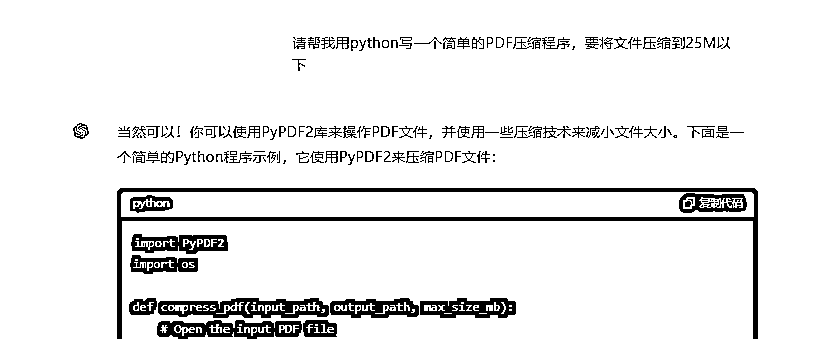

## 其次：将vscode的报错发给GPT

我复制代码到vscode保存运行后报错

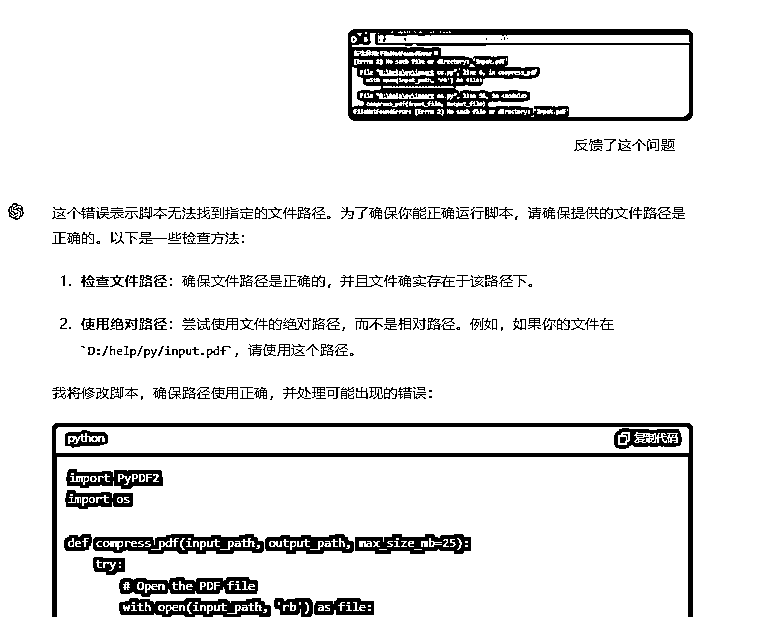

我继续反馈报错（其实还是改变刚才的路径问题，我始终没有提供文件路径，因为觉得只要把文件和代码放在一个文件夹就行，基本还是刚才的问题）

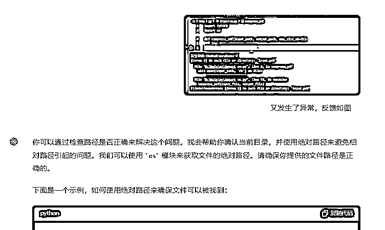

## 然后：虽然不懂，但再细化需求

我开始处理上述路径问题，通过提供给他想要处理的文件的方式

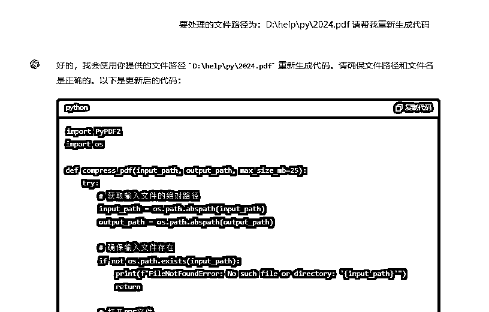

又有报错，继续反馈：

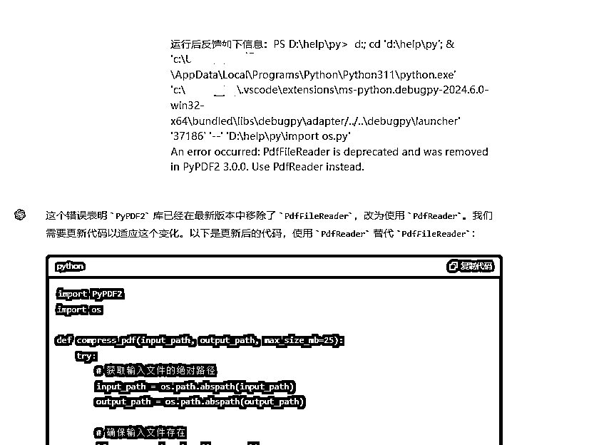

这时候已经生成压缩文件了，但我都不知道，于是仍然把反馈信息发给GPT：

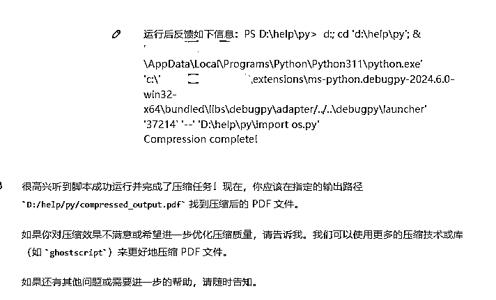

## 新问题：压缩了但大小无变化

我检查发现问题：文件大小并无明显变化：

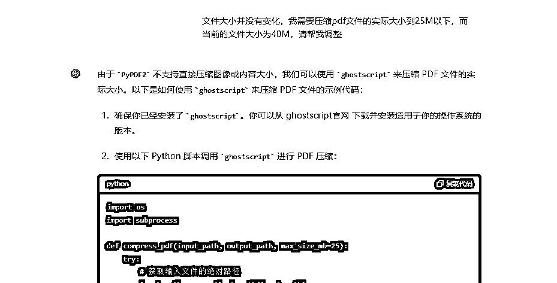

我继续保存，又出现了路径的问题：

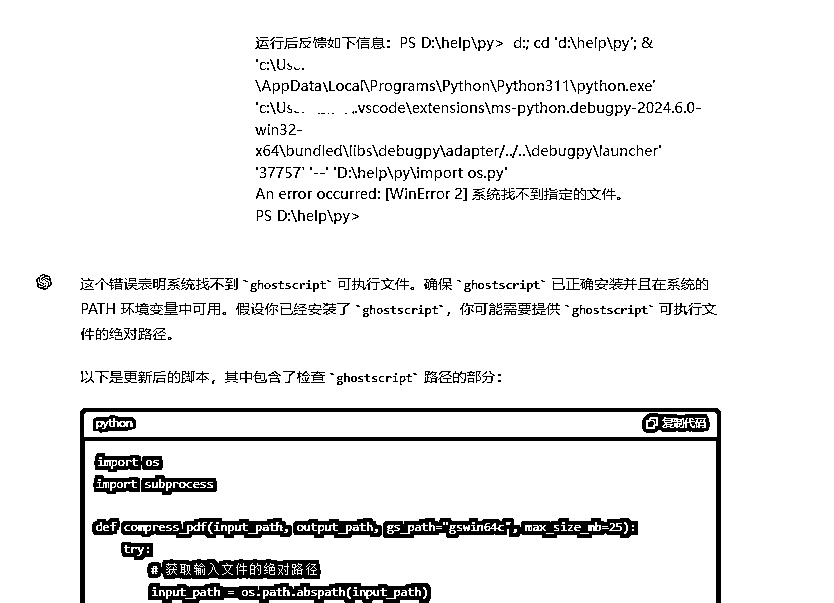

这里折腾了一小会儿，最后我又按之前的思路走了下：


## 代码已经可以跑通，打包（其他设备可用）

这里测试后，代码已经可以用了，于是想着如何打包：

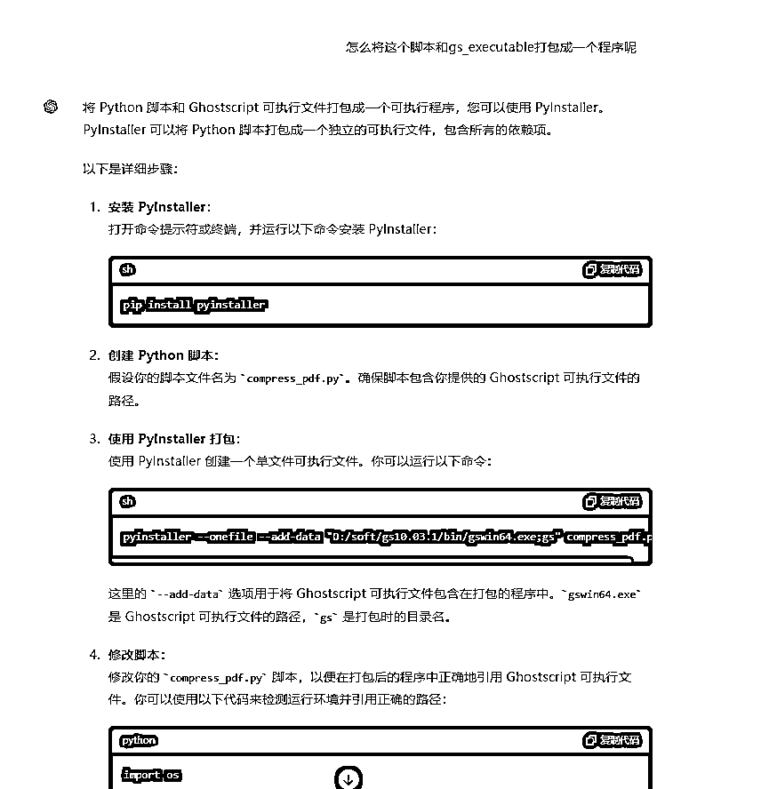

打包后，并无界面，于是


在这里，又遇到了路径问题（小白暴露无疑..）

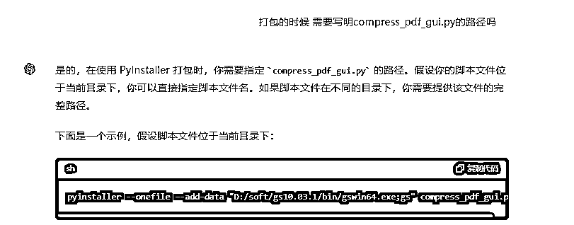

复制到别的软件后，发现无法使用（其实是因为只打包了程序，没打包附件）


最后调优的过程

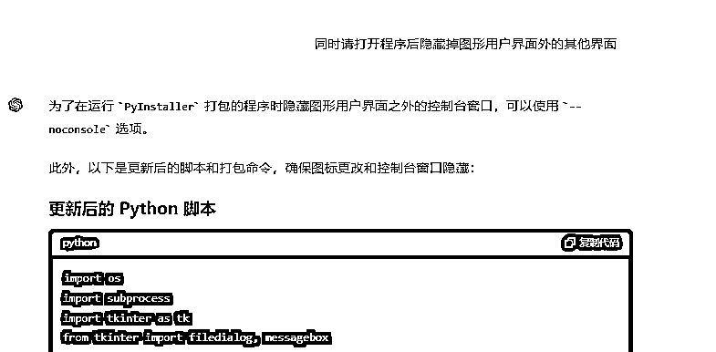

上方内容只是其中的部分关键步骤，一些我冗余的提问并未涉及其中。

* * *

# 技术角度过程

相关内容我还发过一个常逛的技术论坛，以下为正文。

* * *

## 起因

起因是某天要投标，要求文件必须30M以下，就在论坛上翻找，耗时30分钟找到了两个解决方案：一个https://tools.pdf24.org/zh/，另一个是某捷6.8版本的PDF处理工具。

第二天想着是不是可以借助GPT自己写一个，于是便得到了以下程序，现在回顾下整个过程。

## 初始需求

我的需求很简单：压缩一个PDF文件的大小到30MB以下。最初，我让GPT-4o帮我写一个简单的PDF压缩程序，使用Python实现。然而，在运行他给我的代码过程中，出现了找不到文件的错误：

```
FileNotFoundError: No such file or directory: 'input.pdf'
```

GPT-4o指导我检查文件路径是否正确，并确保文件存在于指定路径。

## 使用Ghostscript进行压缩

路径问题之后，我发现实际虽然产生了新的文件，但并没有压缩；向GPT-4o反馈后，其推荐使用Ghostscript来压缩PDF文件，因为它的压缩效果更好。我按照指导下载并安装了Ghostscript，并更新了Python脚本以调用Ghostscript进行压缩。

## 打包问题解决

这个时候基本基于已经能够解决我的问题了，然后我想换了设备测试，便想打包程序。

打包后在其他设备上运行时遇到了DLL加载错误：

```
Can't load Ghostscript DLL
```

GPT-4o建议我在PyInstaller打包时包含Ghostscript的bin和lib目录（之前只打包了Ghostscript程序）。于是，我更新了打包命令：

```
pyinstaller --onefile --add-data "D:/soft/gs10.03.1/bin/*;gs/bin" --add-data "D:/soft/gs10.03.1/lib/*;gs/lib" compress_pdf_gui.py
```

## 添加图形用户界面

为了让工具更易用，我请GPT-4o帮我用tkinter创建了一个图形用户界面（之前用PyQt5生成好像，但一直不行，不知道为什么，GPT也没能归因，只告诉我重装试试）。界面允许我选择输入和输出文件夹，并选择压缩质量。以下是部分代码：

```
import tkinter as tk
from tkinter import filedialog, messagebox

def browse_input_file():
    filename = filedialog.askopenfilename(filetypes=[("PDF 文件", "*.pdf")])
    if filename:
        input_path.set(filename)

def browse_output_folder():
    foldername = filedialog.askdirectory()
    if foldername:
        output_folder.set(foldername)

def start_compression():
    compress_pdf(input_path.get(), output_folder.get(), quality.get())

root = tk.Tk()
root.title("PDF 压缩工具")
```

## 解决图标和显示问题

为了让界面更美观，我希望添加一个图标，并隐藏图形用户界面之外的控制台窗口。GPT-4o告诉我，可以在代码中设置图标路径，并在打包时指定图标文件：

```
root.iconbitmap('D:/help/py/11.ico')
```

并且更新打包命令以隐藏控制台窗口：

```
pyinstaller --onefile --noconsole --icon="D:/help/py/11.ico" --add-data "D:/soft/gs10.03.1/bin/*;gs/bin" --add-data "D:/soft/gs10.03.1/lib/*;gs/lib" --add-data "D:/help/py/11.ico;." compress_pdf_gui.py
```

然而，在更换设备后，我发现程序无法找到图标文件：

```
_tkinter.TclError: bitmap "C:\Users\保山\dist\compress_pdf_gui\_internal\11.ico" not defined
```

GPT-4o建议在打包时包含图标文件，并在运行时动态获取图标路径：

```
# 设置窗口图标
if getattr(sys, 'frozen', False):  # 如果程序是打包的
    icon_path = os.path.join(sys._MEIPASS, '11.ico')
else:  # 如果程序在源代码模式下运行
    icon_path = 'D:/help/py/11.ico'
root.iconbitmap(icon_path)
```

## 处理Windows安全报毒问题

我发现，Windows安全防护会报毒。GPT-4o提供了一些建议来解决这个问题，包括：

*   使用虚拟环境打包

*   更新PyInstaller到最新版本

*   使用--onedir选项打包

*   将应用程序添加到Windows Defender的排除列表

*   使用代码签名来提高可信度

最终，我使用--onedir选项打包，并将应用程序添加到Windows Defender的排除列表，解决了报毒问题。

## 结束语

整个过程大概2~3个小时，我从什么都没有，到有了下方的可以压缩PDF的附件，这个过程中也就是提出需求，同时把VScode、cmd和windows的一些报错反馈截图或复制发送给GPT，不断PDCA的过程。如果是有经验的开发者其实会更快，但因为我0基础，所以出了很多常识性的问题，比如相对路径、绝对路径等等；

## 技术原理

本工具主要依赖以下技术实现：

*   Python编程语言：用于编写逻辑代码。

*   Ghostscript：一个强大的PDF处理工具，用于PDF的压缩。

*   tkinter：Python的标准GUI库，用于创建用户界面。

*   PyInstaller：用于将Python脚本打包成独立的可执行文件。

## 主要步骤

1.  用户选择文件：用户通过GUI选择需要压缩的PDF文件和输出文件夹。

1.  调用Ghostscript：通过Python脚本调用Ghostscript，使用适当的压缩选项对PDF进行压缩。

1.  输出结果：将压缩后的PDF文件保存到用户指定的文件夹，并显示操作结果。

# 使用说明

1.  下载并运行程序：下载打包好的可执行文件，双击运行程序。

1.  选择输入文件：点击“浏览”按钮，选择需要压缩的PDF文件。

1.  选择输出文件夹：点击“浏览”按钮，选择保存压缩后文件的文件夹。

1.  选择压缩质量：从下拉菜单中选择合适的压缩质量（最小、中等、高、非常高）。

1.  开始压缩：点击“开始压缩”按钮，等待压缩完成，程序会弹出提示框显示压缩结果。

PS-效果&使用注意：

1.  我的话分别从30m压缩到9m，150m压缩到15m，楼下有个60m压缩到3m的，要看文件；

1.  Ghostscript的原理是压缩图像以及移除不必要的图像，所以对于一些文件压缩效果并没有那么好。

1.  文件压缩完后建议对比一下，我用论坛中一个其他程序压缩后，有缺图的情况，所以一些正式的场景请压缩后检查。

1.  当压缩文件过大的时候，有的文件压缩时，会有一个warning提醒，不是卡死，会正常压缩的，但时间会有点长。

# 附件