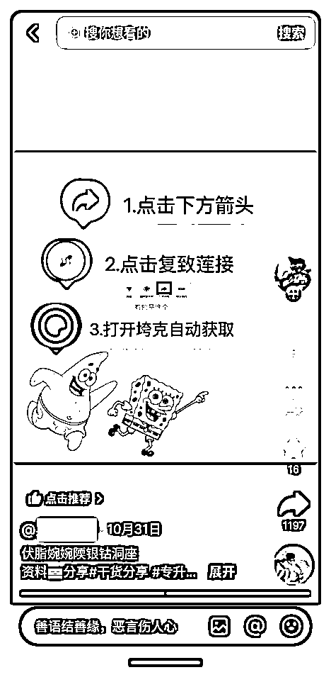
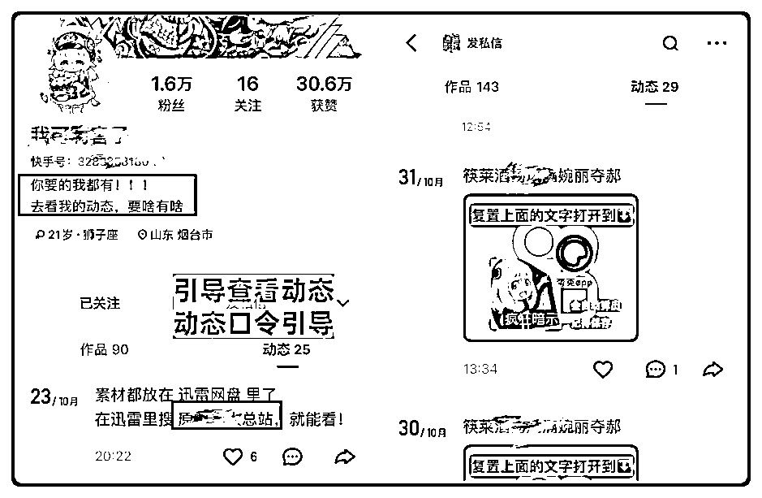
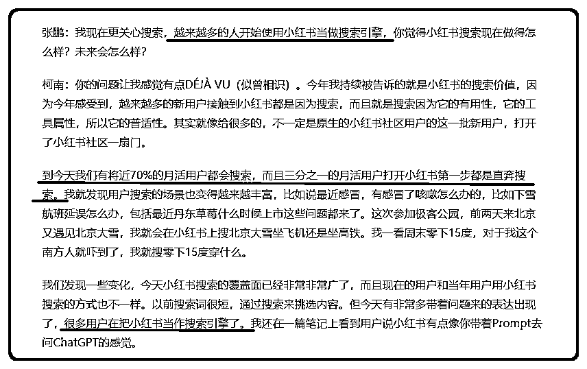
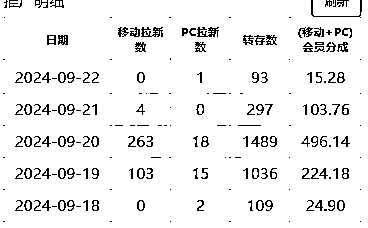
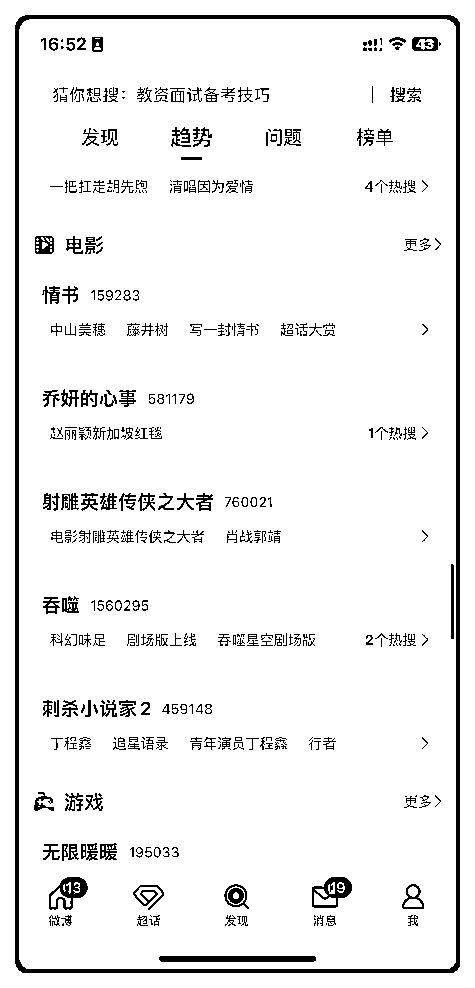
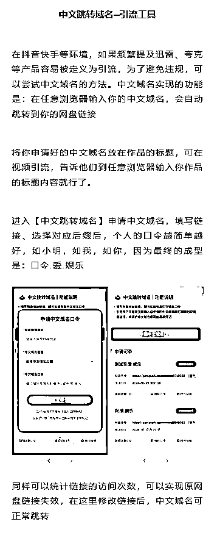

# 网盘拉新项目全域SOP教程手册【真·保姆级·7w 字+视频】

> 来源：[https://fvmonet6krp.feishu.cn/docx/LKg7dyL39oG1QAxVh49cczuynyh](https://fvmonet6krp.feishu.cn/docx/LKg7dyL39oG1QAxVh49cczuynyh)

本文较长，先把目录贴在最开始，方便日后手机版用户后续定位检索~

大家好，我是南寻。自加入生财后感觉到了满满的氛围感，大家都在把自己的所见所得所学无私分享。既然成为生财的一员，自然也要延续这种分享的精神，而且我也通过每天圈友的一些分享获得了许多干货。所以就想着什么时候把我一直在实操的网盘项目所得分享给大家。

作为我的第一篇分享，我希望能以最大的诚意和最有价值的内容作为开端。后来我边做项目边写教程，经过断断续续几个月的时间，终于完成了这个网盘拉新全域SOP教程手册。为了让初学者也能看得明白，我在整个逻辑与框架上梳理了好久，覆盖了从基础到进阶的全方位操作技法。希望可以对生财的小伙伴有所帮助，也为生财的知识宝库贡献一份绵薄之力。

网盘拉新想必大家并不陌生，算是比较老的一个项目了，但是今年因为热点频出，特别是游戏界很是热闹，比如先后出现幻兽帕鲁、金铲铲、植物大战僵尸杂交版、黑神话悟空等多个游戏爆点，还有一些列的桃色PPT，从而被人们提及到的次数越来越多，不管是各大网赚教程网站论坛还是副业星球，出现的频率也都越来越高。

但就算这样，也很难看到市面上有关于网盘拉新特别详细的教程，或者说教程都比较零碎，不系统，不管是整个项目逻辑还是完整性上都差点意思。起初我也觉得网盘拉新不需要什么教程，就是申请完推广权限直接分享资料干就是了。但是至少我在做这个项目的过程中，有教程和没教程还是两码事的。

本篇实打实的来一次性讲清楚这个项目，看完手册的小白也能轻松入局，好处是收益能相对及时看到，并且这个收益不是月结，根据平台不同，可以是 日结 或 周结，产生数据后收益最快可当天提现，可以有不错的正反馈和动力。

很多小白其实几天没看到收益是坚持不下去的，但这个项目就不会出现这个问题。不过想要获得不错的收入，你需要把这篇非常详细的教程看完，消化，并执行。项目涉猎广泛，可以主做，也可以依附在其他项目下做。

因为教程照顾了很多小白，讲的比较细，所以字数和篇幅压不下来，可能有点冗长。熟悉这个项目的小伙伴可以在相对基础的地方快速一览跳过。就算你不做这个项目，也一定会让你有所收获。那么，我们开始吧~

# 一、项目介绍

## 项目是什么

项目是什么，一句话概括。就是我们分享网盘资源，别人保存了这个资源你就会得到佣金。

这项目有多简单？简单到你只需要分享网盘链接，别人点进去转存你就有钱。如果别人是网盘的新用户，你就得到的钱多（目前新用户5-7元/人）。如果别人是老用户，你就得到的钱少（目前是0.3-0.6元/人），如果他每天转存每天都算一次钱），如果他转存了你的资源还充了网盘会员，你还能得到30-35%的会员佣金分成。

看过加速器项目的应该很容易理解，加速器项目是别人输入了你的口令兑换，你就有佣金，那么这个网盘项目就是别人保存了你的资源你就有佣金，都是属于很简单的项目。简单，说明好入场，能快速见到收益，但是想要获得不错的收入，还需要动点小脑筋。

我再详细用一个小故事给大家说一下整个过程，小白如果还没懂我上面那段话什么意思，那可以通过这个小故事再次结合看一下就懂了，懂的可略过。

有个男人叫小帅，他在刷短视频的时候，刷到了一部电影解说，小帅觉得很有意思，他非常想看原片，就在网上搜，然后他在一个网页上面找到了这个原片的地址，发布者是一个叫小美的人，她发布的是个网盘链接，小帅点进去链接，然后点击了保存资源，这个时候，​

如果小帅是一个没有下载过这个网盘的用户，那他就属于新用户，小帅这个时候通过手机号注册成功了，那么小美那边就得到了拉新的佣金，目前市面上拉新价格一个是7快钱（夸克网盘举例），也就说小美得到了网盘给它的7快钱佣金，小帅得到了他非常想看的电影，很高兴；小美那边得到了佣金，她也很高兴给小帅分享，这就是个双赢的事情。

那么如果小帅是一个下载过这个网盘的老用户，他点击了保存资源，那么小美也能得到0.3元的佣金，她同样也有钱赚。

小美的这部电影资源来到了小帅的网盘，这个时候，小帅如果将这部电影点击分享，网盘会出来一个属于小帅的分享链接，然后小帅把这个链接分享给了他的朋友，那么朋友保存下来小帅就得到了佣金，如果小帅的朋友是新用户，那小帅就得到了7元，如果小帅的朋友是老用户，那小帅就得到0.3元，​

如果小帅分享到了他的群里面，假设这个群里面，有100个是网盘新用户，有1000个人转存了他的资源，200个人充值了10元的会员，那么我们算下他总共赚了多少钱：​

新用户佣金：100*7=700元；​

转存的佣金：1000*0.3=300元；​

会员分成的佣金：10*0.3*200=600元

700+300+600=1600元。

保存资源的人越多，小帅得到的佣金越多，上不封顶。而且最给力的是，如果小帅第二天又在群里发了新的网盘资源链接，他群里如果有1000人再来保存小帅的资源，那小帅就会再得到300快钱佣金，第三天第四天都是如此，以此类推。

通过上面的故事，相信你如果是小白的话应该也可以看懂了。

## 项目原理

好，知道了项目是什么，那我们来说下这个项目的原理，其实就是各大网盘厂商为了抢占市场而推出的推广政策。

比如我们熟知的，百度网盘、夸克网盘、迅雷网盘、UC网盘都在进行推广。他们为了抢占市场份额，获取更多的用户，而推出的这个推广奖励政策。

举个例子，现在的网盘市场基本上是被百度网盘所垄断，那么别的网盘，比如夸克网盘，如果想要抢占百度网盘的市场份额，那么夸克网盘就需要给别人钱，让人帮他做推广，通过推广这个激励计划来得到市场份额。

其实这种手段已经在资本市场屡见不鲜了，当初的滴滴和美团也是在不断的烧钱补贴和推广 来抢占用户市场，其实那个时候就已经富了一批人，只是我们可能生不逢时也可能不知道而已。那么现在这个机会又出现在眼前，我们有足够的理由去把握住这个机会。

## 项目周期

下面说下这个项目的周期，就是他能做多久？网盘拉新已经是存在好久的老牌项目了，只是在新推广项目的加入下不断“焕发新春”，如果说网盘拉新是怎么重新火起来的，那么夸克网盘就占一半的功劳。

最卷的也莫属夸克，补贴力度也是同网盘中最大的，在暑假的时候一度来到每单10元的拉新，每单0.4元的转存，这是在同类推广的网盘中独一档的。

在夸克持续的补贴推广的攻势下，甚至有越战越猛的势头，最终连百度网盘这个网盘界的巨头都坐不住了，在今年（2024）6月份的时候加入了这场补贴推广大战，但是补贴力度比较小，近期也是慢慢提上价格来了。

我们退一步讲，就算以后夸克网盘不能做了，我们还可以去做迅雷网盘、百度网盘、UC网盘，之前还出过头条网盘，后来推了阵平台下架了。平台项目也是在不断推陈出新的。

所以，这个项目是没有周期的，源源不断的，总有项目要推，你不推别人就推，你不要市场自然有要的。强如百度网盘这么大的体量，也不能任由其他网盘如火如荼的推广坐视不管。

## 项目优势

其实我更喜欢把这个项目称为「三无」项目。为什么这么说：​

*   无门槛，就是去分享网盘资源就好了，特别简单。

*   无上限，这个项目的收益没有天花板，上不封顶。

*   无周期，这个上面也解释过了，总有项目要推的。

市面上很多拉新项目都是cps模式，比如我们所熟知的短剧、小说推文，剪辑视频费不费时、过不过审核、废不废号暂且不说，用户看了得付费你才能获得分成，不付费就等于 0 。但网盘项目，用户不用付费，我们给他提供他想要的资源，他只需要转存，我们就有钱。

这个过程中，我们是先用我们的时间乃至金钱整理了资源，帮目标用户省下的是他的时间金钱，我们获取一定的报酬也是非常合理的。互惠互利的项目对很多人来说是没道德束缚的，我们做的会很舒服。

这个跟加速器项目也是非常像的，不需要用户付费，我们给他提供免费的口令，他输入后获得了免费时长，我们呢拿到了钱。同样是完全双赢的事情。

有的项目总是很喜欢在宣传什么月入过万，月入几万。但你会发现，这些项目很大一部分都是那些卖课搞培训常用的伎俩：基本要么是些做了很久的账号，要么就是几百个账号爆出来那么一个账号来举例，丝毫不提这个人或者这个账号所具备的前置条件，也丝毫不提这个项目的细节，更不提做账号这个人超出常人的执行力和思维能力（当然也有一部分只是运气好）。

黑神话悟空刚推出的时候，全网都在宣传有个抖音博主直播，一周几十万粉，赚了上百万，却丝毫不提这个人对游戏的热爱程度和对游戏的恐怖理解，加之把控热点的能力和几十小时不下播超出常人的毅力。

你兴致冲冲去做了，结果浪费了账号又浪费了时间，一事无成。相信有相当一部分小白都有过这种经历，让本就不多的执行力就被这么一点点消磨殆尽，慢慢丧失做项目的热情，真的很可惜。

这些例子能作为我们普通人去参考的标准吗？显然是不能的。所以说，一个项目到底赚不赚钱，我们需要看的就是绝大部分人去做就都能或多或少赚到钱的项目。其实小白也是更需要的是能很快见到正反馈的项目。

在下面的教程中，我将通过一些真实案例带大家看下普通账号的一些数据，相信可以让你对这个项目有更深的理解。

# 二、项目准备

整个项目介绍应该给大家说的很清楚了。可能比较啰嗦，但也是兼顾一些小白能听懂一些。下面给大家讲一下做这个项目前需要做的一些准备工作：开通网盘推广权限。

因为我们直接去分享的话是没有佣金的，没有能证明你做了推广的数据，所以我们需要绑定平台获取推广权限，这样后台就可以查询到我们的推广数据，然后通过这些数据来结算收益。

## 注册推广平台

第一步，我们首先要先申请网盘的推广权限。

不同于其他只推荐单个平台的，我每个平台都会去尝试，这里就写下南寻目前在用的两个平台，这两个平台我没有什么偏见一说，各有各的好处，只站在你我切实利益的角度上来分析，给大家作为参考。如果你有更好的，欢迎来交流～我们先来说第一个，​

### 第一个平台

任推邦平台，应该是目前用的最多的了，关注任推邦公众号，点击下图中的【登录】即可开启注册。

任推邦集地推网推于一体。除了我们说的网盘拉新项目，平台也会不定时上架一些其他新项目可以推广，这是中小平台比不了的优势。

以下是详细的注册视频教程，如果你不注意直接注册的话项目肯定是显示不全的，这属于一个小卡点，视频给了项目 100%全部显示的方案，属于小白必看的。

但是，我上面也说过了，这类平台全部都是邀请制，没有邀请码是注册不了的。我们可以在网上一搜随处可见的邀请码，很多圈友们也有在分享自己的邀请码。这个链接自带邀请码，可以直接注册。你也可以填其他的，并且填谁的邀请码都是一样的，外面邀请码都说自己是首码，其实没有任何差别。

以下是任推邦平台的佣金规则，平台额外补贴佣金，所有用户都是首码，顶点位价格。

去年早些时候任推邦还是抽佣制，只有花两千块钱开通了平台金牌码邀请的才是顶点位。

抽佣制就是你的上级会有个佣金比例设置，你能分多少，全靠你上面人良不良心。这样废掉抽佣制后，上级提成是平台补贴的，这样不赚下级的钱。

所以，在你们自身利益相同的情况下，你们填谁的都行，只是说填谁的邀请码取决于你想让谁得到平台给的这个补贴。

### 第二个平台

聚好推，这算是一个后起之秀的平台。关注聚好推助手公众号，点击下图中的【进入平台】即可注册。

聚好推平台以网盘项目为主，这个平台也是我后面做网盘项目主要在用的，原因很简单：

*   日结，出数据就结算，落袋为安。对小白很友好，可以更快的实实在在看到钱。如下图所示，结算周期为日结（下图为迅雷网盘举例）：​

*   提现手续费平台补贴 3%，比其他平台少一半（如下图所示）。其他同类平台一般是周结，一周后才可以提现；并且手续费一般是 6%，多了一半，提现门槛一般 10 元。

这个平台也是必须邀请制的。邀请码AX1001，也可以去搜其他的，问AI，都有邀请码。它与任推邦政策一致，所有用户都是首码，顶点位价格，平台给补贴。

这个平台我就不录注册教程了，非常简单，直接手机号接个验证码，进入即可显示全部项目。除此之外，这个平台还有一系列好用的工具，这里先简单截个图，详细讲解我会放到后面的「技法篇」。

## 申请推广权限

我们注册好以后就可以进行申请推广权限了，可以看到好多网盘在进行推广，夸克、迅雷、UC、百度，你们需要根据你的资源类型来决定你做哪个网盘的推广。

因为夸克网盘主要针对的是移动端的佣金会高点，但是电脑端新用户就很少，而且夸克电脑端的转存是没有收益的，所以，如果你推广的大多是些电脑上的软件，那么我就推荐你去推迅雷/UC等网盘。

不要有任何固定思维，所有网盘我们都可以去推广，而不是只可以选择一个推。关于这些详细的内容和注意事项后面也会给大家讲到，我们先说怎么申请推广权限。

小白建议先把通篇教程看完，选择好平台，再去绑定。因为一个网盘账号只能绑定一个平台，多个网盘账号可无视。

### 第一个平台

随着任推邦体量的增大，现在任推邦对推广权限的申请设置了门槛。

下面我就以夸克网盘进行举例，给大家实操演示下申请推广权限的详细步骤以及会说到一些卡点，不看教程自己去申请的话很可能会申请不通过。视频给了100%通过的解决方案，且非常简单。

再次文字强调下注意事项：

申请通过后，账号内分享的所有链接都有效，都会产生拉新数据，而不单单是申请时填入的链接才有效。

这条规则通用于申请其他网盘和任何平台（包括下方的平台也是）。

### 第二个平台

这个平台申请推广权限暂时没有任何门槛，直接申请即可。并且申请信息没有其他平台那么繁琐，简单化，对小白非常友好。

平台内在每个网盘专区都有详细的申请步骤，每一步都标注好了，在右上角还配备了操作教程视频，视频内容是申请流程和各网盘会员的申领流程，讲的很细致，我就不给大家再录视频演示了。小白跟着一步步申请就行，没任何门槛和难度。

我这边亲测的是该平台申请权限步骤要更清晰简单，不繁琐，且审核效率也更高。

如果夸克/迅雷/UC 等网盘账号之前绑定过任推邦或者其他推广平台，那么就需要重新注册一个新的夸克/迅雷/UC 等网盘账号。也可以把之前的绑定过其他平台的网盘账号解绑手机号再重新注册，再去这个平台签约绑定即可。（最新补充：如遇到聚好推平台夸克网盘无法签约绑定的情况，可以在平台添加联系客服进行手动绑定）

上方平台怎么选择？大平台有大平台的优势，中小平台有中小平台的好。那么我的建议是小白做网盘的话可以先从第二个平台入手，毕竟日结、1R 起提、手续费便宜一半、有很多工具；​

第一个平台的优势在于大、多。除了网盘之外的其他项目多，选择多，我们大人当然不做选择，两个平台全部注册。规则是在不断变化的，哪边政策好去哪边。

## 推广形式

不同平台除了界面和对应福利政策不同，其他流程完全一致。接下来我们说的内容就是通用教程了，不分平台。

那么，不管哪个平台，我们除了以链接的形式进行推广，还有一个口令码的形式。链接是用户直接点击进去即可看到资源；口令码是用户输入或者复制你的口令到网盘后，资源会自动弹出。口令码一般为中文，这是网盘方为了方便我们在一些不能放链接的平台（比如抖音快手）更好的推广而推出的一种形式。

不同网盘的口令码形式也不同，下面针对不同网盘分别简单说一下，让大家有个了解，后面我会详细说到怎么用，你现在只需要知道有 口令码 这么个事情就可以。

*   夸克网盘

不管哪个平台，在申请通过后的1-2个工作日，分享链接中会自动加入口令码。到时候长按分享资源，它会同时出现你的专属口令码（如下面视频所示）。

口令不可以自定义。是夸克网盘官方随机分配的字符。

*   迅雷网盘

迅雷网盘在申请的时候就选择口令推广的方式即可，这样既可以推口令，又可以推链接。

口令可以完全自定义。好处是用户下载迅雷后直接搜口令词便可以自动跳出资源。

*   UC网盘

申请通过后，在分享的时候选择口令分享即可。注意要在最新版手机APP中分享才可以。

口令可以半自定义。

*   百度网盘

在第二个平台申请通过后可以使用该平台的工具，可以将百度网盘的链接转换成中文口令的形式。

口令不可以自定义，是百度网盘官方随时分配的8-10字长字符。

综上，这些中文口令码一般是当昵称用，以便于用户直接复制视频链接打开网盘即可跳转。先简单了解，后面的教程会详细说到。（夸克双口令码，一个中文口令，一个组合口令，一般中文口令当昵称用，组合口令加到抖音等平台的作品标题用）​​

## 福利政策

我录制过程有一点忘记说了，不管在哪个平台注册，申请完推广权限以后都会有对应的福利政策。均为自动到账。

比如夸克，申请通过后平台会赠送：

*   夸克15天会员：一般1-2个工作日官方直充自动到账

*   夸克网盘扩容：审核通过后会默认扩容20T空间，自动到账；达到一定要求时，可以再次去申请扩容，一般当天或次日就到账，效率蛮高的。最高可申请80T容量。

*   夸克年会员：绑定满15天，30天累计转存次数≥600次或拉新量≥35个，可申请夸克年会员。

迅雷申请通过后平台会赠送：

*   迅雷30天白金会员：一般1-2个工作日官方直充自动到账，比夸克送的多，而且到期后只要近三天内有一个拉新数据就可以继续申请。

*   迅雷网盘扩容：比夸克要求低，近三天内有一个拉新数据就可以申请扩容。

*   迅雷超级会员：近一周拉新数量超过20个便可申请。

百度申请通过后平台会赠送：​​

*   百度网盘SVIP：次日会自动赠送SVIP权益14天。如拉新收益大于50元，即可自动续赠14天SVIP会员。30天内转存收益达600元：赠送SVIP季卡；30天内转存收益达1500元：赠送SVIP年卡。

*   百度网盘扩容：7天内转存收益达6元，赠10TB；30天内转存收益达300元，赠20TB。

UC申请通过后平台会赠送：​

*   UC网盘会员：首次申请通过2个工作日内自动赠送15天的会员，享有6T内存。30天内持续分享持续产生转存收益会自动续上1个月会员。

*   UC网盘扩容：首次入驻会送6T空间，符合以下要求会再自动续20T空间，最大80T（每次续空间有效期为90天）1、当前账号空间使用率>80%2、达人分享链接近七天持续【活跃】

所以不用担心后面资源太多容量不够的问题，或者是没会员传输慢的问题，干就完了，平台都想到了。别的网盘也是同理。能薅到百度网盘官方羊毛的机会不说全网，就从往年来看都屈指可数，其他网盘也都有对应的后续福利政策。推广不仅赚钱，还可以实现自用网盘会员自由。

说到会员了，这里想起来了就多说一句，闲鱼的一些低于市场价很多的各大平台会员最好不要去搞，价格太离谱的基本都是退款车，骗你没商量，小白注意下。

# 三、项目实操

那么我们注册和申请推广权限这两步搞定以后，后续我们就只需要去分享网盘链接我们就有钱赚。

下面来到最重要的项目实操部分，这是最为重要的环节，其实网盘拉新现有的一些思路都很成熟了，大家只需要去照做就一定能看到结果，但是对应的，竞争也是比较激烈的，现在什么项目都是这样。但是做的好的，赚到了钱的，一定是动了脑筋的，有自己的理解在里面的，而不是一味的去模仿照搬。

就比如加速器项目，我尽管强调要自己做一个属于自己的模板，但很多人都在复刻我教程中示例的那个图，结果发的人太多，导致被判同质化之类的，就我们做项目要灵活变通，做任何项目都是这样。

## 资源方向/类型

首先，我们来说下目前资源的类型和方向，为什么要先说这个，因为这个项目市场足够大，它涉及的范围非常广，几乎涵盖了各行各业，每个人兴趣点不同，可以足够去分散人群，让每个领域的人都能赚到钱。这个盘子是足够大的，所以任何人都值得一做。

举个例子，那些做资源型博主们，比如我们一下就可以想到的一些资源分类，那些做游戏号、影视号、音乐号、小说爽文号、壁纸头像号、软件号的博主们，他们为什么会选择特定的领域来做？首先，因为他们或多或少感兴趣，比如我做影视号，那我肯定是喜欢看电影才去做；我做壁纸号，肯定是平时就喜欢收集一些壁纸，喜欢一些比较美的图片，对吧，以此类推。

其次，因为平台鼓励这些某个领域的垂直内容，给予这些内容流量扶持。当你持续发了一段时间某个领域的垂直内容，那么平台就会给你的账号打上标签，从而推流更精准，你的粉丝也会越来越多，流量越来越高。你帮平台留住用户，他给你账号和内容推流，属于双向奔赴的事情。

这就和我们在做的这个网盘拉新项目一样，我们在网盘内收集了资源，分享给用户他们需要的资源，他们得到了想要的内容，我们也获得了佣金，也是个双赢的事情。

说回来，那么这些资源类型的博主们，如果他们入局这个项目赚不赚钱，那肯定赚钱对吧。而且是从一定程度上讲是互不干涉的，因为根据平台的算法推荐，他们所能影响到的人是有限的，而且他们的粉丝群体不一样，所能拉新的范围也是有限的，说这个就是进一步给大家说明你只要选定你感兴趣的领域去做就可以了，这将是我们后面说到的「基本盘」。（记住这个基本盘，后面我们还会重点讲到）

不知道自己喜欢什么？这里简单给大家说下资源的一些类型。

首先，说几个需要注意的方向要点：

1.  不能太露骨了，官方会对网盘资源进行不定期检查，太露骨会被清退

1.  资源能打包成压缩包、最好是大文件

1.  以下资源大部分都是经过流量和收益的检验，我以🌟来表示，最高五颗星

以下资源类型肯定是不太全面的，更多需要大家根据自身行业和情况去挖掘属于你们的蓝海。

*   🌟🌟🌟🌟🌟影视动漫/音频类

1.  各类国外电影、经典老剧、奈飞网剧、猎奇、感官刺激电影

1.  各种番、动漫、OVA、剧场版等

1.  各国综艺短剧 （这里不是指普通国内短剧综艺，国外等短剧综艺资源会更吸引人）​

1.  音频类（无损、怀旧、车载、有声、相声、口语）​

1.  另类影视（足、手控、ASMR助眠）​

1.  另类音频（声优资源、汽车导航语音包）

*   🌟🌟🌟🌟🌟游戏类

1.  游戏安装包：PC端、手机端、平板端如黑神话悟空、植物大战僵尸杂交版/融合版、金铲铲等

1.  游戏工具：游戏加速器、游戏脚本、汉化包、多语言包、优化工具等

1.  游戏资源：MOD版本、免安装版本、满级存档游戏存档

1.  另类游戏：GAL/SLG类 、真人互动类（例如 完蛋我被美女包围了）​

1.  经典/稀有游戏资源：怀旧经典、某类游戏合集

1.  Steam游戏：上一篇加速器项目里也讲到了一部分关于游戏资源类的网站，并且大家可以配合加速器项目一起做，比如吧自己的口令兑换码放到资源里面，实现一鱼多吃（所以我在加速器项目中说到可以先做游戏类账号，如果当时起了游戏账号的，可以一鱼二吃了）。我这边亲测游戏资源包里放加速器口令，在资源热度足够的前提下，加速器产生的额外收益还是非常可观的。关于申请加速器口令具体可以看我上篇教程。

*   🌟🌟🌟🌟🌟吃瓜类

1.  明星路人八卦

1.  吃瓜（某热点视频/PPT/PDF）​

1.  社会奇闻异事

*   🌟🌟🌟🌟学习类

1.  认知思维提升（天涯/毛选）​

1.  健身养生类

1.  唱歌学习资料

1.  舞蹈/瑜伽学习资料

1.  自媒体学习资料

1.  学习攻略/装修攻略等各种攻略

1.  其他各类学习资料

......

*   🌟🌟🌟🌟行业素材类（这个其实跟学习/软件类有重叠，但例举出来的原因是想让大家根据自身行业去思考，可能你会想到竞争不多的蓝海资源）

1.  IT行业：比如程序员可以分享一些自己写的小工具/分享些源码之类的

1.  设计行业：设计软件和设计资源（比较典型的，ps资源一直很火热，Adobe全家桶/psd设计素材等）​

1.  教育行业：这个就很多资源了，教辅资料/小学/初中资料/四六级/考公考研/一建二建...... 而且也是相对火热的资源，比如前阵子三年级英语教材版本的更新，让三年级英语资料短时间内爆火，搜索指数达到了恐怖的1.87亿（下图所示）。一些有价值的资源，一般建议配合客单价，引流成交的模式，而不单是吃拉新的流量，这个时候网盘拉新收益就是一个附加项，而不是主项。

1.  餐饮行业：全国地方特色招牌菜、小吃配方之类的。

1.  剪辑行业：视频素材/模板、剪辑学习资料、绿幕抠像素材（如猫meme等）​

......

*   🌟🌟🌟🌟软件类

1.  办公软件：Office、WPS、文档处理工具、激活版

1.  设计软件：PS、AI、PR、AE等设计软件

1.  手机软件：例如 李跳跳等跳广告类软件、一些安卓软件的永久版本等。

1.  电脑软件：视频剪辑软件、音视频软件、一些电脑插件、脚本或者整合包等

*   🌟🌟🌟🌟🌟AI类

Ai类是绝对有流量的，且趋势只会越来越火热。

1.  AI工具（Stable Diffusion、Ai换脸、Ai变声）​

1.  AI学习资料

1.  Ai美女帅哥图

1.  AI绘画资源

1.  AI自动化工具

......

*   🌟🌟🌟🌟其他

1.  壁纸

1.  头像

1.  各类美图

1.  小说漫画

1.  电子书

1.  车机升级包

1.  免费字体

1.  各类素材/笔记/小抄/表情包

1.  PPT模板/合同模板/年终总结模板等各种模板

......

其实以上说的都是些相对热点的资源，资源千千万，360行，行行出资源。上面举例是南寻大概想的一些，肯定是不全面的，大家如果想再细分下去，可以直接用Ai搜索，接下来会说到Ai搜索工具，你问它一句你想要做的领域，他能给你细分出非常多。

总之可以选择一个感兴趣的赛道去作为基本盘，但是有些相对敏感的资源虽然流量大，却伴随着高风险，需要自己去评估。我的建议是小白选择基本盘的话就选一个风险小，能长期做下去的领域，虽然热度可能没那么高，但胜在后续的可持续、可增长、可稳定。

以下是从部分平台截取的分区，也可以进行参考。

## 资源获取渠道

说完资源的一些方向和类型，那么有的小伙伴可能会说，我方向有了，资源哪里找呢，这里给到大家一些网盘资源搜索站点，可以一键搜索到想要的资源。并且还有Ai类搜索引擎搜集全网资源。资源很多，但同样的，垃圾资源、挂羊头卖狗肉的也很多，不要贪多，找自己需要的，找相对精品的。

### 网盘搜索工具

#### 夸克网盘资源搜索

1.  https://pan.funletu.com

1.  https://www.quarkfinder.top/

#### 迅雷网盘资源搜索

https://xunjiso.com/

#### 综合网盘资源搜素

https://www.yunso.net/

#### 游戏资源专项搜索

1.  3DMGAME https://bbs.3dmgame.com/forum.php?gid=441

1.  游侠网 https://www.ali213.net/

1.  游民星空 https://down.gamersky.com/pc/

其实这类网盘搜索工具也是通过Ai搜出来的，不止这些，大家掌握了原理可以自己搜，很好用。Ai怎么搜？别急，往下看~

### Ai类搜索工具

以下Ai工具全部免费，且全部是更适合国人体质的大语言模型，全部免费，皆为大厂出品。

#### 秘塔 AI

【https://metaso.cn/】

没有广告，全网搜索，直达结果。

#### Kimi AI

【https://kimi.moonshot.cn/】

月之暗面开发的Ai智能助手，联网搜索，多个结果可供选择 ，目前全免费。

#### 豆包 AI

【https://www.doubao.com/】

字节跳动开发的Ai智能助手，同样联网搜索，功能丰富，目前全免费。（其实字节旗下国际版和国内版的Coze更好用，但是有限制，并且开始收费了，这里就不放了）

#### 博查 AI

【https://bochaai.com/】

其实博查Ai更像是前三个Ai工具的综合体，从功能来讲，他更像是秘塔AI这样专门搞联网搜索的，你搜索它会直接提供给你问题的答案而非链接。

并且它还支持豆包、通义千间、Kimi等顶尖AI大模型，就是一种多模型的Ai搜索引擎，支持多模型切换，能实时获取信息。但实际上每次搜索还是只能用一个模型搜，但可以切换这样子。

#### 文心一言

【https://yiyan.baidu.com/】

百度旗下，更适合国人体质的大语言模型，3.5免费，可联网搜索，4.0要收费，百度的一贯吃相了。文心一言的话更擅长理解和运用中文，是最适合国人体质的一款，毕竟深耕搜索引擎这么多年了，拥有海量的数据。

虽说4.0收费，但如果你是新用户的话，通过上面链接进入随便发一句话便可领取5天VIP，然后不嫌麻烦的话，可以再去下载文小言APP（原文心一言），注意是百度旗下的，别下错了，下完登录文小言APP又能领取30天VIP。

## 资源分享平台

那么方向/赛道有了，资源也知道怎么获取了，接下来我们就可以分析下可以去分享的平台和渠道，毕竟你资源再好，还是得通过这些公共平台来曝光自己和获取流量。下面就来给大家讲下可以发资源的一些主流平台。

首先，我们可以想一下，当你作为一个普通用户，你会如何获取到自己想要的免费资源呢。

*   第一，主动寻找，就是去搜索，网页搜索，谷歌/必应/百度等搜索; 各平台搜索:抖音/小红书/哔站/知乎。

*   第二，被动获得，在抖音/快手/小红书/哔站/知乎等平台刷到内容被动产生资源需求。比如影视，通过解说或者某个片段，想看原片，评论区有引导获取完整资源的方法，就跟着步骤保存资源了。但如果评论区没有资源获取途径，就会主动去寻找。

所以，我们可以总结出来:

*   第一，既然用户会主动寻找，那我们就去这些平台发作品布局搜索流量。

*   第二，主动去发资源作品，系统会根据算法帮我们推荐给用户，使用户可能刷到我们从而产生被动需求。这就是推荐流量。

那么，他们的区别是显而易见的：​

1.  推荐流量是基于用户的兴趣被动推荐的内容，而搜索流量是基于用户主动搜索的内容。

1.  推荐流量依赖于用户画像和行为数据的匹配，而搜索流量依赖于关键词与内容的匹配。

1.  所以，推荐流量可能看的多但转化可能相对较低，而搜索流量可能看的少但转化极高。

接下来就是思考怎么利用搜索和推荐，在各个平台让自己的内容有更多的播放和曝光机会。我们先来说目前较为主流的平台，虽然平台很多，但我把它们分为两类，一类是能直接放链接的平台；一类是不能直接放链接的平台。

*   不能直接发链接的，需要去引导，转化效率相对就会低，比如抖音、快手、视频号等。

*   能直接发链接的，转化肯定就会高，比如小红书、B站、公众号、知乎、贴吧、微博、豆瓣、搜狐、CSDN、虎扑、QQ频道等，以及各种小众论坛网站和资源分享qq/vx群。

### 「不能直接放链接的平台」推荐流量

现在的短视频平台因为是兴趣推荐机制，所以我们更容易给他们创造资源需求，只要我们的资源确实是有吸引力的，他们觉得不错就会去想办法下载。这里我们吃的是推荐流量。

这种现象在影视区尤为常见，用户本身是来刷短视频的，但当他被动刷到一部影视片段觉得很好看，这时候用户想看原片更细致或者没被打过码的内容，那么他肯定会根据你的引导去找获取资源。而如果你没有给他引导，那么他可能就会去搜索，这时候就转为了被动搜索流量。

这与抖音等兴趣电商的逻辑如出一辙，用户本身是来刷视频看点自己喜欢的，本意并不想买东西，但是刷到了带货视频偶尔看到某个商品还不错并产生了兴趣，就买了；刷到吃播看见主播吃的香自己也馋了，就买了。小红书同理，本身就是去放松娱乐的，但有人发的笔记给你种草了某个东西，可能顺手就买了。

所以，基于这样的兴趣推荐机制，抖音、快手、视频号这类平台我们以推荐流量为主。怎么去发？必然是以图文或视频的表现形式发，和加速器项目流程一样，先去根据你选择的领域找对标，看同行是怎么做的。而且找对标要会找，前期先找简单的模仿，好入场找感觉，况且这项目本身对作品质量基本没要求。模仿同行可以更好的帮你适应平台的推荐算法，从而获得更多的推荐流量。

#### 抖音

以抖音平台为例。

##### ① 对标

###### 例:影视资源

我要做影视，那么就去搜影视资源/分享等，可以找到很多对标视频和账号。给大家找了两个相对典型的对标账号，只是参考！更多对标自己去养号刷视频的时候去看，你刷多了能找到更好的对标。这里只是为了方便给大家做教程演示，便于大家更好的理解。

其中，​

「追XX」这个账号发的是图文，我们看下：

图文好做吗，肯定好做，看过我加速器视频图文制作教程的都知道，这种图在手机上随时随地都可以做，而且都是模板，做好一个模板后面直接套用。

解析下他的盈利点和引流方式：​

*   盈利点：迅雷网盘拉新，不论移动端电脑端，一个5R拉新佣金，转存佣金0.2/人，会员分成35%

*   引流方式：采取的是直接在作品标题简介引导用户去迅雷搜他的口令码，并且还巧妙的将#迅雷加了话题标签。而且他在个人主页的简介中也艾特了小号（见图5），小号简介中留了微信，指定作品发布了获取教程（见图6）

「寻XXX」这个账号发的是视频，我们看下：

谁说做影视就必须做影视解说类？网盘项目的制作就是这么简单，这种七秒钟的视频，就一张图，几句话，全网都找不到几个比做这种视频更简单的形式了。这种视频一部手机都能随随便便产出。甚至比上面发图文的还省事，引满了几十个500人群。

解析下他的盈利点和引流方式：​

*   盈利点：夸克网盘拉新，移动端7R拉新佣金，电脑端2R佣金，0.3R转存佣金，会员分成30%

*   引流方式：采用的是评论区表情包引导（图7），关注后加群的方式（图8），加群会自动艾特你获取方式（图9），他是通过这种方式让人找他的小号（见图10），同样的，小号发布了获取教程，关注公众号获取资源（见图11），图12是他的部分数据。

延伸：「寻XXX」这种视频形式，让我想到了另外一种形式也很火，就是拿着手机对着电脑屏幕，用手比划几下，就是一种随意感，然后用很夸张急促的语气说这个电影怎么怎么好看，一定要去看；或者利用人的逆反心理，千万不要看之类的，流量很大。为什么这类视频会比较火？南寻这里浅析3点：​

1.  因为视频是手机拍的，视频肯定会有轻微晃动，所以绝对原创；​

1.  手机拍摄，有真实感，记录生活；急促感夸张感（参考uc震惊部），吸引观众；​

1.  很火的xx都在看，从众心理；千万不要看怕你受不了，逆反心理。

以上为部分数据。9.13号一天五千收益，0成本，每天花几分钟做视频，一天就顶普通人一月的工资。

###### 例:学习资源

图文，总共三张图，前两张拍的，后面那张是做好的引导模板。不说了，制作是再简单不过了。

解析下他的盈利点和引流方式：​

*   盈利点：夸克网盘拉新，移动端7R拉新佣金，电脑端2R佣金，0.3R转存佣金，会员分成30%

*   引流方式：在作品标题简介放入夸克中文口令码。最后一张图直接引导用户复制链接打开夸克获取资源。

###### 例:美图资源

还是图文，总共三张美女图。Ai也能生成，即梦、可灵、哩布哩布都能做，很简单，毫无制作难度。

解析下他的盈利点和引流方式：​​

*   盈利点：夸克网盘拉新，移动端7R拉新佣金，电脑端2R佣金，0.3R转存佣金，会员分成30%

*   引流方式：直接在作品简介说明了怎么获取，这里有一处小细节，就是给#夸克加#标签，不要直接输入夸克。

*   致命错误：他的口令放在了作品简介后面，这样复制链接是获取不到的，这是大家以后需要注意的一点，我们需要把口令放到标题内，也就说“秀色可餐，说的应该就是这样的女子”这个标题改为夸克口令才可以。后面再照常写引导说明怎么获取资源。

###### 例:游戏资源

同理，我要做游戏，那么就去搜游戏资源/分享等，这是在抖音找的一条游戏赛道的对标视频，我们看下：

制作方面，就是对着手机和平板拍了个总共25秒的视频，前10秒钟，就是打开了一下游戏，点进去了；后15秒钟，全是引导用户怎么分享链接打开夸克获取资源的。

解析下他的盈利点和引流方式：​​

*   盈利点：夸克网盘拉新，移动端7R拉新佣金， 电脑端2R佣金，0.3R转存佣金，会员分成30%

*   引流方式：采用作品标题放置夸克的组合口令码，直接视频后半段引导，干脆利落，没有其他多余操作。

下图是这个作者的视频情况和粉丝情况。

粉丝才六百多个，这个就算普通人的账号了。他赚了多少钱？单单5.7万转存收益就赚了一万七，就算打个对折也赚了八千五，更别说拉新收益和会员分成收益了，因为转存收益一般是除了电脑收益以外最低的那个。

而且他这个是分享的手机端软件，这种复制分享链接的方式也只能用手机转存。我不用查他具体收益，根据经验来讲，凭转存就大概知道他赚了多少，就这么一个简单的25秒视频，能顶一个月赚3500的打工人，非常保守的说 大半年工资是有了。

那有的小伙伴说了，这个我也做不了，我就一部手机，我不会拍，那我们再来看一个案例：

制作方面，同样是25秒的视频，它是把画面分成了大概三等份，上下就是固定的图，中间是游戏录屏，我们可以直接截图这个视频的画面，然后以它为底图，去稿定/创客贴制作出来上下的成品图，中间先留白。然后把图片拖到剪映，再去录个几十秒的游戏录屏，完了拖到画面中间就好了。

最后自己手机录屏个引导视频，拖到画面合适位置，缩小，调调透明度，配个音就完事了。

解析下他的盈利点和引流方式：​​​

*   盈利点：UC网盘拉新，移动端一个5R拉新佣金，转存佣金0.4/人，会员分成35%

*   引流方式：与上个游戏对标视频异曲同工，它也是直接引导，全程采用直接叠加半透明引导视频的方式，简单明了。

形式很多，给大家看的都是简单好做的，现拍也好，录屏也罢，不要总把做视频想的很复杂，它也可以非常简单，产出这么一个视频，花不了几分钟。

###### 例:另类游戏资源

同样，我们做另类游戏的话，同样可以搜到很多对标视频和账号（例：图13），给大家找了个对标视频，只是参考！还是，更多对标自己去养号刷视频的时候去看，你刷多了能找到更好的对标。这里只是为了方便给大家做教程演示，便于大家更好的理解。

我提取了这个账号发的视频，我们看下：

制作方面也很简单，简单到除了开头结尾，全程都是黑屏字幕，这在剪映里面直接识别字幕就完事了。

解析下他的盈利点和引流方式：​

*   盈利点：迅雷网盘拉新，收益说明同上。

*   引流方式：作品标题【游戏分享在主页】（图14），然后直接用发视频的这个账号在主页置顶了获取资源视频（图15），图16是他置顶视频的引导内容。

*   非常不推荐用发视频的账号（大号）置顶获取资源视频的这种形式。其次，这类资源其实推夸克网盘会比较好，从他发的内容到引流方式可以看出是个新手，粉丝就只有166，但依然获得不错的流量，起码也赚到了钱。

ps:不要照抄我的举例，多去找几个对标看看，不然都做这种肯定会被判重限流。而且也有很多图文对标，大家根据自己所找的对标去模仿。

这里就例举影视和游戏领域的一点对标案例，带大家感受下项目情况，还有很多其他领域的对标案例，根本例举不完，需要大家去根据自己选择的领域找对标学习。但是不管哪个领域，他们的流程都是一样的，而且我们最终的引流和引导技巧是大致相同的，大家举一反三即可。

##### ② 制作教程

下面就以 影视资源 的例子给大家演示下图文的制作教程：

这个视频教程更多是演示创客贴制作图文的流程，上篇加速器项目更偏向于稿定设计的演示，手机上也可以操作。大家可以都看下试试，选择一个自己用着顺手的，制作方法都是通用的。

上篇项目图文制作教程 点此定点跳转 ，这个项目文档中还有个项目素材包，也包含了不少还算好用的工具，比如剪映会员版、免费全网视频提取、免费极速转文本工具等，需要的去自取就可以了~

##### ③ 引导方式

再说引导方法之前，先带大家简单分析下底层逻辑，既然要做引导，那么就需要放入我们的引导信息，我们只需要看下哪些地方可以放置引导信息就好了。

*   来到个人主页（图17），除了头像，抖音能给我们输入自定义信息的地方从上至下有：​

背景图、昵称、个人简介、群聊、合集名称、置顶视频、封面图

*   来到作品下面（图18），抖音能给我们输入自定义信息的地方有：​

作品内容、评论区、作品标题和简介

我们再综合上面的案例，相信大家也可以自己找到引导方法。而这共计 10处 的自定义位置，相对重要的就是评论区，有评论区的引导，用户会更大概率点进我们的个人主页去看，不然个人主页做的引导再好也无济于事。

那么这类不能放链接的平台，全部无外乎这两种引导方式：​

*   间接法：先把用户引流至私域（公众号/网站/群聊等），然后再直接发链接转化。

*   直接法：不想多引流私域这个链路，怕用户嫌麻烦流失的，对用户进行直接引导。

<h7>间接引导私域</h7>

通过上面引导方法底层逻辑的分析，我们的公众号或者网址可以放在哪些地方？​

背景图、个人简介、群聊内、合集名称、置顶视频、封面图

评论区也可以放，用一些谐音字表情包等方法，但是风险较大。

那上述可以放公众号或者网址的地方都是在我们的个人主页，所以我们需要引导用户看我们的主页。

怎么引导？一般就是通过评论区、作品简介来引导，比如评论区放表情包，如下图所示。这里的进粉丝群也可以换成“戳头像，进主页获取汁源”。

用户来到了我们的个人主页，那一切都好说。

还是拿上方图17举例。

背景图：

我们可以将公众号或者网址放到背景图，比如图17的背景图就是一张搜索自己网站的图片，最上方是https://xxxxx。同理，我们也可以放搜索自己公众号名称的图片，要隐晦点，不要带公众号三个字。

个人简介：

简介可以放公众号的谐音字、比如“工🀄️耗：xxxx”；可以放如图17简介所示的网址，比如“scys.com”或者“link3.cc/xxxx”我的个人站/资源站，或者中文域名都可以。也可以写“获取知源：@xxxx” ，这里就是艾特自己的小号，这样就直接进入小号的个人主页了，小号背景图简介封面图指定视频等引导信息拉满就行。

为什么还要小号？因为你要知道的这些引流行为全都只是相对安全，但不是绝对安全，对我们经营的主账号有一定风险，如果想更安全，那就用小号，但是相对的链路可能增加，这个需要自己来做衡量。

群聊：

完整流程可参考上方影视案例，设置好进群自动艾特用户，提示他去找群管理，而群管理就是我们的小号，点进去小号主页就是非常明显的引导去公众号的视频。这条安全指数最高。

合集名称：

参考简介说的，放公众号的谐音字、放网址、中文域名等。

置顶视频：

参考上方影视案例，置顶引导视频。视频内容为：手机打开录屏，直接录制一个在微信搜索自己公众号，发送口令回复资源的流程，也就十来秒。

封面图（三联屏）：

参考背景图说的，放搜索自己网站的图片或者搜索自己公众号名称的图片，不要太明显就ok。三联屏怎么做？本教程的第六章「技法篇」中的 3.3节 有讲到。

不要觉得增加链路就一定是坏事，也有点好处：一是筛选人群，引导都看不懂也别指望他能做什么了。二是强化需求，用户肯花费时间来找，那必然会存我们的资源，百分百的拉新转存率。就看你怎么看待这个事情。

说完【间接法】，再来说【直接法】。

<h7>直接引导转化</h7>

说白了就是使用我们申请的各网盘平台的口令码来做推广，因为平台不让放网盘链接，但我们可以想办法放口令。只是说，链接可以直接点进去，用户方便转化；而口令需要用户输入或者是复制我们的网盘口令之后，再去网盘APP内打开，从而直接完成转化。

那么我们只需要解决两个问题：​

*   口令码放在哪？​

*   放完口令怎么做引导？​

首先，在推广形式章节说过，口令码是分为可以自定义和不能自定义的。即：夸克/UC/百度网盘都是不能自定义的；迅雷网盘是可以自定义的。

*   口令码放在哪？

所以，这里分为两种情况来说，先说不能自定义口令的夸克/UC/百度网盘。

不能自定义口令，就意味着我们只能是引导用户复制网盘口令，那么我们的重点就需要放到作品主页。通过一开始图18的分析我们知道（为了方便大家观看，把图18复制到了下方），作品本身有三处地方可以做引导信息：作品内容、评论区、作品标题和简介，这三处地方我们的口令可以放在哪里？在此之前我们需要说一下口令的原理。

口令的原理是：只要复制了含有夸克/UC/迅雷口令的内容 再打开对应的网盘app 都会自动识别并跳转到口令对应的资源文件。小白如果不懂什么意思的，可以复制口令：“动作毕火静思坪多好”或者“/~3b8f355qsO~:/” 到夸克APP去感受一下，你就立马懂了。

“只要复制了含有夸克/UC/迅雷的口令内容”就可以，那是不是我们只要把 口令码 放到抖音的作品标题中就可以了？因为当用户分享链接后会自动复制，我们可以通过图19来分析下这个分享链接的组成，最前面的 1 红框内是作者昵称， 2 红框内是作品标题， 3 蓝框内是抖音平台的链接。那么，我们可以得出结论：可以把口令放在作品标题，或者是昵称。

1.  再来说可以自定义口令的迅雷网盘，上方所说的方式迅雷都可以用，并且还有其他方式。只要你想，甚至在这些地方全部都可以放：背景图、昵称、个人简介、群聊、合集名称、置顶视频、封面图、作品内容、评论区、作品标题和简介。以下图片为部分示例：

*   放完口令怎么做引导？

并且，我们也可以发现，迅雷是可以在这些地方直接做引导的，比如谐音字的迅雷搜xx口令，这是迅雷自定义口令的优势所在。

那其他不能自定义口令的网盘怎么做引导呢，就需要在作品内容下功夫，这里是可以尽情发挥想象力的地方，引导形式也最多样。但不管怎么变化，无外乎都是在表达一个内容，那就是：分享复制这条作品的链接，到某个网盘APP打开。

相对应的，作品内容引导形式在上述给大家的对标案例也展示过了（包括但不限于以下方式）：​

1.  作品标题放置夸克口令码，视频后半段直接引导（点此回顾），或者是叠加半透明引导视频（点此回顾）。

1.  还有下图这种在作品内容（视频或者图文）中插入一张这样的引导图片（图19、图20）。

1.  或者不做引导图片，直接在作品简介中说明，带上口令。但有两点需要特别注意，不要像他这样把口令放到后面，要放到标题，这在前面案例中说过了，这里再次强调。还有就是注意 #夸克 两字要加标签。（图21）

1.  用影视「寻XXX」的方法在评论区先引导用户至群聊，在群聊直接引导转化。把小号设为管理员，用小号发布引导口令并置顶，或者发布飞书云文档链接置顶。

飞书云文档里面放网盘的教程和链接，可以做到直接跳转。但不要在群聊中直接挂网盘链接。

不管是间接法还是直接法，只要是做站外引导，就必然有一定的风险，相对安全的方法都给到大家了，看着用就行，最安全的还是大号发布，小号引导的形式。

这两种引导方式/方法，他们的优缺点是显而易见的，就是直接法会比间接法有更好的转化，但间接法又可以帮我们积累私域。

##### ④ 私域玩法

不过既然要去做引导了，我更推荐第一种间接引导法，就是先引导至私域，这样才将资源利用最大化。

为什么选择做私域？详细的在下方【项目进阶】有讲到，这里先简单说一点。我如果只用「直接法」做口令跳转，是可以在短期内赚到比「间接法」做私域更多的收益，但从长期来看呢，显然做不到积累，只能是一波一波的赚，而积累私域只是可能相对赚少点，但后期二次转化的机会是很多的。

下面就引导至私域的方式再做进一步的讲解。

首先，我们一般会选择以微信公众号去承接流量，或者是自己的聚合页面（网址）（如飞书/腾讯/金山文档、vika、alist、link3、vlink等简单好做的聚合页面），这些聚合页面的制作教程我会在教程后面的「技法篇」给大家讲到。我们先讲完整个项目的逻辑思路，技法只是锦上添花，而不是最根本的东西。

公众号 承接流量有三点好处：​

*   一是公众号后台可以设置自动回复，直接让用户回复关键词，后台就会自动发送给用户网盘资源，解放双手；​

*   二如果流量突然爆了公众号可以完美承接，如果你是加微信的方式，短时间内大批人加，可能会把微信加废；​

*   三是我们可以通过这种方法积累私域，以便于后续的变现，而且你要知道的是公众号的粉丝价值是比较高的。

聚合页面（网址） 承接流量的好处：​

*   一是聚合页面（网址）可以最大化的将自己的资源全部展现出来，更容易把控住用户，这也是项目进阶的「基本盘」。

*   二是随着聚合页面（网址）内资源的增加，会逐渐形成自己庞大的资源库，用户更容易去给你当做好东西去分享，从而裂变拉新，产生源源不断的收益。

这两者不是二选一的，公众号关注后自动回复这个聚合页面（网址）的链接行不行？聚合页面（网址）放公众号行不行？肯定都是可以的，一举两得。只是说聚合页面（网址）放公众号 用户可能并不会关注，因为它是不必要条件；而公众号关注后自动回复则是必要条件。

站在综合性、可持续性、二次及多次变现和私域的角度，还是公众号的方式更胜一筹。

##### ⑤ 发布图文/视频

我们找到了对标、顺利制作了视频、也掌握了一定的方法，那就可以进行视频的发布了，但是在发布之前呢，我们需要准备和检查下抖音平台的账号情况和设备环境等问题。

账号

账号分三种情况

1.  第一种，发布过内容的老号，这里的内容如果是发布的日常生活，风景之类的 ，并且数量不多，就可以直接发我们做好的项目视频。

1.  第二种，平时用的账号，用来刷视频的，注册了很久，但没有发过任何内容，这种属于准新号，也可以直接发我们做好的项目视频。

1.  第三种，就是我说完这个项目以后才去注册的新账号。首先，刚注册的账号名称和简介先别放任何口令之类的带有营销的信息，包括背景图也不要改带有引导性质的。就当正常用户那样填就行，然后需要先进行养号操作。

那么怎么养号呢，不需要把养号想的很复杂，别的教程都是第一天干嘛干嘛，第二天干嘛干嘛，就非要刷同行的账号才行，然后刷多久这样子规定，就我个人而言，起码这个项目来讲，其实这样做不是必须的，我们只需要正常在用这个账号来保持活跃度就行，就去刷些自己喜欢看的，多刷会，正常点赞收藏就行，就是不要把它当成一个任务去做，这样对一些人做项目是有束缚的。

当然了，想把项目做好的肯定是最好多刷同行学习学习，然后我们刷个三天左右，想起来刷一会就行，然后就可以正常发布项目视频了。

这里有个小建议，养号期间，最好先做几个图文或视频或者模板，屯个一周或者以上的图文或者视频，放到自己的网盘里，因为制作足够简单，到时候每天随时随地用手机只管发布就行了，虽然制作起来相当简单，但趁刚学习的热度多做几个相信你会更容易坚持下来从而跑通项目的。

账号养个两三天可以模仿同行修改账号的名称、简介和背景图等，但是请注意取舍，因为有的同行人家粉丝可能比较多，直接在简介或者背景图放微信号什么的问题不大，平台睁一只眼闭一只眼。但你如果是新号前期最好不要这么做，不要搞这些较为明显的引流信息，等后面你做一阵子账号有点权重和粉丝了再改也不迟。

不管是邮箱，手机号，能填的个人信息全部做完善（实名可以除外）。对于任何一个平台而言，个人资料相对完善的号才更有可能被平台认为是一个正常号，而非营销号。

网络 IP

再说下网络 IP，不管账号是老号新号，都尽量使用自己的数据流量进行发布，不要用无线网，因为无线网的 IP 是固定的，如果用公司或者宿舍等这种公共网络，如果这个 IP 下有别人在使用的账号违规甚至封号了，那么这个 IP 可能会被平台拉黑，那么你的账号在这个 IP 下就会被限流。

当然，你要确保你自己家的无线网是你一个人用的，或者是干净的 iP，也可以用无线。

环境

这里的环境指的是手机的环境，如果先前你的账号违规过，那么手机最好是进行清机在使用，怎么清机呢，安卓直接恢复出厂设置，苹果用爱思助手刷下机，网上很多教程，看下就好了。

而且不要在同一个 IP 下同时登陆多个账号，最好是一个手机只登录一个抖音哔站小红书账号，建议是最多两个，而且这两个其中一个是日常号，一个是做项目的号。

正常流量

这个是给大家说下每个平台大概的初始流量是多少，正常的抖音号播放量普遍至少在 500-1000 左右，这种账号为正常账号。小红书为 500 小眼睛以内就是正常的，哔站少点，100-200 为正常。

说这个是为了让小白有个数，好区分什么情况是限流，什么情况是正常流量。一般低流量才是常态，放平心态去做。爆一个就是捡钱。

发布数量

发布数量，前期最好一天一个。发太多会被系统检测为营销号，从而导致限流。特别是新号，一定要注意，后面做了一段时间了，可以适当一天 2-3 个。

内容垂直

抖音有一点，就是它会更青睐于垂直账号，什么是垂直账号呢，就是一种专注于特定领域/赛道的账号。这就要求我们要持续输出与特定领域相关的内容，例如影视、游戏、软件、美食、旅游、美妆、科技等等。

那为什么要做垂直账号，因为抖音会给垂直账号的内容推流，你的内容越垂直，吸引相关领域粉丝越多，系统给你越推流，流量就越大。并且还会提高你的搜索排名，一定程度上还做上了被动流量。那么垂直账号是肯定会被打上标签的。

这里给大家说一下怎么查看自己的账号是否打上了标签（以游戏领域为例），首先打开抖音，直接上面搜索栏搜巨量算数，点击进入，然后搜你的名字或者 ID，这里显示游戏就代表打标签成功了，一般都需要专门发这个领域发一段时间才会打上，前期没有也无所谓，不必太理会。

其他技巧

抖音一般会对新号的首条视频有流量扶持，但是当这条视频跑没流量以后，或者如果数据不太好，我们可以尝试将这条视频删除然后重新发一条，可能大概率还会有额外推流。思路给到大家，具体可以自测。

#### 快手

快手从对标，到制作，在到引导方式，私域玩法，发布视频这些流程几乎和抖音一样，抖音怎么做，快手就怎么做。

这边就给大家找两个案例再简单说一下：

案例一：

这个在发的是一些搞笑段子类视频，搬运混剪的视频形式。主页背景图、昵称、评论区都在引导用户看他的置顶视频。个人主页置顶视频引导用户下载迅雷搜索他的口令码获取资源。有特点的是他并没有在每个作品下都加迅雷的引导和口令，就是正常去发布作品，只是通过昵称和评论区引导。

案例二：

下面这个在发的是一些另类游戏/动漫资源，以游戏截图的这种再简单不过的图文形式。个人主页置顶视频引导用户复制分享链接打开夸克APP自动跳转资源。

那么我们来分析下快手分享出来的链接是什么样子：

通过这两个分享链接我们可以发现，快手是会把作品标题和简介全部都复制下来，所以，我们的口令可以不必像抖音那样只能放到作品标题，这是小小不同的一点。

他也是，并不是在每个作品的标题简介都加了口令和引导，而是通过正常去发布比较吸引人的这种作品，更像是让人自发的去点进他的主页去看，但是呢更建议大家像上个案例学习，可以在昵称加括号引导和评论区发表情包进行引导。只有四百多粉丝，很普通的账号，数据也还不错。

我是更推荐快手发图文的形式。当然，大家可以发图文和视频自测流量哪个更大，找到更适合你账号情况的发布形式。就像加速器项目中，我虽然说抖音对图文有流量扶持，但有的号就是发视频更有流量，所以，这方面没有固定答案。实践才是检验真理的唯一标准。

除了常规的引导方式，关于快手的引导方式再增加两个：​

*   私信自动回复和小程序挂载

这个需要在第三方平台申请，比如聚好推和任推邦，都有详细的官方申请挂载教程，在各自平台内查看即可，这里就不做赘述。这样的方式不能直接放链接，可以放口令码引导。

*   左下角应用挂载

这个目前需要快手是两千粉，去抖音搬运点动漫/美女/祝福/爱国类的视频很容易达到。达到条件后去创作者中心开通磁力聚星，然后去各自推广平台后台根据教程或联系客服申请。这样的方式会在视频左下角挂载应用，非常直观，点击就可以直接下载搜索完成转化（如图7、8所示）。

这种视频的制作也都是非常简单的，全篇没别的，就是教用户点击左下角下载，下完了打开APP搜你的口令，没了。

另外，快手在个人主页是有一个动态的，我们可以在评论区引导用户到快手个人主页查看动态。不过此类方法有点多余，不太推荐。

众所周知，快手在不论是检测力度方面、尺度方面等肯定是比抖音更开放包容的，所以，引导方式、还有发布的内容方面可以不用像在抖音那么小心，这么说应该大家都能懂，这里就不做过多篇幅还有案例细说了，多刷刷同行都知道什么意思。不然放多了再让飞书给我这篇辛苦写的文章整违规了。

然后，每个手机能挂2个或以上快手号，我建议是挂两个，多了不稳。与抖音的区别是，做快手，对于IP和设备的检测力度没有抖音那么严格。比如手机可以不用插卡，可以用WiFi。

关于快手浏览量，首发作品几百到几千都正常，快手播放量水分是有点大的，所以不必太在意。然后，快手一天可以发布2-3个，与抖音机制不同，做到后期发布数量还可以增加。

#### 视频号

视频号玩法同样可以参考抖音，从对标、制作、发布等，其实都是相通的。

但视频号不像抖音快手那样可以把口令放在昵称、作品标题和简介，然后用户分享视频链接到网盘打开。因为视频号依托在微信下，系统较为封闭，它是没有外置分享链接的，这点需要注意下。目前微信号主流引导方式就是公众号。

着重说下微信视频号的特有的引导方式，相比于抖音、快手等短视频平台，视频号引流私域的路径更短，而且在微信端内有着天然的优势，更有利于转化用户。

1.  个人简介

首先就是微信视频号的个人简介可以直接关联公众号（关联教程如图10所示），好处就是我们像抖音那样在评论区引导用户查看我们的主页，用户便可以直接点击无感进入到公众号，而公众号又可以设置自动回复，可以为我们自动发送链接。（关于公众号的教程在下方的「技法篇」章节可以看到）

1.  主页置顶视频

当然，如果你想做的更完美一点，可以像前面抖音讲的那样，录制一个引导视频，把它置顶，然后封面写上“怎么领资料/资源”（图11）。这样那些不会看简介公众号的用户点进你的主页一看，有个领取资源教程，就十分明了了。

1.  评论区表情包

视频号最新开通了评论区表情包功能，这个就是跟上面抖音一样了，表情包上面可以适当做引导。

链接也是视频号特有的引导方式之一。 就是在我们发布视频的时候会看到位置下面有个活动、链接或商品，这里可以添加公众号的文章，但是门槛稍微有点高，也不属于普遍主流方法，就不讲了。对视频号这块感兴趣的可自行了解。

那么，其他的引导方式大家可以参考抖音引导方式章节，它是怎么推理出来的，那么其他平台就怎么推理。

说完「不能直接放链接的平台」，我们再来说「能直接放链接的平台」。

### 「能直接放链接的平台」搜索流量

这里我们所说到的平台有小红书、哔哩哔哩、哔站专栏、微博、百度贴吧、知乎、豆瓣、简书、公众号还有其他一些小众平台等。

小红书和哔哩哔哩不能做推荐流量吗，当然可以，但对于小白来说，更适合在这俩平台侧重搞简单好做的搜索流量。为什么这么说？南寻讲一下个人看法。

小红书和哔站，一个被称为“小百度”，一个被称为“小大学”，就充分说明了我们会去小红书主动搜索一些日常的问题答案/资源，去哔站搜索一些关于学习或者技术方面的教程/资源。而如果我们的作品能够通过一些关键词被用户搜索到，并且用户看完觉得有用，进而产生互动，作品就可能获得更多的流量。

那么这个时候，是不是搜索流量就可能会被转为推荐流量获得更大曝光呢。可以看作是一个水到渠成的事情，所以这两个平台都非常适合做搜索流量。

推荐流量和搜索流量的区别是什么？​

*   搜索流量的内容制作形式是最简单的，直奔答案，内容简单看得懂就行。

*   搜索流量因为是用户通过搜索过来的，这类流量都极为精准，转化率比推荐流量要高出一个量级。

*   搜索流量只要你发布的足够多，那么用户搜到的概率也就越大，到一定数量后，就算你后面哪天不发了，也会有源源不断的搜索量和拉新转存量，所以这是个可以真正实现躺赚的项目。

*   但是搜索流量需要坚持发，前期可能很长一段时间都看不到什么结果，不如推荐流量反馈来的快。

由于我们的流量是大部分来自于被动搜索，所以发布的这类内容有以下几个特点：​

*   简单直达，内容不太重要，发布的图文/视频可以比推荐流量的内容做的还差，甚至可以随意做，但是你的资源链接/获取方式一定要放显眼的地方，让用户以最快速度找到链接，或者知道怎么获取资源，这是最重要的。

*   不像推荐流量的话题可以相对广泛的去发布，被动流量的话题内容一定要精准，都会精确到某个资源的名称并且后缀加入“下载”等一系列字眼。

我们先从小红书说起。

#### 小红书

小红书其实严格来讲可以分到「不能直接放链接的平台」里面，因为小红书平台本身也具有相对严格的检测机制，还有笔记评论都不能发链接的规则。但是小红书符合了我们在本章节下搜索流量的标准，并且，小红书的群聊内是可以直接放链接的，转化率可观，这个后面会讲到。所以还是将它放在了「能直接放链接的平台」里面。

而且，小红书还有个好做之处是什么呢，它的流量对于我们做网盘拉新来说是相对优质的，因为众所周知小红书上女生占比是很大的，而女生用苹果的居多，并且大部分女生都不知道可以下载下来再解压这个概念，她们都习惯在线解压，但是夸克网盘的在线解压是要会员的，所以小红书上面分享资源的会员付费率是要比其他平台高很多的。

为什么小红书搜索流量这么猛？是有依据所在的。如下图所示，发现和搜索图标 分别对应了小红书的发现页和搜索页，这是小红书最常用的两个板块。

搜索页流量仅次于发现页，并且它是整个小红书流量增长最快的板块。就拿官方数据来说：小红书COO柯南也曾在IF大会上说过有70%的月活用户会用到搜索，三分之一的越活用户打开小红书第一步都是直奔搜索。

我们就是不看官方说的，就拿我们身边的人来说，也大都是在拿小红书当百度的感觉。因为小红书以图文为主，它比百度的文字、抖音的短视频都更为直观和详细。

而且，小红书搜索页的流量非常长尾，只要关键词卡的足够恰当足够多，可以在非常长的周期获得精准的搜索流量。所以，这也就是说为什么让大家重视小红书的搜索流量，做好关键词布局的原因。

##### ① 对标

###### 例:影视资源

好，我们知道了上面关于小红书的一点基础常识，那么怎么做呢？流程说一下，流程大致还是跟抖音流程做法一样，首先，我们需要在小红书搜索你选择领域/赛道的关键词，比如 xx资源/资料/分享等，可以找到很多对标账号和内容。下方是通过搜索“资源分享网盘”找到的案例。

看完他们做的笔记，制作简单吗？甚至他们就只是在网盘内截了几张图而已：图1截了一张；图2截了好几张；图3截了两张。数据怎么样？图一的综合数据好一点，可能是因为他加了一行字：{没有弯弯绕绕，👀评论区网盘直接拿走}。这就是很典型的动了一点点小脑筋，细节上比别人做的好了那么一点，数据自然就好了一点。并且图一的粉丝也是最少的，只有三百多。

图说完了，文字呢，简单的一行字，甚至就只打了个标题，简明扼要就是说我这是什么资源，正文都没打，正文就加了卡了几个标签。这样的内容对于你来说，做一个需要多久？我感觉这种内容只要你会使用手机应该就会，制作时间可以快到按秒计算。

###### 例:游戏资源（图文）

下方是通过搜索“植物大战僵尸直装版”这个关键词找到的图文案例。

不同于上方的截图，他这个属于拍照，就只是对着另一个手机拍了三张照片，最后附上了一张怎么获取资源的引导图，这个引导图熟悉吗，在抖音引导方式中的【直接引导转化】我们说过了，很简单，这里不做赘述了。而且我们可以看到他只有12个粉丝，普通到不能再普通的账号了，数据也还不错。

###### 例:游戏资源（视频）

下面我们再来看一个分享游戏资源的小红书视频案例。

这个就跟上面讲的抖音对标中游戏资源举例差不多，连视频长度都一样，总共短短25秒钟的视频，前10秒是实拍了一个手机打开游戏画面的屏幕，没有做任何动作；后15秒是手机录屏，演示了下怎么分享链接打开UC跳出资源的。配音自己说或者后期文字配音都可以。

就这么一个制作非常简单的作品，这不比又要涨粉又要维护数据的什么商单赚的多。商单一个号每月能接多少，上限很低。多号你要么自己去找sm，要么就找机构，还得抽成。网盘项目赚多少都是自己的，并且我们天天都能发。

通过上图可以看到，他的数据是非常不错的，我们虽然看不到作品被分享链接多少次，但通过点赞量也可以大概推出来，保守一万多次是有的，百分百的移动端拉新+转存率。下图是聚好推上面UC移动拉新和转存的单价，还有小红书人群的会员分成。这25秒钟的视频可以赚多少，大家应该也能算个大概了。

所以，小红书不仅是图文，它的视频流量也是不差的。我们可以做这么一个视频，发到抖音、快手、小红书等多个平台上面，多发一个平台就多一个爆率，让自己的作品曝光和收益最大化。

不要局限于我找的这几个，上面的游戏资源在当时火热，但当你看到教程的时候有可能会过时，并且我肯定找不全面，因为教程篇幅和时间有限，就算我有非常多的案例也不可能给大家全部放进来。还是那句话，需要大家自己去找对应的案例，根据你选择的领域去搜，你会发现更好的。

不知道发什么怎么办呢？下面给大家说下怎么找小红书内的热点资源，其实非常简单，直接搜索：“资源分享”等关键词（如图5-1所示），或者是“虚拟资源”、“网盘”、“资料”都是可以的。我们可以看到很多资源，这边用系统默认综合推荐的即可，无需进行多余操作。当然，你也可以点击右上角的筛选，对特定的数据进行筛选，这个大家视情况而定。其实这里的筛选作用远远不如后面首页推荐的作用大。

通过搜索资源分享等关键词，不出两天大家在首页就可以看到很多资源分享的推送，或者是关于你领域的一些资源推送。这些大部分都是或大或小正在热门的一些资源，不然不会上你的首页推荐。没有死板的方法，要活学活用。

##### ② 制作教程

但不管怎样，图的产出形式，我把它分为这几个“流派”：截图流派、拍图流派、作图流派、搬图流派。

上面的对标案例一就是截图流派，是最简单的，跟他同样简单的还有案例二的拍图流派。顾名思义，就是拿手机拍的资源，网盘资源画面还是不变，只是换成了用电脑/另一个手机/平板上面打开，然后手机去拍摄，画面能拍清楚就行，这也算一张图，苹果有个实况，貌似流量会更好点（玄学）。

作图流派，稍微麻烦点，但是看过我上篇教程的小伙伴都知道，其实也简单。我们可以用稿定设计、创客贴等在线作图平台去做，前期做的话这些平台免费的素材就够用了，没必要开会员。除此之外，作图方面还有个偷懒的方法，就是在备忘录手写资源标题当封面，然后再加上两张网盘的截图或者拍的图发布即可。

搬图流派，就是从其他平台搬运图片然后进行加滤镜，裁剪，饱和度等参数处理，或者更高级点的用Ai二次生图等二创处理。比如从抖音的图文板块搬运二创后发布到小红书，也是常见的操作。

这几个“流派”，活学活用！可以结合着来，不是说非要用一种，没有哪个流派更好，因为推流是个很玄学的事情。照自己觉得最舒服的方式去做就可以。大家也都知道，你会时常发现一些看着很垃圾的内容也会被官方疯狂推流，而看着做图做的还不错的却流量惨淡。当然，大部分情况还是好内容被推的概率最大。有时间有能力的，就做好点，没时间的就做差点，只要你的账号是正常的，都有爆流的机会，不必太纠结。

视频的产出形式，就是实拍和录屏。这两个形式都是绝对原创的内容，从加速器项目我就一直鼓励大家自己做，自己录屏，这比你学什么搬运去重更能全方位提升自己。不要总是想着怎么搬运怎么盗版，有些你认为看似最简单的办法却是最耗费你时间的。

实拍就不说了，就是拿着手机拍，怎么真实怎么来，没什么好教学的了；录屏的话手机直接录，应该也都会，然后不知道怎么电脑录屏及后期做简单处理的，可以点击这里直接跳转到上个项目教程的制作环节查看。

小红书的制作教程这里就补充这些，其他的与抖音章节的【制作教程】同理。

##### ③ 发布图文/视频

找好了对标，也会制作了，接下来就是发布。在发布之前，我们需要准备和检查下小红书平台的账号情况和设备环境等问题。这个就参考抖音的【发布图文/视频】就行了。下面是关于小红书的补充内容：​

如果你是新号，为了最大程度保证新号“一帆风顺”，刚注册的新号不要搞一些小动作，比如注册完就搞群聊，简介搞什么谐音字引流，背景图引导的。先进行养号操作，养号期间我们可以将昵称、头像、简介设置一下，这也就是我们常说的账号包装三件套。你如果不知道该怎么设置好，可以根据养号期间你刷到的 认为跟你做的比较接近和顺眼的账号来模仿，看他们是怎么设置的。

其实也不用太在意这些信息，我在刚接触这些平台的时候，当时也是一个名字想半天，一个头像找半天，其实没用，先做起来，后面再改呢，又不是不能换了，我们后面想换就换，你不是做IP，不用那么在意，先做起来再说，小步快跑，快速迭代。很多事情，你一旦做起来，其实会发现之前的顾虑之类的都是在给自己徒增烦恼罢了。

发布图文视频的时候说一点要注意的，就是话题标签必须要带！就是 “#xxx”(下图所示），在不写正文的情况下，话题标签必须要卡的相对精准，这样才会有更大概率被搜索的到，抖音等其他平台也是。

##### ④ 引导方式

发布好图文，如果有人来评论我们的笔记，来问资源怎么获得，这时候我们怎么办？下面就给大家说几点引导方式：​

1.  私聊

1.  群聊

1.  分享

1.  公众号

下面就这四点分别说一下。

综合上面讲的我们也知道，小红书的评论区和笔记内都是不能直接放链接的，但是它的私聊和群聊内可以放链接。所以我们可以在私聊和群聊这两处作为突破口。

私聊

私聊的引导方式如下：

图7就是直接置顶消息引导用户关注私信自己；​

图8的置顶消息：“抬个333带走吧，No米”。就是打333，免费发你。或者也可以是“你筘33，我就发发”等暗示语， 这样的好处是可以增加笔记的评论互动率，从而使笔记推流。后来我们也发现，她一开始回复评论是谐音字关注她，但后来改为了回复分享群聊。这充分说明了私聊回复是有局限性的，在爆流的情况下效率是比较低的。

那么当用户私聊你了，这时候我们有三种形式：

1.  直接发网盘链接。此种形式是最直观的，同样也是最不保险的，小红书对夸克网盘链接的机审检测其实不严，就是怕坏人举报。

1.  发你的聚合页面网址链接。发网址的时候不要带“https”，直接写域名就行，比如你的链接是https://scys.com/ ，那么你就发 “scys.com，复制到刘澜器地芷栏打开嚯取”。再保险点，用 scys点com、sc删ys.co删m，都是可以的。当然后面这两个需要给对方一点提示，比如“把点换成. ” “复制的时候把「删」字删掉” 等提示语。不给也行，当筛选用户了。

1.  如果你觉得网址再不保险，你就发中文域名再做引导。中文域名怎么做在下方的「技法篇」中有讲到，先知道这么个概念。

私聊的这种方式优点就是足够精准，触达率100%。但是，缺点也很明显，一个个去回复，累，效率不高，前期人少的时候还行，如果某个笔记突然爆流，你回不过来的。再就是私聊回复有时不及时，要资源心切的用户可能会流失。而且私聊多了也有限制，需要对方关注你才可以，到时候可以谐音字加表情的方式引导用户关注（如上方图8）。

小红书在引流这方面一直有着强有力的检测和处罚机制，尽管做的再隐晦，私信的方式总是一定风险的，主要防不住坏人。当然，方法呢也是在不断优化的，可以时刻关注各类相关圈子和官方的消息。

###### 群聊

群聊是目前主流且相对安全的方式。

群聊的引导方式如下：

如下图所示，评论区直接放群聊置顶，用户点进去就是（图9-1），并且图9-1的小心机在于在群聊名称加了个（限粉丝），这样也可以达到涨粉的效果；​

图9-2同理，不过图9-2是在评论区直接发进群方式，我们也可以在评论区发表情包引导进群，类似上面抖音的「寻XXX」案例，评论区发表情包引流的那样；

那么群聊的这种方式就恰恰相反，好处是不用一个个回复，比较省事。缺点是触达率不如私聊，因为有的用户看不懂群聊的一些指示。虽然群聊里可以发链接，但还是推荐保守一点。怎么保守？下面按我方法来就可以。

好，我们先来讲一下群聊如何设置：

1.  创建群聊

如图10-1、10-2所示，应该标的都比较清楚了。其实你多看几个同行的都知道写什么了，比这你找的同行抄就行，把自己想成一个用户，选你觉得表达的最清楚、一看就懂的那个，都很简单。

1.  群聊关联笔记

创建好群聊以后，我们就可以把群聊发到我们的笔记上了，操作流程如下图11所示：

上图红圈2使用的是关联笔记的方式，群聊是直接显示在笔记正文中的。

而红圈3使用生成群口令的方式，群聊可以粘贴到评论区，效果如图12所示。

1.  群聊设置

然后关于群聊，我们还有其他关键的地方要设置下，把我们的引导话术填进去，不然用户进群也不知道怎么获取资源。操作流程如下图13所示：

说几点要注意的，群名称最好是也改成引导性的，比如【进👗领资源】【xx资源（群置顶自取）】等。

群公告是必填的，不一定按我图13的来。根据你的引导方式变化，所有的信息都是为了引导服务。

然后群管理的设置里，进群欢迎语最好是设置一下，这样的作用是每进群一个人系统都会自动艾特他（图14所示），告诉他资源在哪里，怎么获取，进一步引导（不用担心会影响其他用户，艾特内容只有群主和被艾特的人能看到）。

设置好群设置、群公告、欢迎语之后，接下来我们做最关键的引导部分。这里给大家说两种形式：​

*   群置顶消息：位置明显，在群聊页面的上方（图14）​

*   创建群话题：位置明显，在群聊页面的下方（图14）

如果你是引导用户看群置顶消息的方式，

那么我们就需要设置下群置顶消息，怎么设置呢，操作流程如下图15所示：

需要注意的已经在图中标明了，红圈321从下往上顺序的原因是可以让“所有资源地址点这里”这句话是显示在群聊上方，这样用户一看就懂什么意思；然后链接分开的细节是为了用户更好的去复制链接，不至于还要去删文字，简化用户的步骤就是在增加转化率，利用人性的懒，转化为有意义的价值。

还有最后的链接，如果偏私域打法可以将网盘链接改为自己的公众号或者聚合页面（网址）。

想再安全点怎么做？小号加群，小号去这样发链接发引导语，然后给小号的消息分别置顶，实现风险转移。

除了置顶消息以外，还有创建群话题打卡的方式，

群打卡怎么设置呢，操作流程如下图16所示：

并且群话题打卡的方式会让新进群的用户看的更直观，如下图17-1所示，每次用户的打卡都会显示在群聊消息中，主题就是【点击此处 获取资源】，点开的效果如图17-2所示。话题介绍可以放链接、公众号等都可以，25个字符以内。

###### 分享

分享的这种方式我说明下，其实就跟抖音的分享复制链接打开网盘APP差不多，但是有一点要注意，小红书分享出来的链接是不带视频简介里的文字的，只带账号的昵称，我们通过分析下方小红书的分享链接就可以清楚的看到，除了绿框内的小红书昵称，其他都是系统固定的内容。

所以，我们要把帐号昵称改为我们网盘的中文口令，这样当用户复制笔记链接打开网盘的时候就可以弹出文件了。如下图18所示，他就是把昵称改为了口令码。

前两张图是资源图，后两张是引导图，清晰明了。这些图文的制作我已经在上一篇教程的图文制作章节和本篇抖音的制作教程小节讲过了，都很简单。

这样的方式好处是显而易见的，就是不用刻意去私聊也不用群聊，可以实现自动化，不好的一点可能就是在7天内只能引导某一热点资源，因为小红书的昵称7天内只可以修改一次。

但也可以搞个综合文件夹，把口令绑定到这个综合文件夹就可以了。然后在下面做子文件夹，把资源分好类这样子，但这样也影响转化，毕竟资源多了用户一看头大也懒得找。这里就自己做取舍吧。

###### 公众号

公众号引导这种方法的好处也是，不私聊不群聊，自动化（公众号标配自动回复，技法篇有讲到），还引去了私域，我去他的公众号看了下，他公众号关于这篇的文章已经是近6000的观看了，最骚的是他还开通了公众号的分成计划，这又是一笔收益。

怎么引导的？就是发了关注公众号自取的图（图19），还是用小号发的，然后大号置顶，这样的好处是可以转移风险，小号封了换就是。还说了一句“私信看到的都会回复，但回的慢，着急的看这里自取”。其实他可能压根都不用回复私信，说这个就是提醒用户去他公众号自取更快更方便，做了进一步的引导。

下图是他10月2号当天的收益，上图的笔记也是10月2号发的，当天就赚了三百多块钱。后续笔记还在陆陆续续有看的，还在进人，这个笔记的流量来源不用看都知道，除了系统的推流外，还有很大部分是搜索流量来的。

他全程做了什么？总共两张图+四五十个字。

一张简单的封面图，这个封面图还是截的别的地方的，（手机状态栏都懒得截掉）​

一张游戏内的截图，说不定这图还是网上找的；​

屈指可数的字数，甚至还没说什么就“不说了”。

特别简单，踩中热点，你真的也可以。

##### ⑤ 私域玩法

与抖音的【私域玩法】同理。

不过，需要你注意的一点是，采用什么样的引导方式也取决于你资源的热度情况和笔记的热度情况。什么意思，比如上方的资源是热点，比较抢手，让用户去公众号自取麻烦点也愿意；而且这个笔记是有在小爆流的，这种情况靠公众号的自动回复更好。

但如果你的资源不是那么抢手，也没很多流量，最好是先让用户在你评论区发点什么，跟他互动互动，给你笔记做做数据，然后私聊或者群聊发链接直接转化。笔记前期最好是能引导引导评论做做回复什么的，好有助于笔记的推流，等笔记流量跑起来再放群聊/公众号/或者加夸克引导图什么的也可以。

公众号的方式具有可以有效积累私域、自动回复等特点，但链路多一步。故私域与转化两者不能完全兼得。

如果有，那就是使用聚合页面（网址）的形式，算是个折中的办法，而且随着你后期资源整理分享的越来越多，聚合页面（网址）的作用就会越来越重要，因为谁都不会拒绝一个拥有超多资源的“宝库”，用户大概率会关注你的微信公众号，如果你聚合页面留了的话。

##### ⑥ 其他补充

对于这个项目而言，再说一点，就是小红书上面粉丝量作用并不大。因为关注页流量占比是最低的，它不会影响流量层级的数据结果。所以，不用担心粉丝多少的问题，你0粉新号照样不妨碍你爆流。

从发布内容的基本流量来看，平台也有许多的低粉爆款笔记，小红书的内容权重，远大于账号权重，很多几十、几百个粉丝的新人，也可以拿到千赞、甚至万赞爆款，而许多十几万粉的博主，可能点赞只有也不过几十。并且创作成本也很低，简单的内容也可以火。所以，小红书是对于小白对于普通人而言很友好的一个平台。

我在之前测试的商单项目中，0粉新号首个作品爆流几十万小眼睛，几天就过千粉了，当时我就只拿出了两个号测试这个项目，当然我有之前做号的一点经验。

发布完作品以后，有时间的话，一定要去做回复，哪怕只简单的回复个表情或者是几个字呢，都可以。这对于你的互动率是有帮助的，经常回复评论可以增加账号的活跃度，有助于推流。而且，高互动率的内容也会在搜索结果中获得更好的排名。

还有，我们是在小红书做网盘这个项目赚钱的，不是靠涨粉来赚钱的。能涨起粉来最好，涨不起来也并不妨碍，这是你要理清的一个概念。所以，不必刻意追求涨粉，去做离钱更近的事，做积累你自己私域的事。

更多可以参照加速器教程的小红书板块，我这里不再赘述了。

#### 哔哩哔哩（B站）

哔哩哔哩分为视频和专栏的形式，这边我们主讲【视频】。

因为B站是一个以视频为主的平台，虽然说平台是分为了视频和专栏板块，但视频才是B站流量的主要来源，视频在B站上有更高的用户参与度和播放量，可以同时做到推荐流量和搜索流量的效果。

专栏基础曝光很小，基本上都是搜索流量，所以B站的【专栏】我们放到下面的流量来讲。

首先，我们来说下底层的东西，要知道，哔站的群体男生居多，而且90后和00后，这部分用户占近八成，那么我们资源的核心点就是围绕这个年龄段做文章，这类人群更倾向于动漫、游戏、软件、科技等领域，所以，下面来围绕这类领域来给大家找几个对标案例。

##### ① 对标

###### 例:游戏资源1

我这边搜索比较热点的“黑神话悟空Mod/修改器/整合包资源”之类关键词，以下是给大家找出的其中一个案例：

这个视频两分半钟，前一分钟的画面就是一小段游戏录像，后一分多钟的画面就是简单的电脑桌面演示，打开了几个文件夹的画面，最后几秒钟就是引导到他的公众号获取资源。

解析下他的盈利点和引流方式：​

*   盈利点：夸克网盘拉新，移动端7R拉新佣金，电脑端2R佣金，0.3R转存佣金，会员分成30%

*   引流方式：采取的是引导至公众号再获取链接的方式（见图19）

###### 例:游戏资源2

这是互动类游戏的案例，总计14秒的视频内容：

两个作品加起来一千多点播放量的作品（见图20），这播放量真不算多，总共获得了173个转存，两天赚了264.36（见图22）。而他做了什么？就是一张封面+三张图片，图片间加了个翻页的效果，用PPT都能做出来。制作非常简单，这貌似跟白捡钱没什么区别。

解析下他的盈利点和引流方式：​

*   盈利点：夸克网盘拉新，移动端7R拉新佣金，电脑端2R佣金，0.3R转存佣金，会员分成30%

*   引流方式：采取的是评论区直接引导关注（见图21），后台自动发资源链接的方式。（哔站满1000粉丝可以开启自动回复，当用户关注了你，系统会自动给用户发送你设置好的回复内容）

###### 例:动漫资源

19秒视频内容：

就是个手机录屏嘛，没配音，没字幕，甚至连BGM都懒得配，没加任何处理就直接上传了。资源分享这件事情，人家不会看你视频做的怎样，都是冲资源来的。这种方式反而会让用户更直观。小白唯一不会的点可能就在于这个链接页面是怎么做的，这个在本教程后面的「技法篇」章节中有讲到，非常简单，一看就会。

解析下他的盈利点和引流方式：​​

*   盈利点：因为是资源合集，所以它可以是任意网盘的拉新。

*   引流方式：采取的是链接放在视频简介的方式（图23-1）。

有两个数据值得注意，这是个只有26粉丝的2级的新号，播放量一千八百多，数据是相当不错的了。所以我们发就有机会，不发就是零。

但大家有没有发现，就算他在视频简介放了链接，评论区还是有人在“求分享”。（图23-2）这样的人不在少数，我们当然不能让这部分流量流失。所以，最好是在评论区做一个引导，比如说：链接在视频下方的简介，可自取。然后置顶评论。

###### 例:资源合集

这个视频，2w的播放量，制作我就不多说了，就是个21秒的电脑录屏，甚至封面都没做。

解析下他的盈利点和引流方式：​​

*   盈利点：夸克网盘拉新，移动端7R拉新佣金，电脑端2R佣金，0.3R转存佣金，会员分成30%

*   引流方式：网盘链接放在视频简介（见图24-2）

##### ② 制作教程

通过上面的案例，游戏资源基本大都是录屏和截屏的形式，做过加速器项目的应该对这方面的制作非常熟悉了，没做过的小伙伴可以去看下那边的实操章节，有视频讲解，相信你看过以后也会觉得原来做视频也可以这么简单，所以这里的制作环节我就不做赘述了。

其实这也验证了我在上个项目教程中说的：哪怕你不做某个项目，但是项目教程最好也看一下，说不定哪个地方会让你有所收获，因为有些方法都是通用的。

##### ③ 发布视频

找完对标，做完视频以后就可以发布了，然后哔站在发布之前还是，参考抖音的【发布图文/视频】章节的内容就行了。

虽说哔站管的松，容易出效果转化，但是有一点，哔站不同于抖音之类的其他平台，新号首条会额外推流，哔站前期新号是可能不推流的，比如前期就几十播放，一二百播放的，需要你坚持去发1-2周，才给你慢慢推流，这是说的一般情况。所以，这就更要求你是要有点毅力在身上的。当然，也有特殊情况，就是如果你蹭热点能力比较强，就可以无视这条。

##### ④ 引导方式

前面的抖音快手小红书讲过了很多引导方式了，其实万变不离其宗，相信你如果真正理解了上面那些平台的引导方式，那么对于哔站的，就再简单不过了，因为哔站是国内所有平台中对营销引流这类信息管理最松的，哔站的个人简介/视频简介/评论区/作品内容，你能想到的地方几乎都可以放自己的 QQ 群/公众号/链接等，也可以光明正大的在评论区引导用户点赞评论。

但是哔站可能会在某段时间查的比较严格，直接在评论区放网盘链接可能会被吞，可以尝试放，放完链接以后一定要用小号或者让朋友看看你这个链接显不显示，有时候你自己看着显示，但是别人那里是不显示的，就没什么用。如果被吞就先别在评论区直接放网盘链接了，这个时候：

1.  可以评论区引导用户关注+私信你，你私信发给他。评论区最好设置一个口号，作用是引导用户评论给你视频做数据（如图25）。

1.  可以放在视频简介内，视频简介内有个好处就是链接可以直接点开。（如图26，可能有被吞风险，注意检查），然后评论区置顶“下载链接在视频简介”进一步引导。

1.  可以在动态里发布，然后再复制动态的网址到评论区。或者在评论区置顶引导说“动态自取”。并且，我推荐发动态时不要直接放网盘的链接，最好是像下图所示的云文档链接或者聚合页面网站链接。（如图27）

你在评论区发的任何引导消息一定要置顶。怎么置顶？看图28，手机端一样的操作。

*   前期粉丝不足1000是需要手动回复的，稍微累点，不过也都是这么过来的，再累有打工累吗。这里有点要注意的：前期不要在短时间内一次性私信回复太多人，循序渐进的，不然你一分钟内连续发十几条二十条的今天就给你限制不让你发了。

*   私信回复的时候，最好不要只发一个孤零零的链接，多加点文字说明，不然系统很可能给你吞掉。就是你能看到发过去了，但是用户收不到。

*   资源找的热门粉丝涨的是很快的，前期首要任务是求关注，你也可以先去做其他涨粉快的赛道，当正常号去做去养，快速满1000人再转发你想做的资源赛道。不推荐通过刷的方式，毕竟是有一定成本的，并且万一被封就不值当的了。

虽然前期粉丝不足1000不能开启自动回复，但是公众号标配自动回复，解决办法就是对标1的视频结尾留公众号的方法，或者在个人简介/评论区/视频简介放公众号，都可以。只不过这样增加了一个链路，有些用户可能比较懒不愿意去关注，但也好过前期流量如果小爆，回复不过来造成用户流失。

如果你的粉丝够1000了，那就可以在后台设置自动回复了，以下是PC端设置方法。可以设置被关注回复，关键词回复，收到消息回复。一般用的是被关注回复和关键词回复。但自动回复也需要注意不要只发一个孤零零的链接，多加点文字说明，或使用内链。

还有其他的一些引导方式大家详见这篇教程里的【项目进阶】中的哔站章节，相信会对你做哔站有不小的帮助。

##### ⑤ 私域玩法

与抖音/小红书的【私域玩法】同理。

##### ⑥ 其他补充

哔站的搜索流量不逊色小红书，而且它比小红书的优势在于它在各大搜索平台的权重都非常高，特别是百度。可以通过这些搜索平台获得大量站外流量。

还有，哔站类似小红书的一点，它的视频/专栏长尾流量很强，举个例子，可能前期你发没播放量的视频过了较长一段时间后变成了几千几万播放，这些都是存在的。坚持发是很有必要的，反正做起来这么简单，花不了几分钟，少刷俩短视频就出来了。

从抖音到哔站，上述讲到的所有关于视频图文的案例都是给大家找的相对比较简单的，很适合小白去做，听话照做也能拿到不错的结果。但这并不代表一些有剪辑能力，有想法的人也要去这么做。如果你有一定的能力和时间，可以尝试去把内容做好、做有意思，不要被我所说的形式和领域束缚住，毕竟在推荐流量面前，有创意、好的内容永远是受平台和用户喜欢的。

#### 哔站专栏

#### 

哔站是分为视频和专栏的。上面讲了哔站的视频形式，这里特指的【哔站专栏】，就是只能发图文的板块。PC端发布入口如下图所示。

B站的专栏，流量基本全部来自于搜索，而且在百度的权重比较高，只适合布局搜索流量。

首先，我们直接在哔站的专栏搜索对标，下方是哔站专栏的网址：

以下是我为大家找到的几个相对典型的案例：

这个概述内容的话可以直接用上方我们提到的AI工具直接生成。我简单调试了个豆包智能体，只需输入资源的名称，它会给你自动生成标题和概述。大部分情况下标题概述直接复制即可，但是，标题的话你想卡的关键词足够多，还是要去看同行的，多写点。

比如：某某电影资源1080p超清中文字幕免费在线观看未删减完整版夸克网盘高清迅雷网盘百度云链接下载（貌似有点长，大家择要即可，尽可能的卡关键词）​

下图为简单的演示：

像在贴吧、豆瓣、哔站专栏等平台可以一键生成概述优雅的混字数。并且概述的话建议是800字左右，但无论哪家Ai，就算强如ChatGPT目前在字数方面也不能精准生成。所以，如果你遇到字数不够的情况，就写个 {字数不够，请续写} 或者 {继续} 就ok，一般是没问题的。

那么如果没有做影视/游戏赛道的怎么办呢？其实想更灵活点，可以直接在【帮我写作】专栏下的文章工具生成（如下图4所示），为了效率，可以把“分步骤”取消勾选。这个就更适用于所有领域和指定平台的文章编写，字数也会偏多点，大家根据情况使用即可。并且，还有其他场景下的工具，目前全部免费无限制，推荐。

还有kimi等国内好用的免费AI，这里就不做太多介绍了，有精力的小伙伴可以自行搜索看下，都非常简单，ChatGPT固然是业界翘楚，但对国人有限制，国外工具这里不做推荐了，也不推荐大家购买国内任何第三方个人搭建的套壳ChatGPT，比如到处在公众号等平台找人做广告的 包括但不限于某水199永久无限用GPT4套餐为典型的Ai类第三方网站，纯智商税，能帮一个是一个。

图5和图6更是重量级。直接放了文件名+网盘链接。

不过哔站的规则也是在不断收紧的，如果在专栏文章里面直接放链接，可能会有被和谐的风险。万一你发的专栏文章被提示违规，那么文章里面就别放链接了。可以采用文章内引导，链接放在评论区置顶的方式，就像是上面图2那样。

就是这么简单，号多可以批量产出，量大出奇迹。

补充：专栏系统功能升级，新增加了发布数量限制。如果你是新号，LV3及以下，那每天只能发布1篇专栏内容。LV4及以上，每天可以发布5篇内容。

#### 百度贴吧

首先，百度贴吧作为百度自家产品，在百度搜索中拥有较高的排名优势，这让百度贴吧有这天然的搜索流量。比方说我们在用百度搜索点什么东西时，百度贴吧只要有相关内容，那就会排在前面。既然有搜索流量，那就适合我们去布局。

贴吧的用户量虽然比不上那几个主流平台，但好在足够细分，且大部分为相对年轻的群体，最主要的是可以直接放链接。

贴吧没什么技巧，签到，水贴，升级，顶贴，在APP端底部栏“我的”页面，做做等级和成长任务。当然不要明目张胆发很明显的广告之类的，不然也是会被封号。

除了平时针对我们所搜的领域资源进行布局外，贴吧同样可以利用热搜搞事情。

在贴吧首页上方的【热门】板块，我们可以看到贴吧热榜，这些热榜里面就是一些与话题极度相关的一些吧发的帖子，如下图1所示，我们可以观察下能跟资源相关的话题有哪些，比如黑神话悟空和双城之战，下面就以双城之战为例，我们点击进去看下（图2所示）。我们通过在本页面下滑几个就可以发现，双城之战吧是最契合且讨论度最高的吧。那我们就可以点进去，去看看有没有人在发相关的资源。

案例一

往下滑几个就可以看到有人在发双城之战的无删减版超清资源，发帖的内容也非常简单，就是标题+正文，总计不过50个字符（图3）。起标题的时候我们也要注意要有搜索意识，就是想一下别人会怎么搜，以下案例起的标题就很简单明了。

他是选择了正文不放链接，而是在评论区放置链接（图4）。但需要注意的一点是，网盘链接有可能会被系统吞掉，所以当我们用这种直接发某个网盘链接的这种方式时最好小号确认下有没有显示。

案例二

再往下滑，可以看到也有不少人在发关于双城之战的无删减资源，图6，这个也是在双城之战吧里发的一个帖子，平平无奇的标题+正文，关键词卡的没什么问题，我们可以看到与上面的案例不同的是，这个案例在正文中就放了链接。

但这个链接并不是网盘链接，而是其他的中转文档链接。因为夸克/迅雷/UC的网盘链接直接放到帖子正文内可能有被和谐的风险。

贴吧人群偏年轻，发的资源能帮助到他们的话，他们还是蛮懂的感恩的，比方图7中的贴吧用户就用别样的方式感谢了楼主。

非要说贴吧有什么技巧，可能就是利用贴吧的顶贴机制。这个想必大家都知道，可以通过自己或者小号发消息顶贴，让自己的帖子排名保持靠前面位置曝光。

案例一的图5中楼主并没有自己顶贴或者拿自己小号去顶贴，而案例二的图8中我们可以发现楼主用自己的小号（同一IP）在疯狂顶贴，几乎发布后的几天内每天都在顶，结果也是不负他所望，70个点赞，发布了十几天了，点进去金山文档在右上角还能看到在陆续进人，在十几人左右徘徊。

综上，我们可以发现，贴吧发帖的形式非常简单，就无外乎上面这两种，评论区发链接和帖子正文内直接发链接。

我们还可以发现，不管是几级的号都是可以发的，而且只要资源足够契合场景，大多数人需要的，利用好顶贴机制，都有机会获得很大曝光。

不要我发了这个都去人家这个吧里去发了，给吧主搞严格了大家都没得发。这个教程内的所有案例，都是给大家举例，我们要学的是思路和方法，举一反三，映射到其他的领域。盘子够大，动动小脑筋，你会发现更好的吧。

#### 微博

说到热搜，说到吃瓜，国内最先想到的是哪个平台？我想非微博莫属。热搜榜最早也是由微博发明的，热搜属于现象级话题，可以短时间涌入非常大的流量。

热搜，即热门搜索，那必然是做搜索流量。主要打法就是利用微博的热搜发帖，我们需要时常去刷热搜，看哪些热搜话题可以跟资源挂钩的。这些热搜的特点就是时效性强、持续时间短，越早发现布局越好。

比如前段时间某瓜PPT，下图数据为什么919和920数据突然暴涨？就是微博热搜带来的巨大流量。当时是某个PPT在热搜，这个热搜跟资源直接挂钩，所以短时间内涌入了大量流量，两天时间赚了四千多。

微博的尺度炸裂程度跟快手有一拼，可见平台包容性还是蛮强的。机审不严，但被举报嘎的多。

微博怎么发？去哪里发？​

除了我们熟知的微博热搜可以发，在发现页可以看到还有微博趋势，热门微博（图1），这都是可以做文章的地方。其中，热门微博下主要是做截流。

先说微博热搜，我们点击上方的<更多热搜>就会来到整个的微博热搜页面，一般前十的热度是比较大的，前三属于现象级话题，我们需要的话题是 比如那种明星绯闻视频/ppt、出柜视频/ppt，还有些学校社会上的一些瓜类视频/ppt等，就类似这种的，全民现象级的话题。

但是大部分时候的热搜都是无法关联资源的，硬蹭效果不佳且不利于养号。所以，要重点抓热度大的、可以关联某些资源的话题，使账号产生的利益最大化。

那么，在平时我们可以进行养号操作。其实热搜打法更像是“养兵千日，用兵一时”的感觉，为什么这么说？因为微博有个「实时号」的机制，只有把账号养成实时号，这样才可以确保你的消息能够顺利显示在综合和实时这两个板块。

比如下图2是从热搜页面点进去所显示的；图3是通过主动搜索所显示的。我们都会发现首当其冲显示的都是综合页面，旁边是实时页面，而能显示出来的，都是实时号，叫综合号也可以，名称不重要，知道是怎么回事就可以。下面图示中上热门的都是些转评赞数据比较好的实时号。

那问题来了，怎么养成这种号？这比我们常说的抖快等平台养号要稍稍麻烦点，但总结起来倒也简单：​

1.  绝对的原创。不要去复制微博平台内已有的内容，尽量发自己的原创，基于你自己写的文字，可以不用管发的内容好不好，哪怕就是跟平时发朋友圈或者吐槽一样的发呢。发的时候能带图尽量带图，最好九张图发满。注意不要随便转发别人微博，保持自己的高原创比。

1.  带双#话题。这里的话题是自选的，一定要选你这条博文相关的话题，比如你发今天吃的什么，就带美食和摄影类的话题。热搜话题要注意少蹭，偶尔可以蹭一下，一周两三次，注意时间间隔。

1.  发博要规律。每天发的时间尽量固定，发个三四条就行。文字啊图文啊混着发就行，有时间的视频也一起掺着发，自己录的城市、乡间、街道、风景，总之按时发、保持原创就行。

1.  保持活跃度。可以没事去刷博给人点点赞，偶尔评论一下，成长任务里也有这些。

1.  固定设备登录。尽量不要同设备多号切换登录，养号期间就先谨慎点。

基本就这几点了，也没啥技巧。养号期间不要发任何带有链接、二维码等营销性质的东西，文字也不行。头像简介等个人主页该完善的完善，该绑定的绑定，完善度最好拉满。快的话一般一两周就差不多养成，慢的话一俩月也有可能，看你用不用心了，自己养的号优点就是耐造。

如果有在一直每天玩微博的小伙伴，你们的号大概率都是这种实时号。那怎么测试是不是呢？可以直接发布一小段简单小众的原创内容，比如你的网名+qq数字+随便一句话，我发的话就是 “南寻109xxxxx，南风不息，初心自寻” 这种文字+数字组合独一无二的更容易搜到。

发布以后，用自己另一个号或者朋友的号去搜，比如我搜索前几个关键词，它显示在了微博综合和实时栏目（图4），那就代表是实时号。

实时号有了以后，当热搜出现资源相关的大热点，就可以出马上阵了。但我们需要注意的一点是，微博虽然可以直接挂链接（图5），并且可以做到直接跳转。

但是，我们在蹭这种热搜发资源的时候，最好不要直接在微博正文中挂链接。可以像图6一样，在正文中写“🔗见平”，然后把链接放到评论区。（微博也是有评论置顶功能的，但是要微博会员才可以使用，一般评论少不需要置顶，如有需要，可以开通）

再来说微博趋势。为了方便大家查看，我把本小节开始的图片放到下方。微博趋势页也是在发现页面进入，进入后如图7所示，我们还可以往下拉，它还针对明星、剧集、综艺、电影、游戏等做了分类热搜，一些关于电影和游戏的热度可以在这边捕捉到不少相关线索。

还有热门微博。这就是微博给我们推送的一些博文了，热门微博对我们的作用就是前期的养号和后期的截流。热门微博的流量是很高的，转评赞各项数据都比较好，所以我们可以针对它的评论去做文章。

对于养号而言，我们可以在这些热门微博下说一些较为犀利的观点和言语进行评论，如果你的评论可以收获很多的赞或评论，或者可以与他人积极的互动，对我们账号的养成是有不小帮助的。

对于截流而言，还是需要去找一些与吃瓜等资源类相关的博文进行评论，但是一定要隐晦，不然会被博主拉黑或者被人举报，这是对账号损伤比较大的。比如你有这条博文相关的资源，也看到有人在求资源，你就可以发表类似“看完了”“也就多少多少分钟”“总共多少页”等暗示性的话，会有人主动私信你。

你也可以用另一个号来对话演戏，一个号像上方那样评论，另一个号就求资源，然后这样回复怎么领。但不论怎样，截流动作还是少做，这在任何平台都是一样的道理。

另外还有微博超话，也可以发。微博超话就和百度贴吧很像了。

怎么进入呢，可以直接在微博发现页顶部搜索栏搜索“超话社区”然后进入超话小秘书（图1）；这里进去就比较像进入了一个“贴吧”，进入后底部都会提示把超话放导航栏，这里也可以点击设置下（图2）。在我的页面下方会出现超话社区入口，进入超话社区可以选择更多领域的超话。

加入你想要的超话后，也是跟贴吧似的，每天的签到啊任务啊都做一做，养号肯定是要做的，不要一上来就发链接发广告，这是每个平台都不欢迎的。

有时候微博发现了可以关联视频/ppt或者其他文件的瓜/事件，我们也可以转战抖音等其他平台去发，特别是抖音，有庞大的公域流量，赶上这种热点的话流量是很猛的。

除了抖音章节说的自行去发作品，抖音还可以在这种大热点话题下做截流，见效非常快。什么意思？就是类似上面热门微博的截流，去已经在推流的作品评论区下发暗示性话语，暗示别人你有资源，但切忌不要私信直接发链接，上限低风险大，最好引导大家看你主页，主页怎么包装已经给大家说了，都是些比较精准的流量。

所以，也间接说明了一个道理，不要局限于任何一个平台，有些思路玩法方式都是相通的，如果你觉得你做的平台就是做不起来，流量不好，那不妨去试试其他平台，就像投资一样，不要将所有的‘鸡蛋’放在一个‘篮子’里。

#### 知乎

知乎在百度和搜狗的搜索权重很高，非常适合来布局一些搜索关键词。如果在其他平台或者数据平台发现搜索指数高的词，也可以来知乎布局一下。（逻辑依据可看下方的「信息壁垒下的先发优势」）​

知乎我们可以从以下几个入口查看热点资源并布局。

1.  进入创作者中心——创作灵感——近期热点（下图所示）

这里的热点分为小时榜、日榜、周榜。有时候的一些问题我们完全可以做简短回答并把详细资料打包分享，比如天涯论坛这类典型的可以打包网盘的相关话题就曾多次上榜。

1.  进入创作者中心——创作灵感——问题搜索（下图所示）

这里我们可以查看到知乎的一些热点问题和全网热点，并且还可以搜索一些“资源”“下载”之类的关键词，参考我们上方抖音小红书讲的，根据你所做领域的关键词去搜就可以了，只要跟资源沾边的全都可以挂链接。思维可以放开点，比如下方的这个看似跟资源不沾边，但给个天涯神贴资源也完全不违和。

1.  当你刷两天以后，你主页的推荐会给你推送一些有关于资源方面的帖子，比如下方首页推荐的“Kindle”电子书资源哪里找？这个回答的直接就把链接怼脸上了。

1.  知乎官方的吐司页面可以使用关键词查询一些热门问题，还有许多的领域可选，可以根据自己所做领域进行搜索，并且还可以筛选数据时间段，乃至性别（图1）。点击后面的查看详情可以清晰看到问题的流量趋势和潜力（图2）。这是知乎官方的吐司页面地址：https://tools.zhihu.com/questionselection/recommend

1.  在我们自己的回答中放链接可能有些内容涉及到敏感会被屏蔽， 这时候我们可以在评论区放链接。这在很多平台都适用。

1.  我们还可以在一些他人的热门回答评论区内放入自己的网盘链接，这点就比较类似于截流。

但是，想要自己的回答排到比较靠前的位置，除了回答的内容质量本身，知乎账号的权重也是比较重要的一点。举个例子，你个新号和其他有权重的号回答时间差不多，内容各项数据也差不多，那有权重的号肯定是要比你的回答排名靠前。

所以还是我们老生常谈的，养号。知乎账号权重有个比较具象的指标，叫盐值，可以在知乎APP端我的页面查看到盐值分，点进去以后就会看到盐值分的一些对应权益和指数升级标准。还有个账号等级，也是在个人中心，根据指示做就好了，没什么道道。

#### 豆瓣

豆瓣在百度的搜索权重还可以，如果能踩中关键词/长尾词，可以很快会被收录，形成长久的被动搜索流量来源。不过这里更推荐在帖子内做主动打法。

在此之前，我们需要知道豆瓣的平台属性，下图是它的首页分类，那我们可以很直观的看到，它是一个分享读书电影音乐这类话题的平台。

我们可以考虑分享豆瓣用户群体可能感兴趣的资源，比如书籍、音乐、电影、学习资源等。总之，大方向是一些可以促进个人提升的一些资源。

那么，我们可以去豆瓣的哪些地方入手布局？

1.  豆瓣小组

下图为电脑端的界面，图2右上角直接输入关键词搜索，找到你感兴趣的小组加入即可（图3）。大部分小组点击加入都可以直接加入，少数小组呢可能需要看组规回答问题加入，不过这些问题也都很简单。

可以多加几个小组，不要只加那些人多的，根据小组的活跃度加，根据与你主做哪方面资源的吻合度加，与小组主题的吻合度越高，资源被人保存的概率越大。

加入小组后怎么发贴？如图4所示，可以点击发言，填写上标题和正文。正文这里有一处小细节，添加网盘链接的话，可以点击图4红色小框的图标添加链接，这样设置后当用户点击你的链接可以直接跳转。

手机界面发贴就是点击右下角那个悬浮黑圈白笔标志的按钮就可以了。

虽然可以发链接，但也不是那么肆无忌惮。如果资源够硬或者与小组主题非常吻合的话，可以直发你的资源名称+链接（图5）。

但如果你觉得资源分量不够或者与小组主题没那么吻合，最好是加上几句话，我简单给点提示，大概就是说这个资源自己是怎么来的，比如哪里买的，突出资源的价值，然后因为自己也在学在看自己也爱看之类的，所以分享出来，如图6所示。很多人其实懒得点链接的，描述详细点，有某个内容get到了他的点，他会更有点击链接的动机。

网盘链接内最好不要带引流广告，一些小组比较严格，会有组务检查。

小组的机制类似百度贴吧，是可以自己顶帖的，也可以跟上面贴吧讲的似的，用小号顶贴，都可以，目的是让帖子排名刷新靠前，只要与资源有关的都可以包装成资源合集放链接。

1.  话题广场

豆瓣PC时代起家的，网页端比APP端显示的更为全面，在话题广场可以选择和搜索任意话题。一些可以跟资源相关的话题下都可以去发挥，资源尽量优质且不要乱发不相关的，出力没效果。

#### 简书

简书这个平台更多是给大家当纯案例来看，因为简书实际上是限制普通号发链接的，只允许营销号发带有链接的文章，而营销号不仅需要认证还需要交费，所以这个简书的案例主要带大家看下它的的模式和玩法，就算简书搞不了，但是同样的思路我们可以运用到其他平台上。以下为是我在简书平台给大家找到的一个对标账号部分截图：

下面南寻给大家浅析下要点：​

1.  标题关键词

大家可以发现，他的标题卡的关键词也是相当的多，“完整版”“高清”“在线观看”“全集”“未删减版”“夸克迅雷百度云网盘”“资源”“怎么看”“分享”.......全给怼上了。从他的查看量来看，证明确实效果不错，我们再来看它的内容。

1.  内容正文

全文就是AI生成的影片概述，用我上面讲到的Ai工具分分钟做一个。我们可以看下他的文章结构，把Ai的概述全部复制进去，然后在第一段下方加入两行提示，强调告诉用户资源链接在最下面，直接拉到下面就行了（这个提示每篇文章都有）。然后在文章最后放入一行网盘链接和一行说明。再加个网上一搜一大把的影片截图。基本每个文章都是这个结构。

1.  发布数量/频率

每天5篇，因为做的是搜索流量，所以发布时间不必很在意，什么时候有空什么时候发就可以。一天内每隔几分钟发一篇，很显然，这类平台是没有短视频那种间隔1小时或者几小时再发的规则。

但是，除了这些，我们还应该看到他背后最重要的一点，就是执行力。可以看到，他每天都在发。下图是他的近期数据，之前的数据比较长我就不截了，他是五月十几号开始做的，开始的小半个月里，没有拉新，只有几个转存，每天就一两块钱但每天都在坚持发。

做的肯定是精准的「搜索流量」，搜到的都会直接保存，属于躺赚收益。这也是说为什么让大家在各平台去布局搜索流量的意义所在。

问一下自己，半个月时间，每天一两块钱你能坚持下来吗，加速器项目前期每天发也只有几块钱，你坚持下来了吗？所以为什么别人做项目能赚到钱你却赚不到？

#### 公众号

首先，我们需要有一个公众号，注册其实很简单，几分钟的事情。还没有公众号的可以去本教程下方的第六板块【技法篇】第一章节看，介绍了公众号的注册方法和自动回复的设置方法。

其实公众号搜索流量效果有限，因为公众号的系统是相对封闭的，用户在百度必应谷歌等搜索引擎搜索资源的时候不会显示公众号文章，所以，这是它相对不好的一点。但是，架不住微信生态的庞大，月活破 10 亿的应用也就它了。而且还是有相当一部分用户会直接在微信进行搜索的，毕竟不用切换应用，微信上面直接搜就是（微信直接搜索公众号文章会排在前面）。这就说明我们有多余精力的话便可以在公众号发文章布局搜索关键词。

怎么做？我们所说的公众号其实默认指的就是文章，即发布文章就可以了。步骤我就不再重复了，可以参考哔站和简书的玩法，找对标，标题卡关键词，Ai产出内容，然后发布。你要知道的是，用户在百度怎么搜就会在微信怎么搜，在百度常搜什么就会在微信搜什么。

说完文章，我们接着来说“小绿书”。

“小绿书”说白了就是微信仿照小红书做的图文栏目，下图是微信小绿书手机和电脑的进入发布方式：​

公众号文章是文字为主，图片为辅；​

“小绿书”是图片为主，文字为辅。（下图所示）

不论是公众号还是小绿书它们只是表现形式主次的不同，都是可以直接放链接的。并且最大的好处就是引流相当丝滑，属于是本土作战了，也不用搞什么引导，直接放链接，用户也可以在左下角直接点击关注。

另外就是可以关注微信指数小程序，订阅一些资源类的关键词，如果关键词搜索量波动大，就再去发一遍相关资源的文章。并且公众号有个什么好处呢，在微信内部，无感分享，很容易产生裂变效果。

#### 其他平台

以上是一些比较常用的能直接放链接的公域平台，流量都相对比较大的。还有许多可以放链接的平台，比如搜狐、头条、百家号、CSDN、掘金、虎扑、3DM论坛等相对知名度较高的平台。

但是要搞清楚这类平台侧重点，每个平台都有其特定的用户群体和内容特色，比如CSDN和掘金，属于偏向技术论坛；虎扑偏向体育论坛；3DM就是游戏论坛。

这里以3DM游戏论坛来着重举例稍微讲一下。

3DM，老牌游戏分享论坛，在游戏这块，流量较大。你可以在这个平台上面下载游戏资源去其他平台分享（再老牌，也有不知道的，信息差是一直存在的），当然，你也可以成为这个平台的分享者。

其他较大的游戏论坛：游侠网、游民星空。

如果你是主做游戏资源分享，可以在3DM平台发帖子，直接放链接，还是我们说的，要会卡标题关键词，只要标题起的到位，同样可以做到长期的被动引流，持续不断的带来网盘拉新和转存的收益，且无需后续管理（除了链接失效补链接外）。

小案例：​

下面这个人的数据是7.20开始的，两个月的时间保守估计一万二，这还没算暑期收益翻倍的时间。

游侠网、游民星空等游戏论坛同理。这个案例其实也告诉我们了，要运用反向思维，有资源的地方也需要资源。其他很多我们能找到资源的网站（除了采集站），大部分都是开放了用户注册和上传资源功能的。有人找资源，就有人上传资源，我们就可以是那个上传资源的人。

还有一些小网站小论坛，这里就不放具体链接和名称了，不然都去推网盘，把别人论坛玩坏了也不好。不过这里也可以给大家一些方向，比如某些程序员论坛、二次元论坛、读书论坛、产品论坛等一些垂直小众的论坛、社区、app，基本都是可以直接放链接的。

分享的资源合集，只要你的资源有用，对于用户来说就是一种小福利，用户也愿意保存。每个人的偏好不一样，根据自己的喜好找论坛和社区，给人家提供真实、可靠、实在的资源，活跃了人家的论坛，你赚到了钱，别人得到了想要的资源，三赢。

以上被动流量的思路其实也完全可以用到加速器项目，两个项目是互通的，完全可以一起做。当时做加速器的号也可以无缝切换到游戏资源分享类型。

如果你本身一直就是在做游戏号的，也可以去申请一个口令，将自己分享的网盘文件里塞一个文档，里面写上自己的口令，可以兑换多少免费时长等，都是白嫖的，打游戏的看了大概率会兑换。那这又是一份额外的收入，游戏资源里面塞口令的转化率还是比较高的，因为人群足够精准。做网盘拉新的同时又可以获得加速器拉新的收益，一举两得。

### 截流流量

截流的意思，就是去别人发的笔记/视频下面的评论区评论，直接表示或者暗示自己有这方面的资源，被动让别人找你或者去私聊人家发资源。

上面的微博章节，我们也简单说了一部分在热门微博截流的事情，还以此类推了在抖音下怎么截流。

下面我们来看一个小红书截流的案例：

他是做的夸克搜索项目，本篇主讲网盘项目，先不做其他的涉及讲解。

着重说下这种截流的行为。上面作者要么还没发现，要么是与作者业务不冲突，不管怎么取巧，截流这种事情，特别是小红书，官方有很明确的规定和表态，如果被举报截流，账号必封。不建议去做这种废号的事情。而且截流比较费精力，有这功夫你倒不如多去搞几个号去布局搜索流量，只要你布局的够多，照样有被动持续不断的流量。

如果你说 我号就是多 用不完 那可以去玩一下，这种的好处就是可以在短时间内快速看到结果。

所以，截流这里就不做细讲了，总体不是很做推荐。

不过，根据上面的案例，在不搞群聊的情况下，我们可以搞个小号来给自己的账号做引导，自导自演，自种自收。

## 通用实操教程

本大章中分享的大都是些当红的影视和游戏赛道，但核心是教的方法，这些方法论是通用的。因为赛道太多了，不胜枚举，蛋糕很大，不用担心分不到。

一开始说的资源方向类型中也说了一些耳熟能详的赛道，你能想到的应该或多或少的都有人在做。你就按上方我的流程来，做什么领域，先去搜这方面的图文或者视频，看别人都是怎么做的。不用去看那些做的精致的好的，就去看那些简单的。

比如你想做小吃配方赛道、壁纸赛道的，搞来资源直接干，实在搜不到资源就去同行那当卧底，看他是怎么做的，基本走一遍他的流程，你资源也拿到了，咋做的也会了。

像小吃配方的这种虚拟类的、电子类资源，简单做法无非就是：​

*   长懒点的就截图/录屏网盘就行了；​

*   还有用另外一个设备（手机/电脑/平板）打开资源，然后手机拍屏幕；​

*   勤快点的就可以打印下来做实拍，还在上班的去蹭公司打印机，打印下来圈圈画画再拍；​

*   方便作图的，就把图片组合在一起，加点应景的贴纸之类的，调调图片的亮度饱和度等各项参数。

都是很简单的做法，而这些我们在上方的举例中也都跟大家说过了，这就是通用的方法论。这项目小白不用去拼内容质量，无脑干就是了。主要的是找热点，蹭热点，这是你要去不断学习的。当你对热点敏感的时候，就是你在这个项目中收益更上一层楼的时候。

# 四、项目进阶

那么在说项目进阶前，我需要给大家解释下几个概念，就是我会给这些思路分为「基本盘」「机会盘」「增长盘」三个概念。

*   「基本盘」，就是可以一直稳定做下去的，不受热点左右的，就算没有热点我们也可以一直做下去，收入可能不高但趋于稳定。

*   「机会盘」，就是抓取热点流量，持续的利用热点去曝光和变现，甚至踩中全民化大热点两天可能挣基本盘半个月甚至一个月的钱，但是不稳定，因为不是每天都有大热点。

*   「增长盘」，就是加杠杆的、额外的收益，甚至你不需要做任何事情都可以获得的收益，这也是整个教程中给大家提供的高价值思路之一。

下面我将进一步讲解这三个概念。我们先说「机会盘」。

## 热点流量的分析运用「机会盘」

### 热点和机会的释义

虽然上面列举了很多针对不同平台所能分享的不同资源的玩法，但是他们都属于某一领域的，而且他们的受众人群都相对有限，当然如果你刚好对这些领域有兴趣或者从事在这些领域，可以将它作为你的基本盘。但我们还需要一些「机会盘」。

举个例子，我可能选择了做游戏资源的分享，我可以每天去做「推荐流量」发布一些资源，这是我的基本盘。而且，我还需要去抓热点，这个热点到时候肯定要与我的基本盘相结合。但除此之外的，还需要尽早抓住这些热点机会去针对性的大做文章，从而将热点的收益最大化，我称之为机会盘。

今年爆火的游戏热点还是蛮多的，给了非常多的机会：金铲铲、植物大战僵尸、黑神话悟空，一环接一环，做游戏号的基本都吃的很饱，所以，这是个网盘界“铁饭碗”。

而除了游戏领域给了很多机会，吃瓜八卦领域也给了不少机会。从今年2月开始到现在至少已经出现了3-4次现象级的资源瓜，还有大大小小的瓜。而这些，都是全民化热点。

但是游戏的热点机会持续性强，一个热点最短也可以持续一两个月，能源源不断的带来可观收益；而被推上热搜的吃瓜固然拥有巨大流量，但也只能持续短短1-2天，把握好的话能短时间内带来高收益。

这就是热点和机会。

热点是全民化的、能够让你和你的朋友圈都在沸沸扬扬热议的话题。要分得清什么是全民化热点和区域热点的区别，不要你觉得是热点，要大家觉得是热点才可以。

比如，你觉得考公/考研资料这类学习资源到了9月10月就是热点，好像人人都需要。但也只是那个圈子里的热点，而不是全民热点，不是一个量级的东西。当然我们不做选择，无论是大众热点还是小众热点，我们都要充分利用。

所以，我们要做的是什么？​

做更为大众化的流量池赛道，做的人虽然多，但需求量也最高，多号多劳多得；​

做细分小众化的流量池赛道，做的人少，但满足这一小部分人，单号也能吃饱。

何为大众化的流量呢？举个例子，十个人有九个人需要的，男女老少都需要的。为什么选择做影视赛道的这么多？就是因为大部分人，不管男女老少都喜欢看电影，流量足够大，但其实本质还是人都愿意看故事；那我们再根据人群细分下去呢？青少年男女喜欢看的，那就去多找偏向感官刺激类满足眼球的资源；中老年喜欢看的，那就去找怀旧/婆媳/家长里短/狗血类的资源；小孩子喜欢看的，奥特曼/小猪佩奇/动物城等动漫资源。

男女还能不能细分，当然能，男生偏动作科幻恐怖片，女生偏爱情文艺喜剧片。那我们再根据小众癖好细分下去呢？就是大众化下的小众细分流量池，比如本教程上面「资源方向/类型」一栏提到的另类影视，还能不能根据其他方面再做细分？肯定可以，只要你去想，根据你所处的行业和环境去想，就肯定能找到。

上面说了人都喜欢看故事，那么其次的就是听故事，又是一个可以发散的点。为什么微信发现栏目里会出听一听这个功能？就是因为人们在不方便看的场景下更喜欢用听的方式听故事，那么我们便可在{听}上面做文章。比如发布一些听的思维提升类/助眠类资源，思路再扩散呢，什么萝莉语音包/声优语音包，近期比较火的那个烧气导航语音包，也是个例子。

### 热点结合案例

我们都知道黑神话悟空的游戏画质和视觉语言都十分考究和精美，那这么好看的游戏桥段就被很多人录制剪辑下来发到了各大视频平台，从而获得了不小的流量。然后再进一步在热点中找寻热点人物，除了孙悟空本尊，就属猪八戒了。游戏桥段中猪八戒是带点可爱的，就有人把猪八戒的配音改成了萝莉音，视频爆火。当然，视频是有点技术含量在的，但思路是可贵的。（那个发布视频的博主貌似还是从外网搬的视频）。

在热点中进一步找寻热点人物/元素，将热点更具象化，这就是热点中的细分，你先找到，那大概率就可以让你脱颖而出，分到比别人更多的蛋糕。

再来说个案例，三只羊事件频繁热搜，属于全民皆知的社会性热点，那么除了做都能想到的吃瓜外，可不可以与我们正在做的资源相结合？当然可以，我们看下面的案例。其实我觉得他不仅卡的是三只羊的热点，“月薪”“一万多”等关键词也同样吸引普通人眼球。

活学活用也是很重要的一点，有些人分享动漫资源就只会想到去分享看的动漫电影之类的，看动漫的软件可不可以分享？动漫小说呢？都是可以的，而且热度还都不低，其他领域的同理。

### 热点哪里找

其实上面也有提过一点热点的方向，这里再进一步说明下。我们首先可以想到的，无外乎抖音快手哔站小红书豆瓣等各大站点的热点排行。但是你需要一个个去打开看吗，肯定不是，下面给大家推荐一个网站，这个网站聚合了非常多平台的热榜，热点一览便知。

网站地址：

1.  说点额外的，抖音还有个热点宝也可以进行参考，进入方法：直接搜热点宝即可，一般看低粉爆款。

1.  微信有个微信指数小程序，进入方法：直接搜微信指数即可，直接订阅关键词就行了。

1.  我们还可以直接用本教程文档给到的AI工具对热点排行榜进行搜索，比如搜电影、游戏、动漫等排行榜，也会给到对应的排行网站。

1.  其次，我们还可以去一些小论坛和网站去看一下，有些网站是设置了回复才可以看到资源的，你就去看哪个资源回复的人数最多，那必然是热点资源。

以上，应该够用了吧。只要生活在继续，热点就是不断的，你只是缺少发现热点的方法。

## 信息壁垒下的先发优势「机会盘」

尽管现在我们都在说抖音、快手、小红书、视频号等平台，但实际上我们会把更多的时间偏向在某一个平台，抖音也好，小红书也罢，因为人的时间和精力都是有限的，他看不过这么多东西来。这就造成了一种平台之间的信息壁垒，这种信息壁垒来源于平台之间的兴趣分布差异，以及用户无法同时覆盖多个平台的信息。

也就说，除了抖音平台还好点，综合性较强以外，其他许多平台更像是“偏科生”，这就让某个平台的某些特定领域的信息会走在前面，能更快感知到热点并进行快速布局。

什么样的资源是这个平台先有，其他平台暂时没有的？​

举个例子，上面我们也讲到过了，比如B站上面的人群更倾向于游戏等领域。如果你是B站的用户群体，你平时会把更多的时间偏向刷哔站，因为植物大战僵尸杂交版的作者是在哔站首发的，也是一直在哔站活跃，那么你肯定就会比其他平台用户群体先感知到这方面的信息，提前嗅到这个热点。

那么这个时间点再去其他平台布局呢，毫无疑问我们会有先发优势，可以吃到先人一步的小红利。

也不要觉得资源全都已经泛滥了，其实只是因为你处在某个圈子太久，陷入了经验带来的局限性和认知盲区。就好比我们长期处在网赚圈子里，就感觉人人都在做项目；我们不能理解怎么那种烂大街的、割韭菜的教程为什么还有人去买、去做；为什么小红书上面的东西大都是从1688几块钱进货卖几十却还销量那么高，种种我们“不理解”的现象，都充分说明了平台信息不对称的作用性。

所以，在不同平台上，信息并不对称，用户会因为偏好和习惯专注于某一平台，从而形成一种信息壁垒。正是这种信息壁垒让我们有了抢占资源和热点的机会。

那么接下来你可以思考一下：你会更倾向于在哪个平台投入更多时间？这个平台有什么“特长”？我可以利用这一优势去挖掘和嗅探关于哪方面的什么热点？​

## 资源聚合下的一元化裂变「基本盘」

当你的资源发布的足够多了以后，那么你就可以考虑做一个聚合页面（网址），让用户能够一览无余你的全部资源，其实这种也是通过积累做到后期水到渠成的事情。我不知道你们有没有这种感觉，每当我访问那些精心整理的资源网站（采集除外），都会感受到作者的用心，起码是下了功夫的。

那么你可以想象以下，当小白看到这么多资源，如果有三个以上他需要的，可能就会立马把你这个页面保存起来，更重要的是，今后他在需要这类资源时，第一反应很可能就是到你的网址来搜索保存，将你这个网站当做他的资源获取来源。

这就是“一元化”。

就是让用户感觉到，通过你这个聚合页面，他可以轻松获取到他想要的那类资源，这样他大概率也会当做一个好东西，自发的把你的这个网址，分享给他身边的人，那他身边的人肯定是跟他一样的感觉，再分享呢，就会不断为你裂变增加拉新数。因为不管是你自己去发的链接，还是别人将你的链接传播发出去，只要用户通过我们的链接保存了，我们就有钱，如果用户每天保存呢，我们每天都有钱。

这就是“裂变”。

而达到这种效果的前提就是我们要学会做聚合页面，可以移步下方的【技法篇】查看教程。那么我们先来熟悉下这类聚合页面，看看都有哪些是主流的，都长什么样子，或许你也见到过不少。

我这里所指的聚合页面其实就分为：在线文档类 和 导航页面类

*   在线文档类：腾讯文档、飞书文档、金山文档、vika维格云等

*   导航页面类：link3、vlink、mlink等

我这边给大家展示的话就只展示比较有代表性的了，因为腾讯文档、飞书文档、金山文档页面都差不多，只是形式不太一样；而link3、vlink、mlink也都差不多。所以就给大家展示下腾讯文档、vika维格云和link3的页面。

腾讯文档形式一之学习资源整合参考：

腾讯文档形式二之游戏资源整合参考：

vika维格云参考：

link3/vlink/mlink参考（主要看形式，背景皮肤可换）：

导航网站类参考（有网站基础的可以看下，小白忽略此处）：

## 网盘拉新“+模式”：短剧篇「基本盘」

网盘拉新项目可以完美与任何虚拟项目相结合，比如说几个大家所熟知的，短剧项目、K12学习资料项目、天涯神贴项目，这里不挨个讲了，就着重说下今年大热的短剧项目吧，它有非常多的分支。

你可以去做短剧的cps，简单讲就是通过好省短剧等平台来选剧，然后你需要针对这个短剧来做某片段的剪辑去重等操作，再通过平台以挂载或者二维码的方式发布到抖音视频号等平台，当别人通过你的片段上头以后通过你的挂载或者二维码进入小程序支付以后，你会获得用户支付金额的分成。

你还可以专门去做红果短剧APP的拉新，一单是9.1元，还是需要你去剪辑去重短剧，然后新用户通过在APP内搜索你的口令进入观看短剧你就有收益。下载了这个APP就可以免费看短剧，属于免费短剧的范畴，这个也是在我上面说的推广平台里就有，申请推广码以后去推广就可以了。

再就是免费分享短剧，有两个模式，最开始比较火热的是微信机器人模式，就是去公域平台发图文视频，然后引流到自己的微信，用户想看剧，就9.9拉她进群，群内有机器人，用户发送对应短剧关键词机器人就可以自动发送对应网盘链接，这样就是吃微信群收益+网盘拉新收益的；​

还有在线文档自助搜索模式，目前主流是用的金山文档，这种就是只吃网盘拉新收益的。这两种模式，我更倾向于后者，因为微信群的模式还是显得思维太局限了，如果想要更好的裂变，还是免费在线文档的模式更好，为什么？参考上面刚讲过「资源聚合下的一元化裂变」。

并且这个的好处就是可以不用去那么麻烦的对短剧进行剪辑去重，就平时做简单的短剧资源分享就可以，制作很简单，简单到一张截图，拍一张照就可以进行发布引流。参考我上面讲过的推荐流量和被动流量。

所以，下面就给大家着重讲一下怎么用金山文档制作出自己的短剧自助搜索库，操作还是比较简单的，小白也可以轻松做出来。视频中所用到的工具在【技法篇】第6节

那么，除了短剧，还有什么可以作为基本盘去做？

## 电商平台下的流量挖掘：闲鱼篇「基本盘」

我们总是在想着怎么免费发，怎么在熟知的抖快书等公域平台布局，似乎忽略了电商平台。在加速器项目中，免费领取加速时长的口令都有1块钱挂闲鱼卖的，还出了不少单，更别说拼多多和淘宝上面的了。因为有些人就是属于比较懒的那种，懒得去网上搜，懒得找，所以就会选择在闲鱼直接搜直接买，更省事。

就好比我们也常说的，什么资源要是没有，你也懒得找，就几块钱去闲鱼拼多多买一大堆，就是这么个事情。我上学的时候就曾在闲鱼上面买过“海贼王高清全集”。也充分说明了闲鱼拼多多淘宝等平台是一个不可忽视的流量入口。

而我们貌似又都有一个潜在的共识，就是闲鱼上的会更便宜。所以，我们完全可以利用便宜这点来做文章吸引用户，毕竟我们本身就是做免费分享吃网盘拉新收益的，价格可以低到没朋友。

### 闲鱼基础

做闲鱼，请先把设置里的闲鱼公约看一遍，规则必读 里面的内容全都看一遍。这是必须要做的，如果你连平台规则都不去看，何谈做好呢。做任何平台都是这样，先把官方的规则都去看一遍，知己知彼才能百战不殆。

闲鱼大家应该都会使用，基础操作就不讲了，简单说几点我认为相对主要的吧。

基本的，账号方面，不要去多开，保持一机一卡一号，不然容易异常。一个人呢可以注册3个支付宝，每个支付宝可以注册一个闲鱼号。该完善的信息全部完善好，芝麻授权必须做的，有些人闲鱼买东西对信用好的有天然的信任度。芝麻信用分低的平时注意养养，支付宝搜芝麻信用有涨分任务，都做一做，低不了哪去。

其次，老生常谈的养号。不过我觉得大部分应该不用养，多多少少都用咸鱼买过东西吧，号没问题，直接干就行了。然后每天签到领闲鱼币、做任务、保持账号活跃度。

但如果你是新号那就老老实实把信息都完善好，每天刷刷逛逛养一养。养个三五天的，不赘述了，就那点事。

账号后台简单设置一下。我的右上角设置（图3），页面下拉点击消息通知（图4）——智能回复——不在线回复——所有宝贝默认回复，设置下自动回复信息。然后隐私设置，关闭允许查看我的关注/粉丝列表（图5）。

虽说设置了自动回复，但尽可能及时给用户回复，拼夕夕还针对回复不及时的商家进行推荐其他店铺，足见回复速度还是蛮重要的一个指标。你不及时回复虽然闲鱼不给你推荐别的人，但你的客户就找别人了。

开启闲鱼通知，像微信那样，来一条消息就通知那种，这样不仅能提高活跃度，还能避免客户流失促进成交。

### 发布资源

基础的知道了，那怎么发呢？​

还是，跟上面公域平台一样的流程，同行怎么发你就怎么发，找那些“想要数”高的，因为卖的好，这些文案肯定是被用户接受或者优化过的，你去模仿准没错。把同行的文案稍微改改，不会改的用Ai二创一下。图片最好别用一样的，要么加个滤镜什么的改改，要么自己截个图都很简单。去淘宝搜同款也行，抄他的标题和图片什么的，抄下来最好微改一下。

封面图，也就是主图，是比较重要的一点，不管是在哔站小红书这类公域平台还是闲鱼淘宝这类电商平台，封面图对点击率是有不小作用的，吸引人的封面图点击率肯定就高，或者是打差异化。用户买东西一定是同类型下挑便宜的，而在价格都相同的情况下，挑主图顺眼的，比较有吸引力的。

如图6所示，我们在加速器教程中的哔站封面图也说过，就是封面的主要点在于尽量做的醒目一点，这样别人才会有点击的欲望。

逆向思维，就是把自己想成用户，你自己平时怎么挑的，比较看重哪点，如果你挂了个资源，连自己都不想去点，那别人更不会去点。所以我的建议是尽量自己作图，毕竟千篇一律你被点到的概率也小，怎么作图方面我们先后发的加速器项目教程和这个项目教程都已经讲过的，不赘述了。

有些网课类虚拟资源、还有些国产剧都是有版权在的，这些建议是别碰。游戏类的大都没什么问题。其他的资源，发之前先搜有发的没，看发的多还是少，发的人多就代表问题不大，发的少的再看他发布了多久，在他闲鱼店铺资源中排前面还是后面，如果是新发的那就观察两天看情况，没问题我们也跟着上就行。

闲鱼没什么特别的，你甚至可以把它当作一个图文平台来做，小红书怎么发闲鱼就怎么发，只是说标注了价格而已。闲鱼还有个帖子，也可以顺手一起发了。写标题的时候尽量把别人可能搜的关键词都卡满、卡精准。

用户拍了直接给他发链接，点击我要发货选择右上角那个无需寄件就可以了 。有些白嫖的用户退款就给他退，或者是跟他商量下别退款给他直接转等额的钱让他收货，不然退多了影响流量。总之我们的时间不该浪费在扯皮上面，毕竟没什么成本，本身就是要免费分享的。闲鱼虚拟资料就是买入一次，无限卖出，边际成本几乎为零。

虽然我们没什么成本，也主要是做免费分享，但闲鱼是必须要设置价格的，发布的时候别低的太离谱，去看你上的这个资源在闲鱼的均价，设置成差不多价格就行，给自己有降价空间，因为我们每次降价也是会加曝光的，但也别无脑降价，搞很低了对谁都不好，卷死的是自己。而且有些资源是有一定价值的，可以适当提价，也能实现网盘+闲鱼卖资源双收益。

### 闲鱼曝光

发布资源后，就等闲鱼官方给我们推流了。闲鱼推流有个具象化的词叫「曝光量」，这个对应的就是公域平台的流量。

*   公域是点赞、关注、收藏、评论、分享。

*   那闲鱼就是想要、关注、收藏、留言（评论）、好评。（还有个小红花）

说到小红花了，这个东西还有个用处就是装饰闲鱼店铺，比如图7红框内就是小红花开出来的。我觉得其他的可以不搞，有点花哨，那个关注还是蛮不错的，显眼，让人想点一下。

说回来，既然有这些数据，我们除了自然流量，也可以进行人工干预。

#### 基本

先说最基本的，想要多获取曝光，我的宝贝里面每天擦亮是必做的。还可以发布公益宝贝（图8），闲鱼币扔骰子做任务、闲鱼币抵扣、闲鱼币推广（图9）这些都是加曝光的基础操作。

不要吝啬闲鱼币，实在不行就买，这个可以在闲鱼淘宝哪的买到，也很便宜，算是小小的投流。

还有多发布也加曝光，不过也别太多太频，每天上3-10个的都行，总量控制在50个左右，隔三差五的优化删除掉数据不好的，多上新数据好的或其他的资源。开了鱼小铺的每天至少上10个左右，总量200左右。

每天发的宝贝最好是不同的品，然后次日看哪个品跑的数据比较好，曝光还不错，那么你第二天再上的时候就那个跑的好的品就再多上几个。当然要文案、图片封面图什么的要稍微改一下哈。也不用担心没东西发，资源那么多，搞个杂货铺先都做做熟悉熟悉，发就是了。

杂货铺就是什么有热度有需求我们就发什么，软件资料游戏都发，但人的精力是有限的，没圈子的情况下可能顾及不了那么多，所以后期最好是根据品类曝光度做垂直内容，比如你杂货铺发了软件资料游戏这些类目，游戏曝光度会比其他的高，那你就做游戏类目。杂货铺从一定角度讲也是在测品，关于选品后面也会讲到。

专发某个领域的也可以，你去看别人的就知道了，有的人发了十几甚至几十个全是同一个东西，就是稍微变了变文案和图片，你也可以理解为你在自己二创自己的。

所有免费流量的特点都是随机的，都具有一定的偶然性，是一个概率游戏，没有捷径。闲鱼也不例外，想要捷径的可以去花几百块钱买个教训冷静冷静。非要说有捷径那就是找自己朋友或者家里人给自己做数据，这也就是我们所说的人工干预。

#### 刷 D

人工干预就是刷D，优先找自然曝光高的宝贝刷。比如当天上完5个啊10个的宝贝以后，次日看哪个曝光是里面最高的就去刷哪个。

刷D这个流程呢，稍微有点点繁琐，最好是找自己朋友啊或者认识的人做，我不知道有没小伙伴做过淘宝上的刷哈，这个就跟淘宝流程大差不差：​

先去正常搜索你这个宝贝的关键词，然后去浏览，找到你的这个宝贝，找不到怎么办？就卡地区，筛选地区筛选金额之类的，必须是自然找到的，不要直接发分享链接点进去直接拍。找到你的宝贝以后，再去货比三家，找三家跟你宝贝差不多的同行，他们的宝贝也要去点进去看看，比完以后再去下单。

应该很好理解吧，就是正常用户的那套流程，平时我们正常买东西的话也是要先搜索，然后每家逛逛嘛，下单前都是要多逛一下的，对比对比，就是这个道理。这个过程就是模仿正常用户的行为。

刷个三五单的就行，上面说的留言好评小红花什么的数据都做一下，不要每天都去刷，隔三差五的，挑曝光好的刷就行。

不想麻烦朋友怎么办？去闲鱼搜“互”或者是“一分钱”之类的，找排名靠前的，往往会有很多留言，点头像再点任意的宝贝进入，点我想要去私聊他，但私聊中不要直接说带 互 之类的词，容易违规，尽量避免。你也可以去留言，让别人找你。不过别人我估计不会给你好好做，而且你们互拍也肯定不稳妥，系统一看就是在作弊。有一个人得用小号才行，尽量还是找朋友，不然适得其反就不太好了。

目的就是让闲鱼认为我们宝贝卖的好，它自然会给流量倾斜。但前提是你的宝贝封面图之类的确实能在同行中脱颖而出，让正常的用户也能被你吸引点进去，不然闲鱼给了你流量不中用也会被刷下去。

#### 好评

有刷D就有好评。除了让朋友顺手帮我们好评外，正常用户买完以后也可以让他们帮我们做数据。这类应该不用多说了吧，点外卖常见的，好评卡那种，给好评就返红包对吧。

我们发货后可以给客户返钱，或者是店铺内任选一款价值多少的送给客户都可以。一来呢让客户尽快收货，二来呢给我们好评什么的做个数据。

一些免费的虚拟资源你甚至可以随机给他们全返，还是那句话，本身就是免费分享的，相当于免费给你做了个数据，多好，倒贴给他一块钱都没问题，TB那啥一单商家还给你好几块钱呢。

注意，闲鱼正文私聊等所有地方都不要出现“微信”“联系”等站外引导词汇，还有其他一些词汇也不行，有些同行会来套你话，做一些骚操作，到时候你连怎么封号的都不知道。所以私聊就尽量不要多说话，在正文中尽量说清楚资源详情。一般正常买家都直接拍或者简单一问就拍了，问题多事多的婉拒不卖，耍赖退款的就直接退。

#### 降价

前面说了，每次降价平台会给流量，相信大家也收到过“你看过的宝贝降价了”这个弹窗提示，但降价也是一点点的降，而且要优先降价自然曝光高的产品，这跟刷D思路一致。

综上，想办法增加曝光也是为了我们的搜索排名，到头来还是在做的搜索流量。而搜索排名除了本小节开始所说的关注、收藏、留言（评论）、好评外，还有个比较重要的因素就是出单率。类似抖音的赛马机制，同一个品，你的各项数据比其他人好，自然会把你推到前面。

### 关于选品

关于选品简单说一下，小白总觉得这是个很有技术的一个事情。这东西跟选平台爆款模板异曲同工，没有谁天生知道哪些品哪些模板效果好，都是花时间去刷同行或者自己去找去测的。同样可以参考上面我小红书说的，针对性的搜搜以后，看首页推荐就行了，能上推荐的差不了。

#### 指标

何谓蓝海产品，小白先从下面几个指标看起。也不能说小白吧，下面指标都是一些付费课里当宝卖的，算是一个通用的标准。

1.  「想要」多，「浏览」少的，如图10所示，浏览➗想要，得到的数值越小就越蓝。

1.  点击去同行主页查看「动态」看单天出售率高的，必然就是蓝海产品，如图11所示。

1.  有些人动态隐藏了的，看他的近期评价，近期评价多的，必然是卖的比较好的，如图12。

1.  看同行来多少天，卖了多少，卖出➗天数，得到的数值越大那他店铺的品就越好，如图13。

选定好产品，最好“货比三家”一下，看这个产品在别家的数值和出售率情况如何。多刷多看多思考，指望去付费让别人教你选品，真有蓝海也是最先发现的人去吃完一波或者起码做到小头部才下放给你。真想赚钱还是得靠自己，该走的路别找捷径，越找越慢。

#### 细分

有点经验和判断力的也可以根据想做的领域直接搜关键词，逻辑就是先确定大的方向/类目，然后一点点往下细分，去做细分的东西。比方游戏这个大类目，细分下去有什么呢，​

*   游戏安装包

*   游戏教程和攻略

*   游戏素材资源

*   游戏工具

*   经典/稀有游戏资源

*   游戏账号资源

......

游戏安装包细分下去

*   电脑端游戏：单机游戏、联网多人游戏。

*   移动端游戏：安卓游戏、iOS游戏。

*   主机游戏：Switch游戏、PS4/PS5游戏、Xbox游戏。

*   破解版本：游戏MOD的版本、全DLC合集、免安装版本、懒人整合包版本。

......

电脑端游戏再细分下去，动作、冒险、第一人称、角色扮演、模拟、策略、休闲......还有游戏加速器、游戏脚本、游戏存档、汉化包多语言包，例举不完，做就是了。一个游戏类目都能分这么多，其他大类目细分下去也有很多的，没人能全吃的完，都有属于自己的那一份羹。

而有些品呢是不需要去根据指标做的，这在跟着热点走的一些资源就体现的很明显。比方剪映刚收费那会，剪映开心版/pj版你不论怎么发怎么卖他都是热度极高的，各个平台随便发随便卖的。不论做什么都离不开热点，抓不住风口你就会抓热点也能过的不错。

闲鱼，万物皆可卖，只有你想不到，没有不能卖的。只要是通过网盘可以下载的内容那就是虚拟资源。能放网盘里的就能卖。但是你的资源一定要是合法合规的，这是非常重要的一点。一些涉及版权涉及盗版的内容不要去做，还有一些违f的内容，违规事小，违f事大，大家务必牢记，遵守平台规则和国家法律。

#### 类推

呼应章节开始，我们是学了公域平台来的，那么也可以通过刷其他平台看选品，比如小红书跟虚拟资源相关的笔记下有些开了店铺卖的比较好的，热度比较高的帖子，那必然就是需求量大的，放闲鱼上也差不了。闲鱼卖的好的小红书这边也肯定需要的不少，都是可以互相推出来的嘛。

### 自动发货

在公域平台我们有一系列的引导方法和公众号自动回复来帮我们完成这个项目的半自动化甚至自动化的操作，帮我们节省了很多的时间和麻烦。

那么，闲鱼当然也有自动发货，如何设置自动发货？​

自动发货主流就两个工具：闲管家和阿奇索。

建议不要使用任何免费的第三方自动发货工具，有封号风险。

#### 阿奇索

官网：https://aldsidle.agiso.com/

点击进去以后会有个弹窗，可以先选择【免费试用】。然后点击右上角的【新手向导】一步步设置就好了，官方手把手教学，很简单（图14）。

#### 闲管家

官网：https://www.goofish.pro/

点击进去以后，我们需要的功能都在左侧栏目，点击每个功能都会有对应的界面，而在每个界面的右上角又都会有对应的教程。

比如下方我点击【发货】功能后，在页面的右上角会有【如何使用发货设置】（图15），这就是自动发货怎么设置的官方教程。其他的功能同理。

点击右上角的【操作手册】（图16）也可以查看很多相关的官方教程，图文并茂，部分也配有视频。

这俩都可以哈，官方都配了教程，我这里就不过多赘述了。你们自己点进去都看看，根据自己的喜好来就好，价格呢是差不多一样的，免费使用7天，后续一月30左右，季费年费会便宜点。

不要纠结买不买，后期来流量了手动发不过来你再权衡要不要买。做咸鱼前期作用不大，毕竟前期流量比较小，看到有拍的就点进去发了，顺手再发个商品或者帖子，还能提升活跃度，闲鱼保持活跃度是很重要的，要做就先做起来，别还没等做呢，就要把一切都准备完美才做。

我是比较习惯用闲管家，功能也比较多。前期还不熟悉闲鱼怎么玩的，还没稳定出单的，先不要买这个，等稳定出单以后，有一定流量了再买，到时候也没什么负担。

还有点，我们发货的网盘最好是多个网盘预备。什么意思呢，有的用户是有点挑的，他就是抵触夸克网盘、抵触UC网盘或者什么网盘的，特别是些大文件资源，可能就要百度网盘之类的。我们来者不拒，最好是把夸克/迅雷/UC/百度的网盘推广权限都申请下来，然后把资源存到这些网盘里，这样用户需要哪个我们发哪个就是了。算以备不时之需吧。因为现在每个网盘都有拉新转存CPS收益，赚多赚少的问题。

再就是拼多多店铺，后面的这些我就只稍微简短点说了，都是些值得去做的玩法和思路。为什么我说拼多多店铺，而不是淘宝、京东这些，因为拼多多店铺是小白最好上手操作的，它相对于淘宝和京东来说，开店的成本是最低的，如果你想深耕下电商平台作为你的基本盘，那最好淘宝也研究下。

还有小红书虚拟店铺这种新型电商模式的流量，不可否认的是，先不说价格便不便宜，有些人就是觉得买的资源会更好，免费分享的就是套路多；加上女生普遍都会嫌麻烦，不愿私聊不愿加群什么的，这在小红书平台表现的更为突出。所以可以开个小红书店铺，有的笔记直接带了购买链接，销量也很不错（如图17所示）。

## 矩阵「增长盘」

首先，矩阵的好处是显而易见的，打个比方，一个图文或视频的播放量就拿起步500来说，别人1个号在跑项目，那他一天只能有起步500的播放量，你5个号跑，起步就是2500，数据自然比人家要好的多，假设他500播放一天赚10块，你2500播放是不是一天就50块，这还只是按基础播放算的，而且你五个号的爆率肯定是一个号的五倍，所以理论上讲收益不止是一个号的五倍，可能措辞并不严谨，但就是这么个道理。

矩阵说白了就是同时做多个号，有的平台做矩阵还是比较容易的，比如哔站可以通过在某宝搜索B站小号的方式获得无限的成品账号，账号有了，再注意好IP和设备干就是了。

多劳多得、以多个账号来对冲平台流量不稳定性的道理，大家都懂。你所看到的所有数据炸裂的图，大多都不是一个账号所带来的结果。

比如下图这种一天四五位数的收益，单号是做不到这种数据的（除了踩中热点有那么几天数据爆炸以外），所以，如果想在一个项目里获取更大的收益，那么矩阵是必不可少的一步。

在生财搜索矩阵有许多教程了，都写的非常好，这里我就不再长篇大论了。

## 合作「增长盘」

当我们自身没有流量，而又想分到流量的一杯羹，这个时候我们可以「以小博大」。怎么做呢？我们没有流量，但是博主有，我们就可以找一些博主去谈合作。

那你可能会有疑问，人家不知道自己去申请网盘去做吗，何必要跟你合作？我说两点，​

*   一，不要把博主想的都很聪明，很多大博主也都是在工会下的结果，甚至很多博主的号都不属于她的，这也是你后面找博主要注意的一点。

*   二，你信不信就算你跟他说了这个项目，很多博主都懒得去注册懒得去申请，你就算多诚心的教人家她可能都不一定会理你，因为没有信任基础，你说注册这个平台，她不知道有没有风险，对她来说是一个完全未知的事物。

就算是网赚圈的人也不一定能把这篇教程从头到尾看完，看完也不一定去做，更何况他们？

那么，普通人怎么与主播获取信任？只有利他条件。你把合作条件，特别是把能给她多少钱写清楚，她如果感兴趣自然会跟你详谈。我这边不做话术推荐，但是我知道你肯定知道用Ai帮忙出主意。Ai在语言能力这方面还是不容置疑的。

我们可以找哪些博主？我简单举几个例子，比如有比较大特点的女博主，除了女主播等擦边博主呢，我们还可以找游戏博主，有好多玩游戏的也有很大的流量，并且他们的特点都是受众足够广，文件也都可以做的比较大。

甚至可以去找一些用百度网盘的资源型博主，上面在「信息壁垒下的先发优势」章节也说过了，信息差是永远存在的，不要觉得都知道，肯定有不知道的，能聊上的话，他追着你谈怎么合作，很明显发百度网盘的博主大概率不知道网盘还能赚钱这件事情。

怎么合作？首先，我们这边一般是给博主按播放量算钱，万播为单位给这样子，我实测下来目前的话万播在30R左右是有润的。然后，擦边女主播的话就让她提供日常视频或者图片，最好大一点（我说的文件大小）。你打包到网盘；游戏博主就是游戏包之类的。

最后，让她在评论区或者视频简介挂我们的网盘链接即可。因为后台可以看到链接的点击次数和浏览量（怎么查看下方注意事项有讲到），所以刷小心思的博主完全可以看出来，可采取不予结算的措施。

但是，谈博主需要技巧，不是什么博主都行。如果谈个音乐博主，你觉得转化能好吗，100万粉的音乐博主和10万粉的擦边博主，你觉得哪个数据会更高？就是这么个道理。

再谈合作的时候，你可能会被拒绝无数次，你的回应可能会石沉大海，这都是很正常的。谈合作锻炼的就是你的心理承受能力和沟通协调能力，这是成事必不可少的基本素养，这个项目做的值不值高下立判。

退一步，实在谈不下来，我们还可以自己做。当然，这边不是让大家直接做这种擦边号，她们能做的风生水起是因为粉丝足够多，账号权重足够高，就算漏的再离谱平台也是睁一只眼闭一只眼了。但是你新号就不一样了，擦就封。

这时候，我们可以绕个小路，做特点明显的穿搭博主系列，前期发的作品裹的严实点，风险相对小点，无脑搬运就可以，你的标签话题等可以往穿搭方面靠，但实际上还是做擦边，只不过可以一定程度上的规避审核。

尽管如此，也尽量注意一个流量节点，卡好每个平台的人工审核机制，在进入到人工审核之前把视频隐藏或者删除，这个在加速器教程中也说过类似的思路了（下图所示），就相当于是要知足懂进退。这个可自测，近一万的播放转化也有不少收益了。

然后这种赛道的账号会员付费率是比较高的，说几个要点，把图片等文件做成压缩包，尽量1-2G起步，内容如果不够可以去搞写真图，这类图片往往都比较大，文件大了别人也会觉得有很多内容，物超所值，这种系列的内容如果不开会员加速的话大概率等不下去。网盘文件名要足够吸引人，但是要注意尺度。

以上，算是抛砖引玉。

## 私域变现

尽管这个项目确实可以赚到钱，且没有天花板，但互联网的最终归宿依然是流量。这个项目最吸引我的一点在于，它始终围绕热点和流量展开，不仅可以锻炼对热点的把控能力，也可以加深对流量的理解。

你会发现，任何平台上的博主，不论大小，或多或少都会借助热点，当然，我们的方式只是最基础的。更大一些的博主若没有热点，往往会主动制造热点，这就是我们所说的炒作，这在商业运作中也是不可或缺的一环。

由此可见，我们不仅是在做项目本身，还是在锻炼做互联网项目所必需的能力。因此，我从不会轻易的认为某个项目没赚到钱就什么也不是。在这个过程中，你会学到很多除了钱以外的技能和知识，而这些，都会在将来的某天在你做的某个项目上全部回馈于你。

*   那么，如果我们只做网盘拉新本身，只能是吃网盘项目这一份收益的钱，我们当然要想办法将我们付出的时间收益最大化；

*   比如上面我在搜索流量章节结束时候说的，做游戏相关赛道的可以去申请加速器口令附带到网盘资源里，这也是一份收益的钱；

*   上面讲到的引流到公众号，我们开通公众号的分成计划也是一份收益；

*   公众号粉丝积累多了还可以接广告，粉丝越多广告费越多，这又是一份长期收益；

*   还有其他私域变现方式，你如果手上有产品/服务/资源，可以进行出售，这还是一份收益。如果再有复购性质，那就是源源不断的收益了。还有吗，当然有，变现方式取决于你能想到什么以及怎么结合，人只能做他认知内的事情，多刷生财的帖子多长见识。

前三点是每个人都可以轻松吃到的收益；后两点通过粉丝的积累和认知的提高也是顺理成章的事情。

私域变现是什么？

说白了就是把人引来自己的微信卖产品，卖服务，卖资源，一些比较有价值/比较稀缺性的资源，我们可以采取部分分享，但全部获取需要购买的方式。

从这方面延伸出来了火热的【天涯神贴项目】【K12学科虚拟资料项目】【小红书虚拟项目】【英语提分项目】等等等等，比如英语提分项目有的是属于体验课进行转化，后端不同，但本质相同。这些项目全部都是引到自己的私域来通过各种产品和方式进行变现。各个项目在高质量交付的前提下，也都有它们各自精细化的打法。

何为高质量？这篇教程属于高质量吗？你觉得放到镰刀手里包装能卖多少钱？我想这些问题大家心里应该都有个准绳。

网盘拉新可以完美与这些项目相结合，目前市面上很多项目基本都是“结合+包装”，同一个项目，加个定语，不同平台，包装一番，又是一个“新项目”。

不夸张的说本教程的某些章节拿出来都可以包装自成一个项目，比如哔站+网盘拉新，可以起名【哔站流量掘金】；闲鱼+网盘拉新，加个【训练营】就可以了，其他的类推。

拿天涯神贴项目来说，这也是个老项目了，一直陆陆续续还有很多人入局在做，天涯神贴就是典型的虚拟资料，通过网盘给的。

虽然神贴现在很多都在免费分享，但是也还是有在卖的，最好的方案是部分资源免费给，全部资源收费的形式，那么这里的全部资源收费就是私域变现的一种方式，因为直接卖可能会失去一部分白嫖的那群人的流量，可以先免费，把网盘拉新的收益先拿到手，然后那些上头的想要全部资源的，再去卖他，更能促进成交。

就算没人买，吃网盘拉新收益也可以了，赚多赚少的问题。为了防止流量爆了回复不过来用户流失，最好做一套自动成交系统，拿源码搭建一个就行了，将用户引流到公众号自动回复二维码或链接即可，这些都是后话了。这个后面有机会再给大家出教程，这篇就不说了，目前市面上收费几百几千的天涯神贴项目，乃至搭子项目也主要就是这么个思路。

那么，这就是私域变现，篇幅关系我不再展开一一细讲了。其实网盘拉新更像是个万金油项目，小白如果以这个项目入局做互联网项目，相信你会比其他小白成长的更快，这次真的赢在起跑线。

这边的项目进阶其实更多给大家提供的是一些思路方面的东西，一些详细的内容如果都个个这么展开写下去十万字都打不住。但是，目前这七万字的内容如果你能够消化并且去实打实的执行，足以帮助你赚到属于这个项目的第一桶金了。

这些思路是在实操、思考以及对项目的理解中不断进化和延伸的。如果大家有更好的想法，欢迎与我交流，好的点子往往是在交流中碰撞出来的，愿你我一起学习进步。

# 五、项目注意事项

## 关于推广哪个网盘的问题：

首先，我们来说下目前各大网盘市场占有率及数据分析。

*   百度网盘肯定不用说，市场占有率最大。当之无愧的网盘界大哥，新人最少，但用户体量大，转存可观。

*   夸克网盘属于后起之秀，市场占有率与百度网盘还有不小差距，但增长迅速。夸克是最早开启网盘拉新纪元的，且夸克投放广告非常多，近两年新增很多用户，那么新人肯定在减少，但在资源够吸引人，压缩包够大的情况下，移动转存和会员分成收益很可观。

*   迅雷是老牌网盘，口碑还是在的，用户接受度高，而且迅雷是PC端移动端一视同仁的拉新奖励，在拉新这块还是存在很大空间的，十月份还增加了一视同仁的转存收益，也有CPS收益，可以作为主推。

*   UC网盘拉新也存在不小空间，且移动端0.6元的转存是目前所有网盘中最高的。

那么，通过上方分析我们可以做出以下简单推理。

如果分享的文件比较小、分享的文件用户用电脑端保存的居多（比如分享电脑软件的），在这种情况下，我们就可以用迅雷网盘/uc网盘等，收益肯定会比夸克要好，因为迅雷的拉新转存是电脑移动端都有的，而夸克电脑端转存是没有收益的，且电脑端拉新很低。夸克网盘收益是高在手机移动端的拉新7元和移动端的转存0.3元，这是大家要清楚的一点。

还有在推广的时候，夸克UC等中文口令码比较复杂，不如迅雷的通俗易懂，这也是属于迅雷的优势。

如果你分享的文件较大、并且是以压缩包的形式、分享的文件手机移动端用户保存的居多，那么就肯定选夸克。具体问题具体分析，推广网盘需要根据你分享资源的实际情况来，切记不要死板。

综上，我们需要根据所分享的平台和你资源类型来决定推广哪个网盘，要灵活多变。

新增：

关于悟空网盘（补充）：​

发现有圈友链接到我提及到悟空网盘拉新这块，大都还是在任推邦平台去做这个项目，但是任推邦平台的悟空网盘拉新项目的单价是比别的平台要低的，可以看下图：

任推邦平时价格是拉新9元，转存0.4元。左边平台的拉新比它高1元，转存高0.1元。上图中任推邦就算是活动价格拉新价也只是提高了0.2元。

所以如果你是做悟空网盘的话，可以去这个平台做。注册的话可以微信直接搜索抖啦咪数据助手平台注册，也可以微信扫描下方二维码无需填写邀请码直接注册。

其次，这个平台同样的，是与聚好推一样的日结推广平台，且平台的项目较为丰富。比如有 即梦AI 的拉新（任推邦之前有，目前下架了）。关于悟空网盘的推广，平台内有详细的教程，以及配备了视频教程，并且客服也会解答，回复速度尚可。

## 关于网盘怎么看浏览次数的问题：

夸克：

夸克手机APP肯定要最新版，但是电脑端首推夸克的这个版本，这个版本可以查看夸克的分享浏览次数，以此来推算自己的转化率。或者直接用https://pan.quark.cn/list#/list/myshare这个链接来查看。

特别注意：​

当你分享文件的时候，5分钟内出现如下图所示标识，那么这个分享链接产生的数据将不会进行结算。你可以分享完链接，过一小会看一下，一般不会有这个问题，我到目前为止也就遇到过几次这情况，也不必太在意。

迅雷/UC/百度：

基本都是在电脑端查看，位置如下图所示。

## 关于网盘拉新的有效性判定问题：

我们先讲一下到底怎么算拉新，这个特别重要。就拿夸克网盘举例吧，多数小白可能出于对项目本身的考究，会拉几个身边没下过夸克网盘和没注册过夸克的朋友，让朋友通过他的链接进行下载保存等操作，然后静待官方数据三天后能不能查到，这种方式是不可取的。

如果你是夸克官方，你会这么算吗？你需要的是这些跟做任务似的 下过一次软件就不用的僵尸用户吗？很显然不需要，那么肯定也不会给你计算在内。官方后台是会考核留存率的，何为留存率（也叫复登率）？就是用户在次日或者日后是否会再次打开网盘进行使用操作。官方有个标准值，比如官方要求转存的一百个人中留存率达到20%，也就是第二天要有20人复登，但是你如果只有十个人复登，那么转存就算你50多个，这样说应该明白了吧。

并且在这些转存的群体中，要有一定付费率，当你做多了就会知道，一般付费率大多数都在3%-5%左右。

所以，从上也可以得出结论，留存率 和 付费率 这两个是很关键的因素。这两点做好了，你的数据就会比别人好。这都是属于细节问题了，想要获得更好的数据那就要比别人更注重细节。怎么提高？这个在后面的【技法篇】中有讲到。

我完全可以不跟你们说这些，不然小白会觉得复杂了，又打退堂鼓了，但其实你不注意这些问题都不妨碍你做，只不过你在做到后面肯定会遇到这种问题：公域平台的播放量很好，后台查到浏览次数也很多，但拉新和转存数据不尽人意。到时候你再来看这个就知道什么原因了。

但如果你一开始做的时候就注意到这一点了，并且采取了对应的举措，那你也比那些刚开始做这个项目不知道的同行花同样时间，多挣了钱不是吗。

## 关于资源本身的问题：

1.  资源版权

其实版权问题这块主要就是国产影视剧，虽然小打小闹是没啥的，但风险还是有的，你可以看下十几万几十万粉丝的账号都在分享什么剧，你就去分享什么。他做那么大都没事，那你肯定更没事。还有一些大V的盗版课程也不建议去碰，有句话怎么说的来着，有的人其实录课不赚钱，赚的是版权费，所以，最好别碰。

像ppt/简历模板/K12资料这一块虚拟资源类的没有任何风险，放心无脑干就是了。

1.  资源尺度

这类就指的是一些擦边视频/音频、游戏之类的，其实一些擦边资源的付费率是很高的，懂都懂，但是，不要涉H！涉H不仅违f，而且被网盘方检测到会被清退。比如我们可以做写真类、助眠AMSR类、SLG互动游戏类等。（互动SLG游戏会员付费率虽高，但往往违规风险也较大）​

1.  挂羊头卖狗肉

什么是挂羊头卖狗肉？比如免费领各种会员，就是一些知名平台卖很贵的会员，他做视频说免费分享，往往还会做一个挺像样的网页，实际上是做抖音/快手极速版拉新助力。

还有蹭热点的搞这个的，比如黑神话悟空的热点，他就发视频说免费领黑神话悟空的激活码，然后你私聊后他会给你发一个网页链接，点进去就是下图1所示的样子；而且他还会在评论区雇水军或者用小号“刷好评”（图2）。不懂的小白一看一个已三连求分享。

这里主要给小白做个普及，看到那种说领资源让你下载打开抖音/快手的极速版的全都不要信。我不希望看过我这篇教程的小白又被这种小把戏给人家助力去了。

先这些吧，后面有需要补充的再来这个板块更新。

# 六、技法篇

## 公众号

首先我们先来说怎么注册公众号，两种方式。

先说第一种，这是腾讯的官方注册教程，https://kf.qq.com/faq/120911VrYVrA151009eIrYvy.html 我补充一点，注册类型那里个人的话就选择订阅号就行。

这种方式，公众号一个身份证只能注册一个账号。

但是，在九月初（2024）的时候，公众号可以无限注册了。只需要一个手机号便可以注册一个公众号，理论上你有多少手机号就可以注册多少个。而且注册步骤也是非常的简单，比之前注册简单多了。这为小白入局公众号并且在公众号布局搜索流量打下了非常有利的基础。

具体注册步骤：手机下载订阅号助手APP，然后按下图操作即可。有一点需要注意：注册的时候，一定要登录实名过的微信。

因为实名制度上还是只能一个身份证实名一个号，所以如果你多注册了的公众号是不能实名的，但是不重要，不能实名只是不能开通赞赏、流量主等功能，我们不需要做这些，我们只要它能发布文章就可以了。

注册完后我们需要设置下公众号的自动回复，这是我们用到的核心功能，要想实现半自动化，这是必不可少的步骤。用户只要给我们的公众号发送信息卡中关键词就会自动回复发送链接，而不用我们挨个去发，非常便捷。那么公众号如何如何设置自动回复呢，可以看下百度的这篇回答，或者自行搜索，都很简单。

## 聚合页面（网址）

上面也提到过了，聚合页面分为在线文档类 和 导航页面类

*   在线文档类：腾讯/飞书/金山文档、vika维格云、FlowUs等（点击蓝色字体可进入）

*   导航页面类：link3、vlink、mlink等

管是哪个形式，全部免费，也简单好做，可以根据自己的喜好去选择，各有利弊，比如：​

*   在线文档无广告，形式多样化，页面表现内容多；​

*   导航页面会带有广告，形式较为单一，但可以查看点击数据。

不一定要只用某一个，完全可以结合着来，比如你可以用在线文档直接做成中转页面或者导航页面的形式，你也可以用导航页面作为在线文档的中转页面等。

如下图所示就是两者结合的典型案例，导航页面作为了在线文档的中转页面。其实导航页面中的每个按钮都是她其中一个系列的资源汇总，比如我们点击switch游戏合集，然后就可以看到它是跳转到了FlowUs在线文档，这里就是他整理的一些夸克网盘的资源，一目了然。

使用在线文档的注意事项：

如果你选择只使用在线文档当做你的聚合页面网址，那么我建议你在中间设置一个中转文档。不要直接把有完整内容的在线文档链接放上去，而是先弄一个没什么内容的在线文档，在这个文档里只放上做好内容的在线文档链接，这个没什么内容的文档就充当中转的作用，有点像 “套娃”。

为什么要做中转文档？因为不管是哪个国内的在线文档，资源多文字也多的，可能会出现敏感词之类的被系统检查到违规，这种情况文档就有可能被和谐，或者被人恶意举报了。一旦文档失效，就会造成用户的流失。所以，这个中转文档你可以理解为一个不会失效的链接，在这里面放你正式的资源文档，这样就算资源文档失效了，你只需要在这个中转文档里补一下你更新的链接就好了。

因此，使用在线文档有两个关键点：​

*   最好设置中转文档，以免失效用户流失。

*   不定时对资源文档做备份（副本），以免失效白费心血。

### link3等

下面就简单讲下link3、vlink、mlink等聚合页面的操作步骤，不是每个都要用！它们的操作、功能、界面之类的基本都是一致的，具体选择哪个大家可以根据自己的喜好来

### vika维格云

### FlowUs息流

### 金山文档

金山文档的操作教程在上方的「网盘拉新“+模式”：短剧篇」中已经说过了，这里就不再重复了。

### 腾讯文档

### 导航网站和中文域名

这里其实更多是说给网站基础搭建的小伙伴，这边我说下思路。

可以去申请中文域名，然后给我们的聚合页面网址做跳转，要知道的是，虽说抖音快手等平台对放链接会很严格，但是对网站类内容还没到非常严格的程度，你能看到很多分享网站类的内容，只说了网站中文名字的，也照样会大爆，至少不会被限流（如下图）。

如果不想去费功夫去自己申请做跳转怎么办？那么就可以用到「项目准备」章节所说的聚好推平台，这个平台内可以去免费申请中文域名，以下为引用平台内容：

进入【中文跳转域名】申请中文域名，填写链接、选择对应后缀后，个人的口令越简单越好，如小明，如我，如你，因为最终的成型是：口令.爱.娱乐

自己去买中文域名申请和推广平台申请的区别是什么？

*   自己申请

缺点：有成本，需要一点点网站搭建基础。

优点：自定义程度很高，只存在一个点，清晰明了。如 xx.我爱你 xx.网络 ，且为二级域名，这都是相对比较便宜的。无限创建。链接失效后可以修改链接。最主要的是可以跳转到任意网页，比如我们的聚合页面网址。

*   平台申请

优点：免费，无需任何技术，简单无脑。无限创建。可以统计链接的访问次数，且链接失效后可以修改链接。

缺点：自定义程度有限，且只能自定义为 xx.爱.娱乐 等，为三级域名，较二级域名多输入一点。只可以跳转到特定的网盘链接地址。

还有导航网站，不论从美观度还是易用性都比免费文档的形式更好一点。比如自己搭建的网站可自由选择更简短好记的域名，比泛滥且无特点的域名更容易裂变。资源相同的前提下，肯定尽可能选择用户体验更好的方式。

## 网盘工具合集

本小节主要讲一下第二个平台给我们提供的一些工具，我个人觉得实用性非常强，上面重点讲了【中文跳转域名】工具，下面我就【链接检测】和【网盘中转链接】这两个工具再重点说一下，其他的也很简单实用，就顺带一过哈。

### 网盘链接检测

顾名思义，主要用来检测网盘链接是否能正常打开或者被和谐失效了。

使用方法：图1-1的【链接检测】点进去，在图1-2点击“添加检测链接”，把网盘链接粘贴进去就行了，为了知道是哪个资源，也最好备注一下。

后台会一小时左右检测一次链接状态，如果链接失效了，平台会会进行微信公众号消息提醒，这样就可以方便我们及时的去更换链接或者做出对策，不然我们辛苦发的帖子/图文/视频的，白白造成流量损失对吧。

### 网盘中转链接

说这个之前，我给大家展示一个非常典型的案例，详见图2-1和2-2，这个是在讲 百度贴吧 一节中的案例2。

他是在帖子中直接放置了链接（图2-1），我们有几点需要注意：​

1.  这不是网盘链接，而是一个中转链接，也叫短链，这个中转链接跳转的是金山文档的链接，如图2-2所示。

1.  然后他在金山文档里面放置了夸克网盘链接的二维码形式（图2-2）。

1.  而这个文档中还有一个“防和谐链接”（图3所示），这个也是个中转链接，这个中转链接跳转的是夸克网盘。

看似平平无奇的链接，简单的页面，其实人家动了一点小脑筋和技巧。

下面我给大家来逐个分析一下，他这么做的意义是什么？​

首先，我们先看第一点，他没有选择直接放网盘的链接而是放了中转链接，

*   一是因为直接放网盘的链接有被吞的可能，而将网盘链接转为中转链接，可以避免这种风险；​

*   二是因为如果网盘资源被和谐了可以在第三方平台随时更改，中转链接的本质是给网盘链接做了跳转；​

*   三是因为中转链接可以在第三方平台清楚的显示出这条链接的访问量是多少，从而计算资源的热度及转化率。

第二点，他之所以要把夸克网盘的链接转成二维码的形式，

*   这样做的目的就是用户只能用手机扫码获取，这样就会有百分百的移动端拉新率和转存率。

*   我们知道，夸克的规则是移动端拉新7元，转存0.3元，​

*   而用户如果在电脑端打开，拉新只有2元，转存0元，所以这种方法可以将夸克网盘的收益最大化。

第三点，他还放了一个防和谐链接，

*   这个防和谐链接我在百度贴吧APP里可以直接打开，但经验告诉我这并不是一个简单的中转链接。

*   因为这个链接直接跳转到了夸克网盘的链接，而没有像第二点一样设置一个二维码的形式，那么，按照他收益最大化的逻辑不可能直接跳转。

*   所以，我把这个链接在电脑网页端打开了，就是图5所示，会提示手机扫码访问。那么，这样就确保了就算用户用的电脑网页端的百度搜索流量来的，也得乖乖用手机扫码，实现了夸克网盘的收益最大化。

好，我们分析完了。

觉得有点复杂？​

我给大家简化一下，其实就用了一个 中转链接 和 链接转二维码 的工具，仅此而已，而且制作起来也非常简单，就是用到了第二个平台的工具。

先说中转链接的做法，我们点击上方图1-1中的【网盘中转链接】工具，然后来到图6所示的页面，把网盘链接粘贴进去就可以转化为中转链接，转化好的链接在转换记录里都有显示。

这是所有工具中价值最高且最常用的一个工具。它有三个特点：

1.  修改原链接。比方说我们原网盘链接被和谐了，这个时候我们就可以点击修改按钮，把新链接替换上，这样新链接还是不变，以免之前发过的文章不能修改链接造成流量损失。

1.  可以实时观察到访问次数，从而方便我们计算资源的热度及转化率。

1.  如果用户是在电脑端访问这个中转链接，那将会提示图7所示的手机扫码打开，极大提高类似夸克网盘这种移动端拉新转存更高的网盘的收益。

再来说链接转二维码怎么做的，我们只需要在浏览器搜索草料二维码，或者直接点击这个链接：https://cli.im/url 进入，然后按照下方图示步骤操作即可。

1.  把你的链接复制到红框内，点击生成二维码：

1.  点击上传Logo:

1.  来到这个页面，点击上传Logo：

1.  在左侧红框中的参数都可以改，比如二维码形状、尺寸、位置等，改完然后点击保存样式并返回，再下载即可。

### 新增：网盘链接管理器【集成版】

因为我们介绍的一些网盘链接工具主要是在聚好推平台内使用的，而有些朋友跟我反馈说在聚好推操作比较不方便，比如链接需要一条条去复制粘贴，链接记录多了往下翻找很麻烦，查找自己哪些链接访问比较多很麻烦，链接检测也需要一条条添加....等问题

所以我基于聚好推官方写了一款程序：网盘链接管理器，解决了这些问题，可以上传链接文档表格去批量转换，并且支持自动添加备注；可以根据访问次数排序；可以批量/全部检测链接的有效性...等等。还基于官方加入了信息统计和导出表格等其他实用功能。大家有什么其他建议也可以跟我说，我抽时间来进行优化~

并且程序还集成了聚好推的以下功能：百度网盘链接转中文口令、链接失效微信实时通知、中文域名跳转到链接，都在官方基础上做了优化，操作会更方便顺手！

网盘链接管理器程序界面一览：

网盘链接管理器下载链接：https://chkzh.lanzout.com/iSYjE368l4be

注意，因为跨域问题，所以只能做成这种windows程序哈，点击即用。Mac/移动端的朋友可以使用聚好推原版的小程序（微信搜聚好推助手即可）。

### 网盘链接检测工具

还有一个全网盘平台链接有效性检测工具，在输入框粘贴混合文本链接或者上传文件都可以识别提取出网盘链接并进行检测。这个工具是在网盘链接管理器前写的，所以也放在这里，万一有需要的呢（聚好推链接管理器中集成了这项功能，可对转换过的链接列表进行一键全部检测）。

网盘链接检测工具程序界面一览：

网盘链接检测工具下载链接【蓝奏云】：https://chkzh.lanzout.com/i7jSe368ssba

### 其他实用工具

背景图/引流表情/三联图

大家根据下方的页面应该也知道怎么用了，很简单，根据自己的喜好和需要改一下就行。

*   背景图就是抖音/快手/小红书这类平台中我们账号的背景图（图12所示），当用户点击我们头像进入主页可以看到我们背景图的引导，上面讲过。

*   引流表情就是发在评论区的（图13所示），这个我们上面也讲过，就不赘述了。

*   三联图，也叫三联屏，就是当作品封面引流的，分别用三个封面发布三个作品即可。但有一说一，平台里的这个工具不太好用，这里给大家录制一个非常简单的制作三联图的方法(视频在图片下方）。

百度网盘链接转换口令

顾名思义，将百度网盘分享链接转换汉字口令，用户复制口令后打开百度网盘自动弹出资源文件。

字幕截图生成器

小红书上面见的比较多，这个就是输入文案一键生成的，也可以自定义图片，比较方便。

通过上方实用工具的讲解，也表明了这个平台是真的在为推广者着想。其实这个平台，不管是从UI设计、再到签约流程、还是里面自带的教程，都是我使用过的第三方推广平台中最为人性化的一个。

因为我在写这篇教程的时候，为了能让完全不懂的朋友看懂，投入了大量时间来梳理逻辑，不断修改。所以也深知能设计的这么符合人性化符合小白的操作，平台肯定也是用心了的。正因为互利，所以才能共赢。

我们都知道，让一家平台独大最终受伤的是用户、是推广者，因为你到时候根本没得选，有竞争才是好事。竞争促使这些三方平台不断创新，提高服务质量，最终受益的是推广者本身。因此，我只针对于事实和切实感受来讲，更倾向于去发掘和支持那些能够为用户提供真正价值的中小平台。正所谓“一花独放不是春，百花齐放春满园。”

中小平台对接的业务肯定没有大平台对接的业务多，有些项目我们还是只能去大平台做。

## 提高留存率/会员开通率的方法

先说留存率（复登率）：

首先我们换位思考，你作为用户，你什么情况下会在日后继续使用网盘？是不是保存的资源太大，慢慢下；是不是保存了很多部电视剧/电影，一天看不完，日后慢慢看。这些都是他们再次登录的动机。

这也同样体现出了聚合页面的重要性，就是当你的资源足够多，用户肯定不会一口气全部看完，会先将她正需要的那个保存下来，然后日后再找看有没有其他需要的。

所以，我们总结出了，一个是资源的数量，一个是资源的质量。数量多，保证用户一下看不完；质量高，保证能吸引用户第二天或者以后还来看，毕竟谁都喜欢好东西。

综上，我们需要把资源尽量做成一个合集，就是在一个文件夹下放多个同类型资源，把资源分类重命名好。这也有利于我们做资源整理。用户看着也更清晰有条理，可以快速定位到他想要的内容。还可以在分享的文件夹最后加个【持续更新】，这个细节能起到暗示用户收藏的作用，也能提高复登率。

并且这个文件夹下最好在分享的第二天再更新上传一次新的资源（同类型的任意资源即可），这样用户就会收到客户端的系统提示：您转存的链接有了新的更新，用户大概率会通过通知点击进去 从而实现复登。

会员开通率：

首先，还是，我们需要思考，用户什么情况下会开会员？你在什么情况下会开会员？无外乎两种可能：​​

*   文件数量太多，保存超出限制，不开会员保存不了。（主要）​

*   不会下载到本地解压，只能按引导去开会员在线解压。（主要）​

*   播放视频清晰度不够，想要1080P、4K画质在线观看（次要：针对影视类）。

那么，我们就从这三个方向入手。

*   尽量上传大文件，多资源。上面说了，尽量做成合集类的文件分享，既提升了留存率，又提升了会员开通率，一举两得。（主要）​

*   不论什么文件，尽量都弄成压缩包的形式，特别是大点的文件。一些比较零碎的资源，压缩起来会更方便；并且，大文件不弄成压缩包上传要多费很多时间，同样的，用户下载也需要多费时间。（主要）​

*   尽量上传高画质的影视资源，因为低画质看的体验感很差，用户大概率会开会员解锁超清画质（次要：针对影视类）

## 提升搜索活跃度技巧

搜索激励活动夸克1.7号提前截止了，改为了拉新与转存价格上涨。

上图为夸克最新激励活动，还是十分给力的，夸克还是卷响了价格战的第一炮，拉新价格重回10元。上次拉新加码到10元的时候是在24年暑假。根据夸克每次活动时间点，映射出一个很明显的信息。

就是在过节、假期的时候流量是最大的，整体数据也相对最好。夸克官方那边的后台数据也证明了这点，所以才会一而再的在这种节点推出活动来激励推广者抢占市场。

因为假期大部分人的娱乐方式大都是在家刷视频、打游戏、追剧观影等，这也是有数据支持的。所以，我们不管是在做网盘项目、加速器项目或者其他项目，都要重点把握住假期的流量。

后续其他网盘也可能做出相应的激励政策，可以在平台多关注一下。相信这波配合网盘链接跳转移动端工具小白也可以做出不错的收益。

以下内容为本小节原教程。还是做保留吧，不删了，说不定后面还会出搜索激励活动；可跳过。

上方夸克的活动海报图应该说的比较清楚了。

说白了就是在正常推广网盘的基础上，增加了个引导用户使用夸克进行搜索的步骤，因为夸克网盘是依托在夸克APP内的，所以这个步骤对用户来说不会繁琐，可实操性强。

需要注意的是只有新用户产生的搜索才算数。

具体怎么操作？很简单，我们只需要在原本分享的资源文件夹内增加一个引导搜索的文件就可以了，如下图所示（只作参考）。

上图引导搜索包内的内容可以是下图所示。引导搜索包参考案例：https://pan.quark.cn/s/3f93d674e2fe

引导搜索包里的案例内容可以转存使用，也可以自己创新发挥；用户可以搜索任意内容，用户搜索越活跃，梯度就越高，产生的收益越高。

建议是选择与你分享的资源有关联的搜索，正如海报图所说，如果你分享的是四六级文件资源后，可以引导用户在夸克首页搜索”四六级备考指南“”四六级查分“”四六级复习方法“等获取更多实用技巧和资源。

如果分享的是游戏资源，可以引导用户在夸克首页搜索“xx游戏攻略”“xx游戏辅助脚本”“xx游戏通关存档”等相关内容。其他资源同理。

还是用户思维，把自己想成用户，当你看到你的这个引导后能想去夸克进行搜索就可以。代入这个思维你的搜索激励收益差不了。

有个小细节：☑️同时选中多个文件再分享，会有一个创建单个分享按钮，这样做就把多个文件融合到了一个链接内，用户打开可以直观看到所有文件。这样分享的链路更短，有些人分享的资源，就一个文件夹，里面一层层的塞了很多资源，而且还不分类，让用户这样找体验是很差的，转化会很低。

## 网盘批量转存/分享链接

夸克网盘批量转存/分享链接的功能就是通过PanTools这个工具实现的，下面是PanTools的使用教程文档，里面有下载链接及非常详细的教程。这里就不占用本篇教程的空间了。

想看视频教程的小伙伴可以看上方的【项目进阶】第四章节

工具教程链接：https://k7plkjw2y5.k.topthink.com/@g1rw33oj2o/er%E3%80%81shiyongshuoming.html

工具下载链接：https://kingdata.lanzouw.com/b03e7pjih 密码：8888

其实这个工具大部分都是做类似短剧这种需要大量批量分享时候用的。我们在上方项目进阶也做了这个工具的视频操作流程，如果你做短剧，那这就是必修课，反之，就是选修课。还有一些特殊情况，比如批量分享、批量转存、批量重命名、批量复制等场景下，想起有这么个工具能更方便节省你时间。

## 必杀技

真诚，是永远的必杀技。不仅是做项目，还是为人处事，真诚才是最重要的。

我们做资源分享，特别是上面所说的一元化思维，如果你想实现裂变躺赚效果，就要实实在在的给大家整理能用、好用的资源，让用户觉得真的“靠谱”，那人家自然会自发的分享给身边的人。

有人为了拉新收益最大化，把压缩包文件设置了解压密码放在夸克网盘，用户要到微信/QQ/公众号获取解压密码，然后解压密码文件又放在了迅雷网盘/UC网盘；还有付费卖用户解压密码的。

这样的留存率和会员率会高吗，你换位思考下，如果你是用户，你还会再来存他的资源吗，你会成为他平台的粉丝吗，而且遇到心急的还可能给你一手举报，真就有点得不偿失了。

# 七、最后

其实网盘项目的整个核心点就是:

*   一个是要思考如何能让更多人看到自己的资源链接，也就是如何让发布的内容在公域平台有更多展现；​

*   一个是要思考如何知道别人需要什么资源、什么资源需求量大，要通过各类平台和圈子尽早获取热点。

比如生财这个圈子有很多朋友在分享各种项目、经验、复盘、教程，这些固然是我们要重点关注和去学习的；但生财的风向标也同样重要，因为它的时效性比较强，我们可以从中去发现一些热点。

然后，转化用户的核心点是:

*   用户获取资源越便捷，操作越少，转化就越高。点击网盘链接，然后保存网盘资源，这就是最优流程。

做好这两个核心，这件事，就成了。

那么，

现在我要问你一个问题，全篇看下来，你觉得这个项目简单吗？从制作到发布的过程你觉得每天能花费你多长时间，1-2个小时能拿出来吗？如上面的其中一个案例所讲，前期每天就几毛几块钱，你能坚持下来吗？在做这个项目之前可以先问一下自己。

不要总想一口吃个大胖子，虽然讲了很多的平台和方法，但不一定每个平台都得发，不一定每个方法都用，根据自己的时间和情况来，最好先选你比较熟悉、比较喜欢的平台去做，勤快点的、时间多点的就多发点；平时比较忙的就少发点，只要你在发，只要是在路上一直在做就可以。

做项目，切忌完美主义。从前我开始做项目的时候，总是觉得内容需要做完美，做好看，甚至做的让别人称赞才可以，不然发出来就有点丢人。但是，做完美这不是一件容易的事情，因为你的能力往往是不匹配的，你会慢慢陷入一个自我焦虑的漩涡里。

所以，你会一拖再拖，迟迟没有开始发布第一个内容。然后，抛之脑后，不再提及。虽然我是这么说，但知易行难，就像这篇教程，就算写了几十上百天写到现在也还是觉得不够，如果我等到真正完美的时候再发可能遥遥无期。

现在看完教程立马就可以先行动起来的人，他的成功率就要比总是在准备的人要高很多。先做起来，哪怕先做出一堆垃圾来呢，只要你开始行动，这就是最好的开始。

还有，你在外面所有能看到的一天收益四五位数的截图（其实上面也讲过一点），​

*   要么运气好，某天某个热点踩对了爆了；​

*   要么是矩阵做的，号多，发的多，曝光多，赚的自然就多；​

*   要么是「合作」，谈的主播，如果都挂他的链接/口令，每天破万都很正常，不过这个钱需要需跟主播分，但也是可以赚不少。

*   要么是动了脑子，根据他所处的环境或者行业找到了小众蓝海赛道，但是千万别去让人教你，你自己设身处地想一下，你要是找到了一天赚四位数的蓝海，你教不教一个陌生人？退一万步说，教了你，他肯定也教别人，蓝海迟早红海，然后呢，你该怎么办？继续去被割吗？还是那句话，真正需要学习的是思路。要知道，很多赚钱的契机往往就源自一个情报、一个念头、一个思路。我们应学习的是打鱼的方法，而非仅仅满足于得到几条鱼。

纸上得来终觉浅，绝知此事要躬行。真的是这样，纸上得来的东西感受总不是很深刻。要真正弄明白其中的一些思路，需要你躬身入局，很多东西都是自己碰过壁，吃过苦头，走过弯路，总结出自己的打法，才可以破圈成长。

网盘拉新项目本质就是网盘的推广，和加速器推广项目是玩法思路互通的，只是网盘涉及面要更广，也正是因为这个项目涉及到的平台和领域太多太广了，上面写的所有内容我尽量给大家挑选重点进行了普及和讲解，难免可能有些疏忽的地方望大家理解。不过就目前的内容应该可以帮助你赚到一点钱。

记得上个项目中我给某位朋友解惑后，他问我 你是怎么参悟出这些逻辑和方法的？我说 大道至简，没有什么捷径， 就是多看，多做，多思考。谁不是开局一张白纸来的呢。这个SOP教程手册，除了我做项目的实操总结以外，还看过了无数的相关教程，翻过了无数的相关聊天记录，官方的也好付费（群）的也罢，提取有用的信息，自我消化测试产出。现在呈现在你面前的这洋洋洒洒几万字，背后是我大量时间和精力的投入。

最后想跟小白说的是，目前市面上很多项目基本都是“结合+包装”，同一个项目，加个定语，不同平台，包装一番，又是一个“新项目”。但只要有高收益图，就可以让小白趋之若鹜，哪怕这些高收益普通人跑出来的概率很低。当你又想忍不住付费，可以多加几个同类型的人看看，多看几个什么陪跑课什么训练营的营销文案，多看看这些人的朋友圈，观察几天，你会戏剧性的发现不少端倪，这可能会帮你筛选出真正有价值的资源，也或许可以让你省下这笔钱多对自己好一点。

那些收益图固然可以让人头脑兴奋，但也在无脑拉高小白的预期，一股脑冲进来结果做了几天没赚到那么多钱就放弃，这除了耽误时间，消磨你的热情外没有任何作用。稳扎稳打才是做项目该有的常态。被镰刀割过的应该最能懂我这段话的含金量。

当你开始从多个维度综合评估一个项目，而不是单纯依赖于收益图和聊天记录时，你就已经成长了。健身圈有一句话，“健身先健脑”。在互联网项目中也同样适用，项目饱和的今天，学会避坑或许才是小白做项目的第一门必修课。毕竟对小白来讲，省下一笔钱远比赚到一笔钱更容易和实在。

这篇教程，我写了挺久的，主要陆陆续续每次都会想起和发现新的玩法和思路，就补充进来了。思路虽然在不断更迭，但是这篇教程所讲的足够你用了。还有就是在整个文档逻辑上面下了点心思，尽量站在小白的角度去写了，希望看到都能有所收获吧，我觉得还是有一点干货在里面的，其中不乏有些你在外面付费都看不到的东西。

一年马上又要过去了，祝大家都能赚到一点钱，过的舒服一点，向自由更近一点。好了，本期的项目分享就到这里，我们下期再见~

❤️​

END

* * *