# Ai修复老照片GMV 近6位数，我做对了什么？

> 来源：[https://wwa6ugt6w2.feishu.cn/docx/LKkOd6g1coQvuzxNDzfcCCeBnQe](https://wwa6ugt6w2.feishu.cn/docx/LKkOd6g1coQvuzxNDzfcCCeBnQe)

## 一、大钱看不上，小钱做不来。

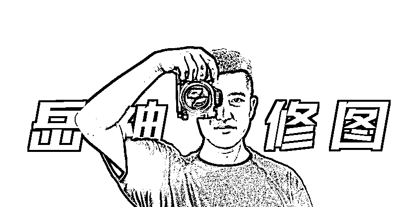

半年前我因为“差异值”踏入了Ai老照片修复行业，跌跌撞撞走到了现在也算是收获了一点小小的成就。

我认为Ai老照片修复就是一个富人不稀罕，普通人还做不了的一个小生意。

在当下这个快节奏且充满怀旧氛围的时代，老照片修复市场宛如一座亟待开发的富矿。

一方面，人们吃饱穿暖后就一定对精神层面的追求愈发强烈，那些承载着家族记忆、个人成长足迹的老照片，愈发显得珍贵无比。无论是祖辈泛黄褪色的全家福，还是父母年轻时的青涩留影，都承载着难以复刻的情感价值，大家都渴望能将这些珍贵瞬间完美重现。

另一方面，博物馆、档案馆、文化馆等众多机构，为了留存历史、传承文化，对馆藏的大量历史老照片也有着强烈的修复需求，以便让后人能清晰领略往昔岁月的风采。而且，老照片修复的客单价相当可观，依据照片的破损程度、修复难度以及客户的个性化要求，从几百元到上万元不等，利润空间极为诱人。

（近期发掘出的需求，内行人应该知道我这个思路的含金量！）

曾经，老照片修复是一门技术门槛颇高的手艺，需要美术功底、精湛的图像处理技能以及多年的实践经验。

但如今，Ai算法的横空出世，彻底改写了这一局面。

借助AI 修复工具，即便入门级的 jpghd/ModelScope/变清晰 基础软件，也能快速修复出让人还算满意的效果。

即使是毫无专业背景的新手，只要掌握了核心工作流的关键节点，也能快速上手，产出质量上乘的修复作品。

2024年我正是在生财里面众多精华文的“面包屑”里嗅到了这个差异值，一步一步摸索着进了这个门，通过拼多多+视频号等平台获客，一点点把盘子做大。

接下来，借着这次机会复盘也整理反思之后的阶段如何优化才能把盘子做的更大。

## 二、AI 很火，我怎么抓住它。

### 1.选择大于努力，一定选对 AI 修复工具！

这个项目的壁垒和门槛无它，就2个：

1.软件

2.校正

目前市面上的 AI 修复工具琳琅满目，功能特点各异，挑选一款效率最高，交付质量最好的Ai工具是关键核心。

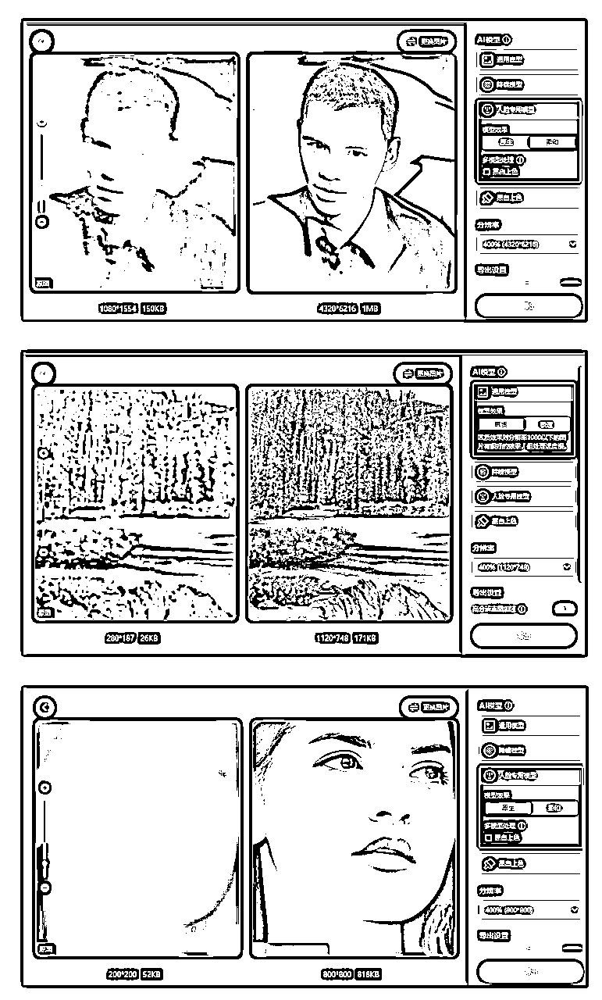

以第一梯队的王者代表： HPE 为例，它在处理面部细节方面堪称一绝。

当面对一张人物面部有划痕、模糊不清的老照片时，HPE 能够精准识别五官轮廓，运用先进的深度学习算法，对眼睛、鼻子、嘴巴等关键部位进行细致修复，让人物面部重现清晰。

上面例图的修复时间30-60s一张，这个跟电脑配置有关系，1w以上的电脑10s就能生成，2-3k的电脑要大几十s。

HPE操作界面简洁明了，即使是毫无技术基础的新手，只需导入照片，点击修复按钮，稍等片刻，就能收获令人惊艳的修复效果，保证交付质量。

第二第三梯队的修复工具还有很多：wink/稿定设计 等其他付费修复软件的优势在于其丰富的模板与便捷的批量处理功能。

它内置了海量的修复模板，涵盖不同年代、风格的照片类型，只需选择与照片匹配的模板，

还有许多其他优秀的工具，大家可以多去尝试，根据自己的操作习惯和修复需求，找到最适合自己的那一款。

### 2.AI + 手动微调，修复效果 “炸裂”

虽说 AI 修复工具已经相当强大，但要想让修复作品达到极致，后期的手动微调不可或缺。

这也是我们项目的第二道壁垒：后期校正

可能有些兄弟们会觉得：后期校正是不是就要修图了？!

不是说好的只用Ai进行修复吗??!

如果什么门槛都没有，傻子来了都能赚钱的项目那还叫项目么？

如果有PS或者修图基础的话，15分钟就能摸透这个关键工作流。

如果完全没有PS或者修图基础，保守时间是要3-5小时的沉浸学习。

## 三、拼多多 + 抖音是主要引流渠道

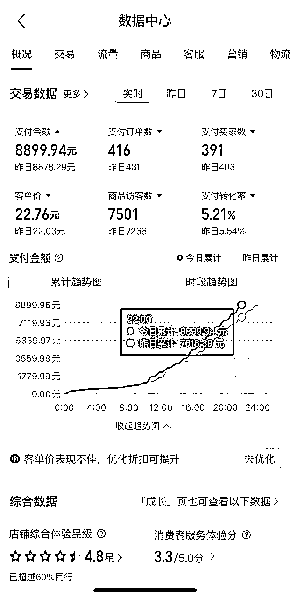

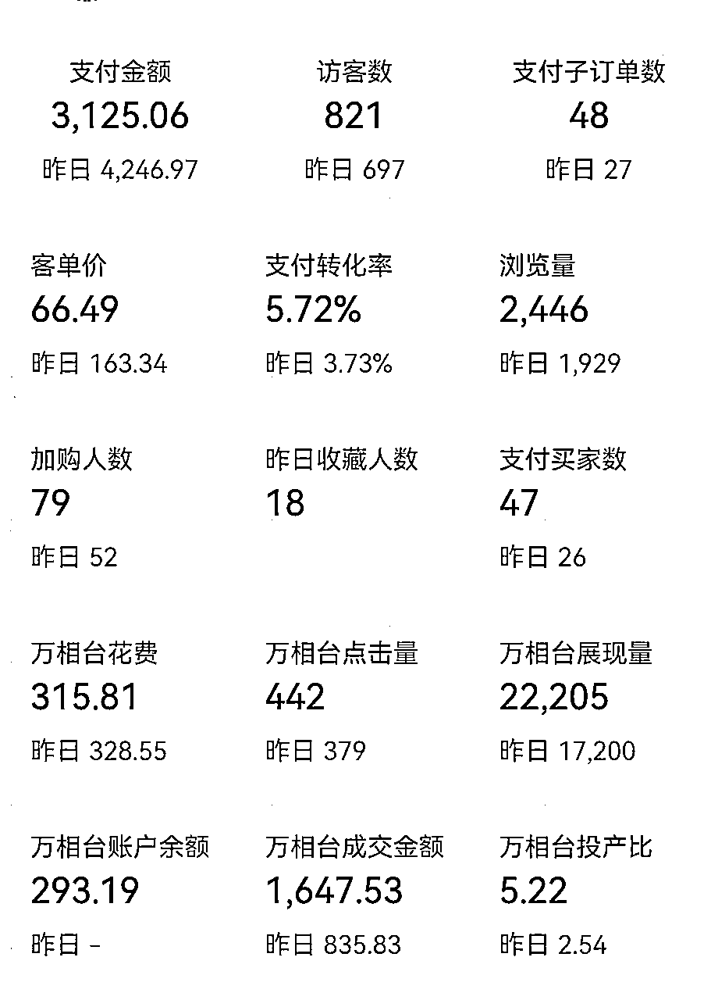

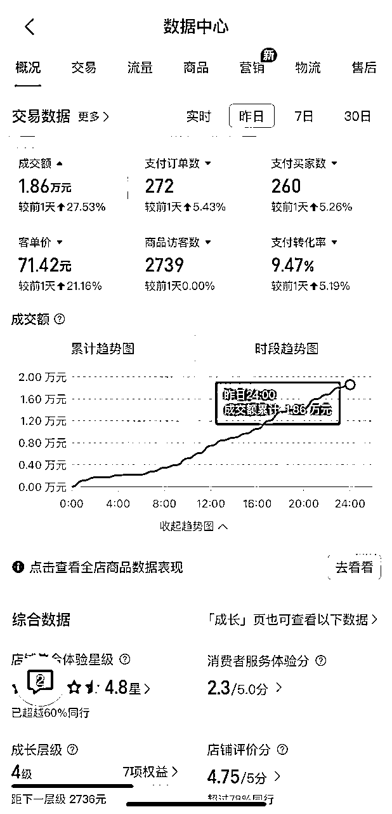

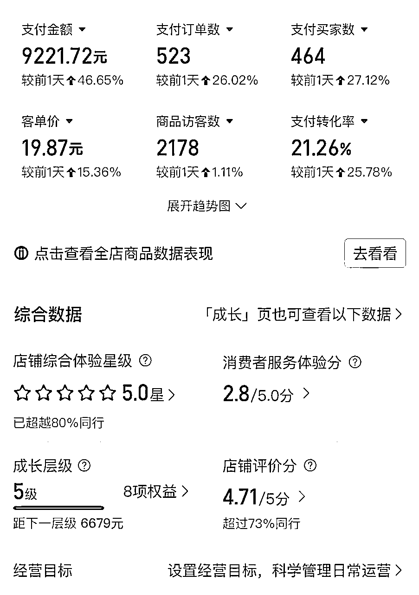

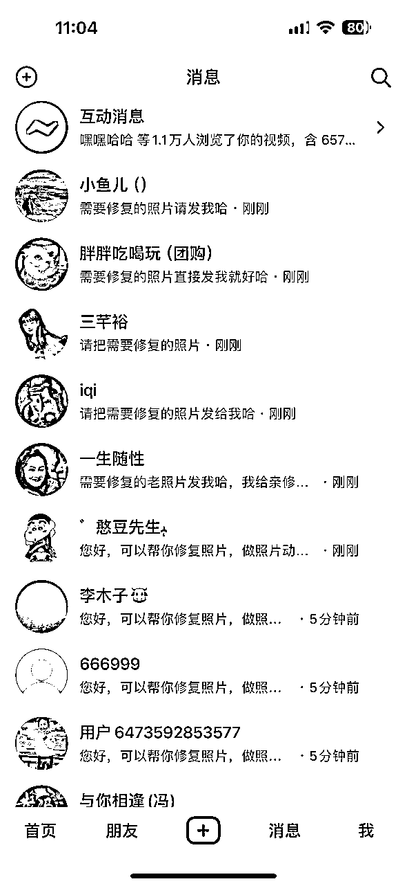

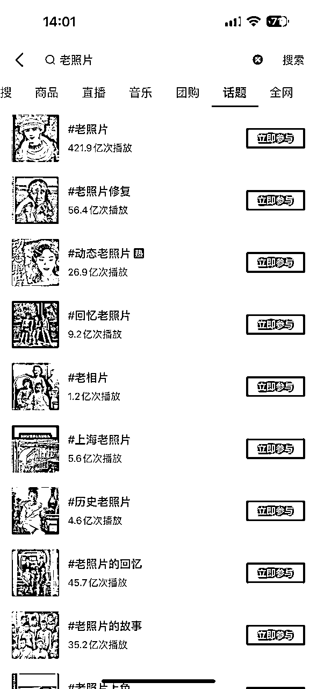

### 1.拼多多开店全流程

在拼多多上开启您的老照片修复之旅，开店流程其实并不复杂。

首先是注册环节，您既可以前往拼多多官网，也能下载拼多多商家版 App，点击 “我要入驻”，使用手机号完成注册，按要求填写商户个人资料，像姓名、联系方式等，务必确保信息准确无误，后续很多流程都会用到这些基础信息，一旦出错可能影响审核进度。

注册成功后就要选择店铺类型，这里有个人店铺和企业店铺之分。个人店铺入驻相对简便，准备好身份证照片就行；企业店铺则需要提供工商营业执照等更多资质证明，大家根据自身实际情况抉择。选好店铺类型接着填写店铺信息，店铺名称要既独特吸睛又能精准反映业务内容，比如 “岁月拾光老照片修复工作室”，让顾客一眼就知晓店铺业务；主营类目直接选 “设计服务”，因为老照片修复本质就是一种专业设计服务；再简要介绍下店铺优势，像 “运用前沿 AI 技术，专业团队精修老照片，还您珍贵回忆”，字数不用多，突出重点即可。

信息填完提交，就进入资质审核阶段，依据所选店铺类型上传对应材料，个人店铺传身份证照片，企业店铺传营业执照等，注意照片要清晰、完整，避免模糊不清或有遮挡，不然审核容易不通过，耽误开店时间。

资质审核通过后，就得缴纳保证金。老照片修复属于虚拟服务类，保证金一般在 2000 元左右，这是为了保障交易顺利、诚信进行，后续关店时无违规情况会退还。缴纳完成，您就能登录卖家后台，设置店铺封面，可以选一张修复前后对比效果超震撼的老照片，让顾客进店前就对您的技术实力有直观感受；商品详情页要精心设计，详细说明修复服务包含的内容，像修复划痕、去噪点、上色等基础操作，还有是否提供额外的创意设计，如复古风格滤镜添加、背景优化等，以及不同修复难度对应的价格区间，从简单的小破损照片修复到复杂的大面积模糊、褪色照片修复，各列一个参考价，让顾客心里有底；运费模板设置为虚拟商品无需运费，毕竟老照片修复通过线上传输文件完成，不存在实体发货的物流成本。

最后就是上架商品，商品名称要包含热门关键词，像 “AI 智能修复老照片”“高清怀旧复古照片修复”，方便顾客搜索到；图片展示多放些修复前后对比图，不同年代、不同类型照片的都要有，如民国风黑白照、上世纪 80 年代彩色照等，用真实效果征服顾客；价格设置可以参考市场行情，初期为吸引顾客，简单修复定价 50 - 100 元，中等难度 100 - 300 元，高难度 300 - 800 元，后续根据店铺口碑、顾客反馈再灵活调整。

### 2.如何优化店铺，提升曝光量

店铺开好上架商品后，若想在拼多多海量店铺中脱颖而出，优化店铺至关重要。

店铺名称和简介要巧妙植入关键词，除了前面提到的直接反映业务的关键词，还可加上地域词，比如 “北京老字号 AI 老照片修复专家”，如果您在当地有一定知名度，能吸引同城顾客优先选择，还能增加地域搜索曝光；简介里突出技术优势，“采用行业领先 AI 算法，结合专业设计师手动精修，已为上千家庭重现美好回忆”，用数据增强可信度。

商品标题关键词优化不能马虎，利用拼多多后台的搜索数据分析工具，查看 “老照片修复” 相关热搜词，像 “破损老照片修复”“黑白老照片上色”“老照片高清还原” 等，合理组合融入标题，注意别堆砌，保持语句通顺，让顾客搜索时能精准匹配到您的商品。

店铺装修风格要契合怀旧主题，背景色可选复古棕、怀旧黄等色调，页面元素多使用一些复古图案，像胶片纹理、老式相机图标等，营造浓厚的怀旧氛围，让顾客进店就沉浸其中，提升停留时间，间接增加店铺权重。

积极参与拼多多平台活动，限时秒杀活动能快速吸引流量，设置几款简单修复的照片服务，以超低价格在特定时段秒杀，吸引顾客进店，他们可能顺带下单其他高价修复服务；平台的百亿补贴活动若能入选，更是能大幅提升店铺知名度，因为有平台官方背书，顾客购买更放心；还有新品推荐活动，每当您掌握新的修复技术或推出新的服务套餐，及时报名，争取曝光机会。

利用拼多多推广工具，多多搜索能精准定位目标客户，设置与老照片修复相关的关键词出价，比如 “祖传老照片修复”“老照片翻新” 等，当顾客搜索这些词，您的商品就有机会展示在前列；多多场景推广则是按不同场景展示商品，像在拼多多的首页、类目频道页等，让更多潜在顾客看到，您可以根据店铺流量高峰时段灵活调整出价，提高推广性价比。

鼓励顾客好评，设置好评返现、赠送小礼品等活动，顾客收到修复照片满意后，引导他们写下好评并晒图，好评率高、晒图多的店铺在搜索排名、推荐权重上都会更有优势，形成良性循环，吸引更多新顾客下单。

### 3.客户沟通与订单处理技巧

客户沟通可是促成订单、积累口碑的关键环节，得掌握些技巧。

顾客咨询时，回复一定要及时，拼多多有消息提醒功能，手机随时保持在线，同时提前准备好快捷回复话术，先把自己的修复案例发过去，让用户直接看到效果。

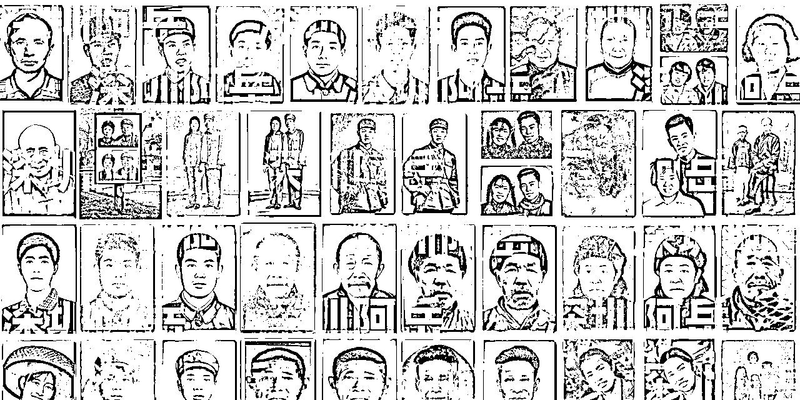

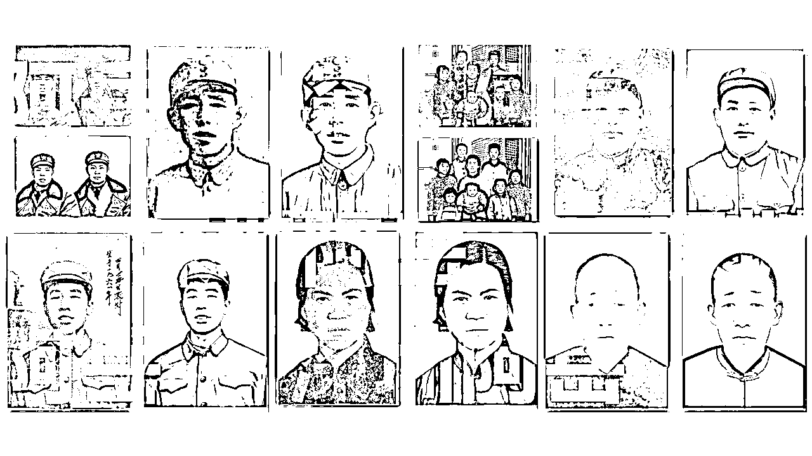

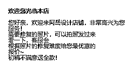

由于Ai技术大大提高了我们的效率，所以我们可以承诺【初稿不满意退全款】。

对于顾客的特殊要求，全力满足。有的顾客想给修复后的照片添加特定文字、图案，像在全家福照片上加个家族姓氏的印章，立刻回应，“没问题，这属于我们的创意定制服务，会安排专业设计师按照您的要求精心添加，保证效果独特又满意。” 同时适当说明可能产生的小额费用调整，顾客一般都能接受。

顾客所有的真实需求都是合理的，要重视和珍惜这些特殊需求。

处理订单时，收到顾客上传的照片，第一时间检查照片破损、模糊程度，预估修复时间，主动告知顾客，“您的照片已收到，初步看修复需要 2 - 3 天，我们会加班加点，一有进展就给您发小样确认，您放心哈。” 修复过程中遇到疑难问题，及时与顾客沟通，比如照片因年代太久，某些细节难以精准还原，坦诚说明，“这张照片人物眼睛部分由于太过模糊，AI 识别有些困难，我们的设计师会手动一点点修复，可能会比预计时间多一天，实在抱歉，不过一定给您做到最好效果。”

订单交付环节，先给顾客发修复后的小图预览，询问是否满意，顾客确认无误后，再发送高清原图，同时附上感谢语，“非常感谢您的信任与支持，照片修复好了，希望能帮您留住这份珍贵回忆，如果后续还有需求，随时来找我们哈，祝您生活愉快！” 贴心的服务会让顾客好感倍增，成为回头客，还可能帮您推荐给身边朋友，口碑传播带来更多订单。

## 四、精准定位客户，实现高效转化

### 1.拼多多用户画像分析

拼多多作为国内电商巨头，汇聚了庞大且多样的用户群体。

深入剖析其用户画像，能为老照片修复业务精准定位客户、制定营销策略提供有力依据。

从年龄分布来看，拼多多用户覆盖各个年龄段，但其中 30 岁 - 50 岁的人群占比较为突出。

这部分人群大多处于事业稳定期，对生活品质有一定追求，同时又饱含浓厚的怀旧情怀。

他们家中往往珍藏着大量老照片，这些照片承载着成长记忆、家族变迁，随着岁月流逝，照片出现褪色、破损等问题，使得他们对老照片修复有着强烈需求，渴望通过修复重温往昔美好时光。

无论是数据分析还是实战操作，拼多多的获客效率和转化率都远高于天猫淘宝！

消费习惯：拼多多用户以追求高性价比著称。

他们热衷于在平台上搜索各类物美价廉的商品，对于价格较为敏感。在选择老照片修复服务时，同样会关注价格因素，期望用相对实惠的价格获取高质量的修复效果。但这并不意味着他们只看重低价，一旦修复效果达到甚至超出预期，他们愿意给予好评并进行口碑传播，为店铺带来更多潜在客户。

需求特点：拼多多用户注重实用性与情感价值。老照片修复对于他们而言，不仅仅是简单的图像处理，更是一种情感的寄托与延续。他们希望修复后的照片能清晰还原人物面容、场景细节，让那些珍贵瞬间重新焕发光彩。而且，部分用户可能因特殊场合，如家族聚会、长辈寿辰等，急需在短时间内完成照片修复，对时效也有一定要求。

抖音运营的思路同理，疯狂怼视频跑矩阵即可，需要注意的是，抖音的养号养粉的周期比较久，通常都要几个月坚持发，后面就会源源不断地免费流量和生意上门找上来，享受丰收的喜悦！

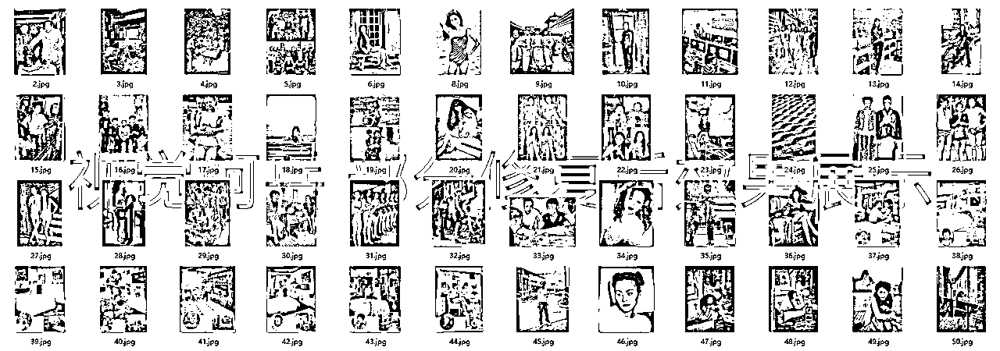

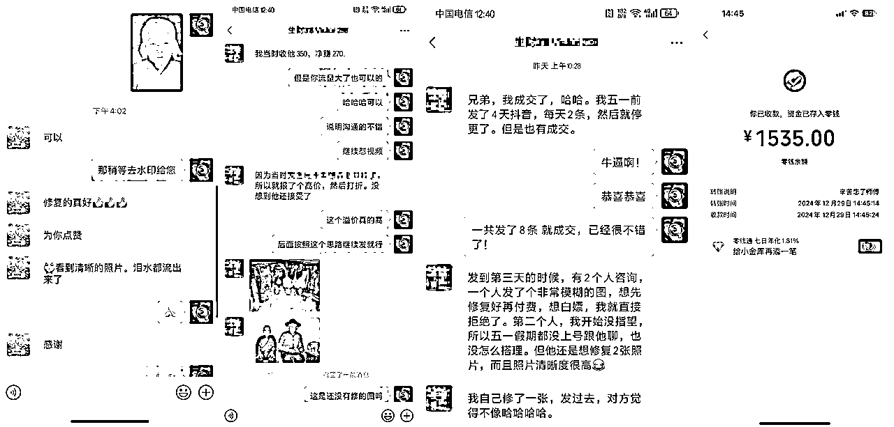

### 2.针对不同客户，制定营销策略

了解拼多多用户画像后，便可针对性地制定营销策略，实现高效转化。

对于重视质量的客户，这类客户通常对照片修复效果有着极高要求，可能之前在其他地方有过不太满意的修复经历，所以倍加谨慎。

在接待这类客户时，要充分展示店铺的专业实力，主动提供过往修复的高质量案例，详细介绍修复过程中运用的先进 AI 技术以及专业设计师的精细手动微调环节，让客户了解到每一个细节都能得到精心处理。

在报价上，可适当提高价格，因为高价格在他们眼中往往等同于高品质、高保障，让客户觉得物有所值。

（你报的低反而被质疑水平，报高价可以留出砍价的空间，这里面是有话术技巧的，后面找机会分享）

注重时效的客户，他们一般是因紧急需求而来，比如即将举办的追悼会需要遗像紧急修复、近期旅行归来想快速分享清晰的老照片等。面对这类客户，要第一时间响应，承诺加急处理，并给出明确的交付时间节点，让客户安心。在店铺页面设置加急服务通道，突出显示加急服务的优势与流程，方便客户快速下单。同时，调配充足的人力、物力资源，确保在承诺时间内高质量完成修复任务，赢得客户的信赖与好评。

疑问多顾虑多的客户，这类客户在咨询过程中会反复询问修复细节、价格构成、是否有隐形消费等诸多问题，甚至还会对 AI 修复技术的可靠性持怀疑态度。接待时，务必保持耐心，用通俗易懂的语言逐一解答客户疑问，主动发送修复前后对比图、客户好评截图等资料，增强客户信心。对于客户担心的问题，如是否会过度修图导致失真、后续修改是否收费等，给出明确、肯定的答复，消除客户顾虑。还可以提供试修小样服务，让客户先看到部分修复效果，满意后再付款，以诚意打动客户，促成订单。

好的项目都要时间去沉淀和打磨，不要想一口吃下个胖子。

即便是拼多多平台可以暴力起店出单，站在足够长远的角度看，路还是要一步一步走的更踏实，就好比经过了将近1年得沉淀，无论是短视频自然流矩阵还是PDD店群不用高额推广费也都有着很稳定的流量，这当然要感谢最开始一步一个脚印的自己。

### 3.私域-不断扩大自己的后花园。

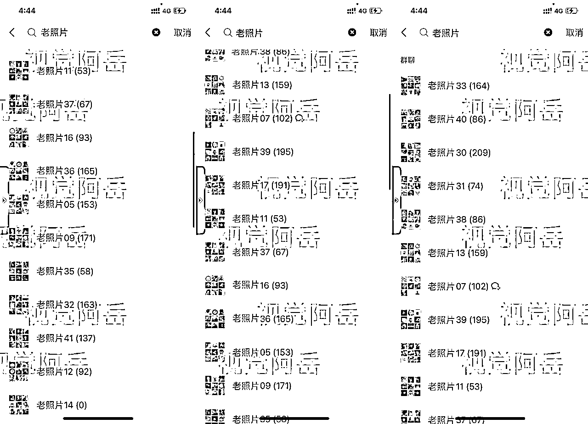

客户维护阶段，我建立了客户微信群，定期在群里分享老照片修复知识、修复前后对比案例，增加与客户的互动。

推出会员制度，充值优惠制度，可享受全年 8 折优惠、优先加急处理等特权，吸引老客户持续消费。

对于新客户，设置首单立减 20 元活动，鼓励下单尝试。每逢重要节日，还会给客户发送专属优惠券、祝福短信，让客户感受到关怀，提升客户粘性与复购率。

通过以上各环节的精心运营，我的店铺订单量逐月攀升，从最初每月几十单，到后来每月千单左右，客单价也逐步提高。希望我的经验能给大家带来启发，祝大家也能在AI老照片修复这个领域收获满满！

通过生财的圈子我们一起把Ai老照片的蛋糕做大！