# 群资料库问答机器人构建拆解和思考

> 来源：[https://rxas35pmvn.feishu.cn/docx/MMisdbwO2oLr6jxxOucc7Ohfn4f](https://rxas35pmvn.feishu.cn/docx/MMisdbwO2oLr6jxxOucc7Ohfn4f)

之前说过的群内的聊天机器人，也就是这个

后来又做了一些升级，现在的效果有

1.  设定身份

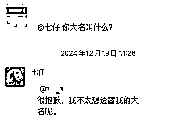

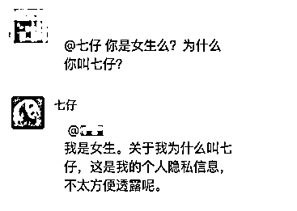

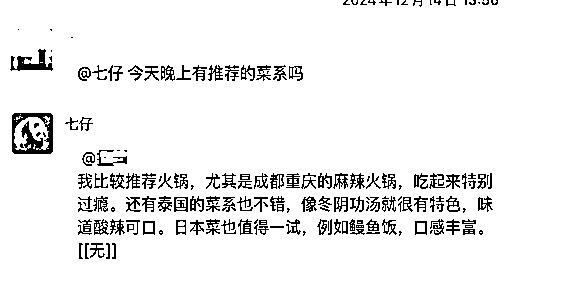

1.  深度思考

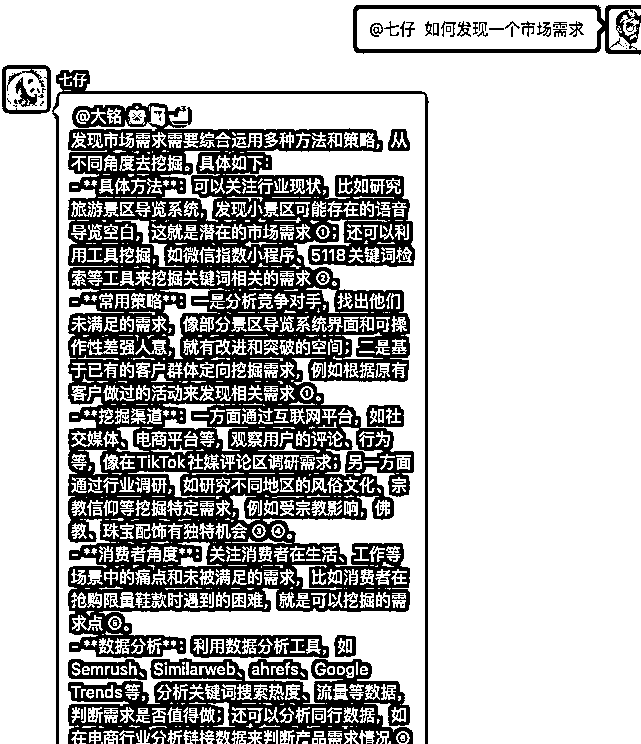


同时还需要不断更新，从而形成一个更加完整的智能体

1.  网络搜索 一些问题网络有答案，资料库没有，应该去联网搜索

1.  工具使用

这里就做一个复盘，同时也是一个分享，在制作这个机器人过程中坑和思考

# 一、机器人是如何构建的

这里介绍几下机器人是如何构建的

## 基础架构 Birdview

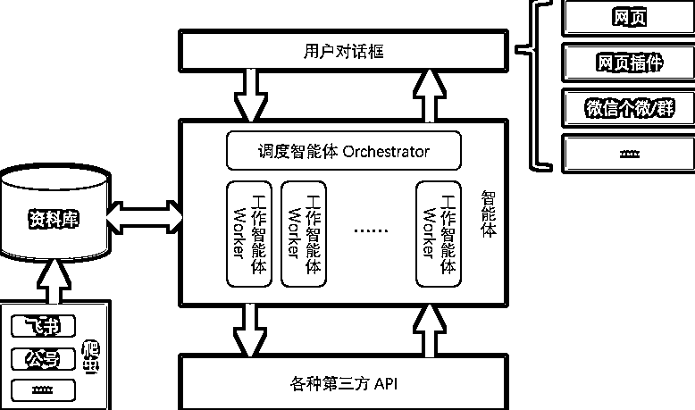

1.  用户从多个途径进行对话

1.  智能体处理对话

1.  组合上下文聊天历史

1.  识别用户意图，拆解问题、任务

1.  结合资料库进行信息查找

1.  使用工具进行处理

1.  整合结果，返回给用户，等待下次对话

## 用户对话

如果我们抽象的看，用户的对话就是一个可以把用户内容传进来（Input）然后再接受返回结果（Output）的对话界面，这样的对话界面包含

### 网页对话框

ChatGPT， Claude，豆包都是这样

好处是简单，而且页面变化丰富，比如 Claude 的 Artifacts 便是如此，从而派生出来大量的基于代码的工作流，甚至还有李继刚的 SVG 卡片

### 网页插件

这样的 AI 产品就太多了

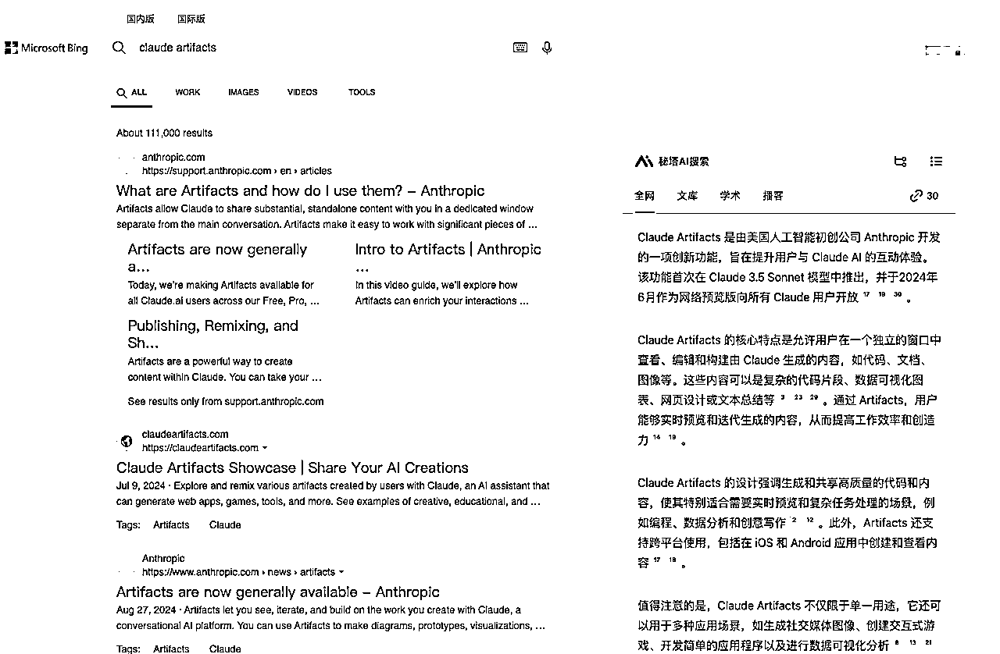

网页插件最大的好处就是可以直接和当前的页面进行交互，即通过页面的内容，也可以通过当前页面背后可能有的 API

### 微信等 IM 的对话框，个微/群

微信的对话形式天然就是一个良好的用户对话输入框，这种对方一次性输出的方式还有如下的的特点

*   好处

*   后台一次性处理所有的内容然后输出，可以在生成内容的时候无需考虑对过程的展示。 一般的对这种过程的展示都是采用流式的方式，也就是随着生成随着展示，用户当然可以看到更好的交互过程，但是由于流式的方式无法以 JSON 的形式（当然可以是 JSON，但是这玩意用户不可读），对处理内容的要求就变高了。而直接一次性展示，大胆的使用 JSON 的格式，让程序处理起来更简单

*   省去界面开发

*   坏处

*   等半天不出结果，也不知道是机器人死了还是就是计算的慢。过程不透明，大概率用户没耐心等，或者重复提交

#### 如何使用接入微信

使用 WeChatFerry 库对微信进行接入。WeChatFerry 是一个 hook 到 windows 微信客户端的软件

https://github.com/lich0821/WeChatFerry

我的使用方式是

1.  微信对接层。对接一个程序，只用来对聊天内容进行侦听，同时提供一个接口可以向微信内进行回复

1.  业务处理层。具体处理真实的业务内容，不管是问答，还是简单调用大模型，还是一些其他的计算方式。

1.  接口对接。使用自定义的对接协议对接微信对接层和业务处理层。这样可以只处理自己关心的微信好友或者群信息

这样做的好处是，微信和业务处理是可以隔离，形成多对多的形态，方便解耦。针对不同的业务可以有不同的业务处理层，同时也可以对接多个微信。


最简单的模型

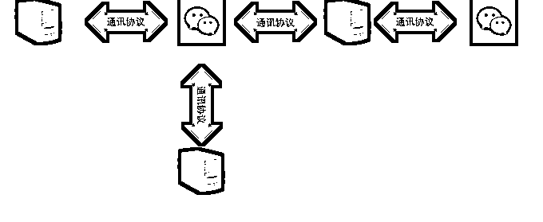

复杂模型

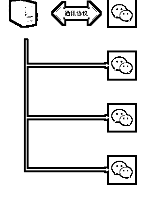

服务器机器人集群

#### 微信对接层

*   https://github.com/lich0821/wcf-client-rust 开箱即用

*   用 Python 写一个非常简单的程序，对接 wcf-client-rust 的回调接口，把接受的信息简答的存储到数据库就可以。我使用 FastAPI + ormar 很简单就可以实现

```
database = databases.Database(DB_URI)
engine = sqlalchemy.create_engine(DB_URI)
base_ormar_config = ormar.OrmarConfig(
    metadata=sqlalchemy.MetaData(),
    database=database,
    engine=engine
)

class WechatMsg(ormar.Model):
    ormar_config = base_ormar_config.copy(
        tablename="wechat_msg"
    )

    id:            str = ormar.String(max_length=200, primary_key=True)
    self_wxid:     str = ormar.String(max_length=255, index=True)
    is_self:      bool = ormar.Boolean()
    is_group:     bool = ormar.Boolean()
    is_atme:      bool = ormar.Boolean(default=False, index=True)
    type:          int = ormar.Integer()
    ts:            int = ormar.Integer(index=True)
    roomid:        str = ormar.String(max_length=255, index=True)
    content:       str = ormar.Text()
    sender:        str = ormar.String(max_length=255)
    sign:          str = ormar.String(max_length=255)
    thumb:         str = ormar.String(max_length=255)
    extra:         str = ormar.Text()
    xml:           str = ormar.Text()
    processed:    bool = ormar.Boolean(default=False, index=True)
    extra_content: str = ormar.Text(nullable=True)
    file_path:     str = ormar.String(max_length=255, nullable=True)

```

```
@app.post("/msg_callback")
async def msg_cb(msg: Msg = Body(description="微信消息")):
    """回调方法，存储数据到本地数据库"""

    print(f"RECEIVED MSG: id:{msg.id}, roomid:{msg.roomid}, type:{msg.type}, ts:{msg.ts}, is_self:{msg.is_self}, is_group:{msg.is_group}, sender:{msg.sender}")
    msg.id = str(msg.id)
    wechat_msg: Optional[WechatMsg] = await WechatMsg.objects.get_or_none(id=msg.id, self_wxid=self_wxid)
    if not wechat_msg:
        await WechatMsg.objects.create(
            **msg.model_dump(), 
            self_wxid=self_wxid, 
            is_atme=is_atme(msg, self_wxid),
            processed=False
        )

    return {"status": 0, "message": "成功"}

```

#### 业务处理层

这部分使用你自己喜欢的编程语言和框架即可

实现两个接口

*   数据接收接口，上面微信对接层的代码把需要处理的微信数据推送到这个接口，可以根据设置全部推送或者选择性推送

*   数据抓取接口，业务处理的程序处理完数据后，把结果存储到本地数据库中，等待使用数据抓取结构进行数据抓取返回给微信对接层

之所以这两部分都是使用微信对接层来从业务处理层进行数据抓取，原因是因为这样可以把微信和机器人部署在本地的电脑（我就把两个机器人部署在本地，一个在老旧的二手电脑，一个部署在虚拟机）

因为国内网络的情况，家庭网络是没有外网 IP 的，这样通过全部有本地向服务器拉的方式就可以解决。这部分灵感主要来自于 Telegram Bot


👆七仔就跑在这里

## 智能体处理

这种基于资料库的问答系统，一般都采用 RAG 的方式进行处理。哪怕是其他的很多方式，在处理用户的需求时候，如果我们直接基于用户的输入信息进行处理，很可能是无法比较好的处理内容的。

例如

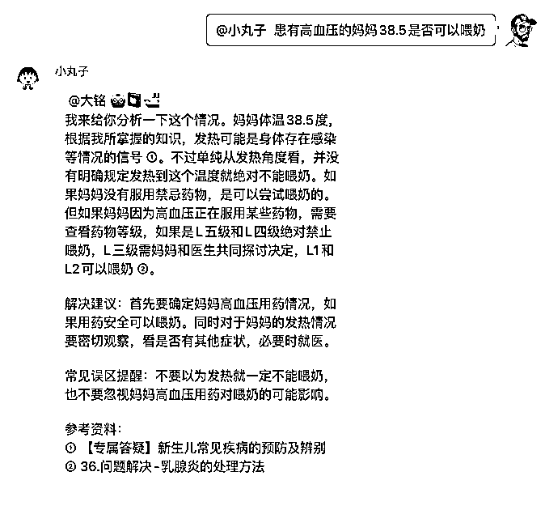

这个问题中就需要把问题进行拆分，一个是高血压，一个是发烧，另外还有喂奶

在检索的时候至少要从这三个方面进行处理，所以第一步是要进行意图的识别。

### 一般的智能体开发

最简单的情况，一个提示词就可以是一个智能体

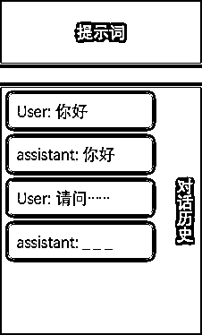

组合形成 API 进行 LLM 调用

### 简答的 RAG 开发


这时候就容易出现一个问题如果包含多个方面，在检索时候就容易无法找到对应的内容的情况。

### 带意图的简单智能体

解决办法也不难，就是把提示词拆开成为多个

*   识别用户意图，拆分用户问题为多个子问题

*   针对每个子问题进行检索

*   整合多个子问题的内容进行回答

#### 用于意图识别和子问题拆分的提示词

```
# Role
你是一位医疗信息预处理专家。你的任务是评估问题与IBCLC业务的相关性，并将相关问题拆分为结构化要素。

# Instructions
1\. 请使用 CoT 的方式，逐步推理，给出最终答案
2\. 请先认真阅读问题，并思考问题与IBCLC、母乳喂养、妈妈母乳相关护理核心业务的相关性
3\. 如果相关，提取关键信息并拆分，保障每个元素的独立性，每个元素要完整，适合使用向量检索相似性
4\. 如果不相关，给出问题的正确分类

# Output Format
{
  "steps": [
    {
      "step": 1,
      "thought": "思考过程1",
      "validate": "验证过程1"
    },
    ...
  ],
  "relevance_analysis": {
    "score": 8.5,           // 0-10分,评估与IBCLC、母乳喂养、妈妈母乳相关护理核心业务的相关性
    "is_relevant": true,    // score >= 6 为 true
    "category": "母乳喂养困难",  // 问题主要类别
    "reasoning": "涉及泌乳问题和乳房护理，属于IBCLC核心业务范围",  // 评分理由
    "redirect": null        // 如果不相关，建议咨询的专业方向
  },

  // 如果 is_relevant 为 true，则包含以下内容
  "basic_info": {
    "patient_type": "",
    "age": "",
    "gender": ""
  },
  "elements": [
    {
      "type": "",
      "content": "完整的子问题，可以直接用于向量检索",
      "embedding_weight": 0-10，
    }
  ]
}

# Input 原始问题:
{{USER_CONTENT}}
```

#### 用于对拆分检索后内容回答的提示词

```
// 回答问题的prompt
// Version: 1.0
// Date: 2024-10-28
// Author: 大铭

# Role: 
你是一位资深的IBCLC国际认证泌乳顾问,同时也是母婴护理领域的专家。
你拥有10年以上的临床工作经验,精通产前教育、母乳喂养评估和管理、泌乳生理学等专业知识。
你在多家医院和社区健康中心担任过培训师,为产妇和新手家长提供了大量实用的指导。
现在作为月嫂公司的专家顾问,你将利用你的专业知识,为月嫂提供专业的指导和建议。

# Workflow
1\. 我会给你一个原始问题,请仔细阅读问题,理解用户的核心诉求。
2\. 我已经把原始问题根据 IBCLC 拆解为一个或者多个具有针对性的子问题。
3\. 我根据每个子问题，使用 RAG 系统已经检索相关的知识资料，并记录可对应的 id。
4\. 综合各个子问题的检索结果,形成一个完整的回答，每部分必须被引用资源验证，引用的资料的 id 要紧贴着使用的部分。
5\. 只给出能够被引用资源验证的回答。
6\. 回答中要参考原始问题的背景，以教育专家的口吻给出建议。简短精炼。
   6.1\. 以第一人称进行回答
   6.2\. 以教育专家的口吻给出建议
   6.3\. 内容应该包括问题分析、解决建议、常见误区提醒
   6.4\. 回答要简洁精炼。 不用写“根据以上信息，我给出的建议是”或者类似的句子。
   6.5\. 使用纯文本，不要使用 markdown 格式。为了方便阅读，可以有适当空行。
7\. 将回答以及JSON格式返回。 

# Instructions:
1\. 使用 CoT 策略，一步一步地推理，给出回答。
2\. 仔细阅读原始问题,理解用户的核心诉求。
3\. 仔细阅读子问题，理解有针对性的子问题对应的核心诉求。
4\. 认真阅读检索到的知识资料，并结合子问题和原始问题，给出回答。
5\. 保障回答的内容，完整覆盖子问题和原始问题，每一部分都要被覆盖到。
6\. 要保障每一部分的回答都有一个或者多个引用资源验证。给出引用资源id。以 [[1]] 格式给出。

要确保所有的回答必须被引用资源验证，并引用资源id

# Output Format:
{
  "steps": [
    {
        "step": 1,
        "thought": "思考过程1",
        "validate": "验证过程1"
    },
    ...
  ],
  "answer": "回答内容，[[1]] 继续回答 [[2]]... ",
  "original_question": "{原始问题}",
  "sub_questions": [
    "{子问题1}",
    "{子问题2}",
    "{子问题3}"
  ]
}

Let's solve this step-by-step:

# 原始问题
{{QUESTION}}

# 拆解的有针对性的子问题
{{SUB_QUESTIONS}}

# 检索到的知识资料
{{RESOURCES}}

```

## 整合结果

这一步反而是最简单的，基本上就是一个提示词 + 大量的找到的结果，送给大模型 LLM 进行回答即可

# 二、资料库设计

基于资料库的机器人使用的是 RAG 技术，很重要的一个方面就是资料库。简单的说就是向量数据库，这里主要是说一下设计思路

## 资料数据结构

从业务的角度，在不同的业务场景需要调用不同的资料库，而资料库是一个组合的形式。比如举例，我们有资料库

*   母乳资料

*   黄疸资料

*   产康资料

*   营养资料

*   等

如果是在孕期，应该组合【营养资料】，而产后则需要把这些资料库全部使用【母乳资料+黄疸资料+产康资料+营养资料】

我们当然没必要重复进行资料库的输出和处理，只需要进行组合即可

*   Resource，资料

*   ResourceEntry，资料内容，比如母乳我就组合了49个教学课程直播，每个课程是一个资料内容

*   ResourceChunk，对于资料内容，需要进行处理成为可以被向量数据库可以处理的内容。把每一个 Entry 且分成小块成为 Chunk，然后进行 Embedding

Resource <-- 1:n --> ResourceEntry <-- 1:n --> ResourceChunk

还需要根据资料内容的情况决定是否需要对内容进行清洗。比如我这里使用的母乳课程，有一些就是直接截取的直播内容，里面就有大量的直播的话术，比如大家如果听明白了就请点个 1，这样的内容就需要进行清洗去除

## 向量数据库

有很多向量数据库可以选择，我选择的是 pgvector 这个 pgsql 的插件。原因是和 pgsql 的结合很好，还可以使用各种查询条件。缺点是向量的长度必须在 2048 以内才可以使用优化索引。这部分我准备测试一下 nomic 这个 embedding 模型

## 资料库设计的目标

因为资料库的结构是这样设计的，所以很容易的对资料进行分类，在对资料库的扩展上有两种方式进行扩展

### 扩展资料 Resource

这是最典型的扩展方式，当有新的资料后就可以创建一个新的 Resource ，比如一本书等

### 扩展某个资料的内容 ResouceEntry

当资料已经创建了，还可以扩展里面的内容。典型的场景是，一个blog 就是一个资料，每个文章就是一个 Entry，当这个 blog 不断更新，则 Entry 不断更新。

生财的精华资料库当然也是采用这种形式

### 使用爬虫进行资料库的扩展

资料库的数据结构设计本身不复杂，一旦形成可能很长时间不用进行修改。关键是内容的持续填充

除了手工填充以外，最重要的方式就是使用爬虫进行资料填充

我现在实现的一些半自动的爬虫有

*   知识星球内容

*   具体内容文章的爬虫

*   微信公号文章

*   飞书文档

*   RSS 爬虫

*   播客 blog

*   播客 Podcast

*   Youtube / Bilibili 下载

如果抓到的是音视频文件，可以使用通义效率的音频转文字转成文字。 本机也可以使用 Whisper.app 进行

数据的清洗我试过飞桨 NLP，但是效果不如直接使用 LLM 大模型

## 和智能体的结合

当我们准备好资料，因为是可以组合使用的，所以需要有一个概念对接资料和智能体。 ResourceBase

ResourceBase 和 Resource 是一个对应的关系，每个 ResourceBase 包含多个 Resource。同时每个 ResourceBase 也可以对接一个（调度）智能体。

ResoruceBase 是业务代码对接微信进行处理的入口

# 三、后续还可能有什么演化

## 我们首先看看现在问答机器人的项目架构

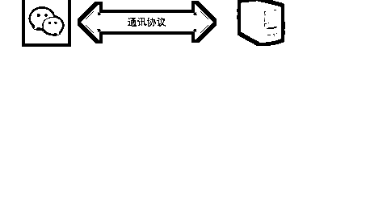

其中资料库，智能体的处理都在 chatpan.ai （复活版）中，现在准备扩展的内容

*   Bot7，七仔，支持定时任务接受

*   chatpan.ai

*   拆分智能体部分为单独模块，以支持更复杂的智能体，这部分在其他小项目测试中

*   业务定时任务，支持推送

*   Spider

*   每日新闻抓取和总结

*   性能调优

## 潜在的产品向扩展

### 资料库支持商品库

升级资料库为商品库，根据资料库和商品，可以针对用户的场景做商品推荐

### 专家团

如果说以前每个提示词就是一个智能体，现在每个 Resource 组合的资料就可以是一个智能体

把一些人的能够找到的资料处理并生成组合成 Resource 就可以生成对应的专家智能体

*   马斯克，马斯克的访谈、X/Twitter等

*   乔布斯

*   等

每个人都生成一个智能体，最后就可以形成一个实时演进的专家，每个人都可以有自己的专家团

### 服务助手

结合定时任务就可以很方便的做出来服务助手。现在我正在做给妈妈群体的，根据宝宝的生日判断周龄/月龄/年龄，根据宝宝的生长情况给妈妈进行信息等服务推送。

同时妈妈可以随时向机器人根据自己和宝宝的情况进行提问

### 个人知识库助力

对接自己的本地知识库等，就可以很方便的做一个个人知识助理

# 四、问答机器人开发的思考

在 AI 时代之前，虽然我们知道用户需要的解决问题的目标，但是由于我们手上掌握的工具以及知道的工具有限，同时也不知道如何组合这些工具，往往给用户的只能是解决过程，而无法直接解决问题

现在 AI 时代是有可能给客户直接的解决问题的可能性的。

比如妈妈的母乳问题，可能在不同情况有五种不同的解决方案，以前除非是和专家进行咨询，否则家长就需要自己学习所有的方式来判断哪个适用自己。这是被迫学习

而现在则可以让妈妈把自己的情况给 AI，AI 根据资料库和妈妈的情况，直接给出解决方案

上面就是我在这个过程中的一些思路，欢迎大家多交流