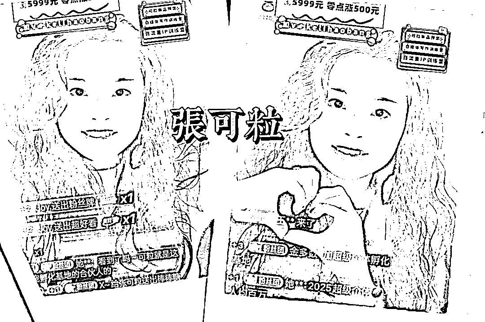
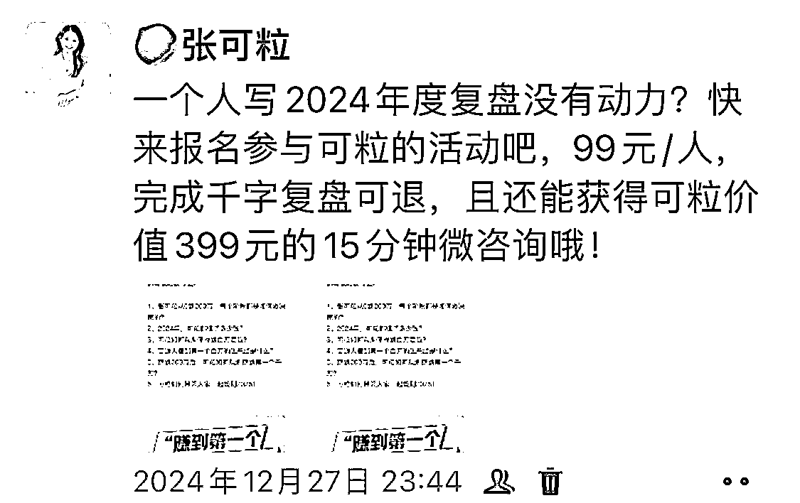
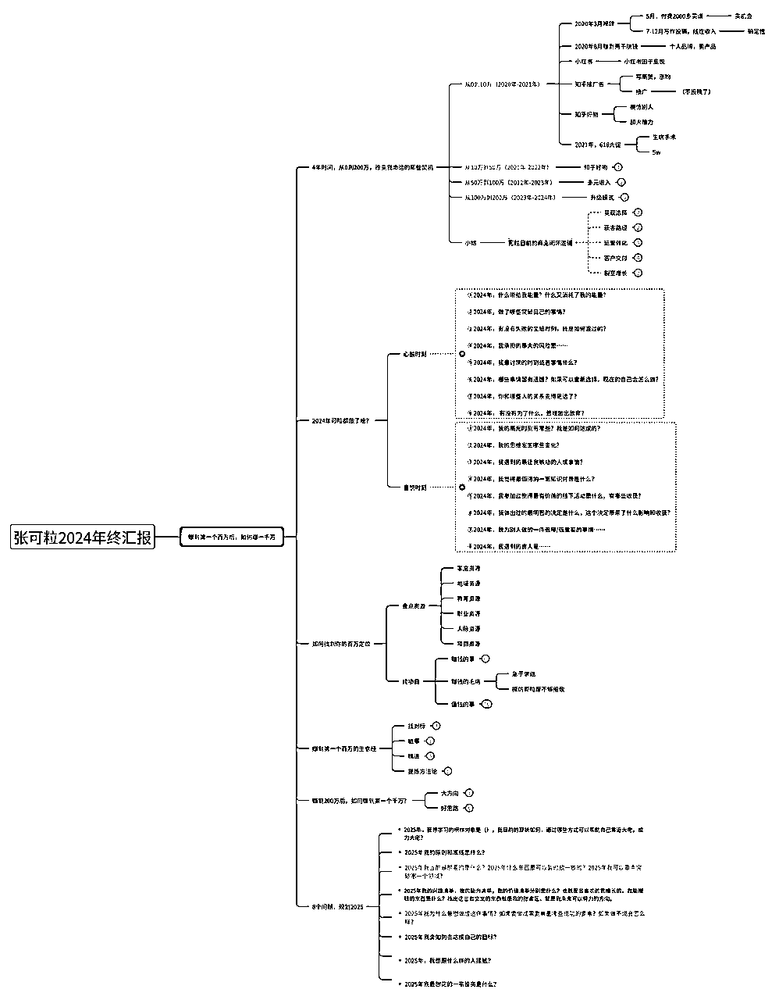
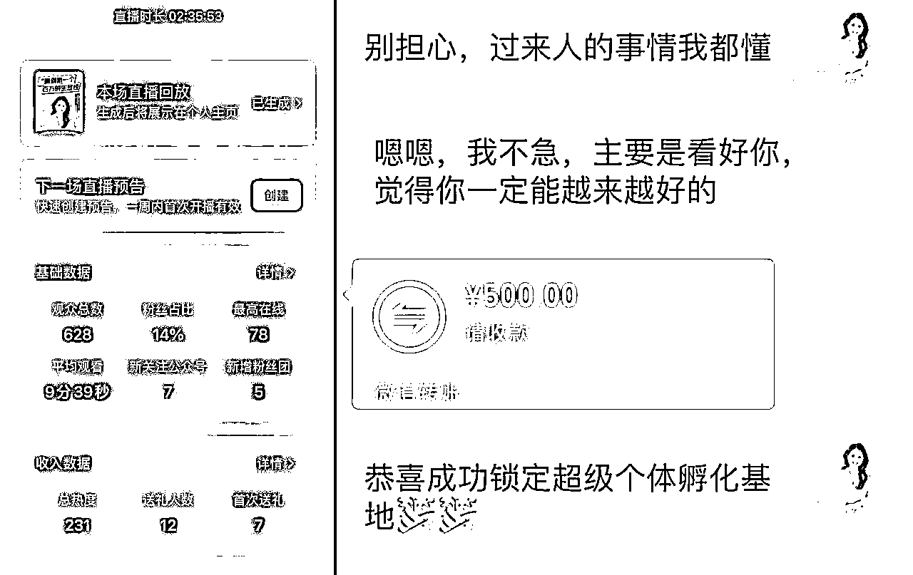
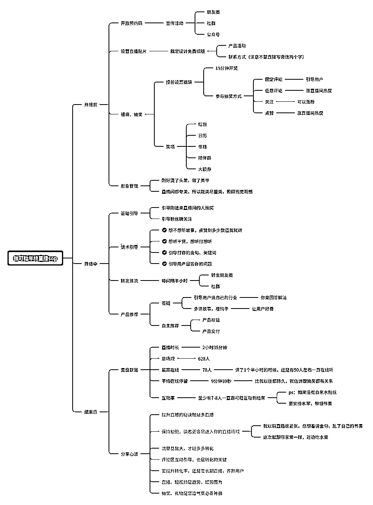
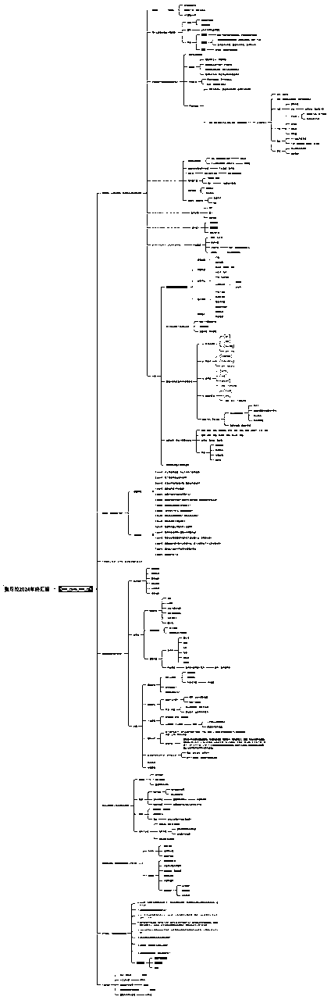

# 临时策划2024年度直播活动，变现12000，我的经验分享

> 来源：[https://b0attp331p.feishu.cn/docx/MbdtdpvZ8obWQwxmJl2cZ0KUndf](https://b0attp331p.feishu.cn/docx/MbdtdpvZ8obWQwxmJl2cZ0KUndf)

大家好呀，见字如面，见我发财，我是专注自媒体IP孵化和新个体创业的张可粒，连续两年年入百万。

今天跟大家分享我临时策划2024年度直播活动，变现12000的经验。

# 一、关于活动策划流程

在2024年12月27日的时候，我花了10分钟决定做一场年终汇报演讲，当天下午又花了3小时弄好了活动策划、直播海报、直播流程和公众号推文、朋友圈文案。

于是我就立马在朋友圈宣发了，每天都发一条，吆喝大家参与年终复盘活动，必带活动玩法的截图，一是可以减少活动解释成本，二是让大家快速get付款路径。

# （1）活动玩法

门票99元，参加可粒2024年终汇报&超级个体复盘会，完成千字复盘可以退回门票，且解锁可粒价值399元的15分钟微咨询。

# （2）活动推文

亲爱的精神股东们：

见字如面，见我发财，在这个充满挑战与机遇的2024年尾声。

我张可粒，带着满满的诚意和硕果累累的成绩，即将首次以直播的形式，向你们汇报这一年的奋斗历程和未来规划。

🔥【活动预告】🔥张可粒2024年终汇报暨超级个体2024复盘会

🌟 参与对象：想在互联网上搞钱的所有人🌟 参与资格：门票仅需99元/人，撰写1000字复盘即可全额退款

🎁【超值权益】🎁

*   直播当晚独家思维导图，助你快速吸收精华内容

*   千字复盘完成即享张可粒价值399元15分钟微咨询服务，一对一解答你的疑惑

*   全新升级的个人IP定位表

*   年终惊喜大抽奖，丰厚奖品等你来拿

*   积极互动的小伙伴，有机会获得神秘盲盒礼物

🚀【你将收获】🚀

1.  张可粒亲述：从0到200万，每个关键节点的决策之道

1.  2024年营收揭秘：可粒是如何实现财富增长的？

1.  定位百万市场：如何找到属于你的财富蓝海？

1.  普通人也能实现百万梦想：实用的生意经分享

1.  从200万到千万的跃迁：可粒的财富规划策略

1.  共同规划2025：携手可粒，共创辉煌未来

📢 这不仅是一场汇报，更是一次思维的碰撞，一次财富的盛宴。我在直播间等你，一起揭开2025年的财富密码！

【直播大纲简览】

（点击可查看大图）

【报名方式】

围观：扫码上方视频号二维码，12月31日晚19点开播提醒你，单纯听直播

深度参与：添加微信 支付99元，即可进年终复盘群深度参与，快来抢占席位，我们不见不散！

这是我发在公众号的推文。

# （3）活动流程梗概

最关键的就是当天直播流程的策划，我分成三个部分，即开播前、开播中、结束后。

开播前，设置预约码，邀请学员来听演讲，以及发圈、发社群、发公众号吆喝更多人。设置抽奖的东西，以及尽量把自己打扮得更加整洁、好看。

开播中，要分享的核心主题内容，埋钩子，运用一些技巧提升直播间留存，时不时抽奖。（想要看直播间话术可以找可粒领取）

结束后，复盘数据，交付已付费的用户，可粒在2024年12月31号晚上，当天就成交了单价5999元的会员， 一个付了定金，一个付了全款。

最好是写成复盘，方便自己回顾优化，也把经验传递给别人，创造更多势能。

图：直播后成交产品，付款了定金

附上「年终演讲」策划思维导图：

# 二、关于活动结束后的感悟

我曾经是一个拖延怪、是一个恐惧失败的人。

简单来说，就是想做什么事情，只是停留于「想」，并没有去执行。

恐惧失败，总想追求大而全，或者说对标比我更好的人，就忽略了自己的小成绩，忽略了自己的能力基本盘，本质上是一种自卑作怪。

不敢面对「没成绩、失败」，害怕、在意别人眼里的可粒不够棒、不够厉害，所以不敢去做。

现在想来真是可笑，想赚钱啊，果然还是得过情关，抛弃对于情感关系、人际关系的过度在乎，就不会整天胡思乱想，想着别人会怎么看你。你说别人有像你那么闲，天天研究无关自己的人吗？

我感谢自己扯掉了没有价值的「自卑」遮羞布，因为这场年终直播，我成交了两个超级个体孵化基地10年会员，gmv12000，很值得开心。

# （1）想做什么，just do it

# 

某一天下午，我的合伙人给我发了一个海报，说咱们可以做年度复盘，那我的第一个念头，就是万一做了没人买怎么办？

很快，我就否决了这个想法，我特么就是要去做。

花了10分钟决定做，花了2-3个小时策划了活动玩法、做了直播海报、写了公众号推文。

做完这三件事情后，我就开始宣发，距离31号，其实只剩3-4天了。

但是那又如何，我的年终汇报，其实不仅仅汇报给精神股东看，其实更是给过去的张可粒看。

（放2020-2023年的年度复盘）

“你看，2024年的张可粒更棒啦！”

“你果真，了不起！”

# （2）一个粗糙的开始就是成功

我喜欢我现在的状态，想做就去做，不怕失败，不怕不完美。

或许是因为我对厉害的人都祛魅了。

或许是因为，我明白了，无人能助我成长，唯有自我接纳。

在我成长的过程，挫折教育和金钱教育是最为匮乏的，我想不仅仅是我，而是大多数人出身底层家庭的小孩都是如此。

父母的教育和认知仅仅停留在，好好学习，上个好大学，找个好工作，嫁个好人，娶个好媳妇，生个好孩子，如此循环反复。

是谁定义了「好」的标准，又是谁定义了我们的人生呢？

当然，也不要向外纠结，而是向内探索。

归根到底还是自己见识得太浅薄了，所以才会被别人的思想牵着走。

所以，我要勇敢地去尝试，体验过程，而不是只在乎一个结果，唯结果论，可能就真的不敢开始。

没有开始，又何谈拿到一个个好结果呢？

# （3）每一次的表达，都是为「下一次的万人演讲」而努力

是的，可粒有一个梦想，叫做万人演讲。

其实也挺好实现的，线下万人演讲，我看过刘思毅搞过，线上万人演讲、甚至更多，就更多人搞过了。

我就在想，等可粒100万粉丝的话，聚集一万人来听我分享，无论是线上还是线下都不是什么大问题。

问题是，我的口头表达能力，还有很大的进步空间。

我总不能上台了，然后因为紧张讲得稀巴烂吧，我不想当个花瓶，我想当个有实力的宝藏花瓶。

要好看，还要很有价值，还要很会演讲。

毕竟，写作和演讲，都是成名之路。

那我提前跟你发出一个邀请，希望，你以后也来参加可粒的万人演讲活动，好吗？

祝你2025年快乐，新年胜旧年，万事皆顺意。

2024年12月31号晚上直播3个小时的精华汇总思维导图