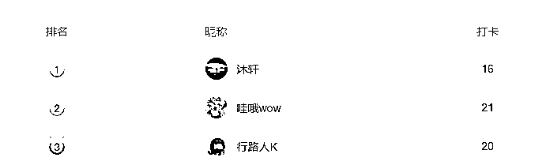
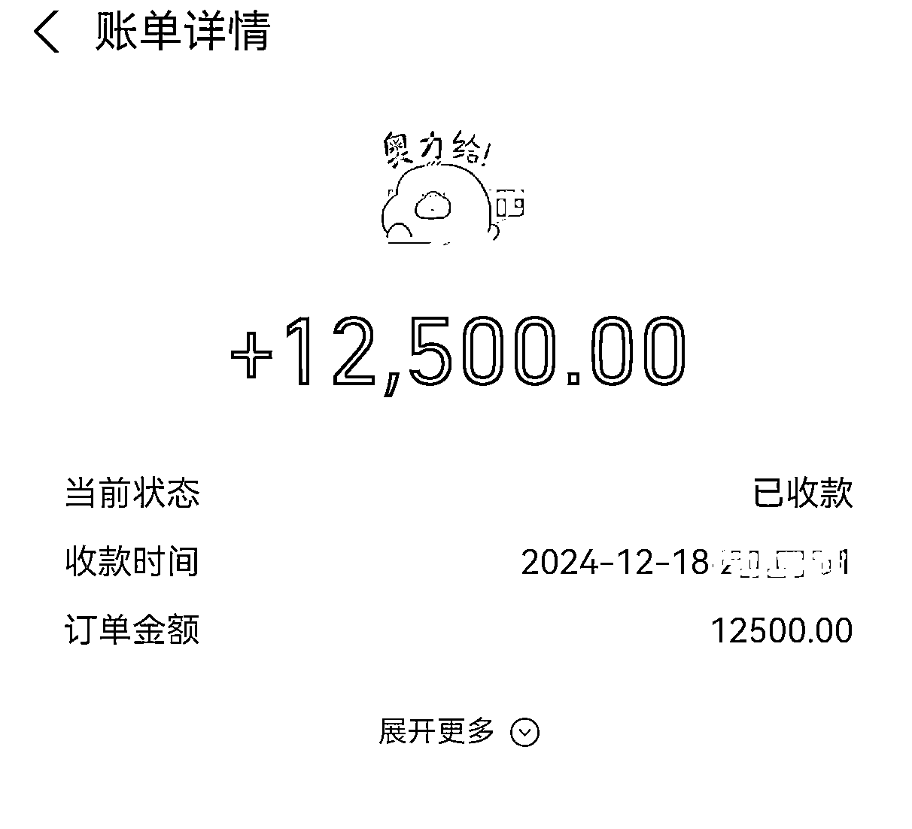
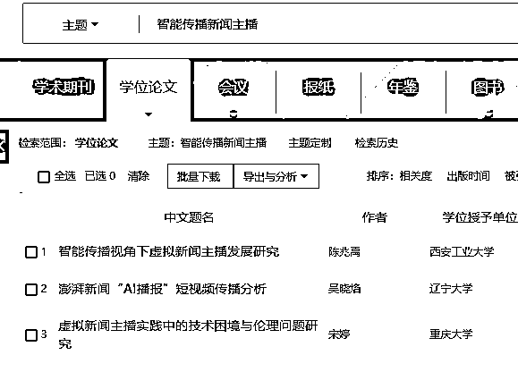
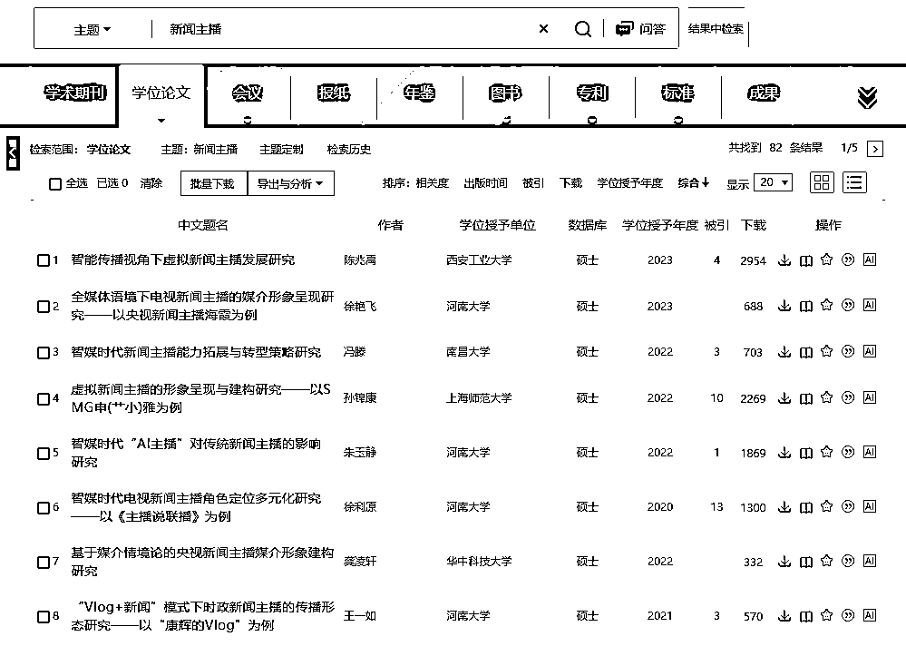

# 90条AI对话挣到5位数的跨专业硕论写作保姆级攻略

> 来源：[https://sxtad4dpgi.feishu.cn/docx/MsVIdpg4kokPWtxXYYOc7RENnzg](https://sxtad4dpgi.feishu.cn/docx/MsVIdpg4kokPWtxXYYOc7RENnzg)

AI写作航海期间，个人榜排名第17名，本小组内排名第1。首次发帖，战战兢兢。本文介绍航海期间用90条AI对话完成跨专业硕论写作的保姆级攻略。

自我介绍下， 作为潜水两年多的老圈友，今天首次发帖记录分享跨专业硕论写作经验。虽然作为论文行业的老兵，自己也挣到了点小钱，但是总感觉是碰运气挣到的，生财中的大神太多，觉得自己是个小白，没有太多技能可以教。我作为论文行业的行业老兵，在没有AI之前就接触了这个行业有四五年的时间了，曾经也是众多兼职群中的写作高手，我还记得自己刚毕业时为了完成接的任务，多次正在外面逛街的时候临时找到最近的网吧快速完成写作，后面很快完成从客服到个体老板身份的转变，依靠论文中单一产品年收入也能达到7位数。AI时代的到来，也急需转型和调整。我参加过很多次航海，但这一次航海是第一次做到小组第一，AI写作排名第17名，原本并没有在意过排名的事情，但是后期随着排名升高，每天逐渐的对排名有了追求，为了拿到更好的排名就认真的写航海日志，分享航海好事。本次重点复盘在航海期间我是如何完成五位数的跨专业领域论文，利用AI工具，三天收入5位数，并获得客户好评。

12.19日接了一个新闻专业类专业的硕论 ，截止12.21日已经搞定了初稿，整体花费时间12小时左右，收益五位数，当然后续还有修改、定稿、重复率答辩等环节，也可能还会有新的问题，，另一半后期修改后支付。但是此次完成的初稿，我是通过对比了相关类似文章的写作结构，并找到了类似的专业的写作手法，完成整篇稿件我还是很有信心的。

本文重点分享的是如何通过AI工具来完成跨专业论文的迁移能力。对于我自身专业而言自然不在话下，我是法律专业的，但是对于新闻专业而言， 我也属于小白。

传统的论文写作是如何完成这一篇论文初稿：

1.查找大量的相关文献，

2.敲定提纲

3.通过对不同文献中提纲的内容进行复制。

4.再进行人工降重，或者先不降重。

5.完成参考文献的脚注和插入并调整格式。

上述五个步骤，看似简单，其实每个地方也都有一定的技巧。

# 一、找到类似文献，敲定文章写作逻辑

## 查找文献

这一步，专业相关的文献相对容易查找到，比如法学、思政等专业查找到类似的相对容易些，但是对于有些具有专业名词或者公司名称的论文题目，查找到类似专业的就会比较困难。比如MBA MPA等专业中，XXX公司的营销策略优化研究，此时就要查找类似方向的即可，而不是纠结于某一个公司的具体内容。我也是第一次碰到的新闻专业，题目输入到知网后，几乎没有任何参考文献，要想查找到对应的类似文献，就必须将题目的关键词进行拆分，。比如这里随意举例一个题目“智能传播视角下虚拟新闻主播发展研究“，可以看出关键词有”智能传播视角“，”新闻主播“”发展研究“这三个关键词。最关键的是肯定是新闻主播和智能传播视角这两个关键词。

智能传播视角新闻主播的文章很少，但是新闻主播为关键词搜索出来的结果就很多。

在这里要注意的是不同专业的写作逻辑是不一样的。我们一定要找到对应的文章，知道提纲和写作逻辑是什么样的后才能使用AI完成我们想要的结构和内容。

## 敲定文章结构-----写作逻辑和方法

大部分专业的论文写作逻辑都是“提出问题---分析问题---解决问题“，比如随便找一篇法学论文的提纲都是

第一章 绪论包括文献综述，背景，目的等内容；

第二章是概述，包括了含义，概念，法律地位等内容；

第三章则是存在的问题

第四章通常是域外现状

第五章是完善建议。

这是一个常见的论文写作套路，但是不同的老师对于文章的写作结构要求也不一样，这里也不能一概而论。

拿到陌生的领域的题目后，第一要点也是最重要的，必须要找到本专业的类似的文章，我在这一步也花费了一天半，前边两次都尝试着生成了文章，但是全都作废了。

直到我找到了一篇类似的新闻学专业，看过后我才有把我开始。这一单比较好的一点是对方已经有了基础的提纲，但是提纲写的比较一般，还需要完善调整。同时这篇文章意见有基础的访谈内容，找类似的文章就是确定要不要做访谈内容的分析，需不需要做信效度分析，要不要做SPSS分析，因为一旦做分析的话我不太擅长。但是找到类似的文章之后，发现并不需要对访谈数据进行分析。而且全文的写作逻辑也属于不算太难，因此有了很大的信心。

找到类似文章基本算是能成功50%的概率， 接下来就是AI工具的选择和运用。

# 二、AI工具选择和使用

经常使用的AI工具主要是chatgpt，kimi，智谱清言，豆包，claude等工具。从当前使用的效果来看，对于论文一类的内容，比较推荐的是chatgpt-4o，对上下文的理解更加透彻，能够有深度的表达出我想要的结果。对比过Kimi，豆包等语言，还是有一定的差距，而且在给出的结果上面缺乏一定的深度。但是我之前使用AI工具时走过一段弯路，我总是想方设法的找到一劳永逸的提示词，迷信固定的提示词，比如角色，背景，要求这种提示词的使用，但是给出的效果，并不能达到我想要的结果。我用Kimi生成的这种类型的提示词去完成我想要达到的效果，发现结果并不太好，达不到想要的效果。

反而是后来我把AI工具当成我的助理后，完成的效果会更好。比如在提纲生成时我经常用的提示词：

“请你根据我发你的文档帮我我完成论文提纲，我写的论文题目XXXX的文章研究。我需要写五章，每章分成四节，提纲要到三级标题。章节标题的名称需要围绕论文题目完成，要集中围绕论文题目。”

让GPT根据参考提纲完成提纲修改。效果不错。对于我们这种技术小白而言，让AI工具作我们的助理，虽然第一次生成的结果不理想，但是我们可以让他去纠正，最终调整为我们想要的结果。这里也提醒一下，如果不是有些特殊要求具有难度的文章表达，是用不到必须要大段落那种提示词的。只需要将AI当成助理，给自己固定的参照物和结果，让AI按你的要求完成对应的文章即可。

# 三、构建并调整提示词

有了关键的对标文章之后，后面的就比较好办了。重点内容就在于提示词的调整。这里我常用的工具时Kimi和wetab版本的chatgpt-4o，在完成硕论和有深度的内容方面，后者要明显强于Kimi。但是在引用的正确性方面，Kimi具有一定优势（Kimi强在知识的正确性）。但是在目前在论文内容生成方面，Kimi目前达不到我想要的效果。此处就以chatgpt-4o作为例子。

## 1.查看全文逻辑和结构

拿到对标文章，第一步要先看全文的写作逻辑和结构。让AI根据参考的文章提纲修改已经有了提纲，重点修改语言，逻辑和表达。比如一般论文是 绪论（背景，文献综述） 第一章概念 第二章 现状 第三章 问题 第四章完善建议，但是对标文章的是 绪论，之后第一章是设计研究，那么这里就要进行调整。此类专业方向的论文结构基本都是这样的写法，如果你不是这样写的是会犯错的。

（此处需要通过查找中国知网，找到对应文献）

## 2.修改文章提纲，以符合专业要求

拿到参考文章中的提纲单独拿出来作为参考提纲，然后让AI学习写作风格和语言表达，重新修改后的各章节的标题确实得到了提升。

提示词”我是XXX的硕士，我需要写一份毕业论文，现在我有一份提纲，题目是论我国XXXXX适用完善，现在需要你根据我给你的参考提纲的风格和表达进行修改，修改要求是要让提纲的标题更具有学术性和规范性。这是参考提纲：XXXX，这是需要修改的提纲XXXX。“

## 3.敲定提纲，学习参考论文

这里要注意一点， 不能盲目的让AI一上来就生成内容。原因在于不同专业的文章都要不同的表达和侧重点，也有不同的语言和表达习惯。

正确做法是一定要让AI学习本专业的文章和表达习惯。此处我用到了一个方法，让AI总结参考文章具有哪些特点， 然后将这些特点作为内容的写作要求让AI在具体生成时按照要求完成任务。

将参考论文发给chatgpt，然后提示词

提示词：”你先学习我发你的文章的语言表达和写作逻辑，这是XXX专业论文的写作手法，你学习之后，我需要你模仿和使用类似的风格完成我的要求。“

## 4.熟悉语言风格和表达，模仿并生成相应内容

对于不同章节而言，因为写作方法不同，提示词也会有区别。主要章节的提示词”我希望你用学习到的语言表达和写作方式来完成我给你的论文的提纲。我要写的是XXX专业硕士论文，请你根据论文题目XXXXX，完成章节内容，在应该用表格的地方，要适当的使用表格，要求不能出现首先，其次，综上所述这种带有AI味道的表达，其次给出的内容要符合XXXX硕士的写作逻辑和标准，逻辑通顺，每个小节的回答控制在1000字，尽量不要分成小段落，适当多的引用文学句子。“

## 5.利用AI文献综述

硕士论文的第一章中的绪论，重点在于文献综述。完成文献综述主要有三步

1.中国知网上面查找相应文献

2.导出caj-cd格式

3.将参考文献放在AI中生成对应的内容。

文献综述对于不同专业有两种不同的表达，一种是”作者+观点“的方式，另一种是文献综述的风格。根据不同的要求采取不同的提示词让AI完成内容即可。

## 6.搭建文章脉络，构建文章内容

段落内容会有一些细节，比如参考文章中会有一些引用的名人名言，这里就要让AI生成时有这个要求，比如会有访谈记录的内容， 此处我犯了一个错误，没有对AI调整好。访谈记录的内容在五六万字的论文有很多事重复的内容， 因为当时为了省事，没有将足够多的访谈记录作为样本给AI。后面内容生成之后，我又每一个手动的去调整，删除了很多重复的内容。

这里用到的提示词””我希望你用学习到的语言表达和写作方式来完成我给你的论文的提纲。我要写的是XXX专业硕士论文，请你根据论文题目XXXXX，完成章节内容，在应该用表格的地方，要适当的使用表格，要求不能出现首先，其次，综上所述这种带有AI味道的表达，其次给出的内容要符合XXXX硕士的写作逻辑和标准，逻辑通顺，每个小节的回答控制在1000字，尽量不要分成小段落，适当多的引用文学句子。“

有不同的内容可以再进行调整。

## 7.完成格式调整，插入参考文献。

内容都生成完后，中文摘要，英文摘要，目录，这些都弄好。重点是参考文献，这里一定要弄好，文献综述和参考文献对硕论的影响非常大，也是老师重点关注的地方。硕论的参考文献最低在45篇以上，其中不低于3篇英文的。四万字一般60篇，五万字一般90篇往上。

# 四、写作总结和关键要点

我在这里总结一下里面有几个关键的点：

### 1.同专业同类型的参考文章，这个一定要找到。决定了成败。

### 2.各章节的论文提纲一定要符合文章逻辑，时间允许的情况下最好让对方先发给老师确认下文章结构。

### 3.调整论文内容生成的提示词时，一定要注意细节，没有达到效果的提示词一定要反复调整。我在调整提示词的时间占据了整个论文70%的工作量。

### 4.没有达到效果的，不可以盲目的生成。

### 5.最后，一定要根据自身水平和能力去接，重点是对学生负责，帮学生顺利毕业。如果接了的，必须保证质量完成，这是这个行业基本的诚信法则，也是长久之道。

#### 首次发帖，有很多需要调整和改进的地方，后续逐渐尝试分享更多的干货文章。