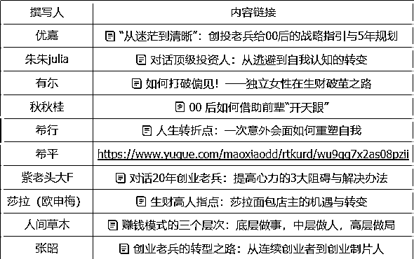
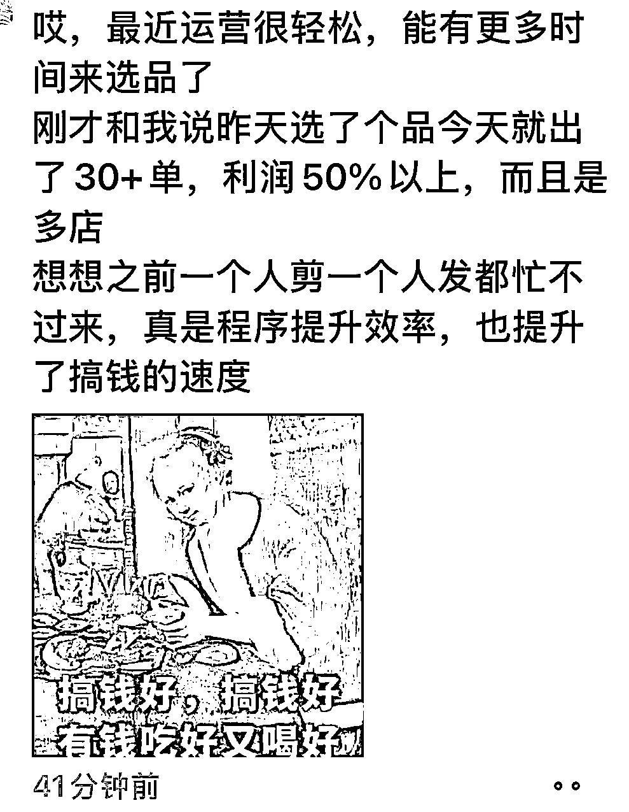
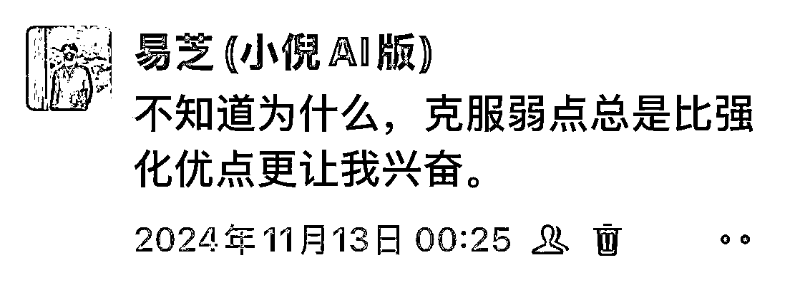
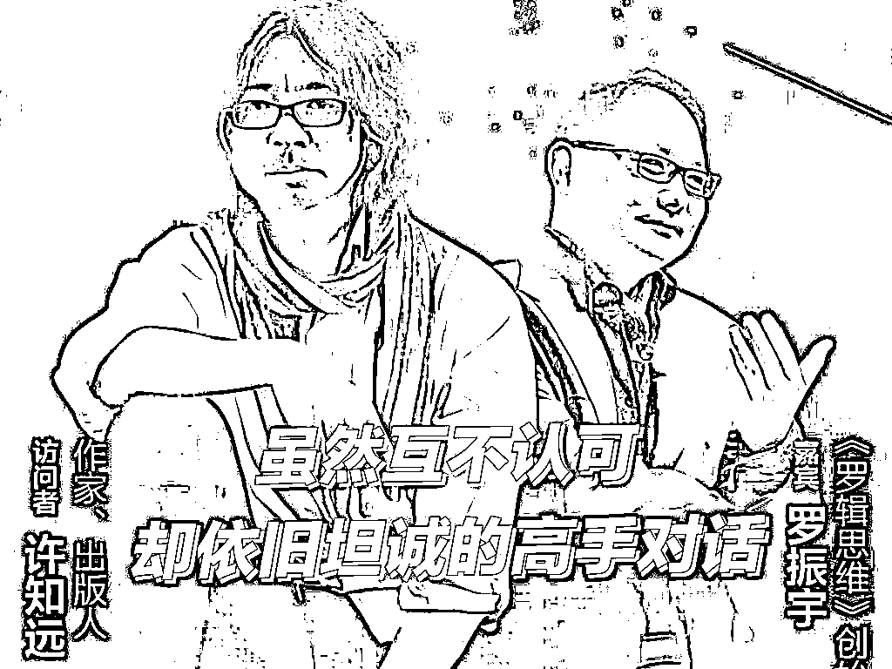
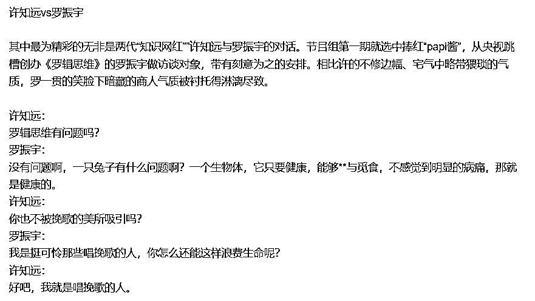

# 张昭老师内容读后感

> 来源：[https://unpke5o6so.feishu.cn/docx/NGKldxCIyoEqNnxaWH0cZV78nqf](https://unpke5o6so.feishu.cn/docx/NGKldxCIyoEqNnxaWH0cZV78nqf)

# 我是谁?

【微信昵称】易芝，99，INFJ一枚，爱好阅读

【所在地区】杭州、嘉兴

【生财标签】

20年就加了亦仁大大和小鱼姐

生材学习委员，25年组个20局

【自我介绍】做过知乎好物和小红书电商，创业第一次亏过钱，换个模式重新来：IP+AI+RPA

【盖洛普】回顾，责任，和谐，思维，学习

【生财文章】https://scys.com/articleDetail/xq_topic/8858448228258842

https://scys.com/articleDetail/xq_topic/8858422411441822

https://scys.com/articleDetail/xq_topic/8858428425122252

感谢张昭老师给予的一次见面的机会，以及实现这次机会，需要先提前撰写一篇《张昭老师内容的读后感》，感觉这个方法特别好，本来只是阅读了张昭老师本人的精华帖与一两位圈友与张昭老师对话的帖子，就去链接了张昭老师，再回头写读后感的时候，再对比一开始想聊的内容，不管是自己的认知，还是对张昭老师的认知，都很浅薄。幸好有这一个读后感的小环节，哪怕不和张昭老师见面，也让我通过写读后感这个环节，实现了对张昭老师的一些思想的输入以及本篇文章输出的诞生。

对于一篇完整的文章，我的本能反应会搜集足够多的信息后，拆解出每篇文章中我能吸收的知识，以及文章中一些优秀的结构，最后自己进行排列组合，使文章最终达到自己认知水平下，具有系统性和结构化思考的一篇文章。

【温馨提示】以下是八千字长文，如果赶时间，可以根据左侧目录，按需查看~

# 一：想来链接张昭老师的原因

梁宁说：“草莽关注的是当下的问题怎么解决，关注技巧和方法论。而大佬们关注的是趋势和周期。小成靠机会和技巧，大成靠趋势和周期。”

我对于创业的层级目前有三层的理解

第一个创业层级，先搞流量，想办法把流量放大来赚更多钱。

第二个创业层级，能搞出一个产品，合格产品存在壁垒，依靠产品本身去获客，去变现，向上吸纳人才与向下兼容求职者

第三创业层级是成为一个大赛道里的头部，赚整个类目的钱，类目上就可以套用这个模型：付费投放+私域+高客单+有复购的生意。

生财说还有机会的三个出路：ai，出海和同城。

目前我规划自己的路径是走：IP+AI+RPA的模式。ai对应的一个能力是写作力，包含自己认知的高度以及结构化思维，认知的高度决定使用ai的上限，最近学完ai，同样的一篇文章，在没有接触ai前我写一篇3000字从整理资料到完成撰稿需要1.5-2小时，现在通过ai写作的帮助，我基本上只需要0.5-1小时就可以了。知乎是我熟悉的框架，但最近帮女朋友写论文，ai给出来的内容明知道不好，还是不知道如何改它，因为不知道论文的语言体系，这个需要时间去适应。所以拥有一个结构化的思维，用ai（搜集素材+设计框架+填充内容）确实让创作更加便捷。

出海对应的是技术力，而技术是一种探索的勇气，包括不限于自己可以独立摸索出安全的账号体系：国内或者国外=干净的账号+设备+网络。

红书电商目前，通过代码写出可以自动剪+自动发软件后，程序提升了个人的工作效率和项目的搞钱效率，现在运营的核心任务就是找平台上热门的品和对标，素材就交给机器人就行。（碳基生物控制硅基生物）

同城对应的表达力，向上面对商家，向下面对用户，需要会左右逢源，在一个小地方服务好这些人，情绪价值拉满。这是ai取代不了的。

聊c或者聊b，背后是对人性的理解，用我们做业务的人来说：跟电脑99%的问题能用关机解决，跟人99%的问题能用话术解决。

张昭老师也提到极度不建议年轻人碰线下，要和一帮老油条打交道，我也是这个思路（当然我认为自己可以近朱者赤近墨者黑--和谐人格），当然如果有的选，我希望自己在30岁前精力还旺盛的5年，还是先把ai这条走到黑，走出一条明路来，30岁之后不想动脑了，脑子也确实转不动了，在和线下这帮人打深入的交道。

基于以上我对创业层级和项目背后需要具备能力的认知，以及自我认知里判断自己现有的牌，我要看到一个满意的产品，它符合【付费投放+私域+高客单+有复购】这个模型，那就是值得我深耕5到10年的事情。如果看不到符合条件的产品之前，我也不会像过去3年一样，光空想，先把IP+AI+RPA猛猛干起来，慢慢想，慢慢碰，等这个产品出现。

这也是我想要链接张昭老师的原因，根据我现有的认知和能力，是否有什么可以打包起来做的产品？以及产品创业的出牌顺序?

写下此篇文章，一方面是提供自己的信息方便张昭老师判断我的价值，如果有一个领路人能帮我们指明一个大方向，也许人生就会不一样；

一方面也在阅读中，看到很多同龄人身上看到自己的问题，2024结束之际，作为自己从前的问题罗列，亦为校正自己未来的开始。

# 二：易芝自己存在的问题

## 问题1：人生过得比较平坦

引自优嘉：

张昭老师：如果一下子想不到人生中最大的困难？

说明你的人生过得还是比较平坦的。

所以，我是觉得你吃的亏还不够多，受到的磨难太少了。

人的本性是，趋利避害、好吃懒做。没有人可以没事跟自虐一样玩自己。如果说没有外界压力的话，我觉得很难有人去很积极主动的去干很多事情。

我人生最大的痛苦可能来源父亲20-40岁的躺平与啃老，让奶奶眼瞅75的人还为了家庭在奔波，母亲也在8岁那年离开家庭，并且爷爷奶奶还有父亲都住在田间，从8岁到10岁的时间都是一个人居住在家，所以自我“阉割”掉悲伤的情绪。

但家庭因此也没有给我过大的压力，所以我也如优嘉一样，没有极大的事情是非过去不可的。现在回过头来反思（回顾才干）：这也是我毕业时红利项目没有拿到不错结果的最大原因。

我的解决方式：

1：从前做的好的方面继续保持，从前没有做的好的地方加倍改正。

2：找个对手

张昭老师:你脑海中这个假想敌和你遇到了同样的困境和麻烦，你的第一反应是我要逃避这个麻烦，你要想一想你的假想敌，他会怎么处理这个问题，他大概率会选择迎难而上，要不他不会是完美的自己。

需要找个比较方，现实的世界这两年也告诉我，需要用结果和现金说话（曾经遭遇过强烈的价值观冲击——是不是人只有变坏才能挣到钱，张昭老师也提到过，认知曾经存在差距，但是相对来说对自身影响应该是接近的）

今年我和朋友立的一个flag，前两年的收入一直低于他，他个人说话也喜欢打趣别人，所以我25年非常不想和他讨论关于项目的事（不在同一赛道），我说25年没大事我不会跟你聊项目，直接就比每个月谁的净利润高，可以调配的钱包数额谁大。文无第一，武无第二。我们站在自己的视角上说的都对，争论不出谁的对错。我也很讨厌你老是打趣的语言风格，那我们就打，项目积累的都差不多，明年看谁的净利润下来高。

## 问题2：对很多事物的敏感度不够。

张昭老师：我觉得你对很多事物的敏感度不够。敏感度不够就意味着你创新力不够。你都没有那么多信息源，你怎么创新呢?

我的另外一个弱点，思维才干和学习才干发挥下，相对快的掌握一个事情后，就把事情交给别人做，后续没有保持足够的实践，所以很多指令并不准确，随后被后面的追上。但是敏感度的能力上我认为不是短处，我的搜商还不错。

我的解决方式：

把重复的事情不管交给人也好，机器人也好，这个事情我认为没错；错在应该一直保持自己的敏感度，而不是交出去就可以双耳不闻了。

## 问题3：多看看自己的优势，将优势放大，而不是一直补自己的短板，补短板，只会让你变得平庸。

引自朱朱：

这个问题确实冲击到了我，因为我自己也发现“克服自己弱点确实很让人兴奋”，但是不符合《孙子兵法》的“以己之长攻敌之短”，我们只是普通人，不是全才，怎么可能通过自己的短处赚到“大量的钱”呢？

当然我发现很多矛盾的事情，都是主客观角度的问题，分开讲就讲得通了。

主观上讲：弥补己身的缺陷，让自己短板提升这是好事，但是确实不能想着短板能赚大钱。

客观上讲：事情本身已经不容易，更何况还要竞争，把自己的天赋发挥到极致是赚钱的最优解。

## 问题4：聚焦精力

引自有尓：

*   要变得优秀、取得成就，就需要将精力聚焦在一个点上

*   能量守恒，可能需要在事业、感情、健康等方面做出选择。

这是因为，当精力聚焦在一份感情上时，这是专一，能经营好感情;当聚焦在一份工作中时，这是专注，可获得出色的成就;当聚焦在一个生意上时，这是聚焦，能谋取更多的利益，能量守恒，如果你获得很好的事业，那可能感情不太好。如果你获得很好的感情，也许赚不到什么钱。如果你什么都好，可能身体不太好。既要又要还要太难了，择其一吧。

我的解决方式:

引用Flipped：

自己要勇于选择最难的选项。

在做选择时，优先选择最难的那个选项。

这个不用怕，当你把最难的这件事做多了后，就慢慢熟悉了起来，然后你就会发现其实没那么难了。这时候你就有些信心了。

慢慢再到最后，你甚至还能把这个难题给攻克了，就像卖油翁练熟了后能把油倒入小孔一样。这个时候，你就会信心爆棚。最难的选项我都能攻克，其他不都是小case吗?

然后再把这个流程过几遍，自信心就能彻底建立起来。就算在人生低谷，你也会自信慢慢:想当年，我可是解决了好几个最难选项，眼前这个算个p，我照样能搞定!

最近《完美世界》中一个片段，结合我近期的状态给我极大的启发：柳神曾点拨石昊，所谓真一就是要专注于一途、行于一道，需体悟生死，明悟自身的妙处。

专注于一途，行于一道:之前说过个人赚钱的核心在于拥有三大能力(表达力，技术力，写作力)中的一个，水平再优秀及以上，存在一定溢价空间，所以日子过的滋润。不过饭饱思淫欲，滋润以后就容易想着开辟其他赛道，多个方向多条路，实际分散精力，最后核心能力提升也没上去。而专注一途则是告诫我们明晰自己的道，需要掌握的法，做到自己能力范围的最好。

体悟生死，明悟自身的妙处。大家都有一个毛病，这个在我身上更加明显:差不多就好。

很多时候确实差不多就好了，比如:60分万岁，但是在自己的道上，90分都不算好，荒天帝石昊为什么能所有天骄最后登临神道绝巅，就是从最小的每一步都在追求超越极限。

而超越自己的极限，虽然眼下痛苦，甚至有危险的代价，无法避免。可是过了依然也有对应的好处。健身的时候我深蹲可以蹲80，然后教练直接给我加了两片上到100，虽然心里有一点怕，但是过去以后，下次单独100也不是问题。

还有初中跑步的时候，为了正式比赛前轻松一些，我都会先跑1个1km，把自己的第一个喘点过了，比赛的时候下一个喘点来点的没那么快。

在突破极限过程中，有天赋的事情越做越强，也有自己花很大精力提升的也没那么多的。明白了自己的天赋和宿命，我们其实能做的不多，专注做好自己擅长的事情，大概率最后不会留有遗憾。

## 问题5：向上链接的策略没做好

*   想要向上链接，先思考自己能提供什么价值，或者成为先付出的一方。

*   如果没有明显的价值，可以尝试提供情绪价值，这总比空手索取要好。

如果想要向上链接，可以先想下自己有什么可以和对方交换的地方，或者能给对方提供的，也可以你是先付出的那个。表达出自己的能力，根据自己的能力能帮到对方什么，降低成本还是攻克技术难题。

你得让对方看到你的价值，看到你的可能性，或者粗俗点，你有被利用的地方。如果这些都没有，也许可以提供情绪价值，虽然有时候情绪价值并不太值钱。

我的解决方式：

有过想认识很多大哥，想去很多地方，想成为一个闪光的焦点。而当我看到“见自我，见天地，见众生”这句话的时候，突然平静了，假定65岁要死，自己还有40年左右的时光，睡觉花三分一，吃饭+生病休息花三分之一，自己剩下的时间🉑真有限啊。所以变得更加冷漠，也变得更加热情，冷漠在于，实名虚名不管哪种，消耗精力的就少去；有智慧的大哥或者乐观而阳光的普通人的局，就多参加，无论是主观分享能量，还是默默吸收能量，都是我所愿。

自己热爱的事情上：以前是隐约的喜欢读书，现在ai用的越多，越发现基础的文字可以交给ai去生成，提高了下限，而自己的思维才能决定内容的上限，而一篇文章往往来源我曾经读过的书，可我很容易就停止输出，很简单，因为我读的书太少了，所以接下去的目标，加紧赚钱的同时，多多读书。

再有了这样的想法后，不如意就让它不如意吧，我只追求自己的心有一个平稳的状态。那我觉得用《了凡四训·立命之学》这句话更好的去知行合一：从前种种，譬如昨日死；从后种种，譬如今日生。

# 三：尊重常识、尊重经营、尊重时间

段永平最核心的一句话：做对的事情和把事情做对。

什么是对的事情？就是不错的事情，那什么是错？知错不改是为错。

## 常识1：顺人性做事，逆人性思考

在阅读过程中，我最认可的第一个常识顺人性做事，逆人性思考，比如现在流行的日更这个事，如果不是航线要求打满，我会给自己每两天而空一天，因为日更是反人性，没有东西也要水一篇，没意义。日更大的意义在于“每日三省吾身”，真的有问题并且做了复盘。所以再空着的一天我不会进行更新，但是我收集有利于接下来两天更新的素材。

## 常识2：保持自己有限的心力

张昭老师：很多人之所以能跑出来，或者是能实现自己伟大的梦想，最重要的原因就是他们可以舍弃掉很多肤浅的那种享受或者享乐主义。

我觉得时代的宽容度提升了，来源目前的经济环境实在太差，大家的戾气都很重。以前有很多人现在说要少说脏话。

另外我觉得认为90是垮掉的一代的80后，也遇到自己的人生危机，所以他们的指责开始消失。

保持passion，现在不开心的就说出来，保有自己少有的心力。

## 经营1：动力是什么？

关于我创业动力的来源，盖洛普中的第一的回顾和第三的思维，过往到如今的岁月里，我的思维也存在着许知远一样的“唱挽歌”的思维，他的坏处是过往的创业里我不够凶横，老是往回头看，我在自由职业者期间绝大多数的时间都在看自己认知内的公众号。

好处则是，许知远提出“每个人都是带着成见看这个世界的，如果你不带着成见，那么你对这个世界根本就没有看待方式。我将带着顽固的偏见与这个时代碰撞，等待这些偏见被打破或者再次印证。”。

好处是我抱着不健全的认知，通过商业的实践获得正反馈后，不断修正自己的过程，而反思的过程也是自我快乐的最大源泉之一，一次次的抽离破碎直到对事物有“肌肉记忆”般的判断。而这两年创业下来，我的思想来到了守住底线下，道德感和慈悲心更少，赚钱至上。

## 时间1：以终为始思考问题

“以终为始”去思考问题，找到足够多资料理解以后，再来做五年计划的时候，发现我们看似有很多的选择，其实我们压根没有选择。

为什么这么说?

因为选择要想符合2个要求，其实就会过滤掉非常多的选择

1、利润目标:完成1000万

赚10万，选择很多。

赚100万，选择也不少。

赚1000万，选择并不多。

2、能力匹配:以你的能力，适合做什么业务?

那么多的项目机会，又有哪些是属于你的机会呢?

张昭前辈:目标有了以后，你要“以终为始“进行拆解。以始为终，我们站在未来五年思考自己想要达成的状态和目标，然后再以终为始拆解到当年，当月，当周，当下，就更明确自己现在该做什么不该做什么，调动所有的资源和精力去执行自己要做的事情。如果没有思考过落地，那目标一定没有实现的可能性。

在这里，很多人会存在2个思维误区

1、以你现在拥有的资源和能力，来构建商业。

2、以现在的角度去看未来的世界。

全都是不对的。要完成目标，从2025年开始。

第一年，可能要花1年时间，摸索业务方向

第2-5年:基本要完成100万、200万、300万、400万的净利润。

有了每个阶段的规划后，你要去思考，你在这个过程中，可能会遇到哪些挑战和难关。

5年项目的制定，我在生材有术中找到公众号爆文的教练张波老师，根据他的内容以及对王阳明“知行合一”的理解，本篇内容还在完善中，目前进度15%

# 四：定方向

## 4.1对赚钱方式的判断

引用莎拉（欧申梅）：

对于普通个体来说，做事的能力是个体立足的基础，有了比较长期的积累沉淀之后，可以通过“做人”-打造个人品牌、提升个人知名度和影响力实现进一步的放大。如果还想要进一步扩张，那就需要通过对人性以及各方利益需求点的洞察，设计一个优秀的商业模式，自己制定规则，并且让更多人参与进来，从“做人“进化为”做局“。

前面有论述过，如果暂时看不到满意值得深耕的产品，我会先把IP+AI+RPA猛猛干起来，慢慢想，慢慢碰，等这个产品出现。

25年，前端IP，公众号的部分我打底更新300篇内容，200篇的短内容（作为日更以及后续串长文章的素材），100篇的长内容，项目时间过程中的技巧和思考（相对深度，3000字左右）。与此同时，还要推进自己的项目和精进ai和rpa的理解，还有表达力的锻炼，不管是线下去做销售，还是开启短视频计划，所以计划赶不上变化，时间安排上相对充实。

而产品还需要等，再过程中，去其他优秀的团队学习，以及更重要的事是查看其他大佬团队的组织架构，人员的流动性，团队氛围以及上升路径，分钱方式。因为项目快速的推动起来后，归根结底还是需要人，项目到最后考验的都是人性，人才是关键。

## 4.2各种赛道的判断

### 第一个：小红书or小绿书

张昭前辈:我们是做小绿书最早的一批。这次生财小绿书航海，5个教练，里面有2个是我投资的。

对于小绿书，我的结论是，绝大部分的人也没有机会。小绿书要做好，因为必须有两方面的能力，一方面是获取流量能力，一方面是选品的能力。

1、获取流量的能力:背后其实是内容能力，需要图文或者视频能力很强。

2、选品的能力:选品可以挂精选联盟，或者挂什么东西都可以，但是到最后也一定是拼自己的供应链，拼供应链的话，又拼线下和货盘的能力，这就很重，不适合00后去玩。

所以，综合来看，你们要做小绿书基本上就是在流量侧上有机会，但是，做流量做到后期，还是要拼供应链。没有供应链，赚钱的效率依然不高。

线下：疗愈赛道，客单价高。但是没00什么事，对人性也没有很深的理解，自己掌控不了，我对00后最多的建议可能就是放掉所有的幻想，去专攻AI，别的东西都不要考虑，你考虑多了也没有意义。

### 第二个：专攻AI。

尝试时间:20-30岁

“现在是95后，00后的战场。他们生在了一个巨大机会的时代，就是ai,也生在了最差的时代没有职位提供给他们。但是有一批优秀的00后，敢想敢干，手里没什么钱的情况下，还能花几千块进入生财。现在的00后才是未来的希望。”

“我告诉朋友们，如果不跟年轻人站在一起未来十年一定会被淘汰。”

你想成为一个什么样的人，围绕着这个信念去极致的改变极致的相信。才有可能突破圈层。而现在科技的浪潮滚滚向前，是没有人能够阻止的，现在 AI的普及应用就是当时的智能手机、互联网

AI 赋能我们的业务，给我们进行提效

历史不会淘汰 Ai，只会淘汰不使用 Ai 的人

这是所有 00 后的最优解，投入AI大趋势去。用 10 年去持续钻研，坚持把它拿下来形成自己的基本盘，如果不行再进入第二阶段

那么普通人该怎么去入局AI呢?

张昭老师将 AI 分为三个方面

1、用 AI 进行提效

2、做软件开发，例如cursor

3、做大模型

普通人入局 AI 最好的方式，是通过 AI 来提效

先投入到应用最成熟的地方成熟度:文字>图片>音频>视频

在 AI写作里，内容框架已经基本成熟了，即使改动也是轻微的一些，是很值得躬身入局的。AI写作的方向个人是倾向在公众号为平台基础的。5年前，我因为个人原因，写作这个事情连及格都没有做到，5年后再看写作这个事情，我知道我应该做它，也是最擅长做它；其次，我能想象5年后的我依然愿意做它，所以从2024年12月28日及以后的日子，我会不停的更新自己的公众号以及锻炼自己的写作力。

### 第三个：利用工具做软件开发

用cursor或者是用coze等等这些工具在做轻量级的开发，开发成一些APP、网站、游戏等等，然后用他们再去赚钱。

要做开发，有两个要求:

第一，对用户场景的理解。能够根据用户的需求开发出一个可能使用体感更好的产品。

目前给自己的目标是用一个时间精通rpa，解决项目实际中的问题与锻炼产品能力。

第二，牵扯到技术层面上，如何实现的问题。

这个不适合创业第一个阶段，适合我们先赚到钱后再说。

## 4.3项目开始

在第一年的时候，在摸索业务的过程中，你要先解决怎么生存的问题。

因为你要进入一个新的行业、领域，可能没有收入，你要解决怎么吃饭的问题。

这时候就有一个创始人的战略定力问题。

即:你为了解决生存问题，会不会舍弃我未来五年的目标?

太多人容易面临现实的情况，我都活不下去了。我考虑那么多干嘛?

我见过太多人了，之前说的信心满满，说我一定要怎么样。结果，路上接受了太多的赚钱的诱惑，中间摇摆离开的。

所以，我建议你:12月份什么都不要干，应该先停下来。(少即是多)

另外在停下来的过程中，我会查看很多资料，包括这次发现和链接张昭老师一样，每当我查阅、思考然后抱着问题去找人的时候，往往都有好运发生，找到一个自己满意的答案。最终想找到一个给自己足够压力的老师，让自己走的方向更符合理性的结果与顺应自我的天赋和人性。

# 五：创业里面常见错误

## 5.1对战略方向的质疑。

引用张昭老师：

黄焖鸡米饭作为餐饮行业，是个勤行，既劳心更劳力，每天需要起早贪黑，十分辛苦；每天进菜、洗菜、加工，全都是机械的重复劳动，并且夏天很热，冬天很冷，坚持下来的人，都是能够吃苦耐劳的人。除此之外，还需要前期较大的投入，再加上2023年整个餐饮行业的竞争异常激烈，从来没有干过餐饮的小白很难有赚钱的机会；

相比之下，公众号爆文项目不需要前期投入，且收益见效很快，并且安七在文字方面有优势，在这方面又有一定的私域积累，可以直接开始进行商业变现，拿到正反馈的速度会很快，非常符合“下行风险很小，上行收益很大”的选择标准。

事后证明我的判断是对的。据相关媒体报道，2023-2024年黄焖鸡米饭这个类目的门店闭店率26.3%。假如安七投资了黄焖鸡米饭，门店形成亏损，加上浪费的时间以及在新业务上可能获取的投资回报，大概率会造成40万左右的损失。这对一个还没有毕业的学生的打击是巨大的。

创业方向的选择是一个战略性问题，一旦选择错误，越努力，失败的结果会越惨痛。

20到23年我已经尝试用自己的小聪明赚钱，但是一如文章开始所说的，小聪明赚的小钱，潮水退出以后真的晾干在沙滩上啦，而且无潮水庇护的太阳直射把自己也照射的非常难受。所以延伸出了一个思考：不会想要自己独立探索超出认识的事物，用踩坑去获得经验。承认自己的无知，怀一颗无分别心，不要对抗，无需证明。（读过一点《金刚经》放下我执）

听劝也是一种能力，可以省不少钱。

有了明确战略方向后，最正确的选择自然就有了：一旦认定一个方向，只要战略正确，就应该全力以赴，不死不休。

## 5.2因不自信导致的执行变形。

创业小白通常会犯一个致命的错误：完美主义作祟。总觉得我的产品不完美，我不敢卖。我要让我的产品经得起考验之后，才敢面向市场。

产品不会有完美的时候，当然对用户的认识和内在的产品优化是不能够停滞。人对未知的事物很难不犯错，但不要让自己少犯错，反而要让自己大量的犯错，只是要控制好自己的犯错成本，不能犯毁灭性的错误，比如让自己身体就不行了，或者把自己的资金全亏没了，或者说就是把自己的人脉搞得很差，对吧?我觉得这个肯定是不行的，本质上觉得这个世界就是在不断的犯错中找到一些解法，所以大大犯错但是控制好成本。

# 六：附录

## 6.1自己认为的一些常识

我最喜欢的电影《教父》：一个人只有一种命运

圈子对了，事才对，引用搞钱学姐陈雪：

要努力的去加入一个比我整体更厉害的圈子我觉得这个是非常非常重要的。因为圈子代表的视野、代表的信息的密度，代表的认知，代表的格局，人其实是很多，很多时候其实是很难靠自己左脚蹬右脚去成长起来的，直到你把自己放到一个环境里面，这个环境会潜意默的会影响你。所以我肯定会让自己尽自己所能，加到一个我觉得平均水平都超过我的圈子。

创业是厮杀，它不允许你感性

热爱抵过专业