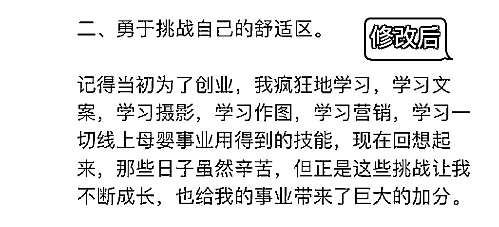

# 《一篇小红书笔记涨粉2万的方法大揭秘》

> 来源：[https://ua19fjzkgx.feishu.cn/docx/Z0JDdlbdaoburmx6JcgcmXZEn8d](https://ua19fjzkgx.feishu.cn/docx/Z0JDdlbdaoburmx6JcgcmXZEn8d)

大家好，我是徐柒七，17w粉自媒体博主，小红书爆款引流教练，百万爆款创作者，靠自媒体28岁独立买房，优秀学员通过小红书引流变现10w+。

今年是我裸辞的第三年，感谢自媒体，感谢小红书让我拥有了全新的人生体验，实现了有房有车不上班的自由人生。

今天想跟大家分享一下一篇笔记涨粉2万的方法。

这是我的一篇爆款笔记，浏览量165万，点赞7万，收藏10万，接下来我就做一个详细的拆解。

先给大家讲一下百万爆款笔记的制作方法论：

一、提升网感，找到对标爆款笔记

二、搜索关键词，验证选题是否为爆款选题

三、像素级拆解，模仿+微创新

四、文案植入钩子，引发用户评论区互动

好，接下来咱们一步步来看。

# 一、提升网感，找到对标爆款选题

那天，我刷小红书发现一个博主做学习网站的选题很好，他有好几篇相似的选题，差不多的封面标题，差不多的文案结构，数据都非常好，有千赞甚至万赞，都是近一年内发布的，我看他差不多隔两个月就会发一篇类似的。

# 二、搜索关键词，验证选题是否为爆款选题

于是我就去搜索了笔记关键词，发现很多博主的笔记数据也很好，有好几个万赞的爆款，还有很多千赞的。

这个数据就说明了这是一个超级爆款选题，如果我们去做，火的概率也会很大。

这里也给大家总结一下超级爆款笔记的三大特点：

1/选题维度：笔记选题非常火爆，已经有大量千赞万赞的爆款笔记验证！

2/拆解维度：封面，关键词，标题，文案框架，非常神似，有利于对标模仿！

3/时间维度：发布时间在一年以内，且时隔一两个月就会有一波新的爆款笔记诞生！

好，确认该选题是爆款选题后，我们就从中挑选3篇数据最好的，且你能模仿的笔记进行拆解。

# 三、像素级拆解，模仿+微创新

接下来咱们就进入到拆解环节了，这也是我们今天课程的重头戏，千万别眨眼。

## 1、拆标题：小红书标题分为封面标题和正文标题

把标题的文字要素提取出来，然后看一下爆款因子是哪几个文字，进行排列组合，写出自己的标题

这三篇笔记就是我当时挑选出来的对标爆款笔记。

来，提取一下文字要素：

如果你失业了

记住这几个网站

你可以不上班

自由职业必备

副业增收

那我写的标题：

封面标题：如果你失业了 记住这4个网站 你可以不用上班

封面副标题：免费 靠谱 好用

正文标题：失业了，不想上班❓❗️一定要记住这4个网站❗️

## 2、拆封面：封面包括文字要素、排版、构图

文字要素咱们上面已经提取好了，接下来就是排版和构图

排版构图：

人物居中

文字上面1行+下面2行

或者是上下文字各两行

副标题在居中靠左或靠右位置

这也是典型的口播视频的封面，这里再给大家拓展几个非常好用的爆款封面排版样式，我和我的学员屡试不爽

那这是我参考爆款笔记做出来的封面

在这里我也给大家总结一下爆款短视频封面制作流程：

01.定好排版模版：可以模仿对标爆款笔记

02.突出重要信息：你想让用户一眼看到什么内容，就突出什么内容

比如我红色字体是：如果你失业了

黄色字体是：你可以不用上班

现在大环境这么不好，被裁员面临失业的人是很多的，那突出这几个字，就很容易戳到用户的情绪，也就是我们常说的痛点。

而不用上班是我们大多数人的追求，对不对，这就相当于给用户描绘了理想蓝图，也就是我们说的痒点。

03.不要过多颜色：封面颜色一般来说不超过3种

04.选择适合的字体：封面字体建议大家用简洁明了的，不要整的特别花里胡哨，吸睛很重要

## 3、拆文案：把视频文案的骨架拆出来，然后模仿写出自己的文案

可以分为三步走：

01.用轻抖小程序、飞书妙记、或者飞书视频会议提取出完整的文案

02.拆出文案的整体框架，也就是开头、中间分论点、结尾

03.把整个文案中的爆款元素提取出来，贴合自己的实际情况写出文案

由于时间关系，我就不给大家一一提取对方的文案了，直接给大家看一下我的文案：

开头：

我裸辞1年，现在只工作不上班，每月稳定月入5位数，今年2月份还买了自己的房子。如果有一天你失业了，请一定要记住这 4 个网站。

大家看一下，在开头我植入了很多爆点，比如裸辞，不上班，月入5位数，买了房，这些都是吸引用户继续往下看我的视频的钩子。

中间：

第一个， oeasy，培训班打死都不会说的宝藏自学网站，里面包含了office三件套、 平面设计、影视后期、动画制作、音频制作等等，各种免费课程，你想要学习一样技能的，这个网站就非常适合你，从入门到精通全部都是免费的，不仅可以在线看，还可以下载到本地看。

第二个， do you do,这是一个超宝藏的自学网站，提供了非常多的视频教程，质量很高，通俗易，而且还是免费的，像主流的PS、PR、 AE 这一些软件都有教程非常的详细，里面的课程素材咱们还可以免费地下载。

第三个，我要自学网，包括了影视动画、电脑办公、程序开发、网页设计等兴趣成长课程，从入门到高级都可以免费的学习。

第四个，国家开放大学中心教育平台，这里有338所知名高校的课程资源，共计50万门特色课程，重点是统统免费。如果你想学技能，做副业、找工作，这个网站你一定不要错过。这里面的课程涵盖了生活、兴趣、职场技能等多个板块，除了基础的办公软件、语言、电商等，还有非常热门的新媒体文案、短视频剪辑、编程等，学完就可以像我一样直接上岗，真的是非常实用，自己收藏起来。

中间的文案就是对于网站功能的一些介绍，在最后，大家看一下，我写了这样一句话：学完就可以像我一样直接上岗。

这里其实也是我植入的一个钩子，引发用户的好奇，肯定会有很多人问，我是学啥，做啥。

一旦用户给我的笔记评论了，引发互动，就会使我的笔记更快推入下一个流量池，数据也会蹭蹭往上涨。

而我也可以在评论区进行引流，从而实现变现。

这里也给大家总结一下爆款文案的写法：

01.搭建框架，善用金字塔模型，使文案结构更清晰。

金字塔模型就是总论点——分论点——结尾这样的写法，有点类似于咱们小时候学作文的总分总结构。

大家看一下图，会更直观

02.开头植入爆点

我们常说短视频文案开头定生死，所以一定要把你的高光时刻，放在文案最前面，这样才能吸引用户往下看。

这里也提醒一下大家，很多小伙伴会在开头说，嗨，我是某某某，类似于这样的话，新手我是非常不建议这样写的，因为对于用户来说，他们不关心你是谁，只关心你能为她提供什么价值。

03.钩子植入文案全过程

比如你有产品，有课程的就很适合在文案里做软植入，像我一个做母婴团购的学员，我给她改的一篇文案，就让她成交了一单4888的高客单，用户直接通过爆款笔记加的她，没聊几句就成交了，这就是爆款文案的魅力。

我给大家看一下这个文案例子哈，这是她写的文案：

大家看完感觉怎么样，其实整体还可以对不，文章的框架也很清晰。

她的笔记呈现方式是图文，所以前面铺垫长一点是无碍的。

但像她自己是有产品的，这样写就还不够，我们要在文案里植入自己的故事，且是和产品相关的经历故事。

我们具体来拆一下：

开头第一段，写了自己曾经的困境，用一句座右铭衔接，表示自己没有被困难打倒，这个没有问题，不要太啰嗦，意思表达到位就OK了，所以可以把最后一句话删掉。

接着就可以切入自己线上母婴和自媒体的事业了，告诉用户，你是干啥的。

然后读书的部分可以弱化，一笔带过就可以了。因为写读书的目的其实就是为了表达在迷茫的时候看书，从中寻找力量，从负债中走出来。

接着衔接自己创业成功的例子，可以写的具体一点，让人家清晰地知道你取得了什么成就，用了多长时间。

给大家看一下修改后的文案：

来，再看中间板块：

第一个分论点，模仿身边的成功者，这里写的非常笼统，也就是有一点假大空给你，这样的文案可替代性很强，谁写都一样。

那我们就需要结合自己的实际情况，把模仿学习的对象具体化，那既然是为了吸引跟自己学做线上母婴的用户，你举的例子，肯定要举当初入行吸引你的人。

什么吸引打动了你，你就用什么去吸引打动别人。

来，看一下这个是修改后的：

第二个分论点：量化目标

这个地方和前面的问题是一样的，就是不够具体，不够有自我属性。

所以需要结合自己的实际情况，用例子进行说明怎样量化目标。

来，看一下这个是修改后的：

这里提到了学写作，但因为她的产品不是写作课，如果只写学写作，很容易把方向带偏，导致一堆人来问怎么跟她学写作，这和上面的弱化读书是一样的道理。

所以写作也只能作为创业路上学习的其中一项技能，那事实也确实如此，你想在线上把母婴事业做好，还要吸引私教来跟你学习，那光学文案肯定是不够的，还要学拍照，学习修图，学习短视频平台获客，学习营销成交等等。

这是修改后的文案，大家看一下：

然后后面的内容也是一样的，我给大家看一下修改前后对比图。

你们可以看到，修改后的部分，删掉了两个分论点，因为像图文笔记，正文里，加上标点符号一共只能写1000字，所以需要控制一下文案篇幅。

而且现在的用户普遍都很浮躁的，沉不下心来看长篇大论，所以一般三四个分论点足够了。

前面两个写的具体，后面就可以简写，整体布局要详略得当。

再给大家强调一下，我们写文案的时候不要只写在知乎、AI上面随便就能搜到的东西。

这样就变成了假大空的大道理，没有人喜欢听大道理，但所有人都喜欢听故事。

所以我们拆出来的分论点，只能当作一个骨架，我们是需要往里面填东西的。

填什么，填你的经历，你的故事，你曾经的晦涩时光，你创业时候的一腔孤勇，面对压力时候的辗转难眠。

因为这些经历故事才是你独一无二的地方，也是你和其他人区分开来的地方。

现在这个时代不缺好的产品，好的课程，所以你要给用户一个她为什么偏偏跟你买的理由。

那大部分用户在买东西的时候她买的不仅仅是你的产品，你的课程，更多时候买的是情绪，买的是人心。

所以我们需要在每一篇文案中都把自己的经历故事，产品柔软的植入进去。

这样，用户每刷到一次你的笔记，心里就被种下了一颗心锚。

只要她有需求，只要你能解决她的问题，你们如果同频了，她被你身上的某个特质打动了，她迟早会来链接你。

这就是爆款文案拆解及撰写的流程。

# 四、文案植入钩子，引发用户评论区互动

通常来说，经过这样的文案植入，评论区肯定一堆人说要找你学习的，那你的意向用户是不是就来了，只要利用好评论区，进行合理的引流就可以了。

这是我和我团队小伙伴笔记的部分评论区大家看一下。

那以上呢，就是我爆款视频创作的全流程了，这套方法是我和我团队小伙伴们反复验证过的，这些是我们做出的部分爆款笔记截图。

相信大家实操起来，也会收获自己的爆款。

以上就是我的分享，希望可以帮到大家，谢谢大家耐心看完。