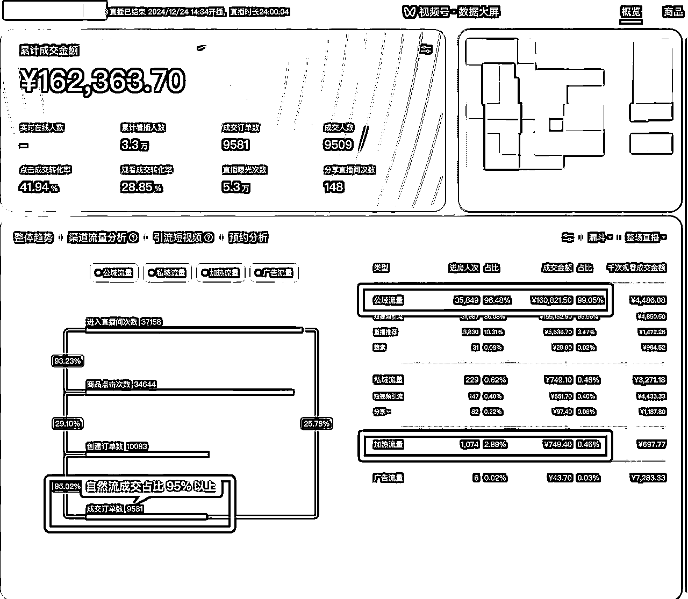

# 【麦洛实操分享】视频号微信豆微付费 → 撬动自然流

> 来源：[https://gdvgrp25bx.feishu.cn/docx/Npzqde1ZnopS0OxJbEQcakk3n9c](https://gdvgrp25bx.feishu.cn/docx/Npzqde1ZnopS0OxJbEQcakk3n9c)

大家好，我是做视频号带货的麦洛。近半年的时间没有系统性的对外分享过视频号相关内容，都在忙着自营盘的业务和培训。接近年底加上视频号上面出现了一些新的机会，借这个时间来跟大家分享一下我的看法

先帮大家回顾一下，视频号这几年存在过的普通人可以参与的机会：

视频号搬运带货 → 视频号无人直播 → 视频号店群矩阵 → 视频号混剪挂车 → 视频号口播自然流 → 视频号自然流垂类 IP 账号 → 视频号微信豆微付费

在视频号有过带货经历的朋友，应该是经过其中某几个阶段的。被平台折腾过几次后，大家应该会发现这样一个规律，在视频号上面普通人能参与的项目，慢慢的从搬运转向了原创，从自然流（免费流量）转向了付费投放。背后的原因是视频号平台本身的发展，从荒芜野蛮在逐渐的走向正规化。一个正常健康的平台，到最后只会欢迎三种人：做原创的人，做付费的人，做原创加付费的人

大家先思考一个问题，为什么每次看似视频号有红利，而我们躬身入局后发现都没赶上，或者最后一算账是亏损的？一个新项目出现，我们花一个月时间研究跑通闭环，花一个月时间盈利，项目滑坡后再花一个月想办法挽救，周而复始，员工被折腾的够呛，公司也没有赚到钱

因为，我们始终在做的事情是追逐玩法，平台一个规则的改变，就能把你研究一个月的玩法打的稀碎，你如何去抗衡？

你可能会反驳说，某某团队大佬也在追逐玩法呀，凭什么他们能盈利？麦洛你这是何不食肉糜，站着说话不腰疼

我告诉你们真正的答案：新手和规模化的团队是完全不同的阶段和配置

*   他们有能持续盈利的基本盘，你有吗？

*   他们迅速的进入一个项目，可以短时间跑通，你可以吗？

*   他们一个项目跑通后，可以调基本盘的员工迅速加入放大，你可以吗？

*   他们一个项目没有盈利后，可以迅速撤退，员工继续做基本盘，你可以吗？

我真正想要告诉大家的不是不要做了，不要追逐玩法了，想要业务更健康，需要想办法组建一个有基本盘的团队。在业务中训练/获得一部分稀缺能力，加上一点时间和机会，自然而然就生长出来了。这也是为啥写这篇文章的初衷，因为我们认为本文介绍的项目【视频号短引微付费】能带来素材制作能力的提升，和快速的拿到利润。有钱才能做更多的事情，才能有更密集的创业体验，千万不要抵抗赚钱，也不要用「长期价值」这样的逻辑来当做借口。在初期阶段，往往我们高估了长期价值的价值，脚踏实地，先赚钱，先磨自己的能力

最后啰嗦一句，千万别认为我是危言耸听。微付费短引项目会把太多的玩家赶下牌桌，视频号后面的游戏要想再次参与，一定是要有素材制作能力，有付费推广能力。跑通项目闭环，迈过台阶，会越来越好。而只会搬运混剪的朋友们，请一定注意这一次的机会，否则后面留给大家的空间会越来越小

让我们正式开始学习

免责声明

1.  没跑完任何项目闭环的朋友，尽量不要参与该项目

1.  有视频号带货经验，但无付费投放的朋友，降低预期，多给一些试错成本和时间

1.  正在做该项目的朋友，本文的价值在于帮忙缩短试错时间和成本，请每日复盘，总结失败成功经验

1.  跑通闭环前期每场直播的试错成本在 2k 左右，请没有足够资金的朋友，想要通过该项目翻身暴富的朋友尽快远离，项目有再大的利润空间都不适合你

# 视频号微付费短引项目介绍

大家一定在视频号广场见过这样的账号：

1.  视频号主页发布 3+ 条带货视频（不挂购物车。视频类型众多，比如硬广、口播、科普、剧情、评测等等）

1.  正在开启直播，直播场观几千至几万，直播间场景简陋，非专业主播

1.  直播间商品客单价低，在 9.9 元左右，销量几千至上万单

如下图示例：

这就是本文要为大家介绍的微付费短引项目，核心逻辑为：为优质的带货素材进行广告投放，带动自然流从短视频进入直播间，直播间的低客单商品被密集成交，反哺继续刺激短视频自然流

大家可以先观察下，我们最近一场直播的加热流量和自然流量的占比。一场成功起号的直播间，免费的短视频引流流量占比 95% 以上，付费投放占比 5% 左右。因为我们通过轻微付费，能撬动较大的 GMV ，所以被称作为【微付费】，因为自然流量大多来自于短视频进直播间，所以项目全称为【微付费短引】

付费投放的目的，是为了撬动短引自然流，盈利大头来自于免费的短引自然流，所以能不能撬动自然流，也成为判断一场直播能否盈利的关键节点

上面先简单让大家对项目有个概览，知道是怎么玩的，接下来再跟大家汇报一下我们的情况，也算是泼泼冷水，提前劝退

9 月底 10 月初的时候正式进入该项目，第一天广告投放话费 500 元，直播销售额 12w+，大概 5w 左右的毛利润。这样的数据让我们放松了警惕，甚至感叹「我们从来没有遇到这样简单的项目」。带着傲慢入场，我们折腾了几天之后，接连亏损，运营白天黑夜的颠倒被折磨的够呛，磨掉了我们所有的偏见后，这件事情才算重新开始

最后花了 1 个多月的时间试错，消耗掉一百多个账号，亏损 20w+ 后才总结出来一些方法论。所以呀，各位没有入场或者正在尝试的朋友，不要羡慕视频号广场上每天都在爆单的账号，后面所付出的时间和精力成本是巨大的。在 11.27 日我开启了一场直播，跟大家分享短引的全套方法论，并从 100 多人中筛选了 10 个团队跟我一起测试。又经过 20 多天的折腾，我们才确定我们的方法论可以复制到别的团队，并更深刻的感受到新手会如何变着花的犯错误😂

先跟大家汇报几个我们目前的关键数据，作为参考：

*   直播出自然流的概率 60%（跑通闭环，操作不失误的情况下 10 场直播能起来 6 场直播）

*   一场直播能投出自然流，投放成本在 1200 元左右

*   一场直播大概投放 2-3 小时后，能出自然流

*   综合计算毛利润在 GMV 的 20%-25% 左右（毛利并非单场佣金，需要扣除投放账号等成本支出，但 25% 算是很暴利的项目，通常电商毛利 10%）

是不是看到这里蠢蠢欲动开始算账了？一天卖 10w，每天毛利润 2.5w，一个月下来就是 75w，一年下来高低得弄一辆宾利开开 …

各位先醒醒，别动不动就是一年几百万的利润，算账不是简单的加减乘除，要考虑稳定性、风险和做到这样规模的人员场地等未知开支。大家降低期待，像我开头所讲一样，先积累能力，再有一点利润能覆盖 3 人小团队半年场地人员开支能去探索试错新项目，就非常成功了

为什么项目看起来赚钱，但还是有人说自己亏损呢？

*   因为我们忽略了项目探索过程中的试错成本，一场直播的投放+账号+粉丝+代播+鱼塘的成本接近 2k+ （激进的做法成本会更高），5 场直播没有成功就会花费近 1w+

*   一场成功的直播可能就能赚回来 1w+，但多久能成功一场呢？我直播连麦遇见过打了 40 场也没成功的朋友，也遇见过 2-3 场就能拿到结果的人

*   成功一场后，能持续成功吗？所有操作没有章法，纯凭运气的选手，可能在项目放大的时候，把利润全部亏出去

所以大家要在我的文章和你们的实操里面，找到这几样东西

*   如何降低试错成本，加速跑通闭环

*   如何提高成功率

*   如何建立属于自己的方法论，稳定操作节奏和项目利润率

所谓纸上得来终觉浅，绝知此事要躬行，接下来我们进入实操部分

# 项目实操

## 2.1 账号准备

我们需要准备全新的视频号来参与该项目，请尽量不要使用老账号，否则可能因为账号问题带来直播无自然流进入，造成广告投放亏损

一个人只能实名 2 个视频号，1 个视频号的生命周期大概是 1-2 场直播，所以如果需要持续的做这个项目，不可避免的需要找到号商，批量采购账号。账号采购的时候有一些注意点：

*   最好登录到自己的手机上面，不要使用网页版登录

*   账号先采购 3 天，如果需要更多时间，再续费

*   账号拿到手之后，检查是否全新账号，如果有发过视频或开过直播卖货，请联系号商更换

*   检查私信，确保账号没有违规产生，可以在「创作者中心 - 账号诊断」页面检查账号健康度，确保「短视频」、「直播」两项均为健康（我们在直播的过程中，也需要及时观察这两个页面，如果违规，就及时申诉）

*   点击视频号内的直播按钮，查看直播是否需要人脸验证。如果能直接进入直播页面，则不需要，如果弹出提示验证人脸，需要找到号商帮忙解决

*   直播带货在电脑端开播，需要 200 粉丝，这个可以找专业团队帮忙 s 一下

我们需要提前建立一个表格，统计所有账号信息，方便我们查找使用，给大家一个案例参考

## 2.2 选品

选品是我们没法办法严格标准化的一个步骤，也是从这一步开始，大家的操作开始出现差异，能力强的团队就能体现出来优势。通常情况下，如果一场直播没有打起来我们会怀疑选品、素材、主播、投放、时间等各个没办法标准化的环节，新手通常只知道自己有问题，但又不知道问题在哪里，能给大家的建议是多观察广场上面的爆品、爆款素材，思考选品 → 素材 → 需求 → 人群之间的关系

我们有两个选品的方式：

*   跟品：视频号有爆款商品，我们及时跟进。在素材上面做出一些差异化，也能吃到一些流量

*   开品：通过第三方平台，结合数据、平台人群和我们自己的经验，选出一些我们看好的商品，去制作素材试错

跟品

只要场观超过 1w+，直播间转化率高于 20% 的都可以被称作爆品。如果想要跟品，一个前提是先发现视频号平台的爆品。提供给大家一个小的技巧，快速刷到大量的爆品短引视频

1.  我们先在广场找到一条短引视频（如何判断是否短引，可以短视频素材是否导流进入了直播间成交）

1.  把这一条短视频转发给自己的小号对话框

1.  在对话框里面点击进入该视频

1.  浏览完该视频，并且上滑进入下一条视频

1.  按照上面的步骤操作，就能发现大量的爆款短引视频

这些商品的需求已经被视频号平台的用户验证，素材也通过数据证明能产生大量的流量。跟品的情况下，不需要思考太多商品、素材、需求之间的关系，能快速跟进，是拿到结果的最重要因素

所以我们使用数字人，或者自己作为口播拍摄者，翻拍找到的爆款短视频，就可以短时间完成跟品

开品

如果你经常刷视频号的短视频，你可以发现一个现象 -- 大部分的爆品、爆款素材均来自于抖音平台。抖音平台作为爆款商品晴雨表，在抖音爆过的商品，只要不是太小众和年轻化，一定会再一次在视频号爆发。如果是 1-2 年前，这个爆发的时间差可能有几周之久，但随着视频号的发展，中间的时间差缩小的越来越短

今天在抖音爆发的商品，可能间隔 2-3 天就会在视频号爆发一次。所以只要我们使用第三方工具，寻找不同类目下的爆品，不论是搬运还是自己拍摄一部分原创视频，一定会在视频号再次爆发一次

上面是我随手在 2024 年 12 月 31 的截图，大家可以在视频号搜索这些商品名称，去验证我的这个逻辑是否正确

PS：视频号的人群和算法在 2024 年已经有非常大的进步

按照我们固有的认知，视频号是 30+ 年龄以上中老年人的聚集地，需要卖符合他们需求的产品

但这一段时间的经验，让我的这个观点彻底被推翻。在视频号不仅时尚小玩具可以卖爆，一些年轻化的发饰化妆品也能拿到不错的销量。视频号的算法也变得异常精准，可以在短时内为你推送大量的精准人群

我们使用的第三方平台是考古加，大家根据类目选品时记住一个要求，就不会出太大的问题：选出视频号竞争低，有爆单趋势的商品

先不给大家演示具体的第三方平台操作，大家可以根据自己的经验和理解去摸索。这里放一个我们 SOP 里面的选品操作思路，给大家一些启发

## 2.3 素材制作

素材是整个项目特别重要的一个环节，如果整个项目没有做起来，请在素材这部分找一下原因

目前在视频号短引这个项目里面，我们把素材大致分为：硬广、口播、剧情、科普、解说等类型。我们根据几百场直播的经验来看，每一种类型的素材都有他的优劣势。比如硬广比较难做出来短引自然流，但是如果做出来了单场直播的 GMV 就可能会很高；口播比较容易做出来短引自然流，也很容易突破 10w 播放量，但观看成交率低于硬广，同样的场观情况下，GMV 会偏低

建议各位在做项目的朋友，如果始终做不出来结果，可以尝试更换素材风格，口播和科普解说类型的素材上手都比较容易。如果有之前做口播自然流很厉害的朋友，可以联系我们，团队可以帮忙分发素材给学员

不论是什么类型的素材，我们都需要前置性的去判断：这个品是否值得我们去做、这个素材是否优秀、爆的概率是多少，等等。我们一般从以下三个方面入手去判断：

1.  脚本：视频的文案内容。吸引用户 → 给出解决方案 → 给出购买理由 → 打消用户疑虑

1.  画面：视频的画面镜头。产品外观 → 解决方案 → 解决合理性 → 用户会根据上面的脚本提问题，画面要直接给用户展示问题的答案

1.  商品：视频售卖的产品。什么样的内容，在什么时间点，击中什么样的人群，怎么卖出去

这 3 个方面做到优秀，就会产生一个结果：用户看完你的视频，立马产生要购买的冲动

我们在素材的制作过程中围绕一个逻辑，就不会做的很差：什么样的脚本、画面、商品组合后期更容易获得自然流的推荐

本应该在这里给大家展示一些爆款视频，但思来想去视频号的微付费里面就没有不能爆的类型，如果你做过 1-2 个月的微付费，你一定会同意我的说法。关于素材这部分，更难的点在于如何系统系的做素材管理、剪辑标准化、登录手机管理、内容分发、爆款复用…这些东西不做到一定的程度，根本不会有感知。所以大家先尽管去试错，建立自己的体感

在确定素材后，我们还有一道工序，如何制作剪辑素材，让视频更容易通过加热审核。其实，能被我们看到的素材，大多数都是爆款，所以在脚本内容上面，不用做过大的改动。我们把视频下载下来后，放在剪映，通过添加水印、更换一些画面等操作，就可以加大我们过审的概率

这里不教学剪映的具体操作流程，给大家放一张剪映的工程图片，应该可以一眼明了的看出来如何在原视频上面做修改

同一个视频，我们会用剪辑手法去重并输出 5-10 条，后续发布到视频号上加热测试是否通过审核

## 2.5 添加商品橱窗

联系视频号的一些团长或者供应链，让他们帮忙上品，通常我们的商品价格在 9.9 元左右，佣金 40-50% 不等。联系供应链上品之后，他会给我们一个商品链接，我们在视频号助手页面 https://channels.weixin.qq.com/login.html ，添加到商品橱窗

开播之前，在「直播 - 直播商品管理」页面添加到直播间，否则没办法开启购物直播

## 2.6 测试过审

一切准备就绪之后，我们在视频号助手后台 https://channels.weixin.qq.com/login.html 发布视频。发布视频我们目前有 4 种不同的方法，都是日常乱琢磨出来的奇技淫巧，新手在这一步先不要弄的特别复杂，直接发布我们剪辑好的 5-10 条素材即可，中间不用点击原创也不用间隔时间

视频发布大概 20 分钟后就会突破 0 的播放量，如果这时候有提示视频违规，大概率是视频剪辑去重的时候没有处理干净，把提示违规的视频删除就好。后续有时间，我会放出一个视频版本的剪辑教程，给视频混剪去重确实是一个比较麻烦的事情，或者各位在小红书也能找到可以参考的方法

紧接着我们就去测试过审，只要视频通过审核，我们就能去找代播正式开播。投放过审没有什么技巧，有一些小的注意点：

*   自己用手机开播，对着自己正脸，不用讲产品话术，但一定要说话。没有人会看你的，不用不好意思

*   投放计划的时候，一定要投放【短视频 - 直播间】的深层计划，不要投浅层计划，否则起不到测试过审的效果。比如投放短视频的播放点赞，即便过审了，可能直播的时候还是被拒审

在视频号加热平台，按照如下的方式创建计划：https://channels.weixin.qq.com/login.html?from=promote

一般我们开播后进行投放，计划建立 5 分钟后就能看到审核结果。上方图二为通过状态，恭喜你，可以下播进入到下一个阶段。如果短视频没有通过，查看一下未通过原因，根据提示进行修改，然后再次重复该步骤

## 2.7 寻找代播

用户通过短视频进入直播间购物，短视频已经为他们进行了种草，直播间只是一个提供用户下单的收银台。所以视频号短引我们只需要找代播帮助我们就好，不需要自己耗费人力精力搭建直播间。除非你是长期直播间或者高客单的直播间，自己使用专业的主播可以提高转化率，普通的低客单直播间没有太大的必要性

代播的价格在 40 元/小时左右，视频号里面最厉害的代播团队是【六月代播团队】，大家有代播需要可以直接找他们。跟代播合作的流程，大家心里有个印象即可，代播团队会给你们一个更详细的流程

*   在代播群内发送需要直播的商品图片或名称

*   代播会帮助你找到合适的主播，在群内让主播关注你的视频号，并给他绑定视频号运营者

*   视频号助手后台，为直播添加商品，就可以正式开播了

代播上播之后，观察直播间几分钟，场景、主播、样品没有大的问题就可以进入付费投放环节

## 2.8 微信豆投放

微信豆的投放，是整个项目最重要的一个环节，掌握不好投放的策略和体感，成为大家亏钱的主要原因。比如我们前期在试错的时候，每听到一个投放策略，就会花 2-3 场投放去验证是否可行，测试成本 5-6k 以上，测试很多个策略，偶尔成功一两次才能找到感觉，继而慢慢的优化每一个步骤

我在直播的时候跟许多朋友分析过我们的投放策略，后续有人连麦找我报喜，说打了几十场没有成功过，听了我的建议，很快就起来了。当然，也有一部分人私聊我，为什么按照你的投放策略，还是没有成功呢？你看，这里面就有一个叫做投放体感的东西，一样的投放策略，有经验的人知道一笔投放计划投放进入后，正常预期的消耗情况和大屏曲线应该是什么样的走向，而只会点击按钮创建计划，不会观察数据，不会每天复盘的朋友，最终的结果都不会太好。我们前期需要一些时间，去试错，去下场投放建立自己的体感

我先为各位简单介绍一下投放使用的工具，以及投放的一些选项的具体含义

我们使用的是第三方的投放平台：海豚智投（免费试用），相比于官方的投放平台操作更方便，能看到更多投放数据，有助于我们更及时的判断投放趋势

加热方式

放量加热：无出价要求，在预算内完成更多的目标

控成本出价：有出价要求，在出价内完成目标

出价方式

固定出价：字面意思，就是我们的计划出价

优先提升目标

直播间商品点击：浅层计划。计划目标为点击商品，不对用户成交做出保证

直播间成交：深层计划。计划目标为下单成交，比如出价 1000 微信豆成交一单，计划会在该出价内尽量寻找目标买家达成目标

成交 ROI：深层计划。计划目标为下单成交，但计算方式与成交目标不同，比如出价 5 ROI，计划会在 100 元的预算内寻找买家成交 500 元

加热素材

直播间：投放直播间，考验人货场，短引项目几乎不会投放该选项

短视频：投放短视频，对直播间要求不高，我们只投放短视频

在理解了每一个选项背后的含义后，再跟各位说一下短引投放的底层逻辑，方便大家更深刻的理解我们到底要做什么事情

通过加热短视频的方式，让视频的流速稳定到100-500之间，通过加热进入到直播间的用户达到每5分钟达到10 个以上，直播间在线有真实用户5个以上，上一波鱼，通过短视频进入，他们会在直播间做成交，点赞，引导评论等动作，羊群效应下让真实用户下单，让系统推送更多类似标签的用户进来，从而拉爆直播间

短引微付费的底层逻辑主要涉及到如何通过精心设计的流量和付费策略来提升直播间的互动性和成交率。以下是几个关键点：

1.  峰值进入人群：当直播间的进线人数突然增多，达到峰值时，这是引入流量的最佳时机。此时引入的人群中，有很大概率会跟随购买，从而提升直播间的热度和转化率

1.  羊群效应：尤其是大爷大妈群体，他们往往喜欢跟风。通过引导这部分人群下单，可以形成良好的下单氛围，系统也会根据这些下单人群的标签推荐更多类似的人群

1.  数据清洗：核心在于将引入的流量数据进行清洗，区分出哪些是愿意下单的顾客，这样系统可以更精准地推送相关流量，提高成交的概率

1.  放量策略：在流量层级突破后，采用放量计划结合直播时长来尝试触发短引效果。如果已经出现稳定的短引，可以暂停新的付费计划，利用现有的数据自然运行

1.  止损策略：在烧钱提高自然流的过程中，重要的是判断何时应该停止投入。大多数情况下，不到账号违规或结算出现问题，很难准确判断何时需要止损

整个投放过程中，数据瞬息万变，我们需要根据具体情况迅速做出对应的调整

在我们的投放策略中，部分比较激进不太适合新手，部分比较考验运营的投放经验，综合下来，给大家推荐一套比较通用的投放策略，大家作为一个参考，请根据项目情况，和时间推移做出更新迭代

第 1 步策略：先投放 3 条过审视频，根据数据指标，筛选出 1 条数据最好的视频继续投放

1 条商点计划，出价 30-50

2 条 ROI 计划，出价 0.3-0.5

1 条成交计划，出价 260+

1 条放量计划，预算 200，时长 2 小时

第 2 步策略：投放被筛选出来的 1 条视频

3 条 ROI 计划：出价 0.3-0.5

1 条放量计划托底：预算 200，时长 2 小时

在 1-2 步计划达到波峰时，要用 10-20 条鱼进行转化

如果计划不消耗，或者计划跑飞，要及时的做出补计划，或者调整策略

上面是计划的大概逻辑，可能市面的不同投放策略，都可以做出结果来，但底层逻辑和达到的目的都是一致的

整个项目里面最难的从来都不是「你做的哪个品，用的哪个素材，是怎么投放建计划的」，而是如何快速试错，快速拿到正反馈，然后从无数一线实战中判断趋势，在趋势中进行演变，找到属于自己独一无二的机会

# 写在最后

太多朋友见证过我的成长，从 20 年的淘宝、知乎好物，到现在的视频号短带、短引、ADQ、自然流、付费投放，我们团队在每一个业务里面都拿到了非常不错的成绩。可能一些朋友点开跟我的聊天记录，3 个月前还在跟他请教某某项目情况如何，3 个月后我们就能在行业里面成为头部

有时候，我也在思考是为什么，抛开团队努力和幸运女神眷顾，或许是我打内心相信：大部分人无法成功，是因为不敢赢，害怕输。好多事情临门一脚，内心的害怕让我们退后一步，用无数的「可是」「万一」去安慰自己，选择迈出那一步的朋友最后轻松的拿到了胜利。勇敢的人先享受世界，是的，享受我们从未见过的新世界

一位前辈曾对我说：麦洛相信我，赚钱非常简单，把一件事情做到极致，机会自然而然就生长出来了。这句话在我每次要做决策的时候都会响起在耳边，这个项目里面最重要的事情是什么？我做到极致了吗？机会会是什么？他展现出来了吗？同样的一句话，同样的思考，这里送给各位

回到短引项目本身，我能看到非常多的机会在里面生长。大家要加油，争取快一点跑通闭环，在里面找到属于自己的机会

其实 2024 年大多数时候都被一句朴素的话鼓励着，文章的末尾也送给各位：一定可以的