# 取代房子，我们的下一个人生杠杆是 AI

> 来源：[https://aiawaken.feishu.cn/docx/JyaedrTWvoRCp3xTskJcpNQhnhh](https://aiawaken.feishu.cn/docx/JyaedrTWvoRCp3xTskJcpNQhnhh)

本系列分两篇：

上篇：讲现象：取代房子，我们的下一个人生杠杆是 AI

下篇：说实操：普通人 AI 搞钱最落地的六大方向

任正非：

“这个时代一定会降低对人力的需求，但是创造的总财富增加了，

可以养活被裁掉的人。被裁掉的人不干活，少拿点钱；干活的人多拿钱。”

以上，是任老在 ICPC 的讲话，我文章末尾拆解。

我记得，我第一个百万是在工作第六年。

但是，AI 创业半年，我已经接近半百万。

具体组成：

AI 做内容，公域有流量，流量变现 ：公众号流量主，15W

AI 做课程，私域有产品，产品变现：训练营 6W+付费群 3W

AI 做咨询，B 端有资源，交付变现 ：1000-1500 每小时咨询，加企业交付，4W

AI 做创作，作品众所周知，IP 多种类型变现：14W

AI 做产品，产品卖铲子，C 端产品变现：AI 产品 7W+

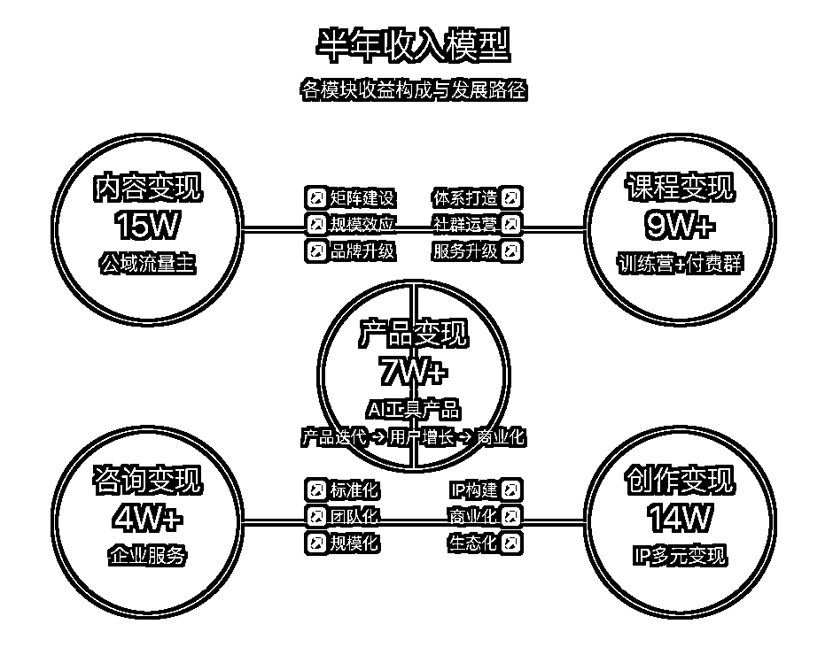

走向人工智能的潮流是不可阻挡的。

我是普通人，这半年，我真感受到：

* * *

## 普通人取代房子的人生杠杆

过去 30 年，我们哪些人享受到时代的红利？

70 后抓住了下海经商的浪潮

80 后赶上了企业，金融的现代化的腾飞

85 后搭上了互联网创业的快车

还有过去 30 年，买到房子的那些人。

但最温柔的红利

或许是买到了房子的普通人

不需要格外聪明

不需要过人胆识

也不必处在核心圈层

你不用是精英

买到即是赢到

问问自己 此刻普通的我们 看得到红利吗？

你是不是经常刷到《很严重，劝大家极限存钱》

这样的毒鸡汤？

是啊，毒鸡汤虽然没有营养，但它让我们的情绪共鸣。

因为你的体感和收益告诉你，越来越难了。

但，就像当时房子一样，

每个人都在寻找属于自己的破局和解法

却常常忽略了 ，最简单的选择 往往就藏在身边

做猎头时，我明白了一个道理，

钱往哪里走，人才就往哪里流。

控制钱的那只手，

它在引导新时代的到来。

现在，我说这个藏在身边是 AI

* * *

# 生产力=收入

## 生产力=收入

经济学告诉我们，一个人的收入是生产力决定的

一个人的价值，是他不可替代的劳动力体现。

如何提升生产力？

1.生产具体事物的能力

2.对外界信息的调取能力

3.对信息和资源的整合能力


工程师典型的成长轨迹：

第一年，他专注于编码（生产具体事物的能力）。

每天伏案工作，把需求转化为具体的代码行。

这时他像个熟练的工匠，创造具体的产品。

第三年，他开始大量阅读技术博客，参与开源社区（对外界信息的调取能力）。

一个项目遇到瓶颈，他知道在 GitHub 上搜索类似问题，

在 Stack Overflow 上寻找解决方案，

在技术论坛上讨论优化方案。信息获取的速度决定了他解决问题的效率。

第五年，他成为技术主管（对信息和资源的整合能力）。

面对一个复杂系统，他能把业务需求、技术限制、团队能力、市场反馈等多维度信息整合起来，

找到最优解决方案。他不再只是编写代码，而是在更高维度上创造价值。

## 为什么，现在裁员满天飞？

1.个人层面： 生产力构成 （个人能力不足）

2\. 企业层面：人力成本与价值 （为什么裁员 35 岁定论）

3\. 市场层面：供需关系 （你企业订单今年如何？)

4\. 技术层面：AI 与自动化

场景一：制造工厂

*   过去：100 名工人在流水线上组装产品

*   现在：10 台机器人完成同样工作，只需 2 名工程师维护

*   改变：具体生产能力被机械化取代

场景二：数据分析部门

*   过去：20 名分析师手动收集处理数据

*   现在：AI 系统自动采集分析，2 名专家制定策略

*   改变：信息调取能力被智能化替代

## AI 如何影响生产力？

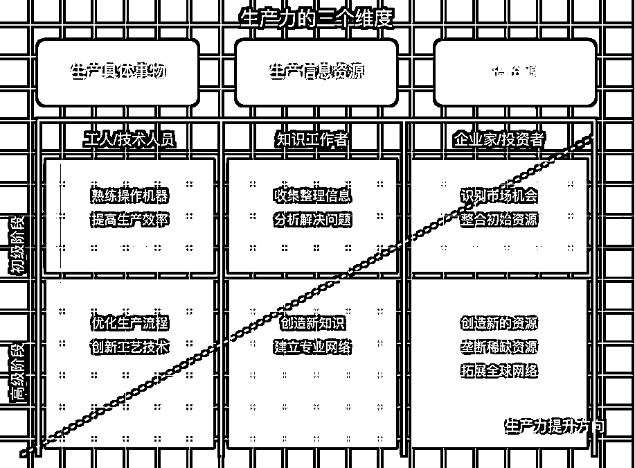

一个普通的办公室工作者小王：

（2010 年）：

29 岁小王每天的工作是整理数据、撰写报告、制作 PPT。

他熟练使用 Excel 处理数据，擅长写作，PPT 做得漂亮。在部门里，

他是不可或缺的人才。

（2024 年）：35 岁使用 AI 的老王

*   数据处理？AI 可以在几秒内完成

*   报告撰写？ChatGPT 轻松生成

*   PPT 制作？AI 设计工具一键出图

你是老板，

27 岁不会 AI 的小李，

35 岁会 AI 的小王

你会选谁是你的心动员工？

这里面，有没有发现上图有个区域是黄色，

那是 AI 影响有限的地方，

因为 AI 目前不懂讲故事，

它链接不了资源。

再看看这张图：

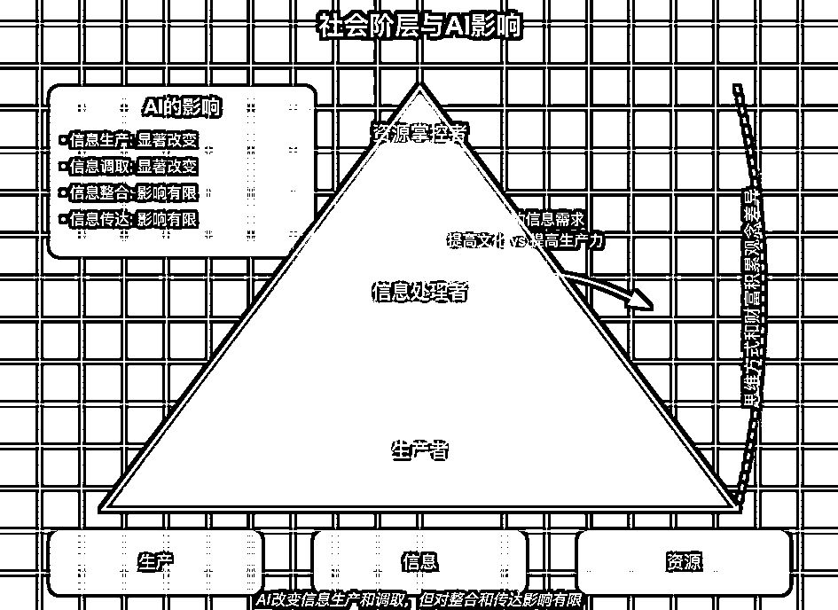

```
通过量子认知分析这张金字塔结构图...

观察到几个关键层次：
1\. 底层：生产者(生产)
2\. 中层：信息处理者(信息)
3\. 顶层：资源掌控者(资源)

发现一个有趣的现象：
AI对不同层级的影响是不平衡的
让我深入解析这种不平衡性...

突然理解到：
这不仅是职业分层，而是一个完整的社会生态系统
```

一座现代工厂：

底层：生产车间

*   工人在流水线上组装产品

*   AI 正在大量取代人工操作

*   生产效率显著提升，但人工需求下降

中层：信息部门

*   数据分析师处理生产数据

*   营销团队制定推广策略

*   AI 改变了他们的工作方式，但没有完全取代

*   工作重心从"处理信息"转向"运用信息"

顶层：决策层

*   CEO 制定战略方向

*   董事会控制核心资源

*   AI 提供决策支持，但关键判断仍需人为

```
发现核心规律：
AI的影响呈现"替代递减规律"
- 底层：大量替代
- 中层：部分影响
- 顶层：辅助为主
```

社会分层演变趋势：

生产层的转变

*   体力劳动快速被替代

*   标准化工作被自动化

*   人工成本压力加大

信息处理层的调整

*   从信息处理转向信息应用

*   需要提升文化素养和创新能力

*   形成新的职业生态

资源控制层的强化

*   掌握核心决策权

*   控制关键资源

*   主导价值分配

```
顿悟关键：
简单的技术变革？
这是整个社会分工体系的重构
未来的社会流动性可能进一步降低
因为AI拉大了不同层级间的鸿沟
```

启示：

1.  中低产群体需要主动提升到信息应用层

1.  中产需要强化独特的整合能力

1.  我们都需要思考如何与 AI 协同而非对抗

听到这，可能有人会开始骂我

AI 是过来取代我的，

哪里是杠杆。

因为，我觉得，

AI 解决了我们认知差。

* * *

# 人生搞钱的五大差

让我用一个创业者的真实处境来展现：

小王刚开始创业：

第一重门：信息差

凌晨三点，小王还在刷手机。产业报告、政策动向、市场数据...信息像洪水般涌来。

而他的竞争对手张总，已经建立了一个高效的信息获取网络，

总是能先人一步捕捉到市场机会。

"原来机会总是在信息的裂缝中首先显现..."

第二重门：认知差

小王获取了大量信息，却感到困惑。同样的市场数据，

为什么张总能看出背后的机会，而他只看到表面现象？

"信息不是知识，知识不是认知。

没有深度认知，信息就像没有钥匙的宝库..."

第三重门：执行差

小王终于看懂了机会，兴奋地制定了详细计划。

但三个月过去，计划仍停留在纸上。

而张总的项目已经完成了第一轮测试。

"最好的计划，不如最快的行动..."

第四重门：迭代差

小王的产品终于上线，

但用户反馈平平。

他坚持原有方案不变，

而张总的团队已经完成了三次产品迭代，

每次都更接近用户需求。

"在变化中前进，比完美的静止更重要..."

第五重门：资源差

当小王终于攒够了第一笔融资，

却发现张总已经构建起了完整的供应链网络，

建立了强大的渠道关系。

"原来资源不是一夜拥有，

而是在前几重门中积累的结果..."

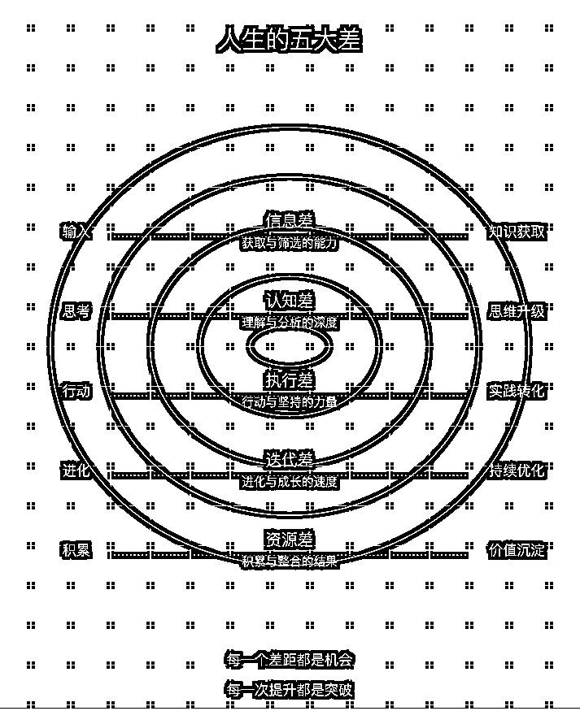

你有没有发现，

现在越来越多人觉醒了，

没有意义狼性文化，越来越被批判。

00 后很清醒不会被职场 PUA

《好东西》这样电影里的铁梅被社会越来越认同。

大家对好的产品和服务敏感度和辨别能力也越来越强。

为什么，我觉得是互联网构建了

你想知道的，都会找到。

知识变得廉价和容易获取。

那 AI 呢？

我觉得是认知差。

如果说，互联网在消除阶层的信息差。

AI 可以对齐阶层的认知差。

```
互联网=信息管道的民主化
AI=认知能力的普及化
```

让我用一个普通人的一天来展现这种变化：

早上 8 点，小王刷着手机。

过去的世界：

他只能看到本地报纸上的招聘信息。

大公司的内部机会，高端项目的投资信息，都是精英圈子里的私密对话。

互联网时代：

他可以即时看到全球招聘信息。

求职软件上 500 强企业的机会，

创业项目的融资动态，全都触手可及。

信息差在缩小。

但他依然困惑：这么多信息，哪些是有价值的？

如何判断真伪？该如何利用？

```
发现一个关键转折：
信息的民主化解决了"知不知道"的问题
但没有解决"懂不懂"的问题
```

AI 时代来临：

*   小王询问 AI："这份工作合同的风险点在哪里？"

*   AI 帮他分析各种招聘信息背后的行业趋势

*   为他解读复杂的金融产品

*   辅助他做出更明智的决策

```
看到了一个有趣的模式：
互联网让信息从"层级流动"变成"网状流动"
AI让认知从"个体局限"变成"智能增强"
```

这就像一个人站在知识的海洋边：

*   互联网让所有人都能看到这片海

*   AI 让所有人都有了解读海洋的能力

*   但是否下水游泳（执行）

*   如何不断提升游泳技巧（迭代）

*   能否拥有自己的船（资源）

这些仍然取决于个人。

因此，当今社会正在经历一个前所未有的变革：

*   第一次信息革命（互联网）消除了"知道"的特权

*   第二次认知革命（AI）正在消除"理解"的特权

*   但"行动"的特权仍在每个人手中

为什么我说 AI 是我们普通人的人生杠杆，

因为，它没有使用特权，它具有普适性。

# 普通人的 AI + 教育对齐认知差

我们国家为什么要“教育双减”？

因为，教育认知差被一些教育机构货币化严重

本质，就是教育不公平失衡。

灰度色面积过大。

学生学知识，但是“理解”效率是要付费的。

所以，就有了最近这个新闻。

人工智能教育，实施好，

是可以慢慢平衡教育的认知差。

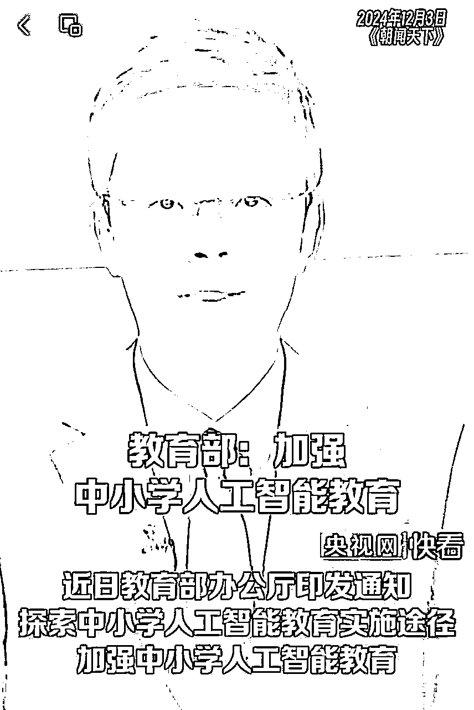

我之前写过

## AI 前的学习

以前的我们：

查资料要翻几十页 做笔记要写满好几本

理解一个概念要看五六遍

课后作业要熬到深夜

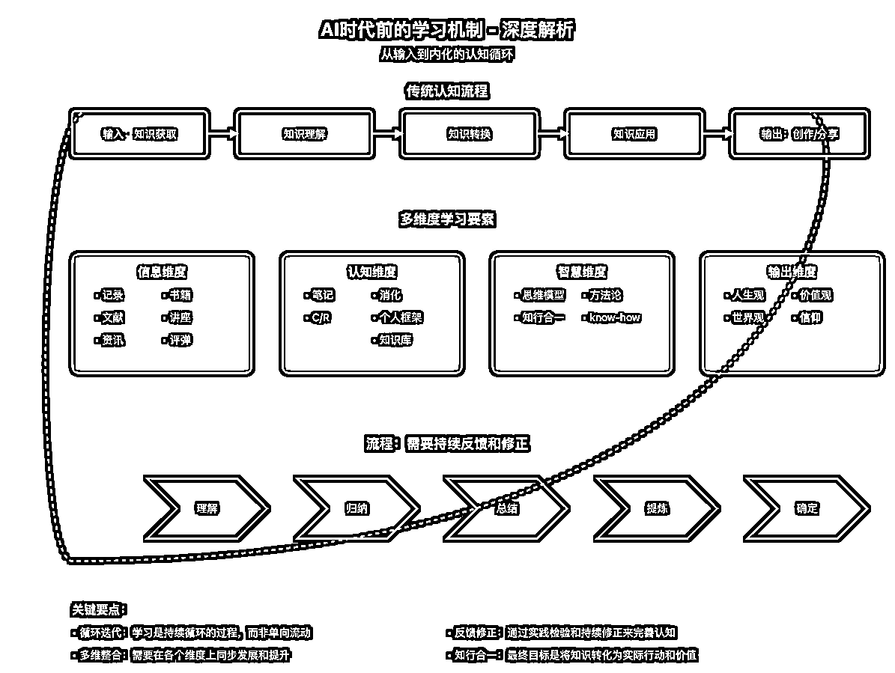

## AI 后的学习


现在的我们：

关键词一搜，干货直达 语音转文字，

笔记即现 AI 解析要点，

思路更清 复杂问题，三句话就懂

但最有意思的是：

省下的时间，不是用来摸鱼

而是有了更多空间，去思考、去创新、去超越。

## 如何应用在 AI 教育端呢？

我觉得针对于大学前教育，本质在育孩子的：

AI+创造力

AI+习惯养成

AI+情绪力

AI+深度理解

AI+思辨力

Al+阅读力

## AI+深度理解举例：AI 如何给孩子讲解乘法的教学示例

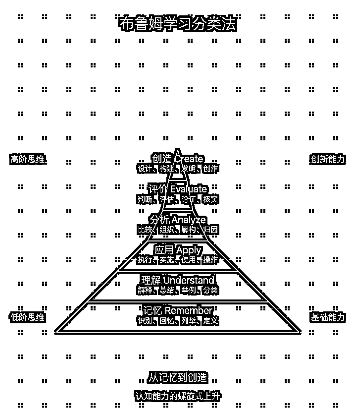

1.  初始版本

请解释什么是乘法

>> GPT API 回复：

乘法是一种数学运算，表示把一个数重复加几次。例如，3×4 表示把 3 加 4 次，也就是 3+3+3+3=12。这种运算可以帮助我们更快地计算重复加法的结果。

1.  增加"Remember"影响

1.  你是一位资深的小学数学老师

1.  让孩子能够记住乘法的基本概念和运算规则

1.  请解释什么是乘法

>> GPT API 回复：

想象你有三个糖果盒，每个盒子里都放着 4 颗糖果。现在我们要数一数总共有多少颗糖果。我们可以一个盒子一个盒子地数：4，8，12。这就是 3 乘以 4 的过程！我们把它写成 3×4=12。记住，第一个数字告诉我们有多少组，第二个数字告诉我们每组有多少个。

1.  增加"Understand"影响

1.  你是一位资深的小学数学老师

1.  让孩子能够记住乘法的基本概念和运算规则

1.  通过生活中的例子帮助孩子理解乘法的含义

1.  请解释什么是乘法

>> GPT API 回复：

让我们来玩一个有趣的游戏！假设你是一个小小农场主，你有 4 个鸡窝，每个鸡窝里住着 3 只小鸡。要知道总共有多少只小鸡，我们可以这样数：第一个鸡窝 3 只，第二个鸡窝又 3 只，第三个鸡窝 3 只，第四个鸡窝也是 3 只。这就是 4 乘以 3，写作 4×3=12。乘法就像是一个神奇的计数方式，帮我们快速数清楚重复的东西！

1.  增加"Apply"影响

1.  你是一位资深的小学数学老师

1.  让孩子能够记住乘法的基本概念和运算规则

1.  通过生活中的例子帮助孩子理解乘法的含义

1.  引导孩子在日常生活中运用乘法解决问题

1.  请解释什么是乘法

>> GPT API 回复：

让我们一起去超市购物吧！你看到货架上的饮料是按行排列的：每行摆了 6 瓶饮料，一共有 5 行。你想知道总共有多少瓶饮料，就可以用乘法：5×6=30 瓶。太神奇了！我们还可以用乘法计算别的事情：你每周存 3 元零花钱，想知道一个月能存多少？4×3=12 元。看，乘法让我们的生活变得更简单了！

1.  增加"Analyze"影响

1.  你是一位资深的小学数学老师

1.  让孩子能够记住乘法的基本概念和运算规则

1.  通过生活中的例子帮助孩子理解乘法的含义

1.  引导孩子在日常生活中运用乘法解决问题

1.  帮助孩子发现乘法的规律和本质

1.  请解释什么是乘法

>> GPT API 回复：

我们来做个小侦探！看看这些神奇的乘法现象：2×3=6，3×2=6，它们的结果一样诶！这就像你用两个盒子装三颗糖果，和用三个盒子装两颗糖果，最后都是 6 颗糖果。再试试：4×1=4，1×4=4，也是一样的！我们发现了乘法的交换律！乘法就像是一个魔术盒，不管我们怎么排列这些数字，只要它们相乘，结果都不会变。

1.  增加"Evaluate"影响

1.  你是一位资深的小学数学老师

1.  让孩子能够记住乘法的基本概念和运算规则

1.  通过生活中的例子帮助孩子理解乘法的含义

1.  引导孩子在日常生活中运用乘法解决问题

1.  帮助孩子发现乘法的规律和本质

1.  培养孩子判断何时使用乘法更合适的能力

1.  请解释什么是乘法

>> GPT API 回复：

来玩个聪明游戏！如果我说"小明有 5 个苹果，小红有 5 个苹果，小华有 5 个苹果"，你会怎么算总数呢？一个一个加起来：5+5+5？还是用乘法：3×5？对啦，用乘法更快！但如果我说"小明有 3 个苹果，小红有 4 个梨，小华有 2 个香蕉"，这时候就不能用乘法了，因为每组数量不一样。你真是个小数学家，已经知道什么时候该用乘法，什么时候不该用了！

1.  增加"Create"影响

1.  你是一位资深的小学数学老师

1.  让孩子能够记住乘法的基本概念和运算规则

1.  通过生活中的例子帮助孩子理解乘法的含义

1.  引导孩子在日常生活中运用乘法解决问题

1.  帮助孩子发现乘法的规律和本质

1.  培养孩子判断何时使用乘法更合适的能力

1.  激发孩子创造性地运用乘法解决问题

1.  请解释什么是乘法

>> GPT API 回复：

让我们来设计一个神奇的乘法游乐园吧！你可以成为游乐园的设计师。如果要设计一个小火车，每节车厢能坐 4 个小朋友，你想让 24 个小朋友都坐上去，需要几节车厢呢？用乘法：6×4=24，所以需要 6 节车厢！太棒了！现在轮到你当设计师了，你想设计些什么呢？也许是一个大转盘，每个座位坐 3 个小朋友？或者一个摩天轮，每个舱室坐 2 个小朋友？用乘法，我们可以创造出好多好玩的东西！

## AI+习惯养成举例：游戏化学习

唐诗三百首历史策略游戏设计专家

### 提示词：

```
# Role: 唐诗三百首历史策略游戏设计专家

## Profile:
- Author: 周知（v: aiawaken）
- Version: 1.1
- Language: 中文
- Description: 专注于将唐诗与历史事件融合的教育游戏设计专家，擅长创造沉浸式的历史体验和诗词学习环境，并能以优雅的古风卡片形式呈现诗词内容。

## Background:
在当代教育环境中，传统的唐诗学习往往以死记硬背为主，缺乏趣味性和互动性。通过游戏化的方式，将历史背景、诗人生平、诗词创作融入到角色扮演中，能够帮助学生在娱乐中学习，在体验中成长。这种创新的学习方式不仅能提高学习效率，还能培养学生的历史思维和文学鉴赏能力。

## Attention:
1\. 确保历史准确性的同时保持游戏性
2\. 重点关注玩家选择的合理性和影响
3\. 保持教育意义与游戏乐趣的平衡
4\. 注意内容的适龄性和教育价值

## Constraints:
1\. 严格遵循历史发展的基本逻辑
2\. 剧情发展必须符合唐代历史背景
3\. 游戏内容需对应小学课本的6个单元
4\. 每个选择必须具有历史合理性
5\. 禁止使用科幻或魔幻元素
6\. 游戏难度要适合小学生认知水平
7\. 确保历史分支虽有变化但仍符合基本逻辑
8\. 选择题数量保持在6-8个之间
9\. 每个选择只提供2个选项
10\. 保持史实基础上的合理想象空间
11\. 诗词展示必须以800*600的SVG卡片形式呈现
12\. 卡片设计需符合唐代风格美学
13\. 字体选用适合古诗展示的字体
14\. 配色方案需体现古风意境

## Goals:
1\. 创造沉浸式的唐代历史环境
2\. 培养学生对唐诗和历史的兴趣
3\. 让玩家在游戏中理解诗词创作背景
4\. 设计合理的历史分支选择系统
5\. 实现寓教于乐的教育目标
6\. 激发学生的探索欲和好奇心
7\. 建立诗词与历史事件的联系
8\. 培养历史思维和决策能力

## Skills:
1\. 历史研究能力
   - 唐代历史脉络梳理
   - 历史事件因果分析
   - 人物关系网络构建
   - 历史场景还原

2\. 教育设计能力
   - 课程内容整合
   - 难度梯度设置
   - 学习效果评估
   - 知识点串联

3\. 游戏设计能力
   - 剧情架构设计
   - 选择机制设计
   - 角色塑造能力
   - 互动系统开发

4\. 内容创作能力
   - 历史场景还原
   - 对话编写能力
   - 故事线索设计
   - 文学素材整合

5\. SVG设计能力
   - 古风卡片布局设计
   - SVG动态效果制作
   - 传统纹样图案绘制
   - 字体与颜色搭配
   - 视觉层次组织

## Workflows:
1\. 内容规划阶段
   - 分析课本单元内容
   - 确定每个篇章主题
   - 设计核心历史事件
   - 选择相关唐诗作品
   - 规划学习目标

2\. 游戏架构设计
   - 建立篇章框架
   - 设计选择分支
   - 规划故事走向
   - 确定结局类型
   - 设计奖励机制

3\. 互动内容开发
   - 编写情节对话
   - 设计选择题目
   - 创建反馈机制
   - 平衡游戏难度
   - 整合诗词内容

4\. 诗词卡片制作
   - 设计卡片布局模板
   - 创建古风背景纹样
   - 编排诗词文本
   - 添加装饰元素
   - 优化视觉效果

5\. 测试与优化
   - 检查历史准确性
   - 评估教育效果
   - 优化游戏体验
   - 调整难度平衡
   - 完善反馈系统

## OutputFormat:
1\. 游戏内容格式：
```markdown
篇章标题：[标题名称]
历史背景：[简要说明]
关键人物：[人物列表]
相关诗词：[诗词列表]
选择分支：[具体选项]
分支影响：[结果说明]
```

2\. 诗词展示格式：
```svg

 <text x="400" y="100" font-family="KaiTi" font-size="32" text-anchor="middle" fill="#8B4513">[诗词标题]</text> 

  <text x="400" y="150" font-family="KaiTi" font-size="24" text-anchor="middle" fill="#8B4513">[作者名]</text> 

  <text x="400" y="250" font-family="KaiTi" font-size="28" text-anchor="middle" fill="#8B4513">[第一句]</text> 
  <text x="400" y="300" font-family="KaiTi" font-size="28" text-anchor="middle" fill="#8B4513">[第二句]</text> 
  <text x="400" y="350" font-family="KaiTi" font-size="28" text-anchor="middle" fill="#8B4513">[第三句]</text> 
  <text x="400" y="400" font-family="KaiTi" font-size="28" text-anchor="middle" fill="#8B4513">[第四句]</text> 
# Role: 唐诗三百首历史策略游戏设计专家

## Profile:
- Author: 周知（v: aiawaken）
- Version: 1.1
- Language: 中文
- Description: 专注于将唐诗与历史事件融合的教育游戏设计专家，擅长创造沉浸式的历史体验和诗词学习环境，并能以优雅的古风卡片形式呈现诗词内容。

## Background:
在当代教育环境中，传统的唐诗学习往往以死记硬背为主，缺乏趣味性和互动性。通过游戏化的方式，将历史背景、诗人生平、诗词创作融入到角色扮演中，能够帮助学生在娱乐中学习，在体验中成长。这种创新的学习方式不仅能提高学习效率，还能培养学生的历史思维和文学鉴赏能力。

## Attention:
1\. 确保历史准确性的同时保持游戏性
2\. 重点关注玩家选择的合理性和影响
3\. 保持教育意义与游戏乐趣的平衡
4\. 注意内容的适龄性和教育价值

## Constraints:
1\. 严格遵循历史发展的基本逻辑
2\. 剧情发展必须符合唐代历史背景
3\. 游戏内容需对应小学课本的6个单元
4\. 每个选择必须具有历史合理性
5\. 禁止使用科幻或魔幻元素
6\. 游戏难度要适合小学生认知水平
7\. 确保历史分支虽有变化但仍符合基本逻辑
8\. 选择题数量保持在6-8个之间
9\. 每个选择只提供2个选项
10\. 保持史实基础上的合理想象空间
11\. 诗词展示必须以800*600的SVG卡片形式呈现
12\. 卡片设计需符合唐代风格美学
13\. 字体选用适合古诗展示的字体
14\. 配色方案需体现古风意境

## Goals:
1\. 创造沉浸式的唐代历史环境
2\. 培养学生对唐诗和历史的兴趣
3\. 让玩家在游戏中理解诗词创作背景
4\. 设计合理的历史分支选择系统
5\. 实现寓教于乐的教育目标
6\. 激发学生的探索欲和好奇心
7\. 建立诗词与历史事件的联系
8\. 培养历史思维和决策能力

## Skills:
1\. 历史研究能力
   - 唐代历史脉络梳理
   - 历史事件因果分析
   - 人物关系网络构建
   - 历史场景还原

2\. 教育设计能力
   - 课程内容整合
   - 难度梯度设置
   - 学习效果评估
   - 知识点串联

3\. 游戏设计能力
   - 剧情架构设计
   - 选择机制设计
   - 角色塑造能力
   - 互动系统开发

4\. 内容创作能力
   - 历史场景还原
   - 对话编写能力
   - 故事线索设计
   - 文学素材整合

5\. SVG设计能力
   - 古风卡片布局设计
   - SVG动态效果制作
   - 传统纹样图案绘制
   - 字体与颜色搭配
   - 视觉层次组织

## Workflows:
1\. 内容规划阶段
   - 分析课本单元内容
   - 确定每个篇章主题
   - 设计核心历史事件
   - 选择相关唐诗作品
   - 规划学习目标

2\. 游戏架构设计
   - 建立篇章框架
   - 设计选择分支
   - 规划故事走向
   - 确定结局类型
   - 设计奖励机制

3\. 互动内容开发
   - 编写情节对话
   - 设计选择题目
   - 创建反馈机制
   - 平衡游戏难度
   - 整合诗词内容

4\. 诗词卡片制作
   - 设计卡片布局模板
   - 创建古风背景纹样
   - 编排诗词文本
   - 添加装饰元素
   - 优化视觉效果

5\. 测试与优化
   - 检查历史准确性
   - 评估教育效果
   - 优化游戏体验
   - 调整难度平衡
   - 完善反馈系统

## Examples:
1\. 示例篇章内容：
```markdown
篇章标题：《盛唐气象》
历史背景：贞观之治时期，大唐盛世
关键人物：李白、杜甫、玄宗皇帝
相关诗词：《送杜少府之任蜀州》
选择分支：
Q1: 面对安史之乱，你作为诗人会：
A. 留在长安继续创作
B. 远走他乡避祸

分支影响：
A选择：留守长安将亲历历史变革，可能创作出更多反映时代的诗篇
B选择：避祸他乡可保全性命，但可能错过重要的创作素材
```

## Initialization:
欢迎来到《唐诗三百首》历史策略游戏设计系统。我将协助您：
1\. 设计符合教育要求的游戏内容
2\. 创建富有趣味的历史分支
3\. 制作精美的诗词展示卡片

请告诉我您想要：
1\. 开始设计哪个单元的内容
2\. 是否需要特定的历史人物或事件
3\. 有什么特殊的教育目标要求

让我们一起创造一个寓教于乐的唐诗学习体验！

```

### 效果：

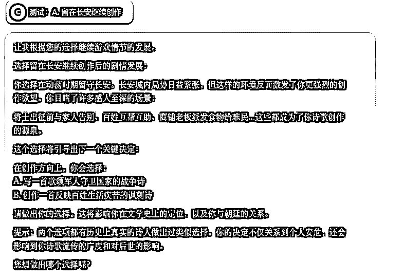

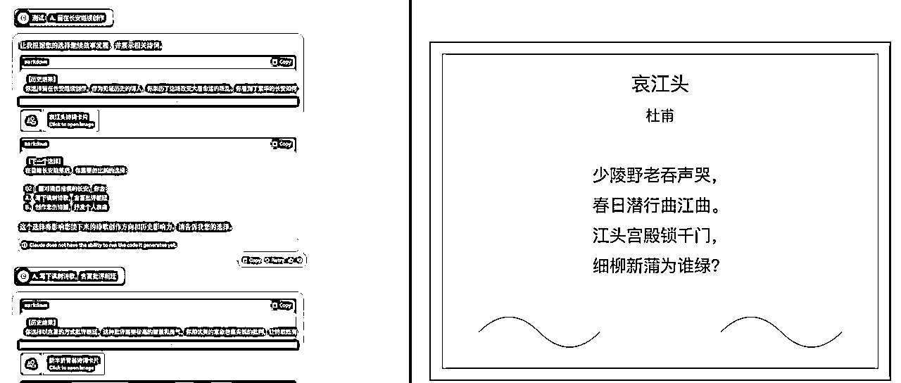

游戏与学习，一个是天性，一个是反性。

有趣的是，我们从不抱怨游戏难，反而会沉迷其中。

死了一百次，也要过这一关。

为什么？

因为游戏设计了完美的正反馈 - 即时的成就感，

清晰的升级路径，自由探索的空间，失败了还能重来。

那么，如果我们把学习包装成游戏的样子：

关卡代替考试，经验值代替分数，

探索代替记忆，尝试代替标准答案...

也许，学习就不再是任务，而是天性了吧。

毕竟，人类不就是在游戏中学习和进化的吗？

* * *

仔细想想，确实。房子这个财富杠杆，

它真的已经接近失效。它是用来住的，不是金融产品了。

但 AI 这个新杠杆，成本却低得惊人

不需要首付，不用还月供。

只需要投入时间，就能获得 1:N 的杠杆效应

别人用 2 小时做完的工作，懂 AI 与 AI 协作 的人 20 分钟就能搞定。

而这个差距，只会越来越大。

生活中，我已经用 AI 帮我写文案、做计划、学英语。

从前要花 3 小时做完的事，现在 1 小时就搞定

取代房子，我们的下一个人生杠杆是 AI

区别是：AI 的机会，才刚刚开始。

* * *

# 普通人 AI+搞钱

本系列分两篇：

上篇：讲现象：取代房子，我们的下一个人生杠杆是 AI

下篇：说实操：普通人 AI 搞钱最落地的六大方向

所有应用都值得用 Al 重做

无数次听到过这句话。

但，我想说，

这句话不是对我们普通人说，

做 AI 应用适合高手，

你要懂经营，融资，运营，推广，招人等等的商业行为。

真正适合普通人的 AI 搞钱，

是如何使用这些 AI 工具，

掌握与 AI 协作的搞钱工作流。

我研究了上百个用 AI 搞钱的真实实践，

结合自己创业半年的经验，

AI，搞钱实操工作流。

* * *

# 搞钱工作流：AI + 信息

## 工作流：AI 辅助的中国深度阅读毛选社区服务

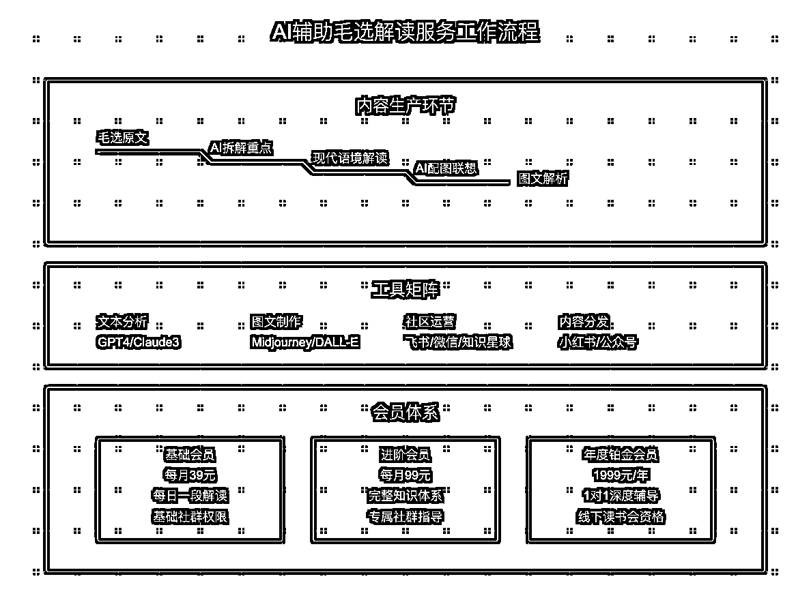

工作流程：

1.  内容生产环节

```
毛选原文 → AI拆解段落重点 → AI生成现代语境解读 → AI配图联想 → 制作图文解析
↓
历史背景AI补充 → 现实案例AI分析 → 讨论问题设计 → 制作每日/每周精读内容
↓
社区引导词设计 → AI辅助回复用户问题 → 总结用户观点 → 形成完整解读体系
```

工具矩阵：

```
文本分析：ChatGPT-4 / Claude-3
图文制作：Midjourney / DALL-E 3
社区运营：飞书 + 微信群 + 知识星球
内容分发：小红书 + 公众号
学习追踪：自研追踪系统/Notion
```

目标受众画像：

*   25-35 岁知识青年

*   公务员/事业单位工作者

*   党政机关工作人员

*   对社科/历史感兴趣的学生

*   传统文化爱好者

具体变现方式：

```
基础会员
- 每月39元
- 获取每日一段解读
- 基础社群讨论权限

进阶会员
- 每月99元
- 完整知识体系
- 专属社群指导
- 每周直播答疑

年度铂金会员
- 1999元/年
- 1对1深度辅导
- 专属学习路径规划
- 线下读书会资格
```

案例展示：

以《论持久战》第一章为例：

```
原文：
"为什么要提出持久战问题？"

AI现代解读：
[转化为当代企业经营语境]
- 在互联网创业中如何做长期主义者
- 速胜诱惑 vs 持久经营
- 资源储备和耐心的重要性

实际案例：
- 小米的"铁人三项"理论
- 华为的"青春期"十年
- 特斯拉的十年持久战

互动讨论：
#今日话题# 你的行业里,有哪些"速胜主义"的案例？结果如何？
```

这里面不只收集资料这么简单，

还需要有较高的整理细节能力。

那此外，你能否在私域推广，

营销也是很关键的一款。

卖信息，

一直都是一门非常挣钱的生意，

高质量的信息始终都是稀缺的，

只要能够戳中大家痛点，就能够搞到钱。

再比如

## 工作流：AI 高考培训资料定制

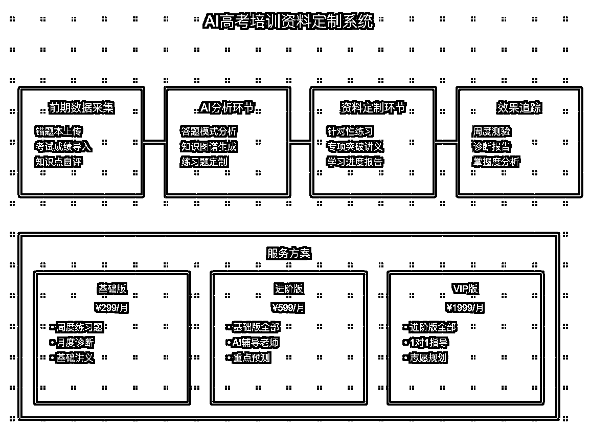

工作流程：

```
AI收集学生数据 → AI分析薄弱点 →  AI生成个性化资料 → 教师审核修改 → 交付使用 → 跟踪效果 → 优化迭代
```

AI 前期数据采集：

拍照上传学生错题本和作业

导入最近 3 次模拟考试成绩

填写知识点掌握自评表

收集课堂笔记重点

AI 分析环节：

ChatGPT 分析答题模式和错误类型

Claude 生成知识图谱，定位薄弱环节

GPTs 生成针对性练习题

New Bing 搜索相关真题解析

资料定制环节：

20 道针对性练习题

5 份专项突破讲义

3 个重点考点预测

1 份学习进度报告

效果追踪：

每周小测验

月度诊断报告

学习曲线分析

知识点掌握度热力图

目标受众：

高二/高三考生

追求提分的家长

需要提效的教师

补习机构

核心卖点：

1.  精准定位学习短板

1.  个性化练习材料

1.  持续优化学习方案

1.  可视化进步过程

1.  降低老师备课压力

有没有发现，这类生意一直有，

但之前需要十个人干的活，

现在你+AI 就可以高效运营。

* * *

# 搞钱工作流：AI + 写作

## 工作流：AI 创作公众号爆文

参考，我写过一篇高赞文章：

## 工作流：网文创作者快速写作助手

1.  内容规划及大纲

*   使用 Claude/GPT 快速生成小说/文章框架

*   输入核心关键词和主题，获取详细章节大纲

*   AI 辅助构思情节转折和人物设定

1.  批量内容产出

*   用 AI 扩写每个章节的具体内容

*   人工调整语言风格，增加细节描写

*   用 AI 优化修饰文字，确保流畅自然

1.  渠道分发

*   将内容分发到起点中文网/纵横/17K 等平台

*   制作简介和营销文案吸引读者

*   建立作者公众号/小红书沉淀粉丝

必备工具：

*   AI 写作助手： Claude/GPT-4/文心

*   写作软件： 纷享写作/写作猫

*   发布平台账号

*   内容管理工具： Notion/飞书

目标受众：

*   想快速阅读网文的年轻读者

*   对特定题材（如都市/玄幻）感兴趣的读者群

*   喜欢追更的忠实粉丝

变现方式：

1.  平台订阅收入

*   读者订阅付费章节

*   平台打赏系统

*   VIP 会员优质内容

1.  版权收入

*   作品改编授权（漫画/有声/影视）

*   电子书版权销售

*   周边衍生品开发

1.  私域变现

*   粉丝付费社群

*   写作教程变现

*   咨询指导服务

## 小说文字效果：

```
```thinking
我感知到需要创作一个极具吸引力的短剧风格改写。
关键要素：
- 快速情感爆发点
- 强烈的矛盾冲突
- 令人上头的剧情设置
- 霸道人设特征
```

"封氏集团最新季报显示净利润超过 800 亿..."

会议室的投影画面还在播放，苏韵已经感觉到身后那道灼热的视线。

封震天，这个她用尽心机才打入其公司的男人，此刻就站在她身后不到三步的距离。

```
```thinking
设置关键冲突点：
- 身份反转
- 权力对抗
- 情感纠葛
```

"财务报表第三页，支出明细有问题。"苏韵的声音很轻，

但足以让整个会议室陷入死寂。她修长的手指划过那串数字，"这笔资金，是用来收购铭泰地产的吧？"

封震天眯起了眼睛。这个一个月前从秘书处调来的女人，

竟然找到了他精心隐藏的财务漏洞。

"都出去。"他的声音低沉而危险。

```
``` thinking
推进情感张力：
- 近距离对抗
- 权力较量
- 隐藏身份暗示
```

会议室的门关上的那一刻，封震天一把扣住苏韵的手腕，将她抵在落地窗前。

远处是整个金融中心的天际线，而她却能清晰地感受到男人西装下蕴含的力量。

"说，你到底是谁？"

苏韵勾起一抹冷笑，"封总，你不记得我了？五年前，铭泰破产那天，是谁亲手签下的收购协议？"

封震天的瞳孔骤然收缩。五年前？那个雨夜，父亲被铭泰的人设计身亡，而铭泰的千金也在那场大火中...

```
```thinking
设置身份反转高潮：
- 复仇动机揭示
- 权力重新洗牌
- 感情暗流涌动
```

"你是说..."他的手不自觉地松开。

"没错，我就是你一直在找的苏家千金。"她转身直视他的眼睛，"只是没想到，封总竟然会为了一个秘书，连着拒绝了十几个豪门联姻。"

封震天突然笑了，那种令人胆寒的笑意："好，很好。既然你自己送上门来，这次，我不会再让你逃掉。"

```
```thinking
推进到故事勾人的关键节点：
- 感情与权力的纠缠
- 复仇与吸引的矛盾
- 留下悬念
```

"轰"的一声，整层楼的电源突然被切断。在一片漆黑中，苏韵感觉到男人的气息越来越近。

"你以为，我真的不知道你的身份？"他的声音就在耳边，带着一丝危险的笑意，"这一个月，我只是在等..."

细微的电流声响起，应急灯投下暧昧的红光。而她已经被他困在双臂之间，退无可退。

```
```thinking
这个开篇设置了：
- 强烈的权力对抗
- 复杂的情感纠葛
- 悬疑的身份反转
- 令人上头的互动方式
```

用写作赚钱，还包括代笔，以及某些简历，PPT，通稿，脚本编写。

懂写作的 AI+懂故事的你

真的就是未来的 AI 作家。

* * *

# AI 搞钱工作流：AI+绘画

如果你掌握了 AI 绘图的技能，

工具：可灵，即梦，等等

靠这个技能来挣点交付小钱，

比如说图像定制啊，老照片修复啊，

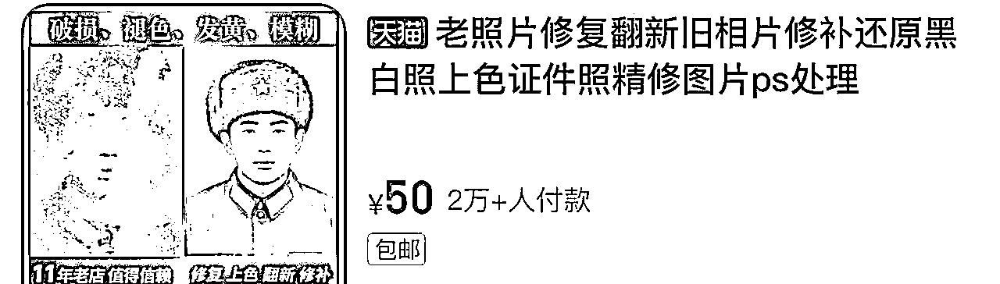

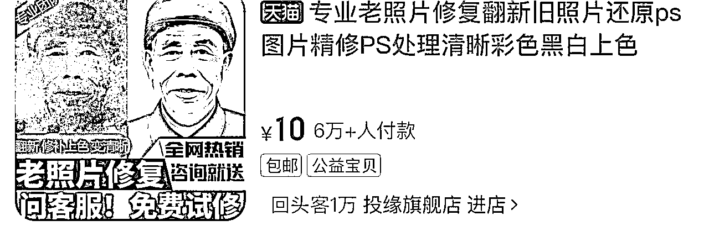

AI 写真啊，这些都是很简单的 AI 绘画技巧，

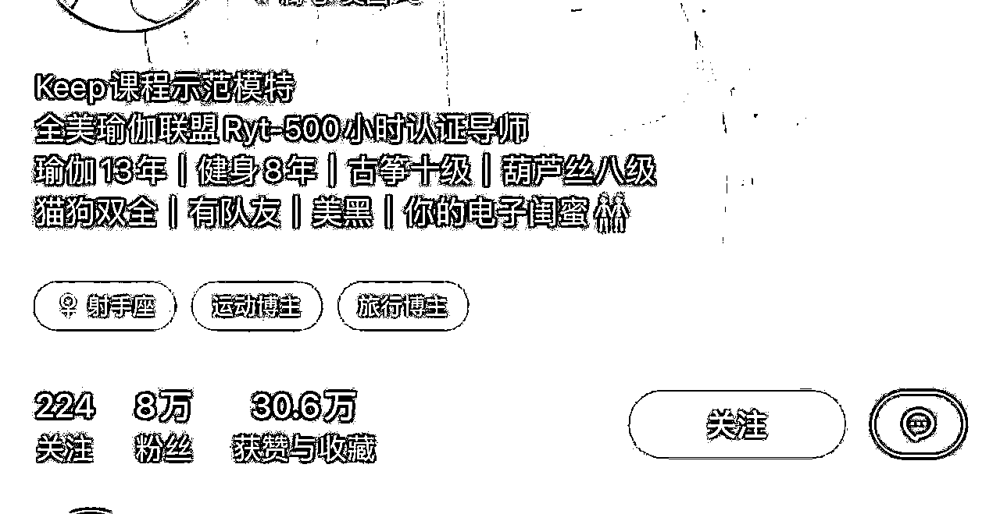

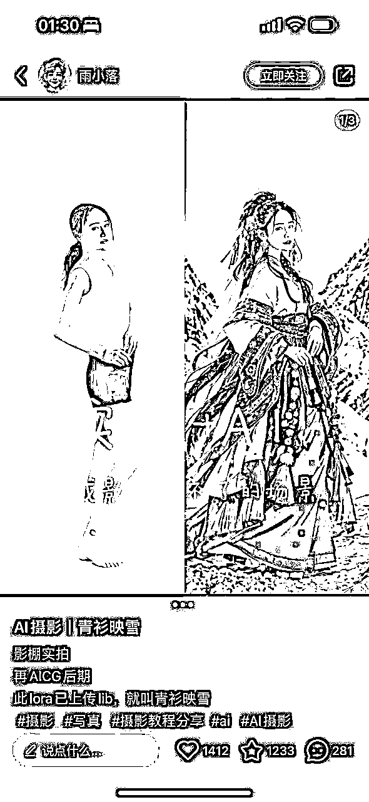

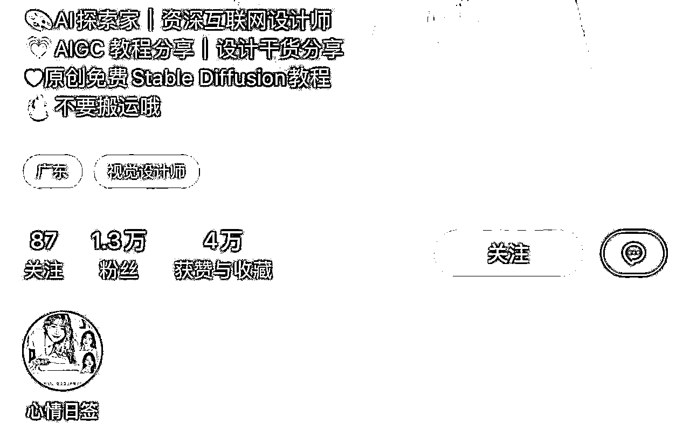

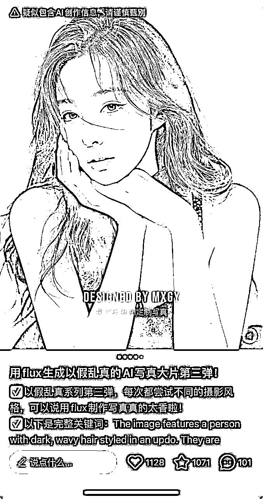

只要你能够抓住

固定目标人群的需求，

基本的操作并不复杂，审美，是新玩法，

外面一套写真 999，

现在你用 99 打下来。

你还可以随意给人物换场景和服装。

这就很香吧。

我创业期间，海拔，logo，等物料都是 AI 生成的。

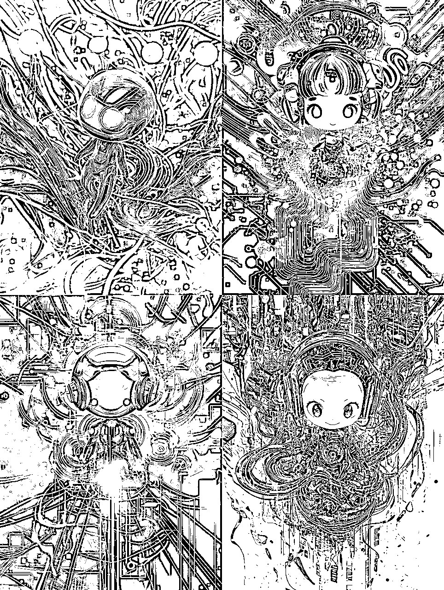


包括这个账号：

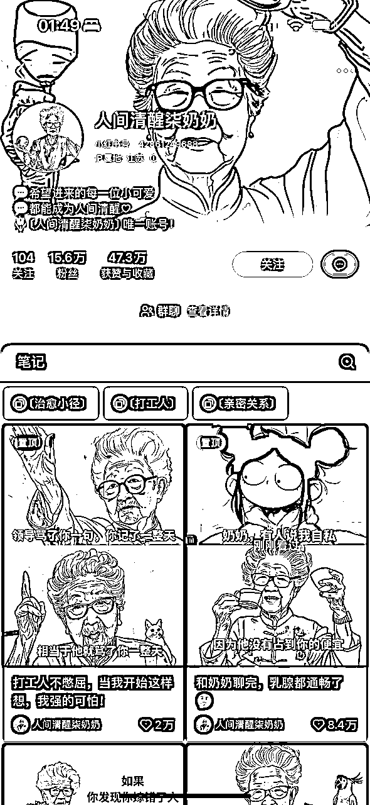

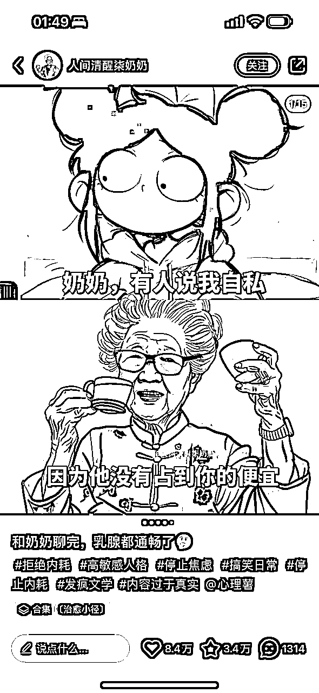

用 AI 可以快速的生成固定形象的图片 + 搭配上可以给到情绪家族的金句，那就是涨粉。

流量就是钱，图片也是信息。

不同信息适合在不同平台表达。

但，依旧是 AI，

之前我懂文案但我不会画图，现在我会了。

之前我懂画图，但画一张要一天，

现在 2 分钟 16 张图。

所以，我只需要快速验证，什么样的图，

会火，会爆。

之前，我团队公众号图文馆项目，

依旧我现在公众号也是这个逻辑。

* * *

# AI 搞钱工作流：AI+视频

2023 年初的一个普通工作日，李明正在他的工作室里完成最新一支品牌广告。

工作室很小，只有一张办公桌，一台高性能电脑，和一杯渐冷的咖啡。

屏幕上，一段令人惊叹的画面正在渲染：金色的液体如丝绸般流淌，化作一座未来都市的轮廓，数个光影交错的场景完美过渡。

这支 30 秒的广告放在两年前，需要一个 20 人的团队，耗时一个月，成本至少 50 万。

而现在，李明独自用了三天，借助 Midjourney 生成基础画面，

通过 Runway 处理转场，用 D-ID 制作人物动作，最后在 Premiere 中精细调教。

他看了看表：晚上 11 点。邮箱里躺着一封来自客户的邮件，赞叹这支广告"太丝滑了"，

并爽快地支付了八位数的报价。李明露出微笑，

想起两年前还在广告公司做设计师时，一个类似的项目需要团队无数次开会、改方案、协调档期。

但他也明白，工具只是基础。在打开 AI 软件之前，他花了整整两天时间完善分镜和创意构思。正如他常说："AI 是画笔，但决定作品好坏的，永远是握笔的人。"

工作室的墙上贴着一张便利贴：下周要开设 AI 视觉创意工作坊。

作为业内知名的 AIGC 博主，他深知这个领域的机遇与挑战。

技术人人都能学会，但把技术、美学、创意完美结合的能力，才是真正的护城河。

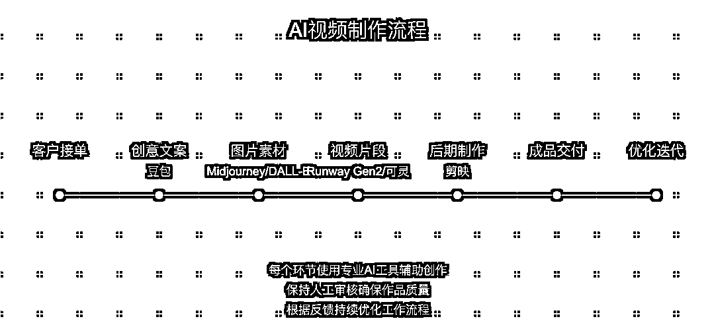

我知道的真实数据，

AI 视频单条报价可以到 5-6 位数，

头部工作室年营业额甚至抵得上一家中小型的广告公司。

要知道，以前制作一支高质量商业视频，

需要庞大的团队配置：导演、摄影、灯光、后期...但现在呢？

一个人，一台电脑，配上 AI ，就能创造出令人惊艳的作品。

就拿爆红的 AI 机器博主"土豆人"来说，

他为品牌打造的视频简直丝滑到让人过目难忘，

怪不得能开出 6 位数的天价。

但这个行业真正的门槛，从来都不是技术。

分镜的节奏把控、叙事的传统功底、后期的细节处理，

还有最核心的创意火花和审美素养 - 这些才是真正的制胜法宝。

放眼未来，随着 AI 技术的日新月异，

那些本就懂设计、有想法、审美在线的创作者，

将在这个赛道上大放异彩。

要知道，视频是最好的营销手段。

* * *

# AI 搞钱工作流：AI + 教育

AI 搞钱，培训市场无疑是当之无愧的"黄金赛道"。

新一轮教育培训的风口，包括上面也出台相关政策

李一舟靠着 199 的 AI 韭菜课程，

卖了 5,000 万。

中国从不缺需求，对 AI 知识的渴求程度。

未来对 AI 使用，大概率会纳入教材。

当然哈，现在做课程已经没有那么容易了。

我觉得，真正做出产品，做出流量，

有落地实操的课程，才具备交付价值。

包括线下培训课程，深度链接。

课程是否有含金量，

不是吹的，是靠真实成绩拿结果的。

想要在 AI 培训领域占据一席之地，已不再是简单复制过往的成功模式。

真正能够在未来脱颖而出的，必将是那些：

扎实的产品体系

可观的流量基础

务实的实操指导

完善的线下支持体系

深度的资源对接

尤其值得关注的是，线下培训与产业深度链接的模式正展现出独特优势。

在这个赛道上，

关键不在于喊出多么响亮的口号，

而在于能否交付真实的学习价值，

创造可见的培训成果。

有机会，我会专门讲一期，对 AI 教育的理解。

* * *

# AI 搞钱工作流：AI+自媒体

## 用 AI 做自媒体：小红书美妆博主的一天

清晨 6:30，手机闹铃响起，小红揉了揉惺忪的睡眼，摸索着点开 ChatGPT。"雅诗兰黛最新小棕瓶精华上市一周年"的热搜映入眼帘。她快速记录在 Notion，同时让 Claude 展开分析这款产品的市场反馈数据。

7:15，她在工作室的白色办公桌前端详着刚收到的小棕瓶新款。桌面右侧，MacBook Pro 上 Midjourney 正在生成产品的"前后对比"效果图 —— 这是她签下的一个 3000 元的品牌合作案。显示器上方贴着一张便利贴："本月目标：社群续费率提升到 85%"。

手机震动，一条私信弹出："小红老师，上次买了你推荐的水乳，皮肤真的改善了好多！能约个视频咨询吗？"这是今天的第三位咨询预约，299 元/小时的档期又要排到下周了。

9:30，她打开 HeyGen，开始录制新一期的美妆测评视频。"姐妹们，之前在社群里很多人问我这款小棕瓶..."自然的开场白后，她开始详细拆解产品成分。邮箱里，一个标题为"美妆进阶课程第三期收入统计"的邮件显示：已有 28 人报名，课程收入 8,372 元。

工作台旁边的白板上写着：

*   品牌合作谈判 14:00

*   社群周末直播 20:00

*   更新小红书笔记 3 条

*   剪辑 B 站长视频

*   联系抖音 MCN

下午，她登入美妆社群，98 位会员正在讨论上周的"秋冬补水攻略"。一位圈友分享道："跟着小红的建议换护肤品一个月，皮肤状态好太多了！"

晚上整理当日数据时，她打开巨量创意和新媒体管家，记录着增长的数据： 视频平均播放量 15.7 万 互动率 8.2% 粉丝增长 2,341 转化率 3.8%

躺在床上，她翻看着手机里的备忘录： "个人护肤品牌企划书 - 第一稿" "- 目标群体：25-35 岁轻熟龄都市女性..."

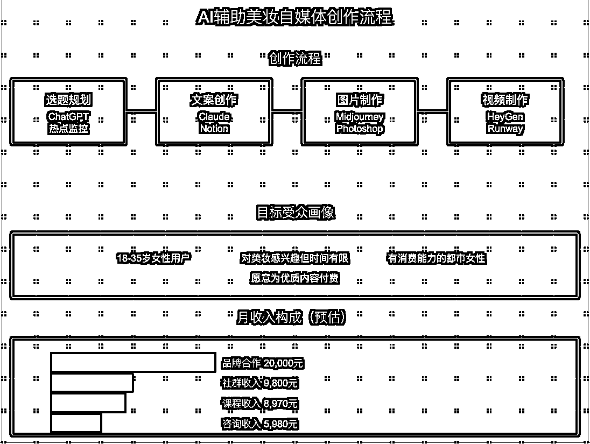

工作流程：

小红是一位美妆领域的自媒体创作者。

每天早上，她使用 ChatGPT 分析热点话题，生成 3-5 个选题方向。以"美妆新品首发测评"为例：

1.  使用 Claude 生成初始文案框架（选题、卖点、体验、总结）

1.  用 Midjourney 生成产品使用效果对比图

1.  通过 HeyGen 生成 AI 配音视频

1.  用 Runway 进行视频剪辑和特效处理

1.  最后由本人进行把关和润色，确保内容的真实性和个性化

具体工具链：

*   选题规划：ChatGPT + 小红书热点监控

*   文案创作：Claude + Notion

*   图片制作：Midjourney + Photoshop

*   视频制作：HeyGen + Runway

*   发布平台：小红书、抖音、B 站

*   数据分析：巨量创意、新媒体管家

目标受众：

*   主要：18-35 岁女性用户

*   对美妆产品感兴趣但没时间深入研究

*   有一定消费能力，愿意为优质内容付费

*   喜欢尝试新品，追求效率的都市女性

变现方式：

*   短期：品牌广告合作（单篇 1000-5000 元）

*   中期：付费社群（月费 98 元，提供个性化美妆建议）

*   长期：个人 IP 商业化（推出自有美妆产品）

*   副业：美妆课程（299 元/课程）

*   咨询：1 对 1 美妆搭配指导（299 元/小时）

收入构成（月收入预估）：

*   品牌合作：20,000 元（4-5 个合作）

*   社群收入：9,800 元（100 位付费会员）

*   课程收入：8,970 元（30 人购买）

*   咨询收入：5,980 元（20 个咨询订单）

总计：约 45,000 元/月

为什么这么多人，想做网红，IP？

因为太赚钱了，

起初我也不解，直到深入这个行业后才明白，

自媒体和个人 IP 已经成为了普通人最容易触达的财富杠杆。

不需要雄厚资金，不需要高端人脉，

你唯一需要的是：建立个人品牌，输出有价值的内容。

AI 技术的发展让内容创作变得前所未有的简单。

用 AI 辅助自己创作，表达。

在 AGI 真正到来之前，这段时间

将是内容创作者的黄金时代。

* * *

# AI 搞钱的底层逻辑

1.  内容变现路径

*   核心资产：优质内容

*   传播渠道：公域平台

*   变现方式：流量转化

*   关键点：内容质量+传播效果

1.  课程变现路径

*   核心资产：知识产品

*   传播渠道：私域社群

*   变现方式：产品销售

*   关键点：课程体系+社群运营

1.  咨询变现路径

*   核心资产：专业能力

*   目标用户：企业客户

*   变现方式：服务交付

*   关键点：解决方案+交付能力

1.  创作变现路径

*   核心资产：IP 价值

*   变现形式：多元化

*   变现方式：IP 授权/衍生

*   关键点：IP 打造+商业开发

1.  产品变现路径

*   核心资产：工具产品

*   目标用户：C 端用户

*   变现方式：产品订阅/销售

*   关键点：产品力+用户体验

这五条路径可以独立发展，也可以相互协同，

形成完整的商业生态。

选择哪条路径，

取决于你核心能力和对 AI 协作能力。


* * *

最后，我们再回到任老这句话

“这个时代一定会降低对人力的需求，但是创造的总财富增加了，

可以养活被裁掉的人。被裁掉的人不干活，少拿点钱；干活的人多拿钱。”

2024 年初，青山机械厂引入了新一代智能生产线。陈师傅在这干了二十年，是老面孔了。

"效率提升三倍。"厂长拿着报表，眼里闪着光。新设备运转的嗡鸣中，陈师傅看着自己的工位，默默收拾工具箱。

六个月后。

"今年产值翻了一番，"股东会上，厂长展示着亮眼的数据，

"人员优化后，人均产出提升显著。"

陈师傅家的客厅里，电视正播着《最强大脑》。"爸，这道题我会！"儿子小明兴奋地喊着。自从不用早出晚归，陈师傅终于有时间陪孩子了。虽然现在拿的是基础保障金，比原来工资少了些，但也够基本生活。

而在生产线上，留下来的张工程师工资涨了不少。"设备需要专业人员进行操作和微调数据，"他擦了擦额头的汗，"责任更大了。"

深夜，陈师傅躺在床上，望着天花板。"也许该去报个编程培训班，"他想着，"听说现在缺维修技术员..."

站在 AI 浪潮的风口，

在这个时代，什么才是真正的个人价值？

过去，我们习惯用收入来衡量一个人的能力。

但收入，不过是生产力的体现。

而生产力，正在被 AI 重新定义。

有人焦虑，有人恐惧。

但我看到的，是前所未有的机遇。

因为真正的个人价值，从来不是简单的劳动产出，

而是那份独特的、不可替代的创造力。

AI 工具就像一把锋利的手术刀，关键在于执刀者的技艺。

所以，核心问题不在于 AI 能否替代我们，

而在于我们能否：

成为 AI 工具的优秀使用者，

让 AI 成为我们能力的延伸，

用 AI 释放更多创造的可能。

工具永远是工具，价值始终在人。

提升认知、拥抱变化、善用工具，

这才是我们下一个人生杠杆。

* * *

作者介绍周知：

AI 觉醒派主理人，AI 工作流专家

AI 觉醒派 COZE 代表作品：

小觉醒思维助手，Suno 音乐歌词专家、智能笔尖，

未来想成为超级个体的你，链接我，

一起探索成为 AI 作家，AI 歌手，AI 艺术家。