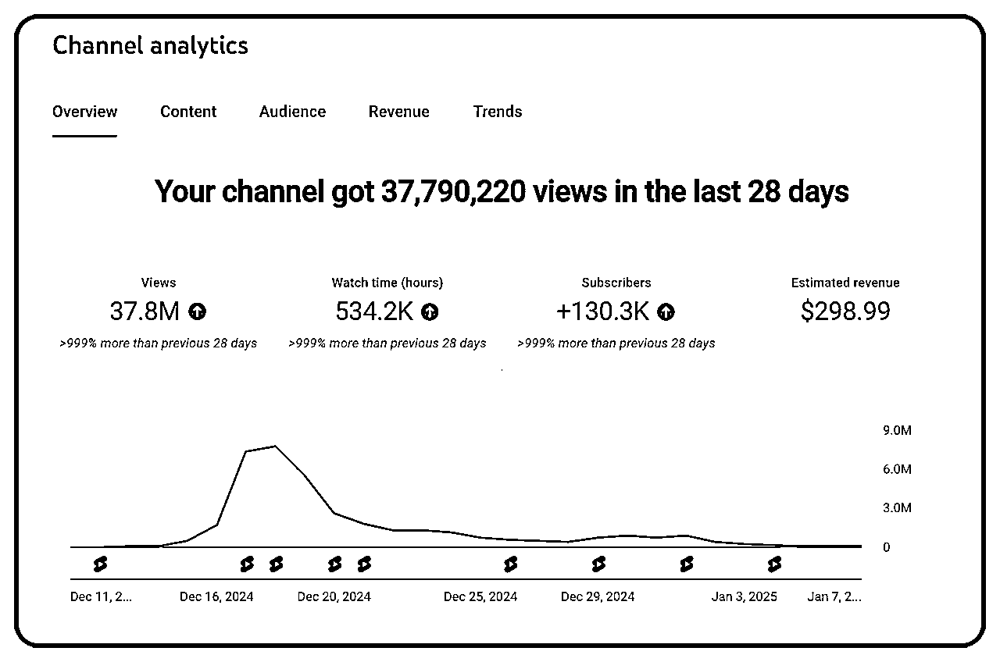
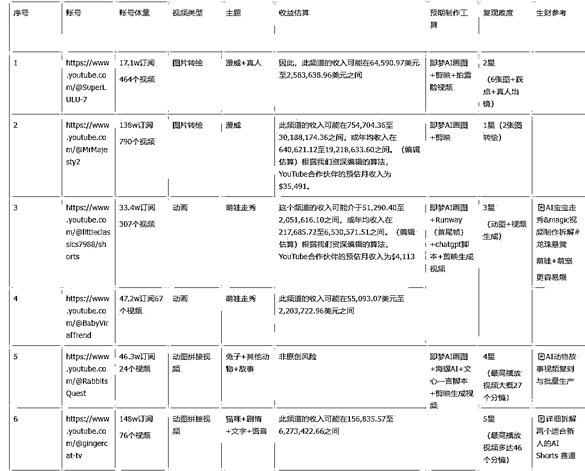
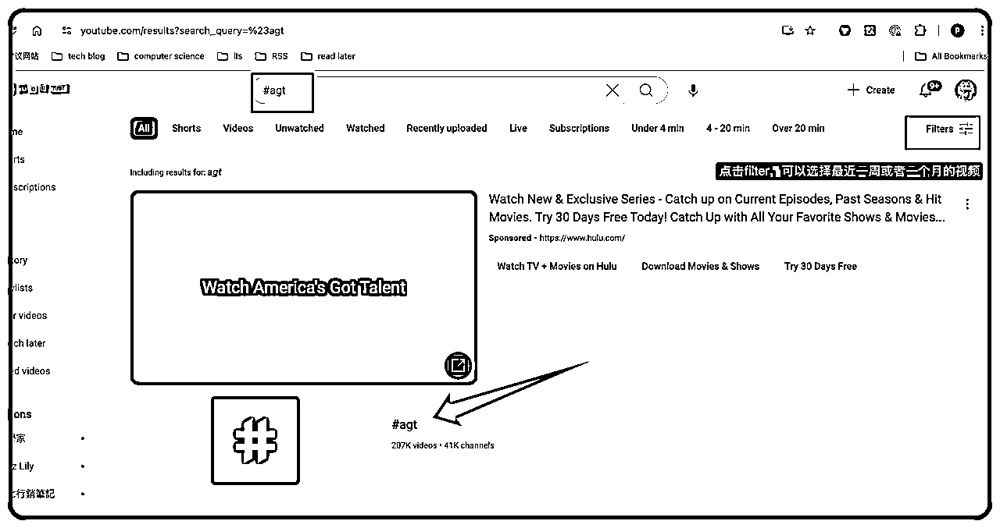
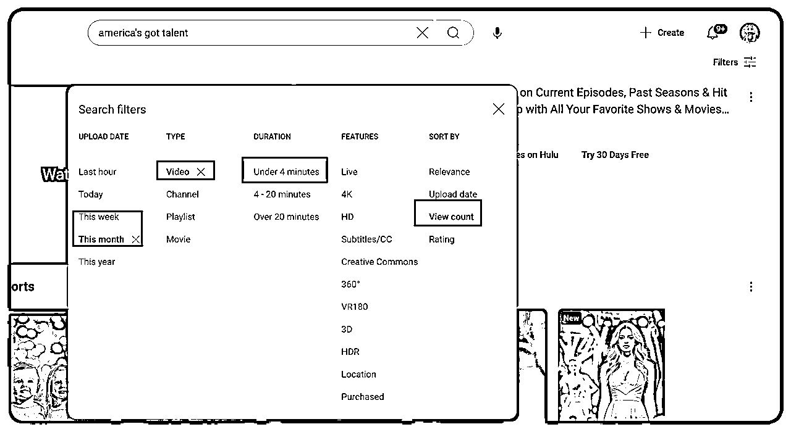
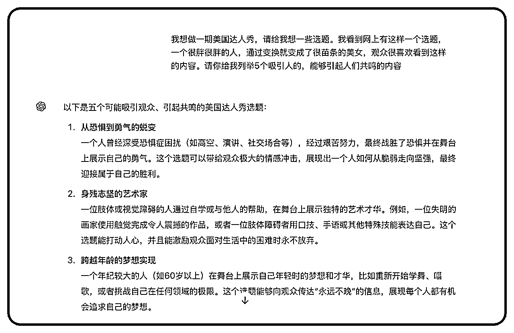
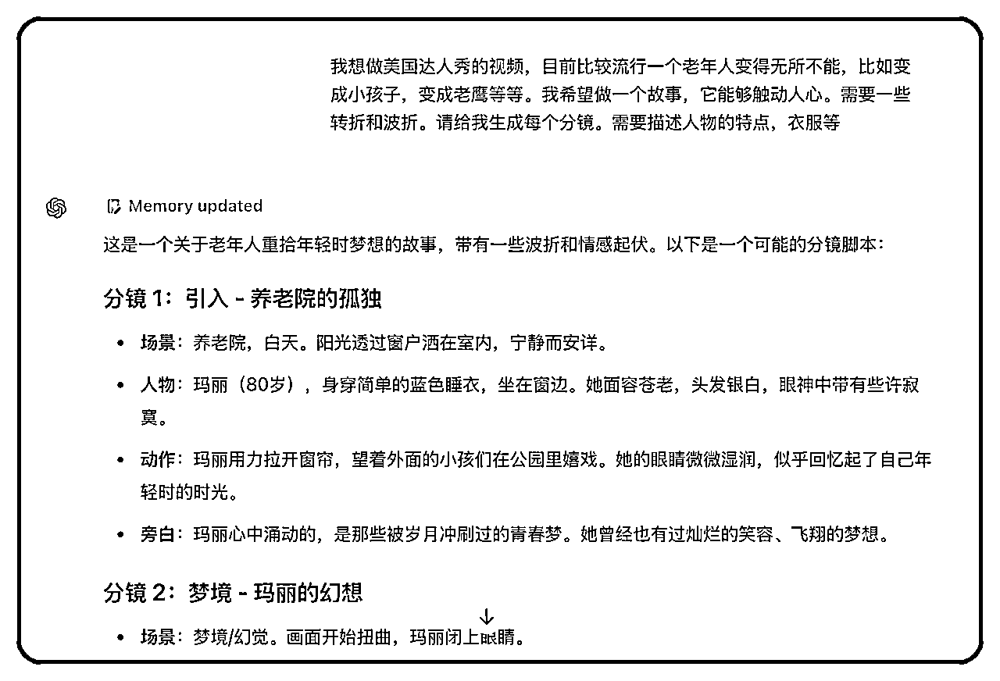
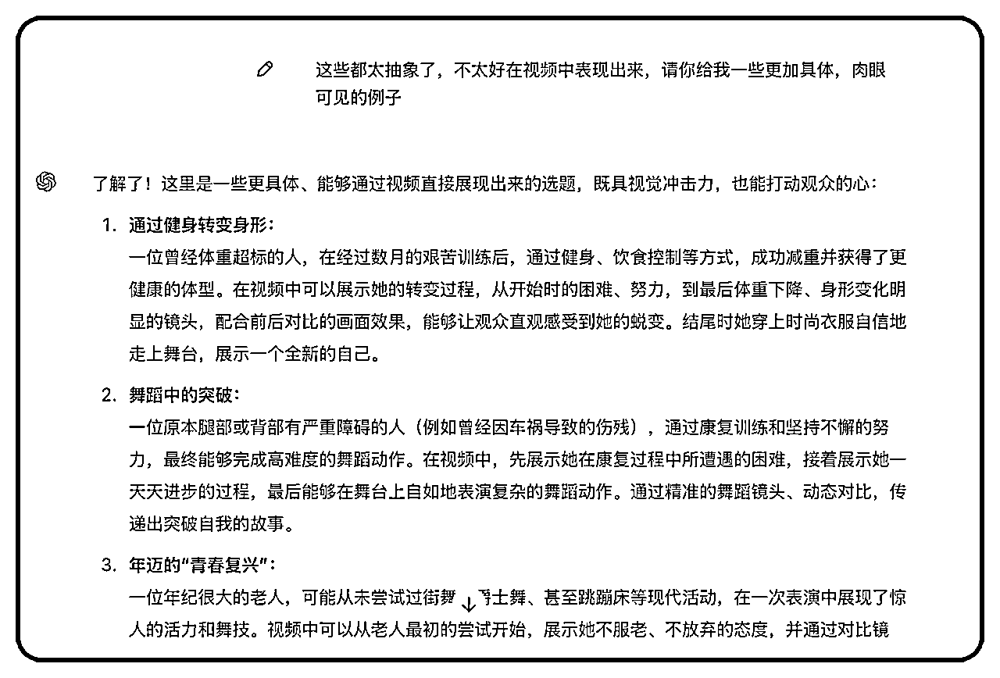
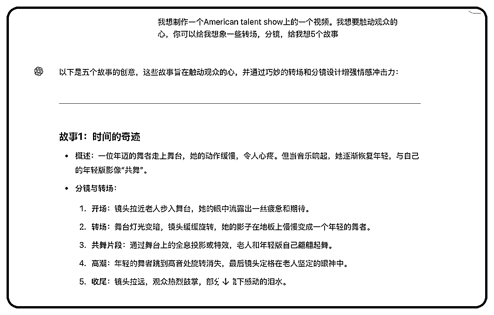
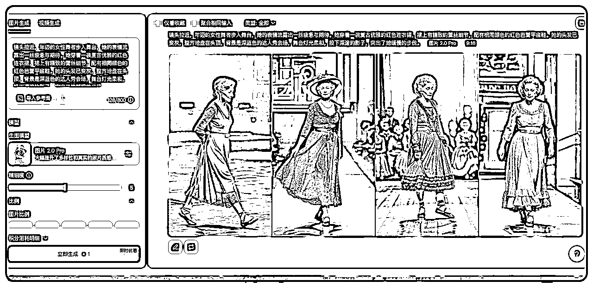
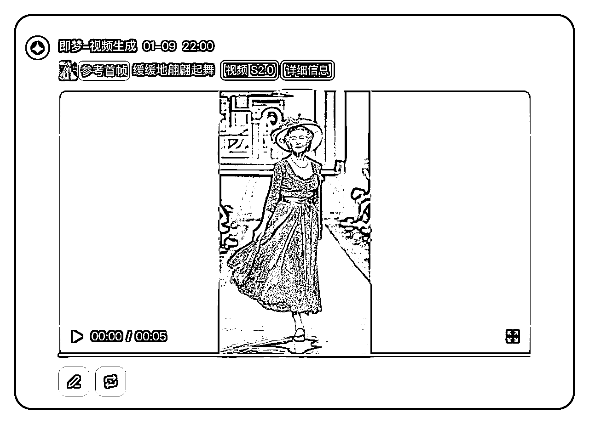

# Youtube Shorts 爆款视频经验分享

> 来源：[https://lwyr88cudi.feishu.cn/docx/PU19d0X8yo66ozxBHxacQ4aFnhe](https://lwyr88cudi.feishu.cn/docx/PU19d0X8yo66ozxBHxacQ4aFnhe)

YouTube Shorts 航海结束已经有一段时间，我对于自己取得的成绩兴奋过一段时间，但对硕果累累马上就抛到脑后，极少对自己夸赞，极少庆功，极其严格要求自己，极度不自信。

看了刘小排的 越快乐才越成功https://scys.com/articleDetail/xq_topic/5121444828812144。 我一下子醍醐灌顶，仿佛打开了任督二脉，我反复读了两遍，并对自己过去的人生做了很久的思考和复盘。我决定从今天起做一个快乐和充满正能量的人。我会时刻reframe自己的大脑。 我也决定分享一下我的Youtube 航海的过程和我赚钱认知上的领悟。

开头写出来了，这很好，因为万事开头难。

先晒一下我的航海成绩。过去28天，3000多万的观看，订阅13万，收入接近300刀。出了4个100万以上播放的爆款视频，以及一个3000万的播放的视频。总体收入不是太高，因为爆款视频出来后，我又发了几个带人头的视频之后，才开通的YPP，稍微损失了一部分前期的广告费。



接下来我会详细分享我是如何利用AI制作视频，希望分享能给大家带来一些帮助。

### 自我介绍

这是我来生财的第三年，第一年在生财学会了引流，一个月赚了10万，认知没到位，没有持续赚到钱。我主业是程序员，有些技术基础底子，AIGC的一些东西理解和执行上手起来比较快。

### Youtube shorts超级标, 照亮我的灯塔

10月底亦仁发布了第二条超级标，与以往不一样，这条超级标像一道闪电，一下子击中了我。仿佛是内心的召唤，这就是我想要做的！虽然我没有做过视频，但亦仁所描述的前景和机会，深深地吸引了我。说干就干，我11月就开始准备账号，看着方波妮，老马等圈友分享的制作步骤开始模仿制作。刚开始做的方向是猫咪跳舞，500 的播放量，很少，但每天还是在坚持。后来刷到达人秀的视频流量很猛，立马去做达人秀。流量一下子来到了万播。持续做了两周，期间有教练的点评和航海的教学，结合着教练点评，我进行了一些调整，视频一下子就来到了百万级别播放。YPP也是经过一轮爆款视频的带动后，一两天的时间就达到了开通的条件。

虽然达人秀这个赛道可能不火了，复盘和分享这个过程的点滴，一些底层的方法应该是相通的。

### 制作过程用到的工具集合

*   大语言模型：ChatGPT，豆包AI

*   图片生成： 即梦AI，可灵AI

*   视频生成： Runway 和 即梦AI

*   视频剪辑：CapCut 剪映海外版

### 制作视频

#### 确定赛道，寻找对标

寻找对标部分，生财里面已经有非常多精华帖。可以先看Youtube Shorts航海手册第三章

https://scys.com/view/docx/CkoidgbmBoL4LkxehYsckPwlnUd#Io33dag5ZoKbexx6N3lcgqfOnCg。

也可以看钱塘江鲤分享过的 。对标账号可以像下面的表格列一下。



我是做达人秀方向的，我会通过搜索tag或者关键词 American got talent 来查找对标视频。找几个播放量不错的对标视频，模仿视频进行制作。https://www.youtube.com/results?search_query=america%27s+got+talent&sp=CAMSBAgEEAE%253D 航海教练分享过通过filter来查看最近一周的爆款视频。





随便找，看哪个播放量不错，评论和点赞都多的就去模仿着做。可以按照下面的表格列一下，进行对标账号分析。文末分享一个我的下载Youtube视频的python脚本，非常好用，我常用来下载对标视频。

#### 视频内容构思

找到一些爆款视频后，我会提取这些爆款视频的元素，比如说一个衣衫褴褛的老头，最后变成了身体强壮又年轻的肌肉男。比如一个人异常肥胖的人，在舞台上很快变瘦很苗条好看。我会在它的基础上做一些变化或者将几个爆款元素进行融合。

我们可以稍微参考一下别人的爆款视频，它爆在哪里。我们可以稍微改一下，不要完全复刻，不然系统容易发现重复，流量就不给力。故事如何构思，你可以问ChatGPT如何设计一个类似的故事。或者你把这个故事跟ChatGPT描述一下，让它修改一下人物的衣服和外表，给你提供一个类似的故事。

##### 2.1 善用ChatGPT

视频的整个剧本和转场的构思，我会利用ChatGPT来帮忙提供一些好的idea。下面举一些例子。

提示词 1: 我想做一期美国达人秀，请给我想一些选题。我看到网上有这样一个选题，一个很胖很胖的人，通过变换就变成了很苗条的美女，观众很喜欢看到这样的内容。请你给我列举5个吸引人的，能够引起人们共鸣的内容

提示词 2: 我想做美国达人秀的视频，目前比较流行一个老年人变得无所不能，比如变成小孩子，变成老鹰等等。我希望做一个故事，它能够触动人心。需要一些转折和波折。请给我生成每个分镜。需要描述人物的特点，衣服等

提示词 3: 这些都太抽象了，不太好在视频中表现出来，请你给我一些更加具体，肉眼可见的例子







根据上面ChatGPT的回复，可以看到一些有意思的选题，大家可以根据自己的兴趣和难易程度来选择。

一些流量跑的不错的视频大部分都有这些特点，有悬念，前三秒抓住人的眼球，有一些转折起伏，最后还有惊喜和意外。做视频其实也是在讲一个故事，它跟文字一样，最好是要有逻辑，让观众看的明白。开头，过度，转折，结尾，起承转合。更高级的，就是教练们提到要引起观众的情感共鸣，这样视频出来效果会不错。

我的一个视频就是加入情感共鸣之后，变成了爆款，甚至看到有生财圈友拿我的视频做复刻。

#### 生成关键帧

目前视频生成还需要依赖垫图，那么这个图就很关键。上一步我们可以得到一个不错的剧本，我们根据这个剧本来生成每个转场的图片的提示词。以下面的剧本为例，我们生成每个关键帧的提示词。



ChatGPT 提示词：

你现在是一个midjourney prompt专家，帮我根据我的剧情分镜进展，给我生成每个分镜的图片prompt。人物的外貌一致的。要真实的人物，为了保证人物在不同的分镜中一致性，要保证衣服的特征是一样的，要有鞋子的细节。鞋子在不同的分镜中保持一致的款式。背景为深蓝色，达人秀会场 故事1：时间的奇迹 概述：一位年迈的舞者走上舞台，她的动作缓慢，令人心疼。但当音乐响起，她逐渐恢复年轻，与自己的年轻版影像“共舞”。 分镜与转场： 开场：镜头拉近老人步入舞台，她的眼中流露出一丝疲惫和期待。 转场：舞台灯光变暗，镜头缓缓旋转，她的影子在地板上慢慢变成一个年轻的舞者。 共舞片段：通过舞台上的全息投影或特效，老人和年轻版自己翩翩起舞。 高潮：年轻的舞者跳到高音处旋转消失，最后镜头定格在老人坚定的眼神中。 收尾：镜头拉远，观众热烈鼓掌，部分人流下感动的泪水。

下面是ChatGPT的回答。


我们把ChatGPT的提示词放到即梦AI里面去生成图片（注意：生成图片的比例要选择9:16，这样是Shorts手机竖屏的尺寸）。

镜头拉近，年迈的女性舞者步入舞台，她的表情流露出一丝疲惫与期待。她穿着一袭复古优雅的红色连衣裙，裙上有精致的蕾丝细节，配有相同颜色的红色芭蕾平底鞋。她的头发已变灰，整齐地盘在头顶，背景是深蓝色的达人秀会场，舞台灯光柔和，投下深邃的影子，突出了她缓慢的步伐。



效果不错，如果我们想要让人物一致性更好，可以让ChatGPT在生成提示词的时候，把人物的服装，发型，发色，穿戴都统一一下。我们把剩下的提示词都一个个拿到即梦AI里面去生成。

#### 视频生成

视频生成我用过即梦AI，可灵AI还有Runway，总体来说，Runway表现力还是不错的，它生成出来的人物会非常高清，脸变形的情况也比较少。在制作一些人变怪兽之类的视频的时候，Runway的效果也是最好的。即梦的视频生成也可以用，但是生成的质量需要多次抽卡。

生成视频的prompt不需要太复杂。下面是一个即梦AI图生视频的例子。



达人秀里面比较吸引观众的就是有一些人物的变换，比如人变成一头大北极熊，美女变野兽等。有些圈友不太清楚这里是怎么做到的。

举一些例子，这个变换需要用到两个图片，两张图片中的物体如果颜色形态差不多的话， 我们用简单的提示词，搭配一个合理的运镜就可以成功变换。比如：the lizard stand up, low angle shot。

如果是人物之间的变换，很容易出现幻灯片的状态，我们可以把两张图片的背景给它做成一样的，这样在生成视频的时候就更容易出现有意思的变换效果。背景变成一样我们可以用PS抠图，把两个人物都放置在一样的背景里面去。比如下面这个视频的提示词：the woman transform。

#### 发布视频

最后视频剪辑用的是剪映海外版CapCut，剪辑方面就不多说了，把一些对标视频的美国达人秀的真人片段和自己生成的视频片段拼接在一起，变一下速度，添加一个背景音乐即可。

发布视频，我们需要有一些标题和描述。描述我找到了网上的对标，我会让ChatGPT帮忙生成我的视频的描述。

请帮我写一段视频的介绍，按照下面的格式输出。我的视频内容是关于一个女表演者，她在台上跳舞，变成了年轻时候的自己，和年轻时候的自己共舞。观众们欢呼

Title: Baby Meets Cat: A Fusion of Cuteness and Charm

Description: Prepare to be charmed by a young boy and his adorable cat as they step onto the America's Got Talent stage! With each playful movement, the boy captures the hearts of the audience. Starting his act with a cheeky attempt to transform, he teases the crowd as the magic seems to falter—prompting a laugh from the host. But then, with a leap onto the stairs, the unexpected happens! The host is left stunned as the boy morphs into a playful cat and mischievously escapes. This magical act is sure to delight everyone watching! Tags: Magic act, boy and cat performance, AGT 2024, transformation magic, playful act, heartwarming performance, AGT highlights

Hashtags: #AGT2024 #MagicTransformation #BoyAndCat #PlayfulPerformance #CatMagic #AmericasGotTalent #AGT

标题和描述都准备好之后，剩下的部分就按照航海手册里面讲到的，去勾选，最后立即发布就可以啦。

### 附下载视频的脚本

视频下载后，可以通过 ffmpeg 命令将视频的关键帧抽出来。具体可以问Cursor ffmpeg 的安装和使用详情。

```
ffmpeg -i ./origin_file/youtube.mp4 -vf fps=1 ./out/frame_%06d.jpg
```

### 开通YPP

YPP的开通在航海手册里面也有写，我按照航海手册和一些油管博主的视频，提交了申请之后，不到一天的时间就开通了。有了一个账号的开通经验后，后续其他赛道的尝试，也会游刃有余许多。

### 心态上的变化

做的过程中，我一直在记录自己的心得体会。经历过一些起伏，但幸运的是有亦仁的解答，还有众多圈友的鼓励，我会坚持下去，赚钱的路上，无非就是遇到瓶颈，解决问题，突破瓶颈，更上一层楼。我跟自己说，上一次放弃做副业到底是什么原因？ 我不记得了。但这次，当闪电劈下来的时候，我一定要在场！！

### Reference