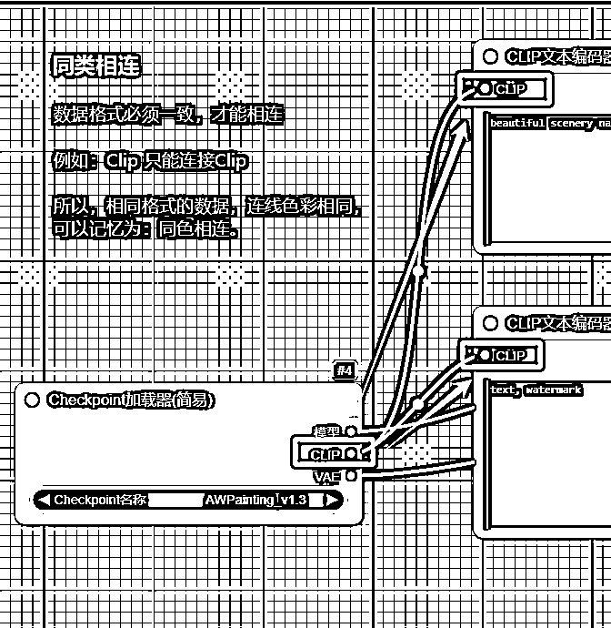
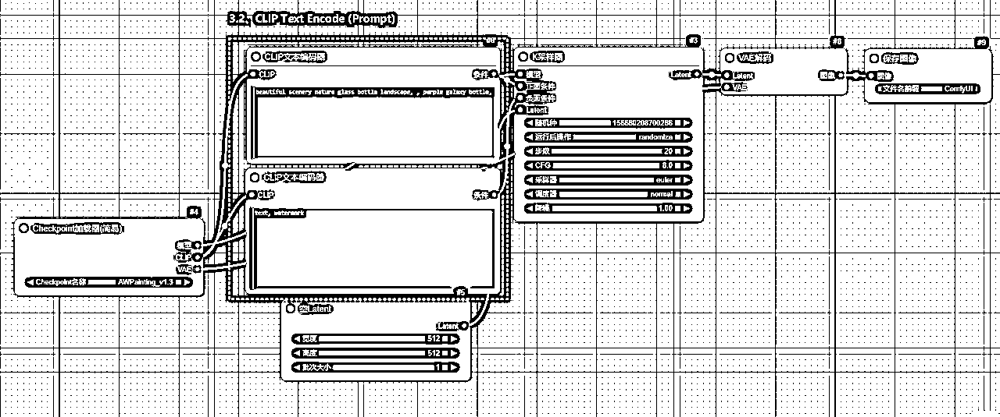
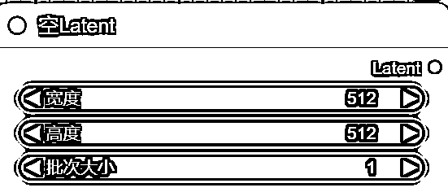
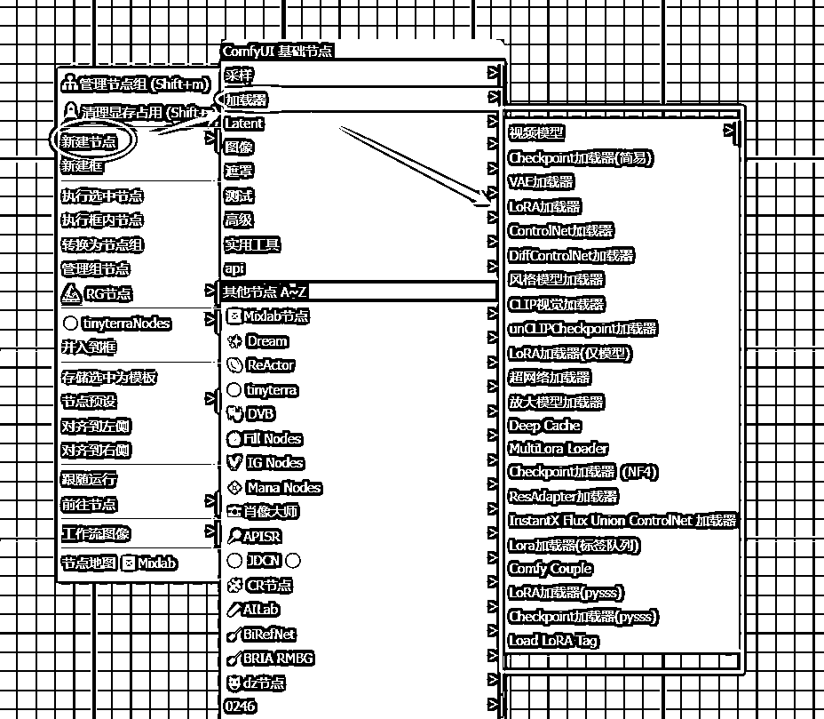
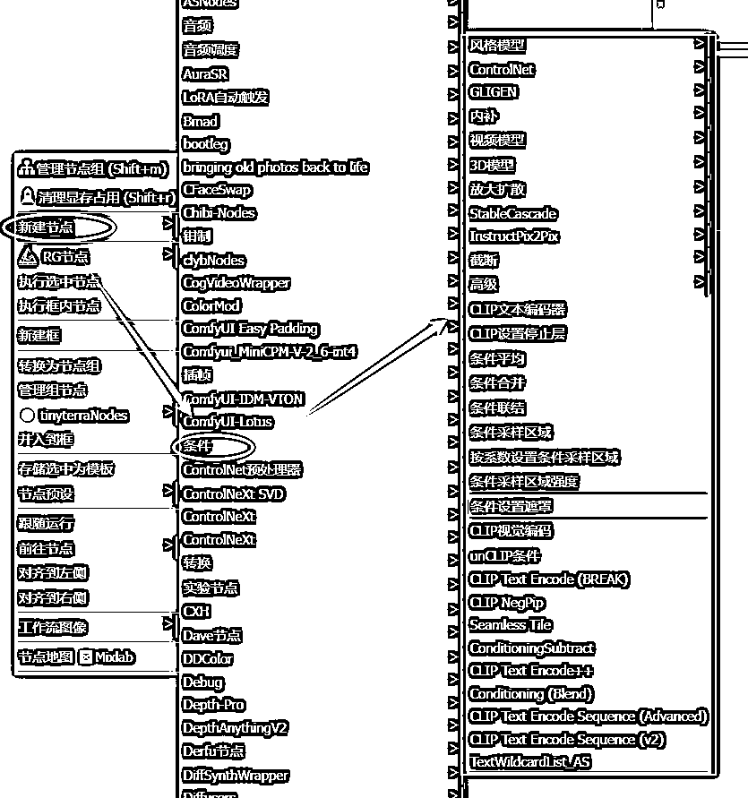
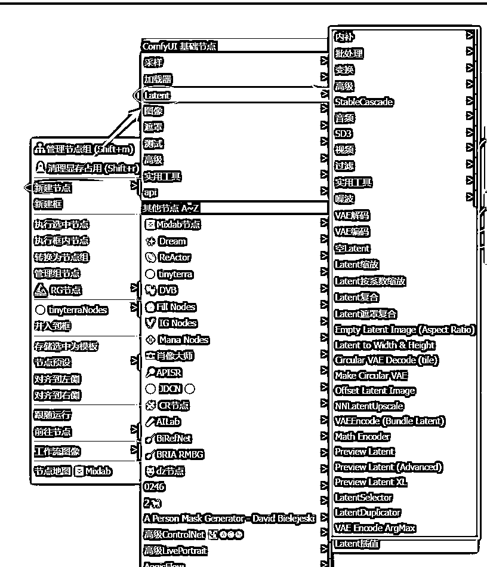

# 3 步掌握 ComfyUI：小白也能快速入门的保姆级指南

> 来源：[https://ytsvsr6zj8.feishu.cn/docx/PaDFdYQ7zosmtWx35O9cpwdenEY](https://ytsvsr6zj8.feishu.cn/docx/PaDFdYQ7zosmtWx35O9cpwdenEY)

# 一、理念篇

## 前言

参加了 2024 年12月 comfyui 航海，这才发现：无论是学习 Comfyui ，还是想熟练运用它，门槛都不低，多数时间都是满脑袋问号。

怎么样能快速掌握 comfyui 呢？

我把学习 comfyui 的经验，分成 3 步，快速上手 comfyui，为你全面运用 comfyui 打下基础，这也是本文的重心所在：

我是产品经理，所写文字，尽量叫你一看就懂。可是，我也是初学者，很多知识点，是否理解到位，不敢保证。

若有疏漏，敬请指导。

另：里面的很多内容，或我问 Ai ，或参考他人的文档，综合而成，确实做不到了一一原创了。

hi，认识你很高兴，i am 望月

## 了解 comfyui 的功能

### 主要功能：文生图

一言概之：文生图（Text-to-Image）

这是 ComfyUI 的核心功能，也是最常用的功能。创作者能够通过文字描述，生成复杂的艺术作品。

Ai 产品升级迭代飞快，comfyui 应用领域，并不局限于文生图，还有其他领域，例如：Ai 图像（最常用）、Ai 视频、Ai 音频、Ai 3D、Ai 文本等等。

知识点：文生图工作原理

第 1、输入提示词：用户输入一段文字描述，通常是关于图像的内容、风格、色调、氛围等方面的提示。

比如：“一只穿着西装的猫，站在城市的街头，背景是傍晚的光景”。

第 2、模型解析：AI 模型会分析输入的文本，理解其中的关键词和语境，并基于其理解来生成图像。

例如，模型会识别“西装”、“猫”、“城市街头”和“傍晚光景”这些元素，并根据它们之间的关系，构建出符合这些描述的图像。

第 3、生成图像：模型根据解析后的文本信息，通过一系列复杂的数学计算（通常是基于卷积神经网络、扩散模型等技术），生成图像。最终的图像呈现出来，用户可以根据需要进行进一步编辑和优化。

### 体验 comfyui

新手推荐在线模式，优先上手使用，体会。熟悉了之后，再转入本地。

推荐：https://www.liblib.art/

本地安装，无论是电脑硬件，下载对应的模型，插件，包含了一系列设置，确实要耗费蛮多时间。新手不建议上来就执行这一步。

## 学习 comfyui 核心概念

### 工作流 （workflow）概念

你看到图片上的一个一个黑色矩形，就是节点（node），每个节点依照一定的顺序，依靠连线（"connections" 或 "links"）前后相连，一步步，共同完成某一具体任务，这种方式就是所谓的工作流（workflow）。

简单理解工作流：工作流，是按照一定步骤，先后有序，完成特定任务。

注：工作流并不是一个新鲜的概念，相反，有一点历史了，而且很多领域都有用工作流。（例如 2B 领域内，不过它会有另外的名字，例如，业务流，操作流等等）

为什么要使用工作流呢？

第1、依需而建：自由搭建适合你自己的工作流，而不是受到各种各样的限制。（也正因如此，提高了学习门槛）

第2、自由拓展：可以使用、改造别人的工作流，或者新建属于自己的节点，灵活应对待解决的问题。

工作流概念：

*   节点和连线的有序组合

*   完整的处理流程

*   可重复使用的任务模板

*   类似程序中的执行流程

工作流优势：

*   直观可视化

*   易于修改

*   方便调试

*   可保存复用

### 节点 （node）概念

工作流中每一黑色的矩形，叫节点（node），每个节点负责某一具体功能（程序设计里面模块化的思路）

Comfyui 里面每一个方块，称之为 Node（节点）

左侧端的点是Input（输入）端，

右侧是Output（输出）端，

每个节点里都会有对应的配置项，称之为 Parameter (参数)

节点特点：

*   每个黑色矩形代表一个功能模块

*   单一职责原则，专注特定功能

*   可独立配置和调试

*   类似程序设计中的函数或类

节点类型举例：

*   模型加载节点

*   文本编码节点

*   K采样器节点

*   VAE解码节点

### 连线（Connections）概念

连线是把每一个单独的节点前后相连，而后形成一个完整的工作流。

连线作用：

*   定义数据流向

*   连接各个功能节点

*   传递处理结果

*   类似程序中的数据传递

连线特点：

*   有明确的输入/输出端口

*   保证数据类型匹配

*   支持多输入多输出

#### 知识点：怎么样连线？

##### 同类相连

连线只能是连接同类数据，不同数据格式，无法相连。

可以记忆为：同色相连

##### 左进右出

其实就是节点的特点，左边为输入数据，供某个节点使用，节点加工后的数据，从右侧输出。

也就是说，把某一个节点的输入数据，再输入给下一个节点的输入端。

##### 一进多出

左侧的输入端，只能接收一条线。

右侧的输出端，则可以输出多条连线。

## 理解文生图功能：节点

学习了 comfyui 的核心概念，下一步，就是理解 Comfyui 的核心功能。

这一部分，先由节点展开，而后是工作流，理解了节点与工作流的关系，等于掌握了文生图功能，也就等于掌握了comfyui 的核心功能。

文生图的功能，官方会默认给你加载一最基础的工作流，必要的节点如下：

### checkpoint 加载器 （Load Checkpoint）

Checkpoint 加载器是所有 ComfyUI 工作流的起点，用户需要先加载 Checkpoint ，才能开始配置和运行生成任务。

Checkpoint 是 Stable Diffusion 模型的核心，包含了 MODEL（UNet）、CLIP 和 VAE 三个部分，分别负责去噪、文本理解和图像解码，共同完成从文本到图像的生成过程。

### CLIP 文本编码器 （CLIP Text Encode）

CLIP 全称是 Contrastive Language-Image Pre-training，即对比文本图像预训练。

这个节点主要是输入 Prompt：

一般会有两个这样的节点，一个是正向的 Prompt，列你希望在图片中看到的内容；

另一个是负向的 Prompt，列你不希望在图片中出现的内容。

1、Prompt 并不是越长越好，尽量保持在 75 个 token（或约 60 个字）以内。

2、使用逗号分隔。StableDiffusion 并不懂语法，需要的关键词罗列出来即可，用逗号（英文半角符号）分隔。

3、越重要的词，越放在靠前的位置。例如：想要生成一张美丽的风景图，将 beautiful scenery nature 放在最前面。

### 空-潜空间图像节点 （Empty Latent Image）

空的潜空间图像节点，调整最终生成的图片的大小，就需要调整 width（宽）、height（高）这两个值。

batch_size：批次，则是设置每次运行时生成的图片数量，设置成了 6，就意味着每次会生成 6 张图。

比例关系：8 的倍数，即图片的宽、高，都是 8 的倍数。

### K 采样器（KSampler）

KSampler，Sampler 中文名称是采样器，K 采样器是 ComfyUI 中的一个核心模块，负责生成图像的主要过程。

K 采样器就像是一个"画家"，它负责把你的文字描述（prompt）一步一步变成图像。

它的工作过程是从一张充满噪点的图片开始，慢慢把噪点去掉，最终形成你想要的图片。

### VAE 解码

VAE解码的英文全称是 "Variational Autoencoder Decode"，中文名称是“变分自编码器解码

VAE解码器是 ComfyUI 一个重要的组件，其作用，是将潜在空间中的信息转换为可视化的图像。

### 保存图像

这一节点的功能，是最容易理解的，其主要职责：

*   处理图像格式

*   设置保存路径

*   控制文件命名

*   选择压缩方式

## 理解文生图功能：工作流

节点用连线前后连接起来，就形成了工作流，comfyui 的核心功能，文生图，正是依靠工作流来完成。

总结一下，comfuyi 的文生图工作流如下：

我们把上面提到的各个节点，分别汇入到这个流程中：这个时候，你大概知道 comfyui 的工作流是怎么样开展了。

接下来就是要详细掌握各个节点，也就是comfyui的基础节点

## 掌握 5 大基础节点：加载器

### 目前模型加载节点（Model Loading）

吐槽

作为产品经理，我一次次佩服 AI 类产品的 Ui 设计，真是烂！！！

功能强大，半点都不否认。

Ui设计之烂，一个比一个烂，个个都奇葩。

初学者，初次面对，这么乌压压一堆加载器，知道每个都是做什么的吗？

而且把这么多功能，都集中在鼠标里，也是烂设计。

不过，还得学。

### 加载器节点-核心作用

第1、基础模型加载

Checkpoint加载器：

*   加载AI绘画的核心模型

*   初始化基本生成能力

*   决定基础生成风格

第2、特殊功能加载

专业加载器：

*   ControlNet：加载控制模型

*   放大模型：加载超分辨率模型

*   视频模型：加载动态处理模型

第3、风格调整加载

风格加载器：

*   LoRA：加载风格微调模型

*   超网络：加载网络增强

*   风格模型：加载特定风格

比喻说明

想象准备画画的过程：

加载器就像：

├── 选择画笔类型

├── 准备颜料组合

├── 调配工具材料

└── 设置画板环境

### 分类理解加载器

感谢伟大的 Ai，可以叫 Ai 直接给你分类，然后快速抓住精髓。

#### 基础层-加载器（必学）

核心功能：

├── Checkpoint加载器(简易) - 基础模型加载

├── VAE加载器 - 图像编码解码

└── LoRA加载器 - 基础风格微调

掌握目标：

*   完成基础文生图

*   理解核心工作流

#### 进阶层-加载器（常用）

图像控制：

├── ControlNet加载器 - 精确控制生成

├── DiffControlNet加载器 - 差异化控制

└── InstantXFluxUnionControlNet加载器 - 联合控制

风格调整：

├── 风格模型加载器 - 风格应用

├── LoRA加载器(仅模型) - 专注模型加载

├── MultiLora Loader - 多重风格

└── Load LoRA Tag - 标签式加载

图像优化：

└── 放大模型加载器 - 提升分辨率

#### 专业层-加载器（特殊需求）

视觉处理：

├── CLIP视觉加载器 - 视觉理解

├── unCLIPCheckpoint加载器 - 特殊检查点

└── Deep Cache - 深度缓存

高级功能：

├── 超网络加载器 - 网络增强

├── Checkpoint加载器(NF4) - 特殊格式

└── ResAdapter加载器 - 适配器加载

特殊应用：

├── 视频模型 - 视频处理

├── Comfy Couple - 模型配对

└── Lora加载器(标签队列) - 队列处理

#### 定制层-加载器（扩展）

自定义加载：

├── LoRA加载器(pysss) - Python扩展

└── Checkpoint载器(pysss) - 定制检查点

## 掌握 5 大基础节点：条件

条件节点的核心作用是"引导和控制"生成过程。

注：

上面工作流所提到的，CLIP 文本编码器 （CLIP Text Encode），主要是用于提示词的输入，其实就是一个条件节点

### 目前条件节点

### 条件节点-核心作用

节点核心作用

第1、引导生成方向

就像画画：

├── 提示词：告诉AI"画什么"

├── 参考图：告诉AI"怎么画"

└── 控制条件：告诉AI"画得更精确"

第2、控制生成细节

精确控制：

├── 构图布局

├── 风格特征

├── 细节表现

└── 生成区域

具体应用场景

第1、文本引导

CLIP文本编码器：

*   将文字描述转换为AI理解的特征

*   指导生成符合描述的图像

*   控制图像的内容和风格

第2、图像引导

ControlNet：

*   使用参考图像控制生成

*   保持构图、姿势、线条等

*   提供精确的视觉引导

第3、条件采样区域：

*   控制特定区域的生成

*   调整不同区域的生成强度

*   实现局部精确控制

比喻说明

想象一个画画的过程：

加载器：准备画笔和颜料

条件节点：

├── 画画的参考资料

├── 构图的指导线

├── 色彩的参考样本

└── 细节的示范图

### 分类理解条件节点

#### 基础层-条件节点（必学）

文本条件：

├── CLIP文本编码器 - 基础文本编码

├── CLIP Text Encode++ - 增强版文本编码

└── CLIP NegPip - 负面提示处理

视觉条件：

└── CLIP视觉编码 - 图像特征提取

#### 控制层-条件节点（常用）

精确控制：

├── ControlNet - 图像引导控制

├── GLIGEN - 布局控制

└── 内补 - 图像修复

增强控制：

├── 放大扩散 - 提升分辨率

└── StableCascade - 级联生成

#### 条件处理层-条件节点（进阶）

条件组合：

├── 条件平均 - 多条件平均

├── 条件合并 - 条件组合

├── 条件联结 - 条件连接

└── Conditioning (Blend) - 条件混合

条件区域：

├── 条件采样区域 - 区域控制

├── 按系数设置条件采样区域 - 系数控制

└── 条件采样区域强度 - 强度控制

#### 特殊应用层-条件节点（专业）

特殊处理：

├── 截断 - 条件截断

├── CLIP设置停止层 - 层级控制

└── Seamless Tile - 无缝平铺

高级功能：

├── unCLIP条件 - 特殊条件处理

├── InstructPix2Pix - 图像指令处理

└── 3D模型 - 3D相关条件

#### 序列和通配符-条件节点（扩展）

序列处理：

├── CLIP Text Encode Sequence (Advanced)

├── CLIP Text Encode Sequence (v2)

└── TextWildcardList_AS

## 掌握 5 大基础节点：Latent

### 目前latent 节点

### latent 节点-核心作用

核心作用

第1、潜空间操作与管理

就像在画布上：

├── 创建画布：空Latent

├── 调整画布：缩放变换

├── 合并画布：复合操作

└── 预览效果：潜空间预览

第2、数据转换与处理

空间转换：

├── 图像→潜空间（VAE编码）

├── 潜空间→图像（VAE解码）

├── 尺寸变换

└── 特效处理

具体应用场景

第1、潜空间准备

第2、中间处理

第3、转换控制

比喻说明

想象绘画过程中的画布操作：

Latent就像：

├── 准备画布（创建空间）

├── 调整画布大小（缩放）

├── 拼接多个画布（复合）

└── 转换展示效果（编解码）

### 分类理解 latent 节点

#### 基础层-latent（必学）

基础操作：

├── 空Latent - 创建基础潜空间

├── VAE编码 - 图像转潜空间

├── VAE解码 - 潜空间转图像

└── Latent缩放 - 基础尺寸调整

预览功能：

├── Preview Latent - 基础预览

└── Preview Latent XL - SDXL预览

#### 变换层-latent（常用）

尺寸处理：

├── Latent按系数缩放 - 比例缩放

├── NNLatentUpscale - 神经网络放大

└── Latent to Width & Height - 精确尺寸

组合处理：

├── Latent复合 - 基础组合

├── Latent遮罩复合 - 遮罩组合

└── Offset Latent Image - 偏移处理

#### 高级处理层-latent（进阶）

特殊处理：

├── 内补 - 图像修复

├── StableCascade - 级联处理

└── Latent插值 - 渐变过渡

批量处理：

├── 批处理 - 批量生成

├── LatentSelector - 选择器

└── LatentDuplicator - 复制器

#### 专业应用层-latent（特殊需求）

特殊功能：

├── Circular VAE Decode - 圆形解码

├── Make Circular VAE - 圆形编码

└── VAE Encode ArgMax - 最大值编码

媒体处理：

├── 音频 - 音频相关

├── SD3 - SD3.0特性

└── 视频 - 视频处理

#### 工具层-latent（辅助）

辅助工具：

├── Math Encoder - 数学编码

├── VAEEncode (Bundle) - 批量编码

└── Empty Latent (Aspect Ratio) - 比例创建

## 掌握 5 大基础节点：采样器

### 目前采样器节点

### 采样器节点-核心作用

核心作用

第1、噪声处理与图像生成

就像画家作画的过程：

├── 从模糊到清晰（去噪过程）

├── 控制细节程度（采样步数）

├── 把握整体风格（CFG指引）

└── 调整绘制方式（采样算法）

第2、生成过程控制

精确控制：

├── 生成速度（步数设置）

├── 生成质量（采样算法）

├── 细节保真（去噪强度）

└── 提示词匹配度（CFG值）

具体应用场景

第1、基础生成控制

标准采样：

*   控制图像生成节奏

*   平衡速度与质量

*   确保生成稳定性

第2、质量优化

高级采样：

*   提升细节表现

*   增强图像质量

*   优化生成效果

第3、特殊需求处理

专业采样：

*   处理大尺寸图像

*   实现连续生成

*   应对特殊场景

比喻说明

想象一个画家的创作过程：

采样器就像：

├── 画家的手法（采样算法）

├── 绘画的节奏（步数）

├── 修改的力度（去噪强度）

└── 参考图的对照（CFG）

### 分类理解采样器

#### 基础层-采样器（必学）

基础采样：

├── K采样器 - 标准采样器

├── K采样器(高级) - 高级控制版本

└── K采样器(简易重启) - 基础重启功能

#### 重启增强层-采样器（进阶）

重启系列：

├── K采样器(重启) - 标准重启

├── K采样器(高级重启) - 高级重启控制

└── KSampler With Restarts (Custom) - 自定义重启

#### 序列处理层-采样器（专业）

序列采样：

├── KSampler Sequence - 基础序列

├── KSampler Sequence (v2) - 增强序列

└── Plasma KSampler - 特殊效果采样

#### 特殊应用层-采样器（高级）

特殊处理：

├── K采样器(高级分块) - 高级分块控制

├── K采样器(分块) - 基础分块处理

└── 逆K采样器 - 反向采样处理

#### 专业模型层-采样器

模型特化：

├── 自定义采样 - 自定义控制

└── 视频模型 - 视频专用采样

## 掌握 5 大基础节点：图像

### 目前图像节点

### 图像节点的核心作用

核心作用

第1、图像处理与转换

就像后期处理工作：

├── 图像加载（输入处理）

├── 图像编辑（调整修改）

├── 效果处理（滤镜特效）

└── 图像导出（保存输出）

第2、质量控制与优化

图像优化：

├── 尺寸调整（放大缩小）

├── 清晰度提升（超分辨率）

├── 颜色处理（色彩调整）

└── 细节增强（图像锐化）

具体应用场景

第1、基础图像处理

常规操作：

*   加载参考图像

*   保存生成结果

*   预览中间效果

第2、图像编辑增强

编辑功能：

*   裁剪与缩放

*   颜色调整

*   图像合成

第3、专业效果处理

高级处理：

*   风格迁移

*   图像修复

*   特效添加

比喻说明

想象照片后期处理：

图像节点就像：

├── 照片导入（输入）

├── PS处理（编辑）

├── 滤镜应用（效果）

└── 成片导出（输出）

### 分类理解图像节点

#### 基础层-图像节点（必学）

基本操作：

├── 加载图像

│ ├── 加载图像

│ ├── Load Image From Path

│ └── Load Image From Path With Meta

│

├── 保存图像

│ ├── 保存图像

│ ├── Save Image Custom Node

│ └── Save Image Webp Node

│

└── 预览图像

#### 图像处理层-图像节点（常用）

尺寸调整：

├── 图像缩放

├── Resize Image

├── Resize Scale Image

├── Resize Shortest To

└── Resize Longest To

基础编辑：

├── 图像反转

├── Rotate Image

├── Brightness

├── Contrast

└── Sharpness

颜色处理：

├── 颜色调整

├── Convert RGB

├── Convert Greyscale

└── StableSRColorFix

#### 高级处理层-图像节点（进阶）

合成与遮罩：

├── 图像遮罩复合

├── composite

└── 图像组合批次

外补处理：

├── 外补画板

├── 外补画板 (遮罩)

└── 外补画板 (尺寸)

特殊效果：

├── effects

├── filter

└── transformation

#### 专业工具层-图像节点（特殊需求）

AI增强：

├── OpenPose Editor

├── CLIP语义分割

└── WD14反推提示词

透明处理：

├── Inspyrenet Rembg

└── Inspyrenet Rembg Advanced

圆形处理：

├── Round Image (Pad/Crop)

└── Round Image (Pad/Crop) (Advanced)

#### 批处理工具层-图像节点

批量处理：

├── Load Images For Loop

├── ImageSelector

└── ImageDuplicator

限制处理：

├── 限制图像为视频

└── 限制图像区域

## 值得下载10个模型

从上面可以看出来，模型质量，很大程度决定了你最后成图的质量，找好对应的模型，根据自己的需要去练习。

模型有很多，可以从下面的 10 个模型开始：

https://www.comflowy.com/zh-CN/blog/ten-models-worth-downloading

Liblib 搜对应的名字就可以了。

# 二、实践篇

## 运用 Comfyui 生成图片方式

Comfyui 擅长生成图片，但发展到今天，生成图的方式，已经是多种多样了。

目前我也是新手，这一部分还在练习，所以，只是在这里简单列举一下，后面再补充。

### 文生图 （text to image）

定义：通过输入文字提示，生成相应的图片。主要依赖于文字描述来引导图像生成。

例子：输入提示词“夏日沙滩上的日落”，模型生成一幅展现海滩、太阳下沉的美丽画面

### 图生图 (image to image)

定义：通过一张已有的图片和文字提示共同生成新的图像，图片作为补充信息，增强生成效果。

例子：输入一张草地的图片，再加上提示词“加上一个在草地上打高尔夫的人”，模型会在原图基础上生成一个人物并修改场景。

### 提升分辨率（Upscale）

定义：将图片的分辨率提升，使其更加清晰或细节更加丰富。

例子：输入一张低分辨率的风景照，使用 Upscale 功能后，图片细节变得更清晰，边缘更加锐利。

### 局部重绘（Inpainting）

定义：在图片的指定区域进行修改或补充，通常用于修复缺失、损坏的部分，或者创作新的细节。

例子：在一张人物画像中，模型可以用 Inpainting 来修复或替换人物的衣服、背景或其他缺失的部分。

### 扩展外部（outpainting）

定义：在现有图像的边缘扩展区域，创造更多的背景或场景，类似于扩展图像的画布。

例子：给一幅城市街景图像增加更多的街道、建筑物或天空，甚至是延伸到更多的地理场景。

### 风格迁移（ContorlNet）

定义：通过输入图片的结构信息（如简笔画、轮廓、边缘等）来控制图像生成的风格和内容。

例子：输入一张简单的轮廓图，模型根据轮廓生成详细的艺术画作，或者输入一张现实图片，并控制其风格为油画、素描等。

## 

（本文止。实践篇的心得体会，后面会更新上来。）