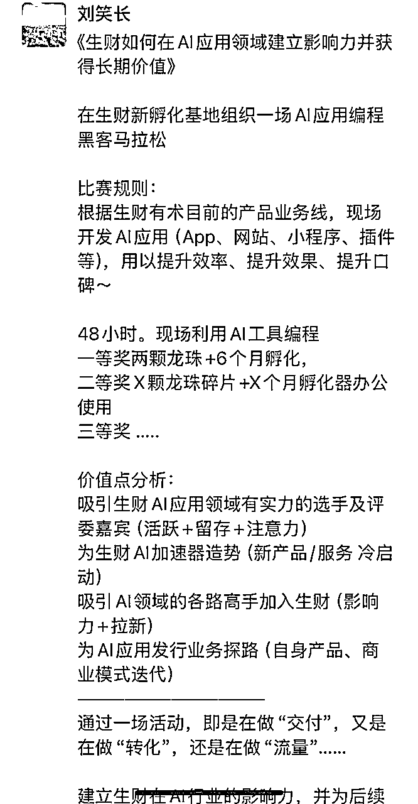
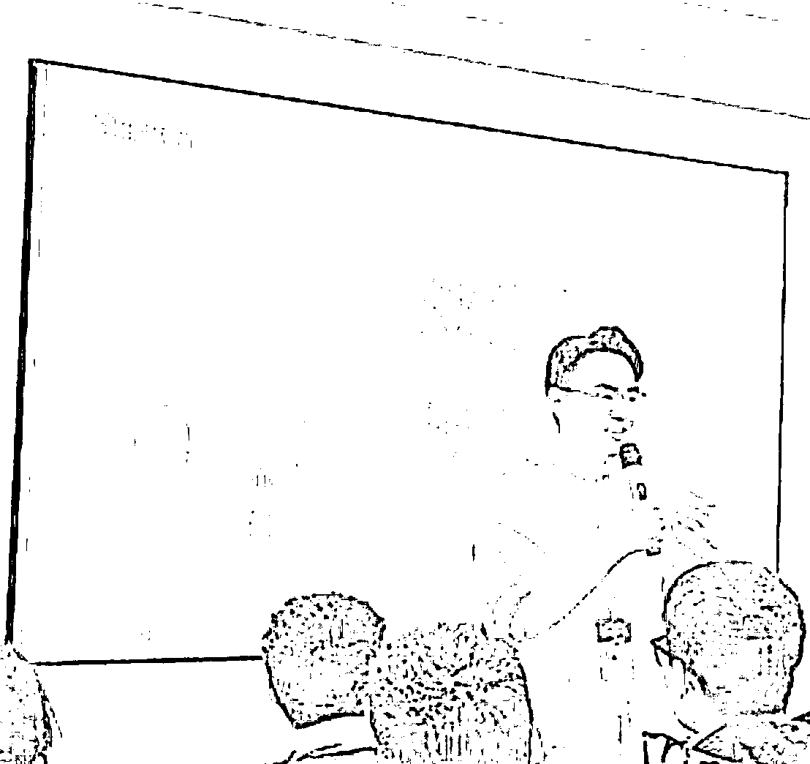

# 生财如何在AI应用领域建立影响力并获得长期价值

> 来源：[https://wandouyin.feishu.cn/docx/PeAVd2x1RoeeS4xhb3kco17nnzb](https://wandouyin.feishu.cn/docx/PeAVd2x1RoeeS4xhb3kco17nnzb)

# 引言

大家好。我是刘笑长，喜欢“笑”，做增“长”。

上周六的晚上，我像往常一样刷朋友圈，刷到了好多生财传术师在生财新办公场地的照片，又想到一个圈友写了一个航海实战建议贴作为礼物送给亦仁。正有空，要不我也送个“礼物”吧？

于是有了下面的朋友圈......

X分钟后，亦仁评论了：“写在哪了 完整版呢”？

我回复到：“上一条哈，我截图没截全～”

其实：我先发了个文字版，后来觉得欠妥，截了个图后，就立马把“上一条”隐藏了....

本着“越分享、越幸运”的原则，以及老周“想赢就要敢上场”的激发，今天我决定把朋友圈的内容再具体化一些，期望可以起到抛砖引玉的效果～

接下来，进入正文.....

# 一、我的洞察和思考

## 1、超级标、龙珠悬赏、生财AI加速器

*   亦仁在《AI应用：从百万到亿级收益的超级机会》一文中，阐述了对AI应用的机会判断。说明生财已经关注了此赛道，并且做了大量的数据调研、案例分析和路径拆解，判断这个赛道有足够大的机会。

*   生财开启了《第三期龙珠悬赏：AI编程快速实现及变现推广》，加码了龙珠数量

*   生财有术投资孵化业务负责人许老师在悬赏贴的评论中也提到了生财AI加速器：“你离生财AI加速器的距离，就差一篇龙珠悬赏了，冲啊”

生财高层如此重视AI应用这事。由此，我判断这里面一定蕴含着足够大的机遇，并且从看到这两篇帖子后，我也迅速从不同渠道不同圈子调研了下目前的AI应用编程现状，而后也把“AI应用”这件事迅速放到了个人战略级别的位置上。

## 2、破圈，建立AI细分领域的影响力

*   生财有术在社群、知识付费等领域，已经是多年的NO.1。自我感觉，生财在AI应用领域的影响力，还可以再提升一些。成为当人们提到AI编程，第一时间想到的还是生财。

*   面向未来，生财还可以内部孵化出AI细分领域的超级现象级产品或服务。AI应用只是目前的一个切入点。

通过一个大赛道的细分赛道切入，成为No.1，然后逐步延伸到这个赛道的其他细分领域，是个不错的路径选择。AI是个大赛道，AI应用编程是个细分赛道。但通过“AI应用编程”的杠杆效应，可以撬动AI其他垂类领域。

## 3、通过一次活动，收集用户反馈，并拿到AI时代下的解题思路

*   生财一直在迭代新产品、新服务，也通过共创的方式把效率、效果、口碑变得越来越好

*   生财一直在引领社群的新玩法，例如生财航海家、生财线下夜话、生财传术师体系等等

生财可以搭台，让AI应用的开发者有一个展示自己创意、才华的机会，这也是对生财老圈友的一种交付，新圈友的一种吸引，生财内部产品服务体系的一次迭代。

# 二、我的方案

## 在生财有术孵化基地组织一场AI应用编程马拉松

### 比赛规则

根据目前的产品业务线（精华帖、风向标、线下聚会、航海实战、同城社群、问题求助、资源链接等），24小时内现场开发一个AI应用，包含但不限于App、网站、小程序、插件，目标是提升效率、提升效果、提升口碑

### 参赛信息

可以组队参赛，每个参赛团队为1-3人，最多3人。

每个队伍只可以参赛一个作品。

在开发完成后，围绕主题“提升生财有术的#效率、#效果、#口碑”，需要做一个PPT，阐述创作思路、产品展示、目前的研发进度、未来的迭代规划等等。

首次仅招募30个参赛团队，仅限生财圈友参加，报满即止。为防止参赛队伍弃赛，报名缴纳X99元押金。

### 奖励设置

特等奖：一名，两颗龙珠+6个月生财孵化器使用权+亦仁1小时咨询

一等奖：一名，两颗龙珠+6个月生财孵化器使用权+ XXX

二等奖：两名，X颗龙珠碎片+X个月生财孵化器使用权+ XXX

三等奖：三名，X颗龙珠碎片+X个月生财孵化器使用权+ XXX

--其中，XXX为其他，如现金激励或其他赞助商商品等。

### 评委配置

1、由生财高层和AI领域行业大咖组成，譬如以下评委配置

*   内部：亦仁、坤汀、许老师、秀儿

*   外部：黄小刀、波波@抖查查、AJ

### 评选规则

采用线上计票和线下双重打分规则，满分100分。线上占30分，线下评委占70分。产品最终得分为线上分数和线下分数相加。

*   线上记分规则：

*   线上采用投票的方式，每一个圈友（根据生财编号）最多投1票。

*   最高得票的产品为30分，其他产品的得分等于30*得票/最高得票，四舍五入，保留1位小数。

*   线上仅展示产品编号，和功能演示，不展示选手信息。

*   可投票的圈友：志愿者、航海家、传术师、学习委员等

*   线下积分规则：

*   线下7位评委，每人10分，一个产品的得分，最高为70分。

### 赞助商

期望是AI细分领域的，可以与生财长期共赢的，譬如：

--蝉镜数字人

--抖查查

--豆包/扣子

--即梦/可灵

--Cursor/Windsurf/bolt.new

当你想做一件有价值且有影响力的事的时候，赞助商自然会找上门来～

# 三、我的逻辑

一个人或一个组织，想要做成一件大事，必须具备三个条件：天时、地利、人和。

## 1、天时

什么是天时？

“天时”是做事的时机。早一步容易成为先烈，晚一步竞争激烈，拿不到大的结果。

## 2、地利

什么是地利？

“地利”是做事的优势。靠山吃山是地利，靠水吃水也是地利。中国最大口碑最好的社群，也是地利。

## 3、人和

什么是人和？

“人和”是做事的出发点。内部：生财圈友的需要；外部：业内人士的需要

生财有术来组织AI应用编程黑客马拉松大赛这件事是符合天时、地利、人和的一个事情。

*   Cursor、windsurf、bolt.new 爆火于2024年7月份之后，通过生财有术内部的帖子（帖子数量、发布时间）可以佐证。

*   经过大量圈友的验证，上手容易，开发一个产品的时间快，且可以开发出不错的可商业化产品，（航海好事）可以佐证。

*   目前市面上对AI编程的关注度高。恰逢年底年初，大厂的“裁员广进”计划不断，互联网的几大职责研发、产品、设计都在探索新出路

*   生财拥有6W+圈友，可以让大家看到“新世界”，并在新世界形成“新圈子”、“拿到新结果（New Money）”。

*   生财拥有了大办公室，未来需要除了“社群”外，需要有更有价值的资产“标的”，AI应用这块是目前可以看到的为数不多的资产之一

*   AI加速器，线下孵化基地，这是一张王牌，需要让更多AI人知道。

*   流量+转化+交付，是最小的商业模型，如果一件事，即是在做交付，又是在做转化，还是在做流量，那么这件事的价值就极高。线下大会符合，线下大赛也符合。

*   AI应用海外发行，是一个不错的方向。

*   .........

一件事，就像水波纹，可以激起一圈又一圈的涟漪，那个形成波纹的中心点，就是一个支点，就是一件值得去做的事。