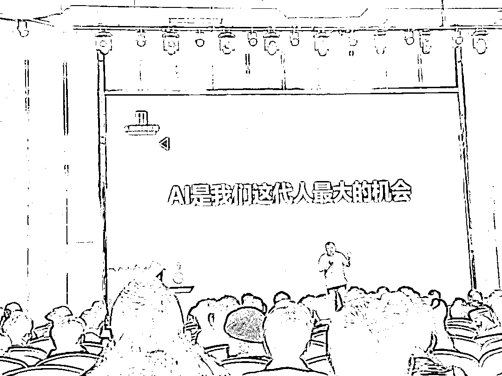

# AI 是我们这代人最大的机会！

> 来源：[https://fvxoq23qyuq.feishu.cn/docx/PyWWdjMHLo8TUfx0w3cc3BuUnwc](https://fvxoq23qyuq.feishu.cn/docx/PyWWdjMHLo8TUfx0w3cc3BuUnwc)

各位圈友大家好，我是创业7年的程序员小乐，2016年开始做公众号，2017年年低裸辞做自由职业者，目前50多个公众号矩阵主理人，全网40万粉丝，擅长做公域流量！21年4月加入生财的。

2024年，AI的浪潮悄然改变着我们的生活方式。在这个时代，有人通过AI写作、AI视频、AI编程内容创作开启副业，有人凭借AI技术能力开创事业，还有人借助AI视频、AI绘画、AI科普类短视频等打造个人IP。

小乐作为一名创业者，我深深感受到这股AI潮流带来的机遇。它像一股奔涌向前的江河，推动着每个人驶向更广阔的未来。这种变革的速度有时令人惊叹，但更多的是对未来的期待与憧憬。

站在2024年的风口上，我越发确信：AI不仅仅是一场技术革命，更是一次重塑人类生产方式的巨大变革。

过去一年，我见证了太多普通人借助AI实现人生逆袭的故事。有做平面设计的阿姨，仅用三个月就掌握了AI绘画，月收入从5000元提升到2万元。有刚毕业的大学生，通过AI编程接单，半年就在一线城市买了房。还有送外卖的小哥，靠着AI视频号，粉丝已经突破50万。

今天，小乐想跟大家分享一下，为什么我认为当下的AI是我们这一代人的黄金机遇，特别是在AI写作、AI视频等创作领域。不管你是刚毕业的学生，还是工作多年的职场人，只要愿意尝试，2025年都可能成为你人生的转折点。

# 一、AI 不只是科技，它是“杠杆”

很多人会问：AI这么高深的技术，普通人怎么参与？

这个问题让我想起20年前的互联网。那时候，也有很多人认为互联网是程序员的专属领域。但现实是，真正从互联网时代受益最多的，反而是那些经营淘宝店、做自媒体的普通人。

AI也是如此。它就像一个神奇的"杠杆"，能够成倍放大每个人的能力。一个人工作8小时能产出的内容，用AI可能1小时就完成了。这不是在压榨人的价值，而是让我们能够把时间投入到更有创造力的工作中去。

伙伴们，你有没有发现一个现象？当你刷短视频、看新闻，甚至听播客时，关于“AI”的讨论几乎无处不在。有人说它是科技革命，有人认为它只是“程序猿”们的狂欢，而我却觉得，AI远远超出了技术本身。它是我们这一代人翻盘的杠杆。

为什么这么说？杠杆的意义在于，用最小的投入撬动最大的成果，而AI恰恰让普通人拥有了这样的能力。它不是遥不可及的高端领域，而是一个普通人也能上手、参与、甚至获益的机会。如果你还认为AI离你很远，那今天这篇文章可能会彻底改变你的想法。

# 二、AI 视频：普通人也能参与的领域

在众多AI应用场景中，视频创作可能是门槛最低、受众最广的领域。

我们不妨从最热门的AI视频说起。最近，你可能刷到过这样的视频：某位网红用AI生成了自己“未来十年的形象”，或是某位小商家用AI生成了商品广告短片，几乎看不出与专业团队的区别。你知道吗？这些视频的制作成本可能几十块钱。

AI工具的入门门槛正在快速降低。以前做一个短视频，你可能需要学剪辑、学配音、甚至请专业演员。但现在，一台普通电脑加上几个主流AI工具，比如MidJourney、Runway，你甚至不需要会设计，动动鼠标就能生成电影级画质的内容。

比如，有个朋友是开奶茶店的，他原本只是随手拍几张产品照片，但最近，他用AI工具为每款新品做了个宣传视频。视频中奶茶的每颗冰块都闪着晶莹剔透的光，背景是虚拟的星空，每一帧都能当壁纸。他发布在小红书上后，浏览量直接翻了十倍，店里的顾客络绎不绝。

记得去年我刚入行时，做一个5分钟的短视频，要花至少3天：写脚本1天，录制1天，剪辑1天。现在用AI，2小时就能出一部作品：

*   用AI生成文案大纲

*   用AI合成真人主播

*   用AI自动剪辑

*   用AI配音配乐

成本从以前的上千元降到现在的几十元，效率提升了10倍不止。但视频的质量不降反升，因为AI能帮我们避免很多人工容易出现的失误。

这让我意识到：AI正在将原本“高成本、专业化”的创作领域平民化。普通人不再受限于资源和技术，只要有想法，就可以通过AI实现自己的创意。

# 三、为什么我说这是“最大”的机会？

回顾人类历史，每一次重大机遇都伴随着生产工具的革新：

*   蒸汽机让体力劳动变得轻松

*   电力让工业生产效率倍增

*   互联网让信息传播突破地域限制

*   而AI，则是第一次让脑力劳动实现了规模化突破

想象一下，当一个普通人可以轻松完成过去需要一个团队才能做到的工作，这意味着什么？意味着创业门槛的大幅降低，意味着个人价值被指数级放大的可能。

在所有技术浪潮中，AI是第一次将“创造力”与“生产力”融合得如此紧密。我们可以从三个角度来看它的独特性。

1.  门槛低，机会大

过去的技术革命，比如工业化、互联网，都需要一定的资本或技术积累。而AI不同，它是“工具式”的赋能，学习成本低，但收益却可能极高。这就意味着，即使你不是程序员，也完全有可能利用AI获得职业上的突破。

举个例子，我有个朋友是自由插画师，原本接单量有限，收入也很一般。但自从他开始用AI辅助创作后，他的效率提升了三倍，甚至还开设了一个AI绘画教程课，一个月的收益赶超他以前半年的收入。

1.  多领域应用，人人皆可受益

AI的特点是“万物皆可连接”。无论你是做设计的、卖商品的、还是写文章的，AI都能找到与你相关的切入点。比如我身边一个做短租民宿的小伙伴，他用AI分析房间照片，优化了装饰设计，结果客人的好评率直线上升。

AI的工具并不局限于专业人士，而是几乎涵盖了所有职业领域。这种普适性正是它“最大机会”的体现。

我们正处在这样一个特殊的时间节点：AI技术足够成熟，但市场竞争还不够激烈。就像2012年的短视频，2016年的直播带货，机会的窗口期就在眼前。

1.  资源分配的再平衡

最让我感到兴奋的是，AI正在打破资源分配的不平等。以前，我们总说“出身决定命运”，但AI的出现让“资源贫乏者”有了更多翻盘的可能。只要你愿意学习，愿意实践，AI就能成为你的助推器。

# 四、抓住 AI 浪潮的三个关键词

如果你问我，如何抓住这场AI浪潮，我会总结出三个关键词：学习、实践、创新。

1、学习：掌握AI工具是第一步

可能有人会觉得，AI技术听起来太复杂了，但实际并非如此。现在市面上有很多零基础入门的课程，甚至连B站上都有一堆免费教程。无论是图像生成、文字处理，还是数据分析，只要你花几天时间，就能快速上手。

比如我自己，最初接触AI绘图时完全是门外汉，但用了几天时间研究后，发现自己不仅能生成各种风格的插图，还能用它优化PPT设计，效率直接提升一倍。

AI工具每个月都在迭代更新，与其死记硬背某个工具的使用方法，不如培养持续学习的能力。建立知识框架，掌握学习方法，才能在技术更迭中保持竞争力。

2、实践：从小项目开始尝试

光学不练是不够的，只有把AI工具用在真实的项目中，才能真正感受到它的潜力。你可以从小处入手，比如优化一张照片、生成一段短文，甚至为朋友设计一张贺卡。每一次实践都是对能力的提升。

就像那个开奶茶店的朋友，他第一次用AI生成视频时效果很普通，但经过几次尝试后，他的创作水平已经远超最初。

很多人担心AI会取代人类工作，但实际上，真正的机会在于人机协作。懂得如何让AI成为得力助手，比单纯依赖AI更重要。

3、创新：突破传统思维的局限

AI最大的价值不在于“重复过去”，而是“创造未来”。用AI做简单的辅助性工作固然有用，但更重要的是思考：如何用它做别人没做过的事？

比如，那位自由插画师朋友，他并没有仅仅用AI代替人工，而是结合自己的专业技能，创造了一种独特的艺术风格。这种差异化的创新，使得他在竞争中脱颖而出。

AI再强大也是工具，决定作品质量的始终是人的创造力。未来的竞争，比拼的是谁能用AI创造出更有价值的内容。

# 五、我们的时代与AI的未来

AI不仅是一场技术革命，更是一场属于普通人的机会革命。它让我们有机会打破阶层的限制，用最小的资源，撬动最大的可能性。就像那句老话：“风口上的猪也能飞起来。” 而AI，恰恰是这个时代最大的风口。

展望2025年，我们会看到越来越多借助AI实现梦想的故事。机会就在眼前，关键是你是否愿意迈出第一步。正如一位智者所说："在巨变时代，不学习才是最大的风险。"

最后，我想问大家一个问题：在你们的领域里，AI能带来什么样的改变？如果你有答案，欢迎在评论区和我一起讨论。因为我相信，在交流中，我们才能发现更多关于AI的无限可能。