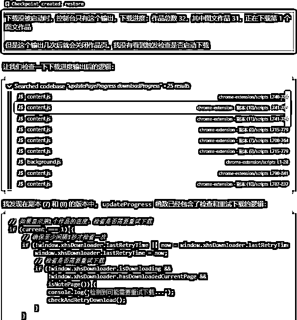

# 用Cursor做了一个小红书作品采集工具插件。免费分享。

> 来源：[https://udxxg5rx5m.feishu.cn/docx/QpG9dRKDioZCjZxKTOBcrUPcnRg](https://udxxg5rx5m.feishu.cn/docx/QpG9dRKDioZCjZxKTOBcrUPcnRg)

这款小红书笔记下载助手通过简单的扩展形式，

实现了笔记内容的快速下载，配合多账号管理工具，

能够有效提高下载效率。用户可以根据需要修改源码，以适应更多的自定义需求。希

望这一插件能帮助到需要下载小红书笔记的用户，简化操作流程，提升工作效率。

插件的源码也在压缩文件 多账号浏览器\软件缓存\sc 里面。自己有需求也可以自定义更改。

链接:https://pan.baidu.com/s/1TQ9OcgR4n3-WJDaYFCPQvA?pwd=ms5e 提取码:ms5e 复制这段内容后打开百度网盘手机App，操作更方便哦

### 产品介绍：小红书笔记下载助手

功能特点：

1.  一键下载笔记内容 通过点击扩展图标，用户可以轻松下载小红书中的笔记，包括文字和图片，整个过程全自动化，一键操作即可完成。

1.  自动提取图片和文字 扩展会自动识别并提取页面上的文字和图片内容，确保笔记的完整性，无需用户手动操作。

1.  按笔记分类保存 下载的笔记会根据每个笔记的标题或分类进行保存，避免混乱，帮助用户更高效地管理下载的内容。

1.  下载完成通知 下载完成后，扩展会弹出通知，确保用户能够及时知晓下载状态。

1.  下载历史记录 扩展会保存下载的历史记录，用户可以随时查看过去下载的笔记，避免重复下载。

### 主要优势：

1.  简单易用 用户只需安装扩展，配置下载路径，点击下载按钮，即可一键获取小红书笔记内容。

1.  全自动化下载 扩展全程自动化，用户不需要进行复杂的操作，便可轻松下载文字和图片。

1.  本地保存 所有笔记内容将保存在用户本地计算机，确保资料的隐私性和安全性。

1.  尊重用户隐私 该扩展不收集任何用户数据，完全尊重用户隐私，确保用户的浏览历史和下载内容安全。

也是因为自己最近在测试项目，

需要用到类似的功能，但我实在不想用易语言写了，

因为花生最近影响力太大所以我也关注到了Cursor，

就想着正好试着玩一下用Cursor开发一个这样的插件，

本着“真男人从不看说明书”的宗旨，

什么资料我都没看，

只在油管找了一个Cursor下载使用的5分钟视频。

看完就磨刀霍霍操作起来了。

怎么说呢，才开始什么README.md，什么.cursorrules，什么都不知道，

上来直接ctrl+i，一顿打字。

第一印象是nb，先不说写的对不对，光在这库库刷代码我人都麻了。

个人习惯，我都是把每个功能拆分开，然后添加一个一个测试按钮去测试。

每个阶段测试好后，就保存一个备份，然后告诉他现在功能都测试好了，根据我的要求把所有功能串起来。做调试即可，

实际应用的时候发现Cursor总是悄悄改一些代码。

导致测试好的功能不知不觉就变了。

但是在我再次跟他沟通调试的时候，

我发现他竟然又读取了我在其他文件夹保存的历史代码。

然后通过对比又把代码修正回来，一时间有点哭笑不得也不知道他到底是不是真聪明。

简单写好测试的时候又发现各种问题，

一些笔记标题带有特殊符号，导致文件夹创建失败。

我增加了一个功能，去除标题中的特殊符号，确保文件夹名称有效。

如果某些笔记没有标题，则用序号替代。

由于小红书采用虚拟列表技术，每次滑动页面只会加载可视区域的元素，

导致无法一次性加载所有数据。我增加了实时滚动的功能，

在滚动过程中记录已下载作品，滚动后再对比未下载的内容进行补充下载。

一些笔记包含图文和视频内容。我在Cursor中加入了判断功能，

确保视频内容在下载时被跳过，避免重复下载。

经过这些测试与调试，插件功能最终完善，能够顺利实现笔记下载的需求。