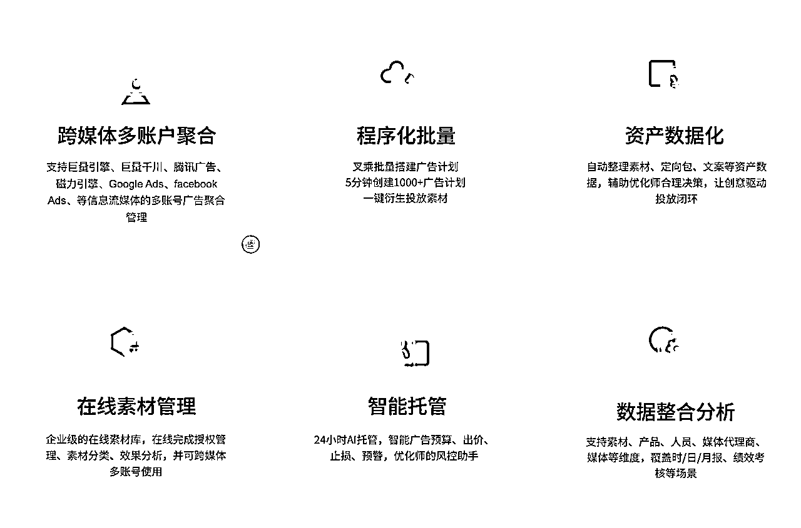
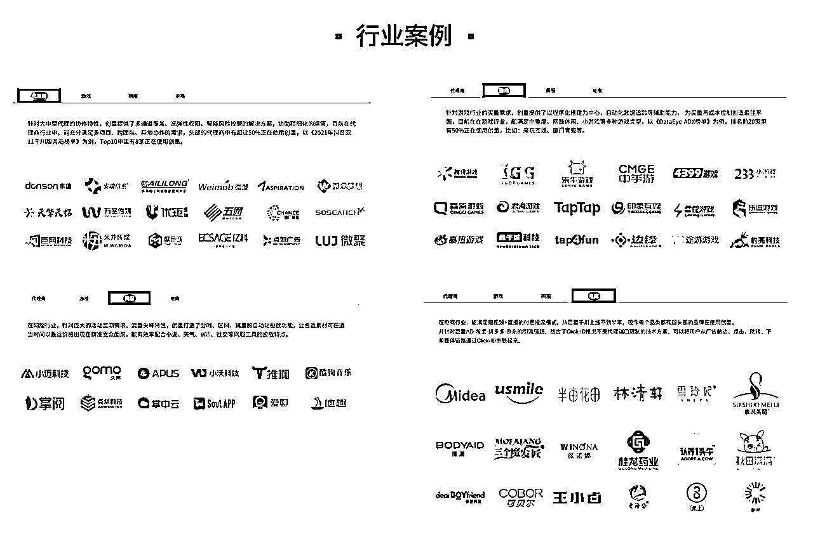
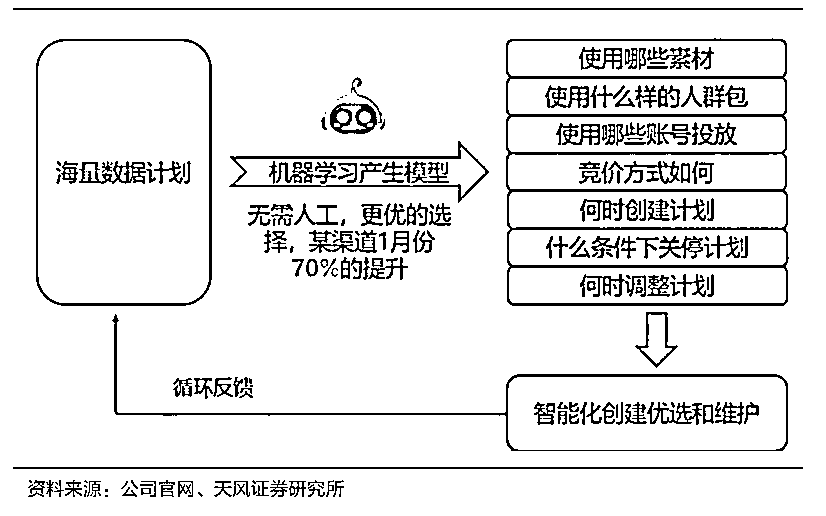
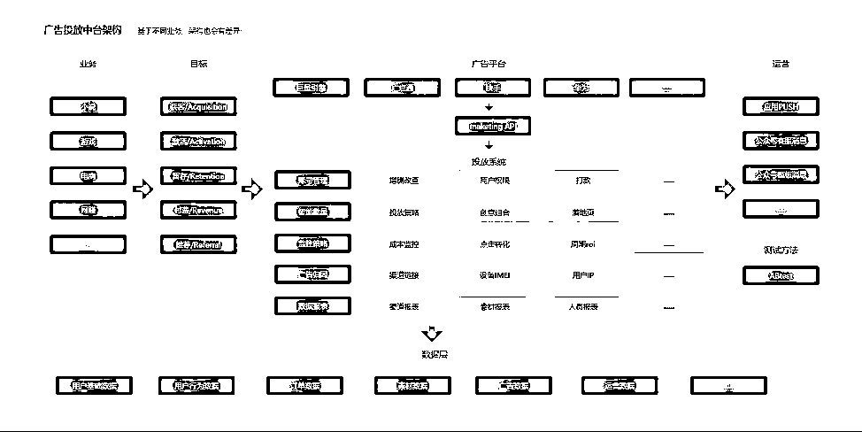
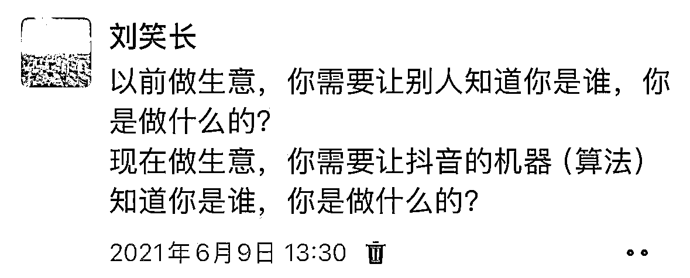
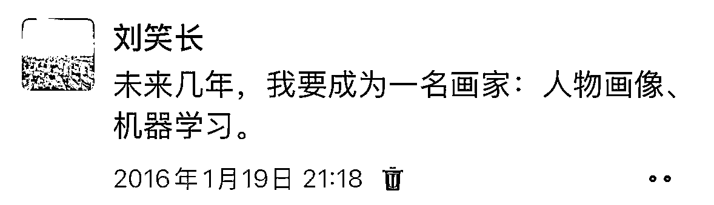

# 投放的艺术：如何搭建一个7日ROI提升10+%，日消耗300W+的App智能投放系统

> 来源：[https://wandouyin.feishu.cn/docx/Rc3hdHtBJoz5IGxQcoHcIDxjnzh](https://wandouyin.feishu.cn/docx/Rc3hdHtBJoz5IGxQcoHcIDxjnzh)

大家好，我是刘笑长。喜欢“笑”，做增“长”。

近期，AI应用编程赛道持续火热，到处可以看到几天甚至几十分钟、几分钟做一个网站或App的文章，但一款商业化的产品，如何规模化盈利，成为产品开发完成后需要重点考虑的问题。

亦仁在超级标文章《AI应用：从百万到亿级收益的超级机会》也多次提到了“广告”、“投放”的意义和价值。很多大佬在发展的过程中，也逐步意识到广告投放的重要性。

一直以来，广告圈流传一句话：“我知道我的广告费有一半浪费了,问题是我不知道哪一半被浪费了”。今天，我尝试由浅入深的解释清楚广告费去哪了，如何避免广告预算浪费，如何科学地搭建一个以提升ROI和消耗为目标的智能投放系统？期望对从事AI应用或者广告投放工作的圈友有所启发。

本文是AI应用的第二篇文章：AI应用之投放篇。

# 引言

在进入正文之前，大家可以回想一下，是否遇到过类似的问题？

*   你在中国最大口碑最好的社群生财有术发现了个idea，产品也借助Cursor几天内做出了，不清楚怎么推广变现？

*   不知道如何快速验证产品，形成“产品-流量-变现”的闭环正反馈？

*   后来，你知道怎么变现，但出于自己是小微企业或“超级个体”，没有充足资金去做广告投放？

*   不清楚如何借助第三方广告代理商、代运营、App发行方等，也不清楚如何甄别代理商、合作伙伴？

*   你既有了产品，也顺利开启了广告投放之旅，但你不知道怎么看数据？怎么分析数据？怎么优化数据？

*   看哪些维度的数据？数据如何解读？这些数据又反映了产品或当下什么趋势？

*   你终于知道了广告投放是怎么回事，也顺利被同行盯上了，你想借助广告一把梭哈，流量却越来越差？

*   不清楚放量节奏，不清楚广告平台算法，不清楚相关方当期Q的OKR

*   你终于杀出了一条血路，发现在你巨量、磁力、广点通平台已经是Top2了，但你ROI却被压缩到了微利程度？

*   不清楚如何平衡规模和利润？不清楚如何精细化抢量？不清楚如何媒(hu)体(kou)博(duo)弈(shi)？

*   再后来，你发现了广告平台也开发了一个类似的产品，你不敢使用“第一方人群包”、“第三方人群包”了...

*   你开始焦虑，不清楚如何“与狼共舞”？不清楚如何和既是裁判又是球员的一起竞争？不清楚利润去哪了？

*   再后来，你了解到了App广告投放矩阵、广告投放精细化运营、智能投放系统，但你不知道如何切入？

*   如何搭建组织？如何制定目标？如何拆解里程碑？如何进行LTV预估？如何迭代投放策略？

*   再后来，广告平台公司打包把旗下的相似产品卖了；但你的利润率随着成为行业Top，已经回不去了...

*   如何在成熟市场稳健的生存和盈利？如何左(nei)右(bu)互(fu)搏(hua)开启新的一片天?

随着以ChatGPT为代表的问答式AI的普及和兴起，一个好的问题往往比一个答案更重要。

因为好多答案已经做到了随处可及（且排版有序），但一个好问题可以启发一个人的思考。因为一个问题代表了一个人的思考角度和注意力，层层递进的问题代表了一个人更深层次的思维框架。

本文并不是尝试解答以上所有问题，因为很多问题大都是浅层次的表象。但你通过本文，可以看到一个广告人的思考以及几年下来在巨量引擎、磁力引擎、腾讯广告一年花费数十个小目标才可以沉淀下来的最佳实践。

接下来，进入正文....

# 一、智能投放系统

## 1、专有名词解释

| 名词 | 解释 |
| 巨量引擎/巨量广告 | https://business.oceanengine.com/site/index |
| 巨量引擎开放平台 | https://open.oceanengine.com/labels/7 |
| 磁力智投 | https://ad.e.kuaishou.com/ |
| 磁力引擎开放平台 | https://developers.e.kuaishou.com/ |
| 腾讯广告 | https://e.qq.com/ads/ |
| 腾讯广告开放平台 | https://developers.e.qq.com/docs/start |
| 空耗 | 广告费用花出去了，没有带来用户或者带来的低质量（非用户画像）用户 |
| 归因 | 根据一个结果去寻找产生这个结果的原因就是归因。在移动营销应用推广中，归因主要用于判断是什么原因促使用户下载应用，或在激活应用后进行各种操作（如再次打开或重新安装） |
| 归因模型 | 最终点击：将转化功劳全部归于客户最后点击的那个广告和相应的关键字。 |
| 归因窗口期 | 展示广告 or用户点击广告后触发回溯，在回溯窗口期内发生的激活将作为非自然流量归因到媒体渠道。 |
| 优化师 | 也称“广告投手”，负责投放广告的人员的一种职称 |

## 2、智能投放系统是什么

为了大家更直观的了解和认识“智能投放系统”是什么，可以点击下方蓝色网站链接查看。

创量_智能广告投放系统

创量为目前业内相对有名的第三方SAAS软件平台，也是字节旗下巨量引擎开放平台、以及快手旗下快手磁力引擎开放平台唯一共同推荐且到目前还存续的第三方智能投放平台。

| 比较 | 普通广告平台 | 智能广告平台 |
| 投放方式 | 从巨量引擎、磁力引擎、腾讯广告 3个媒体的广告投放后台 | 通过Marking API进行上述行为 |
| 基建效率 | 平台有限制，一次最多创建N条（N为平台限制） | 一次可创建N*M*Q条， 提升创建效率X% |
| 盯盘效率 | 需要在各个平台各个媒体账户各个广告下查看详细数据 | 数据监控+自定义监控规则+消息推送+程序操作，提升盯盘效率x% |
| 资产数据化 | 广告中的数据分散在各个媒体下 | 沉淀为企业资产：人群包、定向包、文案、素材 |

总结下其核心功能和价值

1.  多媒体多账户矩阵管理，一个平台管理巨量引擎、磁力引擎、腾讯广告。

1.  接入各个平台的Marketing API，通过API而不是广告投放后台来创建广告。

1.  自动化批量创建广告，提升广告的基建效率、顶盘效率、投放过程中的自动化效率。

1.  主要是提升效率

所谓双效提升，更多的是通过提升效率，解放优化师的时间，让优化师有更充分的时间来思考、研究、测试无法自动化完成的事，来进一步达到最终提升投放效果的目标。

这只是智能投放系统的最最最初级形态，但要想实现自身企业数据的安全性，前后端数据链路打通，根据App内的用户数据实时调整投放策略，及时根据广告平台提供的新能力来进行投放，达到资金可控、流量可控的阶段，依靠第三方SAAS平台是远远不够的。

于是，很多日消耗数额巨大且需要长期持续买量的用户，便企业内部自建“智能投放系统”了。例如业内比较知名的“量子-天机”系统。

## 3、智能投放系统的意义和价值

智能投放系统，以提升消耗和ROI为优化目标。通过Marking API的方式打通前端投放数据（3秒完播率、展示点击率、点击转化率）和后端App内（关键行为：充值、在线时长、新手任务完成率、关键行为等）的数据，以更短的时间间隔评估广告投放效果（LTV预估、ROI预估），极限提升感知效率和决策效率，7*24时监控，对需要调整的广告及时进行提醒并对广告做出相应的调控优化动作（暂停、删除、预算调整、出价调整、新建）。

### 价值点一：打通公域、商域、私域全链路最小颗粒度的内外部数据，做到心中有“数”

如今很多企业内部的数据都是割裂的，类似一块一块的数据孤岛，沉寂在数据库中，分不清用户到底来自哪里，来到App目前做了什么，未来又会怎么样？

投放系统需要按照最小颗粒度打通数据，要做到90+%以上的用户全链路是通畅的。

举个例子：这个用户是来自广告投放，还是来自然搜索、朋友裂变？来在哪个视频素材？哪个广告媒体下的哪个广告位？在激活App前点击了几次广告，分别是哪些广告素材？是否是之前卸载过的老用户？进入App后 首日首次在线时长是多少？首日在线时长是多少？首日启动App频率是几次？是否过了新手任务？点击了哪些“关键按钮”，次日是否有留存？3日是否有留存？是否在App进入了付费详情页面？此用户首日是否付费了？此用户付费金额是多少？此用户是否是大R/中R/小R？用户评级是多少？3日内付费率是多少？预估LTV7是多少等等

上述数据，不止有原始数据，还有复合计算数据，还有算法预估数据。把数据的粒度拆的足够细，对每个维度下的数据背后代表或映射的含义认知足够清晰，才能在千变万化的广告市场，做到心中有数；心中有数，才会在大盘流量波动时，做到坦然处之，就像庖丁解牛那样，做事游刃有余。

### 价值点二：矩阵化投放，一站式管理各投放平台，7*24小时盯盘，提升效率

为了占领市场，企业需要在不同的媒体平台（字节系、快手系、腾讯系等）和应用商店（oppo、vivo、华为、小米等）投放广告，测试不同的广告位、定向、出价、素材、落地页等等，需要大量的创建广告、监控广告数据、调控广告（暂停、删除、一键起量、一键复苏、调整预算、调整出价等）等等。广告投放平台为了安全性和其他，会限制单次创建广告的数量，查看数据也满足不了需要聚合的维度。

有了智能投放系统，可以通过Marketing API实现广告的矩阵化投放，并且把各平台聚合在一个后台，实现一站式管理，实现7*24的盯盘、数据分析和策略调整。提升人效以及投放的效果。

### 价值点三：沉淀优化师经验，由优化师管理投放媒体账户，变成操作智能投放系统

优化师的经验是可以沉淀的，当然这些经验系统也是可以学习的。之前优化师在媒体账户下操作，优化师的Leader只可以看到数据结果，却看不到产生这些结果的中间过程。现在，优化师在智能投放系统上操作，优化师是如何创建广告、如何调控广告，一系列操作产生的结果，都是一目了然的。

有了这套系统，初级优化师的投放水平可以在系统的帮助下达到高级优化师的水平。因为系统设置了防出错机制、内置了素材搭配算法等等一系列功能，并且24小时盯盘，在需要优化调整时，及时给优化师发送飞书消息，不论你是高级还是初级。

当然，还有一点，字节、快手、腾讯、ovhm之前每个媒体下都有10来个人的优化师，现在，一个出色的优化师，在系统的辅助下，可以管理一个媒体平台，降本增效显著。

### 价值点四：洞察大盘流量，顺应广告平台算法的优点与缺点

通过某一媒体下的所有账号数据，通过某一个时间片段的消耗速率等等数据，你可以洞察当天的大盘流量情况，并可以根据自己的目标，来做相应的投放策略调整。

你需要把广告平台的算法当“人”看，正如那2本畅销书《人性的优点》、《人性的缺点》所述，是人就有优缺点，这是人性决定的。作为广告投放人员，你要顺应广告平台算法的优点，Ta才会给你流量“奖励”；并且还要......

你还需要把智能投放系统当“机器”看，因为广告平台的本质是一个算法机器，Ta一直在进化，Ta一直在需求流量变现的全局最优解。虽然所有的“机器”都是人设计的，但人最终是无法与机器博弈的，只有机器才有与机器博弈的可能性。大国之间，合作与博弈并不冲突，商业亦是如此，这是商（tou）业（fang）走到一定阶段的必然产物。

至于机器与机器的故事，此处省略....字。

### 价值点五：广告投放驱动产品迭代

这是目前“投放-产品迭代-投放”的新范式。

通过数据，你可以知道用户的视频素材偏好，以及对应的视频素材的用户在App内的数据表现。

很多素材会领先App的产品功能，做出部分App未有的功能，如果点击率高或者App内表现好，再增添这个功能。

这种需要全链路数据打通才行得通的新范式，就需要打通前后端数据，实时投放，实时看效果，高效率做AB Test，验证好后驱动产品迭代。形成一个正反馈的正循环。

### 价值点六：提升ROI，提高消耗

一切都是为了消耗，一都是为了ROI。无法带来高ROI的消耗没有任何意义，要想成为行业内的Top，必须ROI和消耗两手都要抓，两手都要硬！懂得都懂

打通数据、提升效率、沉淀经验、洞察大盘、驱动产品、提升消耗。

所谓智能，就是把生产效率（自动化）、感知效率（实时性）与决策效率（准确性）的提升到极致。由企业的数字化过渡的企业的数据化，激活数据，燃烧🔥数据，充分利用算法发挥庞大数据维度中隐含的趋势信息，并及时对投放广告做出相应的策略调整。

# 二、智能投放系统的搭建

## 1、搭建思路

### 可落地执行的SOP

接下来是从0到1搭建智能投放数据的可落地执行的SOP：

*   全链路数据打通：打通广告投放前、广告投放中、广告投放后的数据，从在各媒体广告平台投放广告转为通过Marketing API 投放，建立企业内部统一口径的数据指标体系

*   广告投放前：媒体、广告位、定向、出价、素材等

*   广告投放中：视频完播率、点击率、转化率等

*   广告投放后：App内的激活、付费、在线时长、使用频次等

*   评估体系：建立科学的广告评估体系，可以准确且及时的评估每个媒体、广告位、素材等的带来的用户价值

*   媒体：巨量、磁力、腾讯

*   广告位：抖音、优量汇、穿山甲、快手、快手联盟

*   素材：录屏素材、解说素材、真人素材、图文/视频

*   支持小时粒度素材效果分析，提高（媒体X广告位X定向下）素材投放评估效率

*   评估新用户成本、LTV、留存、投变ECPM等

*   智能监控：7*24小时监控，对空耗类广告、学习期失败广告、低ROI广告、低消耗广告及时关停/删除处理，减少广告预算浪费。

*   空耗类：过了学习期，投放时间超过N（平均值）小时，当日消耗大于 单用户买量成本* （2～3），且0激活的广告

*   学习期失败：投放时间大于6小时，消耗小于单用户买量成本的广告

*   低ROI广告：当日消耗大于 单付费用户买量成本 * 2 且 首日ROI < (昨日平均)首日ROI * 0.3

*   智能预算：由局部最优解 转向 全局最优解，预算分配跨广告计划、媒体账户、渠道。

*   监控广告预算，对于ROI的广告，增加当日广告预算

*   智能归因：提升Andorid和iOS归因准确性，知道用户来自何渠道、何广告、何素材

*   动态归因窗口期调整可以评估出渠道质量、减少广告浪费。

*   归因模型也可以提升归因准确率

*   智能创编：广告全生命周期托管，自动创建、自动停止、自动删除。

*   对于监控出来需要调控的广告，做自动停止、删除操作

*   及时补充广告计划

*   智能报表：日报表、周报表、月报表，环比趋势、同比趋势仪表盘一秒看透

*   人的维度：优化师维度、素材师维度

*   媒体维度、广告位维度、出价多位，多维度单项或多项联动分析

*   智能创意：竞品广告投放素材监控，同业广告投放素材趋势分析

*   智能风控：针对刷量、流量造假、流量劫持、流量异动的及时洞察和有效干预

通过Marketing API 接入巨量、磁力、腾讯3大投放平台，不仅清晰的知道用户来自什么媒体、什么广告位、什么素材，还知道用户的在线时长、充值、留存等客观数据以及LTV、ROI预估数据，可以在广告投放的当天甚至N个小时内就可以评估出广告投放效果，然后加以预算调控、出价调控、暂停/删除 调控等。实时监控各投放广告，对于差的广告暂停处理，好的广告加预算处理，从而达到在提升ROI的前提下，提升消耗金额。

## 2、广告效果评估

### LTV预估的方法

LTV预估是整个整个智能投放系统中最难的，是需要技术攻关的。

即你要在用户当天甚至在用户进入6小时内预估出用户的价值，从而计算ROI0。

其实现思路是，你要找出App内的关键行为，进而通过关键行为建立LTV7、LTV30的关系映射

举一个反面例子

如果一个用户进入App 30秒内就关了，我们可以把“首日在线时长/首次在线时长”作为一个关键行为，我们可以根据历史数据，演算出此类用户的平均LTV，进而估算出但用户价值。

当然，这里仅拿了一个“关键行为”举例子，现实中，我们需要逐步找出10+、20+、30+关键行为，建模来预估单用户的价值，关键行为找的越多，越精准。

当你每找对一个关键行为，召回率就会提升一些百分比。

### ROI波动的影响因素

当遇到流量波动、数据波动时，一定要从整体来看待投放行为

是不是产品最近上线了新功能？

是不是算法调整了数值？

是不是App出bug了？

是不是广告平台出bug了？

在很多大公司内，市场投放负责人、产品负责人、研发负责人，会因为ROI降了而开（tui）会（wei）。

在没有智能投放系统之前，很难快速定位到是哪一个环节出了问题。

但有了智能投放系统，你可以使用ABTest 快速定位到问题。

毕竟除了投放渠道质量，产品内的数值、甚至产品内出现的皮肤质量和价格都会影响到充值～

搭建智能投放系统，及时监控到问题并定位和解决问题，也可以减少预算浪费

## 3、一些投放策略

每一个小技巧，都可以减少广告预算浪费，提升ROI

### 创建策略

账户冷启动策略、素材冷启动策略、素材搭配策略、出价策略，其实每一个策略，都是你在投放过程中遇到了问题，然后为了优化这个问题相处来的应对方式。

然后AB测试，然后逐步迭代。

### 调控策略

建立一些自动化规则，建立7*24小时监控，沉淀优化师的经验

*   通过归因策略，清晰用户的来源，判断渠道的质量、素材的质量以及用户的质量。对ROI低于平均ROI的渠道（或广告位）的进行暂停投放，可以减少广告预算浪费。

*   通过自归因或智能归因（回传X扣1），在归因时排除低质量用户，如计算“打开App X秒内退出的用户”而非激活用户，进行回传给广告平台。

*   及时关停广告消耗大于平均单个用户获客成本*2的广告且投放时长大于N小时的。

*   及时关停5秒完播率小于50%的素材/广告

*   ......

# 三、广告投放的一些知识

### 深度出价

首日ROI、7日ROI、激活、激活付费、激活留存，在单出价熟练的情况下，尽量尝试双出价。

### 素材即定向

随着广告平台的算法进化，目前各大平台都在宣传定向已死，都在宣传自己的“智能定向”

有一种论调为“素材即定向”，你用什么样的素材，就会吸引什么样的人。

广告平台会根据你素材的受众偏好来分发推送给相应的人。

### 素材加定向

实现千人千面的广告素材，例如，推给广东（地域定向）的素材使用粤语，推给福建（地域定向）使用闽南话。

同一份素材，音频更有针对性，投放效果也会更好一些。

还有标题文案，也可以借助定向实现千人千面。

当你实现了批量自动化创建系统，这些都很容易实现。

当前后端链路打通后，通过调整单项元素，进行ABTest，并比较投后数据，会逐步迭代出更好的投放策略。

### 竞品投放素材监控

可以去广告投放营销情报平台去监控精品的投放素材/策略，提炼素材中的元素，运用到自己素材中。

*   广大大

*   热云引擎

### RTA

当你积累用户到一定数量时，可以使用平台的RTA技术，也会最大限度的减少广告浪费

*   控制广告展现频次，例如一天最多3次

*   控制老用户展现，例如最近30天的老用户不展现广告，超过30天的展现

*   对于识别出的大R、中R、小R用户，高价买量

# 四、像聊天一样创建广告

商业竞争往往是残酷的。就像一场游戏，你通过了第一关，还有第二关等着你，接下来的每一关都会比上一关更难。但这也是一个人乃至一个企业成长修炼的必经之路。

就像悟空，本来一个筋斗云就可以到达西天，但还是要历尽九九八十一难；因为你经历的过程就是你最值钱的标签。

借用一句网络流行语：“那不是我的黑历史，那是我的来时路.....”

在8年前，我就意识到只要产品的用户画像足够清晰，你就可以通过广告短时间内获取到大量用户。

3年前，在ChatGPT（2022年11月）还未发布前，我就试想借助Siri开发一个聊天式智能广告系统，场景如下：

Q：hi，Siri，帮我创建一批广告？

A：好的，已参考昨日最佳定向、出价、人群、素材，创建好一批广告，新增总预算为10W元，看是否需要调整？

Q：不需要。昨天数据怎么样？

A: 昨日创建广告数1578个，自动关停290个，3大平台累计消耗156W，激活用户9876个，其中老用户2025个，老用户首日ROI为15%，纯新用户7851个，纯新增用户首日ROI为9%，所有数据正常....

Q：有没有发现买量趋势？

A：近期腾讯广告视频号广告位买量价格偏低，充值率不高，但整体广告位ROI还略高于其他广告位5%

Q：请把发现的趋势以数据图表的形式发给各BU负责人

A：好的......

随着ChatGPT大模型、RAG、本地知识库、本地数据库的技术发展，上述场景正在逐步变成可能。像聊天一样创建广告，像聊天一样洞察广告，像聊天一样调控广告。

# 五、总结

智能投放系统，是由多个智能模块组成的，近实时的数据生产、数据流转和数据消费，犹如一个中枢系统，串联起企业最核心的数据资产。而数据，就是企业的血液。一个健康的企业，一定拥有健康的数据，无论内部，还是外部。而智能投放系统的出现，也促使企业达成了每日数据体检的功效。

无论投放前、投放中、投放后，都是数据驱动，通过数据发现问题，通过数据发现趋势，通过数据驱动增长。

广告投放，目前已经形成一个庞大纷杂的科学体系，雷军说：“99%的问题，都有标准答案，找个懂的人问问”。篇幅有限，还有许多智能广告投放的思路方法、最佳实践、想象空间未能详尽呈现。

关于广告投放相关的问题，欢迎生财圈友在评论区一起互动交流，我将知无不言，如果是我擅长的且验证有效的，我还将提供可落地执行的方式方法，或许可以提升你的消耗或ROI。如果文章中有错误的地方，也欢迎指正，我将不胜感激，并及时更新迭代。如果你觉得文章对您有所启发，也欢迎您点个“赞”表达您的态度，让我看到您！

愿大家获客有道，投放有术，在这波AI应用编程浪潮中赚到足够多的钱💰。

感谢生财有术，一起生财有术！