# 1月9日 用cursor开发了个手机桌面文案壁纸生成器

> 来源：[https://yaltjddz906.feishu.cn/docx/FrzVdJbo4oiRtIxyllAcGBTonbb](https://yaltjddz906.feishu.cn/docx/FrzVdJbo4oiRtIxyllAcGBTonbb)

今天阅读了明白老师的一篇精华文章：《如何在赚钱这件事上，做到知行合一？》，读完此文，深感收获颇丰。文中指出我们在赚钱时常常明知方法却难以践行，原来是 “惯性” 在作祟，这确实戳中痛点。无论是行为、情绪还是思维上的惯性，都在不知不觉阻碍着我们进步。而破解之法，像将激励话语贴在显眼处，不断提醒自己，靠高频重复练习去培养好惯性，让人眼前一亮。同时意识到环境、言传身教对自身及下一代惯性的影响，更觉改变需从点滴做起，长期坚持。这篇文章让我明白，赚钱乃至生活中的知行合一，要靠主动打破惯性，持续努力去实现。

这里面培养惯性的方法，真让我增长见识了，刻意去培养好的惯性，把一些好的方法、好的内容直接打印出来，这样每天在电脑面前都能看到墙上的内容，看个几百遍，自己大部分时间就会处在好的惯性中了，集中时间高频刻意练习，久而久之自己赚钱的见识、思维、知识、技能、经验等进步速度就超级快。

我在想，除了把一些好的方法、内容打印出来贴墙上，还有什么其他方式也可以让自己每天都能看到这些内容呢？于是我就想到手机，手机我们是天天都在用，那么手机屏保是不是可以拿来做为另一种方式，让自己天天能看到这些内容？然后能提醒自己在平时阅读文章、精华等等内容时，刻意去练习。于是乎我拿起了美图秀秀去做手机壁纸，然后把一些好的思维、经验这些写在壁纸上，然后把屏保换成这些文案壁纸，进行轮播，这样每次亮屏就能被好的内容提醒自己一次。可我用美图秀秀折腾了半小时都没弄出一张好看的文案壁纸了，于是我想起了上次航海参加的cursor训练营，想着要不用cursor开发一个程序，然后用程序去生成手机屏保，会不会效率更高？于是就打开了cusor开始了以下的操作：

1、这是给cursor提的需求：我想做一个可以输入文案，然后生成一张手机桌面壁纸的程序，壁纸背景颜色可以自己选择颜色的，然后壁纸中间就是自己输入的文案，样式可以自己手动设置，我应该如何提需求，该使用什么编程语言开发，我是个小白，不懂的编程，请帮我想一套开发方案

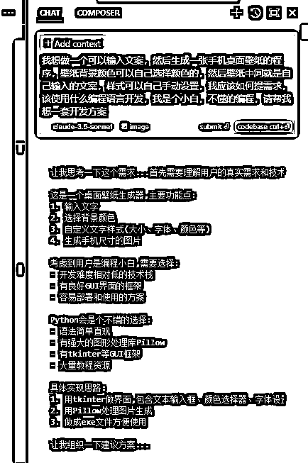

cursor非常友好的给出了开发方案：

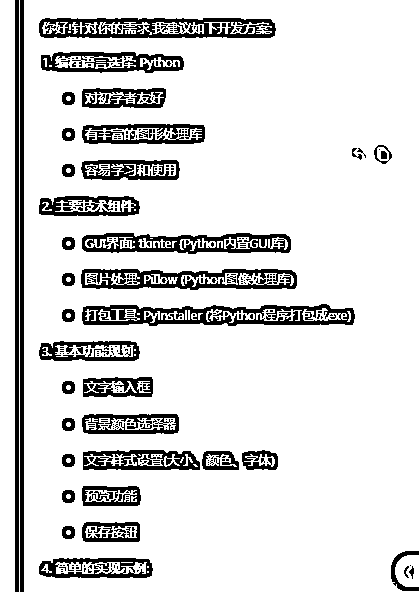

2、提示词：按照你的流程一步一步指导我实现该功能

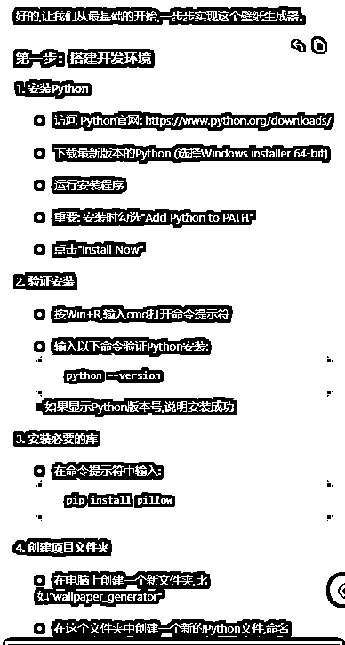

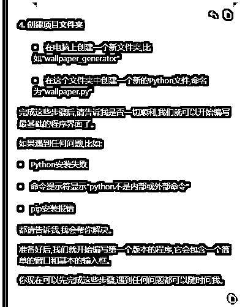

接着基本上按照他的步骤一步一步操作就行了，遇到任何bug问题，直接丢给cursor去解决就行。增加哪些功能、或者优化哪些功能，把问题描述出来，让cursor去解决就行了。经过一个小时的修改，最后把程序做出如下界面：

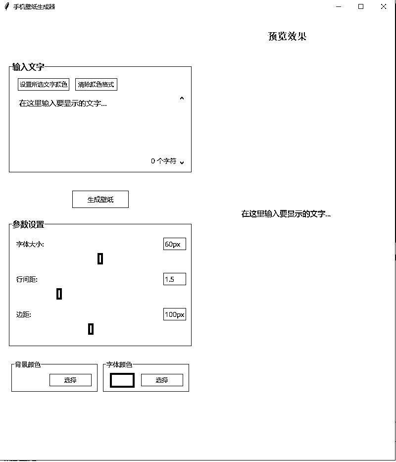

该程序实现了：输入你想要的文案，然后显示在背景图中心，可以设置字体大小、字间距、边距、背景颜色、字体颜色，其中字体大小、字间距、边距三个参数既可以滑块拉动、也可以手动输入参数，另外输入文字中，可以选中部分文字单独设置文字颜色，右边预览效果可以实时预览所要生成的手机壁纸的效果。

如下图：

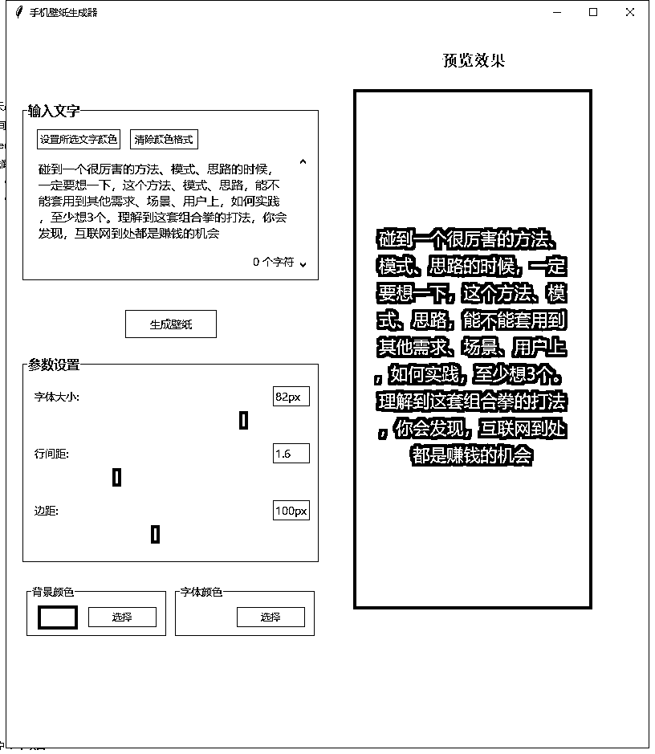

最后输出的图片如下效果：

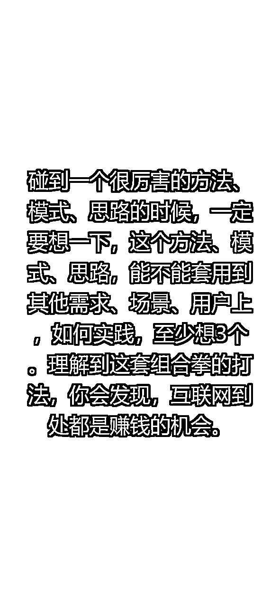

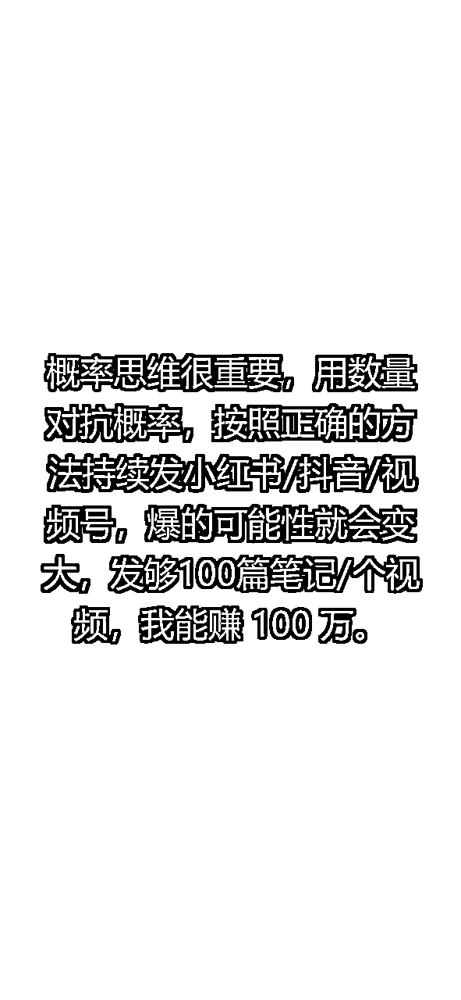

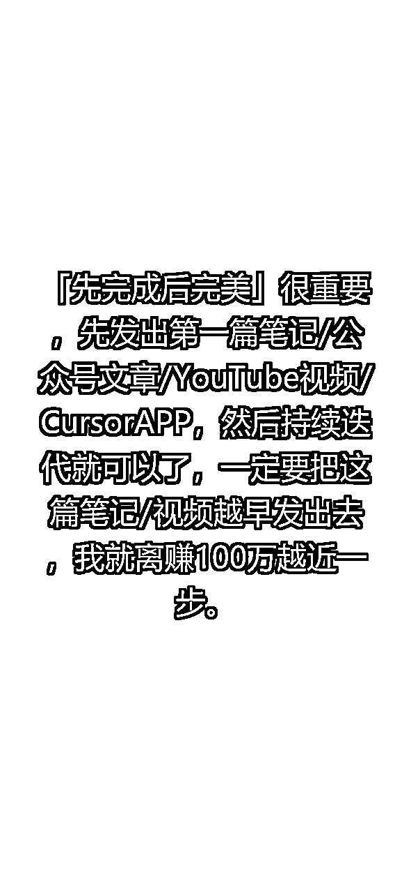

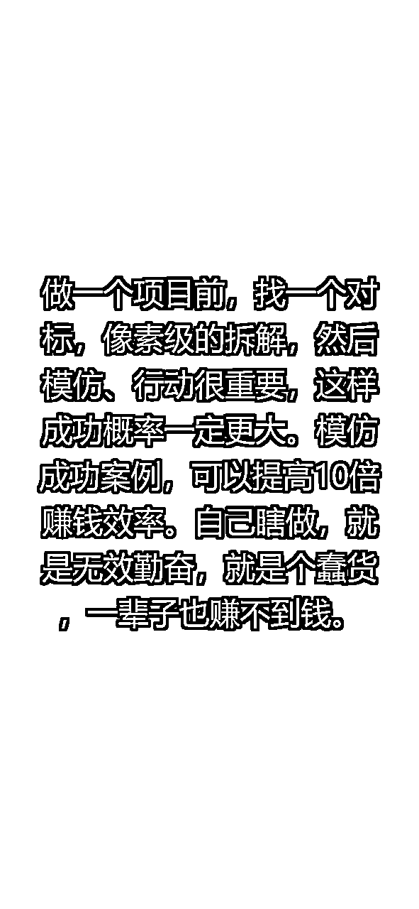

于是我把图片设置到手机屏保里，效果如下：

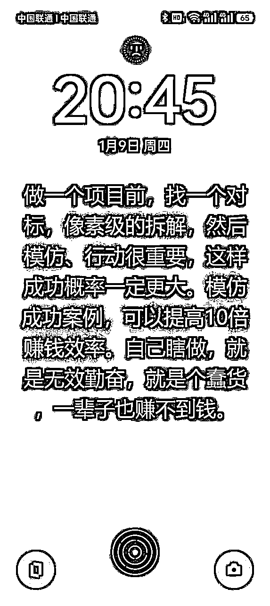

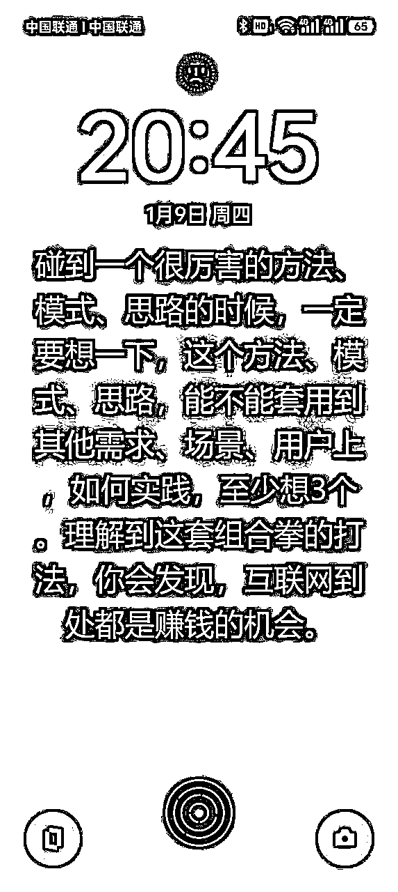

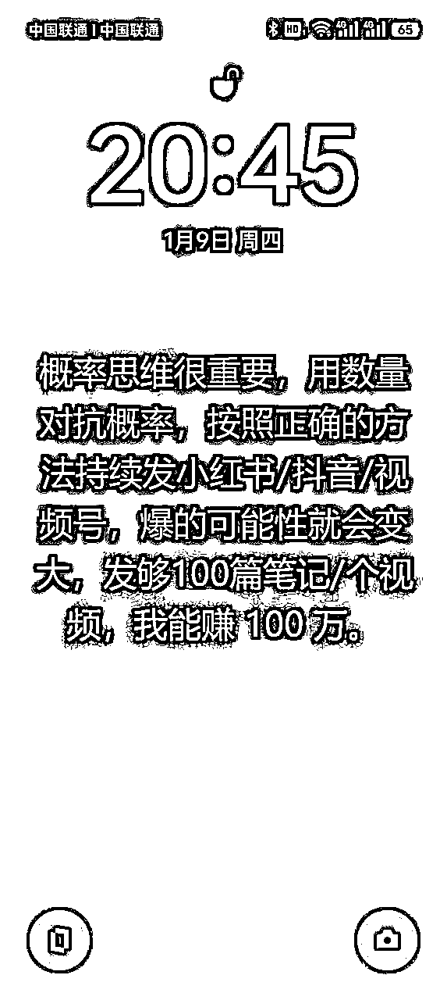

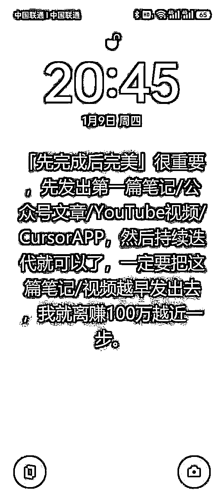

只要我们每一次手机屏保亮屏一次，就会显示出来，息屏再亮屏一次，就会切换下一张，这样我们也实现了这个效果，明白老师说的很多，一定要把一些方法贴在眼前，时时刻刻提醒自己要刻意去练习，重复次数多了，它就会变成你的好的惯性了！！

最后，我把程序打包成了应用软件，提示词：如何把文件变成.exe软件，而不需要每次代码运行程序

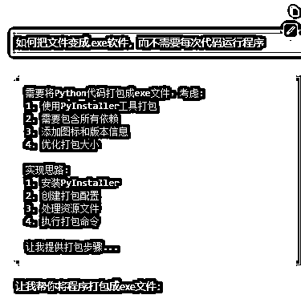

最后按照步骤去操作，就可以把文件打包成exe应用程序了，方便下次需要用时，直接打开就能使用了。

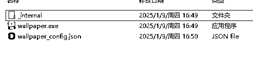

这是我第一次遇到的一个需求，然后通过cusor去实现了，感谢生财航海给我的基础知识，让我一个人也能做出简单的应用。第一次写复盘，内容结构有点乱，大佬们讲究看看。