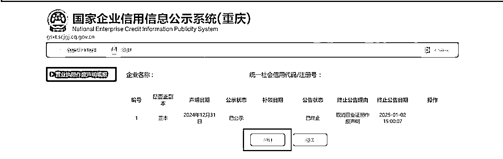
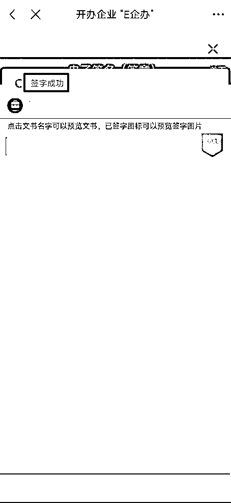
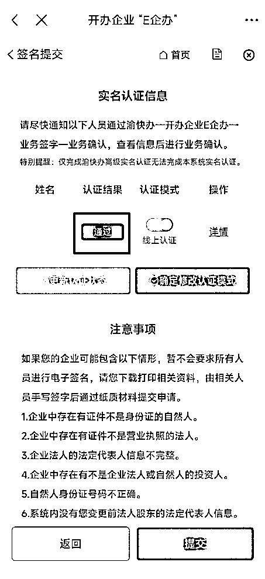

# 个体户营业执照注销教程

> 来源：[https://w63nbfedzw.feishu.cn/docx/SWjJdUHzloxKjCxplUsc7AYpnXc](https://w63nbfedzw.feishu.cn/docx/SWjJdUHzloxKjCxplUsc7AYpnXc)

这是一篇等待时间较长的文章，2024年12月31日花了几个小时写完之后，等待了2天审核才继续写完剩下部分(查了日历才发现1月1日放假🥱)，2025年1月2日提交了审核，2025年1月7日发现营业执照是注销状态了(主要是今天才查)。

# 背景

之前二手书的时候办理了出版物许可证，最近觉得没啥用了准备注销，网上找人可能需要100-300，且现在很多地方都可以网上办理了，就尝试网上注销。

# 注销过程

## 渝快办注销尝试

由于我的出版物许可证是在重庆办理的，我首先尝试使用“渝快办APP”进行注销操作。不过，在注销过程中，系统提示“未查到主体信息”，不知道是我的证有问题还是啥，我在国家企业信用公示系统可以查到的。

## 重庆市网上办事大厅注销

1、在渝快办APP不能注销，再试试网上办事大厅看看能不能注销，访问重庆市网上办事大厅【https://zwykb.cq.gov.cn/】，点击右上角【登录】：

2、使用渝快办App扫码登录：

3、登录后搜索【个体户】，在搜索结果中找到“个体工商户注销登记”，可以先查看【办事指南】：

4、办事指南：

个体工商户登记（备案）申请书的示例样表看起来有点复杂啊，要不还是花钱找人办理好了😭

5、点击【立即办理】：

6、选择【企业注销登记“一件事”】，点击【继续办理】：

点击【继续办理】。

7、选择【个体工商户】，这里需要用到【电子营业执照】小程序，微信扫码后会跳转到小程序，下载对应的企业电子营业执照再登录就好：

因为我在注销流程中，所以进入不了...😅

8、幸好我保存了资料提交页面，给大家展示资料提交过程：

我现在是已经填写完资料等待审核，给大家说下填写资料步骤的内容：

1、信息录入：填写营业执照信息、个人信息，点击【保存】再点击【下一步】

2、代理人信息：添加自己的身份证信息、手机号码、身份证正反面即可，点击【保存】再点击【下一步】

3、执照领取信息：执照领取信息步骤的营业执照缴回方式可以选择遗失公告、邮寄、现场缴回

选择邮寄会出现邮寄地址信息给我们，因为想留着做个纪念(bushi)，就选择了遗失公告，遗失公告要点击【发布营业执照遗失公告】，然后添加遗失公告就好，是否正副本选择【正副本】，营业执照副本编号填写【1-1-1】(我因为选择的是正本，被打回重新提交了)，填写完点击【保存与公示】(忘记是不是了，差不多)，点击【保存】再点击【下一步】。

4、资料上传：这一步上传营业执照的正反面即可。

5、提交审核：这个步骤会生成【个体工商户登记（备案）申请书(不含附表).pdf】，有这个之后应该不需要打印签字提交复印件了，可以下载保存相关资料。

最后提交审核就好，提交审核之后就不能继续提交信息了，会让我们尽快退出账号登录。

## 处理进度查询

### 重庆市开办企业“一网通”查看进度

资料提交审核之后不知道怎么查看，可以在重庆市开办企业“一网通”【办理进度查询】查看，在【办事进度查询】输入框输入企业名称或法人，然后点击【搜索】:

想知道具体情况可以点击【查看详情】：

### 渝快办查看进度

登录渝快办APP，在首页的特色专区点击【开办企业E企办】，然后点击【我的申请】即可：

后面签字就要用到渝快办了，接下来就是要等待了。

## 资料重填

今天收到电话，问我副本是不是已丢失了，没丢失需要退回，没想到自己前面为了省事没遗失副本也要寄回(因为当时输入副本号1，提示错误)，咨询了工作人员是要填写1-1-1才行，工作人员说给我退回修改流程。

在重庆市开办企业“一网通”【办理进度查询】查看，在【办事进度查询】输入框输入企业名称或法人，然后点击【搜索】，会跳转登录，使用渝快办APP扫码登录:

处理状态变成【待提交】了。

2、点击【查看详情】，然后点击【继续申请】：

3、点击【资料填写】右边的【展开】：

4、点击【1.3执照领取信息】右边的【立即填写】：

5、点击【发布营业执照遗失公告】，没有添加、修改按钮，提示【提示：如需终止本次公告，请登录国家企业信用信息公示系统终止。】：

需要先去国家企业信用信息公示系统终止公告。

6、访问国家企业信用信息公示系统【https://www.gsxt.gov.cn/】，点击右上角【登录】，如果没账号，需要先注册，输入账号、密码信息，然后点击【登录】：

7、登录后，点击【企业信息填报】，选择自己所在的地区：

8、使用电子营业执照登录，微信扫码会跳转：

阅读文件，然后点击【确认】，会跳转到法律文书确认地址页面，点击取消返回即可。

9、点击【营业执照作废声明填报】：

点击【终止公告】。

10、选择终止公告理由为【取消营业证照作废声明。】，然后点击【提交】：

11、添加公告，点击【添加】：

12、是否正副本选择【正副本】，营业执照副本编号填写【1-1-1】，点击【保存并公示】：

13、返回重庆市开办企业“一网通”填写资料页面，点击【更新】：

可以看到信息已经变成最新的了。

14、点击【下一步】，再【下一步】进入【提交审核】页面，然后点击【提交】：

处理状态变更为【资料确认中】了，继续等待资料确认审核。

15、过了没几分钟，就收到注销已进入签名环节的短信，可能是没太多人注销，所以很快吧：

## 电子签名

1、打开渝快办APP，点击【首页➡️特色专区➡️开办企业E企办】，查看【我的申请】：

可以看到电子签名中的流程。

2、点击流程，然后点击【签名】，实名认证结果提示【不通过】，点击【确定修改认证模式】：

3、拉到下面进行签字，点击【签字情况】，发现原来是要通过【渝快办一开办企业E企办一业务签字一电子签名】进行签名：

4、返回【渝快办一开办企业E企办】，点击【业务签字】：

5、人脸识别后，点击【电子签名（签章）】，选择要签名的流程，点击【签名（签章）】：

6、签字，签字好后点击【提交签署】：

提示【签字成功】。

7、再次进入【我的申请➡️签名】流程，可以看到实名认证结果是【通过】，拉倒页面最底部，点击【提交】：

提示【您的流程已提交成功，请等待工作人员审批。】，接下来等待审批了。

## 业务办结

### 渝快办查询进度

签名之后过了几个小时，突然想起来看下业务进度，发现业务已办结，居然没有短信提醒或者APP提醒。

1、登录渝快办APP，在首页的特色专区点击【开办企业E企办】，然后点击【我的申请】查看业务进度：

就这？这是注销完了还是没注销？

### 重庆市开办企业“一网通”查看进度

1、访问重庆市开办企业“一网通”【办理进度查询】查看，在【办事进度查询】输入框输入企业名称或法人，然后点击【搜索】:

2、点击【查看详情】查看具体情况：

看起来是注销成功了。

印章备案信息、相关许可信息将同步注销：印章和许可信息(出版物许可证)会同步注销，我这里没有印章，所以不用管，许可信息同步注销也不用管。

社保、医保、公积金将在企业欠费及相关事宜处理完毕后同步注销：这个个体户没有办理社保、医保，也不用管。

企业开户银行将主动和您确认账户预约注销事宜：没有开对公户也不用管。

3、点击【通知书打印】：

登记成功。

## 查询注销情况

登录国家企业信用信息公示系统【https://www.gsxt.gov.cn/】查询企业信息：

发现还在存续状态，需要等注销信息同步过来。

2025年1月7日查询：

今天突然想到查询注销情况，发现已经注销了，说明这个方法是可行的👍。

# 总结

现在各省市都推广无纸化办公、线上办事“一网通办”，确实很方便，很多业务都可以线上办、一次办，省去了线下办理的时间6️⃣6️⃣6️⃣

上面的个体户注销方法虽说是重庆的，但其他地方的应该是大同小异。

# 附录

## 各省的政府网站

网站规则，把省缩写换成营业执照所在省的缩写就好，有些省的可能不适用这个规则，可以直接搜索：

https://www.省缩写.gov.cn/

如：

广东：https://www.gd.gov.cn/

重庆：https://www.cq.gov.cn/

江西：https://www.jiangxi.gov.cn/

## 各省个体户注销登记办事指南

### 广州市个体工商户注销登记-办事指南

https://www.gdzwfw.gov.cn/portal/v3/guide/11440111347506174H4440125016002

纸质和电子化材料都可以，说明可以网上办理。

### 广州市开办企业一网通平台小程序（个体业务）

https://air.scjgj.gz.gov.cn/aionweb/gzsdy.html

广州市开办企业一网通平台小程序（个体业务）

下载个体微信操作手册

广州在广州市开办企业一网通平台小程序处理会更方便，广州网上办事效率杠杠的，我第一个广州个体户营业执照就是用这个办理的，可以看我以前的教程 。

### 江西个体工商户注销登记

https://jajs.jxzwfww.gov.cn/jxzw/bszn/index.do?webId=87&itemCode=360822-000201017000-XK-117-02&flag=gj

电子和纸质材料都可以，说明可以网上办理。

其他地方的大同小异，直接找就好。