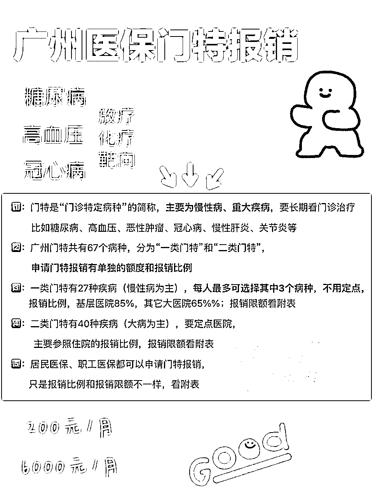
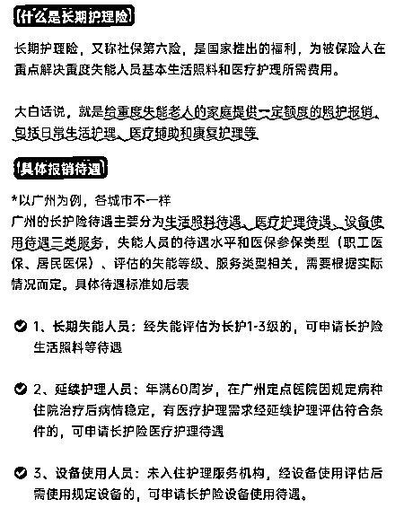
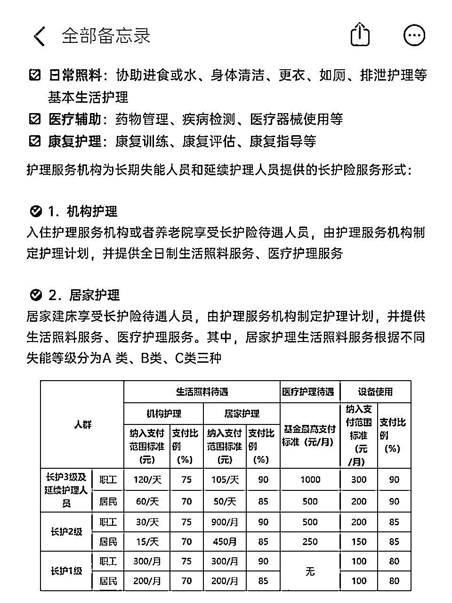

# 省钱有术，当生病时如何省更多钱？

> 来源：[https://yapsq9774vc.feishu.cn/docx/SkXedKBzPokQUSxqJ6ncRDhNnJh](https://yapsq9774vc.feishu.cn/docx/SkXedKBzPokQUSxqJ6ncRDhNnJh)

大家好，我是佳佳。

主业工作医疗运营，帮三甲医院的医生写科普，日常有在门诊学习；

副业保险经纪人，喜欢研究医保，加上家里有癌症病人，日常就是琢磨如何报销更多。

去年在生财看了几篇省钱的帖子，我灵光一闪，为何我不发挥我的专业，来给大家说一些关于生病时如何报销更多的信息差。

于是这篇文章来了。

本文分为三部分：

一、医保范围内可省钱的信息差

二、当发生大病时，有什么方法报销更多

三、如何做好提前预防

## 一、医保范围内可省钱的信息差

因为全国各地医保的报销比例和范围不一样，我讲一些共性问题。

这里我先以广州的报销范围举例，方便接下来大家理解。

### 1、职工医保的报销比例会比较高，且缴满年限以后，退休即可免费享受

### 2、大城市的新农合会比小城市的报销待遇更优，特别是在大病报销和住院自费比例上

比如最近看到费用接近1万的肿瘤全身断层显像(PET-CT)在很多城市是自费的，但深圳居然可以报销，甚至报90%。

了解这点可以怎么省钱？

如果长期在大城市生活，没有职工医保，建议买大城市的新农合，有些地方得提前办好居住证。

今年我就是这么操作，帮家里老人换成了广州医保，大病报销比例高10%。

### 3、如果是长期异地生活或者有异地就医的需求，要提前办好备案，这样子报销比例会更高

一般备案的话住院报销比例会高个10%，甚至是报不报的差异；

职工医保门诊不备案的话纯自费

备案平台：国家异地就医备案 小程序

### 4、异地就医报销遵循的是就医地目录，参保地政策。

比如湖南医保来广州，啥项目能报销是广州说了算，但报销比例、报销限制多少是湖南说了算。

这点有时候也挺重要的，比如有一个很昂贵的针，叫升白针，一针两千多，这个针也是每个城市的报销条件不一样。

了解这点可以怎么省钱？

如果有一些费用比较高的手术，又考虑去大城市时，可以看看大城市能不能报销。

如何查到药品是否可以报销：

路径：支付宝APP首页搜索“医保目录”——点击“国家医保药品目录查询”——输入要查询的药物名称，就能搜索到药物的相关信息。

### 5、有时候回参保地报销更划算

这点跟4说的东西有点像，但上述讨论的是就医地的问题，这个是讨论参保地的事后报销的问题。

实际上，有些涉及到跨市的项目，是可以拿回去人工报销的，尤其是涉及到一些跨省的。

这里跟4一样，由于参保地和就医地报销范围的不一致，有一些项目，属于可报可不报的。

举个例子：正颌手术（抖音博主良久做的那个）。

这个手术的报销很有争议，在上海、广州不报，但部分城市（汕尾还是汕头、湛江）能报。

那如果一个汕尾的朋友了解这个信息差有什么作用，在异地做时候不要走联网结算，拿回去报销。

### 6、有些地方的医保即买即生效

之前广州职工医保就是这样子的，所以有些人会利用这个规则，在没有买任何医保的情况下，查出问题后就想办法当月买广州医保，次月就医，可以报销六七成。

但今年不确定行不行，这个做法对于一直缴纳医保的人来说有点不公平，所以后续不一定会有。

### 7、大病二次报销

这个也不是什么稀罕的福利，医保自带，但我发现很多不了解医保的朋友不知道。

大病二次报销是当住院自费金额（医保内报销后自付的金额）达到一定数额的时候，就会触发二次报销，即自付金额可以再次报销。

这个实际上不需要申请，是医保自带福利，只要在医院联网结算到了一定金额（一般是1万多）就可以二次报销。

了解这点有什么好处：

如果是治疗周期比较久（比如像癌症、肾透析），又刚好遇到年底，医保年度时间，就可以看看有没有费用要享受大病二次报销，提前结算或者推后。

像我在的一个癌症病友群，平均治疗周期是4-6个月，只要是今年已经到达大病二次报销的额度，大家都会在年底催医生提前开好单拿好药，这样子自付费用可以二次报销，省个几百到一两千。

像我们这种今年没到的，明年才有更多需要报销的，就会让医生尽量留着明年开住院单和检查。

### 8、门特和门慢申请

很多疾病，不需要住院，但需要长期服药或者在门诊化疗、做肾透析等。

如果是新农合或者异地就医，有时候就没办法报销或者报销额度不够，像广州成年人的新农合是不报销三甲医院门诊的，只报销社区医院的药费，且每年只有600元额度，我看了几个几个省，基本也是。

但这些疾病是可以申请门特或者门慢报销的，申请后即使在门诊治疗，也可以享受住院待遇。

这些疾病包括恶性肿瘤、帕金森、肾透析、高血压、高血糖、双相等等，非常多种。

所以有需要的话小伙伴可以了解当地的门特门慢政策。

门特门慢申请一般申请流程：

1）有对应鉴定表或者报告；

2）由高级别医生开具申请表；

3）在医保局或者医院窗口申请。

跨省的话建议问医保局。

### 9、挂床检查

挂床检查的意思就是办住院去做检查。

如果病人是新农合，医生建议住院检查的时候，一定要住！

因为新农合基本不报销门诊检查，尤其是三甲医院，但住院能报销检查费，医院普通病床的床位费真的很便宜。

之前我没了解这点，家人符合住院标准但我们觉得太麻烦没住院，在门诊自费4000多做检查。

去年家人生病时，我们主动问医生能不能住院，长辈被收进医院，金额7000多，最终自费2600。

挂床检查还有一个好处，如果你有百万医疗，挂床检查的费用可以算住院报销费用！

（有些医疗险的门诊不包含住院前后检查或者只报销前7天）

但越是大医院，床位越紧张，医生越不同意挂床，尤其是在现在的drg改革下。

这里也延伸出来一点，生病时，如果非紧急的可以先在普通的二甲、三甲医院做完检查，带着报告去上级医院就医。

（当然这也有可能多花钱，因为小医院的影像可能会不被认可需要重拍）。

### 10、留意当地有没有护理险

长期护理险，又是一个很多人不知道的东西，又称社会第六险，目前只在一些城市试点。

关于它，我还写过科普，就直接搬运过来了，它主要的作用就是如果家里有一些重度失能的老人，可通过申请鉴定，获取一些护理补贴。

这个是自动缴费的，不需要额外参保，具体可以查查当地有没有。

申请流程：

1、拿到病历，失能状态持续稳定6个月后申请

2、会有评估机构评估

3、根据评估结果享受不同待遇

### 11、医保定点

差点忘了说定点的事情，一般是年初的时候要记得定点，定点后才能享受报销。

定点的话全国各地规则差异太大了，就不展开说了，现在定点也比较方便，在医院公众号、微信城市服务、支付宝就可以定点。

了解定点的规则也是一个很好玩能省钱的事情。

像广州职工医保是一家三甲+一个社区医院+一家中医院+专科医院不限制。

去年我想让家属去做个睡眠监测，但对口的那家三甲医院没有设备，去其他三甲得自费，最终我们定点了省中医，检查费用1000多，报销后300多，住的还是相当不错的独立病床。

## 二、当发生大病时，有什么方法报销更多

其实很多东西都在上个环节讲完了，这个部分能讲的东西不多了。

这部分我想结合自己做医生运营的经历以及自己陪着家人抗癌的一些省钱攻略。

### 1、如果是比较重要的问题，在非紧急需要马上做手术的情况下，建议多看几个医生

有时候医生与医生之间的方案会差异，这个差异甚至大到是不是需要做手术、术后预后怎么样的差别。

即使在最知名的医院也有这样子的案例，这个是我们在门诊经常遇到的。

用腰突来举例，我对接的医生更认可大部分的腰突不需要手术的，更多的是靠运动康复。

但我们也遇到了很多在外院说要做手术的患者，我跟进他们的情况，后面通过运动也康复了。

当然我也不是100%支持这个说法，因为运动康复的方式实际上更适合自律、依从性强的轻症病人，这里只是想举例说明区别。

如果对于一个医生的医品或者医术不够了解，多听听病友的建议及多看几个医生，也是一个省钱少走弯路的方法。

### 2、多做功课，多看专业医生的科普

作为一个医生运营+癌症家属，我最大的心得就是：家里一定有一个懂做功课的人，这样子是对家人健康负责的表现，也不会被忽悠或者耽搁治疗。

现在抖音上也有很多医术很棒的医生在用心做科普，能帮大家快速地了解一个疾病。

说说我家人的案例，一开始医生没让她做检查，在我坚持下做了检查；

检查结果出来，医生又说是淋巴上皮癌，不能手术，吃药就好了，最后我们果断到中山肿瘤，在中山肿瘤确诊为鼻咽癌。

在这个过程里面，医生的说法没有任何问题，没开检查是因为他们的技术做不了，他担心我们觉得核磁贵；

按淋巴癌治疗是外科医生给的建议，加上淋巴上皮癌是一个非常罕见的肿瘤，所以他们能给的是很保守的建议。

但他们的描述，会让不懂医学的人充满疑惑。

而在这个过程中，得益于我们有在认真做功课，所以在省钱的同时，也争取了合适的治疗。

如何快速做功课：

1）只看大医院的医生发的科普，尤其是医生自己拍的，如果是mcn公司代运营的话，内容不一定是医生写的（一般医生会参与审核），如果是小医院建议略过；

2）公众号上有些是医学相关人员做的内容，输入越专业的医学词专业程度越高，特点就是专业内容多、数据多、图多，一看就是专业派，这样子的数据可信点；

3）腾讯医典的科普、丁香医生-找医生的小程序里，筛选全国知名医院医生的回答，有些医生的答复很专业且简单易懂。

### 3、不在小医院做手术

这个跟上面道理一样，我曾经见过小医院转过来的术后伤口感染、没做好需要二次手术、术后没做康复导致下肢无力的病人。

里面不乏还是年轻人，甚至有个13岁的小男孩一年做了两次半月板手术，第一次没做好，膝盖磨了一年又烂了，做了第二次，花钱又受罪。

也不是否认所有小医院的医生，但对于病人来说，筛选成本太高了，很难用自己的身体去试错。

### 4、如果是异地求医或者日常上班要请假做检查，可以利用好互联网医院

现在去医院的就诊流程是去了要先开单做检查，大医院的话当天还不一定能预约上，等检查完还要约医生看报告。

对于异地求医或者上班族太难了，快捷的方法就是先利用好互联网医院（一般在医院的公众号里可以查到），先挂号医生开检查，预约好检查再约医生，如果检查结果要等待可以在互联网医院继续问医生。

这样子可以省很多时间，也可以少跑一两趟。

不过很多问题医生可能会要求查体，所以不一定有用。

一般我的操作是先挂个普通号跟医生沟通，了解医院的就医流程和开单。

### 5、异地就医的住宿问题

如果是一些需要长期异地就医的疾病，住宿费也是大头。

异地就医找房子很麻烦。

好点的房子基本不短租、或者很贵，又或者是房东会忌讳租给病人，长期住酒店又不方便给病人做饭，如果找中介，要给半个月租金，甚至中介也不太想做这种限制多又赚不到钱的小单。

我在这块也踩过坑，之前为了给家人找个房子，花了很多时间在小红书、闲鱼、链家上搜了很多房源，但最终发现都不太符合我的需求，后来我直接选定区域后花一天去线下挨家挨户问，看了十个就找到找到合适房源。

很多房主都是年龄稍大，不会在小红书上发布房源，在小红书遇到的基本是二手房东、想转租的租客、又或者是只有一套房出租的房主，大部分符合要求的房源是在线下的，所以线下找才是最快和最省钱的

### 6、惠民保

惠民保是政府和保险公司推出的惠民性质的保险，一般一两百块，年底参保，有效期一年，可以报销部分大病费用。

需要注意的事情，惠民保报销门槛比较高，且有些惠民保会降低既往症的报销比例，所以要有正确的预期。

### 7、癌症等重大疾病的一些额外报销

在中国，恶性肿瘤是高发疾病，而且算是最花钱的病。

国家也有一些额外的补贴，具体每个地方政策不一样，一般是低保户或者特殊身份才能申请，所以就不展开说了，放在这里。

1）申请两癌补助（乳腺癌、宫颈癌）

2）申请居民低保二次报销

3）申请大病救助一次性救助金

4）居（村）委会申请一次性救助金

5）退役军人应急救助

6）可以进医院的科研组，获得免费药品

## 三、如何做好提前预防

### 1、体检体检体检

很多在体检中发现的问题都是幸运的，因为基本都是早期，早期花费少，受罪少。

国家也有开展一些免费的两癌、五癌筛查，适合给舍不得花钱的爸妈申请。

### 2、不讳疾忌医

我也是个典型的讳疾忌医的人，但家人的事情真的点醒了我，从一年前淋巴无痛性肿大，确诊时已经是晚期还有骨转移，需要花更多的钱及吃更多的苦。

最讽刺的事情是，我今年写过一篇科普，有提到这种无痛性的淋巴肿大要高度注意，可惜我没注意到家人就有这个问题。

日常在门诊里，我也见过很多爷爷奶奶，长期膝盖疼痛，觉得是老年病不敢麻烦儿女，最终疼到不行去看医生的时候已经需要换膝盖（差不多10万）。

还有像老年人常见的骨关节炎，它分了几个时期，越早干预越好。

另外有一些爷爷奶奶觉得是小问题，自己吃中药，长期吃中药把胃吃坏了，又或者是长期被病情折磨到抑郁，甚至没有求生欲望。

有时候我分析这种心理，更像是一种害怕心理，以为没看到就是没有病，担心连累家人，但理智且省钱的做法是及时就医，背后还是需要家人的定期关怀。

### 3、记住一些疾病的特征，以及做好预防

比如心梗、脑梗，这两个出现前也会有一些不舒服的症状，如果家里有高血压、高血脂的人也可以多做功课，跟当事人叮嘱有类似的症状及时说出来。

也可以买一些药，心梗、脑梗都有一些对应的药，关键时候能救命。

抖音有老人必备的四种药的科普视频，可以去看看，根据自己的需要买

### 4、员工的医疗险

对于已经确诊的疾病，很难通过商业保险去报销。我想到的两个稍微可行的就是惠民保，以及公司的医疗险。

有些公司的团体医疗险，可以报销既往症，也就是已经出现的问题。比如有个朋友有糖耐受损（糖尿病前期），需要吃药，她求职的公司有团体医疗，通过公司团体医疗报销了一部分。

所以在择业上，也可以把公司的医疗险福利作为一个加分选项。

### 5、买商业保险

公司团体医疗险的问题，不保证续保以及一般只报销社保内，但实际上社保内的费用医保已经报销了大部分，社保外的费用才是花钱的大头。

大部分重疾花费真的很贵很贵，每次我在医院结算的时候都在想，大部分家庭是生不起病的，能看得起病的家庭很幸运，医疗费用很考验人性。

对比下商保还蛮便宜的，所以如果有条件的伙伴，可以考虑给自己买个医疗险+重疾险，给老人买个医疗险，医疗险尽量买可保证续保的，保障责任有住院前后门急诊、特殊门诊、住院责任、门诊手术的，重疾险选择保终身的消费型。

医疗险是保证自己在医院内的大部分费用可以被报销；重疾险主要是补偿生病时劳动丧失的损失、住宿费营养费、护工费。

### 6、如果买保险的情况下，一定要注意病历的撰写和健康告知

很多保险拒赔都是因为做不好健康告知，又或者是病历的撰写不符合报销规则。

我在门诊也经常看到有很多患者来找医生改病例，原因是不符合报销的条件。

一般这块有几个坑：

1、患者会告知医生的生病时间早于投保时间，比如有个伙伴买了一个次日生效的医疗险，次日去医院就诊，病历写着发烧3天；

2、有时候医生会出于好心，写一个诊断方便医保报销，比如我没有糖耐受损，去查血糖的时候医生为了给我报销就写了糖耐受损，导致到我后面买保险一直被拒保，还有睡不好就写睡眠障碍；

3、本身有一些体检异常，但忘记或者不知道是大问题，在买保险的时候没有告知

4、想报销意外险但病历上写的原因跟意外无关

5、买健康险前先去体检。不紧急的话建议不要去，买完过了等待期再去

6、医保卡不要外借给家人用于报销（用里面的钱可以），这个涉及到骗保，万一对方有个什么高血压等问题，后续自己买商业保险时就会很难

所以买保险时要做点功课或者多问代理人或经纪人。

### 7、健康=充足的睡眠+均衡的饮食+适当的运动+愉悦的心情+（药物摄入，当有疾病时）

这是我很喜欢的医生跟我分享的理念。

之前我觉得是一句蛮正确的废话，但经历了家人生病、对接了无数病人之后，发现这就是真理，养生才是最好的预防。

很多病情的出现可能是上面某个环节做不好，比如睡不够、不运动、心情抑郁，所以要全面重视健康。

身体是革命的本钱，先有健康的身体，才有赚钱的能力。

以上就是我的分享，希望大家身体健康，生财有术，省钱有术。