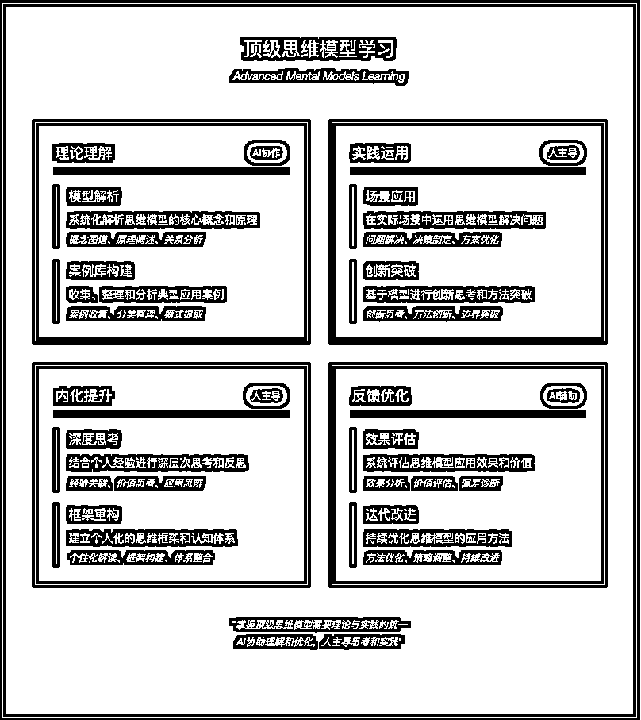
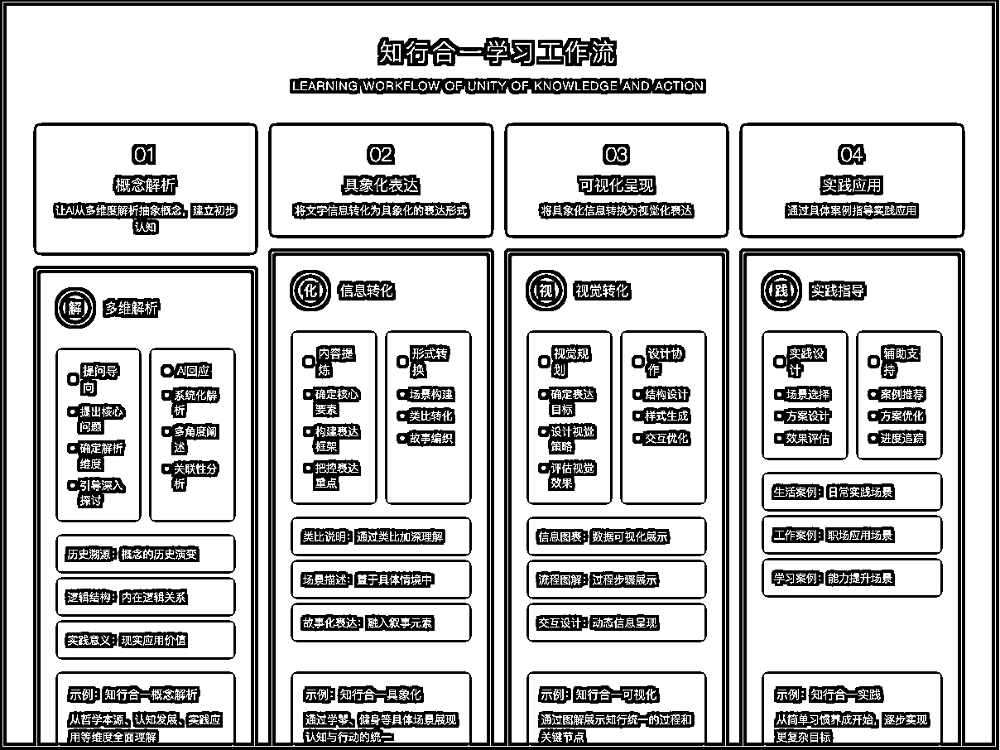
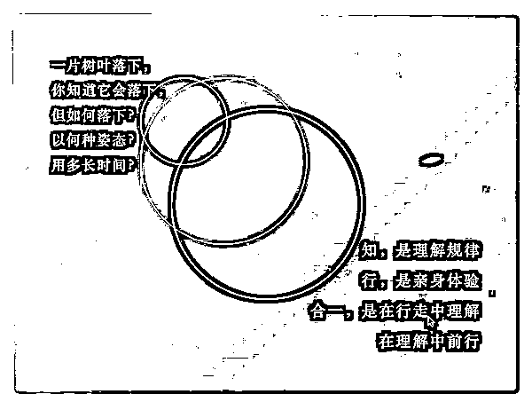
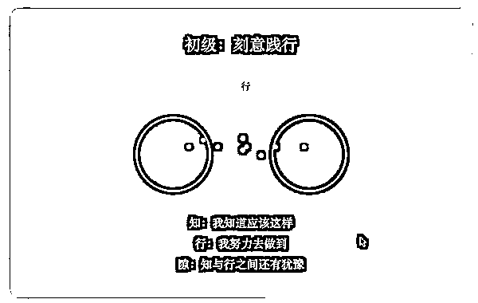
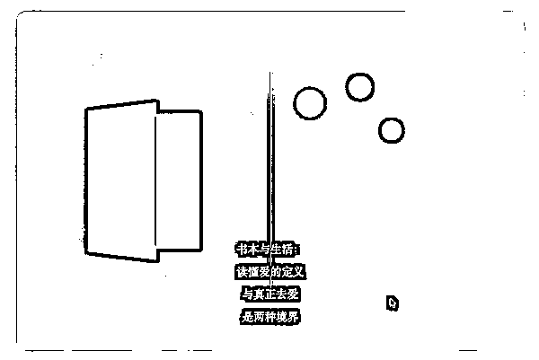
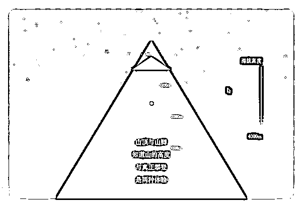
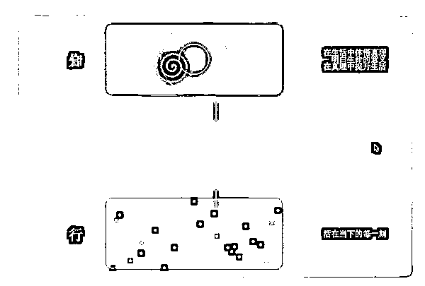
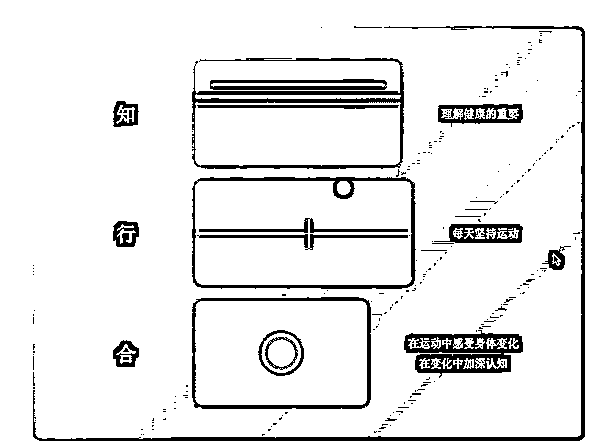
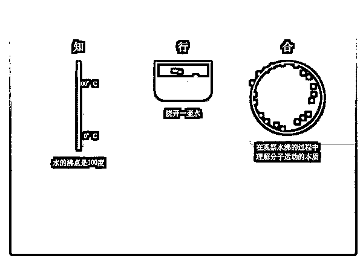
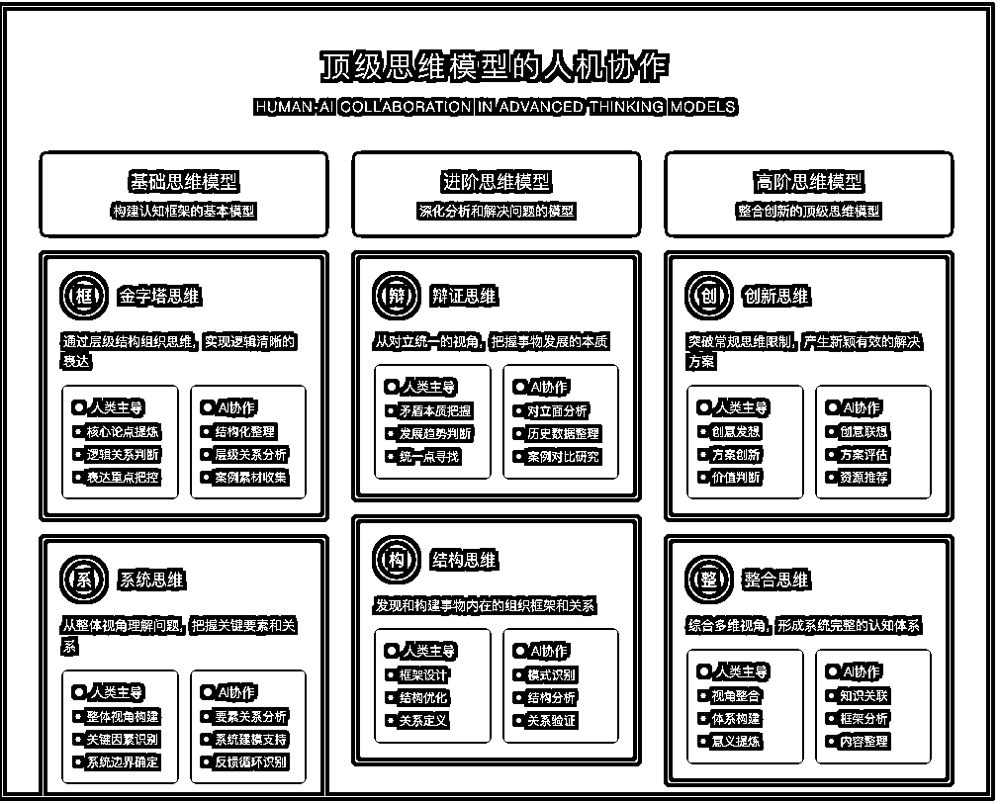

# 以王阳明“知行合一”为例，AI 工作流拆解学习顶级思维

> 来源：[https://aiawaken.feishu.cn/docx/X24DdCgI3oJ7JGxib14cVeYdnAb](https://aiawaken.feishu.cn/docx/X24DdCgI3oJ7JGxib14cVeYdnAb)

hi，我是周知

"看小说时，总被'主角光环'戏弄

动不动就顿悟绝世功法，

转眼就能逆风翻盘。

现实哪有这么容易？

顶级功法就摆在那里，

却总是看不懂，悟不透。

但今天，我突然发现：

但在 AI 时代，

或许我们每个人，

都能拥有属于自己的主角光环。

今天，我以王阳明“知行合一”为例，

AI +人协作如何拆解学习顶级思维。

* * *

## 工作流分析

### 思考：学习是什么的过程？

我觉得学习不是灌满一个杯子，

而是点亮一盏灯

知识从眼前掠过的文字，

变成脑海中的灵感，

再化作行动中的智慧，

看到≠理解。

理解≠内化。

内化≠应用。

就像餐厅学做菜：

先看菜谱是学习，

明白食材搭配是理解，

独创新味道是内化。

### 思考：学习思维时？AI 与人协作的比例是怎样的？



## 设计工作流：

1，先问 AI 详解"知行合一"的核心内涵，它能从多维度阐释，让抽象概念具象化。

2，文字是信息， AI 协助让信息具象化增强 看到到理解

3，信息具象化进一步让信息可视化，增强 理解到内化

4，例举真正的生活案例参考练习，增强内化到应用的概率



* * *

## 演示：概念解析

输入：从用哲学方法解释知行合一的本质，错误认知模式，认知层次，修炼路径

### 本质透视知与行的关系像是：

河流的两岸

知识是左岸

行动是右岸

流动的水是连接

若无流动，两岸只是死寂

树的根与果

知识如根系

行动似果实

养分在流动

缺一不可活

呼与吸

知是吸入

行是呼出

节奏自然

断则不生

### 错误认知模式常见的断裂：

知而不行

*   收集者症候群

*   信息焦虑

*   行动瘫痪

*   完美主义陷阱

行而不知

*   盲目忙碌

*   机械重复

*   表象操作

*   无效努力

### 知行合一的层次从浅入深：

Level 1: 机械衔接

*   知识→行动

*   简单因果

*   表层连接

Level 2: 反馈循环

*   知识⇄行动

*   互相验证

*   动态调整

Level 3: 浑然天成

*   知行一体

*   自然流露

*   无需分别

### 修炼路径阶段性突破：

Stage 1: 觉知分离

识别断点

*   哪里知而不行

*   哪里行而不知

*   为什么分离

Stage 2: 建立桥梁

搭建连接

*   小步快跑

*   即学即用

*   持续反馈

Stage 3: 打通循环

形成系统

*   知促进行

*   行深化知

*   良性循环

Stage 4: 浑然一体

境界提升

*   自然流露

*   不假思索

*   心手合一

* * *

## 演示：具象化表达

知与行的辩证

一片树叶落下，

你知道它会落下，

但如何落下？

以何种姿态？

用多长时间？

```
知，是理解规律
行，是亲身体验
合一，是在行走中理解
     在理解中前行
```

1.  作为状态

```
知：水的沸点是100度
行：烧开一壶水
合：在观察水沸的过程中
    理解分子运动的本质
```

1.  作为过程

```
知：理解健康的重要
行：每天坚持运动
合：在运动中感受身体变化
    在变化中加深认知
```

1.  作为境界

```
知：明白生命的意义
行：活在当下的每一刻
合：在生活中体悟真理
    在真理中提升生活
```

【知行的距离】

山顶与山脚

```
知道山的高度
与真正攀登
是两种体验
```

书本与生活

```
读懂爱的定义
与真正去爱
是两种境界
```

理论与实践

```
理解游泳原理
与投入水中
是两种维度
```

【合一的层次】

初级：刻意践行

```
知：我知道应该这样
行：我努力去做到
隙：知与行之间还有犹豫
```

中级：自然融合

```
知：我理解这个道理
行：我习惯性地这样做
融：知行开始自然统一
```

高级：浑然天成

```
知：已化为内在直觉
行：已成为自然流露
一：不觉知与行的区别
```

* * *

## 演示：可视化呈现（部分演示）















* * *

## 演示：实践应用

一个场景显现：

清晨六点，

闹钟还未响，

你已醒来。

窗外天微亮，

昨晚读完的那本

《晨跑改变人生》

还放在床头。

你知道晨跑的好处，

知道它能促进代谢，

提升精力，

改善心情...

但此刻，

被窝好温暖，

床好舒服。

你听见内心的对话：

"再睡会儿吧..."

"不，说好要开始的..."

"明天再开始？"

"每个明天都是今天..."

掀开被子，

冷空气瞬间袭来，

你打了个寒颤。

穿上运动服，

系好鞋带，

推开门，

清冷的空气涌入肺部。

第一步，

很重。

第二步，

还是重。

慢慢地，

呼吸找到了节奏，

双脚不再沉重。

十分钟后，

你感受到：

血液在加速流动，

身体开始发热，

思维变得清晰。

路过小区的湖边，

晨光洒在水面，

你第一次注意到：

原来这个时候，

湖面是粉色的。

转角处，

遇到每天都在这个点

晨跑的老爷爷，

他朝你点头微笑：

"年轻人，坚持啊！"

跑完回家，

冲个温水澡，

喝杯温水，

整个人都不一样了。

打开日记本，写下：

"原来知道和做到之间

只差一个起床的勇气"

傍晚回家，

你很自然地

没有乘电梯，

而是走楼梯。

不是因为记得运动好，

只是身体自然地

想要动一动。

睡前，

你发现手机显示：

步数 9847。

你穿上运动鞋，

在客厅走了 153 步。

记录下今天的感受：

"知道不难，

做到不易，

但一旦开始，

身体会记住一切。

书本告诉我晨跑的好，

但只有迎着晨光跑起来，

才真正明白

什么是晨跑的好。"

放下笔，

你调好明天的闹钟，

心里已经在期待

明晨的第一缕阳光。

这一天，

你不是在理解知行合一，

而是在经历知行合一。

* * *

现在，我懂了，知行合一：

不问为什么，

自然而然，

犹如：

饿了就吃，

困了就睡，

该做就做，

无问，无答，

只有当下，

我需要将提高知，实践行，

犹如呼吸的当下。

* * *

也欢迎大家尝试学习拆解以下思维方法：



* * *