# AI写作12月航海 -榨干自己卷打卡，航海收益1.45万

> 来源：[https://nq6ely6i3k.feishu.cn/docx/TxL8dd6hxoybXlxweGscRPsBnAf](https://nq6ely6i3k.feishu.cn/docx/TxL8dd6hxoybXlxweGscRPsBnAf)

大家好，我是五四青年，生财编号8826，4年老圈友，12月参加AI写作航海，通过极致榨干自己卷打卡，航海收益1.45万，并获得AI写作4个群的高手分享机会，受到50+圈友的主动链接.

本篇分享涉及内容：

1、辗转多个项目未拿到结果怎么办？（经常换项目未拿到结果的圈友必看）

2、新手做项目的正确认知（针对刚做项目的新手圈友）

3、参加航海的正确姿势（对参加航海没收获的圈友）

4、AI写作全链条（流量、转化与交付）21个知识点（AI代写月收益1.5万以下必看）

>来自AI写作12月航海21天极致榨干自己卷打卡梳理而来

——————————————————————————————————————————————

# 自我介绍

大家好，我是五四青年，生财编号8826，4年老圈友，曾多年大厂运营，做过多个项目-知乎好物、撸货、小说CPS、小红书虚拟资料、短视频带货，历经18次航海，终于在AI写作9月和12月航海中，找到了参加航海的正确姿势，通过极致榨干自己卷打卡，航海期间收益1.45万，并获得高手分享的机会，受到诸多圈友的链接.

通过12月AI写作航海每一天的极致卷自己打卡，被我的志愿者MIA@MIA发现，并推荐到领队-依琳@依琳，然后在航海运营雪雪 @雪雪 的帮助和润色稿件下， 有了高手分享的机会，也因为认真打卡不仅形成了一整套的AI写作Sop指南，还认识到很多同行的伙伴，此外项目收益超额完成航海目标50%达1.45万，对项目理解与收益可控性都大大上了一个台阶.

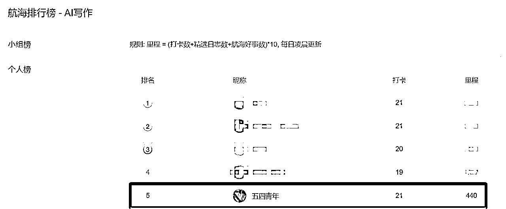

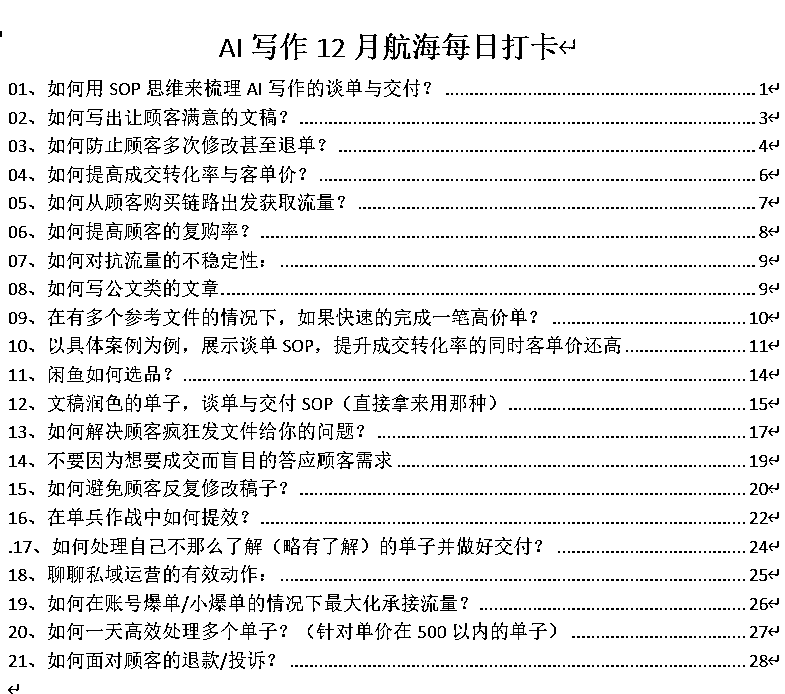

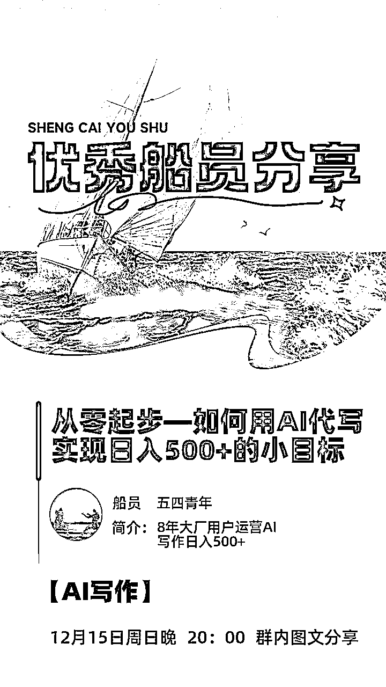

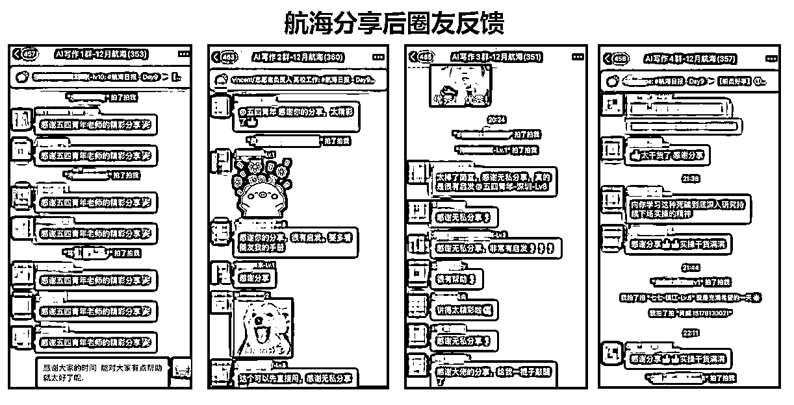

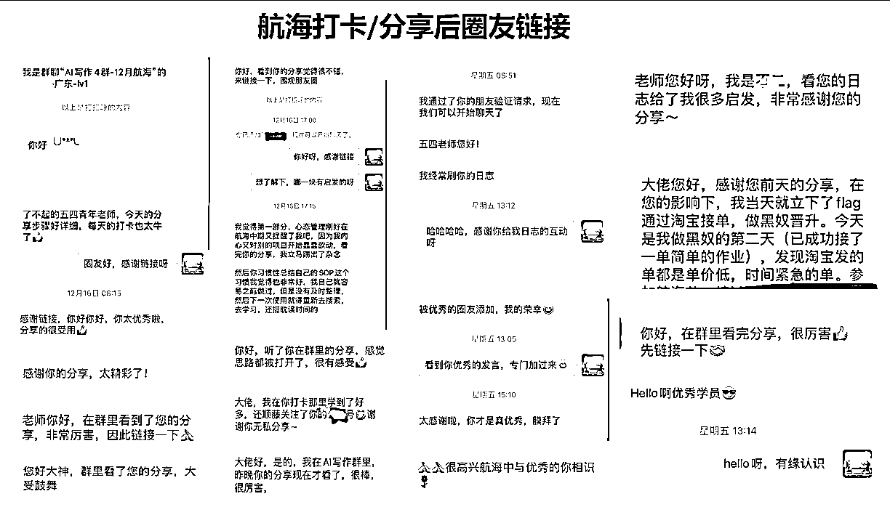

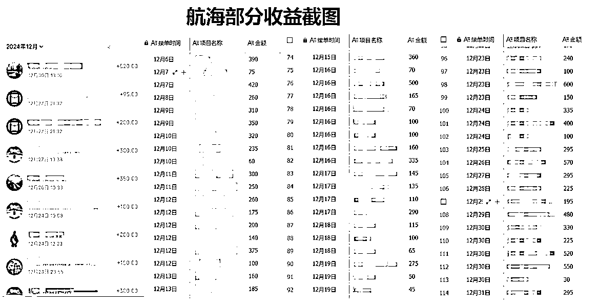

# 第一部分：做项目的正确心态

## 一、聚焦一个项目，干起来再说

本小节针对人群：辗转多个项目未拿到结果的圈友.

### 1、不要贪多，一次选择一个项目

在生财的这4年，经历过好些个项目，累计参加过18个航海，最疯狂的一次，一期航海直接报名了4个航海，结果就是顾头不顾尾，什么都想要，什么都没有要到.

本次航海我报名了2个航海，虽然AI写作航海9月也有参加并跑通了项目闭环，但要扎实的参与进航海是真的没有精力跟上另外一个航海的节奏.

对于刚做项目的新手或者对于还没有在一个项目拿到好的结果时，最好的策略就是专注一个项目，一次只报名一个航海.

### 2、大致选择一个项目，干起来再说

来自亦仁老大分享7条原则中的第五条：

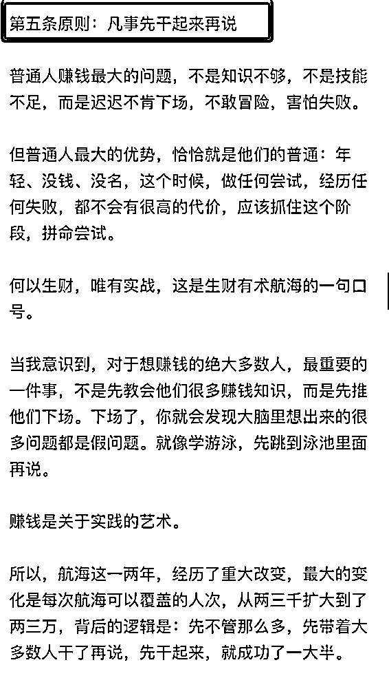

我们总是在追求一击必中，总是在找一个最合适自己的项目，所以要么犹犹豫豫迟迟不敢下场，要么下场到具体项目了没有投入所有精力还在看其他项目.

这么多个项目做下来发现，所谓的好项目都是在一次次的不同项目实战中迭代出来的，过程中你对怎么做项目更加了解、对自己也更加了解，不要追求一次就选对.

选择一个项目先下场，先专注的做起来，华与华的华杉老师说过“所有的事都是一件事”，当你在一个项目中跑通，拿到结果，哪怕你切入做其他项目也是更加得心应手，因为项目千千万，抽丝剥茧，绝大多数项目都回归到 明白老师@明白 在20年一篇精华中写到的赚钱清单：需求、流量、营销、变现. 实在不知道做什么项目，就随手拿起一个项目，专注干个100天、发100个作品、做100次看看反馈. 用亦仁老大的说法：“试试看，反正成本不大”，不然你总是在看不下场，你发现过往100天，你好像也没有做什么.

## 二、掌握自己做项目的节奏

本小节针对人群：刚做项目的新手圈友.

做的项目多了才发现“心态比能力更重要”，掌握自己做项目的节奏能更好的拿到结果.

在AI写作12月航海中因为我打卡中真诚的分享项目实操的经验，有好几个圈友加过来，好奇我闲鱼有几个号，每天发品以及运营的节奏咋样的，细问下来才发现有的还没开始真正的下场.

刚开始做一个项目，很容易看到别人的晒单或进度比自己快，就开始焦虑，然后自己的动作就乱掉了，明明淘宝接单还没有多少单，就想着大力去做流量。

其实，每个人的基础不同，阶段也不同，关键是要把握自己的节奏。我们的目标不是和别人比，而是每天比前一天都走个更扎实.

核心还是要明白自己的目标，达成的策略与具体的路径，AI写作是一门需要不断实践的技能。如果一开始就想接复杂的大单，很容易力不从心。建议大家先把基础打牢，先学会小单子的处理，再逐步挑战更高难度的任务。

## 三、参加航海的正确姿势

本小节针对人群：参加航海没收获的圈友

生财这4年，参加过的航海达18个，最有收获的还是近2次的AI写作9月/12月航海，参加过这么多期航海算是终于找到了参加航海的正确姿势：

对航海的感悟：航海的手册和整个的运营交付是碾压市面上3000以下课程的存在，说没有收获/没有拿到闭环结果的，我想都是踩了和我一样的坑：一次抓多个项目，每个项目都没有投入足够的精力.

参加航海的正确姿势：

### 1、理解项目—航海手册吸收：

航海手册一定是花费了大量的心血才完整的，而且即使同一个项目每期的手册都有大大的迭代，比如AI写作12月航海对比9月的，内容完善度直接迭代50%，不要到处看，这就是宝藏啊，这就是项目的最佳实践路径，好好吸收

### 2、实操项目—下场实操与打卡：

手册阅读的同时务必要下场去做，在做的过程也是对手册、对项目理解更深刻的过程，同时把每天的行动、思考仔细的记录下来，不要觉得这个时间是浪费的，有时候真的慢就是快，本来AI写作已跑通闭环，12月航海就是来看看信息，结果通过极致卷自己打卡，对项目的理解整个的串起来了，收益巨大

### 3、打破卡点—高手领航与举手、教练点评：

高手领航如同一个武功高手手把手带你练功，不了解这个价值？你去看下市面上这类服务咋收费的就知道了，然后“举手”提问，教练们都非常负责任的解答；每次的教练点评可以看到拿到结果的是如何面对一个实际项目问题的，通过高手领航+“举手”+教练点评，就能更好的打破项目卡点.

### 4、链接交流—群内价值分享与链接圈友：

通过群内分享自己的实战有价值的经验与解答圈友提出的问题，通过价值来吸引同行的伙伴一起交流，对不同的问题可以看到不同的视角，能在项目中发现更多的机会点.

# 第二部分：AI代写的21个面包屑-附提示词

本章节针对人群：AI代写月收益1.5万以下的圈友.

## 一、搞流量（重点以闲鱼平台为例）

### 01、选品：如何做闲鱼平台选品：

第一阶段：选通品.

刚开始进入一个新的平台，第一步一定是跑通闭环，而通品的选择一定是壁垒更小、风险更有把控且成交交付概率更高的.

所谓通品的选择，直接通过闲鱼平台搜索：写作、攥写、高质量写作 这类关键词出来的就是通品.

第二阶段：选应季品：

运营闲鱼的思路和我的第一个项目知乎好物的思路是一样的，核心还是怼关键词权重，且可根据热点/季节性跟品.

比如现在年底，主持稿、年会节目策划、述职报告等就一定是热度很高的，在毕业季/金九银十的简历，你在相应的时间重点去打这几个品，就一定会更容易拿到结果的. 而且随着你做的越多，你不断的优化谈单-交付SOP，那么单笔订单的时间投产比更高.

第三阶段：壁垒品

当你走过了通品，走过了季节品，一来你在不断交付品的过程中可以知道更多顾客的需求，另外你可以知道自己更熟悉哪一类的品，这类品都是通过简单的AI提示词无法短期超越的.

比如你对数据分析本来就有行业经验，那么Spass 分析就是一个壁垒品，持续去打，轻松拿捏月入5位数.

需要注意的是：很多人一上来就想着要打自己的壁垒品，想法肯定没有错，但是教员的说法，道路是曲折的，前途是光明的，我们还是需要一个阶段一个阶段的来，并在这个过程中见天地（了解平台）、见众生（了解顾客与顾客需求）、见自己（知道自己的专长品）

### 02、顾客端：如何从顾客购买链路出发获取流量？

从顾客的购买链路上获取流量. 站在顾客的角度看是如何选择产品并最终加到我们微信的?

GMV=流量（曝光-浏览/想要）*转化率*客单价*复购率.

闲鱼流量的三个层级也是漏斗转化的3个端口：曝光量、浏览量、想要数，此外还有询单数、加微信数

①增加曝光的可能性：

号多+发的品多-增加顾客搜索关键词后曝光时看到我们的机会.

②增加浏览的可能性：

主图吸引人+主图下20个字的标题能吸引人点击，你就看顾客搜索关键词时第一眼看到的内容是什么，这个地方就是要给ta一个点击进去的理由.

至于点进去的理由怎么找：

前期你可以通过翻淘宝/闲鱼的评价得知，中期你可以和顾客交付时直接询问是如何找到你的，后期你交付的单子多了，和顾客聊的多，顾客的痛点与需求你自然就清晰了

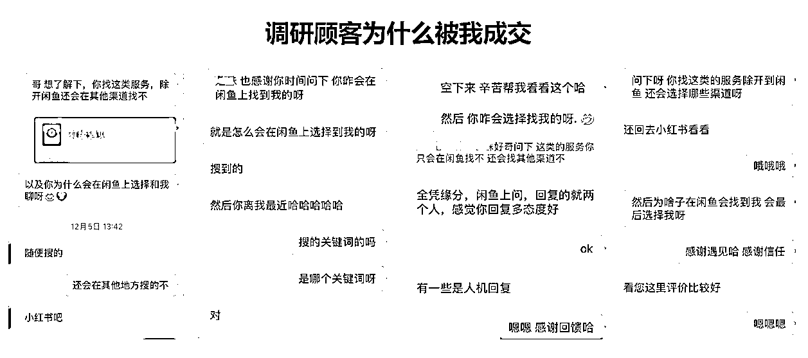

③想要：

从点进来后的浏览到点击想要，咱就要分析，是什么因素在起作用-描述与附带的图以及行动指定-引导点击有惊喜.

点击到想要后，就是引导加入到微信了.

### 03、平台端：如何对抗流量的不稳定性：

做的平台多了就会发现，自然流就会面临流量波动性大的问题，闲鱼的当然也是，我们做不到控制流量，但我们能增加获得流量概率更大的事情：

思路：站在平台的角度，如何能获取更大的流量？

突破口：作为平台，要么获利，要么能留住顾客

解决方法：有了上面的思路与突破口，解决方法就不难找到了.

①保持账号活跃：每天用账号，且时不时产生交易.

②加号：让更多号去跑

③发更多品：在开通鱼小铺之前，可以发50个品，要尽快的发满，然后不断迭代掉流量不好的

④每天持续运营动作：擦亮、推广、降价都安排上.

⑤平台成交：付款时，小单尽量在平台成交

⑥引导顾客好评：不仅给你增加好评，也是强化顾客对你的好感度.

### 04、私域运营：如何提高顾客的复购率？

GMV=流量*转化率*客单价*复购率.

背景：陆续的有之前下单过的客户来复购，确实感受到了私域的魅力，整理总结复购率的话题：

思路：顾客回购，核心指标还是复购用户数，而不仅仅是复购率，和几个因素有关：私域规模、首单信任与满意、持续触达、定期回访、复购金额.

具体做法：

①私域规模：没有规模不谈复购率，当私域上规模，哪怕复购率差点，复购数还是可观的.

②首单信任与满意：顾客复购的核心是第一单的信任与交付满意：

因此对于进入你私域的客户，先建立信任再成交，告诉ta你的案例，你的专业度，以及交付满意度.

③持续触达与定期回访：在顾客首单满意的前提下，你得针对性的朋友圈营销以及定期的做回访，让他们知道在有需求时能想到你. 要在他们的圈子中打上一个标签：代写类的你最专业，找你就对了.

④复购金额：顾客复购的价格极大可能受第一次接单的影响，如果第一次接单时价格非常低，复购的价格往往不会高.

因此第一次成交时的价格不要压的太低，为的就是后续复购时单价不至于太低.

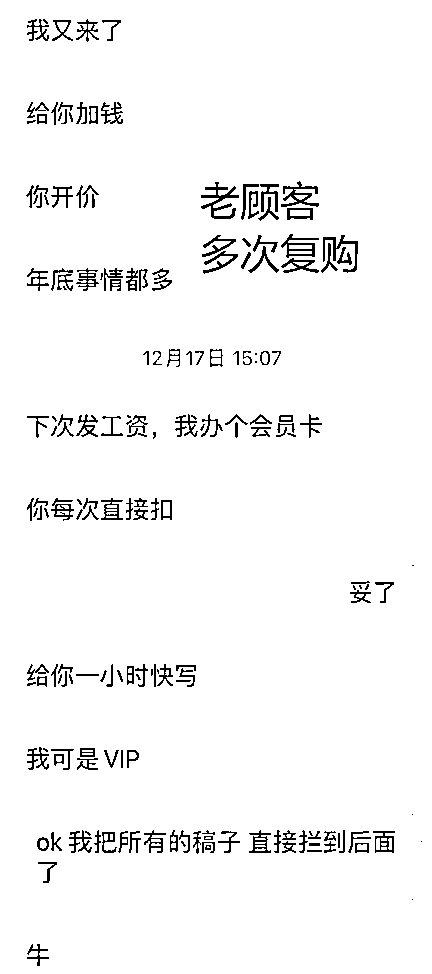

### 05、私域运营的有效动作：

中心思想：做好私域运营是在更有消费机会的池塘中获取流量，投产比更高，值得重视.

具体动作：

①扩大私域盘子-加到微信的人数：（目标1000+）

A：凡闲鱼询单都要引导加到微信中.

话术：

a、进一步聊下，发资料方便具体评估；

b、借一步，发下案例给您看下.

c、得换个地方，您这块这里聊不方便.

基本这三个话术换着输出，及时回复下引流微信能达到90%以上. 其他话术也欢迎评论区补充哈.

B：避免因首次不成单而删你微信：

要有长线思维，私域就是一个复购的逻辑，那么就不要期望一定要第一次就要成交

确实有时候第一次因需求、时间等不匹配，难以合作，这很正常，要告诉顾客你能服务的类型，第一次不管是否能成交，有一个一定要做的：产生信任以及告知可服务内容.

我这边就有第一次没有成交，后续至少给我推荐了5个客户的案例.

②打好标签：

打标签这事至关重要；大体的可以分为职场、学生；职场又可以划分机关、国企与学校、私企；学生分为毕业、大学... 标签越细则更好针对性营销.

此外 在名称上，可以记录好 价格敏感性 上次订单类型、顾客特点，如：大明|国企办公室|要质量|公文

③朋友圈节奏：

定期发布且发布的内容中1/3是生活相关

此外，我实操下来的一个小技巧：针对某一类标签人群，针对性的发圈，进行针对性的营销，

④定期跟进：

第一种：节假日的维护：

加到微信的，都是我们的客户，那么在节假日的问候，就是维系关系以及让他们想起我们的方式.

第二种：定期的消息跟进，特别你对顾客了解越清晰，就更知道哪些类型客户在某个时间节点会有需求产生，你出现跟进，更有机会拿下订单. 因为很多订单顾客也是犹豫找不到代写，刚好你出现，可能单子就产生了.

⑤跟对标与迭代：

专门拿出一个微信来加同行的微信，至少要加100个，然后定期去针对性的查看与刷，不断优化迭代自己的动作.

## 二、谈单转化

### 01、如何提高成交转化率与客单价？

GMV=流量（曝光-浏览/想要）*转化率*客单价*复购率.

背景：和圈友交流时，同一类的单子看下来，我的单子整体的转化率和客单价还是要高一些，虽然也有空间，但是多少自己也在总结经验，先输出当下的方法：

今天聊聊如何提升转化率与客单价的事项：

思路：我们先想顾客为什么会被我们成交，核心是理解他的需求与痛点、产生信任、价格接受. 也就是有意愿、有能力且相信.

具体操作：落实到具体的操作上，顾客加到微信来后：

①解决信任问题：

先发出过往成交案例、老顾客的认同图、引导看朋友圈，让顾客相信需求交给我是放心的、且我是有能力去做的.

②详细了解顾客需求：

做完第一步后，按照你对单子的了解，详细的了解要完成的单子需要的信息，避免没有了解清楚就报价，让顾客质疑或者报价太低你交付心累的问题，以及在交付中反复询问本该在确认需求时就该弄明白的问题

那你说没有做过这类单子咋办，一句话：万事不决问AI，直接问ta你该如何提问以便更好的交付这个单子.

③报价，记得给顾客一个理由：

报价得有依据，常见的就是工作量、质量要求与时间紧急度.

那么你报价时，就要给到顾客一个有理有据的理由，而不是让顾客觉得你是瞎报价.

这样的报价就是很实在.

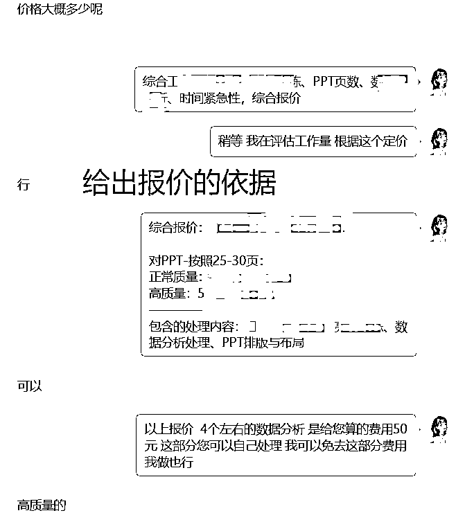

如果你对需求了解清晰了，这一步就是强化顾客交付给你的意愿度，要知道顾客为什么找你，你才好报价格，是懒得写、不好写、不会写还是哪一类，挖掘出需求，更好针对性报价.

同时在了解顾客需求时候，要尽量多的激发顾客多轮的沟通，也是一种沉没成本的策略，既能更好的了解需求也让顾客多轮的回复中，更大机会选择你.

除此之外，还有一个小妙招：

当顾客和你达成成交后，可以侧面询问顾客怎么找到你，为什么选择你，这中间会有惊喜哦.

### 02、谈单SOP-提升成交转化率的同时客单价还高（以具体案例为例）

背景：和圈友沟通下来，普遍面对的问题是要么谈不下来，要么是价格太低.

案例：年底各种总结流量很大，大家应该都有感知，毕竟年底述职的人很多，今天就以此为品类为例展示

谈单SOP:

A：要梳理SOP，第一步就是拆解关键步骤-谈单前，谈单中，谈单后

B：梳理每个关键步骤的具体123动作.

第一步：谈单前：

谈单的前提是你要引导到自己的微信中（一个连微信的都不愿意加的客户，有必要怀疑其需求的真实性与进一步聊的必要性），需要做的动作是打造好朋友圈、图像、签名，在客户加你的第一时间对你有初步的了解，产生初步的信任.

想想你被人引进去私域时，是不是第一时间看别人朋友圈，对他也要有初步的了解

第二步：谈单中：

①建立信任：

刚开始聊时，先解决信任问题，告诉ta我能做、为什么是我、何以见得

综合来看述职报告的需求有两类，一类是职场的述职，一类是D政相关的述职

对职场类：

顾客核心关注点是你是否有他们的高度，尤其是总监及以上级别，那就需要你告知你的职场经验，比如我说的是8年大厂高级经理，同步发出工牌照；

同时给出近期的案例与好评图；

如果是中层及以下的岗位，一击必中的点在于说你对他们岗位的了解，可以说工作中有接触，且有朋友就是做这类，写你这个完全没问题.

对D政/国企相关的：

顾客核心关注点是你能不能做到虚实结合，措辞到位，能不能在表达上贴合，这是公文类非常关注的，你需要给出你的服务案例与好评图.

ps：从我陌拜拿着顾客需求和同行聊过程中，基本没有见到这一步，其实这一步我认为很关键，做好SOP与模板直接分类发送，即使顾客这一次没有成交，顾客也会觉得你专业，下次还会找你.

②了解需求：

这一步核心是要清晰、准确的了解顾客的需求，一方面便于你来定价，另外一方面便于更好的交付，同时更清晰的询问，让顾客觉得你专业细致的同时，产生一定的时间沉没成本，增加成交的概率.

拿述职报告为例的，需求询问SOP：

A：公司类型名称及岗位名称

B：工作内容、亮点、规划（若没有我可自行查资料输出）

C：输出模板、写作风格（拿到模板后确认大纲是否可以一致还是换种说法，这个是我一个踩坑点，务必要询问）

D：字数要求、时间要求

③给顾客报价：

给顾客报价务必给一个实实在在的理由，理由越细节越具体越好，让顾客觉得你这个价格确实对的起工作量；比如我的话术：

“结合岗位级别、需求梳理与重点提炼、字数与时间紧急性综合报价，综合报价如下”：

发了这句后，等个30秒，相当于价格的提前锚定，顾客大概知道确实啊，这个需求价格怕是不会低.

再发出报价表，分享我的话术：

“综合报价如下：

应付价格：***（几次修改）

正常价格：***（几次修改）

高质量价格：***（包修改）”

以上价格的定价，分享下我报价的逻辑：

应付价格是接这个单不至于让我交付感觉到心累的.

高质量价格：接这个单，会让你感到到惊喜的价格，比如我之前接的一个单子写述职报告，是2000字，那会儿顾客也急，我就报一个375，顾客成交了，我就会觉得非常欣喜

确认了应付价格和高质量价格，再确定正常价格，就是在应付和高质量的价格中间，且更加偏向高质量一点，比如100 265 300 这样来报价. 也是利用锚定效应来报价，真的对职场有要求的顾客就会选择300个价格.

第三步：谈单后：

拿下订单后，就得梳理交付的规则并掌握交付的主动权：

交付规则：同步我的话术：

“给您同步下我的交付节奏：

①在**时间前发您大纲确认，大纲确认后，在***时间交付稿件（说稿件而不是初稿，你说初稿，顾客怎么滴都会给你找几个修改点，说是稿件则没有必要修改的问题会一稿过）

②大纲确认的前提下，支持**次修改，大纲确认后不能动大纲的修改. ”

说明清晰的规则，是为了划清修改的界限，约定彼此权益，且指出交付的节奏就是掌握交付的主动权，避免顾客疑惑与担忧的多次询问进度.

### 03、文稿润色的单子，谈单与交付SOP（直接拿来用那种）

第一步：文稿润色谈单的逻辑与话术：

整体逻辑：

A、纠正观念：

纠正顾客觉得自己写完只是简单改改就行的观念，这种有两个问题：一个是顾客处于强势位，我们就只有被动的改改改，没有丝毫主动权，更重要的是在这种观念不纠正，单价一定上不去.

2、话术表达

A：我提供的润色服务不是简单的词语和语句打磨，而是对整体框架和内容的全面优化，包括表达方式、层次感、措辞严谨性，以及视角的全面提升。这些效果的达到是无法通过简单的修改或文字打磨实现的。

B：并不是说你写完了稿子就完全浪费，你拿到我们润色后的稿件后，还可以对比自己原本的稿件，从中学习、提升自己的写作能力。这并不是浪费你的时间，而是对你文稿写作能力更好的提升.

这个操作下来，先纠正观念，再站在顾客的角度来说，润色的价格就是重新写一篇稿件的价格.

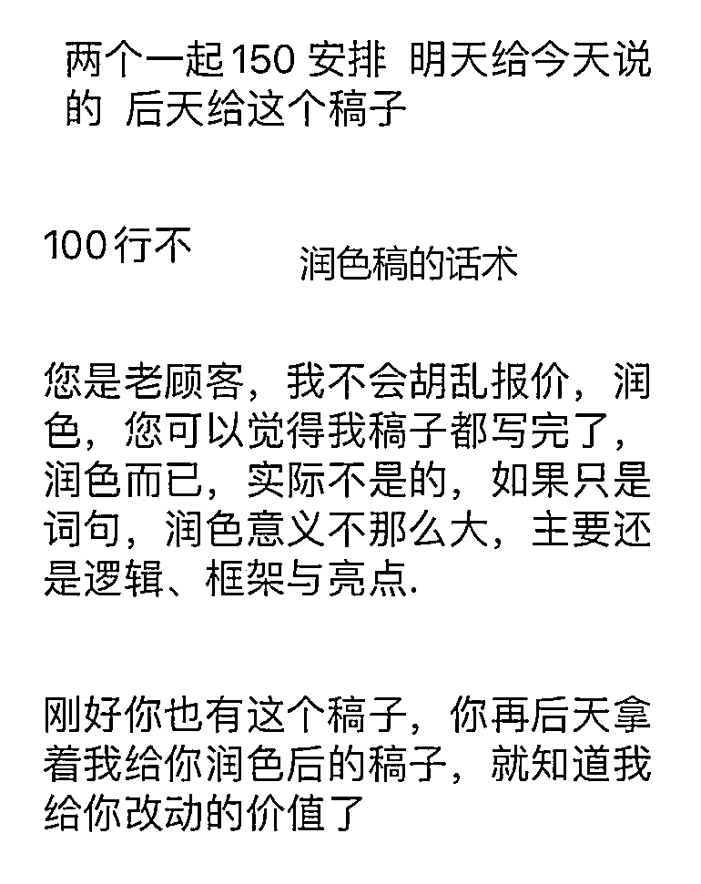

第二步：润色单的交付SOP（含完整提示词）

整体的思路：用顾客待润色的稿件提炼大纲每个章节内容，再用提示词重新写一篇即可

A：提炼大纲

把顾客的待优化文稿投入到KImi或gpt中，然后用下面提示词：（以国企公文举例）

“你作为国企的笔杆子，常年负责国企的各类稿件与述职报告的书写，请分析汇总附件的内容”

B：基于大纲与提示词，输出每个章节对应内容；

其中顾客若有新增的内容，可直接加到提示词的 【要求】中即可.

提示词：

【背景】我是一名国企的员工，要写一篇年度总结

【角色】你有多年国企笔杆子的工作经验，精通国企员工的年终总结书写

【任务】请将上述的内容写成一篇1800字左右的年终总结，请先规划大纲每个章节的字数，确认后再输出每个章节的内容.

【内容要求】

1、符合国企的写作风格

2、全文的内容都要利用上述附件中的内容，不可新增内容

3、语言凝练、务实，突出工作亮点.

C：参考顾客初稿各章节的字数，定版大纲与每章节的字数并让AI学习与输出

提示词：

请按照以下三引号中的大纲内容与字数要求，依次输出大纲卖给章节的内容，确认后输出下一个章节，务必确保字数在规定范围内

"""

(大纲内容)

"""

D：依次输出每个章节的内容即可.

### 04、如何在账号爆单/小爆单的情况下最大化承接流量？

背景：结合隔段时间就有账号爆单或小爆单的工作实际，且在有单要交付的情况下，如何最大化承接流量.

中心思想：流量来时，尽全力承接流量，并懂得分钱. 流量是不稳定的，切记在爆单时还想着去交付单子，应该全力的去承接流量

思路：按照漏斗模型我们来看，无非就是：

及时回复—引流微信—了解需求报价—跟进促下单.

具体步骤：

①盯紧询单，及时回复.

当发现当天流量异常或知道哪个节点流量会起来时，要及时盯紧，腾出手头的单子-该和顾客延期的延期，该分出去的分出去，拿出注意力来盯询单

②引流微信与分人谈单：

每个人都有熟悉的单子，当遇到你不熟悉或者实在没空谈的单子，及时拉朋友一起谈，把钱分出去

③交付时间周期分散引导：

爆单时，很多来的单子都是很急忙的，你可以通过 加急费这个点来驱动一些可以延期的顾客延后，别单子堆积，接住了吃不下比不接这个单子效果还差.

④单子别都握在手上

别想着什么单子都自己做，有可能造成整体的单子崩盘，要舍得分出去，把投产比最大化的单子拿住即可

⑤留下下次成交的可能：

当天的单子你爆单时肯定有承接不了的，别操之过急，导致因为没有成交，人删除你微信了，没有了后续的可能性，就不值得了

⑥针对性朋友圈营销

对爆单来的，给一个标签，第二天给一个朋友圈侧面介绍下你自己，增加后续复购可能.

## 三、做交付

### 01、如何写出让顾客满意的文稿？

如何让AI写出具有某种风格的文稿，比如公文？

背景：给顾客交付公文类的报告，迅速交付的初稿后，客户的反馈是这个不符合公文的写作风格，太口语化了一些.

直接两步走：

*   投喂素材让AI学习：

步骤：找顾客拿到公文的范文，让AI学习语言风格与表达方式及措辞

*   万事不决问AI：

步骤：直接问AI，我用要出一篇公文，我该给你设定怎么样的角色与提示词.

综合这两步，就可以输出一份还不错的公文了，分享下我打磨使用过的提示词：

* * *

【背景】我是***，要写一个**公文材料...

【角色】你有着多年党政笔杆子的工作经验，常年负责乡镇/党政各类稿件书写，精通公文格式写作

【任务】请结合以下【写作风格】，写一篇字的公文材料

【要求】

1、

2、

3、

【写作风格】

"""

"""

* * *

### 02、如何防止顾客多次修改甚至退单？

①问题背景：和一个航海的圈友聊天，他说到自己接淘宝的单子，顾客总是要修改好多次，甚至还有过退单. 导致整体的效率很低

②问题发生原因：

分析顾客为什么要修改多次，如果这种情况是普遍性的，那就是流程出问题了，核心在于确认需求的不明确、交付的流程有问题、修改的范围与次数没有提前明确.

A：在确认需求上：

没有明确顾客要这稿子是解决什么问题，以及顾客要的参考范例是怎么样的，顾客的身份与场合要求等

B：在交付流程上：

不能顾客给需求之后，你下一次和顾客对接就是给初稿，中间务必有一个环节，就是确认大纲.

交付的过程，如同开车，要保证大方向不变，并及时纠偏，这个大方向就是要确认大纲.

C：修改的次数与范围明确：

和圈友沟通时他就说，我们不是被动的接单的吗，还能提要求啊，

那肯定能啊，你要前提约束好，修改的次数与范围，比如定了大纲就不能动大纲，否则费用就要加，在大纲不改的情况下，修改的次数要明确.

这个过程你要展示出你的专业性以及让店铺客服和你站在一条线上的，你要知道店铺的客服也是愿意做高单价的，在保证店铺满意度的情况下，顾客当然更希望和有实力能主导的写手合作.

③解决方法：

A：明确顾客的详细需求

B：在交付上，务必在拿到范例的前提下，第一步先确认需求，是不是顾客要的，以及尽快的输出大纲并明确修改的次数与范围.

### 03、有多个参考文件，如何快速的完成一笔高价单？

背景：来源于45分钟内完成一笔380元的单子，且顾客还是一稿过

思路与做法如下：

① 先梳理解决思路再动手：

明确需求时就找客户要好两类资料，一类是过往的模板-用来确认写作风格、大纲与模板；一类是写作用的素材与资料.

处理思路：

A：让AI分析过往的模板，确认大纲与写作风格

B：让AI一次性整理多个文档素材的内容.

C：让AI结合汇总的文档素材与写作风格产出大纲.

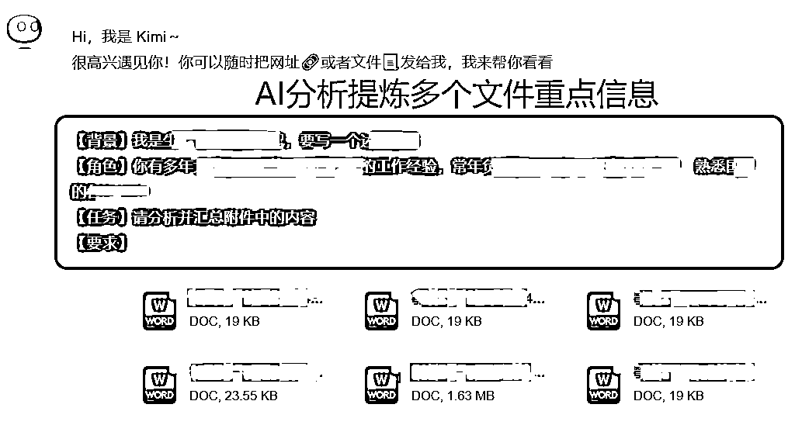

②确认大纲与输出稿件.

输出的大纲找顾客确认后，直接输出稿件

切记要找顾客确认大纲，尤其是超过2000字字数以上的文章，而不是直接要好顾客需求后，下一次找顾客就是确认初稿，那重新改工作量就是很大的.

③总结单子类型：

把自己做过的单子类型与可借鉴的思路、攻克的难点、踩过的坑，在订单记录表上做好记录

同时在每个单子的处理记录文档上 写清楚整个的思路与提示词.

这样方便后续直接找到对应的单子复用即可：

核心出发点在于：不必要把一个问题思考两遍；且知道知识在哪里比知识是什么更重要.

遇到全新的单子，就好好的思考打磨，这样把一类的单子给吃透，并做好复盘与完成的思路与落地记录，而不是追求单个顾客的交付.

### 04、如何解决顾客疯狂发文件给你的问题？

背景：你是否有遇到过这样的情况：

一种是在确认需求时，就给你说一个大概，等达成好合作确认好价格，等你正式开工时，给你狂发各种文件，要你结合来输出.

还有一种是刚开始没有掏出文件，等你输出初稿后，趴趴的文件都来了，要你结合的来写.

这两种我都有遇到，分别分享下我的解决方案：

解决思路：一切的解决方案梳理，都应该迭代到你的SOP中去，而不是每次都重新思考梳理

解决方法：

对第一种顾客：

①等顾客给出明确需求再定价：

我们很多时候，都是担心顾客跑了就了解个大概然后就急着给顾客报价，想着快点圈住顾客

实际上，在交付顾客需求的过程中，顾客和你都躲不开梳理需求明细这一步，那不如等到需求确认再报价，反正对顾客讲你是靠谱做事儿的，更容易赢得信任，拿下订单，也不至于给顾客埋坑.

②报价时堵住潜在坑：

报价时说明有多个文件要处理是具体评估收费. 给自己留好退路.

对第二种顾客：

思路：如果只是小改问题不大，如果涉及到要改动很大或者要动全文，那说明应该在谈单环节要优化SOP，确认报价后，说明白改动的次数与范围.

虽然可以把文件导入到KIMI中分析，但是也架不住顾客一下子给发十几个文件是不.

### 05、如何处理自己不那么了解的单子？

前言：可能你会说，处理这类单子干什么呢，直接做自己熟悉的单子就可以啊，可是总有些情况你不得不面对，要么推辞不过，要么单价让你心动.

背景：在过往给顾客交付的过程中遇到多次找不到思路想退单的单子. 单价300+，总结如下经验：

心得：每次给顾客交付完一个自己想要放弃的单子，都感觉心力又增加了，觉得难度大的单子都不怕，能cover掉；同时也在处理这类单子中找到了一个解决思路：

解决思路：

处理这类不那么了解的单子，思路和我们日常想要攻克一个难题的思路是一致的：

基本是三步走：

第一步：明确目标物：

思路：清楚的知道要做成一个什么东西，就是要做成什么样子，越清晰越容易达到.

做法：处理单子中这一步，核心是明确达成的标准，询问顾客或者在AI辅助下给你赋能并同顾客确认下来.

第二步：AI辅助分析资料与规划角色完成目标

思路：用AI分析客户资料与梳理提示词投喂资料，达成目标

做法：

①清晰规划AI的角色分析顾客提供的资料，这类需求顾客需求往往很多，但你不懂，核心肯定是找一个能看得懂资料的人看看，直接把AI规划成一个懂得人与提示词如何分析汇总

②设置好角色与引导提示词，并投喂资料，给出要达成得目标物，直接完成稿件.

这里的核心难点，在于你要规划好AI的角色与提示词，可能你也不懂，怎么办？

别忘记啊AI会给你答案，直接来一个：以子之矛，攻子之盾.

具体把顾客需求与相关资料投喂到AI，说明要完成任务如何规划提示词与角色即可

第三步：勇敢交稿与迭代

思路：勇敢交付第二步的稿件给到顾客，听取意见做针对性的修改即可.

看下来，是不是和我们平时处理一个熟悉的稿件思路差不多？

核心的不同点在于，复杂/我们不熟悉的单子处理，更像是项目推动，我们是项目负责人，只需要为项目成功负责，而不是每个分项目的直接介入，我们主要职责是协调多个AI角色与任务完成整个项目，可以不完全懂，但你要知道懂项目目标与各分项目的角色及要求.

### 06、如何避免顾客反复修改稿子？

前言：为什么聊避免顾客反复修改稿子这个点，因为我们做项目的一个追求就是单位时间的投产比越来越高，也即是单位时间赚钱效率越来越高，那么借用华杉的一句话：最快的进步就是不退步，最高的效率就是不返工.

下场写过稿子的，应该都有这么些痛点，怎么顾客总是要改稿子，而且总感觉改稿子没完没了的样子，好心累啊，怎么办.

（我最夸张的是几个月前一个淘宝9块钱的发言稿，硬是要我反复改了4次，真的是大腿捏肿完成的单子）

解决思路：

先跳开我们是交付稿件方的角度来看下：为什么顾客要反复的修改单子呢（白嫖党不在本次分析之列）

要修改的核心原因：输出的稿子未达到顾客的需求.

话分两头说，一方面顾客的需求是固定的，也就是顾客是清晰知道需求的，还有一种是顾客压根就不知道自己的具体需求.

第一种：顾客需求是确定的

导致修改还是我们没有明确顾客的需求就开工了，而且做的过程没有给顾客确认，直接输出了一个稿件给到顾客.

解决方法：

①完整询问顾客需求：不要随性发挥去询问，而是打磨好特定单子类型的询单问题SOP；

② 确认顾客需求：询问完顾客需求后，不要直接去干，而是把顾客需求完整列出来，发给顾客确认. 你理解是你理解，不一定是顾客的理解.

③阶段性交付：交付稿子如同开车，讲究一个微调，切记明确需求后下一次再见顾客就是交付初稿的时候，核心的一步就是输出大纲给顾客确认，还有的就是当你写稿有不同方向选择时，这个选择权记得交给顾客，不要你以为，要顾客以为.

第二种：顾客的需求是不确定的

这种情况你咋办，可不能追着顾客的需求跑啊，那是子子孙孙无穷尽也的路啊，走不得

思路：在谈单时就明确好需求，怎么明确，这里最大的问题就是顾客也不知道具体的需求，方式有两个，一个是让顾客给到范例或者之前的稿子，二个是你找到稿件让顾客确认是否可以这么去做.

易踩坑点：确认稿子作为标准时候，务必要细化，是要按照范例的文风写还是格式、还是具体的大纲框架呢，别小看这些点，都是可能带来微调甚至重写的.

特别强调：角色定位问题—你要把自己定位为顾客问题的处理专家，你是给顾客解决问题的，不要被顾客牵着走，而是你主导是否需要这么修改，那你就应该在需求确认时就建立这种认知，怎么建立？展示你的交付好评等

此外，还有两个小技巧：

1、不要过早交付：在交付时间节点上，不要过早的交付，时间太多，顾客就会想着反正还有时间，就多少想着折腾下稿子.

2、交付时不要说这是初稿（初稿嘛，给人可以随时修改的感觉），而是直接让顾客查看稿件即可.

3、谈单时，明确好具体的修改范围与次数

### 07、如何一天高效处理多个单子？

核心思路：基于单子的紧急程度安排开工顺序，并按照流水线作业执行：

整体作业上：拆解动作，同工种依次作业，并保持一段时间处理一件事，而不是跳跃性的去做.

如我们交付顾客的单子，可拆分：梳理需求—顾客核心信息—迅速出大纲核对—统一处理修改意见—完工

具体步骤：

①梳理需求：单子谈完后，我们只是对需求有一个大概的了解，还需要具体梳理需求，哪些要和顾客确认的，哪些是要顾客补充信息的，这块的工作，可以多个单子集中起来依次进行，因为这个需要结合顾客的谈单时的微信消息，依次梳理.

②询问顾客确认：有些需求点，谈单时只是知道个大概，到具体要落地去做时，可能会有一些点要顾客确认的，这个是需要前置去完成的，因为顾客有可能不能第一时间响应你.

③大纲确认：需求确认后，就依次的确认输出大纲找顾客确认，去看顾客的修改意见，这里有一个点，不要提前太早给到顾客，避免中间反复的修改确认，影响效率

④统一处理修改意见：

完成第3步后，就全部精力投入到确定大纲的稿子书写后，而不是随意去响应第三步顾客大纲确认中给到的修改点，事情统一处理才高效，且务必要顾客知道你不止他一个单子，不是一天都晚都在响应他的单子，除非他要独家，那当然是另外一个价格，哈哈哈

以上的几步，核心的是要同一个时间处理一件事情，要占据自己做单子的主动权，而不是随时的去响应顾客.

### 08、如何写公文类的文章.

背景：近期接公文类的文章很多，基本是谈单单价达到千字100以上且交付满意度很高：

具体做法：

谈单环节：

拿出你的过往案例佐证你的专业性，并挖掘痛点-公文难的地方就在于虚实结合，理解风格为要，措辞就很核心了，从这点来表达你的经验

交付时：

1、要到参考稿件：由参考稿件，来确认表达风格与框架、表达风格，直接投喂kimi总结即可

2、用好提示词：

提示词的角色与提示词内容，可以直接询问AI如何设定，分享下我的提示词：

【背景】我是一名党政的....，要写一个...的材料

【角色】你是一名有着多年党政笔杆子的工作经验，常年负责...各类稿件的书写，精通...材料的格式公文

【任务】请结合以下【内容要求】，将上述的内容写成一篇***字左右的材料，先出大纲，确认后出内容.

【内容要求】

1、写的内容要贴合主题，并符合***公文的特点

2、每个小段的字数控制在250字.

3、D建的内容要用今年最新的，切记不要用往年的

## 四、关于提效与避坑：

在搞流量、谈单转化与做交付的过程中，整体性的聊聊提效与避坑的几个点：

### 提效点：

### 01、用SOP思维对AI写作提效

背景：职场多年的经历让SOP思维深刻植入我生活与工作中，聊聊用SOP如何给AI写作提效，以稿子谈单与交付板块举例：

关于SOP的两句话：

①什么是SOP：标准作业流程，要足够清晰可执行：一个刚接触的小白上手拿着用，就能得到和你差不多的结果.

②什么事该构建SOP：但凡一个事我们要做2次及以上，都值得梳理成SOP，以便标准化及提效.

如何梳理SOP：

①拆解关键动作：需求梳理、带入提示词、文稿形成与格式调整、稿子交付、复盘.

②按关键动作梳理细化SOP：

A：需求梳理：

拿演讲稿为例：

a：为啥演讲：顾客身份（决定定价），演讲对象，演讲目的

b：稿子特点：演讲主题、演讲时长（决定字数）

c：稿子交付：范例（决定格式）

B：提示词：

每个细分的稿子类型都有必要形成标准化的提示词模板，直接带入，这里以演讲稿为例，分享我用到的提示词：

【背景】我是***，要准备一个演讲稿

【角色】你作为一名***，具备***技能，精通演讲稿的写作

【任务】写1篇围绕***主题的字演讲稿，先出大纲，确认后再出内容.

【要求】

1、演讲者身份

2、演讲要达到的目的

3、演讲的风格

4、...

【素材】

"""

（素材内容）

"""

后续的文稿形成与格式调整、稿子交付、复盘. 可依次形成SOP，并在每一次的使用中不断的迭代优化.

### 02、单兵-全流程提效指南

【错过后悔系列—不仅有清晰落地的方法，还有实测好用的工具】

背景：此话题的价值在哪里？因为单兵作战，一个人做流量、谈单与交付，每个环节需要的时间很多，那么在跑通闭环中，在单兵作战后期提效就是一个必须要认真对待的话题，这直接影响了单位时间的产出.

从三个方面来聊：搞流量、谈单与交付环节.

毋庸置疑，上面的梳理成SOP就是提效非常关键的一步，此外还有其他的动作，今天一 一聊到：

第一部分、运营闲鱼阶段的提效123.

运营闲鱼过程中有哪些可以提效的措施呢.

①每天的养号：

养号有没有用，没有人知道，个人的逻辑是有必要，毕竟每天的活跃对账号权重与抗击打只有好处没有坏处.

提效点：不需要专门拿时间去养，可以在碎片时间，比如排队、等位、上厕所等多个手机一起刷. 或者走路时慢慢走，慢慢刷（注意安全）.

②做图：

主图是顾客搜关键词后看到的最强视觉冲击，非常关键，一开始用数据好链接的图即可-直接剪辑或者加贴纸啥的，等你运营熟练后，有了做图的理解后，自己作图也很快，而且平台角度肯定是更支持原创的.

提效点：图片3—用可画-是在领队依琳一次使用分享后开始用，真香系列. 模板非常简单且一次做很多张图

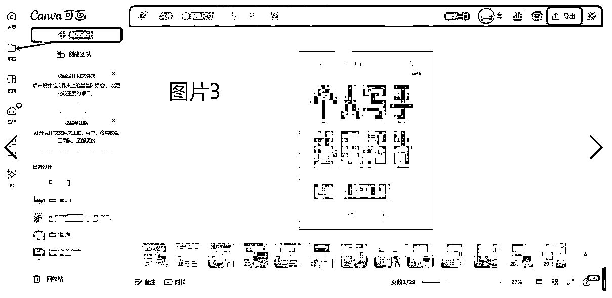

③发品：

常规我们发品，是不是每天安排出时间来发品，每次重新创建商品，每次都去固定的选择哪些品和文字来发，实际这么操作非常低效.

提效点：这里的提效点非常多.

A：规划好链接的文字框架：

即顾客点击你主图后看到的文字

要形成你自己的文字框架SOP，那么操作下才快：

可以是：你能写什么—为什么是你—如何见得—行动指令框架来写.

B：规划好图片框架：

即你每次会附带哪些图，如何设置这些图的顺序. 当然你说有很多只放一个图也数据很好，我们这里谈论的是能做哪些动作让数据变好概率提升的问题.

可以是：主图（信息有：写什么，关键卖点，行动指南）—信任状（好评图等）—能做的类目展示

C：一次备好3天左右的发品量：

一次把分多次做的动作集中起来做，是效率提升很有效的手段，这样一来可以做到每天稳定的发几个品，不会因为某一天忙而无法发品，以及的确可提效.

D：下架后的品，重新上架

这个点和很多人聊都不知道，下架的品下架就放在哪里了，实际他就是我们的一个潜在草稿箱，重新编辑上图后发品，效率超高，谁用谁知道.

④运营闲鱼：发货与好评引导：

介绍一个工具：闲管家（图4），可以一次性管理多个账号，一次性管理单号多个订单发货与好评等. 最近使用起来真的非常方便，免除了手机操作之苦

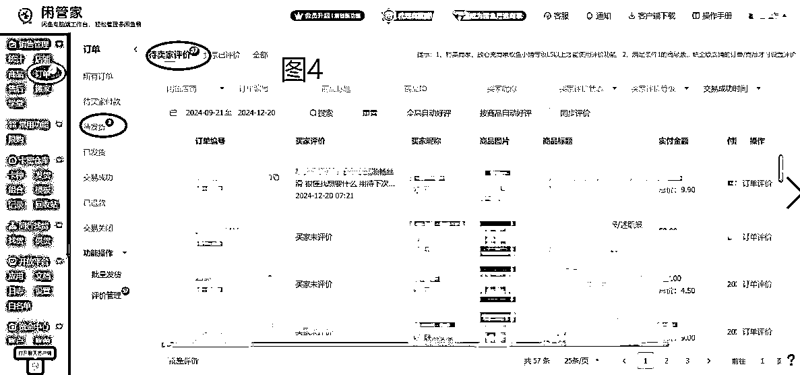

第二部分：谈单：

①积累好评图：

当顾客犹豫徘徊时，在平时有针对性的多收集或者“创造”好评图，并做好微信收藏打包，便于直接发送.

②积累不同顾客反应时的应对话术：

比如之前成交的一单，就是顾客总不回复我，我用的一个话术：具体见（图5）

还有其他场景：

顾客觉得贵对应话术；顾客担心质量、顾客说要考虑下...对应的话术与应对是怎么样的.

以及强化个人身份、角色及有利于提升单价的话术等. 都需要有意识的积累，不一定是要自己遇到才去积累，同行有的以及其他项目相关的都可以积累

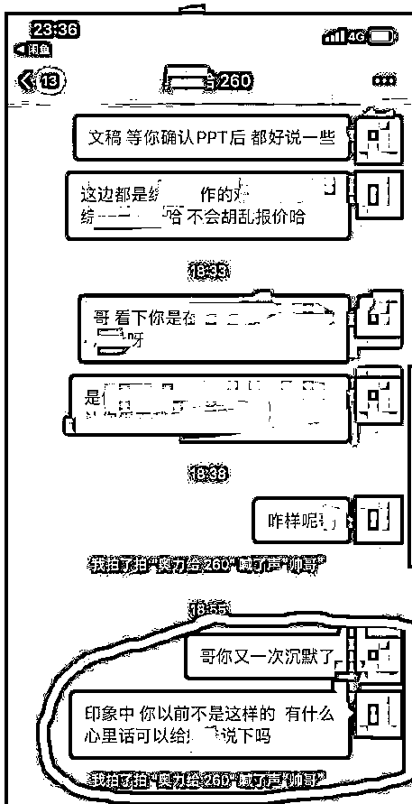

此外，谈单前需求询问、谈单中报价与谈判、谈单后规则明确，前面已明确，不再赘述.

第三部分、交付

①每一类单子你单独做汇总（包括前面的SOP梳理）：

比如演讲稿，你需要记录下来你服务的多个演讲稿客户中，某个顾客特别在意的点、某次让你返工点、某次你的稿子被顾客好评的点....都记录下来，一个是避免返工就是最大的提效，另外一个是你有了这些经验你出手顾客马上就能认可你的专业度，这种单价不会低的.

②不同稿件梳理出定制提示词

③可同时打开多个AI网址，分工协作.

## 避坑点：

### 01、不要因为想要成交而盲目的答应顾客需求

背景：遇到过一个售前没有明确规则的客户单子，导致交付后要我反复修改，我没有及时回复然后顾客投诉说我欺诈，好在最后成功处理.

事情经过：

事情从某周一说起，中午时有一个之前加过我的大学生客户要找我下单（之前这个客户就是盲目的想要低价而没有达成合作），结果这次又来找我，鉴于上次的沟通以及当天刚好我还没有开单，想着报个低价以及满足顾客的要求，把单子接下来再说.

没成想，当我交稿几天后，又说了一个修改需求，是直接要重新调整的那种需求，当天要处理的稿子也多我就不那么愿意，但是我当时的确答应人家都是可以修改的，结果我去忙其他客户单子没有及时回复时，直接给我来了一个欺诈的投诉，尴尬了直接，没办法，硬着头皮改呗，总不能硬碰硬，万一客服介入真的给判我问题，那可就影响大了，不值当，毕竟我要解决的不是他这个客户的问题，而是要迭代谈单SOP的问题，所以没有必要浪费时间在他身上.

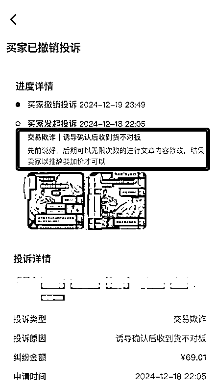

优化谈单SOP：

1、不要不讲条件的答应顾客的需求：承诺顾客任意修改需求务必谨慎再谨慎

2、事前明确好规则，每个客户都得说，避免风险.

3、要赚能出的起价的人的钱：大学生的需求，特别是那种小单的，不要盲目的报低价，你觉得的低价他们可能并不觉得，反而会给你找各种问题.

### 02、如何应对顾客的退款/投诉？

前言：遇到退款的用户不丢人，如果没有遇到，可能是你接触的单子还不够多.

结合自己接单交付以及遇到的退款、投诉来分享整体思路与具体动作：

整体思想：前置做好规则约束，并整个过程自己的交付对得起顾客付出的价格.

认识论决定方法论，对事情的认识需先找到问题的起点：为什么会发生退款以及处理的方式：

①接到自己能力不能及的单子：

解法：不是所有的单子都能接的，不能接的单子要么给顾客引导其他人，要么真的就不接并正确下一个合作的可能性，展示你的信任与可服务类型.

②前期约束规则不明：比如遇到的一个投诉单就是答应顾客包修改，结果顾客在我交稿后又直接改需求那种，这就是前期不能为了成单随意承诺

解法：确认合作后，务必明确交付节点、交付物、修改范围与修改次数.

千万不要想着过度承诺来赢得订单，长期看一定会遇到让你怀疑人生的单子，这本质是一种冒险.

③需求理解不清：没有弄清楚顾客的需求就开工，导致没做出顾客想要的单子；

解法：先明确需求再确认后动工.

④交付不用心：要么是AI出的没有加自己判断，或者没有仔细看顾客的要求点，导致顾客不认同退单.

解法：自己要对稿件质量负责，而不是AI小弟；以及要先梳理好顾客的需求与要求，再动工，交付给顾客稿件前再核实一遍，别糊弄就好，别指望蒙混过关.

⑤到规定时间没有交稿：各种原因导致到约束时间没有交付稿件而导致投诉.

解法：要梳理出为啥到时间没有给顾客交付，

A：忘记了：那接到订单的第一时间做好记录与时间节点

B：初约定的交付时间点确实完不成：要提前评估时间，真完不成同顾客协商是否能延后或者早点退单，我们底线就是不能耽误顾客事儿

⑥顾客要白嫖：不可否认，有极少顾客想要白嫖

解法：我们每一步的交付都要留好记录，并引导顾客确认回复，尤其是走平台交易的顾客，平台基本是站在对顾客有利的方面的，做好记录就不会担心这类问题.

# 第三部分：写在最后

持续有价值的实操与分享一定能遇到更好的自己

这一路做项目走来，是不断的见天地（市场与规律）、见众生（用户与同行）、见自己（能力与不足）的过程，还记得20年4月18日无意间翻开朋友圈看到生财的宣传海报加入进来，从此打开一个新世界的大门，开始做项目，人生有了更多的自主意识与掌控感.

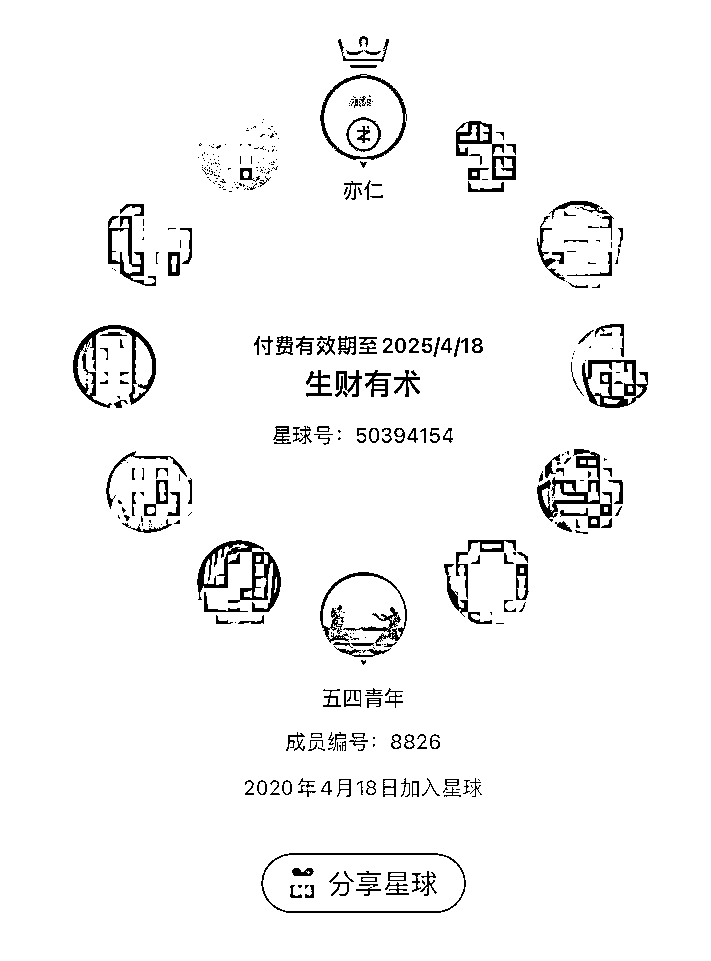

感谢亦仁老大搭建的圈子，因为亦仁老大有实力又谦逊的作风，圈子真诚有价值，由此认识了太多优秀的圈友，感谢晓文老师@郭晓文 超鹏老师@李超鹏 在短视频项目的真诚分享与帮助，感谢好友 光景@光景 @砖先生 @郭东超 在短视频项目的信息分享与帮助， 感谢海盐老师@Cheese海盐芝士 分享的帖子让我在短视频项目低迷时能进入AI代写赛道稳住军心继续探索，感谢 bu懂@陈bu懂 在Ai代写项目的指点让我突破收入层级，感谢AI写作12月航海3群的领队 依琳@依琳 的建议才有了本次复盘与分享... 以及真心感谢各位圈友分享的信息与共同构建的圈子，与有荣焉！

一直记得亦仁老大在某篇帖子说过，都来生财了，还怕什么，接下来要更多的去实操总结分享链接，争取突破拿到更大的结果.

以这篇帖子作为AI写作12月航海的总结、对过往4年做项目感触与心得的总结，同时借由这篇帖子来迎接全新的2025年.

祝愿生财有术越来越好，祝愿各位圈友继往开来，在2025年都能实现自己的理想目标！