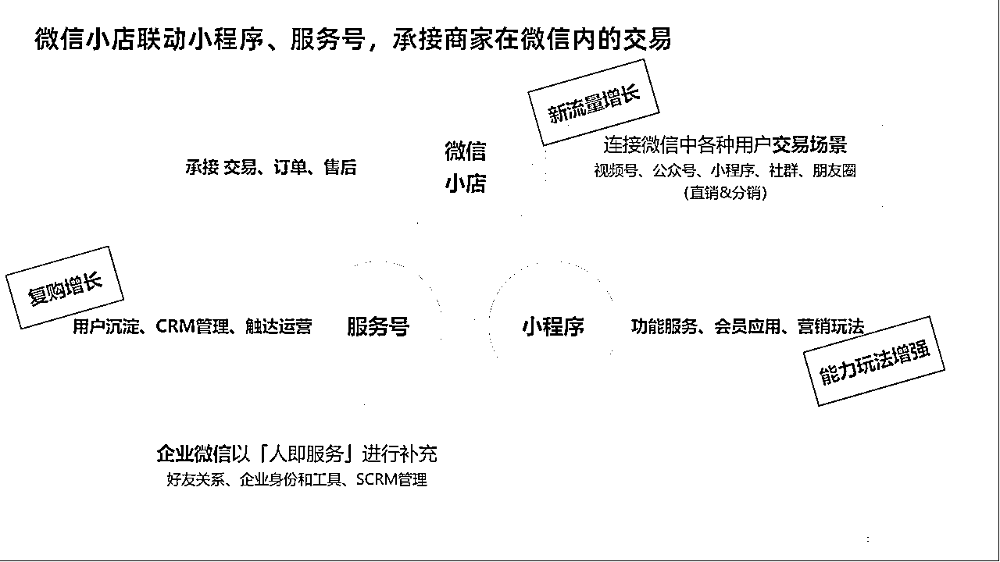
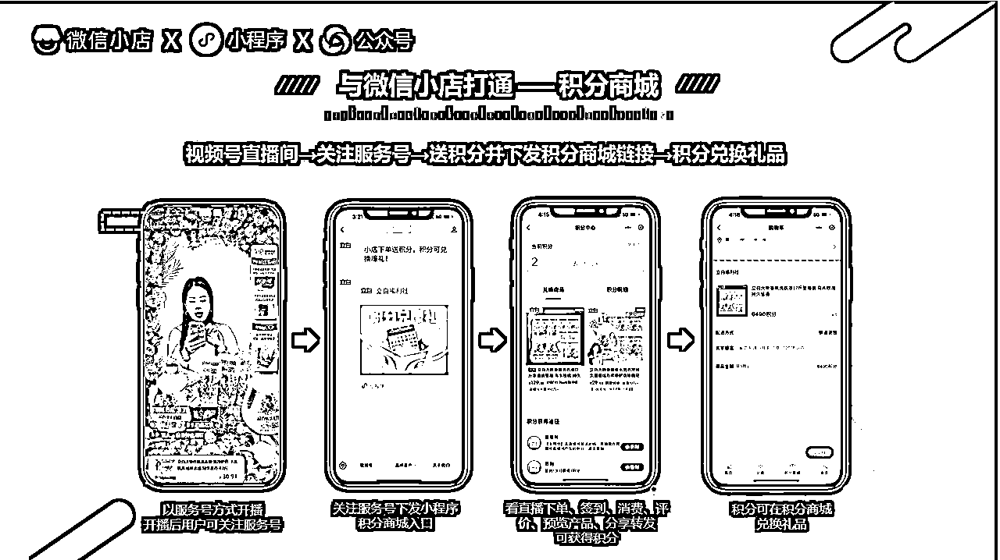
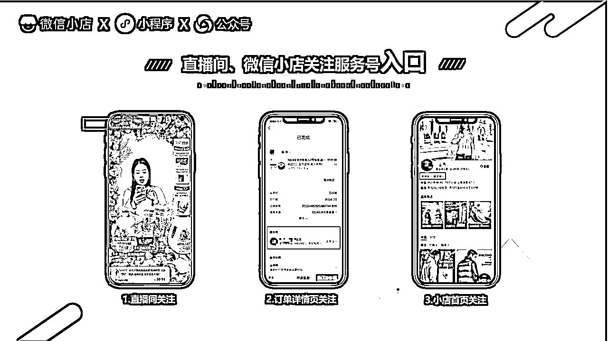
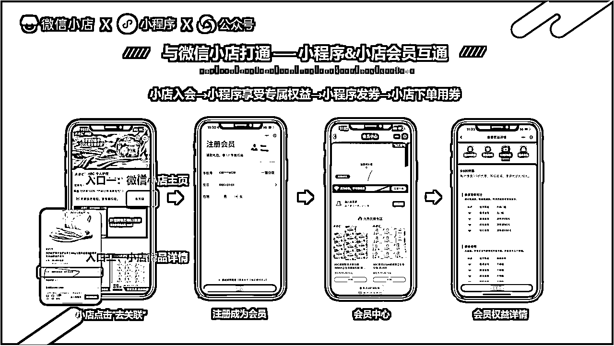
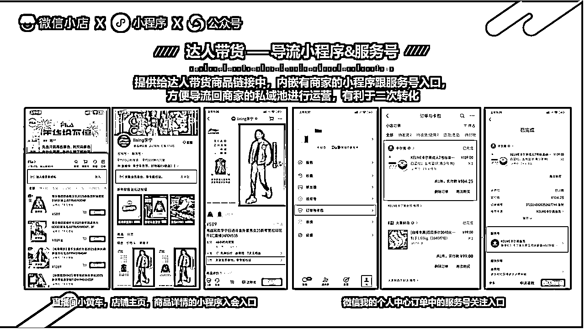
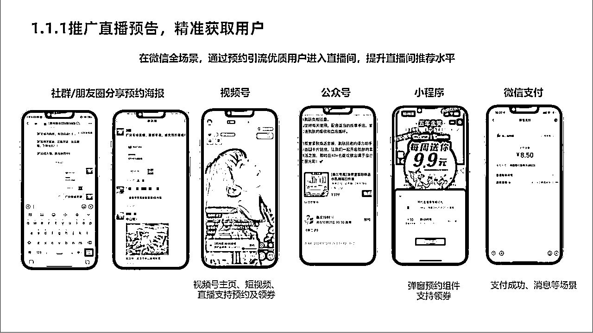
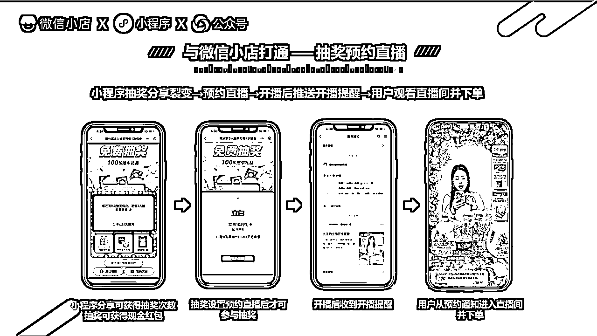
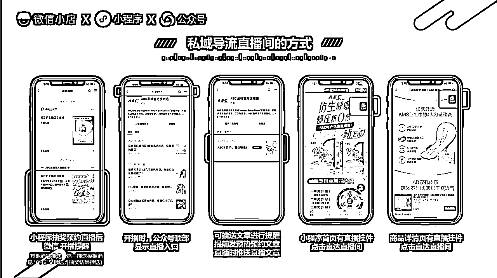
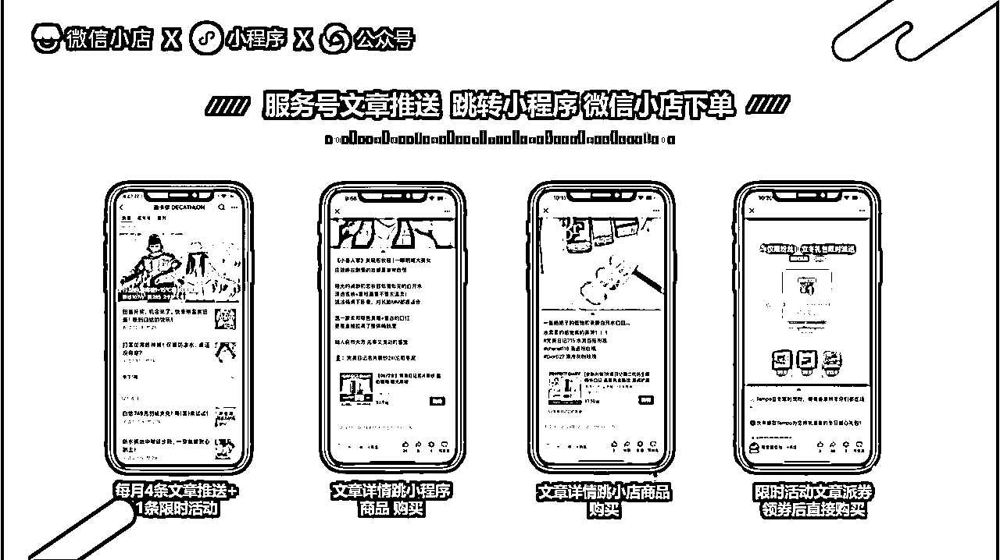

# 微信电商重新打开做私域的口子！！！

> 来源：[https://i6mtbju8w7.feishu.cn/docx/UBSodRvRmoyDGfxLl0rcjnvBnxe](https://i6mtbju8w7.feishu.cn/docx/UBSodRvRmoyDGfxLl0rcjnvBnxe)

## 微信电商的最新能力实现了微信小店、小程序、公众号、视频号的打通联运

在微信公开课上，推出了微信小程序与微信小店打通的能力。具体来说，就是在小程序里查看商品和交易都可以内嵌微信小店的商品组件，最终在微信小店内完成浏览产品和下单交易。商品和支付都在微信小店里面完成。这样小程序就可以脱离商品和交易环节，专注于做营销玩法或活动裂变。

至此，微信电商重新定义了微信下各个产品能力的定位。微信小店联动小程序、服务号，承接商家在微信内的交易。作为连接微信中各个场景的用户新流量和复购，将为商家带来生意上的增量。而视频号、公众号、社群等作为微信中核心的公私域场景，覆盖十几亿微信用户，具备高效率电商转化。所以这四个产品各有各的定位。微信小店承接产品、订单及售后，小程序主要用于做营销玩法、会员应用及功能服务，服务号则承载着用户沉淀、CRM管理、触达运营，也就是做私域，而视频号则负责做公域引流与促单转化的场景。

## 微信小店，小程序，服务号及视频号打通联运对商家有什么价值？

### 微信电商商家的一些痛点

*   视频号商家的直播间流量少或流量成本高。平台自然流推荐比较少，广告投放流量成本高或无法放大，属于一波流，很难长期有效存留复用。直播间观众无法存留沉淀回商家的用户资产。

*   平台规则处于完善期，很容易封店封号，商家一般会多开店，多个小店的用户无法统一管理及运营，导致营销资源容易造成重复浪费。

*   小店的用户信息是加密的，比较难以获得，特别是用户手机号，难以给用户打标签作CRM管理运营，不利于做私域。

*   找达人带货，无法将购买用户沉淀回商家的私域用户池，无法引导复购，造成费用成本高。

*   有私域的商家，统发直播间到私域，导致用户不精准，造成直播间成交率比较差，影响了直播数据指标，直播间无法获得更多的公域推荐。

*   小店及小程序各自独立，需要两套运营团队，造成人力资源的重叠浪费。

### 四个产品打通联运的价值及方案

#### 统一沉淀用户到私域，后期个性化精细运营提升复购率。微信小店及视频号为小程序打通后提供了多种导流用户至小程序的入口。

*   视频号关联服务号，引流直播间观众沉淀到服务号。在服务号中开启在视频号直播中展现服务号身份的配置，那么在视频号直播时，观众关注视频号就能自动关注到服务号。服务号可以配置自动下发信息（文案+图片/小程序卡片），引导用户进入小程序。勾子可以是点击下方卡片参与免费抽奖（百分百中奖，如给一些优惠券之类或小现金红包），也可以是点击卡片成为会员获取会员权益（如12张每月优惠券），亦或是查询会员积分可进行积分礼品兑换等等。通过这个方式可以把直播间观众引流沉淀到服务号跟小程序的私域池中进行精细化运营。

*   小店提供服务号/小程序入口。如小店主页的服务号入口，小店订单详情的服务号关注入口，小店首页的小程序入会会员入口，小店商品详情页的小程序入会会员入口。利用这些入口可以把用户引导到服务号跟小程序，后期持续运营进行转化，提升二次销售复购。

*   达人带货，沉淀达人粉丝回到商家私域。以前品牌商家找达人带货，提供坑位费、高佣金及广告费，只能是一次性卖货，无法再次触达购买用户。现在可通过订单详情页的服务号入口及商品详情的入会入口引流购买用户关注商家服务号或小程序，后期可反复触达进行运营转化。

#### 私域用户运营及裂变拉新，引流回直播间成交及撬动平台公域流量推荐。

*   利用私域裂变拓新并作直播预约，反哺回直播间获得推荐流量。视频号商家应该都知道，平台自然流较少，而付费广告流量属于一波流，无法存留复用，导致广告成本越来越高。因此，积累私域用户池复用提升复购就成了大家的共识。如果商家有了私域，就可以通过小程序提供的服务能力做一些营销活动去裂变拉新用户，例如抽奖、集赞、优惠券等等，扩大私域用户池。在视频号直播时就可以在私域引流回到直播间再进行促单转化，如参与抽奖需要预约直播间，观看直播，点赞分享转发可以获得积分，积分可兑换礼品。通过这些方式引流到直播间的用户更精准，成交转化率也会更高，直播的数据指标会更好，那就能获得更多平台的流量推荐。平台还有私域扶持政策，从小程序引流至直播间的场景刚好是符合扶持政策的要求，这样就能获得更多的流量券扶持，可用于直播间的广告投放。

*   利用服务号及小程序的作为呈现直播状态入口，引导粉丝用户进入直播间观看。视频号直播时，服务号与小程序会呈现多个直播入口，可直播引流进入直播间。直播时，服务号会推送开播通知，服务号顶部会展现直播中的状态入口，同时也可以推送文章，文章嵌入直播组件，方便粉丝预约直播或直接点击进入直播间观看。小程序则会在首页以挂件的方式展现直播入口，商品详情页也可以有直播挂件入口，同时也可以通过推送模板消息给用户提醒直播间开播了。

*   利用服务号文章推送能力通知粉丝观看直播。服务号每月有4次推送文章及1次限时活动，通过内容推送可以有效触达用户，提升转化。特别是每月1次的限时活动，是支持派送优惠券，用户领取优惠券后可直接下单购买商品。

从这次微信公开课能看出，官方在力推微信小店、小程序、服务号、视频号联动的能力，想帮商家在微信里更好经营生意，不再局限于直播单一渠道和广告投放获取流量。平台一直提倡商家公私域联运，之前提供了直播间直推企微卡片和挂二维码的能力，但后来发现这种方式会让部分商家无休止地主动骚扰用户，甚至是诈骗，造成微信用户体验差，就把这个能力下架了。现在推出的这套能力，可以看作是找到了另一种给商家导私域、做公私域联运的方式，相比之前会更温和，既能有效防止商家过分主动骚扰用户，又留了个口子让商家触达用户做精细化运营，这很符合微信的风格，用产品思维解决运营效率问题。