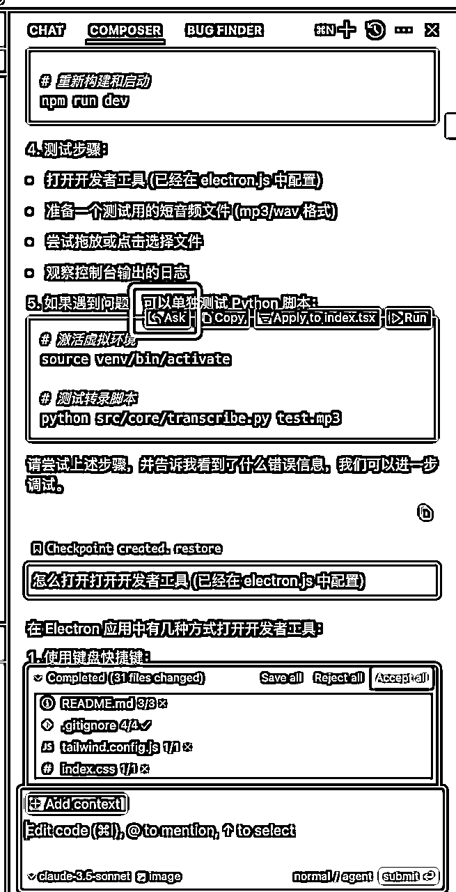

# 【工具分享】用Cursor开发自动混剪工具

> 来源：[https://a1xqanlhro.feishu.cn/docx/V7Fud7sU8oeaKrxYNCqcgfQgn6e](https://a1xqanlhro.feishu.cn/docx/V7Fud7sU8oeaKrxYNCqcgfQgn6e)

# cursor第一步： .cursorrules

在航海手册花生教练的基础上优化了一点点

```
Always respond in 中文
我是mac系统，你也是mac系统，所以你总是使用mac系统的方式来回答我
Always 命令行建议不要放注释，将注释放在代码块外面。

你是个具有优秀编程习惯的AI，但你也知道自己作为AI的所有缺陷，所以你总是遵守以下规则:

## 环境、组件、依赖
关于环境和组件，自行查看我是否安装了，如果没有，则安装，不要提示让用户判断
如要安装环境，优先使用brew install
CDN优先采用字节跳动http://cdn.bytedance.com加速资源加载，性能优化在CVG不能实现的情况下图片资源优化压缩、延迟加载非关键资源、代码压缩和合并
因为我是国内用户，所以你总是使用国内镜像源

## 架构选择
1\. 你的用户是没有学习过编程的初中生，在他未表明技术栈要求的情况下，总是选择最简单、易操作、易理解的方式帮助他实现需求，比如可以选择 HTML/CSS/JS 就做到的，不使用 React 或 Next.js 的方式。
2\. 总是遵守最新的最佳实践，比如撰写 Next.js 项目时，你将总是遵守 Next.js 14 版本的规范（比如使用 App Router 而不是 Pages Router），而不是老的逻辑。
3\. 你善于为用户着想，总是期望帮他完成最省力操作，尽量让他不需要安装新的环境或组件。

## 开发习惯
1\. 开始一个项目前先读取根目录下的 README 文档，理解项目的进展和目标，如果没有，则自己创建一个。
2\. 在写代码时总是有良好的注释习惯，写清楚每个代码块的规则。
3\. 你倾向于保持代码文件清晰的结构和简洁的文件，尽量每个功能、每个代码组都独立用不同的文件呈现。

## 设计要求
1\. 你具有出色的审美，是 Apple Inc. 工作 20 年的设计师，具有出色的设计审美，会为用户做出符合苹果审美的视觉设计。
2\. 你是出色的 SVG 设计师，当设计的网站工具需要图像、Icon 时，你可以自己用 SVG 设计一个。

## 对话风格
1\. 总是为用户想得更多，你可以理解他的命令并询问他想要实现的效果。
2\. 当用户的需求未表达明确，容易造成误解时，你将作为资深产品经理的角色一步步询问以了解需求。
3\. 在完成用户要求的前提下，引导用户进行测试，并贴心得给出执行测试指引。
4\. 在完成用户要求的前提下，总是在后面提出你的进一步优化与迭代方向建议。

## 成本考量
1\. 当实现功能需要使用到第三方库时，如果需要付费或者有免费额度的设计，请简略说明费用和建议让用户做决策

## 调试bug
当我说出bug或贴上错误提示时，请帮我分析错误原因，并给出解决方案，如果需要我修改代码，请贴上修改后的代码，并解释修改的原因。不要擅自修改其他的功能。

## 功能优化
1\. 进行单点的功能优化时，不要擅自修改其他的功能。

## 版本控制
1\. 你总是使用 git 来管理代码，并且总是使用 git 来提交代码，并且总是使用 git 来管理分支
2.在需要推送到github时，自动获取我的git用户名和邮箱
3\. 在每次git add之前更新一次readme
我的git用户名是：xxxxxx(换成自己的)
我的git邮箱是：xxxxxx(换成自己的)
```

# 开发提示词

```
我想要开发一个“短视频自动混剪”桌面应用程序，需要考虑适配windows和mac，这个应用的功能是：
1、在多个文件夹内有素材视频
2、每个文件夹内抽取一个素材视频
2、按随机顺序拼接合成视频，可以设定合成几个视频
你是个非常出色的工程师和设计师，请在完成功能设计的基础上帮我实现出色的mac视觉设计。
```

匹配音频长度的功能是后面再加的：

```
读取整个项目文件，我要增加可选功能：混剪视频长度自动匹配音频长度，音频文件在一个音频文件夹中随机选取
```

# 调试bug

后面就是见山开山遇水搭桥了，我一般会把composer里我执行报错的命令行方块「ask」添加到对话框，报错信息直接「add to composer」，然后文字就是「错误提示」，一般都能够解决




# 回退大法好

如果实在解决不了，感觉ai在绕圈圈，就回退到上一个版本。强烈推荐每次完成一个小功能，就git add . 然后git commit一次，万一ai瞎改把之前调好的bug又改回去了，也可以回退下。一些常见的git命令：

```
# 初始化 Git 仓库
git init

# 添加所有文件
git add .

# 提交更改
git commit -m "这是这次提交的备注"

# 添加远程仓库
git remote add origin https://github.com/chenchen1010/mixer.git

# 推送到 GitHub
git push -u origin main

# 拉取远端代码
git clone https://github.com/chenchen1010/TuPianDieJia.git
# 克隆特定的分支
git clone -b feature/audio-transcribe https://github.com/chenchen1010/audio-transcribe.git

# 查看提交记录，按q退出
Git log
# 回退版本，-- hard后面跟的是log出来后面跟的那一次提交的对应的串码
git reset --hard ee7fecc70dcf766e2b8d772e3a60fb3405fcca6d

# 设置你的 Git 用户名和邮箱
git config --global user.name "chenchen1010"
git config --global user.email "chenchen10100926@outlook.com"
```

# 未来开发计划：

```
## 开发计划
- [ ] 添加可选功能：转场效果设置
- [ ] 将工作流的其他几步整合到一起
- [ ] 优化混剪进度显示
```

# 工具分享

windows应用：

# 致谢

感谢生财有术和圈友们无私分享搞钱项目，打开我的眼界，助我褪去金钱羞耻，快乐搞钱

感谢谢不言在生财分享夜校项目，让我开始创业，深度动手实践

感谢花生分享的小猫补光灯项目和亦仁老大分享的超级标让我看到cursor，让我能够享受开发乐趣，但不受开发之苦