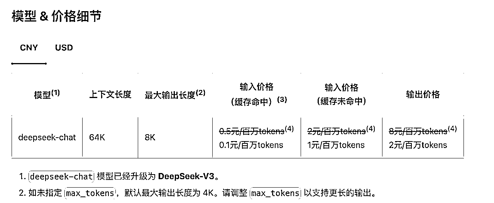
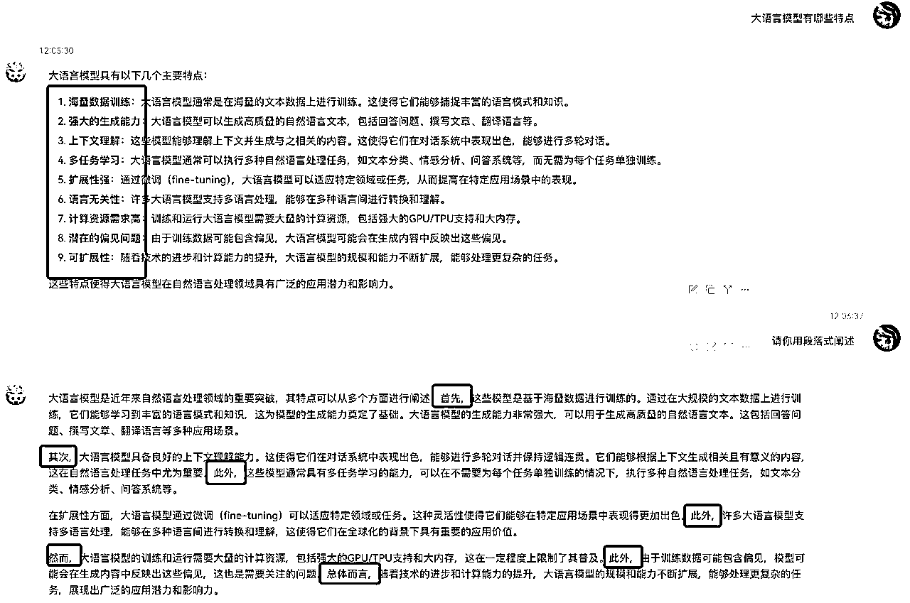
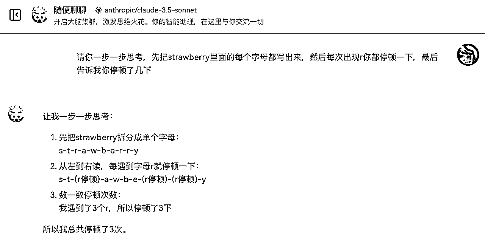
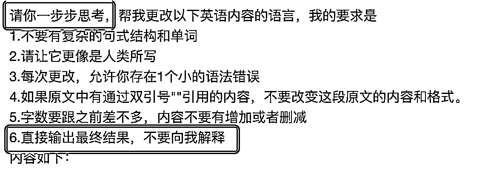

# AI写作原理拆解：一文吃透GPT底层原理和使用误区，提高写作质量（含视频讲解）

> 来源：[https://y0arjkskpp.feishu.cn/docx/W9mjd9hoUoBY8TxAs0Hc25Wwnih](https://y0arjkskpp.feishu.cn/docx/W9mjd9hoUoBY8TxAs0Hc25Wwnih)

# 引言

我之前帮助很多同学检查他们用AI写作的质量问题，我发现有很多问题的根本是对大语言模型的基本原理不理解，导致使用AI的时候犯一些低级错误。

如果你只是把AI当一个聊天机器人，那可以随便聊。但如果要把它当成是强大的生产力工具，那就必须得了解清楚其原理，这样才能把它的能力发挥到极致。

最主要的是，了解原理能够让你明白AI的能力边界，避免让AI做出超出它能力的事情，从而避免犯低级错误。这很重要。

# 大语言模型原理

## 什么是大语言模型

我们写作用的AI属于大语言模型（LLM，Large Language Model），它是AI的一种类型。AI也就是人工智能，它的类型有很多：下围棋的AlphaGo是AI，人脸识别是AI，抖音推荐算法是AI，AI画图也是AI。这些AI都不属于大语言模型。我们写作用的ChatGPT、Claude、Kimi、通义千问这些属于大语言模型。

大语言模型，顾名思义，它是处理自然语言的（自然语言指的是人类从自然界演化出来的语言，也就是我们平时说的语言，它是相对机器语言、形式逻辑语言这些人类发明出来的语言的）。它是使用海量的文字，准确地说是互联网上能搜集到的所有文字，训练出来的，所以叫大模型（准确地说这个“大”是指参数多，但这里就不展开说什么叫参数了）。

GPT（Generative Pretrained Transformer）是一种大语言模型的算法，由于ChatGPT的成功，现在的大语言模型99%都是用的这个算法。其实大语言模型还有别的算法，比如BERT，只是效果不太好，所以没有普及。

## 大语言模型是怎么输出的

大语言模型能够写出来文字，本质上不是因为它真的会思考，而是因为它会“猜”。它的工作原理其实非常简单，就是用全互联网上所有能搜集到的文字把它训练一遍，然后当你跟它说话的时候，它就能猜出来下一个字要说啥。也就是说，它的底层本质是概率和统计。

## 大语言模型是怎么记住之前对话的

大语言模型本身是没有记忆功能的，它之所以能记住之前的对话，原理其实非常简单粗暴，就是把之前所有的聊天记录全部发给它。

举例来说，假如第一次你发给AI的内容如下：

```
[
  {"用户": "世界上最高的山是什么山"}
]
```

AI给你的回答是：

```
{"助手": "世界上最高的山是珠穆朗玛峰"}
```

那么第二次对话的时候，你实际上发给AI的是下面的全部内容：

```
[
  {"用户": "世界上最高的山是什么山"},
  {"助手": "世界上最高的山是珠穆朗玛峰"},
  {"用户": "第二呢"}
]
```

假如AI回答“乔戈里峰”，那么到了第三次对话，则要发送下面的内容：

```
[
  {"用户": "世界上最高的山是什么山"},
  {"助手": "世界上最高的山是珠穆朗玛峰"},
  {"用户": "第二呢"},
  {"助手": "乔戈里峰"},
  {"用户": "第三呢"}
]
```

由此可见，随着对话的增多，每次发送给AI的内容其实是越来越长的。

这也产生了一个推论：单次发送一个很长的内容，和多轮对话，这二者对AI来说效果是差不多的。

# 大语言模型的局限性

## 数学能力/逻辑能力非常差

因为AI并不是真的会思考，而是靠直觉猜，所以它的数学能力的本质是“依靠经验蒙”。有时候你看起来它会做数学题，这个本质上是因为它在训练过程中读了大量的数学书，能够按照概率猜出来答案。


尤其是当你让AI写特定字数的文本的时候，它写出来的字数经常是错的。你让AI去数某段文本有多少字，通常也是错的。所以写文章的字数控制不要依赖AI。

## 输出的文本不能太长

根据前面的原理可以知道，大模型本质上是通过前面的所有字来猜下一个字要输出啥，所以越往后猜，肯定就越不准确。所以输出的文本越长，质量会越来越差。

大模型的输入和输出能力是不对称的。举例来说，下面是Deepseek大模型的官方文档里的截图：



我们可以看到两个特点：

*   输入价格比输出价格要便宜很多

*   输入的上下文长度要比输出的长度要长很多

因此，不要一次性让AI输出太多。

## 输入的文本太多，它会忘记前面的

输入的文本也不能太多，原理有两个：

*   大模型毕竟是代码，就像你的电脑打开一个大的文件和一个小的文件，对电脑来说肯定是打开大的文件更费劲。所以输入如果太多，大模型的处理质量会变差。

*   大模型是凭借概率来猜下一个字，所以越靠后的字肯定优先级越高，越早的字优先级越低。所以太早输入的内容会被大模型忽略掉。

*   虽然目前大部分大模型都能支持128K的上下文（大概有几万字的中文），但是实际上你用的平台为了省钱，如果你对话的轮数太多，它在实际发送给大模型的接口之前会对你之前的内容进行压缩，很多细节因此就会被省略掉

## 输出的风格依赖于输入的上下文

*   你设定的是学术风格，那么就会输出学术风格

*   你设定的是儿童风格，那么输出就会很幼稚

这也是为什么提示词的正确使用非常重要。你的提示词太简单，那么输出很可能就会很普通甚至AI味很浓。你提示词越精确，它就越能输出符合要求的内容。

这同时也说明了一个问题，就是不同的任务，不要混杂在一个对话当中。每个不同的任务，应该开启不同的对话。

## 你上传文件并不意味着它会完整地阅读全文

目前对于上传的文件，大部分情况下使用的是一种叫做RAG的技术。这种技术能够把大文件给向量化（非技术同学不用管什么是向量化），向量化的文件能够方便AI进行检索。

它的好处是，如果你想问AI这个文件里有没有某个内容，AI可以帮你从里面读取到相应的内容。

它的缺点是，它实际上并不是完整地读了整篇文章。

因此，对于上传的文件，你可以问AI：

*   这篇文章里有没有关于xxx的内容

你不可以问AI：

*   帮我检查一下整篇文章的结构是否清晰

*   它有可能会回答“我发现第三章似乎没有写结论”，这种情况可能是把第三章分成了多个片段导致的

*   帮我对整篇文章进行改写

如果文章本身不是特别长（中文不超过3000字，英文不超过1500单词，对AI来说是发挥比较好的字数。超过这个字数当然也可以，但是AI的能力会下降很多），并且你想让AI帮你读整篇文章的话，最好的办法还是直接复制粘贴到对话框中，而不是依赖文件上传功能。

## 有一些明显的语言特征

如果没有用提示词进行限定，大语言模型会默认按照它最喜欢的输出方式来输出。这种情况下有一些很明显的特点，让人一眼就能看出来是AI写的。

有些很明显的特点比如：

*   喜欢用列表

*   喜欢用小标题+冒号

*   喜欢用“首先、此外”等连接词

*   喜欢在最后进行总结



所以，哪怕是你不考虑系统检测AI率的问题，也得至少确保不要让人一眼看出来这是AI写的。（至于如何让系统检测不出AI率，这个我会在其他的教程里面讲）

# 大语言模型的正确使用方法

## 一定要人工检查

到目前为止，大语言模型只是人类的提效工具，一个扩展，而不是替代。它仍然会犯很多低级错误，因此必须得依靠人类进行兜底。

用AI写的东西一定不要不做检查就直接交付，一定要做检查。

## 一定要分段处理

大语言模型没法一次处理很长的文本，一定要分段处理。

就我的个人经验而言，要保证AI对输入的理解能力和对输出的质量保证，字数最好是下面这样：

中文：

每次发给AI的输入不要超过2000字，每次让AI写的内容不要超过500字。

英文：

每次发给AI的输入不要超过1000单词，每次让AI写的内容不要超过300单词。

## 定期重置上下文

这里面包含了两个道理：

*   不同的任务要用不同的对话，不要在一个对话里讨论不同的事情

*   如果某个对话太长了的话，AI的能力会越来越差，这种情况应该重新开启一个对话。

对于对话太长的情况，开启新的对话肯定能够让AI更好地处理。但是这里面有个问题，就是在新的对话里，AI根本就不知道之前的对话里的内容，这时需要你总结一下之前对话的内容，让AI重新建立起上下文，知道你要干什么。

因此，同一个对话的好处是不需要重复对AI下指令，AI能够根据之前的指令进行执行，坏处是时间长了，AI会忘记最初的指令。因此要做好取舍，判断该不该重新开启新的对话。

## 用提示词框定好上下文

提示词工程的意义就在于此。你表达的越精确，AI的表现就越符合预期。

一定不要偷懒，只用一两句话来告诉AI应该干啥。应该尽可能地描述清楚你要做的事情。

如果有别人一定实践好的一套提示词，当然最好是直接复用，这样比自己从头写效果要好。

但也不能完全依赖别人的提示词，要自己明白原理，按照具体情况具体分析，生搬硬套有时候会不符合当时的场景。

## 让它一步一步思考

这个可以说是最强的大语言模型提示词了，这个经过了大量的实践证明能够大幅提升AI的能力。原理其实就是之前讲的原理，也就是上下文越清晰，AI猜中下面输出文字的能力就越强。



“请你做个深呼吸，一步一步思考”，大量实验证明，提示词里加上这一句能够让大语言模型的能力变强。

很多人虽然知道这个技巧，但使用的时候有个误区。这个误区就是不明白一个道理：没有明显的思考过程，等于没思考。

比如下面这个提示词：



这个提示词虽然前面加了“请你一步步思考”，但是后面说“不需要向我解释”，那么其实这个“一步步思考”的效果就会大打折扣。

# 附录：目前哪些大语言模型很强（定期更新）

了解这些来帮助大家来选择合适的模型，确保大家用到的都是最好用的。这部分内容具有时效性，当前的内容更新时间是2024.12.29

名词解释：

多模态：有两种以上的数据类型（文本、图片、音频、视频等）处理能力。比如大语言模型一般都是处理文字的，如果它还能识别图片，就说它有多模态能力。

## 常见大模型（不完整列举，主要针对常用的）

### 美国

#### OpenAI公司

大语言模型的祖师爷。

ChatGPT系列

ChatGPT 4o：目前ChatGPT的主流版本。o表示omni，意思是全能，主要指它的多模态能力。最新版是2024-11-20

ChatGPT 4o mini：mini的意思就是低配，比4o价格更便宜，速度更快，能力上差一些，主要用来处理一些简单任务

（但有个很坑的一点是，现在的ChatGPT为了降本增效，有时候会把ChatGPT 4o偷偷降智成ChatGPT 4o mini，所以有时候4o的能力会差的离谱，建议大家避坑。）

o1系列（具备逻辑思考能力）

o1：正式版于2024-12-17发布，之前发布的预览版叫o1-preview。这个模型具有思考能力，特点是要花很长时间思考，价格也很昂贵。经过长时间思考以后，确实具备了一定的逻辑能力，弥补了普通大语言模型逻辑能力差的问题。

o1-mini：o1的低配版，也就是思考的时间相比o1大幅减少，所以价格便宜很多。逻辑能力比普通的ChatGPT 4o要强一些。（注意，这个名字不要和ChatGPT 4o mini混淆！ChatGPT 4o mini的能力非常差！）

o3：o1的下一代，发布会只公布了性能，但是还没开放给大众使用，预计明年开放。据说能力超过了人类的博士水平，但价格极其昂贵。之所以没有o2，是因为这个名字被别的公司用了。

#### Anthropic公司

OpenAI的创始人有一大半来了这个公司

Claude 3.5 Sonet：目前Claude的主流版本，对标ChatGPT 4o，但实测能力比ChatGPT 4o要强。推荐大家优先使用这个模型。最新版是2024-10-22

Claude 3.5 Haiku：低配版，对标ChatGPT 4o mini

Claude 3 Opus：Opus是能力最强的系列，但可惜一直没出Claude 3.5 Opus，目前最新版还是3.0

#### Google公司

Gemini 2.0 Flash：2024-12-11放出了免费测试版，能力超过了ChatGPT 4o和Claude 3.5 Sonet，但还是测试版，不太稳定。

Gemini 2.0 Pro：2024-12-06放出了免费测试版，能力仅次于o1，但还是测试版，不太稳定。

Gemini 2.0 Flash Thinking：2024-12-11放出了免费测试版，能力对标o1，但还是测试版，不太稳定。

#### X公司（原Twitter）

Grok2：2024-12-12发布，能力不突出，无需关注

#### Meta公司（Facebook）

Llama 3.2：最强的开源大模型之一，但不考虑自己部署开源代码的话可以不关注。

### 中国

#### 深度求索公司

Deepseek V3: 2024-12-26发布，目前最强（不只是中国最强）开源大模型。能力上超过了ChatGPT 4o、Claude 3.5 Sonet、Gemini 2.0 Flash。唯一缺点是不支持多模态，识别图片的能力很差，但对于AI写作来说影响比较小。

而且是免费的，不需要翻墙，网址：https://chat.deepseek.com/

#### 月之暗面公司

Kimi：目前国内最受欢迎的大语言模型，非常好用，免费，尤其是搜索功能挺好用的。日常可以用这个。它比Deepseek擅长识别图片，而且用户界面非常友好。https://kimi.moonshot.cn/

#### 阿里巴巴公司

通义千问 2.5：之前是国内最强的开源大模型，现在暂时被deepseek超越。

#### 字节跳动公司

豆包：emmm，怎么说呢，营销做的很好，用户功能很多，也很友好，但是大模型的质量还是不够好。

#### 百度公司

文心一言：国内最早的大语言模型，发展了这么多年还是*

### 法国

Mistral：除了美国、中国以外做的最好的大语言模型了。免费使用，也有网页搜索功能，而且不用翻墙，如果临时想搜索一下国外的论文又不想翻墙，可以试一下这个。网址：https://chat.mistral.ai/

## 怎么选择

我目前用的最多的是Claude 3.5 Sonet。至于Deepseek V3刚发布，虽然能力很强，但我没大量测试过，推荐大家可以用用看，毕竟免费且不用翻墙。