# 小红书1篇10万+，卖出千单虚拟资料的实操经验

> 来源：[https://l762hez4ol.feishu.cn/docx/WFiVddUHTolpo5xPeiWcuqkhngc](https://l762hez4ol.feishu.cn/docx/WFiVddUHTolpo5xPeiWcuqkhngc)

大家好，我是苏晚，5年广漂运营，去年6月我参加了小红书航海，期间成功跑通小红书带货变现闭环，靠一篇10万+笔记，卖出1500+单，半年内同步拿到涨粉、变现、私域引流三大成果。

这次航海让我赚到了小红书的第一桶金，全程跟着手册节奏来，特别是刀姐的教学直播，给思路给方法给心态，让我收获巨大，虽然我现在没有深耕电商赛道，但这些实操经验对我影响深远，而且目前小红书大力推电商，卖各种教育资料都比较火，流量大，一本万利，还可以实现自动发货，推荐大家都可以入局尝试。

我分享的主题是《小红书1篇10万+，卖出千单虚拟资料的实操经验》，要特别感谢梁靠谱老师的指导和鼓励，大家可以借鉴下我怎么0-1跑通完整变现流程，拿到最小MVP：

## 本次分享的目录大纲：

1、项目实操背景+引流成果

2、小红书带货变现的三个阶段

第一阶段：免费分享，苦不堪言

第二阶段：上架店铺，合法引流

第三阶段：提升单价，持续变现

3、六个常见问题及注意事项：

3.1商品类目-虚拟定制产品才能使用无物流发货

3.2三种低风险引流方式参考：

3.3发货方式-教你如何光明正大发微信

3.4有人退货怎么办

3.5小红书新订单没提醒，发货不及时怎么解决？

3.6回复率考核-设置语音提醒及时回复

# （一）项目实操背景+引流成果：

我的小红书家居号出了一篇爆款笔记，分享干货资料的，阅读量从几万跑到了现在的16万+，参加航海后，我开店并上架了产品，卖家居类虚拟资料产品的（验房表），这篇爆款直接/间接带来的成果是：

1、小红书涨粉2千，成功开通蒲公英开始接广变现

2、低粉跑通变现闭环：商务收入1500+，店铺收入1500+

3、小红书引流群聊3个，进群总人数1250人+

4、24年6月航海期间开始上架产品，截止25年1月卖出1500单

5、引流500+关注公众号，400+微信私域

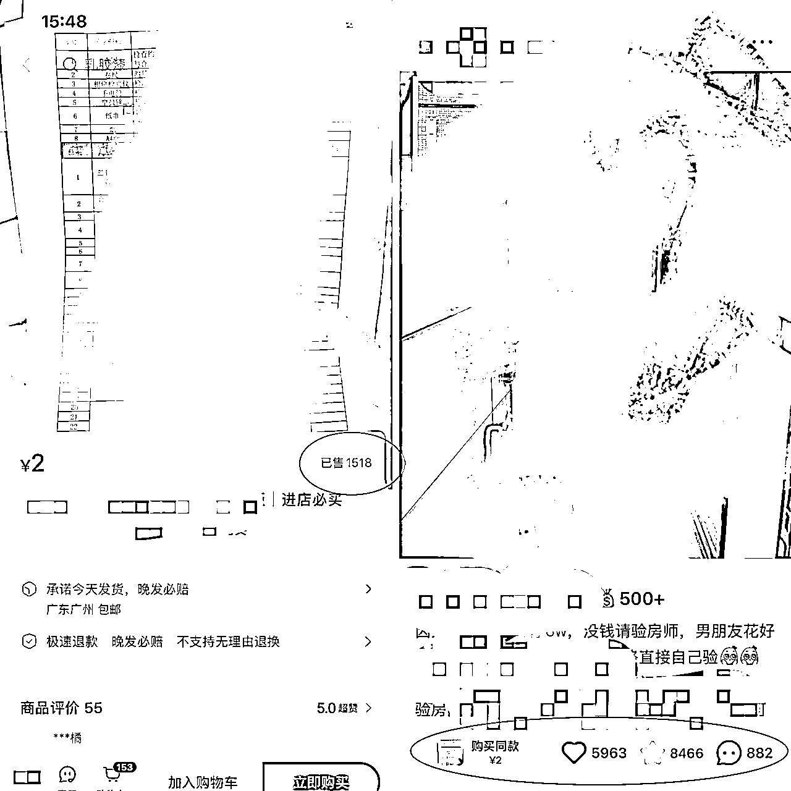

这个带货成绩一般，但对一个千粉小号来说还是可以的，而且吃的是爆文长尾流量，每个月持续有几百块进账。

但别看我好像很快变现，其实刚出爆款时，我根本没意识到要上架产品，直到参加了生财航海，我才按照手册开了两家店铺，一个是家居号，卖验房表资料、床笠、衣架，一个是饰品类的，卖发夹、耳环、项链这些，当时这两个号的品都有出几单，听刀姐的课收获很大，打开了电商卖货这个新赛道。

但由于我主业较忙，时间兼顾不过来，加上没有大爆，后面就停更了，甚至航海还差一次打卡没完成（错误示范），只是我没想到小红书的长尾流量这么香，这个验房表从每天出3-4单，到最高有20-30单，还是我一直断更的情况下。

那接下来，我将从实操过程的三大变现阶段、六个常见问题+解决方案，来重点分享。

# （二）店铺带货变现的三个阶段：

## 第一阶段：免费分享，苦不堪言

我收房时是自己验房的，需要验房表，所以在网上综合了很多个版本整理了一份全的，我随手发到了小红书，没想到就爆了，后边还根据这份内容剪辑了一个视频，并且都带上了产品链接（单价也从1元调整到2元），不得不说，小红书爆文的长尾效应是真的牛，半年多还持续有新订单。

这时候我没有收费意识，只是通过红薯群引流到我的公众号，在我公众号后台发送“验房”关键词就可以免费领我整理好的验房表格

但因为小红书后台每天有99+私信要表格的，我回复花费了很多时间精力，关键是发送公众号或者微信号这种很容易违规，发了几个就收到后台警告了，这时候我才建群，在群里置顶消息，这样只要进群就能知道怎么获取，我也同步关闭了私信

好处是大概有三四百人通过这个方式来关注了我的公众号，但我的公众号不是主要分享家居内容的，所以这部分粉丝不会看我的文章，对阅读量也就没有贡献，加到我微信号也没啥意义

## 第二阶段：上架店铺，合法引流

24年7月我刚好参加了生财的小红书航海，开始思考要不直接上架店铺算了，因为小红书店铺前期可以不交保证金，满1万元要提现了再交也行，相当于0元开店，我找了一些参考，发现也有不少卖装修资料的，所以才定价1元开始上架到自己的店铺。

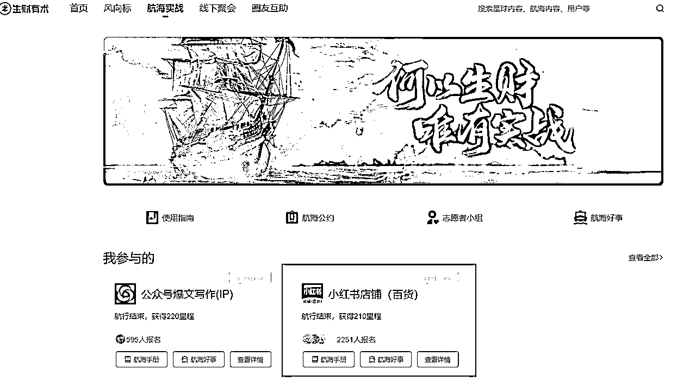

我发现关注的一个博主也在卖1元资料，于是我买了一份，看她是怎么发给我，发现还是要加微信发送，但通过店铺发货的方式发微信号，是没有这个违规风险的，因为其实订单还是在平台成交的，平台也有一定抽成比例5%，比如我卖出1单售价1元的验房表，小红书会扣除0.05元手续费，实际到账是0.95元。

这是我当时找的一个对标参考，分享给大家：

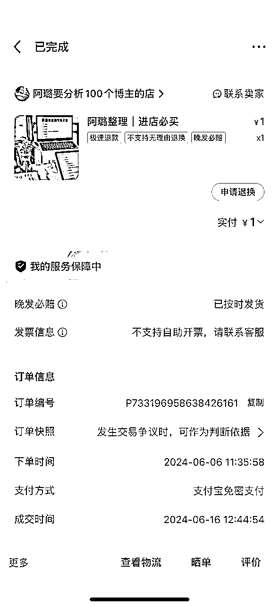

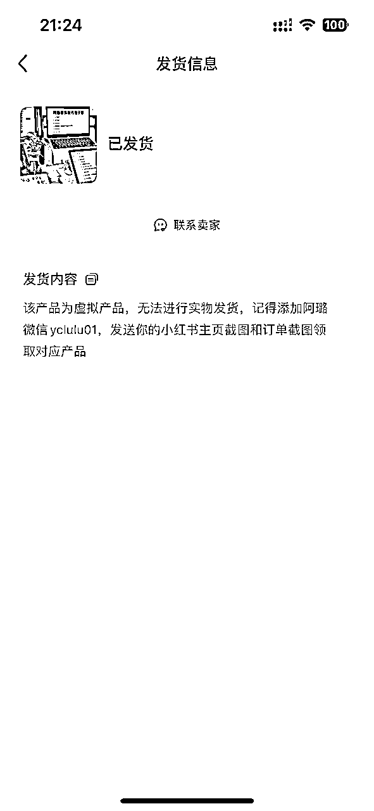

于是我也准备了一段发货话术，粘贴在输入法的常用语里，每次有人下单只要发这段就行

这是我现在的发货模式：

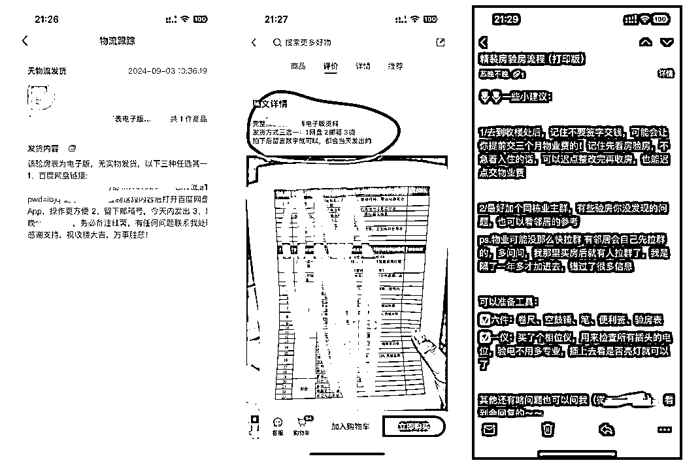

因为考虑到有人是不想加微信的，我准备了3个方式都能获取表格：百度网盘、邮箱号、微信号，并且放在详情页说明里，这样用户付费时就可以第一时间知道怎么获取，直接给我留言数字，我发送起来也就更快速

不管是哪种方式，都附上了一些建议，这样收到的人会觉得更物超所值，超出预期，这也是这个商品好评率5.0，这771个评价里，没有一个差评的重要原因！！！（我自己没刷过任何好评，都是用户主动给的，这块大家可以自己去优化的，前期出单时多发几个高质量好评）

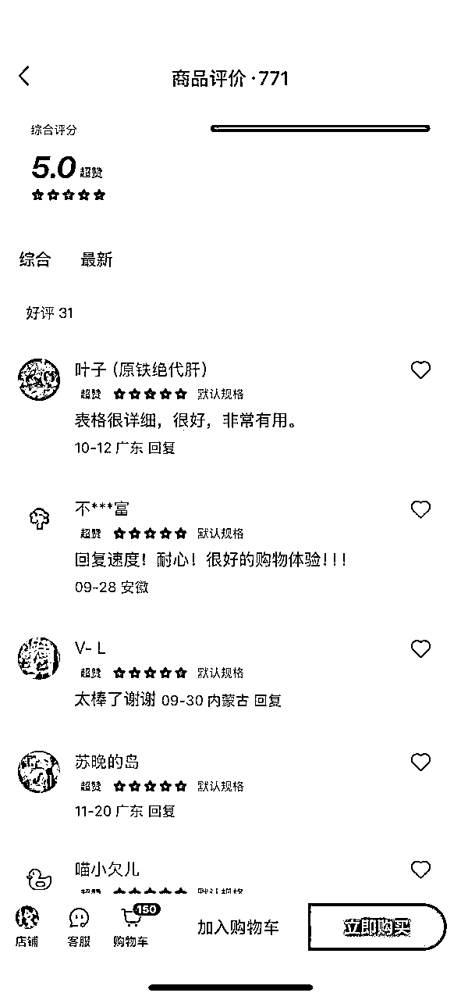

通过这个方式加微信来的都是付费用户，相比第一阶段“白嫖”的，人群更加优质，现在我的视频号也会同步家居视频，这样也能把这部分粉丝沉淀到私域流量里，后期也好转型直播带货

考虑到我的单量不是很大，每天10单左右，所以都是手动发货，有的每天单量几百几千的，还有专门的自动发货插件，拍下后可以秒发到账，但需要在小红书服务市场付费购买，参考下这个是138元/年，这个就不具体展开了。

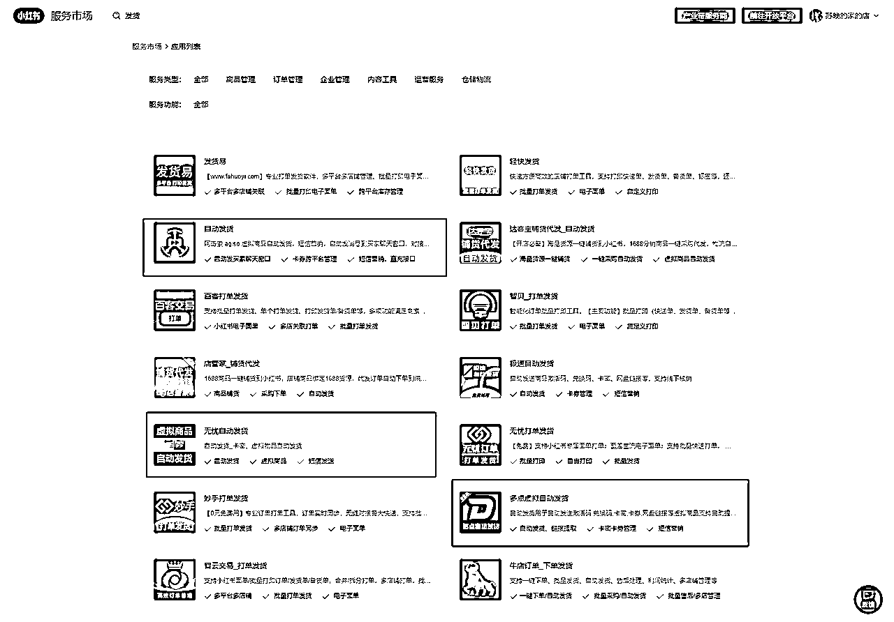

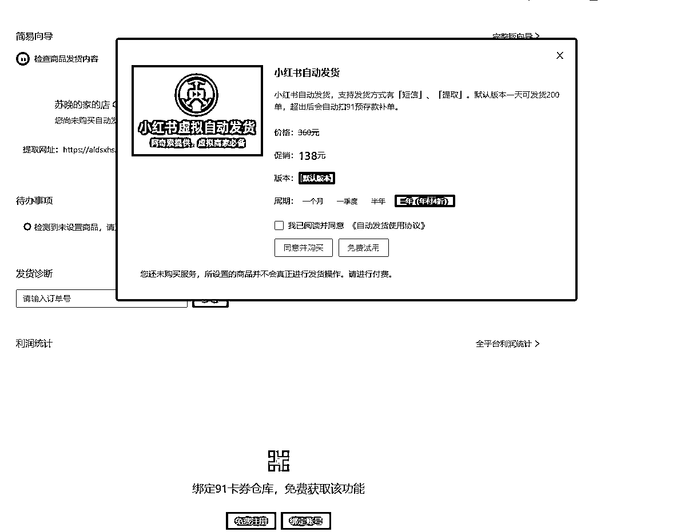

简单算了一下，每一单手动发货要花的时间大概半分钟，有的要加微信发货的可能时间多一点，但这个时间很值，因为加到私域以后，还可能会有二次转化的。

我前段时间搞了个团购群，其中有三个下单的朋友，就是从小红书加过来的，还成了我的私域客户，算是意外之喜。

综合来说第二阶段，这样卖虚拟资料有三个好处，实现了一举三得：变现、引流、涨粉

ps.这个阶段除了卖虚拟资料，还测了几个产品，也出了10来单，但后来这个品退货率较高，就下架了，个人感觉还是虚拟产品更适合我，下图就是我跟着航海手册做的选品表，对测品帮助很大：

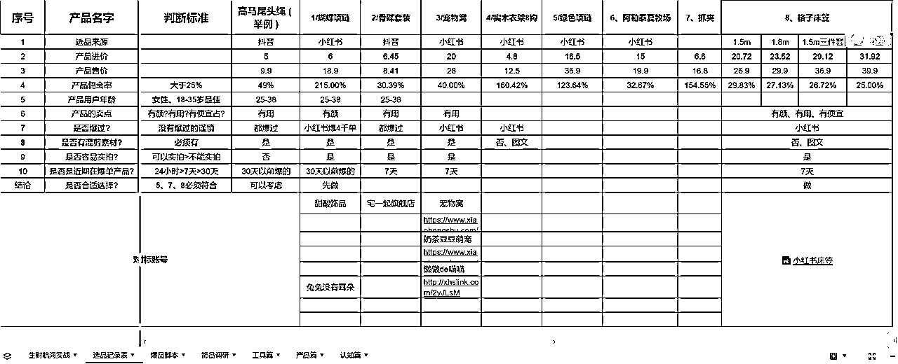

## 第三阶段：提升单价，持续变现

这个产品突破1000单后，我目前也开始调整模式，因为1元的客单价太低，我后端又没有直接的产品变现比如验房师团队这些，所以计划是优化这份表格，增加毛坯房和验房报告，把单价提升了6元-9元这个区间，提高项目的利润空间。

补充：从上个月开始把单价提升到2元，单月持续基本400单，利润也翻倍了

# （三）六个常见问题及注意事项：

## 3.1商品类目-虚拟定制产品才能使用无物流发货

商品类目一定要选择虚拟资料对应的类目，不然是没办法实现无物流发货的，只能发快递单号，选择后，无物流发货需要点击这里才会出现

在商品类目选择时，应选择“艺术潮玩”下的“虚拟定制”，这样就可以销售各种虚拟资料了。找不到这个类目也没事，可以搜索的，我第一次就翻了很久

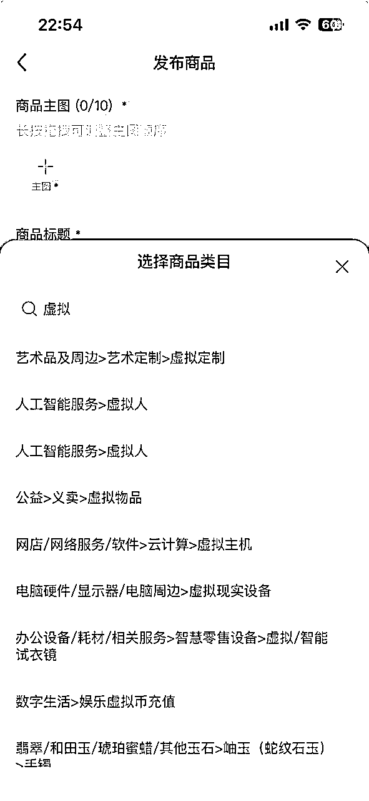

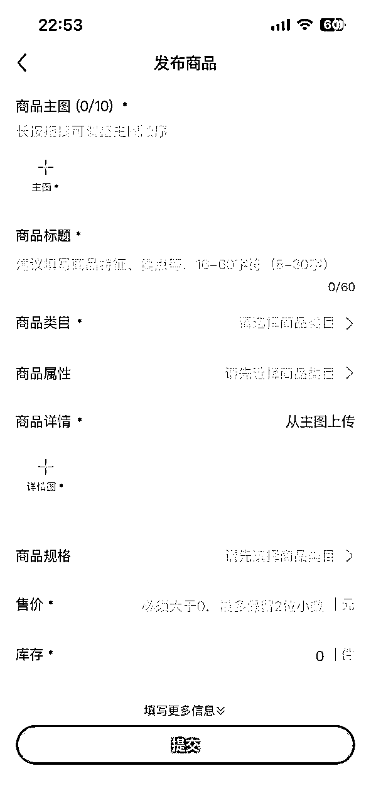

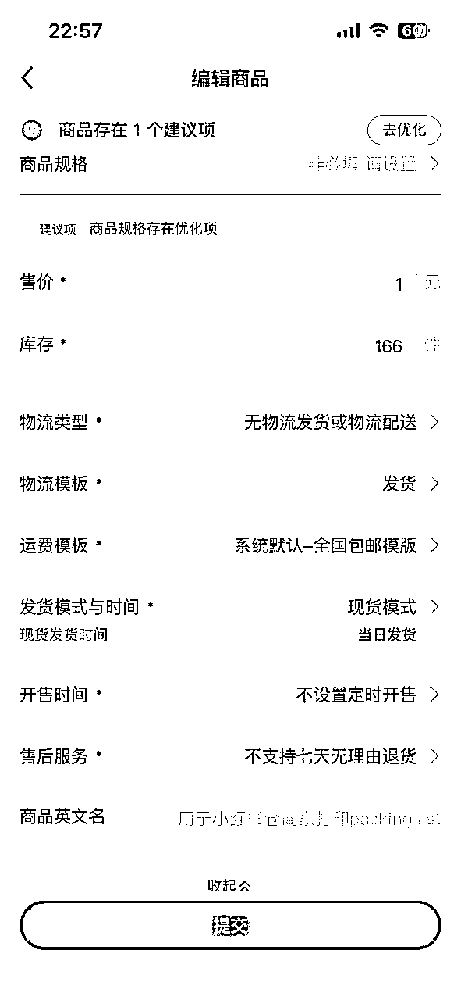

尽量不要用小红书私信回复功能引流，只要超过5条就很容易违规的

另外，可以无物流发货的还有一个类目：成人教育>技能培训>互联网产品运营/电商运营，但是这个类目需要提交资质证明：《小红书行业资质证明》

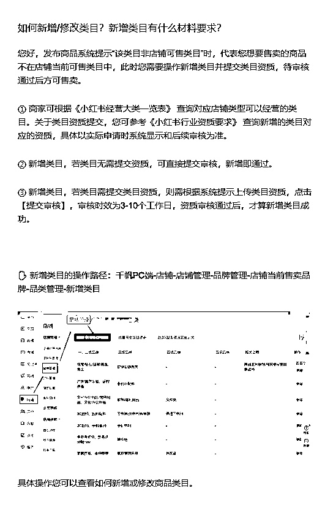

✋新增类目的操作路径：千帆PC端-店铺-店铺管理-品牌管理-店铺当前售卖品牌-品类管理-新增类目

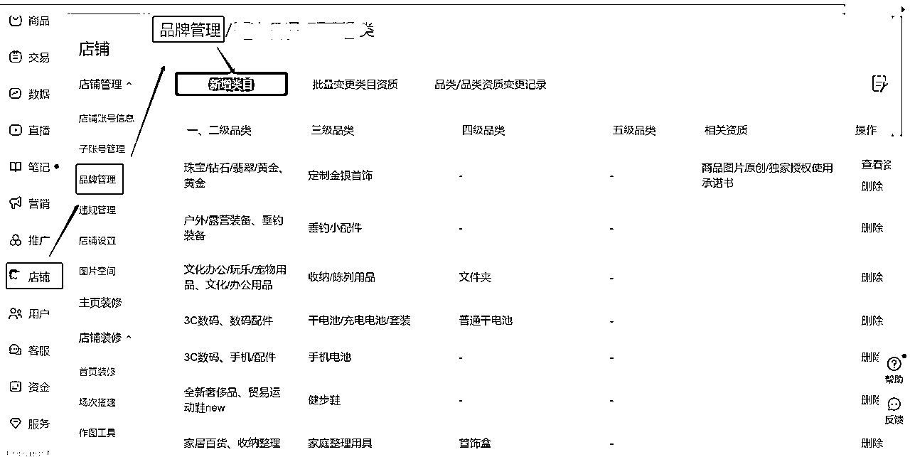

## 3.2三种低风险引流方式参考：

第一种可以参考我的，通过红薯群引流，因为红薯群可以绑定笔记，也可以复制群链接发到评论区，再置顶，粉丝只要一拉评论区就可以点击进入，转化链路最短

第二种是在自己账号的收藏夹笔记里放v号，同样每次评论区都置顶引导一遍，不知道怎么引流的，直接参考看竞品的准没错

这个就是放在收藏夹里的 只收藏了这一条笔记

第三种是群聊+置顶笔记

是群聊-置顶消息-主页笔记

如果这种方式的话，尽量用小号，把小号设置成社群管理员，就算违规也不会影响到大号（一般来说，个人号不影响，但企业号会比较严格，我之前做的企业号就是这样引流，结果被关了7天小黑屋，应该是进了人工审核阶段，被盯的比较严）

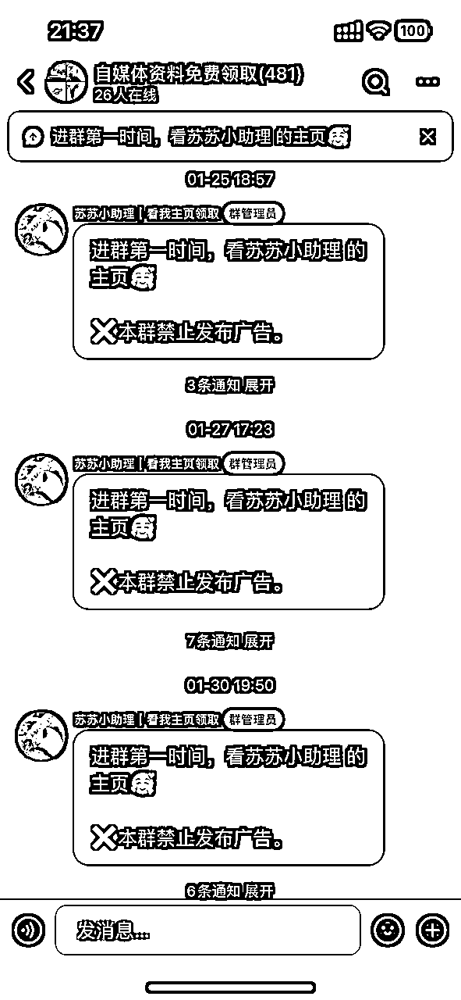

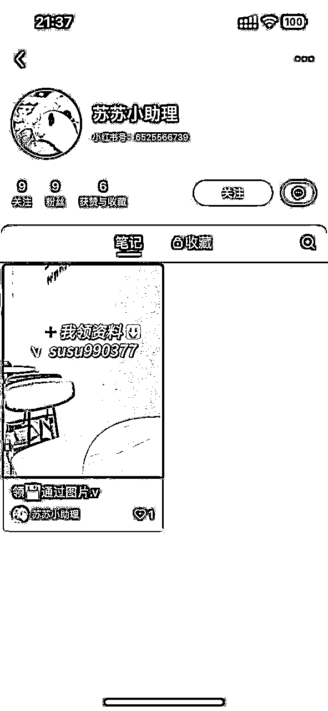

## 3.3发货方式-教你如何光明正大发微信

每次发货都要选无物流发货，然后用户购买后在千帆APP后台发联系方式是可以的，但如果在小红书后台发是不行的（相当于绕过平台私下交易了）右边这个就是在小红书后台发的，根本发不出

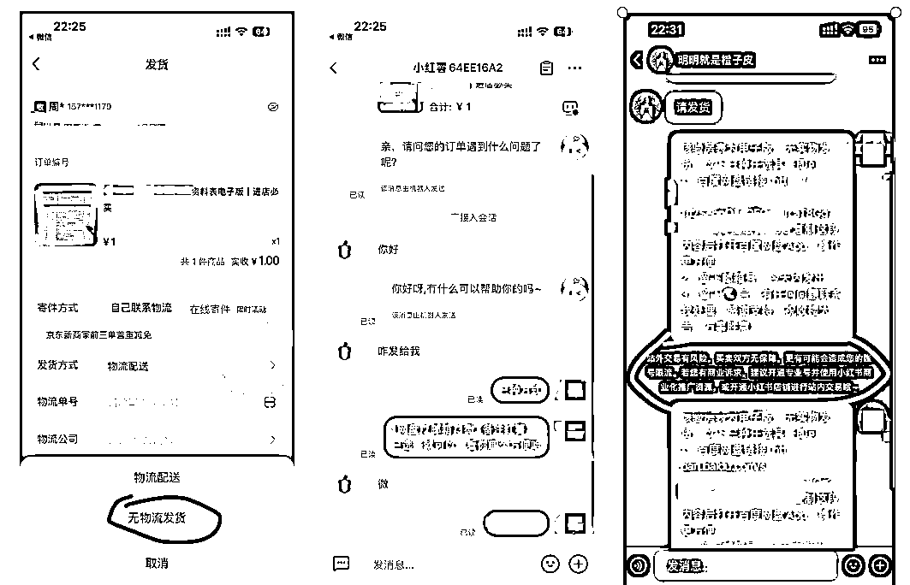

## 3.4有人退货怎么办

对于虚拟资料产品，拍了后，你发货了又申请仅退款的概率挺高的，这时候就不用过多纠结了，刚开始我还去私聊人家什么原因，或者反思自己是不是发货慢了，但其实根本没必要，要知道没有100%不退货的商品，直接给他同意退款就好了

## 3.5小红书新订单没提醒，发货不及时怎么解决？

这是小红书平台很难用的一个地方，就是用户下单了，后台是收不到新订单提醒通知的，只能在千帆后台-订单管理页面查看店铺订单。

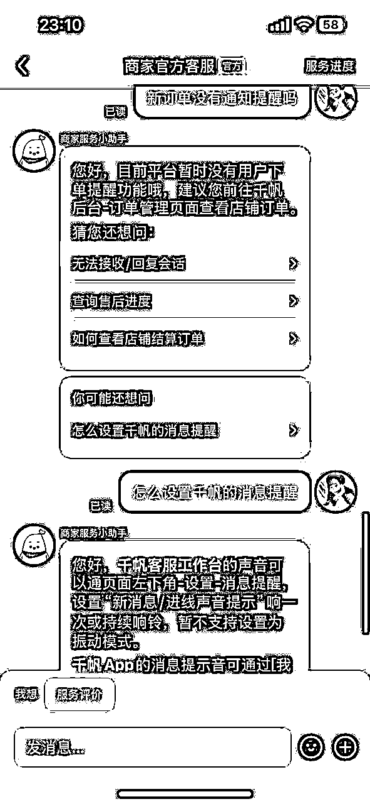

除非用户下单后，还给你发消息，你才能收到消息通知，对于那些默默下单的用户，要如何快速知道并且及时发货呢，难道只能时不时进后台刷新看下有没有新订单吗？

我的解决方法是两个人同时登录后台，我的手机登录了小红书账号，从账号主页里进入店铺，可以随时看到有多少个订单待发货，然后火锅同学下载了千帆APP，在他手机里随时处理发货信息，这样我们一起盯着，可以避免有人忙的时候来不及发货

## 3.6回复率考核-设置语音提醒及时回复

还要补充一个 ，红薯店对回复率要求很高的，不合格会扣钱，所以一定要下载小红书千帆（商家后台），并且设置语音提醒，收到咨询要第一时间回复

主要就是三分钟回复率

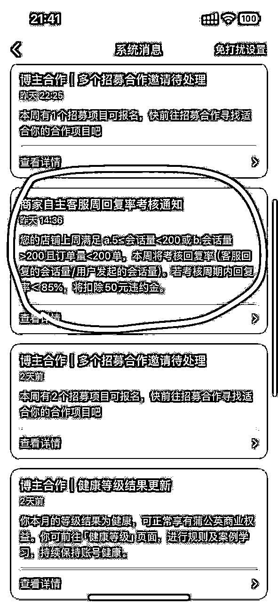

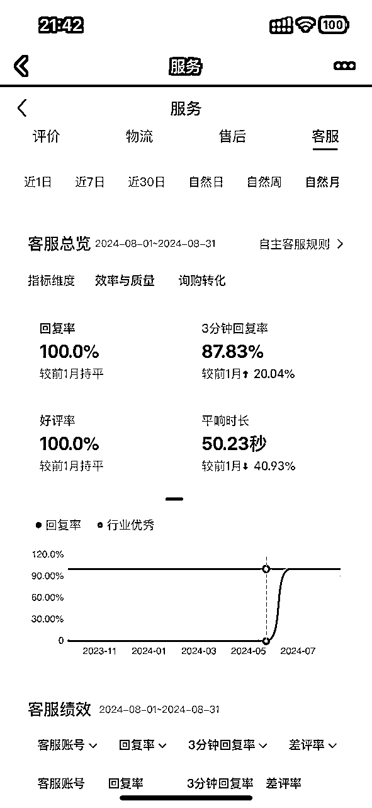

卖电子书单也是可以的 一次整理好后全部打包发

总结来说，我变现得比较晚，如果一开始出爆文，就有意识地上架产品变现，估计销量会比现在多一倍，大家不要小看这一份资料，小红书上真的有很多人都在靠卖这些资源变现几十万，这里最后再多分享一个经典案例：

小红书虚拟资料赛道案例参考，看这个号，做幼儿资料方向，仅仅这一个英语动画片合集39元客单价，卖了5349单，一个单品20w+的收入，发的内容也很简单，但产品针对性很强，发这些简单内容，照样有泼天的流量。

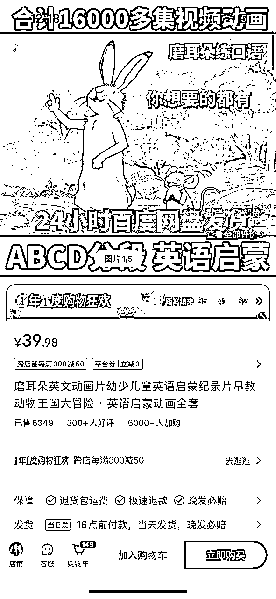

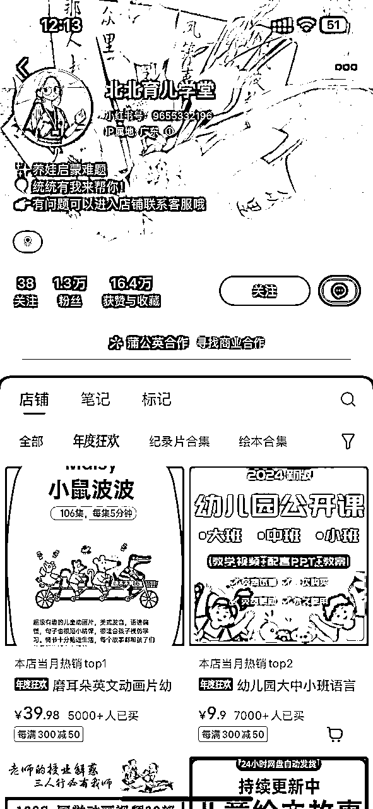

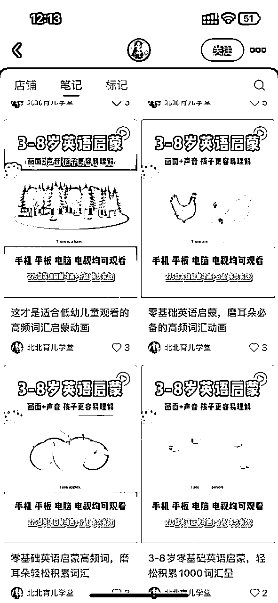

最后想说，作为小红书带货新手，如何利用航海实战，快速跑通变现闭环？我个人觉得最有效的路径就是利用好这四样法宝：航海手册、教练直播、航海好事、群内答疑

1、航海手册：非常全面系统的教学手册，里面有大量实操案例，还分了选修篇和必修篇，可以反复看多次看，不会的地方重点看

2、教练直播：刀姐的直播对我影响很大，能感受到她的巨大能量，而且能把很复杂的知识点说的非常有趣好玩，金句频出，听她直播真的很享受，还能偷学到她的整个教学过程，提升自己的内容力和表达力（强推）

3、航海好事：没出单心态容易崩溃，这时候就去多看好事，看到那么多人在日更打卡，你就会动力满满抓紧跟上

4、群内答疑：我会定期搜#举手 去回看大家的问题和教练答疑，很多我没思考的点都能找到答案

小红书聚集了全网最会花钱的用户，电商带货的发展速度也非常惊人，很幸运跟着生财的小红书航海开启了全新的变现之路，对带货项目有了系统认知，还赚到了小红书的第一桶金。

以上就是我从0-1跑通小红书带货的经验分享，对你有帮助的话，就点个赞吧！