# 小红书AI美女短视频涨粉玩法，千粉号变现150-200，一条龙实操玩法分享给你

> 来源：[https://o0yvn3o31a.feishu.cn/docx/WRISdwWnxokTF4xSfCJcSo3mnmh](https://o0yvn3o31a.feishu.cn/docx/WRISdwWnxokTF4xSfCJcSo3mnmh)

# 大家好，我是黄岛主！

最近一段时间做了涨粉卖号小项目，主要是通过AI以及剪映的搭配做成美女短视频，然后矩阵去小红书上发美女视频的笔记，当笔记热门之后就可以实现快速涨粉，因为很多粉丝喜爱这类美女视频，所以涨粉特别快，那么最后到1000粉丝后找渠道收走就可以变现啦。

给大家看下案例视频：（泳衣的容易违规，但是涨粉快，可以给大家简单看看）

这个属于老项目了，千粉的话渠道可以给你150-200这样。当然，我们还可以同时去做抖音涨粉，因为抖音千粉账号也有很多渠道来收，都是没问题的。咱们很多圈友应该都做过这类的项目哈，也知道里面的变现情况如何！如果还没做过的，可以搞搞看看哈！

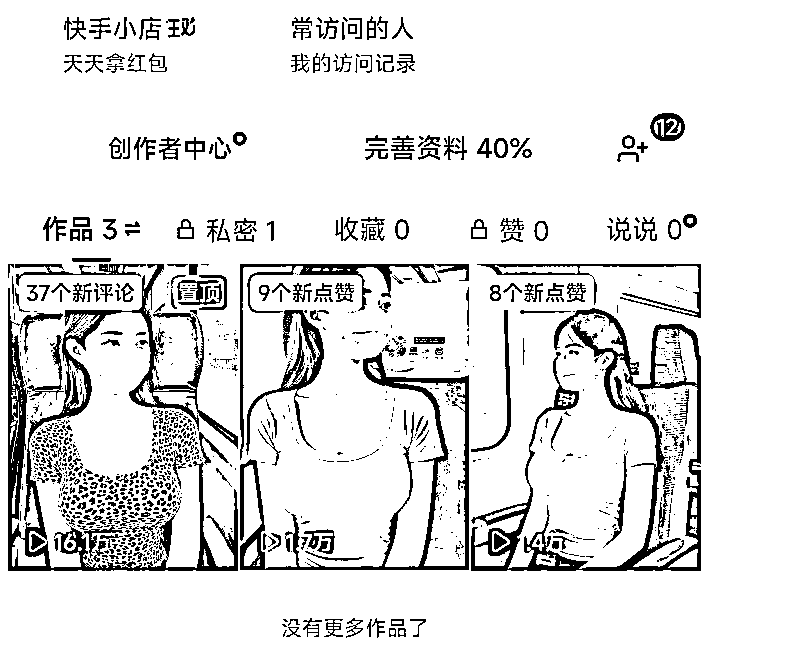

简单说下流程：我们是把生成的美女视频，通过对口型的方式搭配口播经典语录，并创作成原创视频，然后用AI工具，通过文字生成图片，用图片生成视频，用剪辑软件制作成原创视频，发布到小红书、快手等平台涨粉，最终出号变现，大概流程是这样，后面会相信跟大家说明！

这个是放大不同赛道的，也就是AI除了生成美女视频以外，还可以生成其他类型，比如育儿类、治愈类、励志故事类、宠物类，需要生成什么样的视频，在描述栏里面输入相应的提示词，就会生成生成想要的图片，再用图片生成视频，然后实现涨粉或变现。

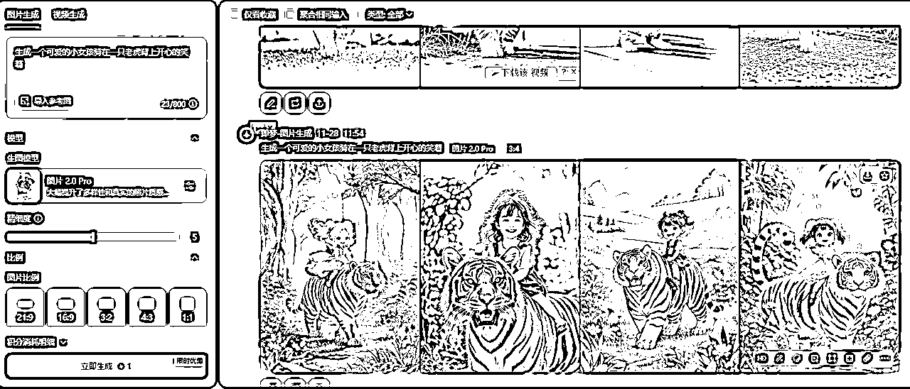

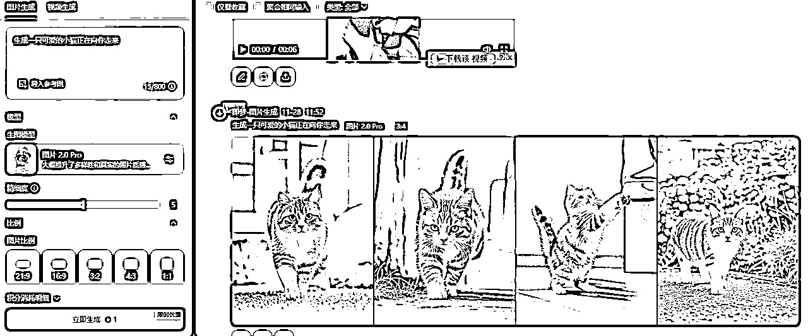

来看下，这是我们做的其中一个美女视频的账号，涨粉数据很不错，爆一个视频就能涨粉上千，整体来说还是不错的！（涨到1000粉就出掉了）

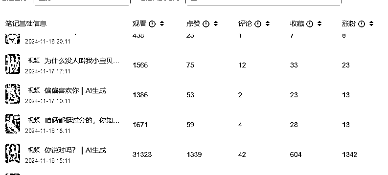

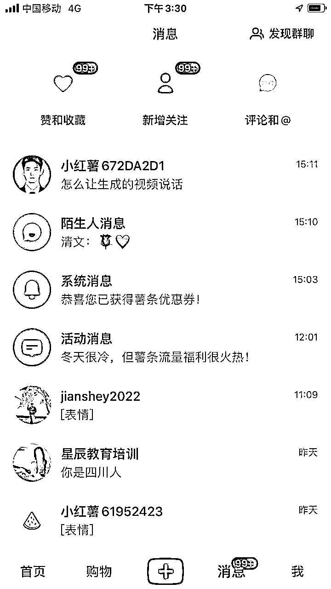

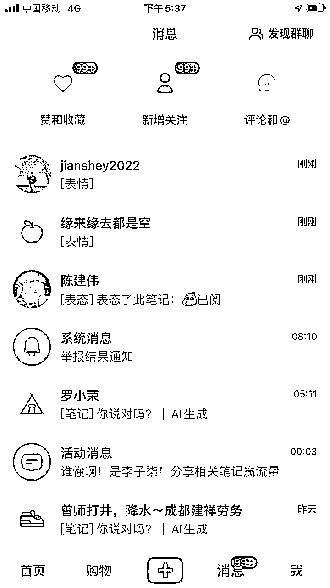

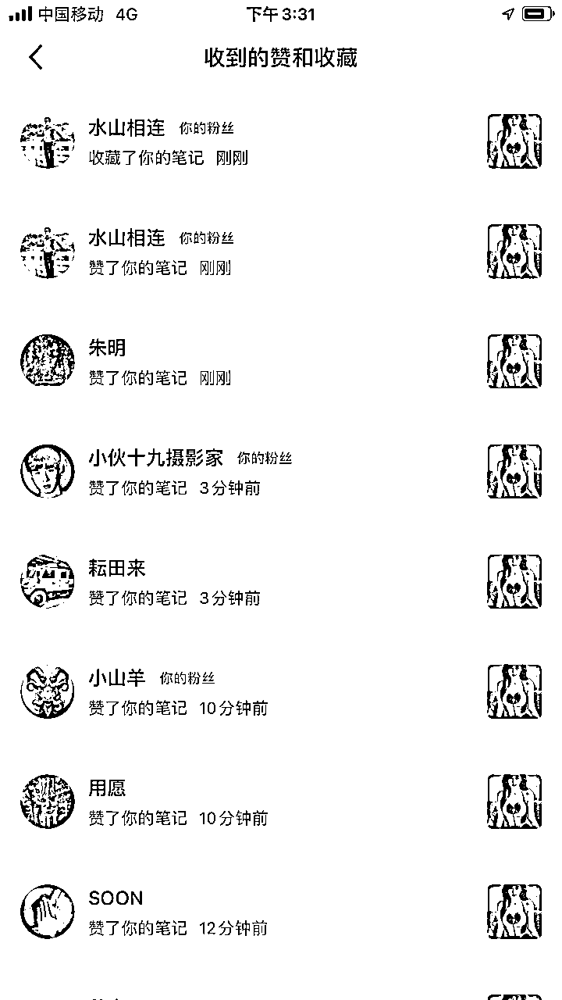

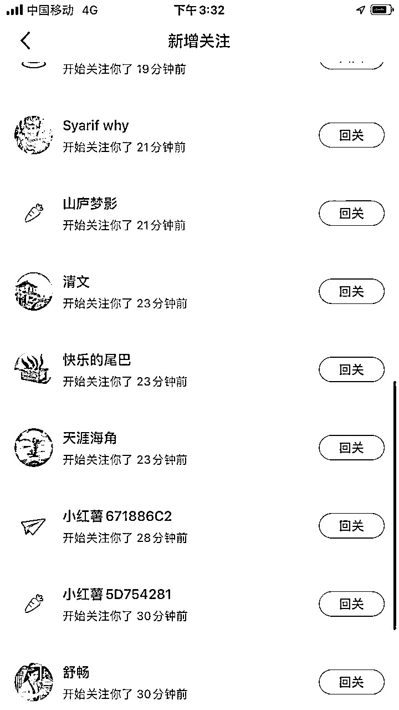

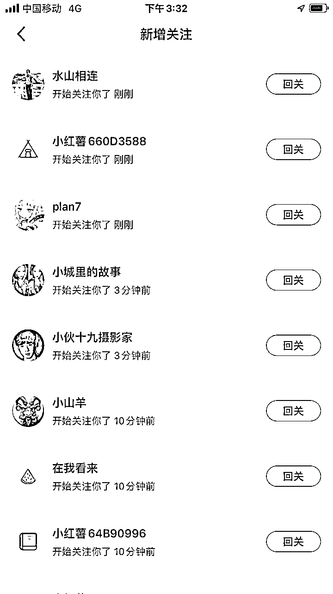

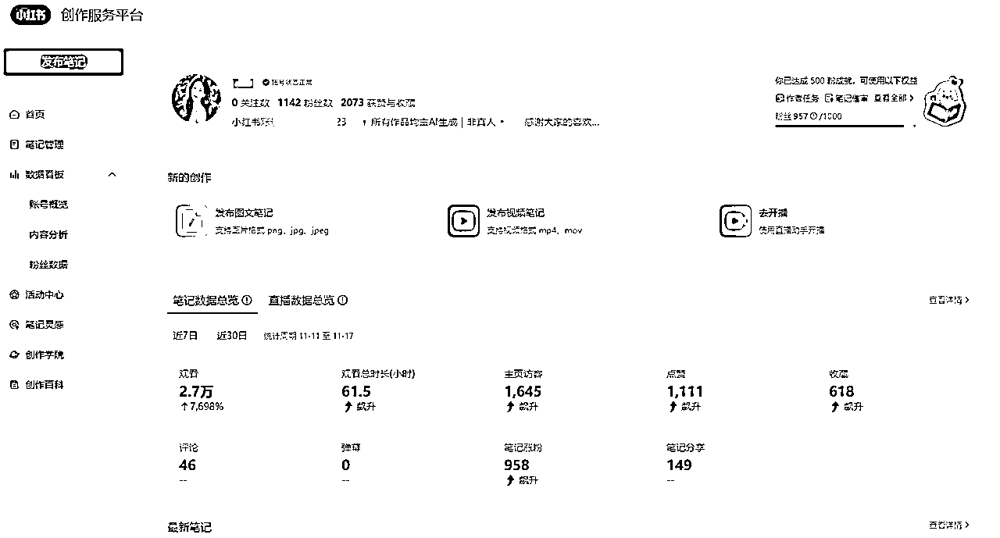

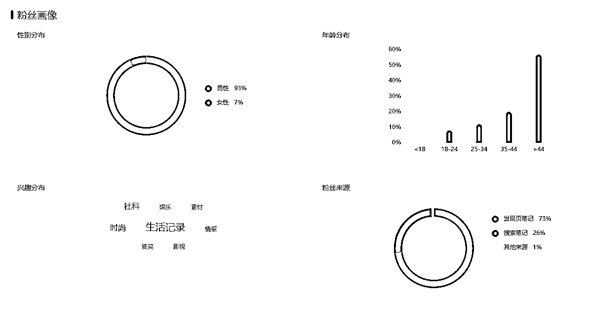

变现图就不给大家看了， 这个相对于严格点，大家知道就可以啦！

我来说下这篇文章写的哪些：账号注册、养号、文案素材、图片生成、视频制作，变现方式等

下面我们详细来看下我们这个项目的复盘：

# 一、账号注册

前期准备：

我详细的来说下：

号卡准备（手机号准备，需要在营业厅实名办理的实体手机卡）

设备准备（一台不卡的电脑、苹果或安卓手机设备）

账号准备（用注册的手机号去注册小红书、抖音、快手或视频号等）

AI工具（免费的，后期不需要付费）

养号方法：

养号环境最好是用手机自带的流量进行操作，实在要用wifi的话，同一个wifi下最多操作3个号。

以小红书为养号案例:当天注册完小红书账号之后，可以随便刷刷小红书里面的视频，不要点赞、关注、评论等。其他平台基本一样的方式方法

第2天打开小红书，搜索”经典语录"相关视频，搜索几次后，小红书会在首页推送相关视频，打开视频去看看同行内容，不要点赞、评论、收藏，上午、中午、晚上分别刷30-60分种，看看别人的昵称、头像、签名等资料是如何填写的，可以直接参考。

第3天重复第二天的操作，可以偶尔点赞、评论、收藏等，但不能在短时间内连续做这些操作，看到点赞比较高的视频，建议把文案收集起来，作为后续自己的文案备用。

第4天重复第三天的操作，下午可以发布一个视频(学完视频制作后再发布)

第5天的操作看下数据如何，后面正常发布即可，可以看前一天发布视频小眼睛有没过100，如果过了说明账号没问题，如果前一天发布的视频小眼睛没有过100，那就继续再多养一、两天号，后面正常发布就可以了。

# 二、操作流程

我这边赠送大家一些操作工具，不需要自己去找了：AI美女视频工具.txt

链接: https://pan.baidu.com/s/1OANY1O_rexugdayyVqqeHA?pwd=8tb5 提取码: 8tb5

下面我们具体看下整个操作流程，你看完就知道怎么做了！

文案寻找：

分为图片文案和视频文案，在小红书看到点赞比较高的文案，可以直接保存图片吧文案提取出来，或者直接在电脑上建个文档，把文本输入进去，正文里面有的可以直接复制出来用。

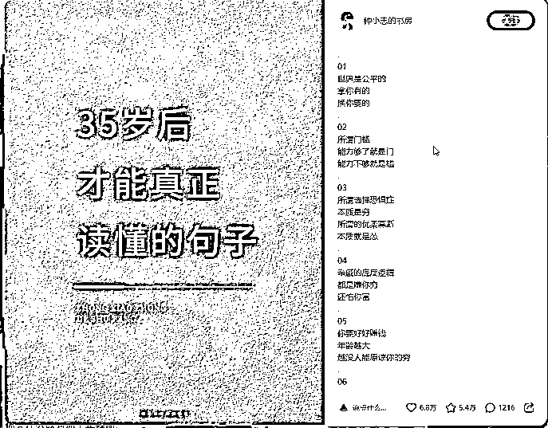

视频文案电脑端的话，直接点右下角复制链接，有文案提取工具，直接微信扫码登录一下就可以，不用付费，电脑上打开配音神器Pro，网址是https://peiyinshenqi.club/，也可以扫码小程序直接用！

然后点击文案提取，把链接粘到这里来，点一下提取文案就可以了，全文复制粘贴到文档里面用。

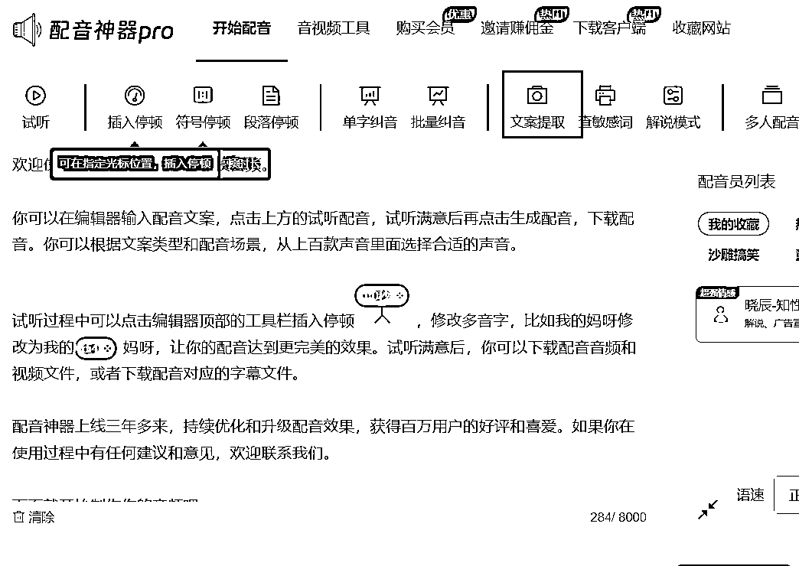

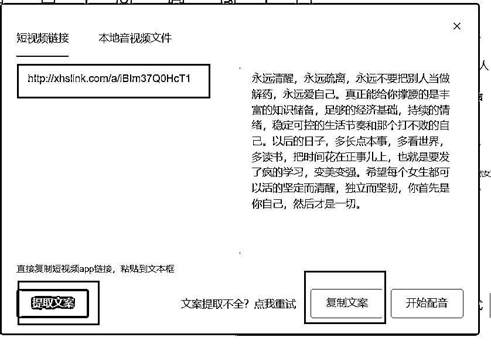

图片生成：

生成图片用即梦AI，打开以后用抖音号或者手机号登录，每天会送免费积分，点图片生成，描述要生成的图片，输入描述词，描述词不是固定的，可以根据自己要生成什么样的图片，输入什么样的描述。

比如什么人物穿着，背景，发型，气质等等，选择模型图片2.0pro，比例9比16，因为要生成竖版的视频，生成图片以后，选择符合需求的图片进行高清处理，高清处理是免费的，会生成四张图片，

如果四张有满意的就用，没有满意的再点生成，会再出来4张，生成一次扣1积分，描述里最好加上图片面对着我们这些关键词，后面生成对口型视频更好操作。

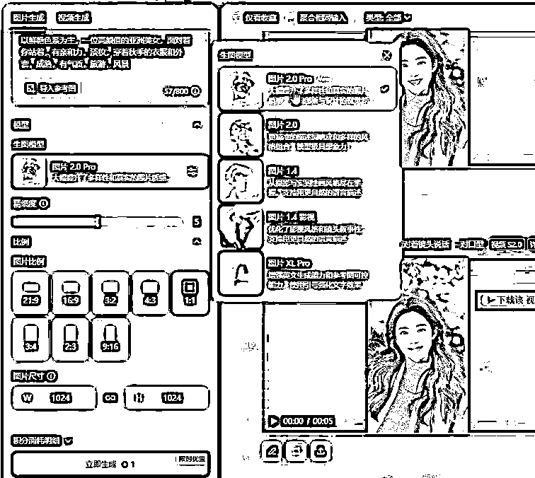

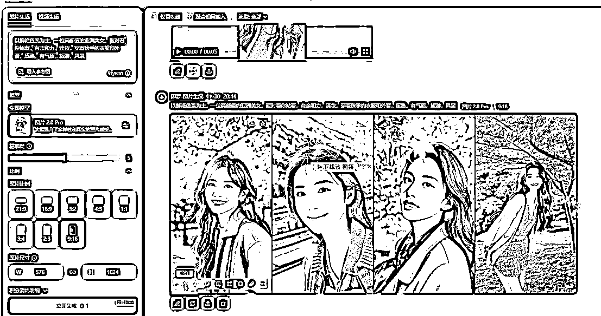

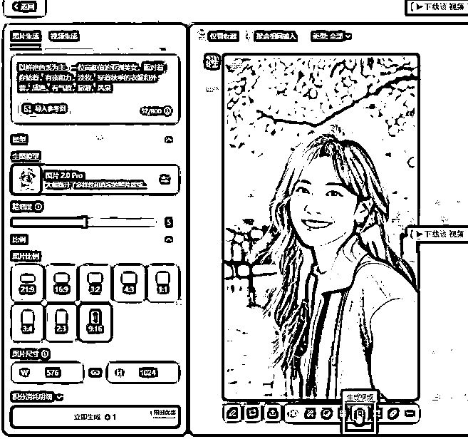

视频生成：

生成图片后会自动跳到图片生成视频，视频可以从里面选择，也可以从电脑本地上传，比如电脑本地上有好看的图片，可以直接上传生成视频，生成视频的描述要注意，生成的视频主要是让他说话，画面不要有太大的动作，看起来不协调，只让它画面保持人物一直对着镜头说话就可以。

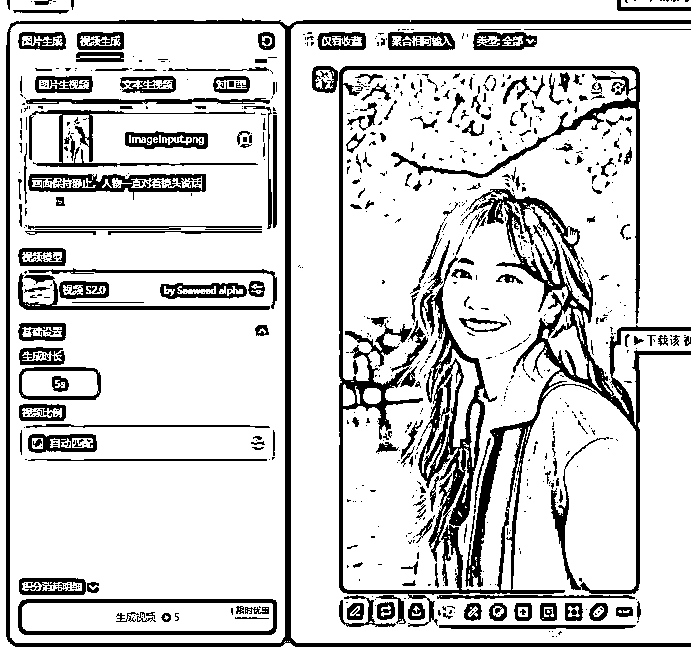

视频模型用S2.0，需要积分少，生成时长5秒，点生成视频，视频可以预览下画面动作，比较符合后面生成对口型的视频要求，如果不输提示词，生成的视频会不和谐，

如果有特殊要求，可以做其他类型的视频，有自己想法，可以在提示词里面输进去，要求画面怎么动，镜头怎么运镜，视频做好右下角有对口型图标，点击对口型，把文案导进来，让他说话。

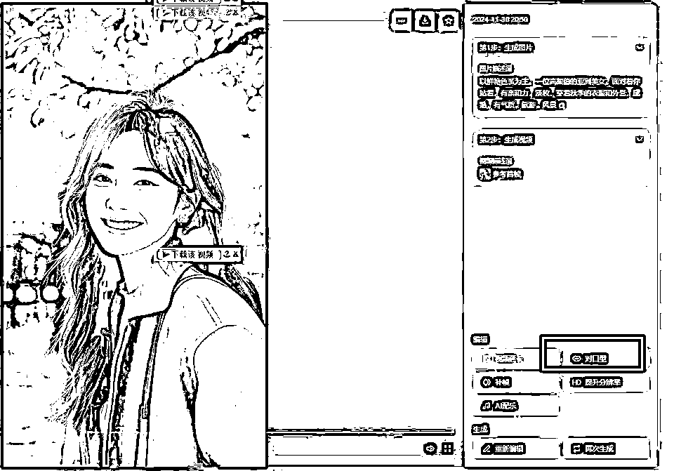

视频生成有几种模式，图片生成视频、文本生成视频、对口型，我们要做的是对口型，视频可以从自己电脑上传，也可以用即梦里面的视频，即梦里面的叫资产，从资产里面选取图片和视频，如果选择图片生成对口音视频，其他地方都不会动，只有嘴巴在动，不自然。

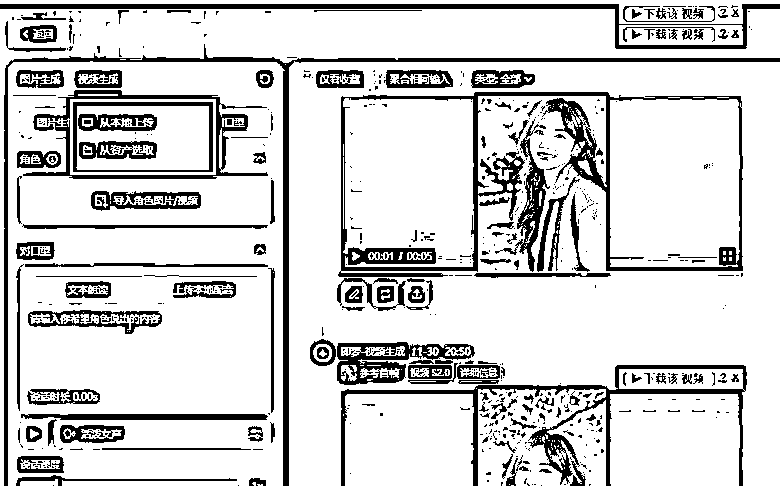

对口型文本朗读，把文案复制进来，因为生成的视频只有5秒钟，所以文案复制进来，只能复制一句话或者两句话，当前说话时长超过5秒钟，建议精简文字，把多的文字删掉，删掉以后一句话3、4秒，

还要选择声音，选择女女生，可以试听一下，生成效果选择标准，点生成视频，再把文案后面的文字再复制进来，再点生成第二个视频。再把最后一句文案复制进来，一个视频需要三个素材，生成好下载到电脑上。

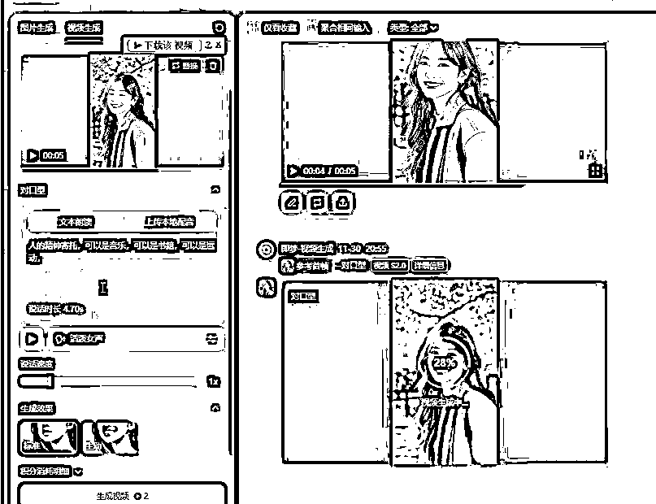

剪辑视频：

用剪映破解版，第一次打开会提示更新，用破解版不要更新，打开后点开始创作，导入下载的三个素材，导入进来以后添加到轨道，全部选中有超清画质处理，效果会比较好一点，图片右下角有水印，还要把水印遮住，缩放调到105%，位置输入-93，刚好下面遮住上面，上面没有留空白。

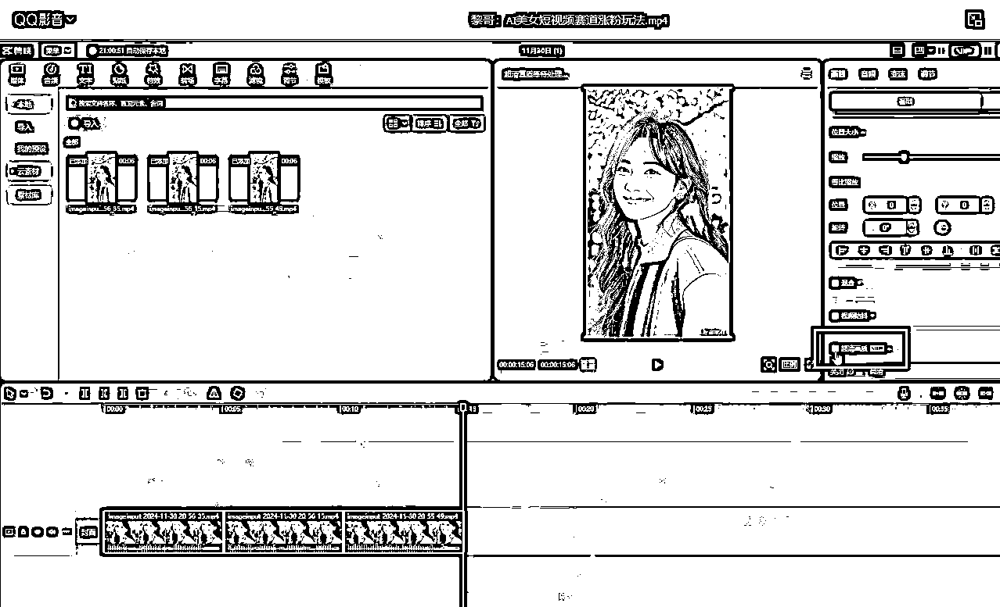

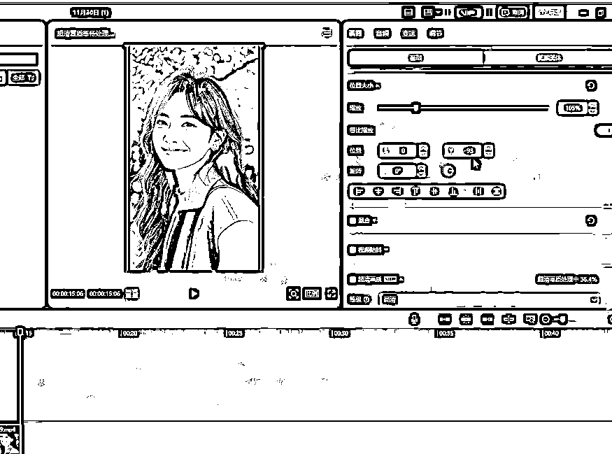

编辑好再调整一下素材，视频的前后顺序一定要调好，每一段视频前后，音频空白太多的地方裁剪掉删除，读出来间隔不要太久，素材中间可以添加转场效果，根据自己的需求选喜欢的转场，叠画就可以，点一下效果，应用到全部。

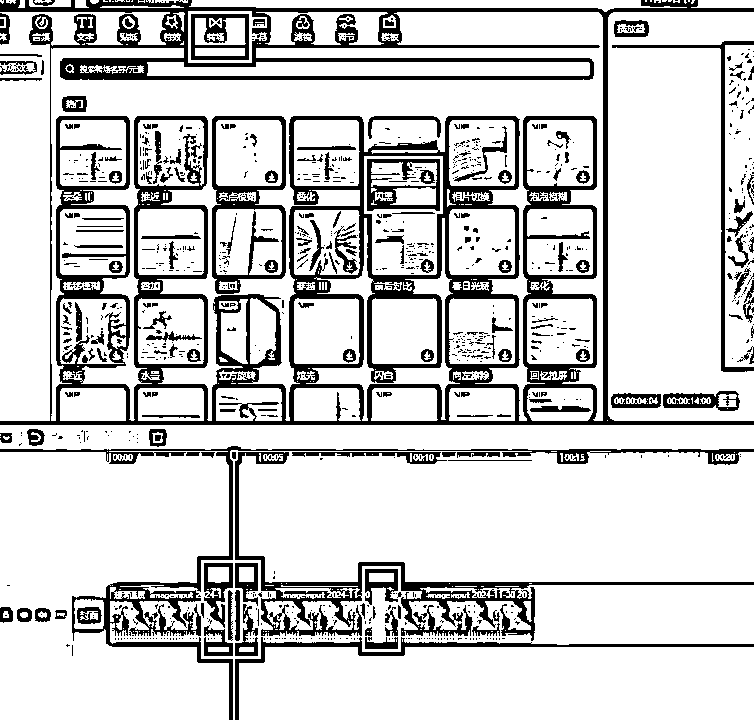

再添加音乐，可以是自己喜欢的音乐，或者适合这一段话的音乐，添加到轨道上后，把它拉到前面，画面后面部分多余的剪掉，点向右裁剪，就直接把后面多余的裁掉了，还要把背景音乐音量调小一点，自己去听一下，找到合适的音量大小，正常-10左右，标题自己写一个，导出视频，分辨率1080P，码率60，导出目录一定要知道在哪里。

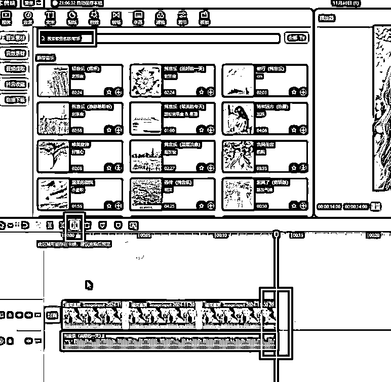

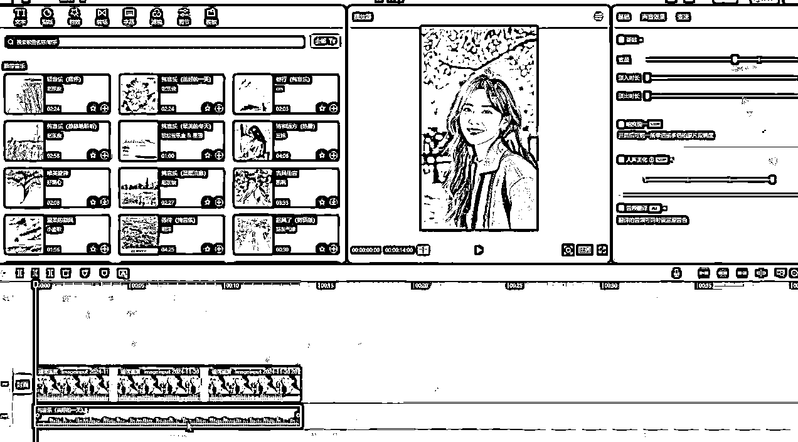

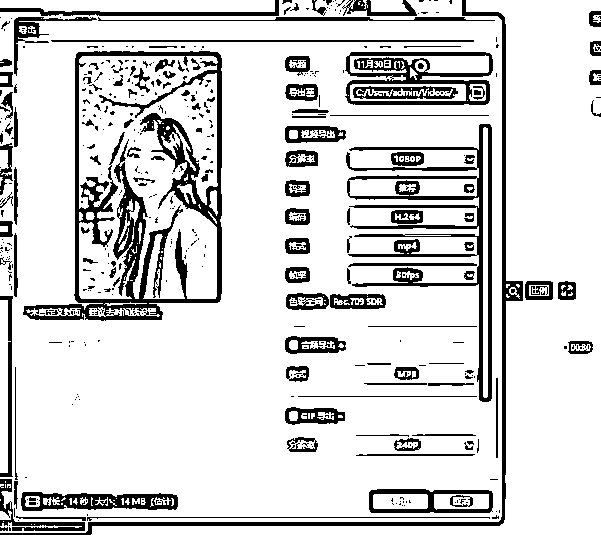

其他细节说下：生成的内容图片比较暴露也容易违规，动作、口部有模仿或者暗示行为的，会判定违规，引起视觉错觉的视频也容易违规，引发不良联想的艺术内容，比如口播内容里面有低俗的话语也会违规。

# 三、发布视频

视频做好，养号完成后，每天发布2-3个视频，也可以根据自己的需求和情况，视频间隔最少2个小时，不能连续发视频，中午发一个，晚上发一个，下午发一个，或者早上发一个，晚上发一个，根据自己的实际情况调整发布视频时间，我们前期多，后期都是每天保持更新1-2个。

大概发布流程：可以电脑发的，我们可以电脑上打开小红书点中间加号，把视频选中，点下一步发布，输入标题、正文、话题，标题和正文直接用文案，标题和正文不要带违规字眼，也可以发到正文里，带一些话题，在发布的时候，要在高级选项里，发文助手有自主声明，选择笔记含AI合成内容，再返回去发布，做的是AI生成的，不选会判定违规。

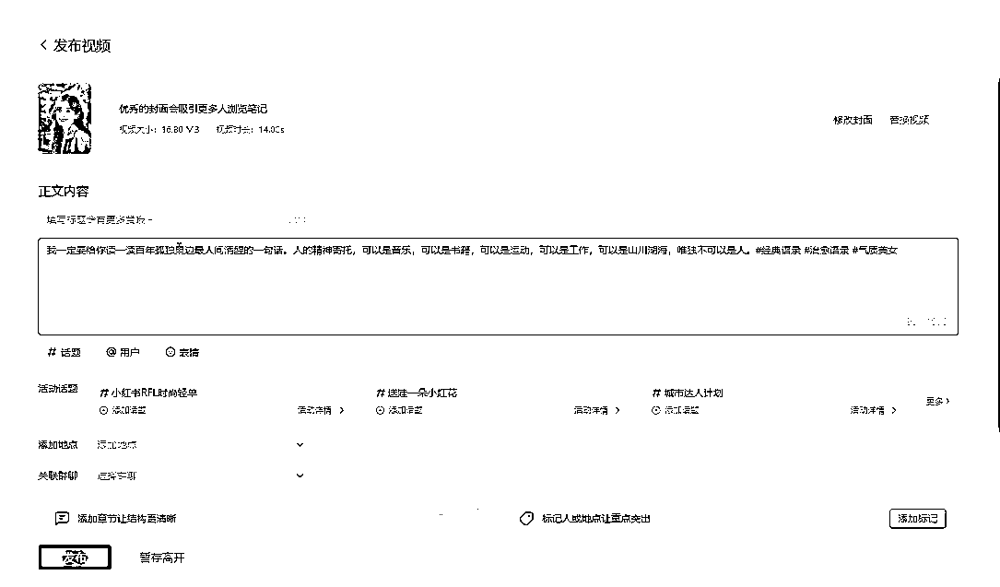

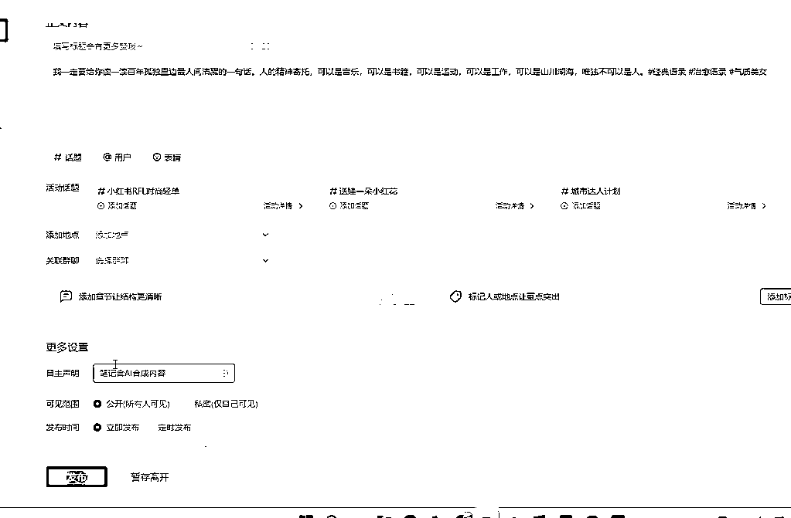

也可以手机端发的，这个大家都可以，针对这类的发布方式都可以热门！

# 四、变现方式

我们主要的变现方法就是涨粉去出号，这个需要找渠道，星球里应该也有收号的渠道，都可以自行对接。当然，除了出号，还有一些变现方法，下面我来说下！

1、小红书涨千粉后开蒲公英接商单

2、引流到男粉到私域做相关变现

3、视频号做创作者计划变现

其他的也可以自己去拓展，差不多变现就简单说下哈！

# 写在最后：

差不多这些吧，按照我写的这个SOP可以完美的去操作这个项目，如果你感兴趣可以看完就去实操，做出效果也可以找我反馈的，好了，有问题可以找我交流就行了！

注意：未经授权，禁止转载到各大平台，需要授权，找黄岛主即可！