# Claude 官方发布《构建高效的智能体指南》，我和 AI 做了进一步解读（讲人话版）

> 来源：[https://aiawaken.feishu.cn/docx/KnIddyK9jowzHdxqW2JcgfSqnoe](https://aiawaken.feishu.cn/docx/KnIddyK9jowzHdxqW2JcgfSqnoe)

hi，我是周知，最近翻看最新的 AI 研究报告，

Anthropic 官方给了个出人意料的答案：

在 AI 代理（Agents）开发中，

"化繁为简"（less is more）才是制胜法则。

过去一年他们发现，

真正成功的 AI 代理往往采用简单、模块化的设计，

而不是复杂的架构。

也许，技术的演进有时就是个悖论。

越是追求复杂，反而越容易迷失：。

全文的本质思考如下：

### 高效的 Agents 方法论


以下，是我和 AI 协作后的进一步解读。

* * *

### 整篇文章的文章逻辑链条

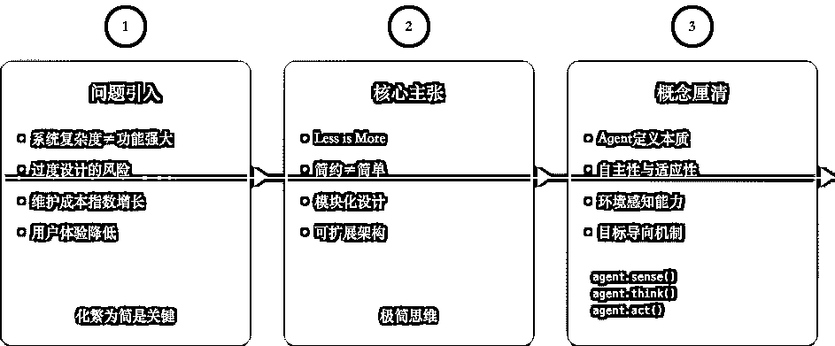


* * *

### 文章解读 ：Agent 概念界定、

#### 原文


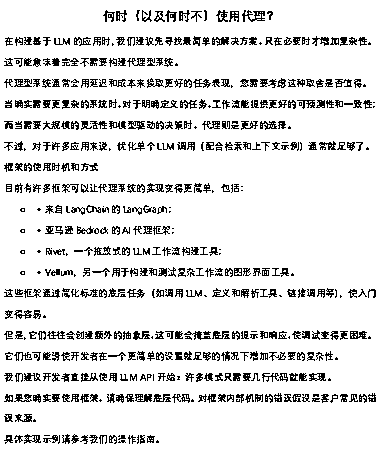

#### 讲人话解读：

##### 场景 1: 做一顿晚餐

复杂方案：

*   买了一整套昂贵的厨具

*   下载了 3 个烹饪 APP

*   准备了 15 种调料

*   设计了 7 道菜

结果：

*   厨房一团乱

*   时间花了 3 小时

*   有些菜煮过头

*   最后都凉了

简单方案：

*   一个平底锅

*   两个主料

*   三种调味料

*   专注做好一道菜

结果：

*   过程轻松

*   30 分钟搞定

*   味道刚好

*   热气腾腾

##### 场景 2: 想象你在玩乐高：

复杂做法：

买个高级乐高机器人套装：

说明书 100 页

零件上千个

改动一处可能全乱

简单做法：

直接用乐高搭个小房子：

几块基础积木

一个简单设计

随时可以修改

这就是 Anthropic 想告诉我们的：

在使用 AI 时，不要把事情搞得太复杂。

##### 什么是 AI 代理？

简单理解：

就像你给 AI 配了个

会自动执行任务的"助手"

比如：

自动回复邮件｜整理文档｜写代码

##### 两种常见类型：

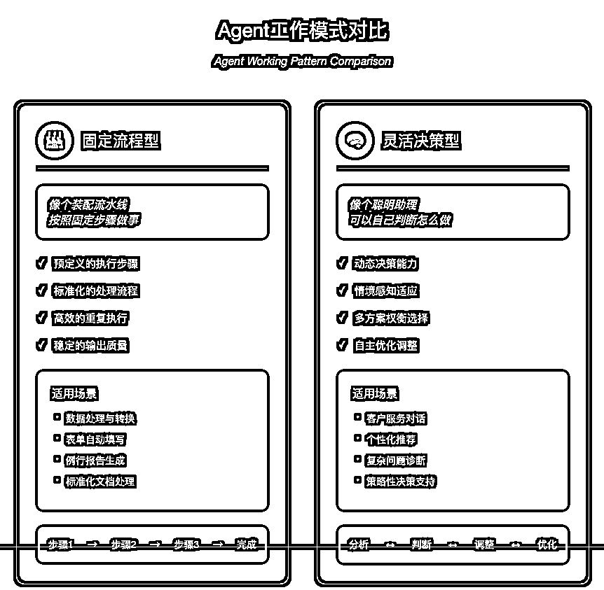


##### 重要建议：

先问问自己：

真的需要那么复杂吗？

很多时候：

一个好的提示词

加上简单的指令

就够用了！

##### 启示

##### 不要被"框架"吓到

```
你不需要懂编程
就像用微信，
不需要懂代码一样
```

##### 从简单开始

```
先学会写好提示词
这是最重要的基础
```

##### 渐进式学习

```
- 先掌握基础对话
- 再学习任务设计
- 最后尝试流程优化
```

##### 实用建议

##### 对我们 AI 爱好者：

```
1\. 专注提示词质量
   而不是复杂技术

2\. 理解基础概念
   不用钻研技术细节

3\. 多做实际尝试
   从实践中学习
```

##### 举个例子：

```
不要这样：
"我要用最新的Agent框架
来实现自动化办公"

而是这样：
"让我先把基础对话学好，
写出清晰的提示词，
一步步提升效果"
```

##### 最重要的是：

```
简单 > 复杂
实用 > 完美
循序渐进 > 一步到位
```

对你来说：

不用纠结技术细节

专注于：

如何提出好问题

如何设计好对话

如何得到好结果

##### 这就是 Anthropic 想说的：

不是技术越复杂越好

而是越简单越实用

* * *

### 文章解读：构建模块

#### 原文：增强型 LLM


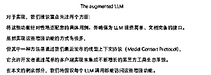


#### 讲人话解读：

想象你在培养一个超级助手：

##### 基础能力


```
就像人类需要：
- 眼睛(看资料)
- 大脑(思考)
- 手(操作工具)
- 记忆(记住重要信息)

AI助手也需要：
- 检索能力(查资料)
- 思考能力(分析判断)
- 工具使用(调用功能)
- 记忆系统(保存信息)
```

##### 工作方式

就像训练一个聪明的实习生：

```
1\. 主动学习
   - 知道该查什么
   - 会用对的工具
   - 记住重要内容

2\. 独立判断
   - 不用事事请示
   - 懂得灵活处理
   - 记录关键信息
```

##### 关键设计

对你这样的普通用户来说：

```
不用关心技术细节
只需要知道：

1\. 目的很简单
   让AI更懂你的需求

2\. 方法很直接
   给AI合适的工具

3\. 效果很实用
   AI能自主完成任务
```

##### 具体例子

普通的 AI：

```
你："帮我查下最近的AI新闻"
AI："抱歉，我不能上网查询"
```

增强型 AI：

```
你："帮我查下最近的AI新闻"
AI：
- 自动搜索新闻
- 总结重要内容
- 保存关键信息
- 使用合适工具
```

##### 实用角度

对你来说最重要的是：

```
1\. 清楚表达需求
   告诉AI你要什么

2\. 了解AI能力
   知道它能做什么

3\. 合理安排任务
   不要期待太复杂
```

##### 简单理解

就像给 AI 装备：

```
基础版：
只会简单对话

增强版：
- 会查资料
- 会用工具
- 会记笔记
- 会主动思考
```

作为 AI 爱好者使用建议：

先熟悉基础功能，了解 AI 能做什么。

从小任务开始，逐步增加难度。

多做实际测试，积累使用经验。

##### 核心要点：

不是让 AI 变得多复杂

而是让它更懂你的需求

更好地解决问题

* * *

### 工作流类型：提示链｜路由机制｜并行处理｜编排执行｜评估优化

#### 原文：

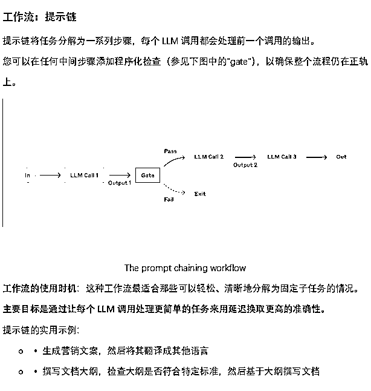


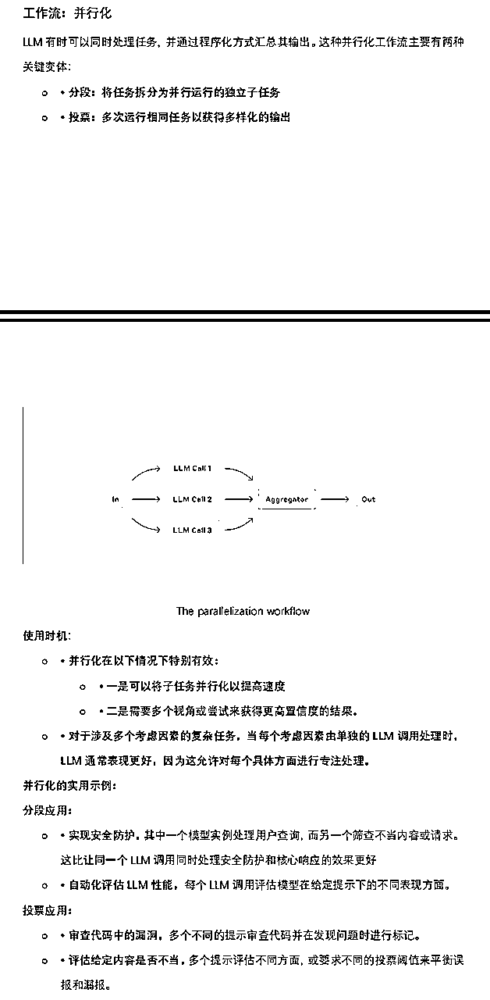


#### 讲人话解读：

想象你在管理一个智能办公室，有不同类型的 AI 助手：

##### 提示链

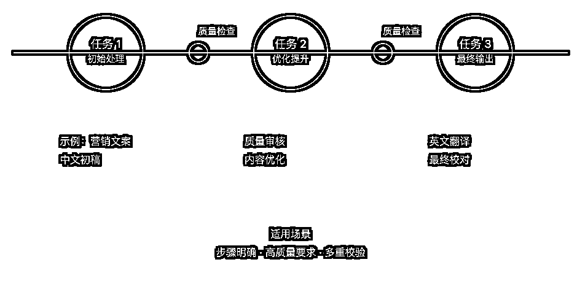

就像接力跑：

```
例子：写营销文案
第一棒：写中文初稿
第二棒：检查质量
第三棒：翻译成英文
```

适用场景：

```
- 任务步骤明确
- 每步都要检查
- 需要高准确度
```

##### 路由分配


像个智能前台：

```
例子：客服系统
- 退款问题→财务AI
- 技术问题→技术AI
- 普通咨询→基础AI
```

适用场景：

```
- 问题类型多样
- 需要专业处理
- 要控制成本
```

##### 并行工作


像开会讨论：

```
例子：代码审查
- AI-1检查安全性
- AI-2检查效率
- AI-3检查规范
最后汇总意见
```

适用场景：

```
- 需要多角度看问题
- 时间很紧急
- 要求高准确度
```

##### 编排者-执行者

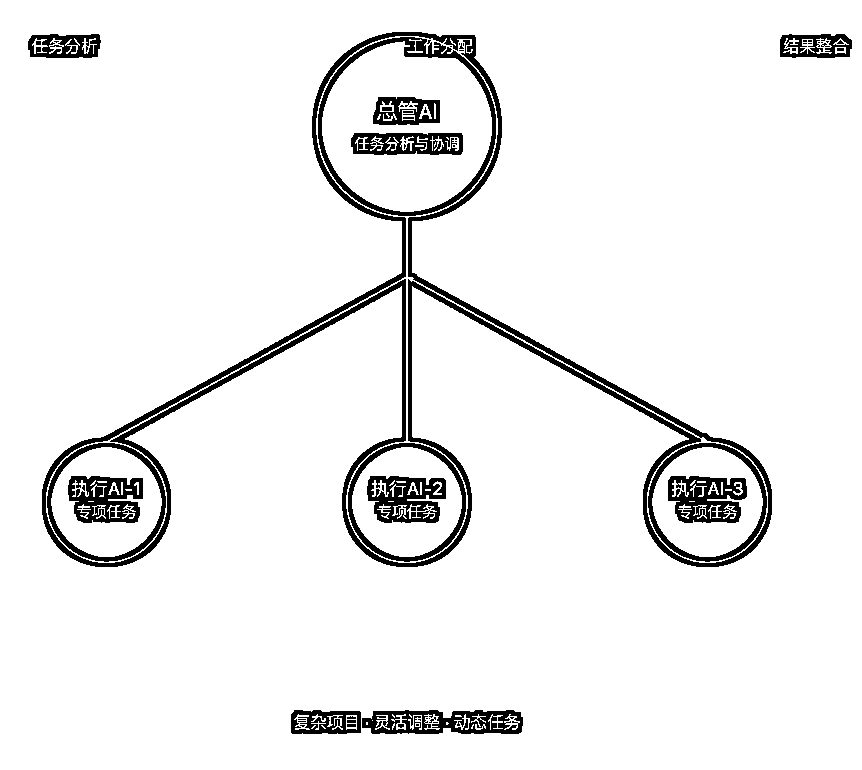

像项目经理带团队：

```
例子：编程项目
总管AI：
- 分析整体任务
- 分配具体工作
- 整合所有结果

执行AI：
- 专注单个任务
- 报告完成情况
```

适用场景：

```
- 复杂项目
- 需要灵活调整
- 任务不固定
```

##### 评估者-优化者

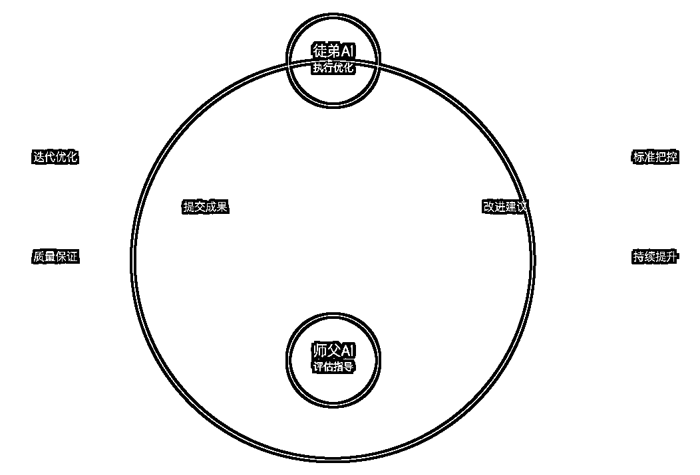

像师徒配合：

```
例子：写文章
徒弟AI：写初稿
师父AI：提供修改建议
徒弟AI：改进完善
循环直到满意
```

适用场景：

```
- 需要高质量
- 可以反复优化
- 有明确标准
```

##### 建议选择合适工作流：

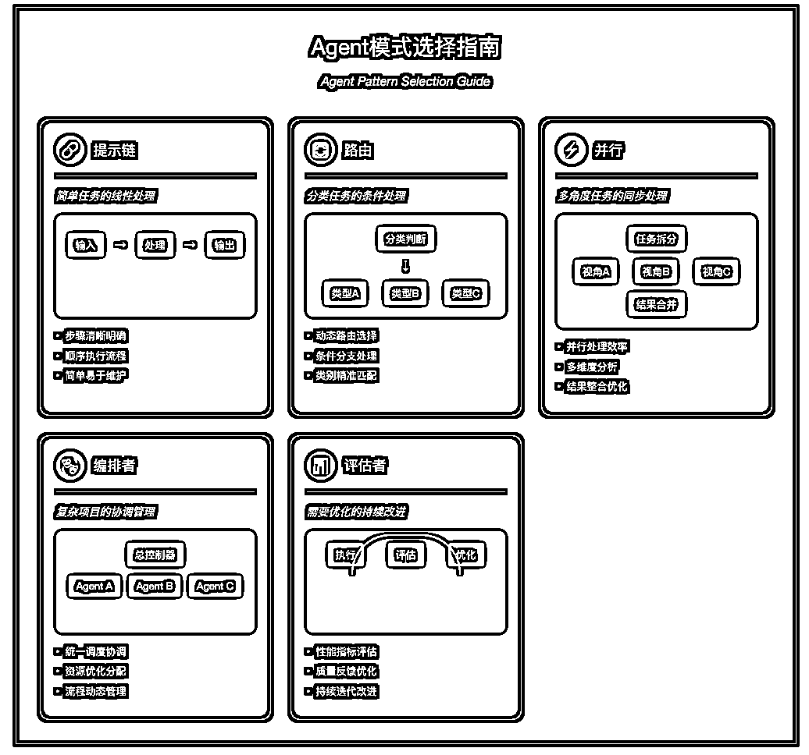

```
简单任务：用提示链
分类任务：用路由
多角度任务：用并行
复杂项目：用编排者
需要优化：用评估者
```

##### 实践建议：

```
- 从简单开始
- 逐步加复杂度
- 多测试效果
```

##### 注意事项：

```
- 不是越复杂越好
- 要符合实际需求
- 考虑成本效益
```

### 实用参考

基础应用：

```
写文章：提示链
客服：路由分配
代码审查：并行
大项目：编排者
内容优化：评估者
```

* * *

### 代理系统：运行机制｜流程控制｜反馈优化

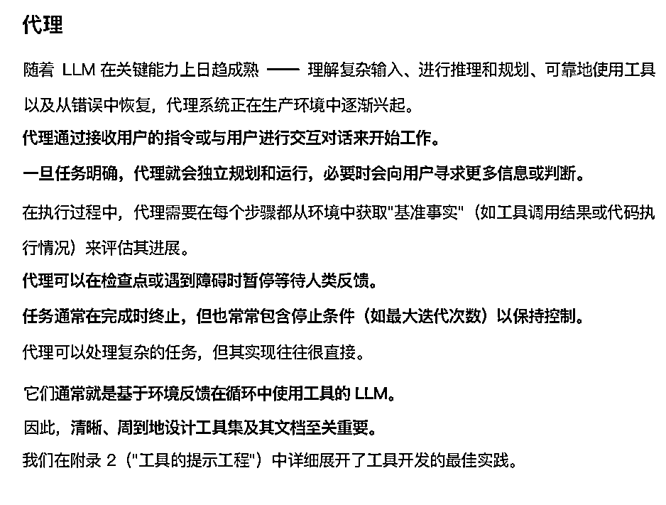


### 讲人话解读：

想象一个超级智能助理

##### 工作方式

```
就像一个独立员工：
1\. 接收任务
2\. 自主规划
3\. 独立执行
4\. 遇到问题会请示
5\. 完成后汇报
```

##### 类比理解


```
普通AI：
像个听命令的机器人
按固定步骤执行

代理AI：
像个聪明的助手
- 会思考怎么做
- 会使用工具
- 会请教问题
- 会调整方案
```

##### 具体例子


编程助手：

```
任务：修改代码bug

工作过程：
1\. 分析问题
2\. 查看相关文件
3\. 设计解决方案
4\. 测试修改效果
5\. 如有问题就调整
```

##### 关键特点

自主性

```
- 自己做决定
- 自己找工具
- 自己解决问题
```

智能反馈

```
- 知道什么时候该问人
- 了解自己能力边界
- 会总结经验教训
```

安全控制

```
- 有最大执行次数
- 重要决定需确认
- 可随时暂停
```

##### 适用场景

最适合：

```
- 开放性问题
- 步骤不固定
- 需要灵活应对
```

不适合：

```
- 高风险任务
- 零容错要求
- 严格时间限制
```

##### 使用建议

对 AI 爱好者：

```
1\. 先在安全环境测试
   比如：模拟环境

2\. 从小任务开始
   比如：简单文件整理

3\. 渐进式增加难度
   比如：逐步加复杂任务
```

##### 注意事项

成本考虑

```
- 运行时间长
- 资源消耗大
- 需要权衡收益
```

错误处理

```
- 可能累积错误
- 需要及时纠正
- 要有备用方案
```

##### 实用参考

简单任务：

```
- 文件整理
- 信息汇总
- 基础数据分析
```

复杂任务：

```
- 代码开发
- 项目管理
- 研究分析
```

* * *

最重要的是记住：

Less is More

不是所有任务，都需要用代理系统。

有时候简单的 AI，反而更合适。

有时候简单的方案，反而是最优解。

就像插座不需要智能， 电灯不必联网。

过度设计， 反而背离了初心。

简单，也是一种智慧。

实用，才是使用初心。