# 从零到一：我的新兴考试备考之旅

> 来源：[https://larkcommunity.feishu.cn/docx/Ra02dGqwQokSuSx7BFWcYbCanOd](https://larkcommunity.feishu.cn/docx/Ra02dGqwQokSuSx7BFWcYbCanOd)

今年首次遇到数据资产入表会计这个全新的考试，备考过程可谓是一波三折，但也充满挑战与收获。在此对自己整个备考策略及过程进行复盘，希望能给同样面临无参考资料备考的同学一些启发。

## 一、面临的困难

### 资料极度匮乏

这是此次考试备考过程中最棘手的问题。由于是首次考试，市面上几乎找不到有效的相关参考资料，也没有可用的题库。甚至编教材的老师也没有练习题，仅仅只有两本纸质教材，而且还无法获取电子档。

### 教材数字化难题

官方教材无法直接获取电子版，外包扫描成本高昂，两本教材共900页左右，扫描一页就需要0.3元，而且扫描后的清晰度不一定能满足后续处理需求。

### 信息搜索无果

为了获取更多关于这个新兴考试的信息，起初尝试通过多个平台（小红书、抖音、知乎、闲鱼、B站、公众号、微博等）搜寻相关考试信息，但遗憾的是，均未找到有用的信息。这让我意识到，必须依靠自己通过手动整理和工具辅助来搭建复习资料。

## 二、解决方案

### 教材数字化：方便后续整理和学习

为了克服资料获取不便的问题，我选择自己动手将纸质教材转化为电子资料。先用手机对教材进行拍照，然后用夸克浏览器强大的图片转文档功能，将拍好的照片合成为WORD文档，按照章节对内容进行整理。在这个过程中，每一页都要仔细调整拍摄角度、光线等因素，以确保能被准确识别，虽然这个工作虽然比较繁琐，但最终成功地将所有教材内容转化为方便处理的WORD格式。

相对于全能扫描王，夸克浏览器合并的文档格式相当规范，基本上不用另外调整格式了，涉及到的表格也是原原本本按照书本上扫描出来了

### 知识框架梳理：构建完整的知识体系

将合成的WORD文档按照章节进行整理，这样可以建立起清晰的知识体系框架。再利用腾讯元宝，把每个章节的内容转化为思维导图。思维导图不仅有助于从宏观上把握知识结构，还能加深对不同知识点之间联系的理解。

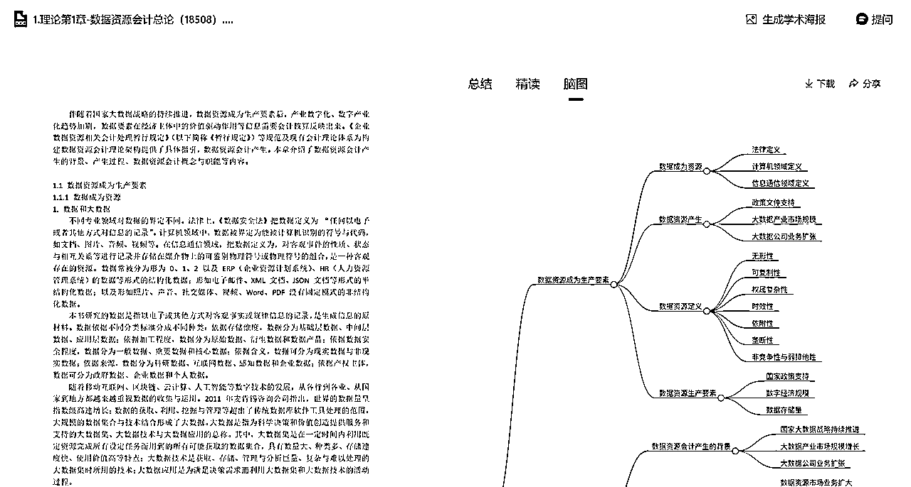

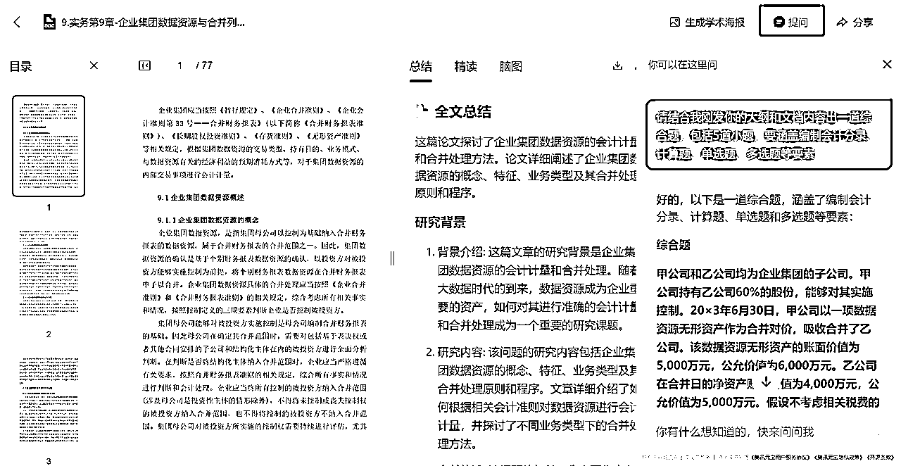

腾讯元宝不仅可以回答我关于章节内容的疑问，还能基于我发送的大纲和文档来出综合题，甚至计算题，这极大地丰富了我的备考内容。

### 题库生成：通过模拟练习掌握考试重点

考试前一周，我发现金数据AI出题这个工具。在闲鱼上购买了标准版一天会员后，将每个章节的WORD文档导入其中，生成不同类型的题库，包括单选题、多选题、判断题、填空题和简答题。

但这个版本存在一定的限制，每天只有20次使用次数，每次只能上传20000字以内的文档，并且一次最多只能生成100道题目，还不支持将题库内容导出，只有试卷可以导出。鉴于这样的限制，我只能将每个章节的内容拆分开来分别上传。而且生成试卷时也存在问题，只能同时选取两个题库。

尽管如此，我还是利用这个工具尽可能地根据每个章节的知识点生成了单选题、多选题、判断题等类型的练习题和试卷，通过大量的刷题来巩固所学内容。通过这种方式，我成功构建了自己的专属题库，并能够根据需求轻松生成试卷和练习题。

*   创建题库

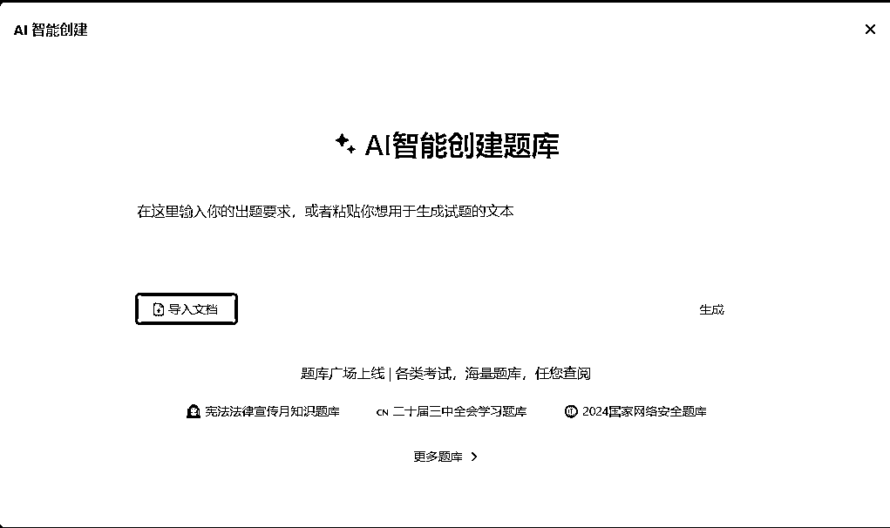

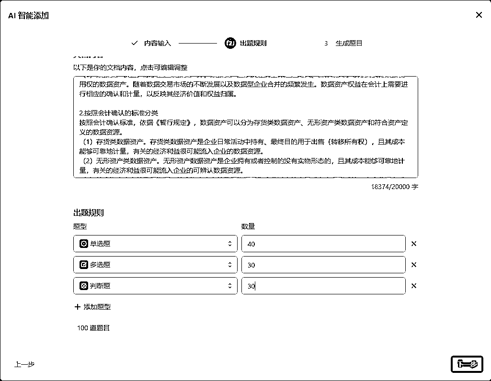

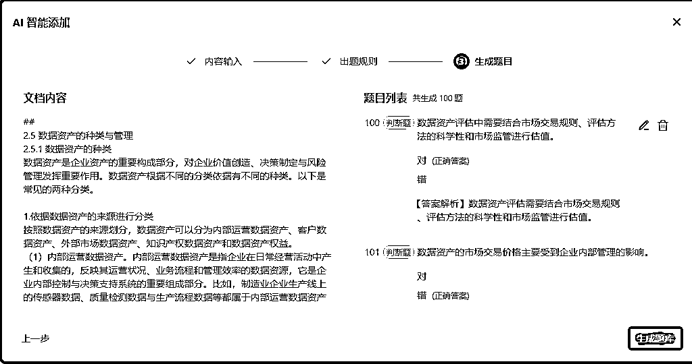

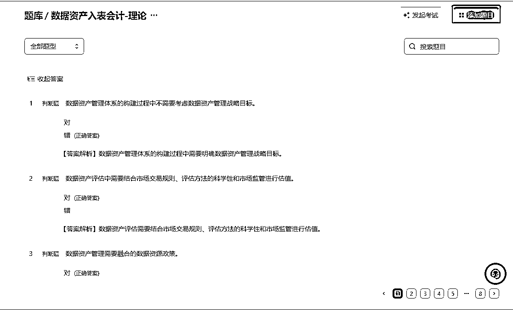

*   创建练习

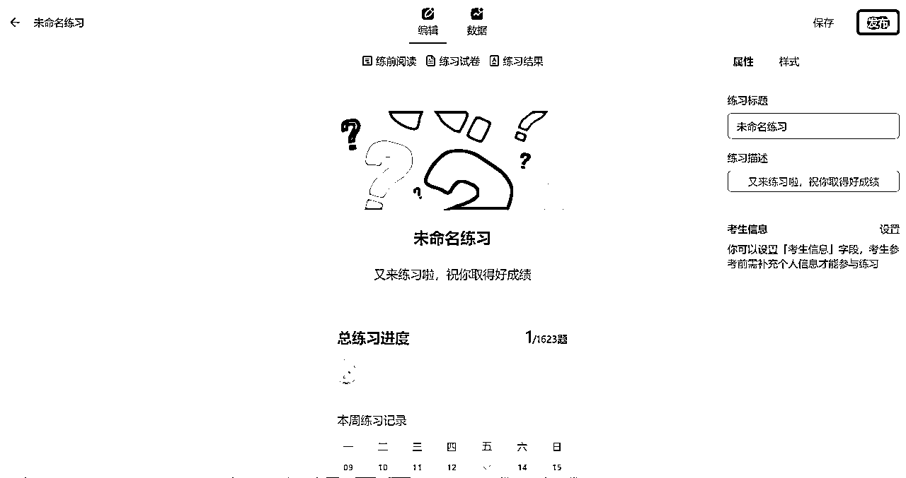

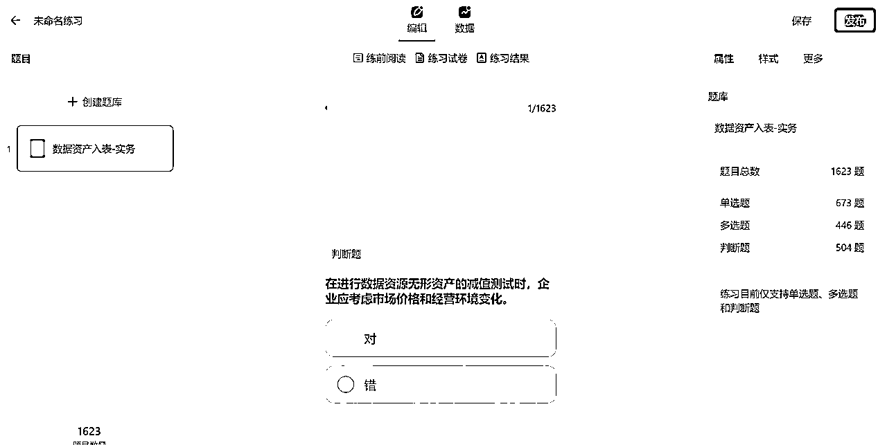

*   创建考试

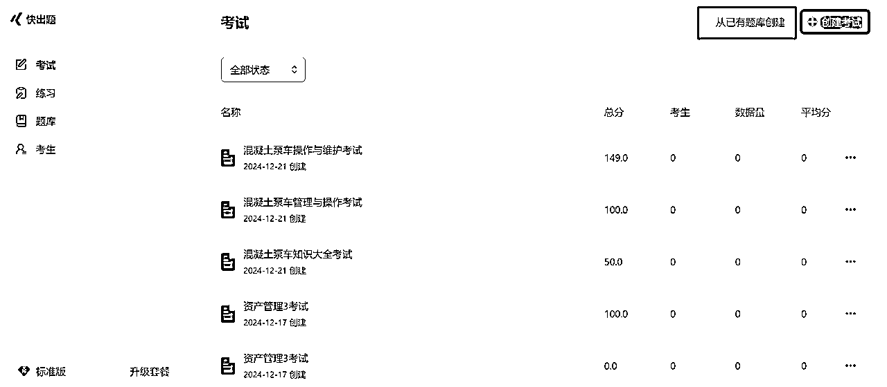

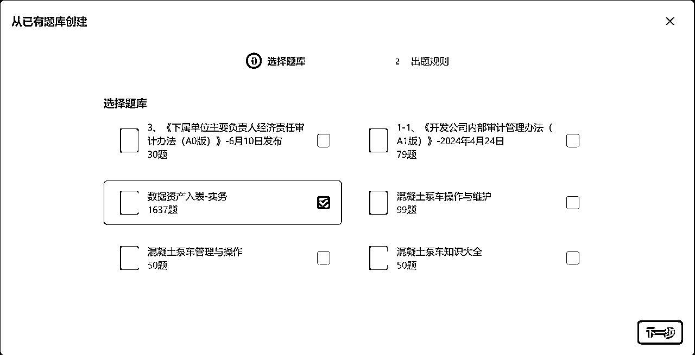

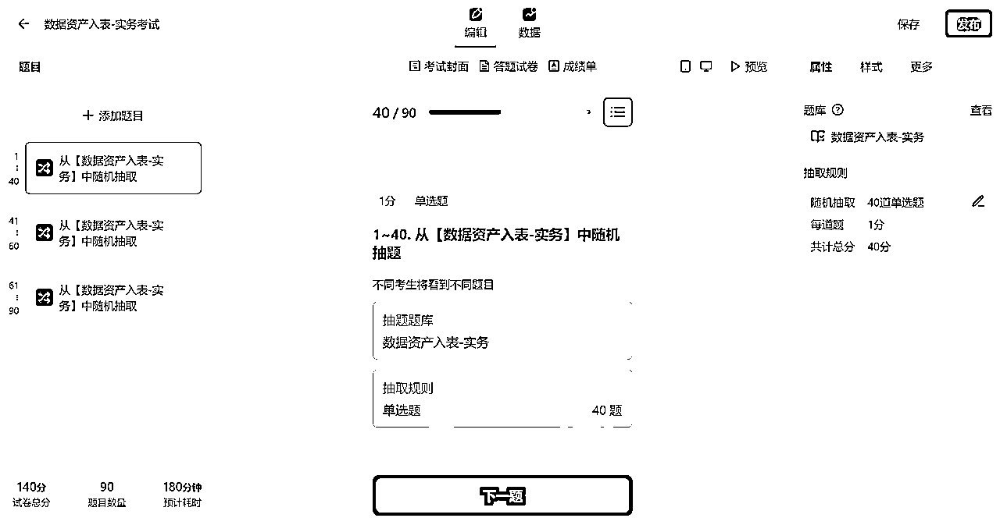

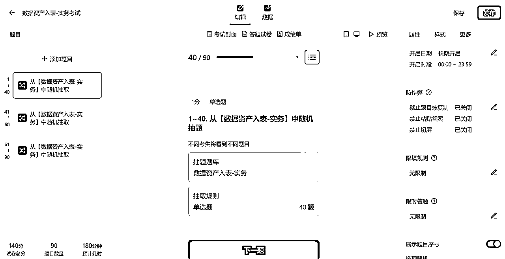

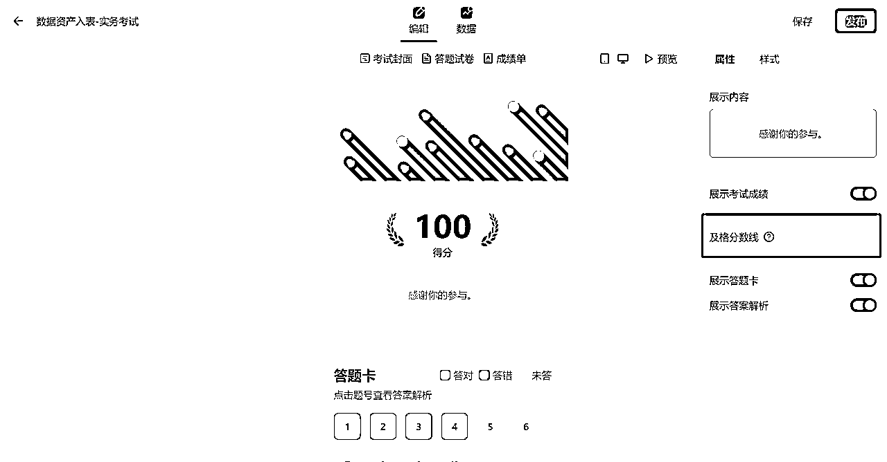

*   考试链接效果

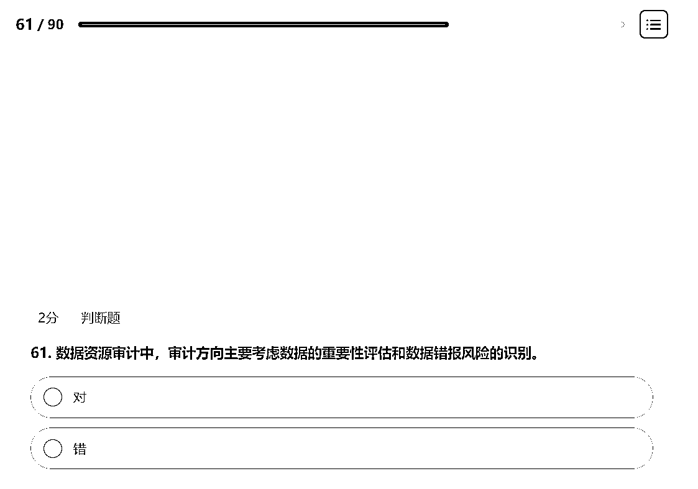

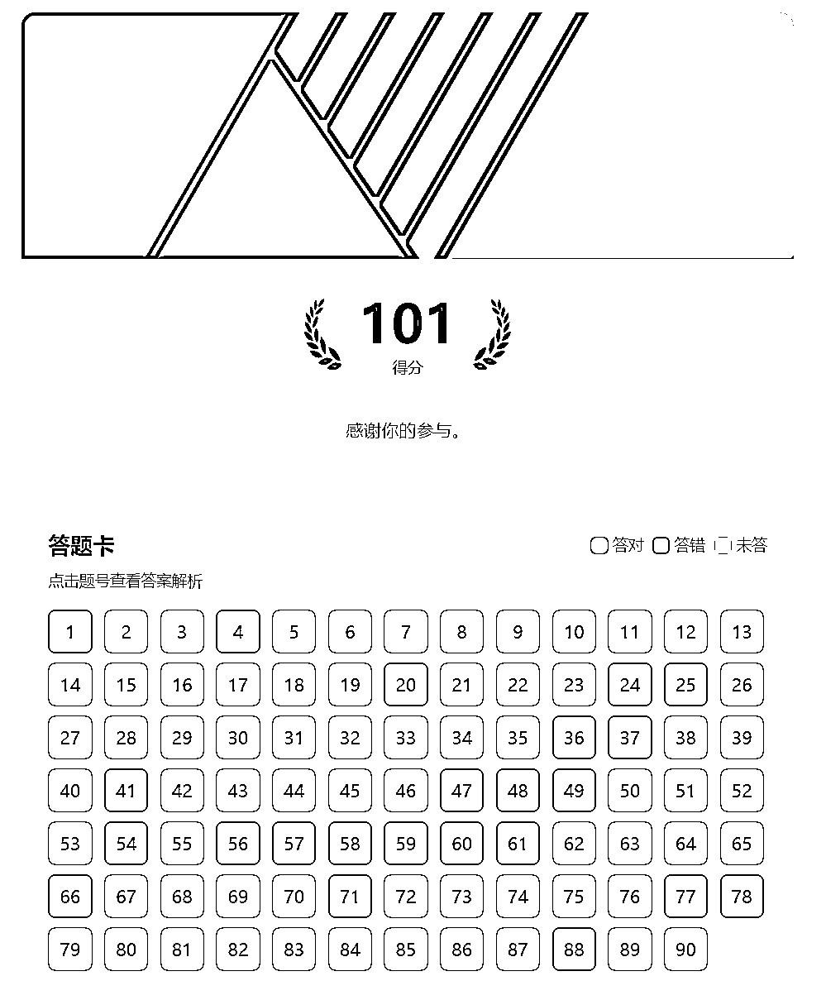

*   考试成绩的查看

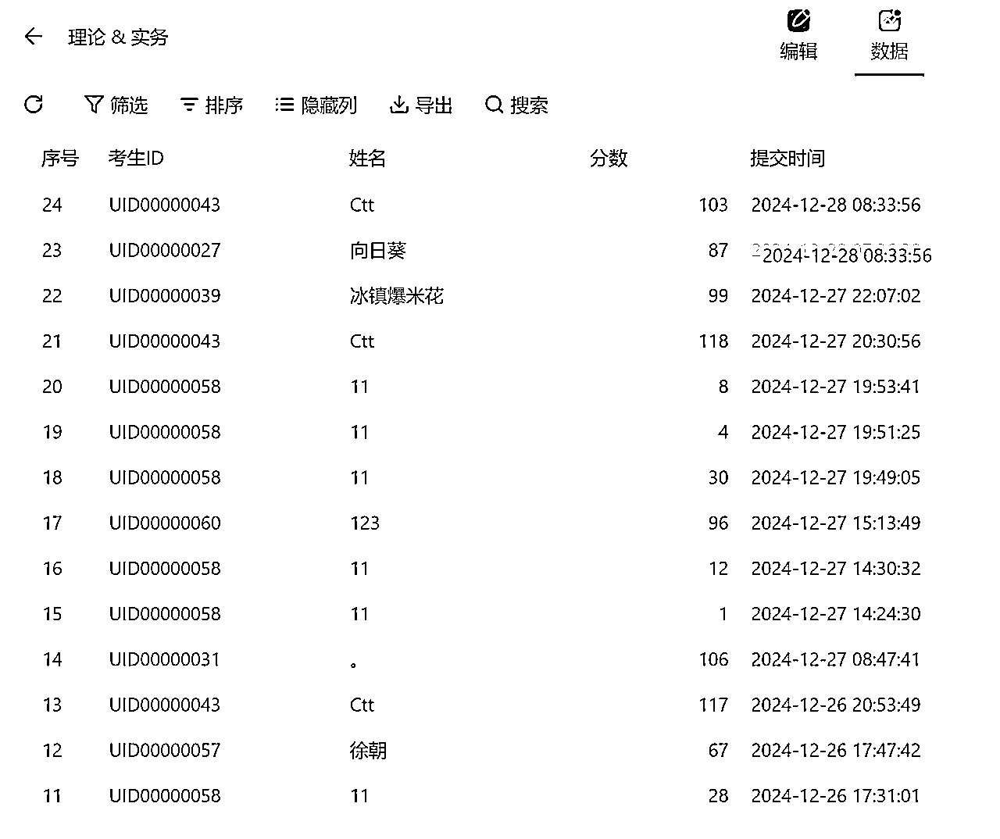

最终利用金数据题库AI，生成了将近3000道题目。然而，题库中存在一些重复题目，且经过抽样校对答案，发现少部分答案存在问题，预估整体答案的准确率为90%左右。

## 三、备考心得

### 工具的高效利用

*   夸克浏览器的图片转文字功能显著提升了教材数字化效率。

*   腾讯元宝的思维导图功能清晰直观，方便梳理知识点。

*   金数据题库虽然有一些限制，但仍然是备考的核心工具之一，帮助快速生成题目和试卷。

### 资源匮乏时的自救能力

*   面对全新考试的资源困境，通过多平台信息搜集和AI工具组合解决了核心难题。

*   知识点数字化+思维导图+题库练习的模式帮助我在短时间内形成系统化复习体系。

### 不足与局限性

*   题库重复题目和部分答案错误的问题需要注意，还需要一定的人工校对。

*   初期资料整理耗时较长，教材整理效率有待提高

*   如果能更早地布局资料收集和整理工作，就可能有更多的时间用于深入复习和拓展知识面。

*   虽然在工具使用上进行了一些创新尝试，但对于这些工具的某些高级功能挖掘还不够，可能在一定程度上影响了备考效率的进一步提升。

## 四、总结

整个备考过程让我意识到，面对陌生考试，依赖资源不如依赖自己。通过工具和方法的组合，我从无到有搭建了完整的复习体系，这不仅让我对考试更有信心，也让我对如何高效学习有了更深刻的体会。希望这个复盘能够为大家在应对类似缺乏资料备考的情况下提供一些参考经验和思路。

资源匮乏不可怕，方法和工具是最强大的武器！