# Youtube shorts 生财12月航海跑通YPP复盘回顾及一点点的经验分享

> 来源：[https://n1ajno67u7.feishu.cn/docx/XWzYdBrzzoIgmOxgKxjcG6w4nOb](https://n1ajno67u7.feishu.cn/docx/XWzYdBrzzoIgmOxgKxjcG6w4nOb)

## 结果

先附上一张图，这是目前的收获

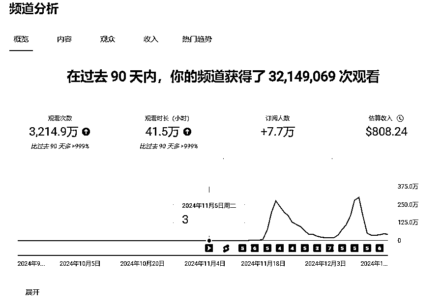

## 起因

摸鱼的时候摸到了亦仁的超级标2#，当时就先码着关注了一下。经常干的事（收藏夹吃灰），后来又刷到钱塘鲤和老马的帖子，一下子就心动了，决定动起来吧。拿着钱塘鲤大神的表格试着去看搜了搜。一下子就发现，这就是宝藏啊，大有可为。

从上图可见，我在11月3号的时候开始想思路，最先是走萌宠路线的。从数据分析来讲，这一块的流量是海量。于是动手找素材。从萌宠里面找细分，最终圈定了小猫做饭这一块。因为这个流量挺猛。但是我忘了一件事情，要实现这个内容的难度。毕竟在这之前没有一丁点的技术积累。在摸索攀爬中，磕磕绊绊的做出了第一个视频。

提示词：

1，一只可爱的小猫，在一个阳光明亮的厨房和面粉（挑选几张比较相近的图片备用）

2，一只可爱的小猫，在一个阳光明亮的厨房打蛋液（这个生出来的图形态太多了。需要多生几次）

3，一只可爱的小猫，在一个阳光明亮的厨房里，烘烤蛋糕。（这个也会有很多种形态）

4，一只可爱的小猫，在一个阳光明亮的厨房桌上品尝蛋糕，露出陶醉的表情

用这几组提示词，很青涩，很稚嫩。大家有经验的可以多一些提示词来修饰纠偏

然后就是用可灵的首尾帧做，当时也没用提示词，智能生成。

成品如下（动作辐度比较大。失真比较多）

是的~就是这么粗糙。

然后上传后，就变成长视频了。

一边坚持，一边摸索摸索，最终我的第一个视频，虽然不完美，但它诞生了！这是我万万没想到的。

第一个视频，虽然起步艰难，但它是我航海之旅的重要里程碑。即使在技术积累为零的情况下，只要有决心，有行动

最后我想可能是尺寸的问题，事后证明我想对了~~~

## 如何开始

实战使用的这个号是12年注册的老号，用我的谷歌账号绑定的。以前也曾经发过一些盗版视频判过违规，这次为了实战验证，又启用了

所以在账号准备这块就直接老号装新酒了，一上线就让我开了高级模式。

这里高级模式有三个开通方式。等到了符合条件后，官方会发通知，提醒你开通。没有开通高级模式的对YPP的申请会有影响，在老马的课程里有讲过

一个是视频加ID模式

一个是身份证加ID

一个是历史记录

这个很多同学还没有到这一档，所以没有遇到过这个问题。

#### 完成视频验证

1.  在移动设备上前往 https://myaccount.google.com/video-verification/submit。在系统提示您登录时，使用您希望开通这些功能的账号登录。

1.  按照提示完成一个动作，比如追视屏幕上的某个点、转头等

1.  当您的验证视频上传成功后，等待审核。审核流程通常需要 24 小时。在获得批准后，您会收到一封电子邮件。

#### 完成身份证件验证

1.在移动设备上前往 https://myaccount.google.com/identity-document/submit。在系统提示您登录时，使用您希望开通这些功能的账号登录。

2.按照提示拍摄身份证件的照片。有效身份证件包括护照或驾照。

3.点按提交。等待审核。审核流程通常需要 24 小时。在获得批准后，您会收到一封电子邮件。

#### 积累和维持频道历史记录

频道历史记录包含以下内容：

*   频道活动（例如视频上传、直播和观众互动）

*   与您的 Google 账号相关的个人数据：

*   账号的创建时间和创建方式

*   账号的使用频率

*   您连接到 Google 服务的方式

其他账号的包装和优化，在老马和其他教练帖子以及航海手册讲得很详细了，就不赘述了

视频上传后，并没有迎来我做梦的流量海啸， 库库的往上涨，事实上刚好相反，根本就没有动静。我开始琢磨，是不是因为是长视频，毕竟流量都在shorts那呢，事后证明我又想对了。

我没有放弃，既然有了新想法了，我决定换个方向，那就试试呗。于是就开始着手做9：16的。最初还想继续我的小猫做饭系列，技术拿捏不行，几次尝试都以失败告终，当时就差点扔了这破心思，想要放弃

还好亦仁的信用评级是S级的，给了我信心。我告诉自己，亦仁不会错，那肯定是我的方法有问题。

于是我开始想办法去提升技能：我的第一个学习站点就是B站，不得不说B站真是个大宝库。里面应有尽有。后面在航海的时候，我看很多人问教练技术问题，其实B站早就有了解决方案和答案。

毕竟教练的精力是有限的，我们得学会自己找答案。这不仅是对教练的尊重，也是对自己能力的提升。我开始在B站上挖掘、学习、实践，慢慢地，我开始看到了进步。

然而B站却没有学会小猫做饭，后来刷可灵素材库，发现他们那个熊猫做得栩栩如生。于是直接文生视频，一只熊猫在咖啡馆喝咖啡

猜猜怎么着，我的视频刚一上线，就像扔进了大海的小石子，激起了三百多的涟漪——流量！我一看这势头，心里那个美啊，这事儿有谱！

我立马来了劲，决定再接再厉，给视频里P上个人，让那场景更真实点儿。这样一来观众看了，不得跟真的似的，沉浸感直线上升。

说到AI，因为看了老马的帖子，心里有点打鼓。AI这一块，貌似在YouTube合作伙伴计划（YPP）那儿不太好混。 转念一想，咱们得让内容更真实，更接地气，这样观众才能感受到那份真诚。

这个视频给我带来了三百多的流量，我一看这行啊。再接再厉，P了个人上去，让场景更加真实。因为看老马的帖子，AI这一块不太好过YPP。那就让场景更真实化

我决定在真实性上下功夫，视频从最初的简单剪辑，到现在的精心制作，每一步都是为了让观众感受到那份来自屏幕另一端的真实和热情。

这类视频做起来很简单，不需要复杂的提示词，不需要首尾帧。直接文生图就可以了。然后拼接起来

上面这个我用的提示词是

1.在一个咖啡馆，一进门看到一个熊猫的背影在喝咖啡（这里一直生不出背影，后来就索性用了侧面这张）

2.一只熊猫在咖啡馆喝咖啡

3.喝完咖啡再跟对方做一个干杯的镜头，要求对方是一个年轻的白人女性（这里可以写：与一个年轻的白人女性干杯）

然后把这三个文生视频拼接起来，省时省力的再配上音乐和旁白

这个视频带来了五百多的流量，于是信心就上来了。有了信心，我就开始大胆尝试新的内容，弹吉他的视频，萨克斯风的短片，什么都来。虽然航海还没正式开，但我已经在摸索中找到了乐趣，实验着各种可能， 靠摸索着去尝试。没流量不用怕，不断的去试错。找到适合自己的赛道。

我的赛道选择并不是我选择什么赛道，而是在我的视频列表里什么类型的视频流量最好，然后去看这个类型的对标去模仿，把最先圈定的几个理想赛道模仿一遍。

这里模仿有几个维度

1.流量，十个对标账号以上

把他们最好的流量和最差的流量以及最新的视频流量这个三维度去思考。如果最好的流量有一千万。最差的才几千几万。最新视频流量也不高，再追他一周内的新视频。如果这一周内的新视频流量都不行。那可能就是昙花一现的那种，只有几个爆款支撑。那我们就只模仿流量最好的那几个，然后去改成自己的风格。

2.力所能及，一上来不要宏观叙事。

技术也是一点一点进步的。起步玩太大，目标不及预期，打击和挫败感会很严重，影响到后续的更新和心态

3.技术，知识储备。

对于对技术要求很高的，就不要模仿了。虽然他们流量很大。原来我也想模仿Zachking的技术，但是这个真的玩不来。对技术要求很高。而且现阶段AI很难实现。现在我们就围绕着市面上这几种AI软件能做的来做。慢慢的一点一点的积累技术

以上仅为个人经验，不具有普适性。挑适合自己的看

后来自己在生财刷到了方波妮教练的帖子，为我打开了新世界的大门。在YouTube Shorts的赛道上，我曾一度感到迷茫，不知道如何突破。通过阅读方波妮教练的帖子，我了解到了YouTube Shorts的几个赛道玩法和实现方法——原来我之前的路走窄了。

附方波妮教练的帖子

附郭思竹大神的帖子

附老马教练的帖子

于是开始慢慢的琢磨帖子里的方法,我决定亲自下水，测试几个赛道。目光首先锁定各国大兵和吉祥动物同框的视频，我立刻行动起来，开始制作这些视频。看着那些大兵们在屏幕上威风凛凛，吉祥动物们萌态可掬，我就知道，这些内容有戏！当时看流量好大啊——立马整他。

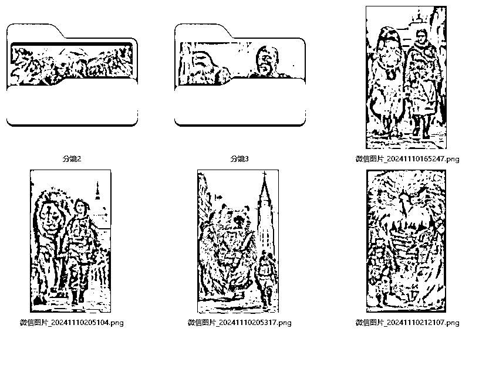

我尝试了各种类型：AI救赎类的，励志类的，都尝试了一遍。最后转了一圈，我发现， AI变身秀才是我的真爱。走上这条路也很简单。我的技术储备不足，但我有生图软件这个好帮手，不管生出什么好看的图，都能拿来用，让视频内容更加吸引人。

在这次航海中，我可能不是技术最精湛的，能力也不是最强的，

最后我分析了下这次成功，我有一样东西——速度！比大家早出发了二十天，让我在航海中抢得了先机，收获了不少宝贵的经验~~

当时做的视频都是糊的，提示词不会写，生成什么样就怎么样~~~

方波妮教练的那句话，给了我很大的鼓舞：虽然做出来的视频看起来很拙劣，但是流量还是很大——

让我明白，哪怕作品不完美，只要我们敢于展示，就有机会赢得观众的心。

当我在网上看到那些比我的视频还要“拙劣”，却流量爆表的创作，我的信心就像打了鸡血一样，瞬间爆棚

这个鸡血给打到了，就这~不是有手就会吗？

当时我的想法很简单：就是先发再说。我的态度：至于YPP，爱开不开，不开拉倒。

我当时更在意的是在这过程中的自我证明和技能提升，所以没啥压力，做了就发。不管结果如何，这个过程本身就让我感到满足。

就这样平平无奇的做了小半个月，没有太多华丽的包装，没有太多复杂的策略，就是一步一个脚印，踏踏实实地往前走。这半个月，虽然没有惊天动地的成就，但我收获了宝贵的经验和自信。

万万没想啊，YouTube对视频内容特别看好,youtube他做慈善了，他给流量了，他捧我了。我当时感觉他是不是在偷偷关注我。是不是看我流量平平怕我放弃了，突然就给了个大礼包，挽留我的的心 。这感觉，是不是有点太棒了？

想象一下，你投入了无数个夜晚，制作了十来个视频，然后突然之间，就像火山爆发一样，突然的爆发了一波，而且还是一发不可收拾，其中一个视频的流量开始狂飙，从几百跳到上千，再到上万~~

就这样带动了其他的视频流量也跟着涨了。然后最初这个视频的流量降了下来。但其他视频里有质量更好的被观众佬爷发掘出来了，于是其他视频也爆了涨了，接替原来的爆款。继续往上走。

既然这样，那就回过头来分析爆涨的视频，把数据比较好的视频拿出来分析。是什么原因爆的，合并同类项。然后就确定了这条赛道。再把其他的删删改改。

因为我走的是偏性感路线，这条路线有几个缺点

1，容易踩红线。在红线上跳舞，迟早要出事。我己经忍痛永删两个50万流量的视频了

2，地理位置容易偏向印度这种奇葩国家。收益很低。欧美能赚10美元的，在印度只给你一美元就不错了

3，生图软件会被判违禁词

好处也有，就是容易出量。

为什么爆？我都觉得官方在偷偷看我。很玄学的，谁也不知道是怎么爆的。

为什么不是最先爆质量最好的，而是其他平平无奇的。只能说是运气使然。直到高手领航直播看了曹淦老师的课——原来全在课程里，在航海手册里。曹老师研究得更系统，更透彻。

在这次航海中，我发现自己误打误撞地走上了曹老师指点的路线，竟然蒙对了他的一些路子，真是幸运啊！

我的视频，起初就像是一杯白开水，平淡无奇，连那些炫酷的开屏三秒技巧都没用上。我心想：视频还是要讲逻辑的，要让观众看得明白，看得舒服。

看了曹老师的课，豁然开朗。原来视频里的逻辑可以更吸引人，可以更有起伏，更有故事性。我心想，既然有更吸引人的逻辑，为啥还要坚持平平无奇的呢？

就这样，在这次航海的第一天，我终于达到了YouTube合作伙伴计划（YPP）的开通条件，这是我航海旅程中的一个重要里程碑。流量已经跑到了一千多万了，这不仅仅是一个数字，它是我对航海的热爱和努力的证明。

上船即靠岸。我做到了，这感觉，简直太棒了！

接下来，就是那段提心吊胆的等待时间。焦急又充满期待等了一个多星期，24号才审核通过。11.28邮出PIN码，其实到现在还没有收到。YPP的开通，在B站也有教程的。

后来就是磨练技能了：航海手册、高手领航教练的课，然后自费了一些课程。以及B站的一些精品。

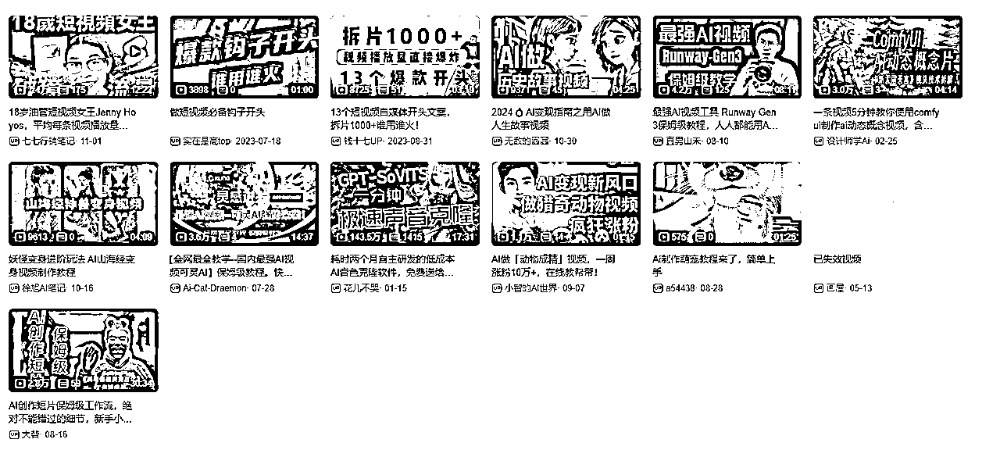

航海实战中，磨炼技能是一个不可或缺的过程，以下是一些建议：

1.  深入学习航海手册：航海手册是你技能提升的基石。它包含了航海的基础知识和实践技巧。通过深入学习手册，你可以掌握航海的核心概念和操作方法。

1.  参与高手领航教练的课程：高手领航教练的课程是提升技能的加速器。这些课程通常由经验丰富的教练们实操经验和闭坑，涵盖了从基础到高级的各个方面。通过参与这些课程，你可以直接从专家那里学习宝贵的经验和技巧 。

1.  自费课程的选择与学习：自费课程可以为你提供更深入的学习机会。选择与你航海目标相关的课程，比如视频制作、内容创作或者社交媒体营销等，可以帮助你在特定领域内快速成长。

1.  B站精品课程的利用：B站（哔哩哔哩）提供了丰富的精品课程资源，这些课程覆盖了广泛的主题和技能。你可以根据自己的兴趣和需求，选择适合的课程进行学习 。

1.  实践与反馈：理论知识固然重要，但实践是检验学习成果的关键。通过实际操作，你可以发现问题并及时调整。不要害怕寻求反馈，无论是来自教练的还是群里圈友的，都是你成长路上的宝贵财富。

1.  持续跟踪与迭代：技能的提升是一个持续的过程。通过不断跟踪最新的航海趋势和技术，你可以确保自己的技能始终保持在前沿

## 转型之路

随着观众佬爷们的口味变刁，还是同质化的原因~

总之不管什么原因，这一赛道的流量在走低了，关注的对标账号起播量只有几千。渐渐的有种日薄西山的感觉，开始慢慢摸索转型。或是把赛道再细分一点，吃个长尾流量；还是曹老师的课程，摸索差异化。

## 经验分享

小技巧：1（可灵1.0）

视频生成如何丝滑过渡小技巧。

动作幅度不要太大，中间有要过渡。

例如：你一个人要从左转到右边，那就通常会出现变形。那么你再找一个正向的图插中间，先从左边转到中间，再从中间转到右边。

示例：

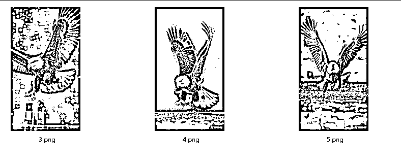

这样出来就有翅膀扇动的效果了。如果还要精细化一点，就需要用PS把背景稍微P一下。这个首图是可以把脚P掉一只的（如果会用PS的话）。

小技巧2（即梦文生图）

很多人在使用即梦的时候，生出来的人，脸型不统一

其实我们在这个时候在提示词里添加一个限定。

比如我后面要用到的图都差不多是同一个人，那么我们在提示词添加一个。

五官长得像刘德华，

五官看起来像刘德华，等。

这样后面生成的图里大多还是长得像刘德华的，也有个别出挑的图。不必考虑，再接着生成

小技巧3 抽卡问题

很多人在抽卡的时候抽得很肉疼。我现在为止用得最多的是可灵。

可灵在生成的时候比runway更灵动、更丝滑，但也更贵。所以要在平时多积累对提示词的运用，把平时生成不错的提示词记下来。还有就是刷灵感广场，去广场上看别人的作品。

第二次使用的时候，适当添加。runway我现在是把种子值记下来。下次要生成类似的，直接使用种子值

# 实例教学

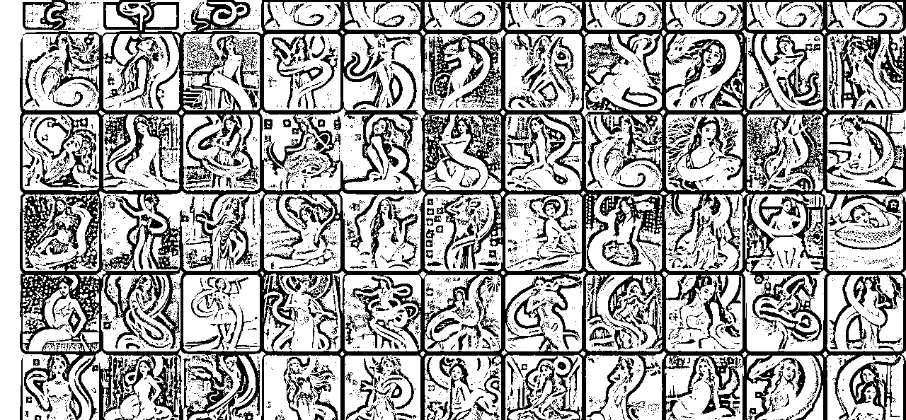

所谓抽卡，就是碰运气，为了做这个案例，做了二百多张图，最后只挑中了7张可用。而且还有一些瑕疵（后面讲到）

第一步，把中意的图挑出来，编好出场顺序。这个出场顺序的排列也是有规律的，因为用到首尾帧，所以排列的时候过渡很重要，不能相差太离谱，不然变形就很严重

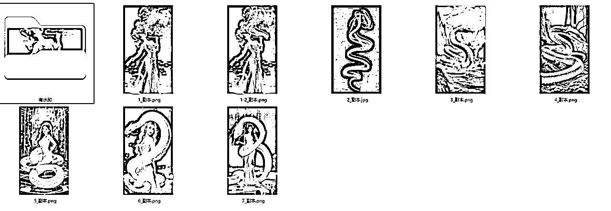

最后用得上的只有六张。

排好这些后，就可以抽卡了。

我用的是可灵。

这里可灵1.0的话，脸部都会有变形，1.6不能用首尾帧。高品质可以不变形，但是成本比较贵。

开始：分镜一

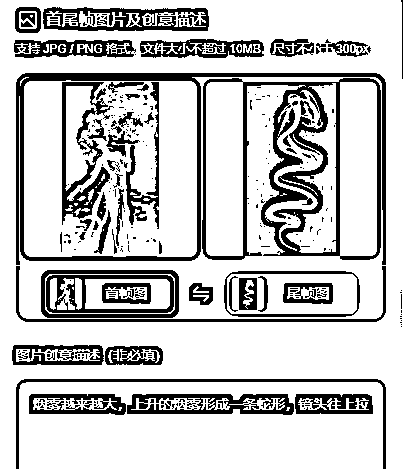

这个就讲一个玄学二字了。来看成品

看这里，脸部变形严重，如果要好品质的话，就要用上高品质来抽了，太伤钱包了。这条如果要用就需要用剪辑工具来进行转场加物效来过渡这个变身过程。

还有一个就是继续抽卡，我选择再抽一次，抽不到了就勉强用剪辑去过渡

成品2，这样是不是好多了

提示词：烟雾越来越大，上升的烟雾形成一条蛇形，镜头往上拉。这里两次抽卡用了相同的提示词

分镜2，看成品，

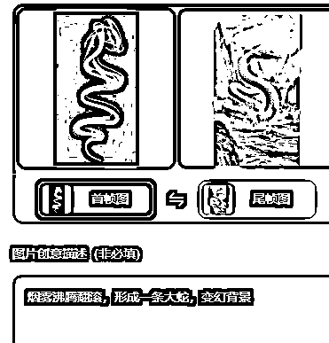

这次很幸运，一次成功。

提示词：烟雾沸腾翻滚，形成一条大蛇，变幻背景

大家在做的时候，自行修改提示词。按自己的需求。

分镜三：也是一次成型

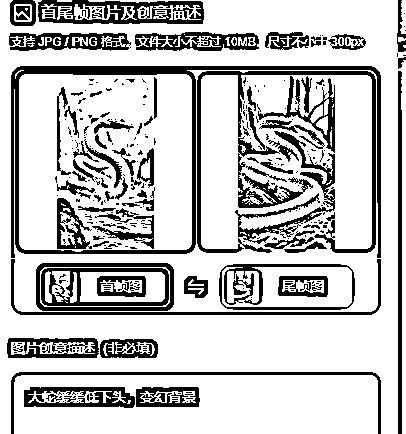

提示词：大蛇缓缓低下头，变幻背景。

这里AI的判断这个下，把整个身体也带下去了

大伙儿可以试试使用：蛇的身体翻滚游动，变幻背景。如果你的图背景差不多，后面的提示词都不用带上背景两字

失败的分镜4：这里还是使用了高品质。因为涉及人脸，下了血本

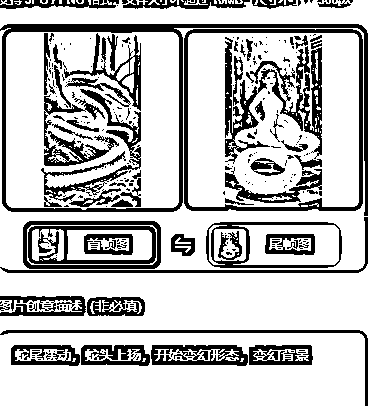

成品

失败原因分析：

提示词中提到了：蛇头，蛇尾，但是蛇这种生物头和尾很像，导致了AI分不清头和尾，就会变成了把头当成尾来做。我的分析是这样。那就试下不提头尾。

改提示词：高高立起身，变幻形态，变幻场景

得到这个：看着效果也还行，后期剪辑的时候做一个加速和特效还是能糊弄过去的。

分镜5：

提示词：缓缓的站起身，变幻形态，人蛇分离

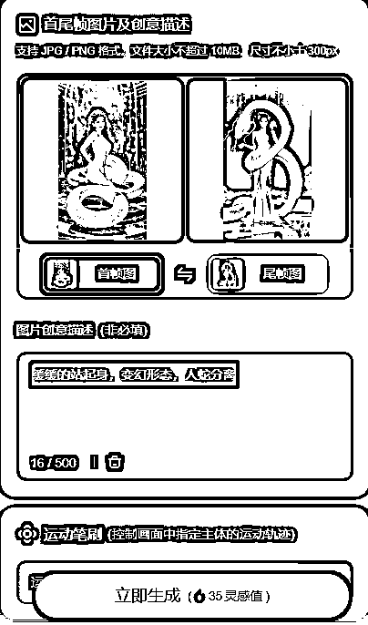

成品：

抽卡失败，再抽，这里我连抽了两个。放上来一起分析下哪个更好

把这些分镜导进剪映，加上背景音乐就可以了。

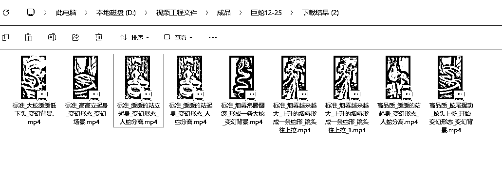

生图提示词：

1.吹烟：远拍，新闻照片，抓拍，一位中国芭蕾舞运动员像敦煌飞仙一样站在蓝色的闪耀着点点星光的舞台穿着薰衣草配色的敦煌风格的紧身芭苗舞衣裙正在点燃一根烟，头顶上方浓烟滚滚，烟雾缭绕芭苗舞衣裙有很多淡紫色的飘在空中的欧根纱与丝绸的丝带，泳衣上还镶嵌着钻石，有许多绣花与金银丝线，

2.烟蛇：水墨画，由霓虹烟雾形成巨蛇形烟雾，蛇形烟雾特写，淡雅白色线条像水流般柔和自然悠长，意识流，极简，水墨意境，烟雾质感，梦幻，超现实主义，3D，唯美，拖影，拉_ 丝，禅意，背景纯黑，强烈的色彩对比，32k高清画质

3.白蛇：图片生成信息:在一片神秘的山林之中，一条巨庞大的白蛇蜿蜓盘踞。从斜上方 45 度的视角看去，它的身躯如同一道洁白的闪电。白蛇的鳞片晶莹剔透，闪烁着迷人的光泽，每一片都仿佛是精心雕琢的艺术品。它的眼睛深邃而锐利，透露出神秘的光芒，犹如夜空中的寒星。蛇信子不时吞吐，带着一种威严的气息。山林中弥漫着薄薄的雾气，为白蛇增添了几分神秘的氛围。周围的树木高大而古老，枝叶繁茂，形成一片绿色的海洋。阳光透过树叶的缝隙，斑驳地酒在白蛇身上，勾勒出它优美的曲线。摄影风格，定焦镜头，神秘染，斑驳的林光光线，冷艳色调，从斜上方45 度视角，面朝前方，12K。白蛇传里的白蛇相似，拥有庞大的蛇躯，看似龙的身体

4.合体变形：人与蛇的合体，美女的上身，巨大的白色蛇尾，在蓝色的闪耀着点点星光的舞台上

3和4这个在众多图里取了两张。

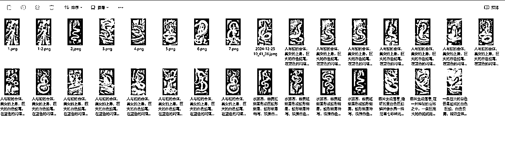

这是从二百多里挑的三十多张。然后再筛一遍。

得到七张。这七张有个规律就是形态要接近，这样在生成视频的时候不至于变形得太过离谱

最后，上个完全版试试

小技巧4.善用PS

之前我一直用美图秀秀，因为有个AI去水印。后来越做越发现有些图真的很难抽到。怎么办，这个时候就要祭出神器PS了。因为PS这个我只会皮毛。所以也只是粗修。实例演示

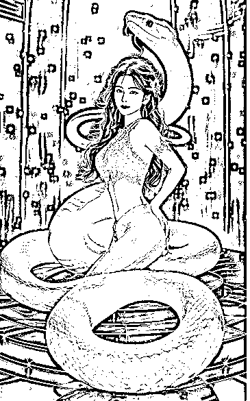

当时做这个的时候死活生不出理想的图，各种变形。这时候才想到用PS来做辅助。这张图。看起来就很别扭。但是用来做中间帧又太合适不过了。要是我技术再强一点。把前面这个圆圈P掉就更完美了

这里我用了PS的仿制图章，把脚的边沿涂抹一下。更顺滑点。蛇头用套索工具圈起，删除，填充为内容填充。嗯。我的技术只能支持我做到这点了

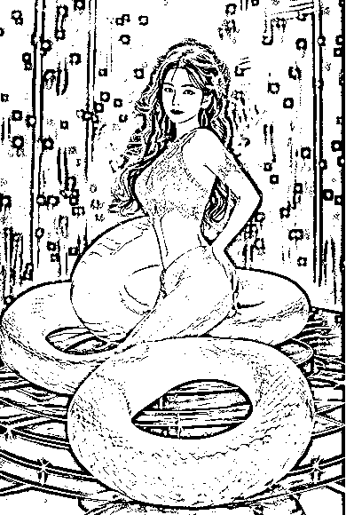

看成品：混然天成，毫无PS痕迹

这样做起来，前后衔接比较自然

小技巧5。日常积累，建立自己的素材库。

在你灵力枯竭的时候，把素材库拉出来溜溜，或许又有新的发现

最后我想对你们说，接下来的生财旅途充满了无限可能和机遇

参加航海实战的时候，我像大家一样，紧握着航海手册，一步一个脚印地前行。只是当我窥见了项目的潜力，我选择了先行动了一段时间

在航海的初期，流量的缺失就像茫茫大海中的迷雾，让人迷茫，我和大家一样，要去走出这份迷茫，就是得到正反馈，把自己的期望阈值调低。今天得到100个流量也能让自己值得干一杯的心态，我最初的播放都是几十上下的，现在的我也会有时流量下滑，但你想到至少有收获，那就没事了，事情总会变好的~

感谢生财平台运营雪雪、澄歌，

教练团的答疑、老马教练、方波妮教练和钱塘鲤 的帖子~

志愿者们（领队马可乐、志愿者X.）的无私帮助与指导

最后的最后想对大家说，不要害怕流量的起伏，不要畏惧困难和迷茫。 持续航行，不断创作，那些能够触动人心的视频终将出现。

祝大家早日开通YouTube合作伙伴计划（YPP），踏上生财之路！！！