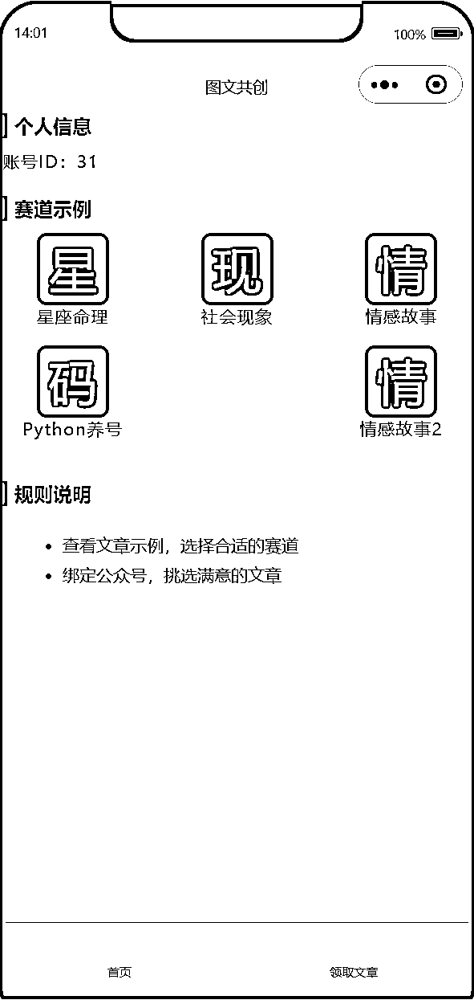
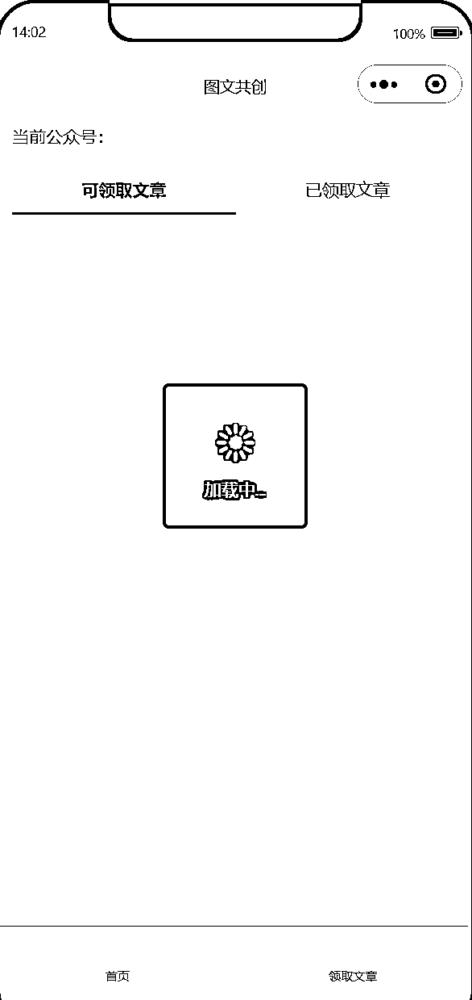
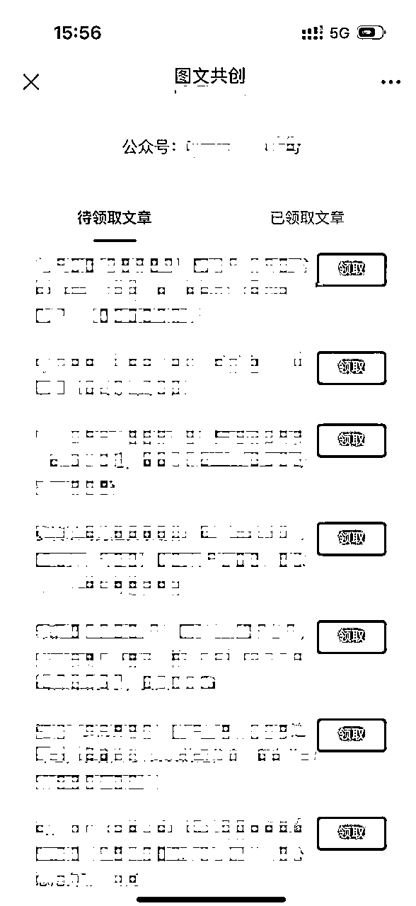
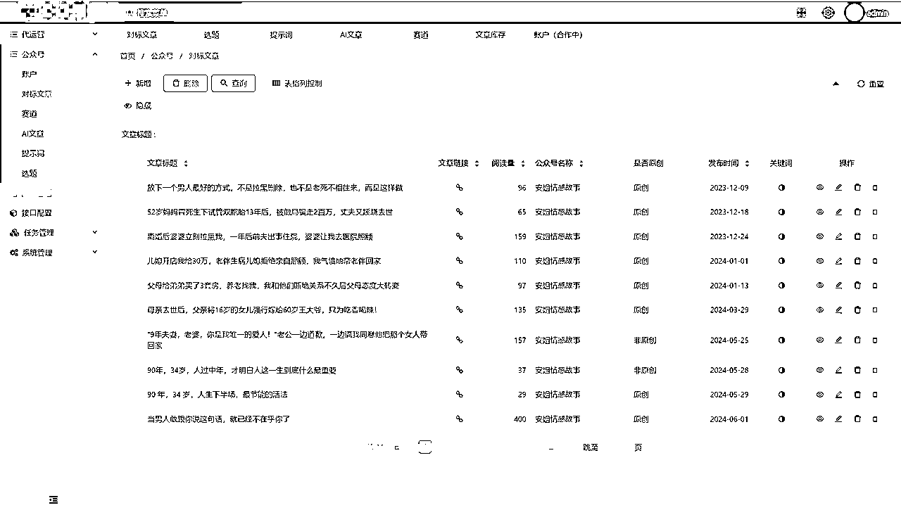

# 用Cursor AI编程，做了公众号文章代发系统

> 来源：[https://gq3338qf45y.feishu.cn/docx/LCaidUmtko7uHZxCoiFcWXj7nYA](https://gq3338qf45y.feishu.cn/docx/LCaidUmtko7uHZxCoiFcWXj7nYA)

# 一、前言

我目前在做AI公众号矩阵项目，用低代码平台搭建了一个基础的文章发布-领取系统。

在使用过程中，用户提了一些功能需求，我觉得有加上去的必要。

但是有些仅用低代码平台做不到，而且挪出一部分时间去开发新的系统可能不是很值得。

后来借助了AI编程，发现效果的确出乎自己的想象，降低难度的同时也提高了效率，大大缩减了成本。

用AI提效前：

RPA批量写文章，一天分配一篇文章，用户电脑登录领取。

领取的文章不带图片格式，需要自己排版。

用AI提效后：

成熟赛道用RPA批量写文，同时可以手动上传文章。

手动的部门主要进行一些实验性的探索，成熟后再做成自动化流程。

用户在手机端就能领取文章，从多篇文章中挑选。

文章内容一键复制，粘贴进公众号的编辑器中就是待格式的，不用再额外编辑。

修改完成后，发现同时也能作为一个平台去运营了，提供给会AI写作的人，让他们能借助工具去矩阵化放大。

# 二、背景

我觉得有必要交代一下是否有编程的经验，否则很多人会觉得0基础就都能做出自己想要的应用。

本硕学的都是软件工程，毕业后全职开发了3年转项目经理（偏业务，非技术经理）。

做项目经理期间偶尔会写一些代码，但是工作上的占比很少了。

主要是写后端，前端代码能看懂，写起来要查资料比较耗时。

用AI编程的感受是，一些模板化的部分，完全用AI基本上没什么问题。

实际功能的部分可能需要反复调整来达到自己的预期。

对于完全不懂代码的人来说，创建项目可能就是一件麻烦事。

使用单一技术栈会更合适，纯web应用就用html，涉及数据存储的话用php我觉得很合适。

# 三、AI编程

## 1、小程序开发

我首先想到了做小程序，用户体验会比较好，依托微信生态，使用起来方便。

做小程序时使用的Claude和ChatGPT，很方便，这时候还没有使用到Cursor。

我的方法是一个个区域分别去提问。

比如个人信息的区域我想怎么做、赛道示例的部门我想怎么做等等。

最后像拼积木式的拼起来。

或者自己画一幅图，让AI做出类似的效果也是可以的。

做完之后发现关键的一步没办法实现，小程序里面不能直接复制带格式的文本，只能复制纯文本。

意味着用户复制后需要自己手动去排版。

后来找到一个方法，需要在小程序中嵌入H5，才能复制。

想着已经做的差不多了就先上线吧，没想到通过了工信部的审核，没通过腾讯的审核。

这类小程序需要以公司去运营，提供营业执照。

以前上线过几个类似的小程序，往往换个说法就能通过了。

不过因为小程序不能转发、排版功能也不太方便，就打算直接用H5算了。

反正AI编程用不了多长时间。

## 2、H5开发

本来以为H5开发会很快的，没想到遇到了很多问题。

最大的就是插件版本的问题。

我使用的vue，使用vue有不版本的插件，插件之间的版本要契合，不同版本的语法也不同。

问AI经常出现语法不对的情况，只好每次都把插件版本放到提示词上。

效率下降了很多。特别是进行微调的时候。

后来使用了cursor，使用起来就顺畅多了。

虽然基础模型也是ChatGPT、Claude，但是工具上做了一些优化。

写提示词时可以顺带把关联的文件放上去，这样AI就有了更多的上下文。

H5的成品只保留了领取文章的功能。

文章详情页面点击复制，可以复制带格式的文本+图片。

## 3、后端管理界面

创作流程：找赛道→找对标文章→写通用提示词→选题→批量生成文章

日常工作：根据文章余量的报表创作，跟进每个公众号的发布情况

后端使用Java语言，在低代码的基础上利用Cursor进行功能扩充。

基本上没有遇到太多的困难。

# 四、商业化思考

## 1、是否值得做

我在做这个项目之前已经有很多成功经验了，所以要考虑的是这个项目还能做多久。

如果做的是流量主，不好预料，可能还能做几年，可能几个月内就不能玩了。

如果做的是公众号，依托于腾讯，基本上受限于腾讯的运营。

如果做的是图文媒体，只要图文的形式还存在，就是能做下去的。

基于这些思考我决定了深耕公众爆文矩阵项目，开发了文章分发的应用。

而且我相信AIGC的上限远不止写流量文而已。

## 2、如何冷启动

基于私域好友+公众号粉丝，开启了第一波尝试。

我用的是限定名额免费的方式，先用一部分账号跑起来了，拿到反馈才好迅速的去迭代。

账号不够的情况下，不好判断赛道是否可以做、文章是好是坏、提示词是否合格等等，可能只是差了一点运气。

形形色色的人都有。

有些人流量不好会放弃，能坚持下来的基本上都是流量不错的。

也有些流量挺好的，但是对公众号的认知不足，以为做不起来，这种看到了会去提醒一下。

也有发了一两篇就不想发了的，可能只是过来看看文章质量吧。

## 3、后续发展规划

一个人能做的赛道有限，后续竞争更加激烈的话，能做起来一个赛道都不错了。

要想覆盖更多赛道的话，肯定要和不同的人合作。产出更精细化的优质内容。

系统现在支持创作者发布文章上去，号主能在H5页面上领取文章。

a）会AI写作的人，提供文章

b）会做流量的人，找号来发布