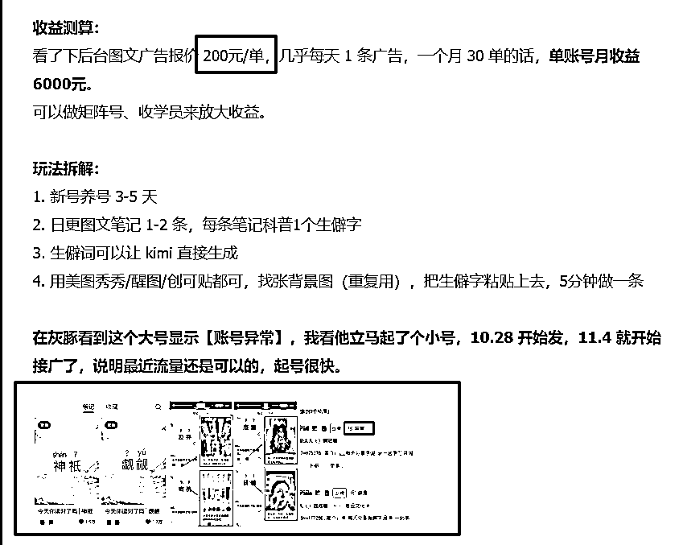
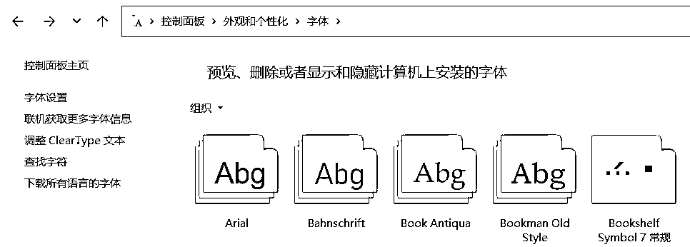
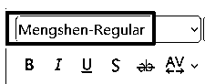
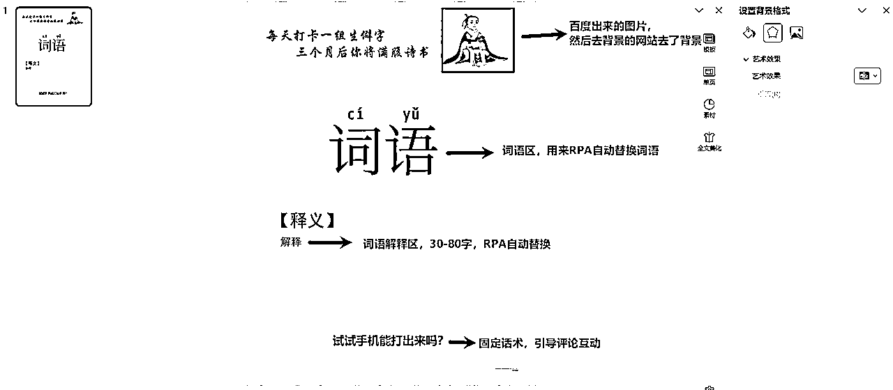
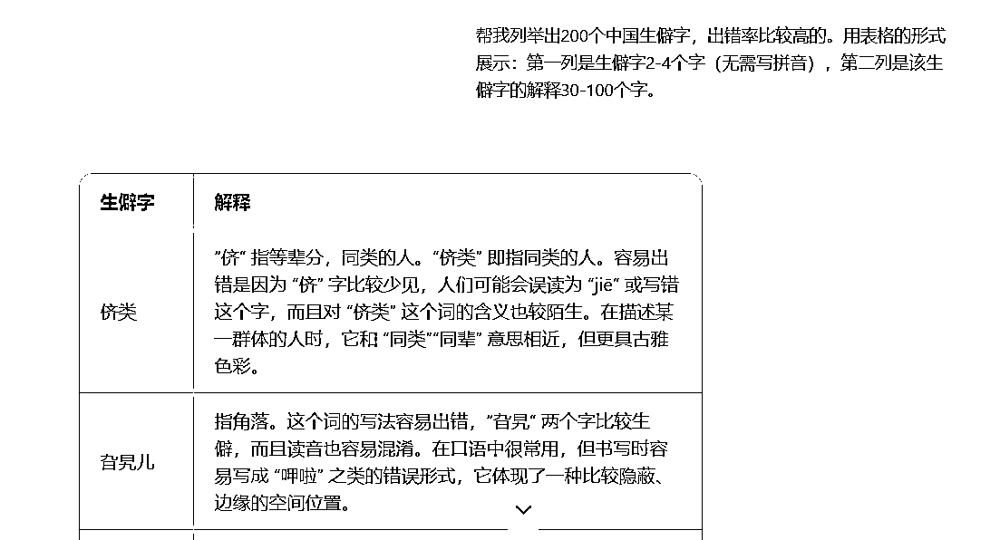
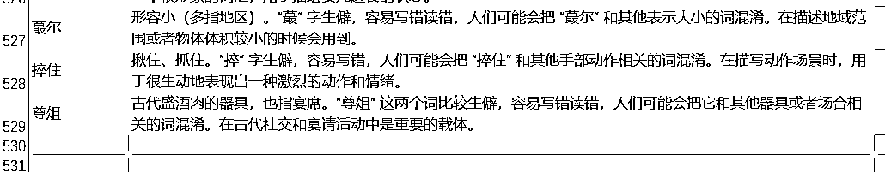
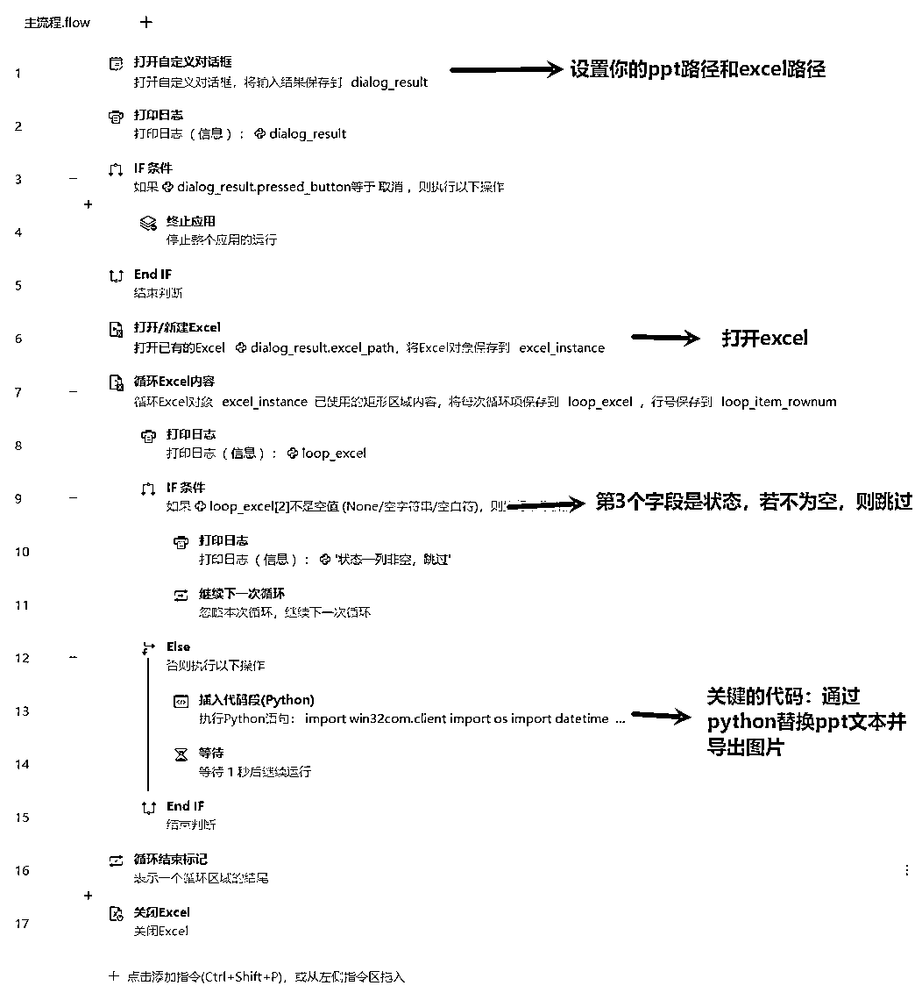

# 用RPA全自动化批量生产【生僻字】图片做小红书商单，保姆级工具开发教程（附工具下载）

> 来源：[https://aqoyanyhfa.feishu.cn/docx/Y0Sod7uc7oynV5xOKJvczfWrnng](https://aqoyanyhfa.feishu.cn/docx/Y0Sod7uc7oynV5xOKJvczfWrnng)

大家好，我是大胡子，专注于RPA实战与解决方案，目前已经做了70多款商业化的RPA工具（累计100+RPA）。

今天带大家一起来实战前段时间比较火的小红书【生僻字】项目。工具在最后，也免费分享给大家。



这个项目比较固定，不仅可以做小红书，视频号、抖音也同样可以发。于是就在思考怎么通过RPA达到批量生产做矩阵的目的。接下来，我将我通过批量生产生僻字的步骤分享给大家，一键启动RPA机器人，机器人就会自动逐个读取excel，并将生僻字转成图片保存在本地文件夹。

开发工具为：影刀+cursor

# 一、怎么将生僻字生成图片呢？

我的方法比较简单，核心是2点：拼音字体和ppt导出图片。

## 1.1、安装拼音字体

拼音字体的意思就是，粘贴汉字过来后，会自动显示拼音，如图：


我用的是一个叫做【萌神拼音】的免费商用字体库，点击下载字体库 ,安装也很简单，以windows为例，ctrl+r调出运行，输入control进入外观与个性化，再将上面的字体拖入到下面的字体库区域即可。



验证的话，在ppt里面选择字体名称即可。



## 1.2、生僻字PPT模板制作

我参考了小红书上面的很多博主案例封面，于是自己也做了一款。



要注意的是词语区和词语解释区，这2个区域的文本必须先默认是【词语】和【解释】，方便RPA脚本自动替换，其他的地方随便你自己怎么改都行。

当然，我知道很多大老板很忙又很懒，ppt模板我也贴出来供你下载。

# 二、通过AI批量生产生僻字和解释。

怎么获取生僻字资源？

答案肯定是通过ai来进行生产，我一开始是用的kimi但发现输出一部分之后，特别容易出错，例如有时候就生成了重复的一个生僻字。

于是改为通过豆包生成（点击下载豆包AI电脑版，也可以直接进入豆包网页），我的提示词为：

```
帮我列举出200个中国生僻字，出错率比较高的。用表格的形式展示：第一列是生僻字2-4个字（无需写拼音），第二列是该生僻字的解释30-100个字。
```

生成的效果如下：



然后复制到excel表格，于是得到了几百条数据，每个词语发一个作品，那也可以发几百个作品了。



# 三、用影刀自动批量生产生僻字图片

可以说，这一步是批量化最关键的步骤，我们选用的工具是影刀，自动读取excel，并替换ppt中的生僻字并导出图片。



关键代码是我用AI生成的，也分享给大家（看不懂跳过即可，我也是通过cursor生成的代码）：

```
import win32com.client
import os
import datetime

#功能：打开ppt，替换文本，并导出图片
class PowerPointEditor:
    def __init__(self, ppt_path):
        """
        初始化 PowerPoint 编辑器。

        参数:
            ppt_path (str): PowerPoint 文件路径。
        """
        if not os.path.exists(ppt_path):
            raise FileNotFoundError(f"File '{ppt_path}' does not exist.")

        self.ppt_path = ppt_path
        self.ppt_app = win32com.client.Dispatch("PowerPoint.Application")
        self.ppt_app.Visible = True  # 可见，方便调试
        self.presentation = self.ppt_app.Presentations.Open(ppt_path)

    def replace_text_in_slide(self, slide_index, old_text, new_text):
        """
        替换指定幻灯片中的所有文本框中的文本。

        参数:
            slide_index (int): 要替换的幻灯片序号（从 1 开始）。
            old_text (str): 要查找的旧文本。
            new_text (str): 要替换的新文本。
        """
        if slide_index < 1 or slide_index > len(self.presentation.Slides):
            raise ValueError(f"Slide index {slide_index} is out of range (1-{len(self.presentation.Slides)}).")

        slide = self.presentation.Slides(slide_index)

        for shape in slide.Shapes:
            if shape.HasTextFrame and shape.TextFrame.HasText:
                text_range = shape.TextFrame.TextRange
                if old_text in text_range.Text:
                    text_range.Replace(old_text, new_text)
    def export_slide_as_image(self, slide_index, export_folder, image_format="PNG"):
        """
        将指定幻灯片导出为图片，并返回图片的完整路径。

        参数:
            slide_index (int): 要导出的幻灯片序号（从 1 开始）。
            export_folder (str): 图片保存文件夹路径。
            image_format (str): 图片格式，支持 "PNG", "JPG", "GIF" 等（默认 PNG）。

        返回:
            str: 导出的图片完整路径。
        """
        if slide_index < 1 or slide_index > len(self.presentation.Slides):
            raise ValueError(f"Slide index {slide_index} is out of range (1-{len(self.presentation.Slides)}).")

        # 检查文件夹是否存在，不存在则创建
        if not os.path.exists(export_folder):
            os.makedirs(export_folder)

        # 自动生成文件名
        filename = self.gettimestamp()
        file_name = f"{filename}.{image_format.lower()}"
        export_path = os.path.join(export_folder, file_name)

        # 导出幻灯片为图片
        slide = self.presentation.Slides(slide_index)
        slide.Export(export_path, image_format)
        print(f"Slide {slide_index} exported as {image_format} to '{export_path}'.")
        return export_path
    def save(self, save_path=None):
        """
        保存 PowerPoint 文件。

        参数:
            save_path (str): 保存路径（默认覆盖原文件）。
        """
        if save_path is None:
            save_path = self.ppt_path

        self.presentation.SaveAs(save_path)
        print(f"Presentation saved as '{save_path}'.")
    def gettimestamp(self):
        # 获取当前时间
        now = datetime.datetime.now()
        # 格式化为 yyyymmddhhMMss
        formatted_time = now.strftime('%Y%m%d%H%M%S')
        # 获取毫秒部分
        milliseconds = now.microsecond // 1000  # 微秒除以1000得到毫秒
        # 将毫秒部分转换为字符串，并确保是三位数
        milliseconds_str = f'{milliseconds:03d}'
        # 拼接时间戳字符串
        timestamp_str = formatted_time + milliseconds_str
        print(timestamp_str)
        return timestamp_str
    def close(self):
        """
        关闭 PowerPoint 演示文稿和应用程序。
        """
        if self.presentation:
            self.presentation.Close()
            del self.presentation
        if self.ppt_app:
            self.ppt_app.Quit()
            del self.ppt_app

#ppt_path = r"E:\workspace\rpa\影刀\生僻字\temp.pptx"
#output_path = r"E:\workspace\rpa\影刀\生僻字\output_png"
ppt_path = dialog_result.ppt_path
output_path = ppt_path[:ppt_path.rfind('\\')] + "\\output"
# original_path = dialog_result.ppt_path
# ppt_dir = original_path[:original_path.rfind('\\')]

title = loop_excel[0]
content = loop_excel[1]
# 初始化编辑器
editor = PowerPointEditor(ppt_path)
try:
    # 多次替换文本
    editor.replace_text_in_slide(1, "词语", title)
    editor.replace_text_in_slide(1, "解释", content)
    editor.export_slide_as_image(1,output_path)
    # 保存结果
    #editor.save(save_path)  //注释掉，暂无需保存

except Exception as e:
    print(f"Error: {e}")
finally:
    # 确保关闭 PowerPoint
   if 'editor' in locals():
        editor.close()

```

这个代码确实踩了很多坑，是通过cursor生成的，不得不说效率真的高，不仅流程快，而且解决bug也超快。

看下成品效果：

# 四、工具下载

影刀下载：点击这里

影刀的工作流（先下载注册，再去获取，然后就可以在自己的影刀里面看到了）：

https://api.winrobot360.com/redirect/robot/share?inviteKey=bad5fc9f3789d710 （密码：dahuzirpa）

还需要下载的有2个文件：

（建议改一下背景颜色、和提示文字，不然就跟我的作品重复了）

（excel里面我已经汇总了500多个生僻字，够发500多个作品了，实在不行，修改下ppt模板，再生产一篇，不就又有了500多个作品吗）

最后，这个工具从看到帖子，到研究可行性，再到开发和落地，陆陆续续花了一周时间，如果觉得这个工具有用，可以在帖子上点个赞哦~