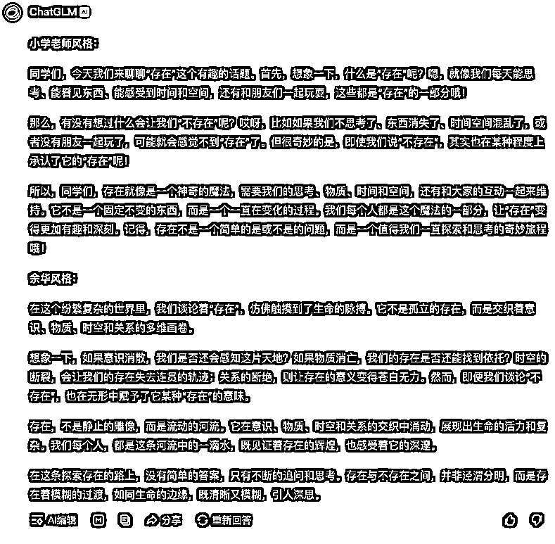

# 中美 AI 模型的真实对比，我深度测评了 Claude、Deepseek、 智谱清言、kimi

> 来源：[https://aiawaken.feishu.cn/docx/DvuodZjyBomX9BxX0cMcnEB7nyg](https://aiawaken.feishu.cn/docx/DvuodZjyBomX9BxX0cMcnEB7nyg)

最近一个 AI 新选手悄然崛起。

用了一周的 Deepseek，不得不说被惊艶到了。

训练成本仅是同类产品的十分之一，

但效果直接冲进了全球第一阵营 。

作为一个深度 AI 体验者，

我做了一次硬核对比测评：

Claude、Deepseek、智谱清言、kimi 四大模型同台 PK。

为什么没有测豆包、天工、混元、百度等

懂的都懂。

* * *

## 测评角度

## 之前总结过的 AI 元能力：


接下来，我们将用角色能力，总结能力，推理能力、

转换能力、扩展能力、训练迭代能力、代码解释器能力进行测评。

* * *

## 角色能力：

输入：

请你扮演[小红书旅游博主]，

具有[高级小红书标题，文案编写能力]的专家。

现在需要你帮我解决[写一篇爬泰山的小红书文案]

Claude


Deepseek


智谱清言


kimi


#### 主观结论：

Claude > Deepseek >kimi ＞ 智谱清言

* * *

## 总结能力

输入：

请帮我总结以下文章的详细大纲和逻辑链条：

“TEXT”

Claude


Deepseek


智谱清言


kimi


#### 结论：

Claude > 智谱清言 >kimi ＞ Deepseek

* * *

## 推理能力

输入：

请一步步思考以下问题：

1.首先，分析[哲学里“存在”的关键要素]

2.然后，考虑[可能“不存在”的影响因素]

3.最后，得出[存在的合理结论]

Claude


Deepseek


智谱清言


kimi


#### 结论：

Claude > 智谱清言 >Deepseek＞kimi

* * *

## 转换能力

输入：

将这段文案“

第一步 - 分析"存在"的关键要素： 首先，我认为"存在"包含以下几个核心维度：意识层面（我思故我在），物质层面（客观实在），时空层面（存在于特定时空中），以及关系层面（与其他存在物的互动）。存在不仅仅是简单的"在那里"，而是一个多维的概念。意识使我们能够感知和思考存在，物质给予存在具体形式，时空赋予存在场域，关系则定义了存在的意义。

第二步 - 考虑"不存在"的影响因素： 接下来，我们要思考什么因素可能导致"不存在": 意识的缺失可能导致存在感的消失，就像笛卡尔怀疑一切时那样。物质的消亡会使存在失去载体。时空的断裂可能使存在失去延续性。关系的断绝则可能使存在失去意义。但有趣的是，"不存在"本身就是一个悖论 - 因为要讨论"不存在"，我们就必须在某种意义上承认它的"存在"。

第三步 - 得出存在的合理结论： 综合以上分析，我认为关于存在可以得出以下结论： 存在是一个动态的过程，而不是静态的状态。它需要意识、物质、时空和关系这四个维度的相互支撑。存在的本质不在于单一要素，而在于这些要素之间的相互作用。正是这种复杂的互动，使得存在成为可能，也使得我们能够理解和体验存在。"存在"与"不存在"的界限可能并非绝对，而是存在着过渡地带。

这种理解让我们看到，存在不仅仅是一个简单的有/无问题，而是一个需要我们持续探索和思考的深刻哲学课题。

”

转换成小学老师的风格和余华风格表达。

Claude


Deepseek


智谱清言



kimi


#### 结论：

Claude > 智谱清言 >Deepseek＞Kimi

* * *

## 训练迭代能力

#### 输入：

对以下回答，进行压缩迭代优化，让内容更通俗易懂且高级：

“第一步 - 分析"存在"的关键要素： 首先，我认为"存在"包含以下几个核心维度：意识层面（我思故我在），物质层面（客观实在），时空层面（存在于特定时空中），以及关系层面（与其他存在物的互动）。存在不仅仅是简单的"在那里"，而是一个多维的概念。意识使我们能够感知和思考存在，物质给予存在具体形式，时空赋予存在场域，关系则定义了存在的意义。

第二步 - 考虑"不存在"的影响因素： 接下来，我们要思考什么因素可能导致"不存在": 意识的缺失可能导致存在感的消失，就像笛卡尔怀疑一切时那样。物质的消亡会使存在失去载体。时空的断裂可能使存在失去延续性。关系的断绝则可能使存在失去意义。但有趣的是，"不存在"本身就是一个悖论 - 因为要讨论"不存在"，我们就必须在某种意义上承认它的"存在"。

第三步 - 得出存在的合理结论： 综合以上分析，我认为关于存在可以得出以下结论： 存在是一个动态的过程，而不是静态的状态。它需要意识、物质、时空和关系这四个维度的相互支撑。存在的本质不在于单一要素，而在于这些要素之间的相互作用。正是这种复杂的互动，使得存在成为可能，也使得我们能够理解和体验存在。"存在"与"不存在"的界限可能并非绝对，而是存在着过渡地带。

这种理解让我们看到，存在不仅仅是一个简单的有/无问题，而是一个需要我们持续探索和思考的深刻哲学课题。”

Claude


Deepseek


智谱清言


kimi


#### 结论：

Claude > Deepseek > kimi ＞ 智谱清言

* * *

## 代码解释器

请你检查以下代码，并优化

```
“

”

Claude

```

    优化的浮动气泡动画

Deepseek

```

    Thought Bubbles

智谱清言

```

kimi

效果：


#### 结论：

Claude > 智谱清言 =Deepseek  ＞ kimi

* * *

两年前的惊叹还历历在目。

还记得 ChatGPT 刚问世时，

大家的反应：有人惊叹，有人恐慌。转眼已是第二个年头。

而今，Claude 正在内容创作领域后来居上。

更让人欣喜的是，Deepseek 这样具有

中国特色的大模型也在崭露头角。

就像曾经的互联网，或许在大模型领域，我们终将追赶并超越。

```

```

```

```