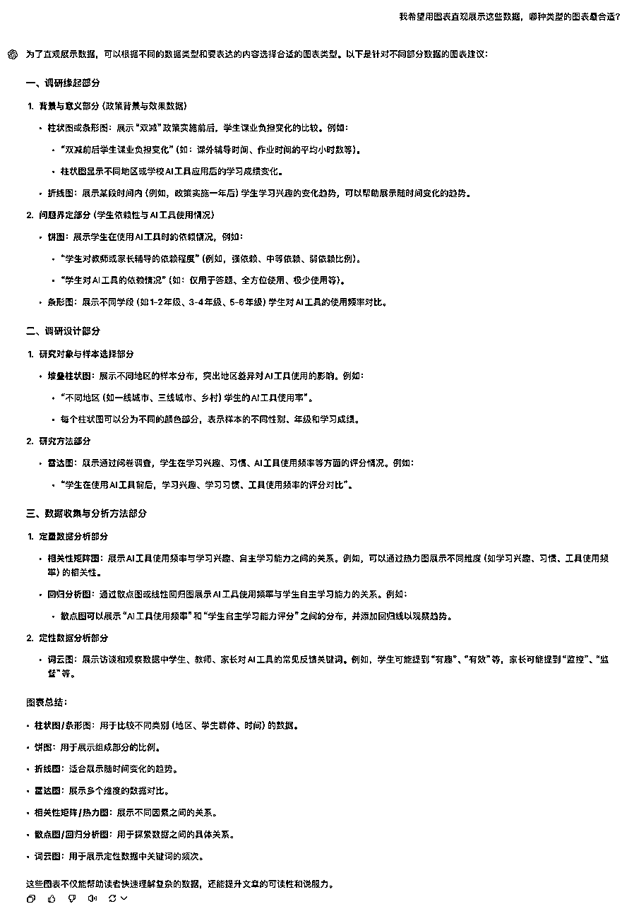
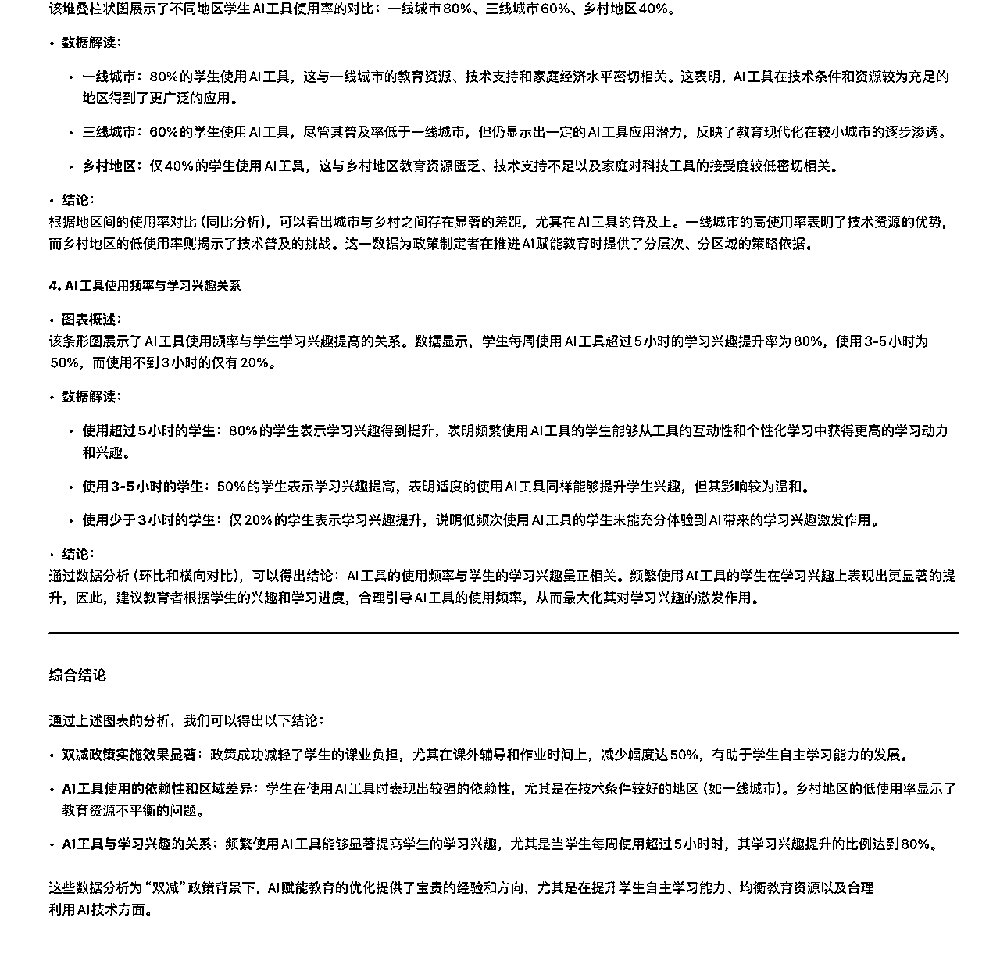

# 新人入局AI代写2个月收益4w+保姆级分享

> 来源：[https://he1n2jedb5.feishu.cn/docx/ZP1bdcUERoY3ifxMRLJcWzcfnvM](https://he1n2jedb5.feishu.cn/docx/ZP1bdcUERoY3ifxMRLJcWzcfnvM)

我是李白，生财有术5年圈友，编号5916。我是一名工作7年的产品经理，现任某大厂海外商业化平台PM。

在意识到AI能对内容生产行业产生颠覆性冲击后，便兼职投身AI写作行业。2个多月获得收益4w+，航海期间收入2w+，个人榜第1名。

航海手册已经对“如何写作”做了详细讲解，今天，我想从其他环节切入，和大家分享一些“写作变现的整体闭环经验”，力求让一个小白也能对AI代写的全局有快速认知。

# 一、早点下场，把手弄脏

5月份的时候，我在生财看到一些关于AI代写的帖子，心生兴趣，但当时并没有深入研究。

直到8月，我才开始重视起来，把生财里关于AI代写的所有帖子都翻了个遍。然而，真正下场实操，却拖到了10月中旬。

回想起来，前几个月其实是原地踏步，几乎没有成长。那时候，总想着“准备得再充分一点”，就像玩游戏一样，总希望把装备升到顶级再出去杀怪。但后来发现，这种“完美心态”反而成了阻碍。

真正的飞速成长，发生在接到真实客户单之后。从一开始的无知小白，到逐渐变成可以应对多种需求的写作多面手，客单价也从最初的几块、几十，一路提升到几百、几千。

刚刚我看了航海打卡的数据，发现每组大概都有2~3位朋友没有完成12次打卡。真的很希望大家已经迈出第一步，开始接真实客户单，只是太忙没时间打卡而已。因为只有接真实单，你才能真正进入这个行业，并快速提升自己。

# 二、下场第一步，应聘淘宝写手

应聘过程不难，就是去淘宝搜索写作、文章之类的关键词，然后针对排名靠前的商家，挨个私信，表明有意应聘写手，顺便加上自己的高光履历（或者文章作品），询问是否可以合作。

这里有个细节，你可以不断下拉页面，不放过任何一家店铺，挨个发送消息。建议一次性把消息发送完毕再去查看回复，这样可以避免遗漏或重复。因为商家数量多，回头再翻页面时，可能记不清哪些已经联系过。我大概给超过100家商家发送了私信，直到看到的商家好评率或成交量都较低时才停止。

等待回复的过程需要1-3天不等，有些店铺当时就回复，有些需要等几天。很多商家不招写手，所以扩大范围总没错的。招聘写手的店铺，一般会让你拍下一单，他来改价或者给你优惠券，最终实际付款1-10元不等，你下单后再帮你退款。我理解这一步就是为他们补单，增加他们的成交量。下单完成后，客服会让专门的人加上你的微信，再邀请你加入企业微信群或者微信群。

这里需要注意的是，你一定要用表格清楚地记录每个店铺、微信联系人、企业微信公司名的对应关系。一方面任何环节出问题，你都能溯源。二方面很多时候不同店铺导向的微信联系人或者企业微信公司名是一样的，你就可以避免重复添加，浪费时间。

# 三、高效抢单技巧

成功加入企业微信群之后，就来到了第三部分 抢单环节。

首先，不同价位的难度不同。根据经验，中间的价格最难抢，因为难度不大、费用适中，能做的人很多。而价格特别低的，没人愿意做；价格特别高的，没人做得来。大家抢单时要心里有数，有正确的预期。

其次，就是一些方式方法的优化，比如：

1.设备全开：电脑和手机同时登录企业微信，保持前台运行，确保你不会错过任何一条派单信息。

2.特殊提醒：为企业微信设置独特的通知音，一听到消息就能迅速反应，而不是被其他消息干扰。

3.快捷切换：电脑端设置全局快捷键，无论在做什么，都能一键切换到企业微信窗口。提醒一点，点击通知栏消息可能需要手动切换到具体企业，这个动作务必提前熟练。

4.话术准备秒回复：将常用抢单话术提前存到剪贴板，比如“我能完成，请派给我”。看到任务时，直接点击派单员头像，粘贴发送，同时迅速返回群复制派单信息全文，一并发给对方，确保沟通清晰。

5.沉住气不催促：如果派单员不回复，说明你慢了一步，任务被别人抢到了。不要去催，这样既浪费时间，也容易给对方留下不好的印象。

6.特殊时间：一天当中很早或者很晚的时候，抢单的人少，所以夜猫子其实更容易抢到单。

用了以上技巧，大家一定可以早日抢单成功！不过马上大家就会遇到新的问题，就是如何坚持。

# 四、黑奴单价格太低，如何坚持

我们都知道，淘宝单子的价格很低，所以大家自嘲“黑奴”。很多时候忙活半天也就几十块钱。诚然这个阶段无法避免，但可以从以下几方向去优化。

## 专注自己擅长的领域，保持心力

虽然单子的单价低，但如果你擅长的话，完成时间会大大缩短，这样性价比还是划算的。比如你对教育内容熟悉，就可以多接教育相关的单子，不断积累，不断提效，效率上去了最终的结果也会很可观。

## 不接急单，尤其是不熟悉的领域的急单

急单意味着时间紧、任务重，特别是你没做过的领域，会极大增加压力。一次糟糕的急单可能直接消耗掉你继续尝试的信心。

## 总结SOP，提升整体效率

每完成一个新类型的单子，都记录下所用的提示词和关键步骤，形成属于自己的SOP。下一次再接类似的单子，效率会有显著提升。

这里的SOP也分为需求确认和写作两个阶段。

先说需求确认，SOP的作用是不重不漏地问清楚需求的所有细节，提升效率的同时，提升我们自身的专业形象。而且还能避免后期扯皮的可能性。我就曾遇到过客服转告需求时遗漏细节，而我又没有再次和客户确认，导致全篇需要重写的情况。

比如，对于征文类的单子，我用的模板是这样的：

1\. 比赛通知的原始文件

2.使用者本人信息，比如几年级

3.是否已有主题和思路

4.是否提供理想风格供参考，包括措辞、文章结构、口吻等

5.字数要求

6.交付时间

7.质量要求

8.其他特殊需求

接到类似需求的时候，我直接把这些问题抛给客服或者客户，让对方一次性回答清楚。这样，沟通效率提升了好几倍，基本上聊完就可以立刻开工，特别省事。

然后是写作SOP，其实就是每类文体的提示词。大家平时需要不断迭代总结自己的提示词，身为AI写手，这是看家本事，一定要从一开始就重视。

还是拿征文类的单子举例，一个最简单的提示词模板可能长这样：

# 角色

你是xxx学校的一名学生，你在参加xxx征文比赛。

# 任务

你需要按照要求，参考范文的语言风格和措辞，写一篇1500字的征文。请想给出大纲。

# 要求

1.  口吻：XXX

1.  主题：XXX

1.  字数：XXX

1.  结构：XXX

1.  修辞：XXX

1.  手法：XXX

# 范文

XXX

当然，实际需求肯定会比这个复杂，比如客户可能有一些特殊的要求或者限制。但这些需求都逃不出这个框架，你只需要在模板的基础上调整和补充即可。核心是要实现：任何类型的单子来了，你都能快速调出模板，高效完成需求。

有小伙伴可能会问：“这些模板我也可以直接问AI对吧？”答案是，当然可以！赶紧去试试~

分享到这里，大家至少能平稳地应付黑奴阶段，但我们的目标是星辰大海，岂能在此停留？于是下个问题就来了，如何早日摆脱黑奴身份？

# 五、如何早日摆脱黑奴身份，迈向高端写手？

其实大家抢单久了会发现，群里很少有超级大单，因为这种单子基本都是客服主动给相熟的写手，并不会发在群里。于是“客服主动投喂大单”就是摆脱黑奴身份的重要标志。为了让客服把这些大单交给你，有这么几点需要注意。

## 日常打造专业形象

前面提到SOP沟通话术能够提升专业度，除了沟通话术，日常也要随时维护自己的专业形象。

第一，小单也要漂亮交付。

很多时候，大家并不重视小单，觉得不赚钱，没必要费心。但其实每个单子都应该用心去做，因为它们就是你的“金名片”。每一次漂亮交付，都会让客服给你加个印象分。

第二，售后服务要靠谱。

客户或者客服有问题找你时，一定要及时回应，别让他们等太久。及时的沟通和高效的解决问题，会让你显得特别靠谱。让客服和客户都觉得你很“省心”，这样他们才会更愿意把大单交给你。

第三，细节之处做文章。

抛开稿件的正文质量，其实有很多表面工作的性价比很高，大家一定要重视起来，拉开和其他写手的差距。比如页眉页脚，我搜索总结了很多模板，需要时一键套用就行，使用成本很低，但对于提升文章专业度却有立竿见影的效果，例子如下：

除了页眉页脚，其实还有封面，它是一篇文章的门面担当，比如下面这种效果就比较专业：

这些细节其实很简单，但知道并重视的人很少，如果你能做到，就能让客服刮目相看。

## 跟客服做朋友

客服也是人，他们也有自己的困境和烦恼。理解他们，给他们一些“人情”，往往能让你赢得更多机会。下面是几个我自己的实际经历。

第一，帮助客服解决难单和急单

客服每天都得处理很多单子，其中有一些是难单和急单，这种单子很容易被投诉或者扣分，给客服带来不少压力。如果你能帮客服处理好这些困难的任务，帮他解决一次急单或者难单，他一定会记住你，后续有大单或者重要的任务，也会优先想到你。

第二，费用问题，适当让步

有时候，客服给你派单后，你发现初始费用无法匹配实际工作量。你可以和客服提出补充差价的要求。但如果差价不大时，不妨就当作卖他一个人情，因为客服有时候也很为难，难以找客户要到更高价格。我的经验是，虽然偶尔自己吃亏一点，但能维护好关系，得到更多后续的机会，值！

有一次，我甚至遇到一个极端的情况，客服在转述客户需求时，漏掉了“公司类型”的要求，导致我需要按照要求选一个公司，重新做一遍。这还是个500元的大单。虽然责任完全在客服身上，但我并没有跟他计较，反而很好地帮他解决了这个问题。结果，这个客服一直记得我，后来有不少大单都推荐给了我。

第三，别把结算问题怨恨在客服头上

很多时候，大家在费用结算上可能会遇到金额不对、周期长的情况，但千万不要找客服发泄情绪。客服不负责结算，他们只管派单。如果在结算环节有问题，可以找专门的负责人沟通。不要把不满情绪发泄到客服身上，那样只会让你失去更多机会。

## 从点到面，击穿整个店铺

当你通过以上几步和某个客服建立了良好的信任关系后，可以尝试让他将你推荐给其他客服。时机可以选择为某次漂亮交单之后，要自然得当，不要强求。

通过这些方法，我相信大家都能早日摆脱“小单”困境，让客服心甘情愿投喂“大单”！

除了这些小技巧提升表面形象的专业度，稿件本身的专业度大家更要重视。这里其实有很多办法，今天就介绍一种小白都能上手的简单方法。

# 六、用数据和图表提升稿件专业度

这个方法一共分成4步，

## 问 AI ，在哪里加数据

你可以把文章内容直接喂给 AI，问它：“我想用数据增强文章的说服力，请告诉我可以在文章哪些部分添加数据，具体该加什么？”

这一步就是定位问题。很多人觉得数据分析需要自己先有答案，其实完全不用。AI 的思路很清晰，会告诉你：“这一段缺乏论据，可以加用户增长数据；这一段需要实际案例，可以用市场占有率之类的数字支撑。”

很多时候，客户对于初稿的反馈很空洞，比如“不够有说服力”，而没有指出具体的位置和细节。这种时候，你可以直接问AI，AI会的回答非常精准、直白，会直接告诉你问题在哪儿、怎么改。

## 问 AI，用什么图表

搞清楚数据要加在哪儿以后，就要考虑展示形式了。这时候继续问：“我希望用图表直观展示这些数据，哪种类型的图表最合适？”

这一步主要解决可视化展示的问题。你不用知道有哪些图表类型，也不用区分什么柱状图、折线图、散点图，AI 会告诉你：“这个地方用饼图，分布结构清晰；这个地方用折线图，趋势一目了然。”它甚至可能推荐一些普通人不常用的高端图表，比如堆叠条形图或者雷达图，直接把专业度拉满。

## 让 AI 构造数据并生成图表

如果你手头没有数据也不用慌，直接问：“请根据文章的内容，构造合理的数据，并帮我生成合适的图表。请注意：xxxxx。”

这一步的关键是补充限制条件xxxxx。比如你需要明确告诉 AI，调研对象是什么人群、总样本量是多少，以及某些特定约束（比如“30%必须是学生”）。AI 会按照这些条件，构造一组合情合理的数据，并生成相应图表。

## 让 AI 解读数据，生成专业分析

最后一步也是最重要的一步——数据分析和解读。这部分特别容易暴露“门外汉”的水平，所以一定要让 AI 来搞。

直接问它：“请对图表进行解读，结论必须符合文章主题，用专业术语增强可信度，比如环比、同比等。”AI 会输出一份非常详细的分析报告，既包括数据趋势，也能结合图表说“这个增长点证明了什么”“这个分布结构符合逻辑”。你只需要挑出有用的部分，稍微润色，就可以用上。

这里的分析和数据必须对得上。因为数据分析如果不符合逻辑，一眼就会被挑出来。所以一定得靠 AI 把分析结果圆得滴水不漏才行。

到了这里，大家已经蜕变成为淘宝生态里的高阶写手。

# 七、二手单只是陪衬，自营流量才更香

对于想要在AI代写领域拿到更大结果的人来说，请一定要记住，黑奴阶段的每个单子都不是白接的，都是为了锻炼你的能力，让你足够承接自营流量做的准备。

个人建议，当淘宝黑奴2周之后，就可以开始运营自己的闲鱼店铺，然后把自己的重心慢慢往自营流量上迁移。

以我个人举例，现在我的黑奴单已经很少，基本都是自营流量来的。

因为自营流量相比二手单有2个好处：1.单价更高 2.有复购。关于这方面生财已有很多分享，我就不再赘述。

# 八、总结

至此，一个完整的AI代写变现之路介绍完毕！

AI代写听起来只有4个字，但也是一个完整的商业模式，无法一蹴而就。我们既要对自己有信心，相信坚持必有收获，也要对项目持有敬畏之心，虚心学习，不断成长。

以我个人为例，我能快速取得成绩有多个因素。第一，我在文字创作方面有积累，写稿快。第二，工作岗位和经历赋予我流畅的英文能力和商业认知，我能写高客单稿件。第三，我每天投入大量时间学习和实践，熬夜猛干。第四，也是最重要的一点，我运气很好，恰好加到了优质店铺，又恰好进入第2天就接到了超级大单。

最后，大家可以忘记我的所有文字，记住下面这张图就行，有任何想法也欢迎随时交流！在此祝愿大家，早日生财有术！

【微信昵称】李白

【所在地区】成都

【三个标签】

标签1:学霸，本科研究生多次拿国奖

标签2:工作狂，工作7年工资7倍，目前是大厂海外商业化产品经理，对接海外客户；前百万用户教育产品负责人

标签3:AI，正在探索相关副业

【自豪】AI代写2个月收益4w+

【困扰】AI代写业务放大和团队搭建

【我能提供】AI写作变现0-1写作、客服、流量闭环培训+渠道

【我需要的】

AI写作流量、后端的深度合作

AI方向创业机会皆可聊

【精华贴】一个思维做到月入10w的经验复盘 https://t.zsxq.com/d1Jqi