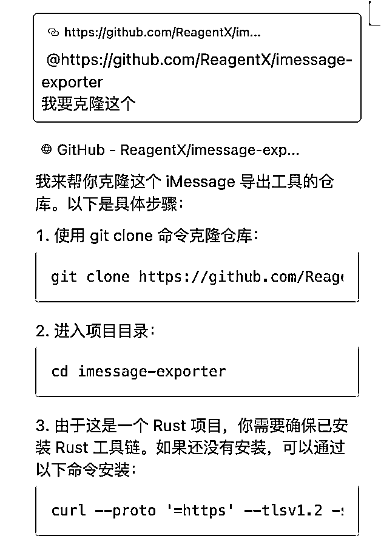

# 龙珠悬赏｜海外情侣关系诊断-聊天记录可视化

> 来源：[https://ewtk6agpo4c.feishu.cn/docx/ZYTldUeUuoQI77xUqMhcmaCRnzh](https://ewtk6agpo4c.feishu.cn/docx/ZYTldUeUuoQI77xUqMhcmaCRnzh)

大家好，我是Cheer（林悦己），本期的 ai编程变现，我的应用是：“情侣聊天可视化报告”。23年6月有一个网站推出了微信聊天记录可视化报告的项目项目，我对标了他们的内容以后，决定制作：

海外版 情侣聊天记录可视化（非中文）

目前已经完成mvp版本（还没能来得及部署上线），整个过程都是借助github开源项目和cursor指导完成，完成下图的成品耗时20个小时。

导出数据--->数据清洗--->数据可视化--->数据分析--->排版出报告

全过程均由代码解决！

文章内容主要包含以下几个方面

1.  对标产品分析

1.  自己的产品思考和计划

1.  实际操作步骤记录

1.  冷启动宣传0-1

1.  未完待续（未来计划）

1.  cursor使用小技巧（尤其是绘制流程图）

# 一、对标产品

对标应用：网站 https://www.polochat.cn/

一句话介绍：上传微信聊天记录，ai根据文字内容用sci论文的方式生成一篇“恋爱论文”

ai应用点：数据分析聊天记录，可视化输出report

预估该产品开始时间：2024年6/7月

btw：写这篇帖子的时候还发现了个类似的产品（https://memotrace.cn/doc/），不过这个产品内容会更丰富，没有集中针对情侣这个单一品类。

## 产品流量：宣传和运营

### 1.1 小红书：官方+素人

polochat关键词：42篇相关笔记

官方账号：polochat

*   粉丝：8598

*   笔记：9篇

*   最高like：268

几个素人号发布软文推广

### 1.2 微信端搜索：聊天记录可视化

### 1.3 公众号：跑跑跑科技

发布内容：14次

10月份服务器崩溃

## 对标产品变现情况

小红书8K粉 70%的转化 5600人

10月网站因为访问量太大崩溃了，我问了gpt这个问题，且估1000人同时在线

盲猜 实际使用应用人数应该在10000以上

单次使用9.9元，盈收应该超过10万

## 对标产品迭代

10月份出现一波高峰期，导致后台的服务器垮掉。

从最开始的微信到后来的qq聊天记录；

从提供windows版本到mac版本也能搞定

# 二、自己的产品思考

最开始我的想法是“我可以更换目标人群，保留了聊天记录可视化这个根本的卖点。”有想过是“群聊天记录的可视化”，甚至还想调研运营群的朋友们都有什么需求。

但是当我开始下手做这件事儿的时候，一个idea出现——我可以做英文的啊！做出海啊！

这个产品的研发和持续说明就是有很多情侣or人群有这个方面的需求，既然中国人有这个需求，那外国人也应该有类似需求！

这类人群这个对标产品已经帮我验证了他们的需求，我干嘛还要再另辟蹊径呢？

于是当即转换思路，应该还是继续做情侣的可视化。

他们做微信qq，我就做外国人的“微信”和“qq”啊！比如whatsapp，iMessage，Instagram，messenger，甚至还有一些恋爱app比如tinder啥的。

就这样一个大体的方向搞定了。聊天可视化对于专业领域的我来说都不是什么难事儿，最麻烦的就是，如何把这些平台的聊天记录导出来！秉持着快速搞定的原则，我决定“近水楼台先得月”，直接拿自己现成的文本开始做实验，渠道就从iMessage开始。

背景信息：我本身就是用iMessage跟我的dating对象聊天的，也已经有两个多月的体量了。

# 三、实际操作记录

先花9.9去download一份别人的report

因为懒惰，导出微信记录好麻烦，安装好多东西，在第一步就放弃了，于是直接去小红书看他们po的内容画面以及他们的官网给出的目录页面。

理论上来说，应该去看别人的成品，然后去拆解和对标......

## 1\. 下载一份聊天记录

根据初步的计划，我是得下载imeesage的聊天记录，于是我去全球最大的同性交友网站github 搜了“imessage export”找到了star最高的项目，在cursor内部把它克隆了。

实际上，我完全看不懂这个项目到底怎么操作，但是根本不重要，cursor会。我直接把它链接复制到cursor，告诉cursor克隆！

BTW：所有流程图是全部做完以后让cursor根据代码和逻辑生成的，最后有教学。

接着让cursor在项目内部操作，帮助我下载我的imessage conversation。过程确实有点曲折，但是最后成功找到了我需要的这个数据源头，他是一份txt文件。

要点

1.  GitHub真的比想象中的还要牛皮！

1.  尝试使用 英文关键词

## 2\. 开始step by step 生成数据和图

我应该下载wechat聊天记录然后让对方给我生成一个模板，接着像素级拆解，但是我抠门和懒惰，直接去看了她的report 目录，大概了解了她的思路以后，直接行动。 原文report有4个板块，mvp只选择了第一个板块作为复刻和实现。

### 2.1 数据清洗和提取

每一个渠道导出的数据都有自己的结构，这一次我是直接告诉cursor，她的组成结构，让cursor能更加快速的给出提取数据的解决方案和代码。

### 2.2 根据数据进行可视化

这中间经历了非常多的代码调整和修改过程，具体的就不放给大家了。关键的是，我自己需要非常清楚需求，让cursor绘制什么图，图里面有什么内容，这个需要专业知识和经验。主要是3个板块

Tips

不要一步到位，慢慢来拆解，一个part一个part的完成！

## 3\. 数据和图搞定，整合

我其实不知道到底该如何实现“排版”的，用python拆数据，做图，是我熟悉且了解的领域，但是最后生成一个pdf版本，到底该怎么做呢？我不懂，所以我让cursor告诉我“实现路径”，去了解他的思路和可行的工具，并且让他逐步实现。

cursor又帮我突破了我的边界，看到了新的东西，排版工具（除了生孩子，还有什么是代码实现不了的？）

在排版的时候 就出现了非常大的问题，软件安装。。。5个小时以后，终于搞定以后，首次pdf出现，不看内容确实还不错。现在的问题就是 分析内容是它自己写死的，并没有根据我的数据和图表的内容来撰写。

## 4 提取内容，调整pdf

1.  让ai把bullet point 修改为连贯性的叙述语言

1.  调整整个版面是期刊的样式

在cursor内部一直搞不定，然后就去gpt问了一下 让gpt给了我期刊的双栏排版Latex的样式，给cursor参考

最后完成了pdf排版（最上面看到的图）到此就算是跑通了本地端的搭建0-1。

## 5 梳理过程

整个项目的完成耗时大概24个小时。（20个小时是本地端出pdf，4个小时是制作一个导出imessage的软件给用户）

一开始只有一个整体概念，一步一步完成每一个part，最后整合在一起修改，我希望能够其他人呈现整个迭代过程，于是我让cursor帮我梳理我的迭代过程。

梳理了项目迭代过程txt，问题解决的timeline md，整个制作过程的流程图

为了让迭代过程和时间线更加“可读”，我又做了 流程图。（感谢 告诉我这么好用的东西，必须用回本！）

## 6 让cursor给出部署解决方案（仍在进行中）

### 6.1 export iMessage 让用户自己实现（mac电脑）

这个页面就是最后实现的，让客户双击安装，给予权限然后导出iMessage。

一开始这个代码是我在GitHub上搜索关键词找到的一个仓库，但是我自己完全不知道如何使用，于是我的操作是让cursor给我克隆到本地，然后让他学习readme，执行。现在整个mvp搭建完了以后回到最开始，我不能让我的用户也去用cursor然后导出吧！

如果用户要使用，就必须给他们一个简单（无代码）的下载方式，所以我把我的需求给cursor表达，让他给我实现路径，并且按照实现路径完成。

中间出现各种问题，然后不断套娃2小时后，冷静，放弃，从头开始。

1.  检查本地的文件是不是还运行ok（结果是果然被修改的不ok了）

1.  本地的修改好，告诉cursor复制一个制作成打包文件，实现用户下载-安装-出现界面-选择需要内容-导出

1.  完成

1.  上传github，让用户可以直接下载 （github直通车）

btw：目前只写了mac电脑，得继续完善iphone手机的操作。

### 6.2 接入api，让ai可以完成分析过程（not yet）

### 6.3 部署项目到网页上（not yet）

# 四、冷启动0-1

## 目标市场和产品定位

目标市场是英文语言的市场，其他语言，暂时不考虑。之所以选择海外是因为国内定价太低了！！！！9.9，有什么好卷的呢？国外一份report19.9刀，不香么！

目标群体：年轻的情侣

产品定位（顾客为“什么东西”而付费？）

*   好奇心/有意思

*   想看看自己的关系是否积极/健康

*   想从数据分析中找到一些“答案”（这个需要继续洞察真实需求）

## 渠道推广

初期的目标人群，准备找： 在和外国人恋爱的中国人

因为海外的搭建和推广没有那么快，只有这个群体是目前立刻就能接触到，且有渠道能触达和挖掘的。

### 小红书(iMessage出发)

1.  本身小红书就有一个可视化的大号，所以会用大号的内容，发笔记说有这么个东西

1.  因为mvp用的是iMessage，所以已经开始在小红书上搜索关键词，iMessage的笔记在相关帖子下面留言

1\. 广告位：告诉大家有这么个事儿

2\. 观察评论区大家用iMessage的情况，以及其他洞察

### 推特（直接发帖）

1.  推特X，用推特发帖子说这事儿，看看大家有无讨论

1.  在推特的各种恋爱，可视化，数据分析等相关小组里面挖掘需求

昨天发了X以后，收到一个回复询问我iMessage怎么导出，直接甩了自己做好的github链接给他

### reddit（相关小组）

这个东西，暂时还不太会用，只是发现了有非常多的小组，目前思路跟X一样，先去相关的小组里面发内容以及挖掘需求。

# 五、未完待续

## 不足和缺陷

*   客户需求挖掘并不充分

好奇是一个点，但不足以支撑，需要继续挖掘和洞察情侣对分析聊天记录的需求

*   海外市场不熟悉

出海的任何，都非常之陌生，都需要学习和从0开始

## 没做完也要发

这个项目，我完成了第一版的mvp以后非常兴奋，出海+自己专业领域+被动收入

这3个点，完美的打在了我的心上，虽然知道这件事儿还有很长的路要走，无论是否有人投资我or投资这个项目，都会继续做下去。

赶紧发帖子，也是因为我知道，不能再拖了，早点发布帖子以后，给大家留点点赞的时间（bushi）

## 后续to do list

1.  解决上面遗留的两个问题

1.  学习出海必备知识

1.  搭建网站

1.  海外宣传

1.  挖掘需求

1.  迭代产品

# 六、cursor使用小技巧

## ReadMe 用起来

由于项目比较复杂，每一个小的part我都会让cursor写一个readme，梳理文件框架以及整个小的part是干什么用的。同理每一个小的part都有readme，最后的整个project当然也是需要的。

## 梳理解决问题和迭代过程

我们在跟cursor对话的过程中，如果时间跨度特别大，尤其是每天一点点进度是很容易忘记之前干了什么，而且我自己也想梳理一下思路，感觉有些地方是可以提前做，有些地方应该一起做。所以干脆让cursor根据对话整理我们的timeline（时间线），也可以绘制流程图（下面有教学）让自己能更快速了解整个发展路径，下一次，或者说接下来可以怎么调整。

## 绘制流程图

终于到了我们的流程图系列，上面用到的所有流程图都是在写帖子的时候 现画的，因为这个功能是昨天 time老师告诉我的！！！！

### 3.1 设置流程图的“参考库”

打开cursor，右上角的“设置”（setting）

看到左边的“features”点击

滑倒最底下有一个“文件”（Docs）

这里按照time的说法和我自己的理解，就是一个参考库/说明书的东西，可以给cursor参考这个内容进行一些操作。

点击“add new doc”（添加新文件）

把这流程图的链接输入进去（https://plantuml.com/zh/activity-diagram-beta）

### 3.2 使用参考库

在composer的对话框里面，直接输入需求，然后“@”我们的参考库，具体如下

# 碎碎念

兴趣是最好的老师，也非常感谢亦仁用了外部激励去让这件事儿发生的更快。

感谢cursor帮助我实现了我的想法，做产品，很难，但是也没有自己想象中的那么难。

整个过程，接触了新的东西，突破了能力边界；拿到mvp结果的时候，人是兴奋的，正反馈极强。

“不懂就问”

我的意思是，让知道的ai告诉你，它是怎么想的，即使看不懂代码的意思，但仍然可以学习解决问题/思考问题的路径。

如果你觉得整篇文章对你有帮助，求求你去原文点个赞吧！