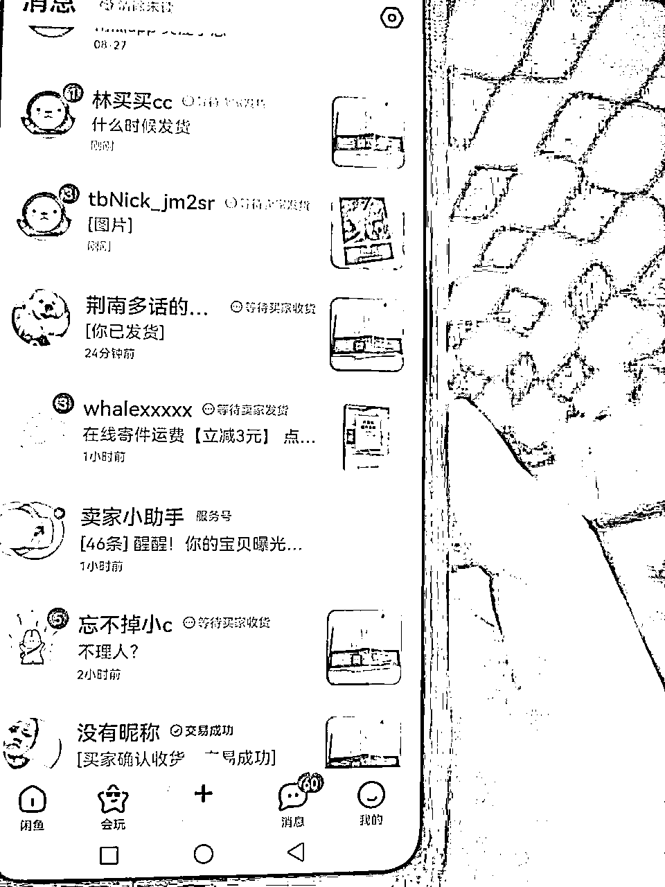
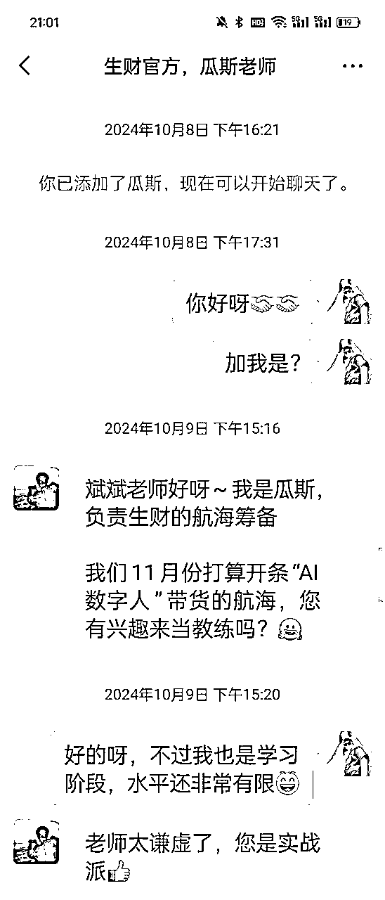
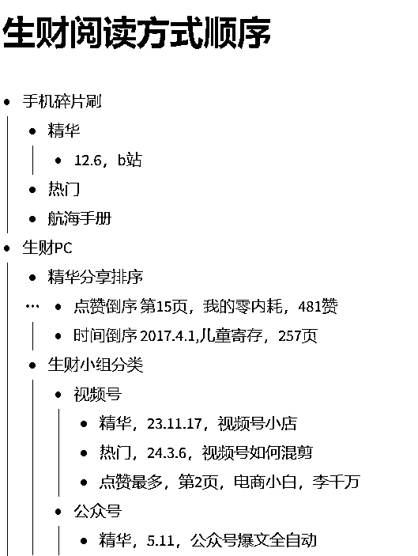
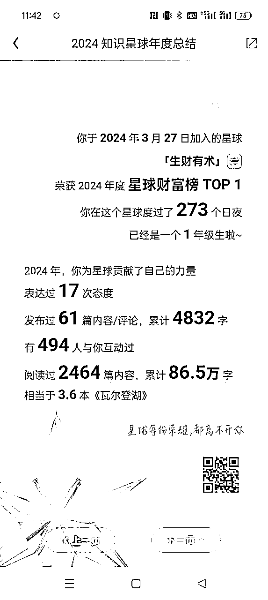
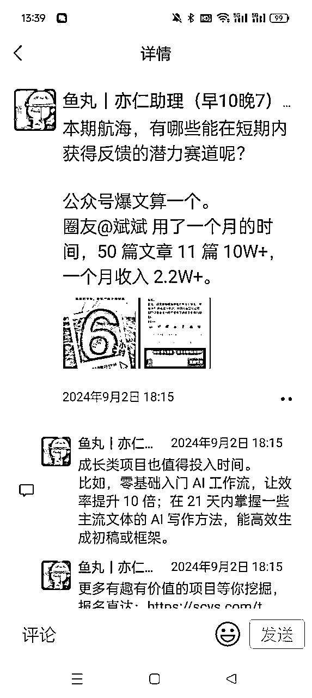
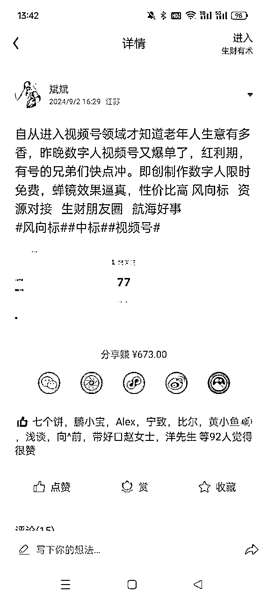
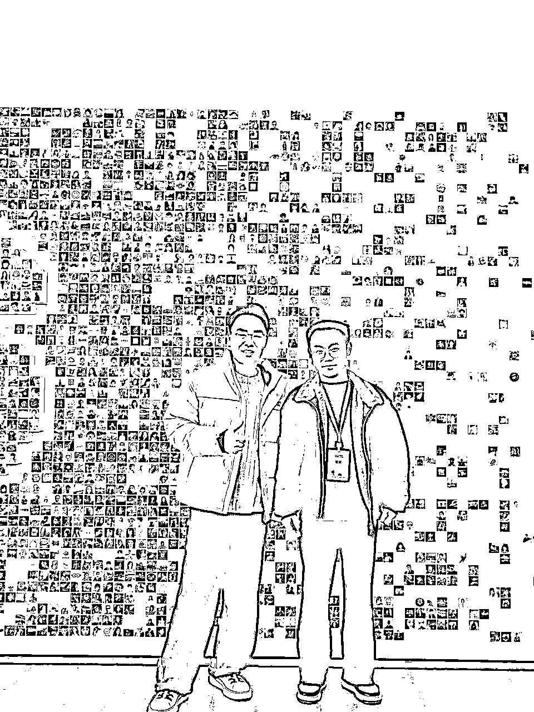

# 副业小白加入生财半年多，跑通多个项目并且成为航海教练，我做对了什么？

> 来源：[https://zqqtm0kx8fq.feishu.cn/docx/ZevcdumOLoxFTcxDizRcN07LnHg](https://zqqtm0kx8fq.feishu.cn/docx/ZevcdumOLoxFTcxDizRcN07LnHg)

## 一、自我介绍

大家好，我叫斌斌，是24年4月加入生财的，最近半年做的所有项目，我团队90%以上的伙伴，都是在生财链接的，真的很感谢这片孕育财富的土壤，写下这篇文章，一方面是对自己做个复盘，另一方面是想和大家分享碰撞。

说自己是副业小白不过分，因为加入生财之前3年，我没通过副业赚到过钱，尽管做了很多尝试。

下面先汇报下我加入生财做的项目：

### 1、闲鱼二手书

自己看航海手册实操的，差不多一个月赚2000，躺平式卖书，无售前，只发货，后来感觉售后退货太浪费时间了，就停了。

### 2、公众号爆文

先是看航海手册实操，后来跟着公众号爆文航海一起前行。

写作第二篇文章10万+，连续50篇文章自然推流11篇10万+，累计收入6万左右，其中细节感兴趣的朋友可以回看精华帖：https://wx.zsxq.com/group/1824528822/topic/8855214152245212

### 3、视频号带货

参加了5月份和7月份的视频号口播带货，从此深耕视频号赛道，单日最高近万佣金，成立了150人的线上打品团队，并且很荣幸被瓜斯老师邀请，开展24年12月的数字人视频号带货航海，成为教练，0-1编写航海手册。

4、淘客2.0内测项目

前期链接上了生财一个大佬，正好在淘宝官方内测期加入了这个项目，目前团队规模300人。

## 二、自我复盘：我做对了什么

### 1、大量输入

生财的内容真的是太干了，是因为共创的机制、社群价值观长期形成的。

我是如何看内容的？

答案是：遍历阅读。

利用所有可能的 时间，包括整段的时间和碎片化的时间，遍历阅读。

首先，我会把板块进行分类，其实官方已经帮我们分好了：精华帖、航海手册、风向标、生财小组、资源对接...

因为内容实在太多太多了，我们根本不可能整块时间看完，所以需要分类断点续读。

很多人看书，永远在看第一章，这是不行的，我们必须有规划有节奏的，从上一次看到的位置继续往下看。下面就是我最新的阅读进度的记录：

图中手机碎片刷就是利用碎片化时间阅读，生财PC的意思就是用电脑登录索引站进行阅读。

精华帖我的阅读策略：

*   整段时间会坐下来打开PC端索引站，按点赞从高到低排序，逐篇阅读。因为这些都是圈友用点赞投票出来的作品，某种程度来说，点赞越高，含金量越高。如果用手机看帖按点赞倒序非常不利于从中间帖子看，电脑会打开新的页签，不会断层。

*   按时间倒序看，越老的帖子我越喜欢看，因为很多的推断时间已经证明了对或者错，我会想一想那个时间阶段我在干什么，文章中的预判实际验证了对不对，底层逻辑有什么不变仍然可用的地方...

*   手机我会用微信打开索引站，按每个月的1号开始往后看，记录看到的时间和标题进度，因为帖子一直在更新，我如果只从最新开始看，就容易有遗漏，这样每个月的帖子都可以遍历。另外，微信的缓存功能真的做的好，最小化APP被别的事打断后重新打开仍然是之前看到的位置。

*   遇到了需要决策的地方，我会停下来思考，如果是我会怎么决策？为什么？我的想法做法和他有什么不同？是否有可优化的空间...通过不停地自我发问和对比来强化提高自己的商业认知。

*   看到醍醐灌顶的帖子或者细分赛道的牛人，我会去关注这个人，在合适的时机去链接和遍历阅读他的帖子。

航海手册阅读：

*   这真的是精华中的精华，是官方筛选出来的适合普通人实操的项目，我会把一些近期对我比较有用的专题发给自己的微信并且置顶，方便随时打开。

*   长时间读航海手册可能有点乏味，读精华帖更像爽文，因为航海手册不是用来读的，是用来实操的执行手册。

*   航海手册中有个高手领航板块，非常干货，比航海手册讲解的更加深入，是一种对航海手册的补充讲解，点开登录飞书后，就会保存进飞书APP的“飞书妙记”板块，可以断点播放，并且可以“”播客模式“”进行听视频，我几乎走路跑步的所有不方便看的时候都在听。

资源对接、风向标：因为周末不能发帖，我会在周末的时候把本周风向标和资源对接从上到下刷一下，蕴藏着非常多的宝藏，有启发的或者可能链接的都收藏起来。

上次大家在传术师群里公开自己的知识星球年度总结，查了下我今年在知识星球生财社群的阅读字数是86.5万，其实我大部分阅读都是在索引站，并没有统计在内：

### 2、形成和完善框架

每个人都有自己的一套商业逻辑和框架来判断一个项目，甚至可以说相差甚远。

我想这就是为什么有些人能一眼洞穿本质，有些人分析半天还在项目外围打转。

我觉得每个人都需要有自己的一套框架，不停的修正和完善。

例如亦仁老大分享过，商业的最小闭环就是：产品、流量、转化，所有的项目都可以拆解到这三要素进行填充。

我之前学习营销，也形成了自己的框架：抓潜-成交-追销。

抓潜可以从小红书、视频号、抖音等各个平台去抓取潜在客户，这些内容平台只不过是抓潜渠道之一，抓潜还涉及我给对方什么，我要对方做什么，或者说鱼饵，付钱也是一种动作，这是我脑海中的框架。

例如公众号爆文项目，爆文项目的成交就是对方有浏览点击文章中插入的广告。如何追销？对方成为了自己的粉丝，持续不断地阅读文章，就能持续的浏览点击广告产生收益。

那么对方为什么要关注？需要给对方一个理由，最好是一个无法抗拒的理由，例如我会持续日更干货文章，会解决他的情感难题，等等。

再比如视频号带货项目，如何加速成交？需要塑造产品价值、需要塑造稀缺性和紧迫感。

拿七白饮产品举例：

*   由7种天然谷物酿制而成。这是从成分塑造价值。

*   经过七七四十九道工序手工打造而成。这是从工序流程塑造价值，像是车企广告看车间生产过程，透明厨房看菜品制作过程，也是一个道理。

*   每100克相当于喝3杯天然纯牛奶。这是通过比喻类比塑造价值，因为人们只会对已知事物有感知。每天只要花1块钱，就可以拥有健康的身体，就可以容光焕发...

*   最后10分钟主播就要下播了，就不卖了，这是紧迫感。

*   最后10单优惠价，卖完就恢复原价了，这是稀缺性。

一个又一个的项目的提炼形成了框架和树干，然后完善框架，开枝散叶，不停修正，不停成长。

从案例中来，到案例中去。通过一个又一个的案例帖子总结沉淀成自己的框架，不断地打磨完善。

到一定阶段，就像戴上3D眼镜看项目，直抓核心，看透项目成功的核心到底是什么，除了红利的原因外，是抓潜渠道切入的好？还是测试放大策略巧妙？什么环节可以优化的更好？

这样，才不会完全被项目带着走，每次都是全新，每次都从头再来。总会有些东西是共性的，是不变的，抓住这些东西。

也许，这就是所谓的网感吧。

### 3、抱团实战

何以生财，唯有实战。这是生财的口号。

原因很简单，做了才可能有结果，不做什么都不会发生。

只是执行过程中会有很多阻力，例如我还没准备好，我没有启动资金，我没有时间...

各种各样的理由、借口、阻力，需要我们去一 一克服，只需要记住一句话：做了才可能有结果。

今天的重点不是讲实战，而是抱团实战。与抱团对应的，是自己搞，自己摸索，是单打独斗。

一个项目要想跑通赚钱，会有一些核心环节，每个核心环节又会有很多个小环节，每个小环节还藏着不少坑。想自己完全摸索跑通，实在太难太难了。

就像多米诺骨牌一样，每一张骨牌就像一个环节，推倒最后一张骨牌才是跑通变现。每一张骨牌需要有合适的高度，需要和前后一张骨牌有合适的宽度。

也就是说每张骨牌长度间距是有标准的，每个项目环节是有执行标准的，不是随便做一下就行的，项目的摸索期，就像是蒙上双眼玩多米诺骨牌，成功是福气，不成功很正常。

大部分的常态是：做过很多项目，因为一个环节卡住了放弃了，因为一个问题解决不了然后就搁置了。例如数字人视频号项目跳人脸验证了，不知道怎么申诉，这个号就放弃了。多个号出现这个违规，这个项目就放弃了。

其实，有办法可以申诉，成功率还蛮高，只是自己不知道。但是有人会知道，只要别人一句话，这个坑就可以填上了，这是抱团的意义。

做项目的很多环节很多坑，别人都踩过了，互相杠杆借力多问问，就会产生巨大的价值，跑通的概率就会成倍增加。

尤其是市场瞬息万变的今天，一个项目一个玩法可能仅仅几天就发生了巨大的变化，抱团共享这些资讯的价值，共享最新的玩法，去避免团体反复的踩坑。项目无法穿越周期，但是不断前行的团队可以。

例如生财这个圈子就是一种抱团，共享最新的风向标资讯，知晓最新的搞钱商机。

航海是一种更深层次的抱团，大家一起实战，有航海手册和教练指导实战。跑通一个项目是不容易的，无论别人说的天花乱坠，除非自己拿到结果，或者亲眼目睹像自己一样的人拿到结果，这时候才会坚信这个法子是可行的，更有信心和执行力，进入正向循环。

随着不停的深入，抱团的圈子也需要不停的迭代和提升，同一水平层次的人才能一起碰撞出更多有价值的东西，否则就变成了单向输出，不持久。

### 4、越分享，越幸运

在互联网时代，需要链接才能产生价值，链接的前提是别人要知道自己，认识自己，知道自己是干什么的，能干什么，才有可能链接。

那么分享就是最好的方式。

因为分享公众号爆文项目心得，我拿了精华帖，链接到了很多写公众号的牛人，博采众长，以前一小时完成一篇文章现在只需要10分钟。还得到了鱼丸的转发：

因为分享视频号数字人风向标，中标并且受到了几百个圈友的链接，我们一起搭建了百人线上打品团队：

因为分享帖子：免费带领百名圈友做视频号数字人带货，变现率30%+...https://t.zsxq.com/VpaX3

瓜斯老师找到了我，开展12月份数字人视频号带货航海...

由于之前的分享，被邀请进入传术师群并且参加了线下聚会，有幸和亦仁老大以及神秘大咖合影：

在传术师聚会上，亦仁老大有个分享主题就叫越分享越幸运，正是因为自己写了分享文章受到曹大的转发，很多人希望经常看到类似文章，才有了生财有术社群的成立。

明白老师分享正是因为自己持续的分享，得到了涛哥等一些大佬的转发，才有了现在的成绩。

现在我看了差不多500篇精华帖，也认识了很多人（虽然对方不认识我，也没见过），但是我大概知道谁擅长做什么，有什么资源，有需要链接的时候我会第一时间找对方。每一篇真诚利他的帖子背后，都是一个活生生有血有肉的人。

无数的例子证明：越分享，越幸运。

最后，再次感谢生财这个平台，让一群想搞钱的人聚集在一起，迸发出了更多能量，让我这种迷茫的人也有了明确努力的方向。2025，一起生财有术。