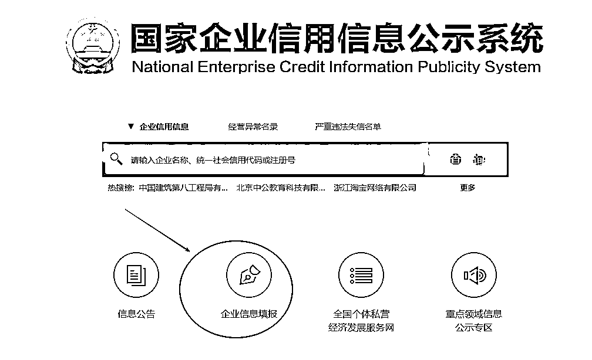
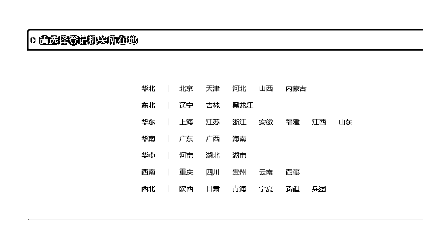
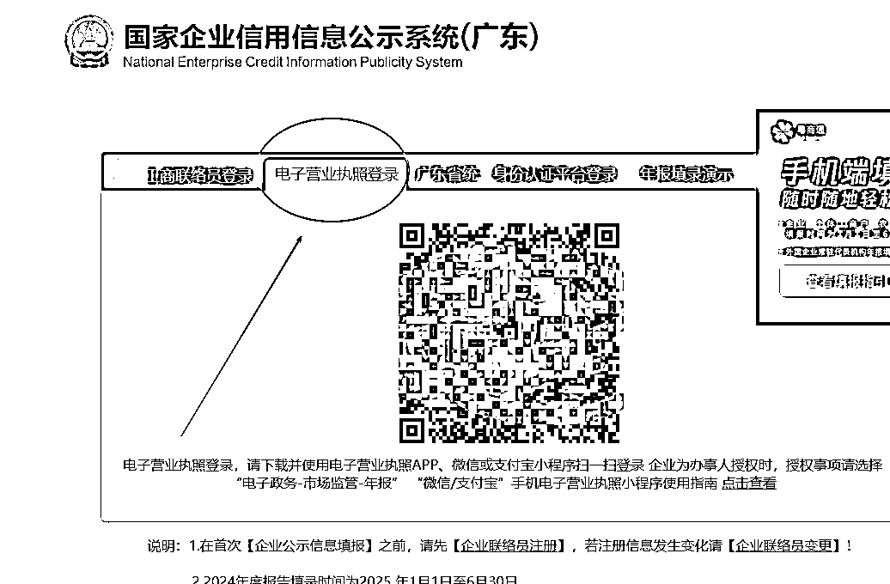
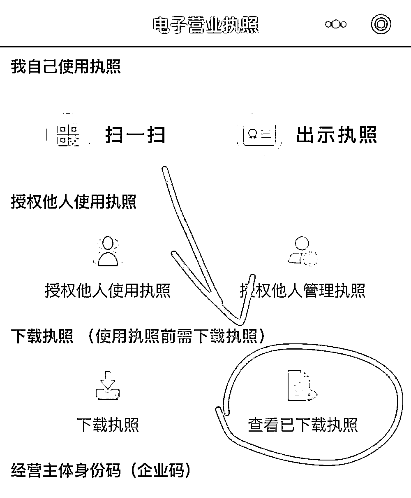
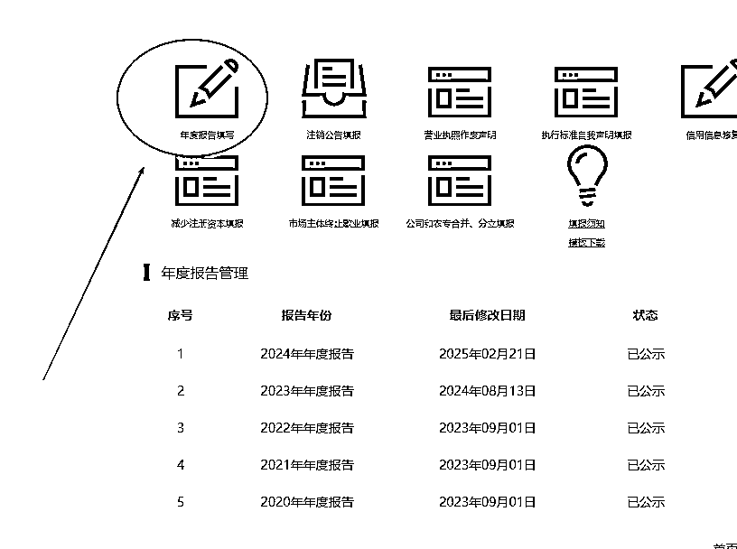
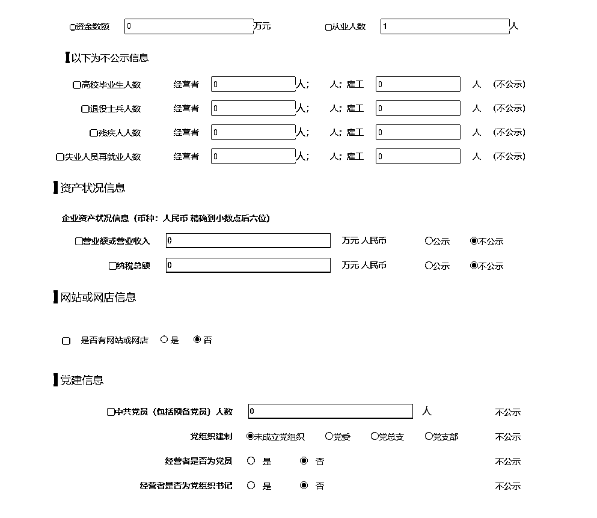

# 个体营业执照最快年报-年审流程，2-5 分钟搞定

> 原文：[`www.yuque.com/for_lazy/zhoubao/lwlnwqbu3qm9mbhg`](https://www.yuque.com/for_lazy/zhoubao/lwlnwqbu3qm9mbhg)

## (48 赞)个体营业执照最快年报-年审流程，2-5 分钟搞定

作者： 桔

日期：2025-02-21

🍊营业执照每年 6 月底之前都必须年报，否则可能导致异常，之前基本都是联络员或其它登录方式，经常各种登不上去，今年用最简单最快速方式，2-5 分钟就可以搞定营业执照年报

1.先进入国家企业信用信息公示系统，点击企业信息填报

网站：[`www.gsxt.gov.cn/`](https://www.gsxt.gov.cn)

2.然后选择你的执照所在省份

我选择的广东，可以看到多种登录方式，我们点击 电子营业执照登录。

这个登录方式是最快捷的，如果你的电子营业执照小程序里面没有对应执照，首页点击查看已下载执照，最下面添加新的电子营业执照，人脸后就可以选择对应省份，从而添加执照了。

然后重新扫码登录国家公示即可。不同省份进入后页面可能不同，但是都会有年度报告填写，点击去填写。

下面是我一直写的内容方式，仅供参考。

结束~

​

* * *

评论区：

大河 : 都填 0 可以吗

时代 : 麻烦问下如果社保交在自己个体户名下，是否可以 0 申报

桔 : 建议咨询当地专业财税公司，我的杭州社保最开始交在个体 也是开了对公户的，杭州这边 0 申报交社保 貌似不可以。

时代 : 谢谢哈！正好就是想问问杭州的😂

不懂就问 : 找别人办的营业执照，商家现在好像倒闭了，这种能用这个办法搞年报嘛？

三生 : 法人是谁

三生 : 如果报社保话，没有收入话，要负申报，可以问问 ai

不懂就问 : 我自己