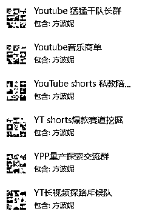

# 致未来黑暗中的我，三个月以来的创业感悟：分享、链接、“弱关系”的贵人和愿力

> 原文：[`www.yuque.com/for_lazy/zhoubao/ppmh1u8fvy36yysg`](https://www.yuque.com/for_lazy/zhoubao/ppmh1u8fvy36yysg)

## (精华帖)(117 赞)致未来黑暗中的我，三个月以来的创业感悟：分享、链接、“弱关系”的贵人和愿力

作者： Gary

日期：2025-02-19

12 月底在杭州传术师线下活动的时候，听到亦仁和明白老师都有提到一个概念“弱关系”，原话不记得了，大意就是，往往能给你直接带来跨越式提升或者启发的贵人都是“弱关系”，不是你身边的亲戚朋友。当时听到觉得有道理，毕竟开启 YouTube 业务的尝试是基于亦仁老大的超级标和波妮竹子的精华帖，但没有很深的感悟，因为在当时觉得这些帮助没有到“跨越式提升”的程度。

但是时至今日（其实也就过了不到两个月），终于深刻地感受到了曾经“弱关系”的贵人们对我的影响有多重要。

如果不是跟吴国潮打瓦认识的林老板，就不会有 12 月份的油管云创（借朋友资源做的社群共创项目），关于私域和 IP 的尝试压根就不会启动，也就不会踩到培训的坑，也就不会有后续去杭州参加活动链接资源的想法，也就不会在活动现场克服心理障碍自我介绍吸引到亦仁老大的关注，也就不会后来所有的故事。

如果不是恰巧安排了波妮和我配合私教陪跑，持续地在关键时刻点醒我、提供各个方面的凭我的性子，这次私教陪跑可能不会在第一版的基础上做任何调整，长达接近三个月、价格偏高的重交付很可能把我的精力和心力消耗干净，也不会有机会去尝试这么多新的赛道和机会，也不可能承接这么多不同赛道的学员，也不可能跑出现在可以说是离谱的陪跑结果，也不可能链接到现在的这些资源，也就不会有未来的无限可能。

如果不是在生财写了一篇精华帖，怅惘就不会从他朋友那里看到我，就不会加到我的微信，就不会有后续我们一起研究达人秀的机会，就不会再进一步推荐他的朋友遇见进群，也就不会发现动物示警赛道的玩法，也就不会有后续私教陪跑我们领先一个版本的赛道理解和视频制作技术，也就同样不可能让这么多学员拿到结果，也就不可能有现在的这些资源和机会。

在这短短的三个月里，还有很多很多“弱关系”的贵人，包括老马、社群里的、私教陪跑的、生财团队的、生财圈的、小挣青年的，保护大家的隐私就不一一致谢了，真的非常非常感恩这些看似很“弱”的关系，却恰恰给我提供了偌大的帮助，让我度过了无数个精神和行动上的难关。

**曾经我一度很怀疑所谓的“利他主义”是不是真的好人有好报，所谓的“分享”是不是自嗨，但是走出来才发现，之所以很多期望得不到回应，是因为你的期望生长在错误的环境、播种在错误的人，并不是你的期望本身有错。**

**  **

记忆开始闪回

10 月初，尝试很多方向未果，当时很迷茫，本能地不想去上班，但是不上班也真的没做出什么有价值的结果，没有环境、没有圈子、没有希望，实际上也已经在找工作了，只是没找到合适的。（附图是某运营商的一个算力生态产品岗，面试谈的好好的，说很合适尽快安排二面，结果后续石沉大海杳无音讯）

11 月初，看到超级标，看到实操贴，摩拳擦掌，觉得自己又行了，经过慎重的选择和摸索在油管发布了第一个视频，第一个就有了万播，但是那会对于播放量没有任何认知，只是看到一晚上多了几十个关注，很开心。 images.zsxq.com/Fp3vn_Il6Vs2R87Ia_3hLw1VWB_9)

11 月中，油管尚未有起色，但是视频号大爆，3 天万粉，突破千万播放，久违的正反馈袭来，一下子有了干劲，链接到了林老板，主动联系起了一些有国内视频平台运营经验的朋友交流。

12 月初，总结方法论，挑时机在航海开始的阶段发布了第一篇生财的帖子，成为了精华帖，意识到机会来临，主动开始加势能杠杆。

12 月上旬，因为精华帖，被生财邀请进行高手领航直播，同时也算是半个航海教练，为后续公域直播和付费链路的测试打下了非常重要的信心基础，也让我自此多了一个重要的背书——生财航海教练，摆脱了纯小白身份。

12 月中下旬，借林老板的资源，背靠航海教练和精华帖作者的 title，开启云创（朋友的一个社群共创项目），招募到了超 50 人的免费引流团队，为我不成熟的知识付费链路测试，一周内拉到了 300 多人的私域群，转化了 4 位 998 学员（其中两位被我主动退款，一位退了一半，一位已经开通 YPP），跑通了业务闭环，但是我意识到交付存在严重的隐患（报名学员未经筛选，质量太差，基本无法实现交付），及时停止了进一步扩张和招生，为视频制作技能的精进以及参加杭州活动留下了时间及精力上的空间。

12 月底，一番思索之后飞去杭州参加传术师活动，这是人生第一次参加类似的线下活动，第一次近距离感受大结果者的场域（亦仁老大、李一舟老师、火火老师），认知层面收获颇丰，但最重要的还是在自我介绍环节，我这个非常极端的 I 人克服了心理障碍，站上了台做自我介绍，我说的原话是，我有 5 个已经开了或者快开 YPP 的账号（还算上了三个朋友），结果被亦仁老大听成了我有 5 个 YPP 账号；以及后续晚上散场时，看到亦仁老大一个人在办公室，我非常犹豫要不要去留个影，其实也没想到要聊什么，就是很喜欢亦仁老大的气场（不要脸的说，觉得亦仁老大的气质跟自己很相似...）来来回回纠结了起码十分钟，还是推门进去了，结果没想到亦仁老大居然记得我，因为我有 5 个 YPP...当时很不好意思地解释，其实是 1 个已经开了，剩下 4 个快开了...并没有意识到这个小误会给了我一次非常大的机会，现在回过头看，哈哈，我们已经 50 个 YPP 了。

1 月初，因为亦仁老大点名，欢欢联系到我来带队私教陪跑，当时其实心里也没太多底气，觉得起码像老马那样拿到大结果才能去带队，但是波妮和老马给了我非常多的信心，再加上 12 月其实已经尝试过一次完整的招生培训链路了，所以还是接下了这个当时看起来艰巨无比的任务。

2 月初，省略私教陪跑期间高强度的实操、直播、测试、培训和写作，和波妮熬了无数个夜，终于一起跑出了一套遥遥领先的玩法和同赛道断层领先的教程，陪跑学员的 YPP 开个不停，随着前几天复盘帖的发布和很多陪跑圈友高质量的分享，陪跑的前半阶段算是比较完美地落下帷幕。

 images.zsxq.com/FpS7wUgo14qJL87vSYsy4jsWQy8j) images.zsxq.com/FpEZ9ZVJhuU0dXqdUDtlr0WqzWCA)现在，集合了超过 50 个 YPP 账号，将近 5 亿的播放量，我们终于走到了一个崭新的阶段，YPP 的量产、油管带货、AI 长视频、音乐商单、营销联盟，这些充满希望和机会的方向清清楚楚地呈现在我们眼前，带着各位高手和同道们在各自擅长的领域里开疆拓土，今天是第一次，有了拨云见日的感觉。

我想，如果要给这三个月总结几个关键词的话，应该是：

1.  **分享（带来了幸运）**

**  **

1.  **链接（打破了圈层）**

**  **

1.  **贵人（来自于“弱关系”的链接）**

**  **

1.  **愿力（有不得不赢的理由）**

**  **

当然，这些还不算什么，说白了也没拿到大结果，但是这一次，我想任性地、骄傲地把这些写出来，不是想要炫耀什么，而是我逐渐意识到了**“越分享、越幸运”**
的含金量，逐渐意识到了要学会取悦自己想写就写，逐渐意识到了这辈子或许也不会再有几次这样的感受。

哪怕这条路我还是没走通，哪怕未来有更大的失败在等着我，这都不影响我要把今天的“拨云见日”之感记录下来，把这三个月的心路历程记录下来，**它一定能够在以后的某个时刻，激励到失魂落魄、无以为继的那个我，也希望能够激励到今天失去希望的你。**

**回头看，轻舟已过万重山。**

* * *

评论区：

六只猫 : 感动且鼓舞[666][666][666]教练 666

轻舟 : 昨天链接时的忐忑还记忆犹新，现在看到 Gary 教练的回顾和真情流露，这种感觉真的很奇妙

百哥 : 轻舟已过万重山

Gary : 主打一个真实

拾一 : 公众号里看了一遍，再来星球点个赞[强]

Gary : 哈哈哈，谢谢拾一老师！

Gary : [爱心]

Gary : 你也 666