# 我是怎样用 DeepSeek 写出知乎热榜第一、高赞第一爆文（超详尽复盘）

> 原文：[`www.yuque.com/for_lazy/zhoubao/qykafz27gzo4l030`](https://www.yuque.com/for_lazy/zhoubao/qykafz27gzo4l030)

## (精华帖)(139 赞)我是怎样用 DeepSeek 写出知乎热榜第一、高赞第一爆文（超详尽复盘）

作者： 马小帅

日期：2025-02-21

**大家好，我是网罗灯下黑的网黑哥，有些小伙伴可能也知道我。虽然来星球已经很早了，但是很惭愧，一直都是默默看帖，今天算是第一次给星球输出干货分享，这篇文章是我发在公众号的付费文章，数据很不错，现在分享给大家。**

事情是这样的，周二晚上的时候我在公众号上刷到一个选题素材，立马就决定加更一篇文章。

花了一个多小时时间， 9 点半发布出来，就是你们看到的上篇文章《[号外，马斯克刚发 Grok-3，DeepSeek
就贴脸开大！](https://mp.weixin.qq.com/s?__biz=MzU2NTAzNzYzMg==&mid=2247631660&idx=1&sn=498c6ac9fabcb0a1e4310d269441a45b&scene=21#wechat_redirect)》，同时，我把文章同步到了知乎平台上，当晚这篇就被顶到了高赞第一。

第二天，这篇文章所在的回答被知乎编辑到了热榜第一。

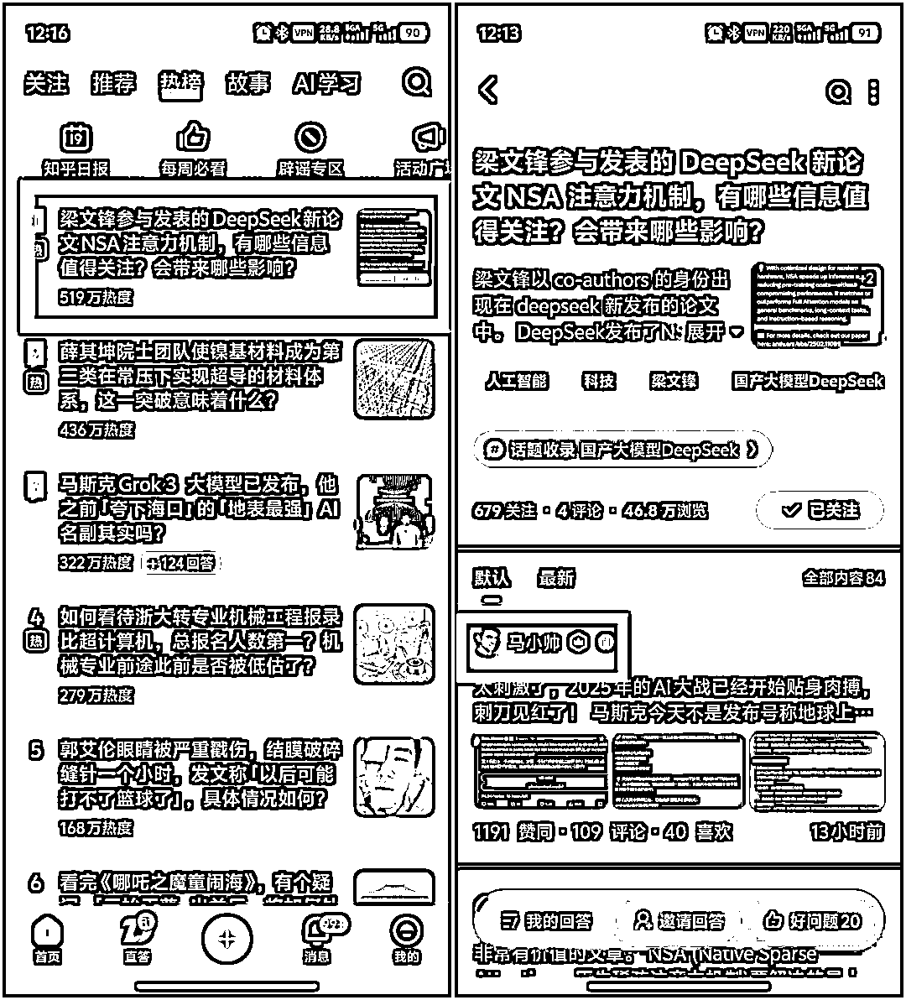

截止到昨天，这篇文章在知乎上的最新数据是这样的：

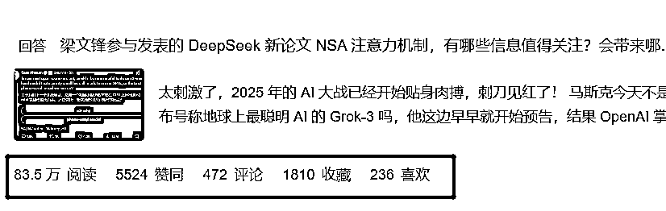

而在知乎这个同题回答下，还有很多人工智能专业领域的优秀答主。

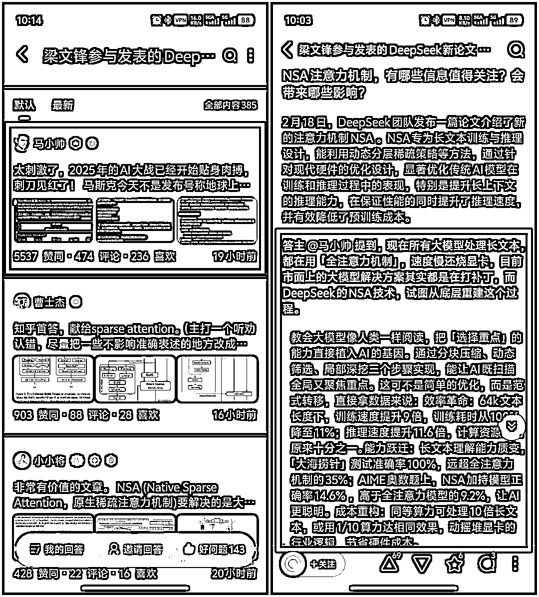

很惭愧，我的这篇回答却排到了第一，同时还被当天的知乎日报收录在内。

是真的很惭愧，还有点惴惴不安，并不是在凡尔赛。

我是在夸自己很牛逼吗？肯定不是。

牛逼的是 DeepSeek ，因为这篇文章主要是借助它来完成的，它让我一个人工智能专业的门外汉文科生，写出了这样一篇高赞回答。

你看，**这不就是 AI 放大普通人能力的活生生的例子吗？**

**  **

那么，在这个写作过程中，我做了哪些操作，或者说发挥了哪些主管能动作用呢？

接下来，我会给大家复盘这样一篇文章是如何写出的，包括如何选取选题，如何构思，如何给 DeepSeek
写提示词安排写作任务，如何后期编辑等全部心路历程，全部分享，毫无保留。相信对对 AI 写作有需求的小伙伴们看后一定会有所启发。

OK，开车。

**选题**

2 月 18 日中午，正是马斯克的 Grok-3 模型发布，当天下午的时候，已经开始有不少自媒体推送关于发布会的资讯，包括有概述发布会的，尝鲜 Grok-3
的等等。

这是个不折不扣的热点，但是对于个人自媒体账号来说，抢时效是抢不过一些机构的。

如果仅仅是对发布会流程简单介绍的话，那么写出来的文章就会和其他自媒体高度同质化，并且，要体验 Grok-3
还有一定的限制条件，不仅要付费，而且短时间内的体验只会浅尝辄止，这样的文章不是我想要的效果。

正在考虑这个热点该如何去蹭的时候，微信弹出了一篇《河南日报》公众号的文章，标题是《DeepSeek，新消息！》

打开一看，这是一篇近期 AI 动态的汇总帖子：

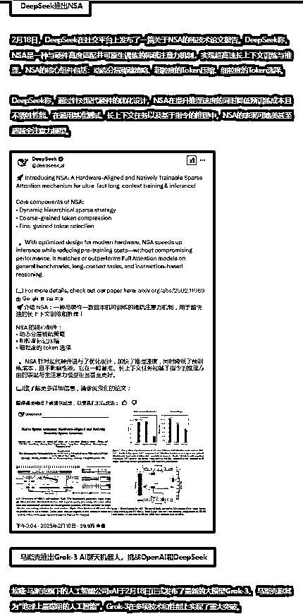

不难看出，这是一篇早就编辑好的文章，但临发布的时候，刚好赶上 DeepSeek 下午 3 点有了新动态，于是把这条内容替换了马斯克的 Grok-3。

大家都知道，**新闻新闻，越是新近发生的事实越有新闻价值** 。

这条推文的编辑认为，在下午 6 点这个时间节点，DeepSeek 新动向的新闻价值要大于 Grok-3 发布会。

实际上，确实如此，如果这时候弹出的文章只是 Grok-3 发布，我不会打开这篇文章。

有了这个线索，我就去 X 上找到了这篇帖子，评论区的声量已经相当大了，肉眼可见反响不错。

有个事实必须要点出来，DeepSeek 的 X 社交账号并不是很活跃，自 1 月 20 日发布 R1 后，到目前为止也就更新了两条，其中一条说的是接入 R1
后的参数优化设置，另外一条就是最新的这篇论文发布。

换言之，这是一个不太活跃的账号，突然发布更新，也就是说这件事并不常见，再加上发布的这篇论文内容本身就非常重磅。

来，捋一下：**新近发生的+并不常见的+轰动效应=爆款潜质**

**  **

这个选题非常值得做。

再多想一步，DeepSeek 的这篇论文显然不是刚刚才发的，但是公布出来却选择了 Grok-3 刚刚发布的时候，这明显是有意为之。

至此，关于要写的文章的题目和切入点已经有了：**马斯克刚发 Grok-3，DeepSeek 就贴脸开大！**

**  **

Grok-3 是今天的大热点，这个是一定要蹭的，但是这篇文章的重点是后半句。

这也是尽可能增加这篇文章能在铺天盖地的 Grok-3 推文中能脱颖而出的概率。

当时，我去搜了一下，微信公众号中几乎还没有任何一篇文章提到 DeepSeek 的新论文，那些我们经常看的 AI 自媒体都在忙着关注 Grok-3。

我又去知乎搜了一下，已经有了提问，也正是后来被编辑选为 2 月 19 日热榜第一的那个问题，当时这个回答下面只有 3 个回答，最高赞也只是个位数。

OK，以上就是写这篇文章时候的相关背景。

选题这部分之所以写这么详细，是因为爆款文章 80% 取决于你的选题。

**文章写得好只能保证你是高赞第一，但选题选得好才有可能成为热榜第一。**

**  **

对于大多数作者来说，当没有能力制造爆款（议程设置）时，一定要顺势而为，预先埋伏，才能出奇制胜。

**总结：选择大于努力**

**动笔**

**  **

这个时候已经看了一部分资料了，其实也有了初步的思路，自然是要先从解读论文开始。

先到找到这篇论文：[`arxiv.org/abs/2502.11089`](https://arxiv.org/abs/2502.11089)

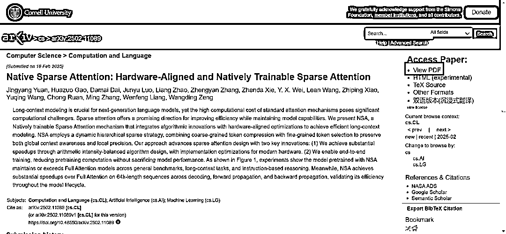

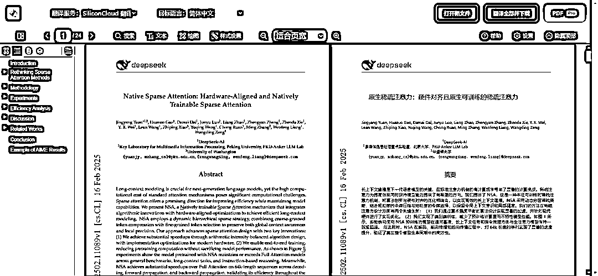

用沉浸式翻译看了几分钟，就放弃了。。。

这不是该我能看懂的东西。

必然还得用 DeepSeek
吧，我先到官网上，让它给我解读论文，同时我给它加了一句要求，要它来说明这项新技术会对下一代的大模型带来哪些能力提升，因为对大多数普通用户来说，大家不会关心论文写的啥，只关心它有啥用。

而我要写的文章也正是面向没有技术背景的普通用户，所以这一点不能少。

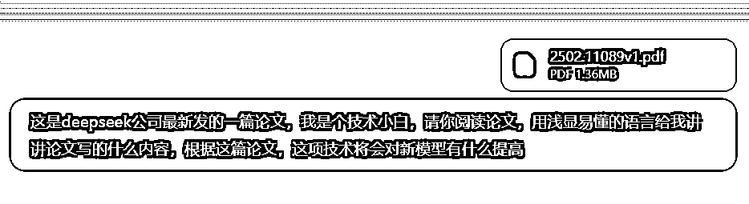

DeepSeek 官网给出的回答也就是在上篇推文中你们看到的那个解读：

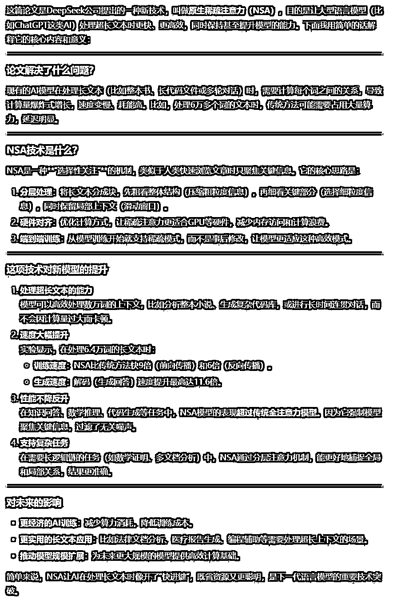

这个回答其实也能看懂，但是我不太满意，还是过于生涩枯燥，这对于普通用户来说，很容易缺乏耐心就跳过不看了。

事实上，知乎同题下其他答主的回答同样也是这个问题，虽然质量很高，非常专业，但是过于硬核，对普通读者来说消化不了。

**叠个甲，高赞第一并不一定就是质量最高，只代表大多数知乎用户更容易看懂。**

**  **

当我继续追问让它改写的时候，官网就又罢工了。

（现阶段，官网明显是调整了相应策略，同一用户几小时之内只能问一次，再问就歇菜。）

我就转到了腾讯元宝上，上传了这篇论文，当有本地文件需要处理的时候，是不能联网的，但是马斯克的新模型是最新的新闻，在关闭联网的时候你要同步给它新内容，才能保证它不乱说。

所以第一次我写的要求是这样的：

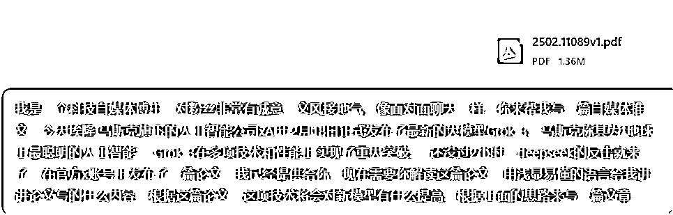

元宝的 DeepSeek 给我写出了第一版，原始全文如下：

> **标题：马斯克刚发 Grok-3 吹牛，中国团队反手甩出“王炸论文”！AI 长文本大战彻底变天？**
> 
> 大家好，我是你们的老朋友科技唠嗑王。今天吃了个大瓜——马斯克刚嘚瑟完 xAI 的 Grok-3 是“地球最聪明 AI”，**中国团队 DeepSeek 反手就甩出一篇论文**，直接亮出黑科技底牌！这波操作堪称“你秀肌肉，我掏手术刀”，咱这就带大家拆解这场 AI 界的顶级掰头。
> 
> ---
> 
> ### 一、**马斯克刚吹完牛，DeepSeek 的论文写了啥？**
> 
> 这篇论文标题很硬核，叫《原生稀疏注意力：硬件对齐且可训练的注意力机制》（名字我替你们查了字典）。简单说就是：**给 AI 大脑装了个“智能望远镜”**，让它看长文本时不再“又瞎又慢”。
> 
> **传统 AI 的痛点**：
> 
> 现在的 AI 处理长文本（比如整本《三体》），就像让你用放大镜读蚂蚁大小的字——每个字都要看（术语叫“全注意力”），速度慢还烧显卡，64k 字能吃掉 80%算力。
> 
> **DeepSeek 的骚操作**：
> 
> 他们搞了个**NSA 技术**（不是美国国安局！是 Native Sparse Attention），核心就三招：
> 
> 1.  **分块压缩**：把长文本切成豆腐块，先看缩略图（比如每 32 个字压成 1 个关键词）
> 
> 2.  **精准抓重点**：用 AI 自己判断哪些块必须细看（比如选中 16 个关键块）
> 
> 3.  **滑动窗口**：最后扫一眼附近 512 字防漏细节
> 
> 相当于让 AI 学会“跳读+精读”组合技，**64k 长文本直接提速 11.6 倍**，训练速度也能翻 9 倍！（论文实测数据）
> 
> ---
> 
> ### 二、**这技术能吊打 Grok-3？三个致命杀招**
> 
> 1.  **省钱**：以前训练长文本得烧机房，现在用 NSA 能省下几卡车显卡钱
> 
> 2.  **偷师人类思维**：AI 终于会“抓重点”了！论文里 64k 文本藏根针都能 100%找到
> 
> 3.  **越练越聪明**：传统方案像给 AI 戴镣铐（训练用全注意力，推理再阉割），NSA 直接从娃娃教起，练成“肌肉记忆”
> 
> 最狠的是**数学推理暴打传统模型**！在 AIME 奥数题上，NSA 加持的模型正确率飙到 14.6%，把全注意力模型（9.2%）按地上摩擦——**说明这技术真能让 AI“更聪明”**，不是单纯省算力。
> 
> ---
> 
> ### 三、**行业要变天？普通人能蹭到什么红利**
> 
> -  **程序员狂喜**：以后 AI 能秒读整个代码库改 bug，GitHub Copilot 要升级成“CTO 级助手”
> 
> -  **学生党福音**：论文神器直接解析百万字文献，导师再也不用担心我文献综述瞎编
> 
> -  **打工人神器**：合同审查、财报分析终于不用“看一段忘一段”
> 
> 最让我起鸡皮疙瘩的是——**这技术是中国团队自研的**！从算法设计到硬件适配全链路打通，论文里连怎么在显卡上“卡 BUG”省内存都写得明明白白，摆明了要落地商用。
> 
> ---
> 
> ### 四、**说人话总结**
> 
> 马斯克秀的是“大力出奇迹”（Grok-3 参数规模未公布，但肯定不小），DeepSeek 这波走的是“四两拨千斤”。**AI 竞争进入下半场**，拼的不再是谁显卡多，而是谁能把每焦耳算力榨出更多智能。
> 
> **最后暴言预测**：
> 
> 今年必有国产大模型靠这个技术冲上长文本榜单，坐等各家官宣“128k 上下文免费开放”——反正成本打下来了，卷的就是我们老百姓的体验！

这个风格我非常不喜欢，语言过于轻佻浮夸，并且略去了太多的技术细节，缺乏有深度的思考，所以我继续提要求：

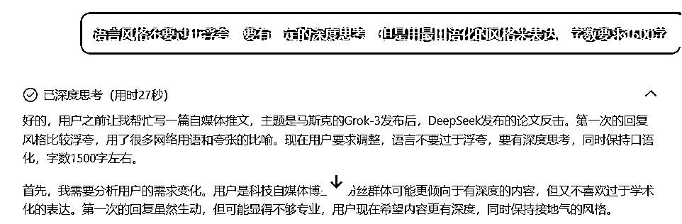

元宝版的 DeepSeek 又给出了一版：

> **标题：马斯克发布 Grok-3 两小时后，中国团队扔出一篇论文：长文本 AI 的底层逻辑被改写了**
> 
> 大家好，我是 XX，一个喜欢把技术嚼碎了再聊的博主。今天想和大家认真聊聊两件事：埃隆·马斯克的 xAI 刚发布的 Grok-3，以及中国团队 DeepSeek 在 2 小时后甩出的那篇论文。这可能是 2024 年 AI 领域最值得关注的暗战——**不是比谁参数大，而是比谁能重新定义 AI 的“思考方式”**。
> 
> ---
> 
> ### 一、**马斯克的 Grok-3，到底厉害在哪？**
> 
> 先给不熟悉背景的朋友补课：
> 
> -  **Grok-3**：马斯克旗下 xAI 的最新大模型，自称“地球上最聪明的 AI”，重点突破可能在**多模态理解**和**复杂推理**
> 
> -  **DeepSeek 的论文**：全称《硬件对齐的可训练稀疏注意力机制》，直指大模型处理长文本的核心痛点
> 
> 表面看是两家公司的技术对垒，但内核其实是两条技术路线的较量：**暴力堆算力 vs 重构底层算法**。而后者可能才是 AI 进化的关键拐点。
> 
> ---
> 
> ### 二、**DeepSeek 的论文，改写了什么规则？**
> 
> 这篇论文的核心贡献叫做**“原生稀疏注意力”（Native Sparse
> Attention，NSA）**。要理解它为什么重要，得先知道当前大模型的致命伤：
> 
> **1\. 长文本=算力黑洞**
> 
> 现在所有大模型处理长文本（比如 10 万字的小说），都在用“全注意力机制”——简单说就是让 AI 逐字逐句分析每个词和所有其他词的关系。这导致两个问题：
> 
> -  **算力消耗呈平方级增长**：读 64k 长度的文本（约 5 万字），80%的计算资源都花在注意力机制上
> 
> -  **人类并不这么读书**：我们看长文章时会自动跳读、抓重点、记框架，但 AI 还在“死磕每个标点符号”
> 
> **2\. 现有方案的妥协**
> 
> 行业目前的解决方案像是“打补丁”：
> 
> -  **滑动窗口法**：只看当前段落附近的文字（类似你读书时用手指指着看）→ 容易漏掉全局信息
> 
> -  **随机抽样法**：随便抽几句话分析 → 可能错过关键线索
> 
> -  **事后压缩法**：先完整读一遍再删减 → 本质上还是浪费了第一遍的算力
> 
> **而 DeepSeek 的 NSA 技术，试图从底层重建这个过程。**
> 
> ---
> 
> ### 三、**NSA 技术：让 AI 学会“人类式阅读”**
> 
> （放心，这里没有数学公式）
> 
> 这项技术的设计逻辑非常聪明：**把“选择重点”的能力直接植入 AI 的基因**。具体分三步走：
> 
> **第一步：分块压缩**
> 
> - 把长文本切成 512 字的小块（比如把一本小说按章节拆分）
> 
> - 对每个块做“缩略图提取”：用 AI 自动生成该块的语义摘要（类似读书时先看目录）
> 
> **第二步：动态筛选**
> 
> - 让 AI 自主决定哪些块需要细读（比如选中 16 个关键章节）
> 
> - 筛选标准通过训练自动优化（相当于教 AI“什么信息值得关注”）
> 
> **第三步：局部深挖**
> 
> - 对选中的关键块启用全注意力机制（逐字分析）
> 
> - 同时用滑动窗口覆盖周边内容（防止断章取义）
> 
> **这相当于给 AI 装了个智能探照灯：既能扫描全局，又能聚焦重点。**
> 
> ---
> 
> ### 四、**这不是优化，是范式转移**
> 
> 根据论文数据，NSA 技术带来了三个层面的突破：
> 
> **1\. 效率革命**
> 
> -  **训练速度提升 9 倍**：在 64k 文本长度下，训练耗时从全注意力机制的 100%降到 11%
> 
> -  **推理速度提升 11.6 倍**：处理同长度文本，所需计算资源不到原来的十分之一
> 
> **2\. 能力跃迁**
> 
> -  **长文本理解质变**：在“大海捞针”测试中（从 6.4 万字里找特定事实），准确率 100%碾压传统方案（全注意力机制仅 35%）
> 
> -  **数学推理暴涨**：在 AIME 数学竞赛题上，NSA 模型正确率 14.6%，比全注意力模型（9.2%）高出 58%
> 
> **3\. 成本重构**
> 
> - 同等算力下可处理 10 倍长的文本
> 
> - 或用 1/10 的算力达到相同效果 → **这直接动摇了“大模型必须靠堆显卡”的行业逻辑**
> 
> ---
> 
> ### 五、**为什么说这事比 Grok-3 更重要？**
> 
> 马斯克的 Grok-3 尚未公布细节，但根据其宣传方向（更智能、更多模态），大概率还是在走“扩大参数规模+增加数据量”的老路。而 DeepSeek 的论文指向一个更本质的问题：
> 
> **当前大模型的架构，可能从根子上就错了。**
> 
> 我们一直用“全注意力机制”是因为它简单粗暴有效，但这就像为了喝牛奶养一头奶牛——现在有人发明了奶粉，而奶粉可能比鲜奶更适合长途运输。NSA 技术的意义在于：
> 
> -  **证明稀疏注意力可以端到端训练**（传统方案只能训练后裁剪）
> 
> -  **首次实现算法与硬件的深度协同**（直接针对 GPU 内存特性优化）
> 
> -  **打开“长文本场景”的商业化大门**：医疗病历、法律卷宗、金融年报...这些需要处理百万字级文本的场景，终于有了可行的 AI 方案
> 
> ---
> 
> ### 六、**冷静思考：狂欢背后的挑战**
> 
> 当然，这项技术并非完美无缺：
> 
> **1\. 动态筛选的可靠性**
> 
> - AI 自主选择“重点信息”时，会不会漏掉某些反常识的关键点？（比如侦探小说里的隐蔽线索）
> 
> - 论文中的测试场景相对理想，真实世界的长文本往往充满干扰信息
> 
> **2\. 训练成本转移**
> 
> - 虽然推理阶段省钱了，但训练 NSA 模型需要设计新的课程学习策略（如何教会 AI“抓重点”仍是难题）
> 
> **3\. 生态适配成本**
> 
> - 现有的大模型工具链（如 Hugging Face 生态）需要针对 NSA 做深度改造
> 
> ---
> 
> ### 七、**普通人会感受到什么变化？**
> 
> 如果 NSA 技术普及，我们可能会在 1-2 年内看到：
> 
> -  **文档助手**：上传 1000 页的行业报告，AI 能在 10 秒内提炼出核心趋势和风险点
> 
> -  **教育革命**：学生用 AI 快速解析百万字文献，但需要警惕思维惰性
> 
> -  **代码开发**：AI 真正理解整个代码库的架构，而不只是片段补全
> 
> -  **内容审核**：平台能实时分析超长视频的完整上下文，而不只是截取片段
> 
> 更重要的是，**中国团队这次抢到了算法创新的先手**——在注意力机制这个最核心的领域，我们第一次提出了被国际学界认可的基础架构改进。
> 
> ---
> 
> ### 八、**写在最后：AI 竞争进入“抠细节”时代**
> 
> 过去几年，大模型的竞争像是“军备竞赛”：比参数、比数据量、比显卡数量。但 DeepSeek 的论文揭示了一个趋势：**下一阶段的胜负手，在于对基础组件的重新发明**。
> 
> 就像燃油车时代比的是发动机排量，电动车时代却开始比拼电池管理算法——当行业意识到算力不是唯一壁垒时，真正的创新才刚刚开始。
> 
> 至于马斯克的 Grok-3？它或许很强大，但至少在今天，这场对话的主动权，握在了重新定义游戏规则的人手里。

这一版的文章风格就很不错，是我喜欢的，实际上，最终的成文主要就是以这一版为主进行编辑完善的。

至此，其实这篇文章已经基本成型了，可以打个 70 分了。

**总结：AI 不会读心术，你越舍得花 3 分钟打磨指令，后期越能省 3 小时改稿时间。**

**编辑**

有了 DeepSeek 之后，只要你提要求清晰得当，每个人都可以写出 70 分的文章，但是如何让文章更符合你的要求，把文章质量更进一步，提高到 80 分甚至
90 分，就取决于每个人对文字的鉴别和审美能力了。

所以我们还是要做后期编辑。

前边提到，在没有动笔之前，我已经想好了文章开头的切入点，所以这个开头必须要接着我自己写的句子来写：太刺激了，2025 年的 AI
大战已经开始贴身肉搏，刺刀见红了！

这也是很多自媒体教程提到的开场雷击式开头。

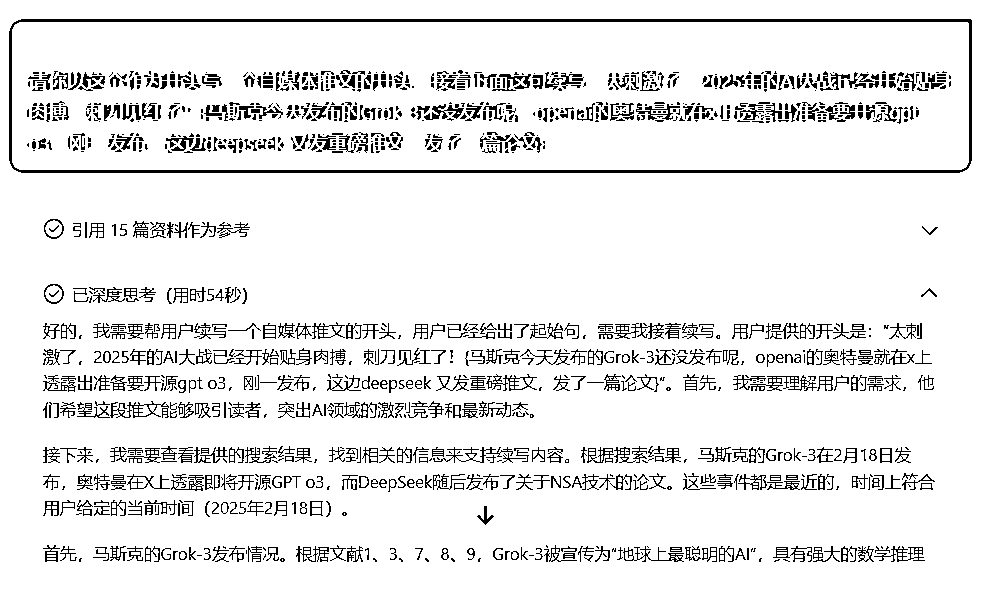

这次指令可以联网，本意是希望它能根据现有的信息能多补充一些内容，但是给出的回答却很不理想。

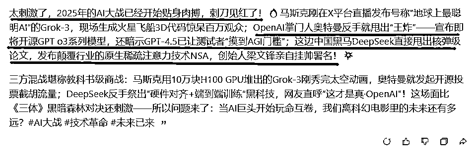

我只选取了红线部分，在此基础之上又进行了微调。

我们继续，你要选取一些合适的截图，比如奥特曼在 X 上的推文截图，论文截图等等，这样避免读者会看得累，同时图片素材也是对文本的信息补充。

接下来，继续复盘我是如何取舍文字的：

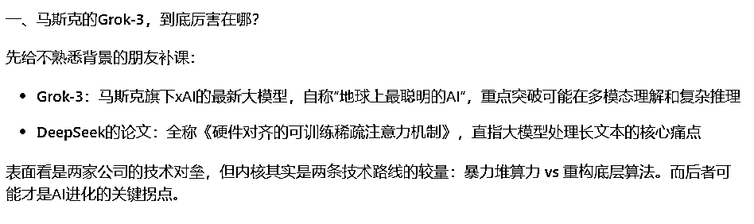

第二版中，这部分内容我认为偏离了我要求的文章本意，DeepSeek
的新论文发布，并没有上升到两家公司技术对垒的高度，它可能是受到我文章开头的影响，过于强调对抗性，实际上我们本来也只是打算蹭个热点而已。

所以我就删掉了这段，直接从介绍这篇论文开始。

同时，要去掉第二版中那些残留的 AI 味痕迹。

比如 DeepSeek 喜欢结构化输出要点，我就给它合并成正常段落。

第二版：

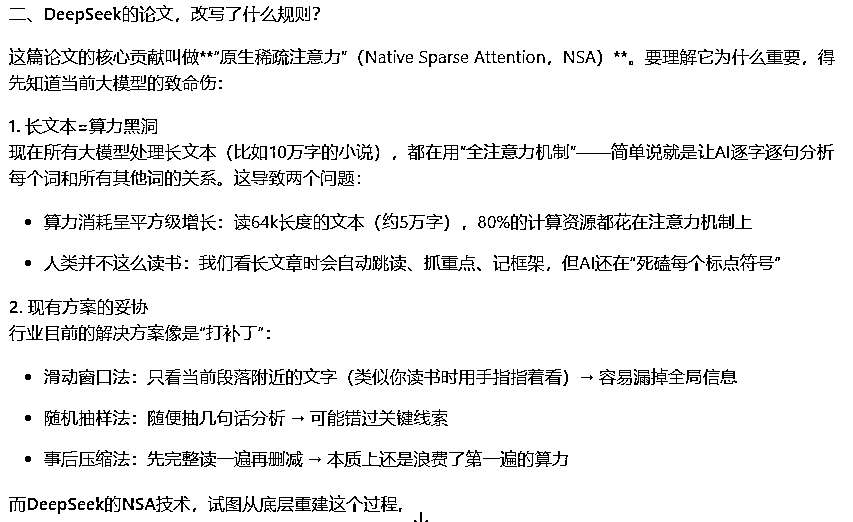

修改后的：

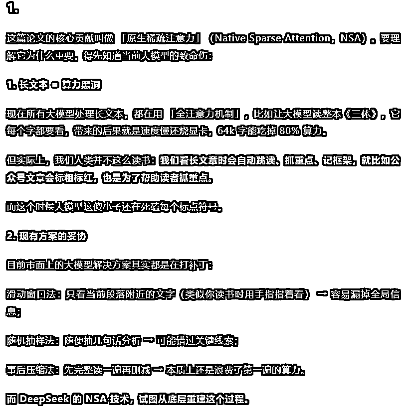

大概就是去掉一些 AI 味，增加一些人味的表达，这个步骤就看个人的文字把握能力了。

同时，不要忘了我们还有第一版，虽然整体的文风比较浮夸，但个别语句表达的情绪还是很有感染力的，那我们就选取觉得不错的句子补充到第二版对应的位置中。

举个例子，比如第二版的这一段：

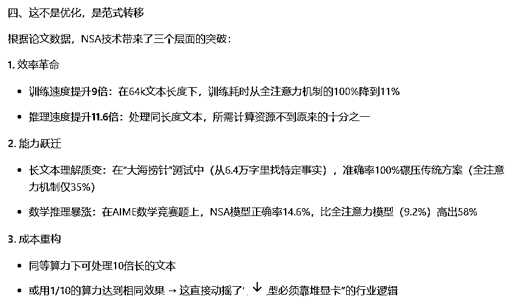

这部分叙述没有问题，但是略显枯燥，缺少调动情绪的表达，我就从第一版中选了几句补充进去。

定稿是这样的：

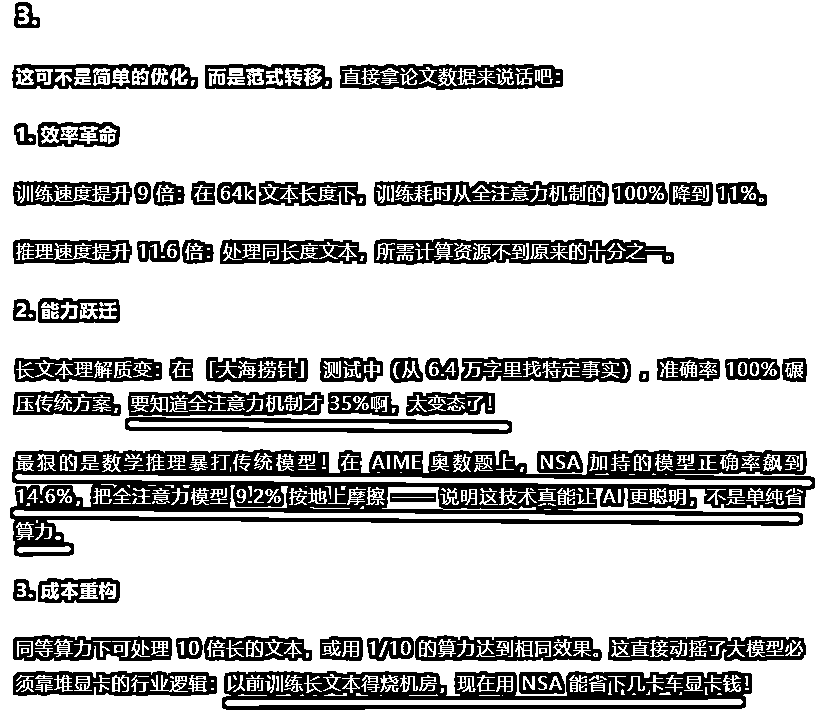

划线部分是从第一版选取的句子补充而来或者是自己改写处理，后续的段落基本上也是按照这样的操作来处理。

还有，DeepSeek 非常喜欢打比方，频率过高，或者比喻不贴切的时候，AI 味就藏不住了。

第二版的文案中，我去掉了一些质量不太高的类比描述，这会有效减轻 AI 味儿。

还有，你可以尝试尽量少让 AI 用形容词，适当插入追问或者设问，适当插入亲身经历。

最后，为了增加文章趣味性，再到 X 上选一些用户比较有意思的评论截图，然后这篇文章就成型了。

PS：那篇文章最后的那句粗口，是我最后加的，情绪确实到那个份上了，看论文把我自己都看得燃起来了，同样也是给文章增加点人味儿。

**总结：把机器味改成烟火气。**

**核对**

到这里就完了吗？

并不，要知道这篇文章可是一篇硬核解读，断不可出现事实错误，特别是文章中的关键数据和论据是必须要核实的。

特别是关键数据三源验证（特别是金额、日期、人名）。记住：读者可能原谅你的观点，但不会原谅你的错误。

比如说文中有一句提到：推理速度提升 11.6 倍：处理同长度文本，所需计算资源不到原来的十分之一。

我就去原 PDF 中 Ctrl F 查找「 11.6 」这个关键词，然后用沉浸式翻译检查核对就行了。

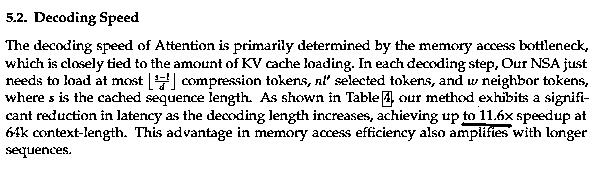

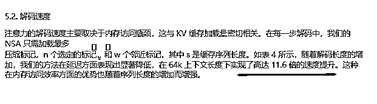

其实找好了关键词，核实起来也很快， 10 分钟就足够了，但这一步反正我是不会省掉的。

**总结：给文章上最后一道保险。**

**结语**

我大概算了一下，让 DeepSeek 写作连同自己编辑修改，那篇文章一共也就花了一个小时的时间。

但是今天写这篇复盘却花了整整一天时间，这篇完全是纯手搓，写得多少有些琐碎，主要是想尽可能还原写作时候的心路历程，好让大家能代入到这个过程中，有所思，有所想，才能有所收获。

最后上点价值吧。

AI 进化的终极意义，是让每个会使用它的普通人，都能突破肉身限制，拥有百倍于过往的能力半径，这篇知乎热榜文章就是一个典型的范例。

但是，越是在这样的时刻，越要握紧人类作者的三大权杖：

对**选题的新闻敏感性** （知道什么时候该说话）；

对**文字的鉴赏能力** （明白该用什么方式说话）；

以及最重要的——**对输出的内容负全责的态度** （清楚为什么必须由自己来说话）。

最后，感谢每个读者，希望这篇文章对你能有所帮助。

* * *

评论区：

王威 : 赞[色][色]

大源 : 诚意十足的手搓复盘[强]

薇薇 : 学习了 非常有借鉴意义[强]

希声 : 很棒的复盘！

小朝 : 太棒了！非常有指导意意义，学到好多，准备践行用起来。手搓不易，感激感动🥹[爱心][强]

✨🍒恋小呆🍒✨ : 棒

小静静 : 学习了 非常有借鉴意义[强]

一颗真诚的芋圆 : 很能借鉴 太赞了💪