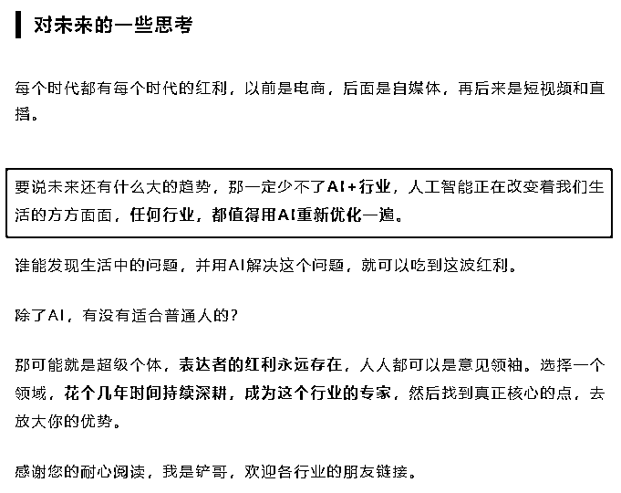
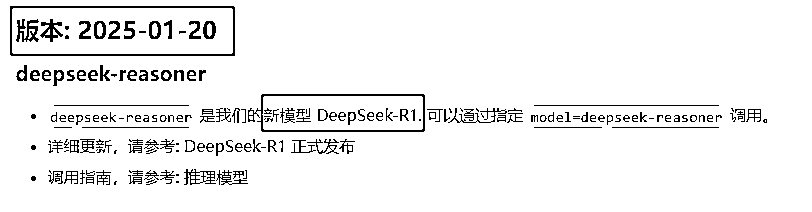
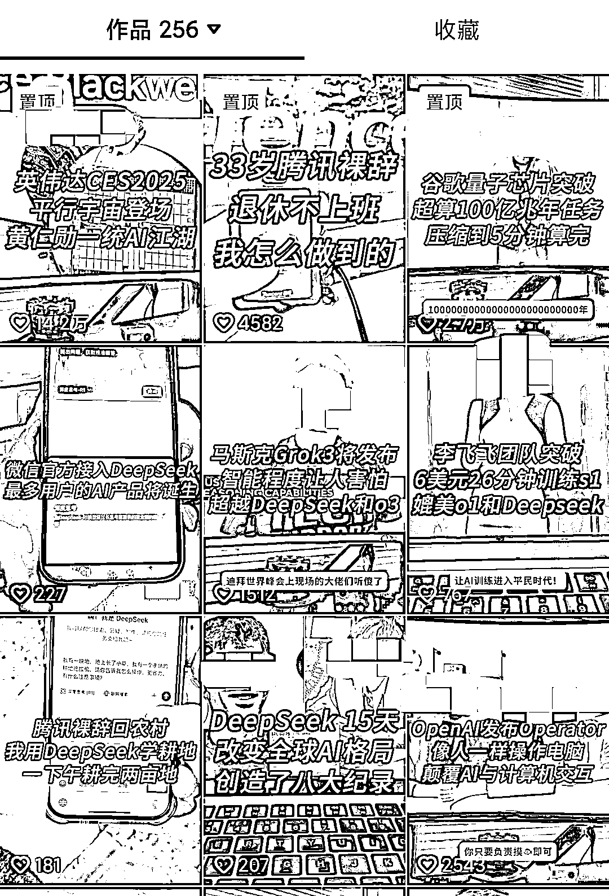
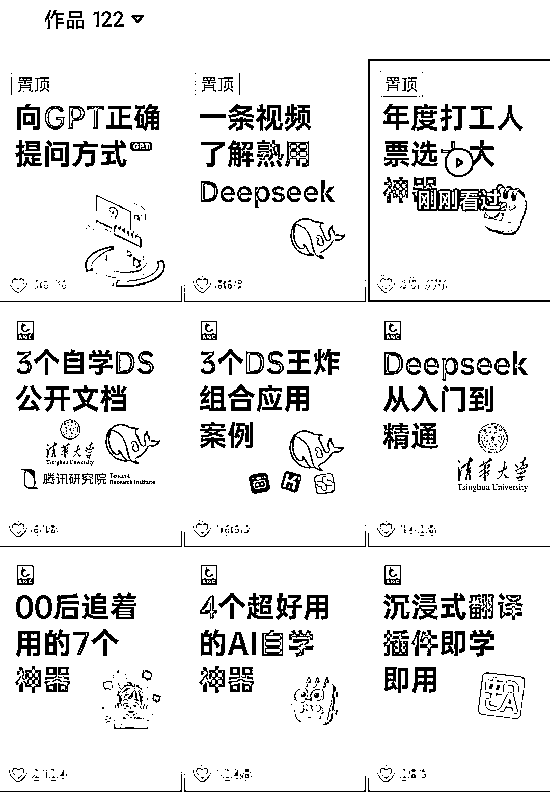
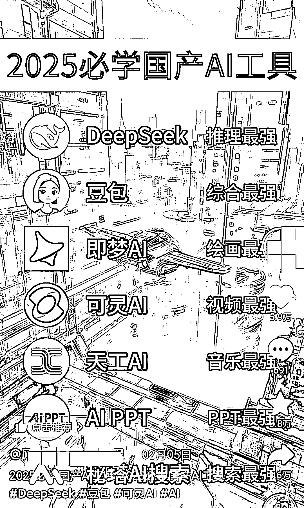
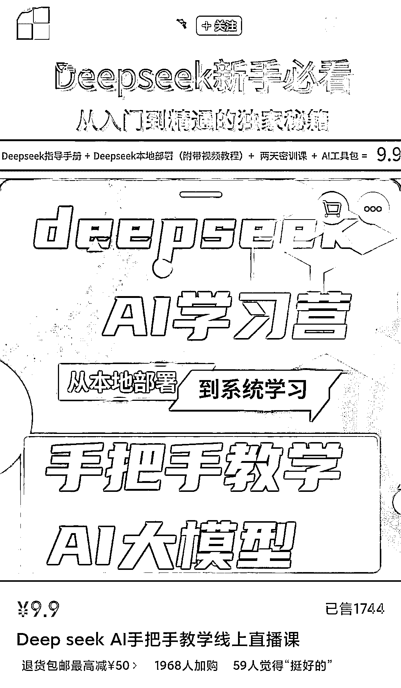
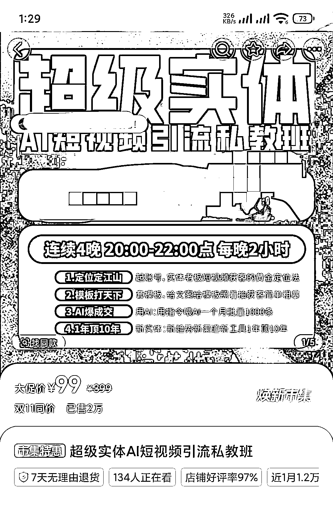
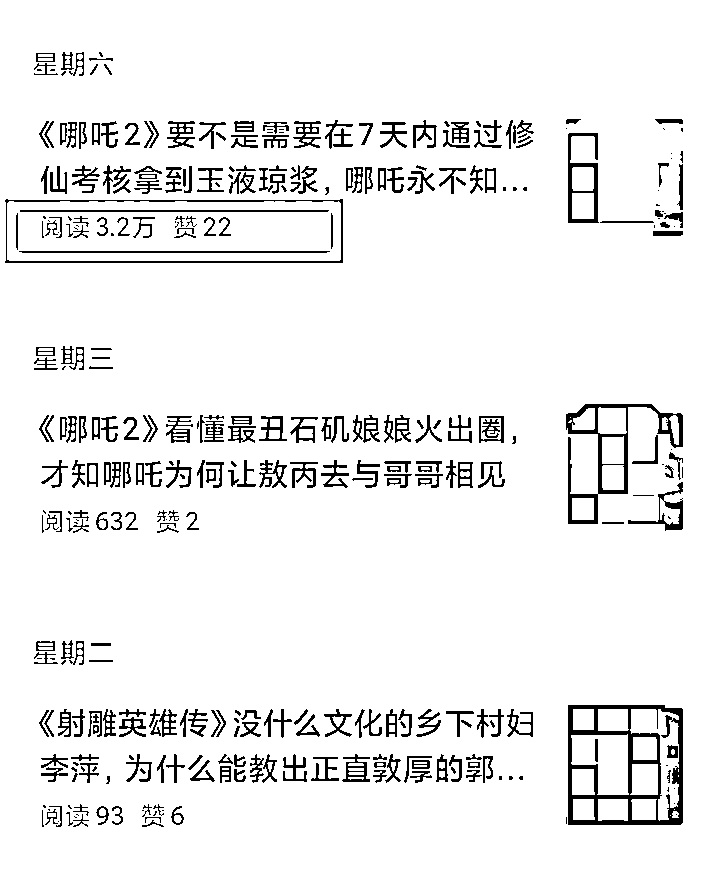
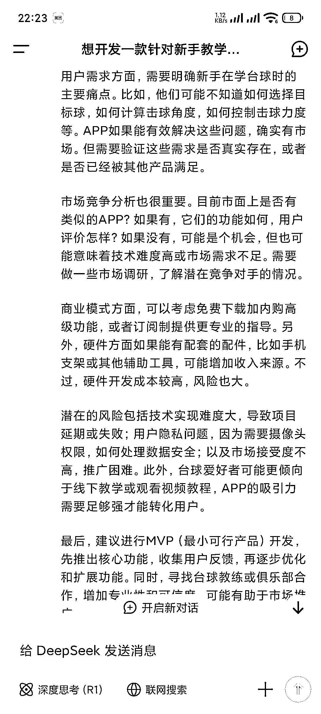

# DeepSeek 爆火下，存在哪些机会？普通人如何抓住 AI 机遇分一杯羹？

> 原文：[`www.yuque.com/for_lazy/zhoubao/rd2v1vlmw1uif915`](https://www.yuque.com/for_lazy/zhoubao/rd2v1vlmw1uif915)

## (精华帖)(115 赞)DeepSeek 爆火下，存在哪些机会？普通人如何抓住 AI 机遇分一杯羹？

作者： 铲哥带你飞

日期：2025-02-19

现在的 AI，在我看来，是属于妥妥的红利期，这是一个值得深耕 10 年的赛道！

普通人要想分一杯羹，首先你要在牌桌上。先通过 AI 赚一些“小钱”，等待 AI 的商业模式成熟，顺势而为赚大钱。

这篇文章应该是普通人切入 AI 赛道，最有效的 6 大方向，涉及 AI 商单号、AI 直播+知识付费、AI+垂直赛道、AI+播放量收益、AI+编程等。

拆解的成功案例包括：AI 资讯号、AI 工具推荐号、AI 真人口播号、直播卖课、直播+互动收礼物、AI+任何行业+获客、AI 书单号、AI 成长号、游戏+知识、AI+公众号等。

更好的阅读效果，可以跳转飞书：[`bh5pm72xfy.feishu.cn/docx/IA3JdxBkaoncA6xwqF4cS0ktnPh?from=from_copylink`](https://bh5pm72xfy.feishu.cn/docx/IA3JdxBkaoncA6xwqF4cS0ktnPh?from=from_copylink)

* * *

**以下内容与飞书一致，可以根据阅读喜欢，自行选择。**

早在去年 7 月份，我就在一篇文章的最后，提到了 AI 所存在的红利期和机会，任何行业都值得用 AI 重新优化一遍！

文章链接：[23 岁赚到 100w，做互联网这十几年，我是如何一步一步成长起来的？](https://bh5pm72xfy.feishu.cn/docx/PQ96dC90Ao6FcJxlgBVcqZGEnaf)

毫无疑问，今年 DeepSeek 的这波 AI 热潮（R1 模型发布并爆火的时间是在今年 1 月份），直接验证了我的预测。

很多提前入局 AI 赛道的人，都赚的盆满钵满，短短几个月赚几十万上百万的大有人在，但别人赚的终究是别人的，做为互联网创业者，我们该如何入局才能分一杯羹呢？

# AI 商单号

自从 AI 爆火以后，各种 AI 产品的投流广告，简直是“杀疯了”！

 images.zsxq.com/FtEcsE8S0_48c7GH5GRR7UMxc_JL) images.zsxq.com/FhRsXk7S3IgPQzpjqBU2cr7wJRcF)

各大品牌方为了抢占用户市场（大品牌方要的是触达用户的渠道，建立用户心智，自媒体无疑是最佳选择），广告推广预算可谓是“挥金如土”。这些钱有很大一部分都流向了各大平台的创作者，AI 创业，让创作者先富起来了。

除了互联网大厂，还有非常多的 AI 产品，也会选择 AI 博主或者相关博主投放广告，比如：猫箱、星野。

相信大家都刷到过不少 AI 相关的产品广告，这样的情况以后只会越来越多，毕竟 AI 的红利期才刚刚开始，任何软件都可以用 AI 重新优化一遍，会有越来越多应用层面的产品，像雨后春笋一样，层出不穷，这些推广的钱会流向哪里，相必不言而喻了吧。

当然，并不是只有大 V 才能接到广告，垂直低粉反而更吃香，虽然每个账号只有几千几万的粉丝，但这类账号也是平台中最多的。

很多账号发布的合作内容，甚至都看不出来是接了广告，更像是普通人使用后，感觉不错后主动分享的，这种内容会更接地气，自然也更受到金主的喜欢。

这些主要通过接 AI 广告变现的账号，可以统称为 AI 商单号，后期还可以结合 AI 编程，自己推广自己的 AI 产品，形成闭环，一举两得。

虽然现在做的人比较多，赛道会有些卷，但正是因为如此，才说明这个赛道能够容纳的人足够多，丝毫不影响你进去分一杯羹，而且有太多可以参考的对标账号和内容，直接抄作业就行。

至于内容创作方面，除了用好 AI 辅助创作，最重要的就是做好选题，选题就和选品一样重要，直接定生死。只有做好了选题，才能持续创作新的内容。

在选题方面，尽量去做 AI 产品实际应用场景的内容，比如豆包+作业辅导、kimi+拍照解题、豆包+中英对译、豆包+小红书文案，这类内容是可以直接帮助用户解决实际问题的，种草效果会更好，品牌商很难不喜欢。

也可以直接做 AI 信息类，比如 AI 工具推荐，市面上有那么多的 AI 产品，根本不缺内容创作的方向。再比如 AI 资讯，只需要关注各个 AI 资讯渠道做整理，就可以不断创作新内容。

## 案例一：AI 资讯号

这类账号的内容制作起来比较容易，在内容方面，AI 完全就可以胜任。

我试着用最简单通俗的表达方式提问 AI，给出的结果已经很有营销号的味道了（需要开启联网搜索功能），如果把提示词改一改，告诉 AI 一些创作爆款文案的技巧，再投喂几篇爆款文案，效果会更好。

 images.zsxq.com/Fq14d56Qijcxm3YfTtT7w8uOXEkl) images.zsxq.com/FktwS-VW-sOj1cvsh9p3qrScy2jo)

但由于没有产品实质性的落地场景展示，接广告的概率和价格，没有下面几种内容的效果好，但是胜在内容制作简单，可以实现 SOP 流程化批量制作，号多的可以尝试一下。

## 案例二：AI 工具推荐号

这类账号比单纯的 AI 资讯要好很多，可以直接展示产品本身，并且市面上的 AI 产品层出不穷，可以有源源不断的创作题材。

比如豆包、Deepseek、kimi、元宝、通义、星火、文小言、即梦 AI、海螺 AI、可灵 AI、剪映、快影、度加剪辑等等，一口气就能找到一大堆，只要是加入了 AI 功能的工具或者网站，都可以推荐。

因为这类内容可以展示产品本身，所以也可以接到不少品牌商的广告。

## 案例三：AI 真人口播号

真人口播号，就是真人出镜读稿，最好可以再穿插一些相关的演示素材，内容创作成本很低，一个人一部手机一个提词器，就可以开搞，甚至稿子都是 AI 写的，后续变现可以通过接广告，也可以做知识付费。

 images.zsxq.com/FqjFcpcpXjF5A3oIXpGeoTS9cqz-) images.zsxq.com/Fr_FqfSQw-RNOTc6iQs-ucEYMhEC)

这类内容由于有真人出镜，会有一种面对面交流的感觉，天然就带有一种信任感，种草效果会很好。并且真人出镜这个门槛，可以过滤掉绝大多数的竞争者，在很大程度上也能防止被搬运。

# AI 直播+知识付费

这个算是目前最主流的变现方式之一，互联网上的任何新生产物，第一批赚钱的基本都是卖铲子的，比如做知识付费（社群、课程、陪跑、工具等）。

## 案例一：直播卖课

 ZJDZwroscP)

当然，这些 9.9 元的都是引流课，后面肯定会做低转高的转化，9.9 元是为了筛选出来真正对 AI 感兴趣，并且愿意付费的用户，这些直播间大部分都是素人直播，可复制性强。

当然，也有那种直接卖正价课的主播（大部分在 59-299 元之间），但是这种直播间对主播的要求相对较高，适合有直播经验的。

知识付费已经是一个很成熟的商业模式了，买家付费后觉得很值，博主也能赚到钱，反而是赚不到这些钱的，一个劲在哪喊割韭菜。

### 新手怎么做直播？

很多人一看到直播这两个字就打退堂鼓了，认为自己的水平做不了直播，实际上你有 7 分水平，你就可以去教那些只有 5-6 分的人。

先关注几个对标的直播间，看一下对方是怎么直播的，比如几点开播，播多长时间，然后把话术整理下来，总结成自己的直播间话术。

至于产品，如果有条件，可以把对方的产品也买下来研究研究，学会以后加上自己的观点优化一下，就是自己的产品了。除了时间成本，一部手机+一台电脑，基本就可以开始直播了。

## 案例二：直播+互动收礼物

AI 有很多智能体应用，尤其是互动类，天然就有做直播的优势，比如宝宝起名、姓名评测等。

 HHsaQezHK7gPLGPi) images.zsxq.com/FhukE8ydWlmcpwiKK_jQc7QWsOAq)

这种直播间互动性比较高，所以系统就会不断推流，观察了几个直播间，起号的时候是免费测试，流量上来了以后，就开始收礼物优先测试，一个礼物测试一次（一般都是几毛到 2 元），一会就收了几十个礼物。

由于刷了礼物，有沉没成本和好奇心驱动，所以直播间的停留数据也比较高，更利于起号。

目前这种类似的直播间都比较简陋，给出的评测结果也很简单。如果结合现在的 AI 解答，再做一个美观一些的界面，很难不吸引人。

 images.zsxq.com/FqGOuLsu3lCVpZ31iVJVM6pyfOOH) images.zsxq.com/FkUAS0bw46o0vO4ZC59Udi-K-iJM)

这种 AI 智能体的应用，现在开发起来也比较简单，即使是零基础，学习几天也能做出来，可以用扣子、腾讯云等平台，快速开发直播互动类的小软件。

有编程能力的，也可以接入硅基流动等平台的 API，或者借助 AI 编程工具（比如 Cursor）进行对接开发。

 images.zsxq.com/FnIj6lha23KgpKfE_pAv7-VOrY93) images.zsxq.com/FoyP1NDLJNVxl_3H0dVsCG59TKPc)

扣子：[`www.coze.cn/home`](https://www.coze.cn/home)

腾讯云：[`cloud.tencent.com/act/pro/deepseek-api`](https://cloud.tencent.com/act/pro/deepseek-api)

硅基流动：[`cloud.siliconflow.cn/models`](https://cloud.siliconflow.cn/models)

Cursor（AI 编程工具）：[`www.cursor.com/cn`](https://www.cursor.com/cn)

# AI+垂直赛道

内容越垂直，流量也就越精准，自然也就越赚钱，当其他人都在卷 AI 商单号的时候，你去做垂直领域，尤其是传统行业，简直就是降维打击。

## 案例一：AI+任何行业+获客

通过 AI 赋能行业获客，会是一个很不错的内容切入方向，比如 AI+家具+小红书获客，AI+美业+小红书获客等。

 Iid6QoNuAZGfYg1) images.zsxq.com/FpRogg356y8iI7oasg_-0gQKRtOh)

实体店的老板，最主要的需求就是获客，很多老板，你就只教他怎么通过 AI 写获客文案，就愿意花几千块来学习。还是那句话，信息差和信息茧房永远存在，你觉得很简单的东西，对于不懂的人来说：天呢！居然还可以这样，我太需要它了！

至于产品的价值，主要取决于你面对的是什么样的客户群体，如果你教的是 DeepSeek 的用法，那就只能收几十几百的，甚至用户还要考虑一下值不值。

但如果教的是通过 AI 在小红书帮助老板获客，应该收多少呢？虽然这种内容的流量可能不多，但是我们不能只看流量，很多变现能力很强的账号，流量并不是很大。不同的用户群体，消费能力是不一样的，我们要的是变现能力，而不是大爆款！

## 案例二：AI 书单号

书单号可谓是经久不衰，因为读书这个需求是永远存在，变的无非是内容形式，只要能持续产出优质内容，变现不是问题。

之前想要写一篇读书文案，可能需要自己把书读一遍，现在有了 AI 的辅助，只要给出书名和一些参考文案，AI 就能快速创作出一篇短视频文案，并且写的是又快又好。

近期就观察到一批账号，通过 AI 写读书文案，再通过 AI 来配音，AI 绘画做背景素材的打法，出了不少几十万点赞的作品，流量相当可观。

 XhEECU0HLfcplX_74_OH2PXZ) images.zsxq.com/Ft2KkiJtsP8A75ASP1YpEDk3PCL5)

变现方式最直接的就是播放量收益，其次是带书和接新书宣发，也有些账号在做收徒。只要有流量，变现的方法有很多，而这一切的前提是：先有流量。

## 案例三：AI 成长号

AI 在知识类的内容创作中有非常大的优势，尤其是在快速整合信息、生成结构式的内容方面。比如：“一个人废掉的本质”、“学校不教的 30 条社会经验”、“可以改变一生的 20 个顶级思维”。

下面这种成长类的账号，大多数以 AI 文案+AI 配音为主，因为人都是渴望成长的，虽说大部分人都是看完后扔进收藏夹里吃灰，但并不影响创作者可以通过这类内容变现。

 images.zsxq.com/FiU999CxEYeYkd1575b0lLsuMEEh) images.zsxq.com/FtU6ETbTsCodXWMeS-8c87uuYRxo) images.zsxq.com/FpM4ggqFjzINUNudO9ex7IRjUfJR)

不得不说，AI 现在的写作水平，已经超过至少 80%的人了，毕竟大部分人都是“消费者”，而非“创造者”。很多问题，AI 给出的回答，即使是我，也很难写出来。

比如我让 AI 以：厉害的人都是反人性的，为标题，创作一篇短视频文案，即使没有投喂相关的参考内容，AI 给出的结果也是又快又好。我试着用 AI 又写了几篇文案，AI 回答结果，基本已经到了可以直接拿来用的程度。

 images.zsxq.com/Fs3l6Y3XSW2QgDVRWk-7MvW_QWvT) images.zsxq.com/Fo-HoyF4X3434oIi4ULzBy74l-XE)

除了这种成长号，也可以做各种垂领域的知识号，甚至你可以对这个领域“一无所知”，AI 也能写出相当优质的内容，比如认知提升、历史解读等等。

AI 时代，传统的知识积累已经在快速贬值了，内容创作的门槛也已经被无限拉低，把 AI 当做是自己的超级大脑，用来辅助创作各种知识类的内容，会是一个相对不错的方向。

# AI 播放量收益

这个方向可以做的内容就太多了，比如：“历史类：吕布和赵云谁更厉害”、“冷知识类：99%的人都不知道的冷知识”、“好奇心类：AI 破解未解之谜”、“解说类：AI 电影解读”等等。

AI 在各种写作技巧上的运用上，远比想象中的更强大，按照这些脚本持续创作，很难不出大爆款。

有网感的应该不难看出来，就下面 AI 回答的内容，无论是标题还是黄金 3 秒开头，没有个三五年的自媒体写作经验，很难写出来，而 AI 只用了不到 1 分钟。

 images.zsxq.com/Fvxin8rawzPU2eR-4Oc87J8uOQL6) images.zsxq.com/Filce5y_DjBBmHrg_SzjeCbXaHtm)

包括前面讲到的 AI 成长号，都可以通过内容的播放量，拿各大自媒体平台的创作激励（主要是广告分佣），这个是最简单的变现模式，非常适合新人练手。

## 案例一：游戏+知识

比如下面这种账号就很有意思，把枯燥的知识和游戏结合起来，既可以拿播放量收益，还可以推广游戏本身，拿推广收益。

 images.zsxq.com/FkVGFOLGHDy7xMoCn2Zgt1ELlUQE) images.zsxq.com/FnnQ_4GERw7TEQyBn7m64vmjv7HF)

先说优点：只管创作内容即可，无需任何产品，也不需要和广告主沟通，只要作品存在，并且有播放量，就可以拿分成，即使是在睡觉也有收入，同一份内容还可以分发到多个平台，拿多个平台的收益。

因为门槛比较低，适合绝大多数的普通人，所以后期还可以通过培训放大（铲哥的卖铲子思维又被触发了）。

说完优点，再来说说缺点：因为是靠内容播放量拿收益，所以需要不断地创作新内容，一旦停止创作新内容，收益就会不断下跌。

不过现在有了 AI 的加持，内容创作的效率已经非常高了，只要解决内容持续产出和账号的问题，这个赛道还是很不错的，基本就是“躺赚”。

## 案例二：AI+公众号

内容创作方面和前面的一样，唯一不同的是平台推流机制，建议去寻找那些平常阅读量一般，但是突然有一两篇或者多篇文章，飙升到上万甚至 10 万+阅读的内容。

说明这种内容的主要流量来源，不是来自于粉丝，而是公众号的公共流量，然后使用 AI 工具，创作该领域的内容。

内容挖掘的入口，主要是这 4 种：看一看、搜一搜（需要有关键词）、公众号入口的个性化推荐、以及每篇文章下面的相关推荐。

 images.zsxq.com/FqkTXf0UipUIBJKrdwloeNDIwIf3) images.zsxq.com/FsGD1HVc7y-LYBRwtJTlE_0AwDkf)

AI 工具方面推荐使用：

1.  DeepSeek，官网：[chat.deepseek.com](http://chat.deepseek.com)

2.  腾讯元宝，官网：[yuanbao.tencent.com/chat](http://yuanbao.tencent.com/chat)

3.  知乎直答，官网：[zhida.zhihu.com](http://zhida.zhihu.com)

国外的 AI，会用的肯定早就用上了，所以不做推荐，这三个都是国内可以直接使用的，除了 DeepSeek，另外两个可能很多人没有用过。

这里给大家做个科普，个人认为，目前国内文章内容质量最高的几个平台，除了付费圈子，剩下的就是微信公众号和知乎。

但是微信公众号的内容是封闭的，搜索引擎搜不到，但是腾讯元宝可以，而知乎最大的特点就是高质量内容，本身就有优势，并且这两个平台现在都接入了 DeepSeek。

 images.zsxq.com/FuhfUCVRv0cAZ8sT1XITdEBFvKcY) images.zsxq.com/FuNFq5-0qsL-Kk0kWGEYle8tff6a)

## 主流视频分成平台：

抖音、视频号、哔哩哔哩、西瓜视频、YouTube（油管）

## 主流图文分成平台：

公众号、头条号、百家号、企鹅号、知乎

# AI 编程

除了做各种自媒体账号，AI 编程也是一个很有潜力的方向，AI 编程和各种 AI 工作流平台的出现，让普通人也可以通过短时间的学习，用自然语言就可以从零开发出一款软件，把自己的想法变成产品。

目前看到比较多成功案例是开发 ios
app 和 AI 智能体的小程序，用的大部分是 Cursor（AI 编程工具）、扣子（AI 工作流），这两款工具，感兴趣的可以搜索一下相关的教程，推荐 B 站和公众号。

比较推荐的开发方向是 AI 智能体，以及 AI 相关的产品，比如 AI 起名小程序、AI 健身教练、AI 小红书文案等等。

但是要注意一个陷阱：不要陷入技术思维，先完成再完美！优先开发最核心的功能，先解决“必须要有”的问题，推出第一个“能用”的版本，再根据用户的反馈去迭代升级，而不是一口气做出来一个复杂的成品软件，结果用户不买单。

## 入手方向一

如果没有任何编程基础，更推荐先去做 AI 商单号，等 AI 商单号的流量做起来了，再用 AI 编程去开发自己的产品，从流量到产品，直接形成了闭环。

流量＞产品，好产品不一定卖得好，但是推广好的产品，一定卖的不差。做产品，流量是永远绕不开的话题，不然等到产品开发好了，不知道怎么推广也白搭，任何项目，都建议从获取流量入手。

等到跑通整个流程以后，还可以用卖铲子思维，去做自媒体账号，赚那些想通过 AI 编程来掘金人的钱，变现就更简单了，课程、陪跑，随便一个都可以。

## 入手方向二

从需求和调研入手！而不是一上来就去开发产品，可以多去看看各大自媒体平台相关内容的评论区，尤其是点赞比较多的评论（点赞越多，说明有相同需求的人数也就越多），可能会有不错的发现。

 images.zsxq.com/FsgC_9KWZG4rzEicNntMxFlsmm1h) images.zsxq.com/FrtFm1EWDsyAtUp76lMGguUvjI7s)

最后把自己的想法提问 AI，让 AI 给一些建议，再综合考虑是否要做。

比如前段时间，我就问了 AI 几个想法，其中一个是：“想开发一款针对新手教学台球的 APP，打开 APP 后，会调用摄像头，用户选择大号或者小号球后，AI 会自动给出最优的方案和路线，这个 APP 有市场吗？”

因为当时在打台球，自己是纯新手，不知道该怎么打，出于对商业的敏感度，所以就发现了这个需求，AI 给出了非常专业的回答和思维拓展。

之后我把 AI 台球这个关键词，输入到了各大自媒体平台的搜索框中，居然真的找到了更成熟的产品。翻看了一下内容的评论区，感兴趣的人不在少数，这个产品很适合给台球厅引流，全国那么多的台球厅，市场肯定是有的。

做产品，调研是必不可少的环节，如果调研结果可以，再去考虑把产品开发出来，记得先做最小 MVP 测试。

只要肯观察，在日常生活中就能发现非常多的需求，你遇到每一个问题，背后往往都是成千上万的人也会遇到的问题，如果这个需求还没有被满足，并且用户愿意为此付费，那就存在机会。

赚钱就是在生活中发现问题，创造出一种可以解决这个问题的产品或者服务。比如扫地麻烦，就有了扫地机器人，洗碗太累就有了洗碗机。

# AI 值得深耕 10 年

据我观察，即使已经出现了各种成功变现案例，大部分人也都还是在观望，只有少部分嗅到商机，并且有执行力的人，才已经提前布局或者正在做。

DeepSeek 说白了就是国外的 Chatgpt，之所以今年才火起来，是因为有着不输于 Chatgpt 的能力，而且国内可用，最主要还是开源的，所以爆火是必然的。

AI 确实是未来，但是也不用焦虑，信息茧房的存在，让大部分的人，到现在都没用过 Chatgpt 和 DeepSeek，甚至都没听说过，这并不是猜测，而是事实。

所以，DeepSeek 只是一个开始，它只是一个底层模型，在应用层面，大家也都是在摸索中，真正的赚钱机会还在后面！

现在的 AI 妥妥属于红利期，AI 的出现甚至不亚于互联网的出现，这是一个值得深耕 10 年的赛道。

不过目前看来，真正通过 AI 赚到钱的，还是之前在 Chatgpt 出现时，就赚到钱的那波人。所以提前布局才是关键，先通过 AI 赚一些“小钱”，等待 AI 的商业模式成熟，顺势而为赚大钱。

要想分一杯羹，首先你要在牌桌上，才有机会。只有亲自下场去感受它，去使用它，你才能在里面找到一些商业机会。

* * *

评论区：

11 : 说的太好了

浅笑 : AI 商号

上上签 : [爱心][爱心][爱心]

江河 : 写得太全太棒了！[强]

莫村长 : 很有收获