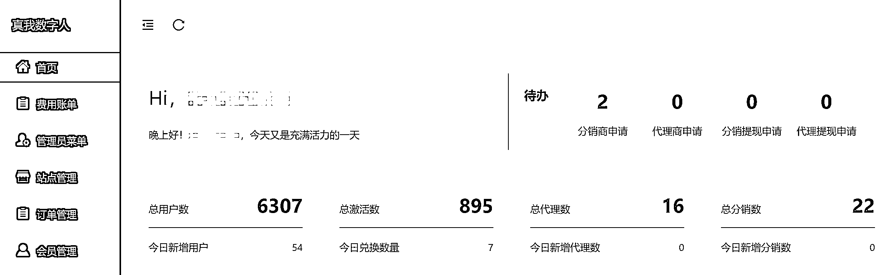

# 复盘：数字人项目从 0 终于跑到了 0.5...

> 原文：[`www.yuque.com/for_lazy/zhoubao/isb9goxxi0feda3i`](https://www.yuque.com/for_lazy/zhoubao/isb9goxxi0feda3i)

## (精华帖)(58 赞)复盘：数字人项目从 0 终于跑到了 0.5...

作者： 新侠

日期：2025-02-17

在 24 年 10 月份发现“对口型数字人”这个异常值，然后 1 个月时间完成工具搭建，并初步跑通成交闭环，我对数字人这个项目进行了第一次复盘，也有幸加精。

还没看过的小伙伴可以先看一下前传，哈哈。

Reference：[数字人+短视频，工具类细分赛道可行性研究](https://wx.zsxq.com/group/1824528822/topic/2858244212444551)

到现在已过去了快 4 个月，来和大家分享一下进度。

今天看了一下后台数据，目前总激活会员数量在 895，除掉其中体验会员外，正式会员数量大概在 150 人左右，勉勉强强算是跑通了 0.5，距离我对从 0 到 1 的彻底跑通的期望，还差了不少。

这其中又是踩了 N 多个坑，让我原本以为搭上风口就能一飞冲天的想法，也慢慢回归了理性。

本想着完全跑通从 0 到 1 再来复盘，过完年，本是难得给自己放松一下，但对于这个项目的一些思考和规划却一个又一个往外蹦，索性还是写一写，既是复盘总结，也算是 25 年的工作规划吧。

目录：

一、踩坑反思

二、回归正轨

三、项目规划

以下正文，enjoy

[`jinhuaclub.feishu.cn/wiki/OxbNw9RWHimZsukRgZbcjNfonXg?from=from_copylink`](https://jinhuaclub.feishu.cn/wiki/OxbNw9RWHimZsukRgZbcjNfonXg?from=from_copylink)

* * *

评论区：

暂无评论